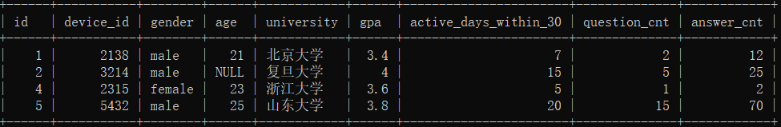
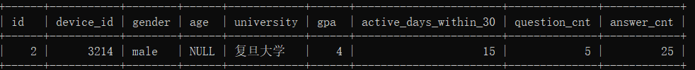
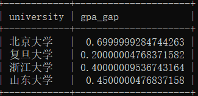
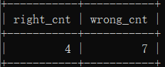

# 第1题：

```mysql
drop database if exists chapter10db1;
create database chapter10db1;
use chapter10db1;

drop table if  exists `question_practice_detail`;
CREATE TABLE `question_practice_detail` (
`id` int ,
`device_id` int ,
`question_id`int ,
`result` varchar(32) 
);
INSERT INTO question_practice_detail VALUES(1,2138,111,'wrong');
INSERT INTO question_practice_detail VALUES(2,3214,112,'wrong');
INSERT INTO question_practice_detail VALUES(3,3214,113,'wrong');
INSERT INTO question_practice_detail VALUES(4,6543,111,'right');
INSERT INTO question_practice_detail VALUES(5,2315,115,'right');
INSERT INTO question_practice_detail VALUES(6,2315,116,'right');
INSERT INTO question_practice_detail VALUES(7,2315,117,'wrong');
INSERT INTO question_practice_detail VALUES(8,5432,118,'wrong');
INSERT INTO question_practice_detail VALUES(9,5432,112,'wrong');
INSERT INTO question_practice_detail VALUES(10,2131,114,'right');
INSERT INTO question_practice_detail VALUES(11,5432,113,'wrong');

drop table if exists `user_profile`;
CREATE TABLE `user_profile` (
`id` int ,
`device_id` int ,
`gender` varchar(14) ,
`age` int ,
`university` varchar(32) ,
`gpa` float,
`active_days_within_30` int ,
`question_cnt` int ,
`answer_cnt` int 
);


INSERT INTO user_profile VALUES(1,2138,'male',21,'北京大学',3.4,7,2,12);
INSERT INTO user_profile VALUES(2,3214,'male',null,'复旦大学',4.0,15,5,25);
INSERT INTO user_profile VALUES(3,6543,'female',20,'北京大学',3.2,12,3,30);
INSERT INTO user_profile VALUES(4,2315,'female',23,'浙江大学',3.6,5,1,2);
INSERT INTO user_profile VALUES(5,5432,'male',25,'山东大学',3.8,20,15,70);
INSERT INTO user_profile VALUES(6,2131,'male',28,'山东大学',3.3,15,7,13);
INSERT INTO user_profile VALUES(7,4321,'male',28,'复旦大学',3.6,9,6,52);
```


- 第一行表示:id为1的用户的常用信息为使用的设备id为2138，在question_id为111的题目上，回答错误
- ....
- 最后一行表示:id为11的用户的常用信息为使用的设备id为5432，在question_id为113的题目上，回答错误


- 第一行表示:id为1的用户的常用信息为使用的设备id为2138，性别为男，年龄21岁，北京大学，gpa为3.4在过去的30天里面活跃了7天，发帖数量为2，回答数量为12
  。。。
- 最后一行表示:id为7的用户的常用信息为使用的设备id为4321，性别为男，年龄26岁，复旦大学，gpa为3.6在过去的30天里面活跃了9天，发帖数量为6，回答数量为52

## （1）查看所有来自浙江大学的用户题目回答明细情况

现在运营想要查看所有来自浙江大学的用户题目回答明细情况，请你取出相应数据

提示：

- 使用子查询在user_profile表中查询出“浙江大学”的用户"device_id"值
- 在question_practice_detail表中筛选"device_id"等于上面查询结果的答题记录


```mysql
SELECT * 
FROM question_practice_detail 
WHERE device_id in (SELECT device_id FROM user_profile WHERE university = '浙江大学');
```

## （2）查看题目答错的所有用户信息



```mysql
SELECT * 
FROM user_profile 
WHERE device_id IN (SELECT device_id FROM question_practice_detail WHERE result='wrong');
```

## （3）查询gpa最高的用户信息



```mysql
SELECT * 
FROM user_profile
WHERE gpa = (SELECT MAX(gpa) FROM user_profile);
```

## （4）查询每个大学平均gpa值与所有用户最高gpa值的差距



```mysql
SELECT university, 
	(SELECT MAX(gpa) FROM user_profile) - AVG(gpa) AS gpa_gap
FROM user_profile
GROUP BY university;
```

## （5）分别查询答题结果为“right"和"wrong"的答题次数



```mysql
SELECT 
 (SELECT COUNT(*) FROM question_practice_detail WHERE result='right')  AS right_cnt,
 (SELECT COUNT(*) FROM question_practice_detail WHERE result='wrong') AS wrong_cnt;

或

SELECT SUM(IF(result='right',1,0)) AS right_cnt,
	   SUM(IF(result='wrong',1,0)) AS wrong_cnt
FROM question_practice_detail;
```

