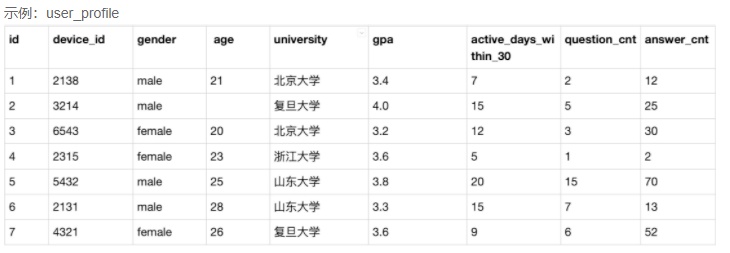
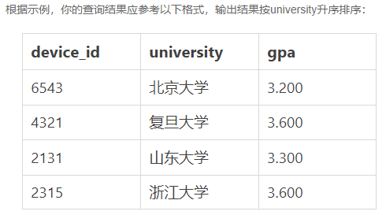
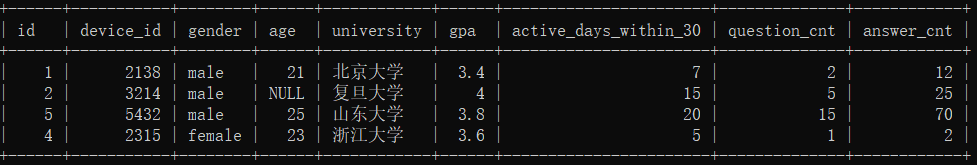

## 第1题：每个学校的最低gpa

```mysql
drop database if exists chapter12db1;
create database chapter12db1;
use chapter12db1;

drop table if exists user_profile;
CREATE TABLE `user_profile` (
`id` int ,
`device_id` int ,
`gender` varchar(14),
`age` int ,
`university` varchar(32),
`gpa` float,
`active_days_within_30` int ,
`question_cnt` int ,
`answer_cnt` int 
);
INSERT INTO user_profile VALUES(1,2138,'male',21,'北京大学',3.4,7,2,12);
INSERT INTO user_profile VALUES(2,3214,'male',null,'复旦大学',4.0,15,5,25);
INSERT INTO user_profile VALUES(3,6543,'female',20,'北京大学',3.2,12,3,30);
INSERT INTO user_profile VALUES(4,2315,'female',23,'浙江大学',3.6,5,1,2);
INSERT INTO user_profile VALUES(5,5432,'male',25,'山东大学',3.8,20,15,70);
INSERT INTO user_profile VALUES(6,2131,'male',28,'山东大学',3.3,15,7,13);
INSERT INTO user_profile VALUES(7,4321,'male',28,'复旦大学',3.6,9,6,52);
```



题目：现在运营想要找到每个学校gpa最低的同学来做调研，请你取出每个学校的最低gpa。

提示：

（1）通过窗口函数实现，窗口中的数据按照大学分组，按照gpa值升序排列

（2）取出每一个大学记录row_number()为1的记录。



```mysql
SELECT device_id, university, gpa
FROM (
    SELECT *,
    row_number() over (PARTITION BY university ORDER BY gpa) AS rn
    FROM user_profile
) AS univ_min
WHERE univ_min.rn=1;
```

## 第2题：查询每个学校gpa最高的同学信息

```sql
drop database if exists chapter12db2;
create database chapter12db2;
use chapter12db2;

drop table if  exists `question_practice_detail`;
CREATE TABLE `question_practice_detail` (
`id` int ,
`device_id` int ,
`question_id`int ,
`result` varchar(32) 
);
INSERT INTO question_practice_detail VALUES(1,2138,111,'wrong');
INSERT INTO question_practice_detail VALUES(2,3214,112,'wrong');
INSERT INTO question_practice_detail VALUES(3,3214,113,'wrong');
INSERT INTO question_practice_detail VALUES(4,6543,111,'right');
INSERT INTO question_practice_detail VALUES(5,2315,115,'right');
INSERT INTO question_practice_detail VALUES(6,2315,116,'right');
INSERT INTO question_practice_detail VALUES(7,2315,117,'wrong');
INSERT INTO question_practice_detail VALUES(8,5432,118,'wrong');
INSERT INTO question_practice_detail VALUES(9,5432,112,'wrong');
INSERT INTO question_practice_detail VALUES(10,2131,114,'right');
INSERT INTO question_practice_detail VALUES(11,5432,113,'wrong');

drop table if exists `user_profile`;
CREATE TABLE `user_profile` (
`id` int ,
`device_id` int ,
`gender` varchar(14) ,
`age` int ,
`university` varchar(32) ,
`gpa` float,
`active_days_within_30` int ,
`question_cnt` int ,
`answer_cnt` int 
);


INSERT INTO user_profile VALUES(1,2138,'male',21,'北京大学',3.4,7,2,12);
INSERT INTO user_profile VALUES(2,3214,'male',null,'复旦大学',4.0,15,5,25);
INSERT INTO user_profile VALUES(3,6543,'female',20,'北京大学',3.2,12,3,30);
INSERT INTO user_profile VALUES(4,2315,'female',23,'浙江大学',3.6,5,1,2);
INSERT INTO user_profile VALUES(5,5432,'male',25,'山东大学',3.8,20,15,70);
INSERT INTO user_profile VALUES(6,2131,'male',28,'山东大学',3.3,15,7,13);
INSERT INTO user_profile VALUES(7,4321,'male',28,'复旦大学',3.6,9,6,52);
```




```mysql
SELECT id,device_id,gender,age,university,gpa,active_days_within_30,question_cnt,answer_cnt
FROM (
    SELECT *,
    RANK() over (PARTITION BY university ORDER BY gpa DESC) AS rn
    FROM user_profile
) AS univ_max
WHERE univ_max.rn=1;
```

