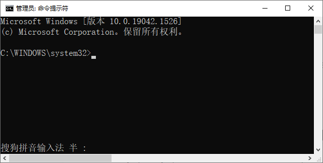

**==以下是windows命令的练习==**，在如下cmd命令行窗口中练习：（要求用管理员身份运行cmd窗口）



## 1、mysql服务停止

net stop mysql服务名（忘了服务名的可以去系统服务列表查看）

例如：

```command
net stop mysql80
```

## 2、mysql服务启动

net start mysql服务名（忘了服务名的可以去系统服务列表查看）

例如：

```
net start mysql80
```

## 3、命令行客户端连接登录mysql服务

mysql -h mysql服务器主机名 -P 端口号 -u 用户名 -p
Enter password:密码

例如：

```
mysql -h localhost -P 3306 -u root -p
Enter password:123456
```

