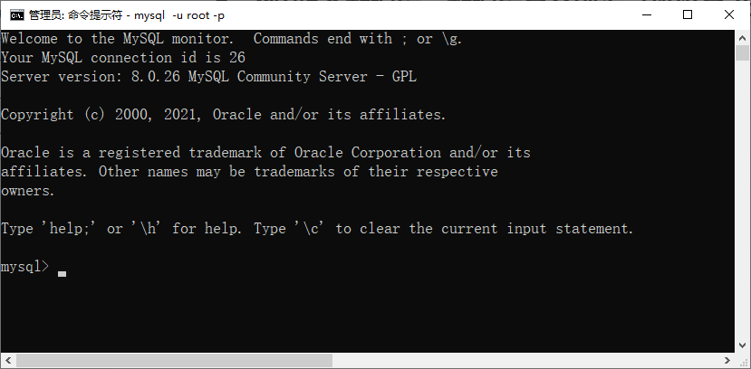
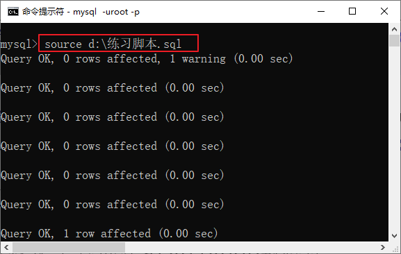
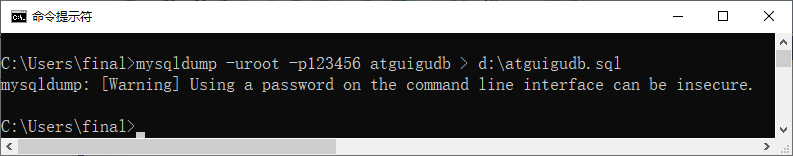

**==以下是SQL练习==**，必须登录mysql才能执行，在如下窗口下运行：



## 1、查看所有的数据库

```sql
show databases;
```

## 2、创建2个数据库：数据库名分别为（班级名db和atguigudb）

```sql
create database 20220106db;
create database atguigudb;
```

## 3、删除1个数据库：删除班级名db这个数据库

```sql
drop database 20220106db;
```

## 4、使用数据库atguigudb

```sql
use atguigudb;
```

## 5、在数据库atguigudb下创建一个表格 tb_stu

在数据库atguigudb下创建一个表格 tb_stu，
这个表格的字段有学号(sid)和姓名(sname)，
数据类型分别为int和varchar(20)，

```sql
create table tb_stu(
	sid int,
	sname varchar(20)
);
```

## 6、在数据库atguigudb下创建一个表格 tb_tea

在数据库atguigudb下创建一个表格 tb_tea
这个表格的字段有工号(tid)和姓名(tname)，
数据类型分别为int和varchar(20)，

```sql
create table tb_tea(
	tid int,
	tname varchar(20)
);
```

## 7、查看数据库atguigudb下所有表格

```sql
show tables;
show tables from atguigudb;
```

## 8、查看tb_stu和tb_tea这2个表格的结构

```sql
desc tb_stu;
desc tb_tea;
```

## 9、添加2条记录到tb_stu，一个是自己，一个是组长

```sql
insert into tb_stu values(1,'张三');
insert into tb_stu values(2,'李四');
```

## 10、添加2条记录到tb_tea，一个是讲师，一个是班主任

```sql
insert into tb_tea values(1,'讲师姓名');
insert into tb_tea values(2,'班主任姓名');
```

## 11、查看tb_stu和tb_tea这2个表格的数据

```sql
select * from tb_stu;
select * from tb_tea;
```

## 12、删除表格tb_tea

```sql
drop table tb_tea;
```

## 13、查看数据库atguigudb下所有表格

```sql
show tables;
show tables from atguigudb;
```

## 14、使用source命令导入“练习脚本.sql”

```mysql
source d:\练习脚本.sql
```



## 15、导出“atguigudb”数据库

```cmd
mysqldump -uroot -p密码 atguigudb > d:\atguigudb.sql
```

