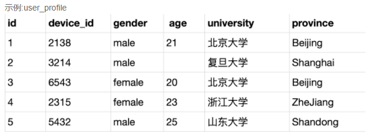
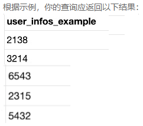
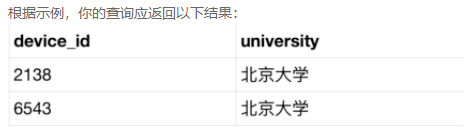
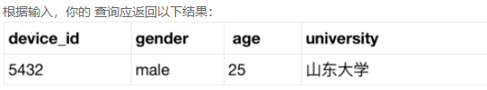
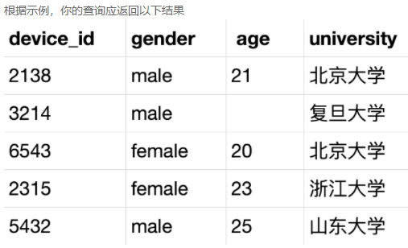
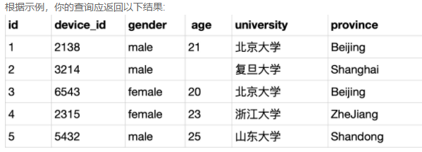
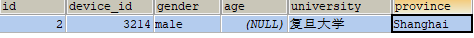
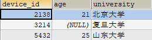
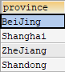

# 第1组：user_profile表

user_profile表的sql脚本，直接粘贴到客户端执行即可：

```mysql
drop database if exists chapter5db;
create database chapter5db;
use chapter5db;

drop table if exists user_profile;
CREATE TABLE `user_profile` (
`id` int,
`device_id` int,
`gender` varchar(14),
`age` int ,
`university` varchar(32),
`province` varchar(32));


INSERT INTO user_profile VALUES(1,2138,'male',21,'北京大学','BeiJing');
INSERT INTO user_profile VALUES(2,3214,'male',null,'复旦大学','Shanghai');
INSERT INTO user_profile VALUES(3,6543,'female',20,'北京大学','BeiJing');
INSERT INTO user_profile VALUES(4,2315,'female',23,'浙江大学','ZheJiang');
INSERT INTO user_profile VALUES(5,5432,'male',25,'山东大学','Shandong');
```



解释：id（编号）、device_id（设备ID），gender（性别），age（年龄）、university（大学名称），province（省份）

## （1）题目：从用户信息表中取出学校的去重数据

现在运营需要查看用户来自于哪些学校，请从用户信息表中取出学校的去重数据。


```mysql
select DISTINCT university from user_profile;
```


## （2）题目：查看用户明细设备ID数据，并将列名显示为 'user_infos_example'

现在你需要查看用户明细设备ID数据，并将列名显示为 'user_infos_example',请你从用户信息表取出相应结果。



```mysql
SELECT device_id user_infos_example FROM user_profile;
```

## （3）题目：查询university是北京大学的设备ID

现在运营想要筛选出所有北京大学的学生进行用户调研，请你从用户信息表中取出满足条件的数据，结果返回设备id和学校。



```mysql
SELECT device_id,university FROM user_profile WHERE university = '北京大学';
```


## （4）题目：查询年龄大于24用户的设备ID、性别、年龄、学校

现在运营想要针对24岁以上的用户开展分析，请你取出满足条件的设备ID、性别、年龄、学校。



```mysql
SELECT device_id,gender,age,university FROM user_profile WHERE age>24;
```


## （5）题目：查询所有用户的设备id、性别、年龄、学校

现在运营同学想要用户的设备id对应的性别、年龄和学校的数据，请你取出相应数据



```mysql
SELECT device_id,gender,age,university FROM user_profile;
```


## （6）题目：查询所有用户的数据

现在运营想要查看用户信息表中所有的数据，请你取出相应结果



```mysql
SELECT * FROM user_profile;
```

## （7）题目：查询省份是"shanghai"的用户信息

现在运营想要查看上海市用户的信息，请你取出相应的结果。

根据示例，你的查询应返回以下结果：



```mysql
SELECT * FROM user_profile WHERE province = 'shanghai';
```

## （8）题目：查询所有男性用户的设备ID、年龄、学校

现在运营想要查看所有男性用户的设备ID、年龄、学校，便于后期做数据分析。

根据示例，你的查询应返回如下结果：



```mysql
SELECT device_id,age,university FROM user_profile WHERE gender = 'male';
```

## （9）题目：从用户信息表中取出省份的去重数据

现在运营想要查看所有用户的省份分布情况，请从用户信息表中取出省份的去重数据。

根据示例，你的查询应返回如下结果：



```mysql
SELECT DISTINCT province FROM user_profile;
```

