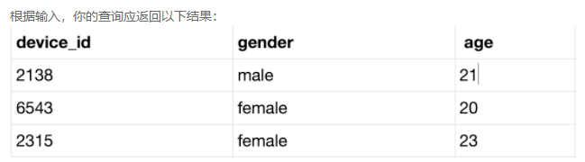
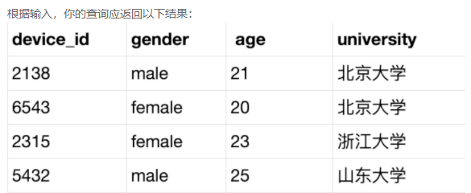
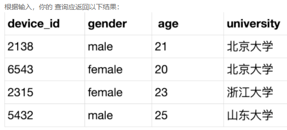
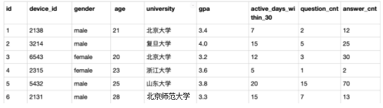
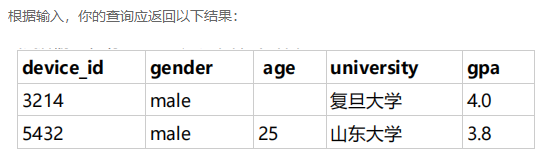
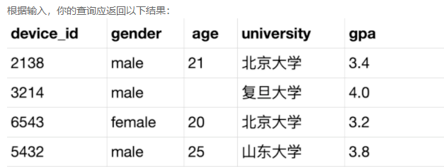
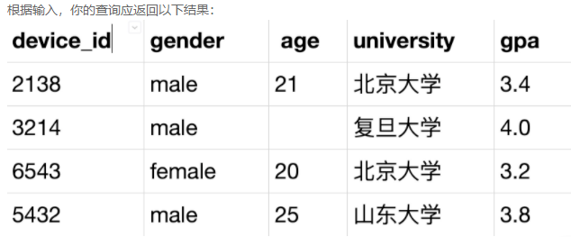
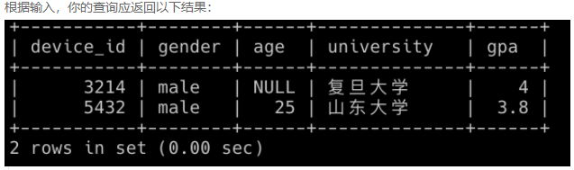
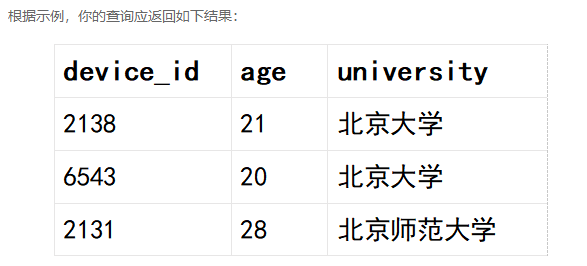

# 第1题：user_profile表脚本1

数据脚本：

```mysql
drop database if exists chapter6db1;
create database chapter6db1;
use chapter6db1;

drop table if exists user_profile;
CREATE TABLE `user_profile` (
`id` int,
`device_id` int,
`gender` varchar(14),
`age` int ,
`university` varchar(32),
`province` varchar(32));


INSERT INTO user_profile VALUES(1,2138,'male',21,'北京大学','BeiJing');
INSERT INTO user_profile VALUES(2,3214,'male',null,'复旦大学','Shanghai');
INSERT INTO user_profile VALUES(3,6543,'female',20,'北京大学','BeiJing');
INSERT INTO user_profile VALUES(4,2315,'female',23,'浙江大学','ZheJiang');
INSERT INTO user_profile VALUES(5,5432,'male',25,'山东大学','Shandong');
```


解释：id（编号）、device_id（设备ID），gender（性别），age（年龄）、university（大学名称），province（省份）

## （1）题目：查询年龄20岁及以上且23岁及以下用户的设备ID、性别、年龄

现在运营想要针对20岁及以上且23岁及以下的用户开展分析，请你取出满足条件的设备ID、性别、年龄。



```mysql
SELECT device_id,gender,age 
FROM user_profile 
WHERE age>=20 AND age<=23;

或

SELECT device_id,gender,age 
FROM user_profile 
WHERE age BETWEEN 20 AND 23;
```


## （2）题目：查询除复旦大学以外的所有用户的设备ID、性别、年龄、大学

现在运营想要查看除复旦大学以外的所有用户明细，请你取出相应数据



```mysql
SELECT device_id,gender,age,university 
FROM user_profile 
WHERE university != '复旦大学';

或

SELECT device_id,gender,age,university 
FROM user_profile 
WHERE university <> '复旦大学';

或

SELECT device_id,gender,age,university 
FROM user_profile 
WHERE university NOT IN( '复旦大学');
```


## （3）题目：查询年龄不为空的用户的设备ID，性别，年龄，学校的信息

现在运营想要对用户的年龄分布开展分析，在分析时想要剔除没有获取到年龄的用户，请你取出所有年龄值不为空的用户的设备ID，性别，年龄，学校的信息。



```mysql
SELECT device_id,gender,age,university 
FROM user_profile 
WHERE age IS NOT NULL;

或

SELECT device_id,gender,age,university 
FROM user_profile 
WHERE !(age <=> NULL);
```

# 第2题：user_profile表脚本2

数据脚本：

```mysql
drop database if exists chapter6db2;
create database chapter6db2;
use chapter6db2;

drop table if exists user_profile;
CREATE TABLE `user_profile` (
`id` int ,
`device_id` int,
`gender` varchar(14),
`age` int ,
`university` varchar(32),
`gpa` float,
`active_days_within_30` float,
`question_cnt` float,
`answer_cnt` float
);

INSERT INTO user_profile VALUES(1,2138,'male',21,'北京大学',3.4,7,2,12);
INSERT INTO user_profile VALUES(2,3214,'male',null,'复旦大学',4.0,15,5,25);
INSERT INTO user_profile VALUES(3,6543,'female',20,'北京大学',3.2,12,3,30);
INSERT INTO user_profile VALUES(4,2315,'female',23,'浙江大学',3.6,5,1,2);
INSERT INTO user_profile VALUES(5,5432,'male',25,'山东大学',3.8,20,15,70);
INSERT INTO user_profile VALUES(6,2131,'male',28,'北京师范大学',3.3,15,7,13);
```



解释：id（编号）、device_id（设备ID），gender（性别），age（年龄）、university（大学名称），province（省份），gpa（平均成绩）、active_days_within_30（30天内活跃天数）、question_cnt（发帖数量）、answer_cnt（回答数量）

例如：第一行表示:id为1的用户的常用信息为使用的设备id为2138，性别为男，年龄21岁，北京大学，gpa为3.4，在过去的30天里面活跃了7天，发帖数量为2，回答数量为12

## （4）题目：查询男性且GPA在3.5以上(不包括3.5)的用户的设备ID，性别、年龄、学校、gpa

现在运营想要找到男性且GPA在3.5以上(不包括3.5)的用户进行调研，请你取出相关数据。



```mysql
SELECT device_id,gender,age,university,gpa 
FROM user_profile 
WHERE gender='male' AND gpa>3.5;
```


## （5）题目：查询学校为北大或GPA在3.7以上(不包括3.7)的用户的设备ID，性别、年龄、学校、gpa

现在运营想要找到学校为北大或GPA在3.7以上(不包括3.7)的用户进行调研，请你取出相关数据（使用OR实现）



```mysql
SELECT device_id,gender,age,university,gpa 
FROM user_profile 
WHERE university='北京大学' OR gpa>3.7;
```


## （6）题目：查询学校为北大、复旦和山大用户的设备ID，性别、年龄、学校、gpa

现在运营想要找到学校为北大、复旦和山大的同学进行调研，请你取出相关数据。



```mysql
SELECT device_id,gender,age,university,gpa 
FROM user_profile 
WHERE university IN('北京大学','复旦大学','山东大学');
```


## （7）题目：查询gpa在3.5以上(不包括3.5)的山东大学用户 或 gpa在3.8以上(不包括3.8)的复旦大学同学

现在运营想要找到gpa在3.5以上(不包括3.5)的山东大学用户 或 gpa在3.8以上(不包括3.8)的复旦大学同学进行用户调研，请你取出相应数据。



```mysql
SELECT device_id,gender,age,university,gpa 
FROM user_profile 
WHERE (gpa>3.5 AND university = '山东大学') OR (gpa>3.8 AND university = '复旦大学');
```


## （8）题目：所有大学中带有北京的用户信息

现在运营想查看所有大学中带有北京的用户的信息，请你取出相应数据。



```mysql
SELECT device_id,age,university 
FROM user_profile 
WHERE university LIKE '%北京%';
```

