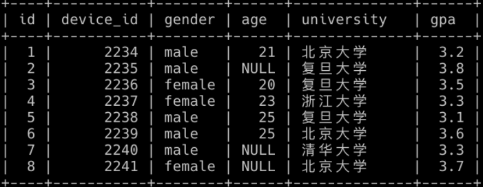
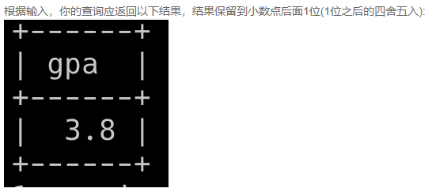
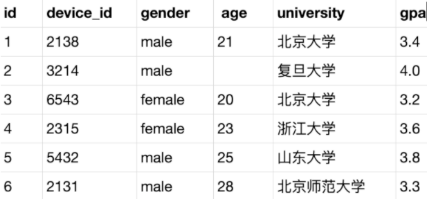
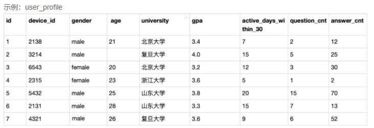
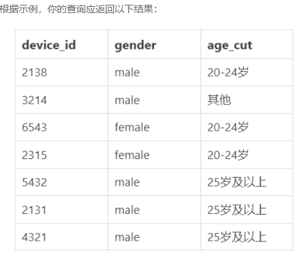
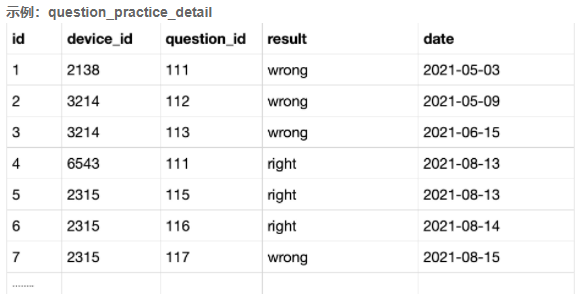
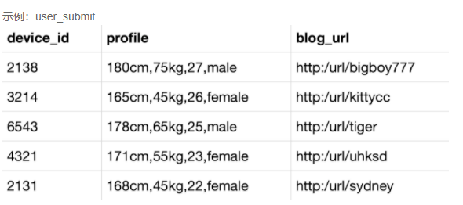
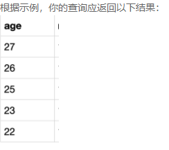
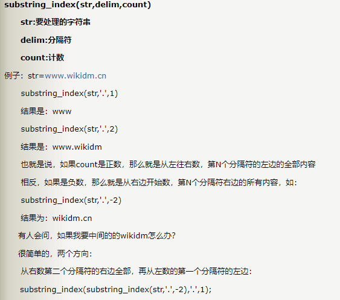
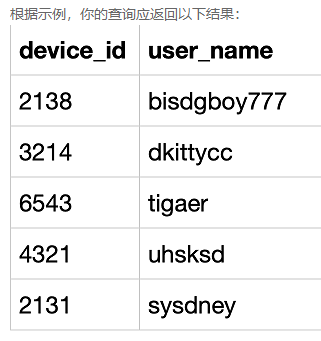

## 第1题：复旦大学学生gpa最高值是多少

题目1数据脚本：

```mysql
drop database if exists chapter7db1;
create database chapter7db1;
use chapter7db1;

drop table if exists user_profile;
CREATE TABLE `user_profile` (
`id` int ,
`device_id` int ,
`gender` varchar(14) ,
`age` int ,
`university` varchar(32) ,
`gpa` float);

INSERT INTO user_profile VALUES(1,2234,'male',21,'北京大学',3.2);
INSERT INTO user_profile VALUES(2,2235,'male',null,'复旦大学',3.8);
INSERT INTO user_profile VALUES(3,2236,'female',20,'复旦大学',3.5);
INSERT INTO user_profile VALUES(4,2237,'female',23,'浙江大学',3.3);
INSERT INTO user_profile VALUES(5,2238,'male',25,'复旦大学',3.1);
INSERT INTO user_profile VALUES(6,2239,'male',25,'北京大学',3.6);
INSERT INTO user_profile VALUES(7,2240,'male',null,'清华大学',3.3);
INSERT INTO user_profile VALUES(8,2241,'female',null,'北京大学',3.7);
```



现在运营想要知道复旦大学学生gpa最高值是多少，请你取出相应数据。结果保留到小数点后面1位(1位之后的四舍五入)



```mysql
SELECT MAX(gpa) 
FROM user_profile 
WHERE university='复旦大学';
```


## 第2题：男性用户有多少人以及他们的平均gpa是多少

题目2数据脚本：

```mysql
drop database if exists chapter7db2;
create database chapter7db2;
use chapter7db2;

drop table if exists user_profile;
CREATE TABLE `user_profile` (
`id` int,
`device_id` int ,
`gender` varchar(14) ,
`age` int ,
`university` varchar(32),
`gpa` float);
INSERT INTO user_profile VALUES(1,2138,'male',21,'北京大学',3.4);
INSERT INTO user_profile VALUES(2,3214,'male',null,'复旦大学',4.0);
INSERT INTO user_profile VALUES(3,6543,'female',20,'北京大学',3.2);
INSERT INTO user_profile VALUES(4,2315,'female',23,'浙江大学',3.6);
INSERT INTO user_profile VALUES(5,5432,'male',25,'山东大学',3.8);
INSERT INTO user_profile VALUES(6,2131,'male',28,'北京师范大学',3.3);
```



现在运营想要看一下男性用户有多少人以及他们的平均gpa是多少，用以辅助设计相关活动，请你取出相应数据。


```mysql
SELECT COUNT(gender), ROUND(AVG(gpa),1) 
FROM user_profile 
WHERE gender='male';

或

SELECT COUNT(*), AVG(gpa) 
FROM user_profile 
WHERE gender='male';
```

## 第3题：查看不同年龄段的用户明细

题目3数据脚本：

```mysql
drop database if exists chapter7db3;
create database chapter7db3;
use chapter7db3;

drop table if exists `user_profile`;
CREATE TABLE `user_profile` (
`id` int,
`device_id` int,
`gender` varchar(14) ,
`age` int ,
`university` varchar(32),
`gpa` float,
`active_days_within_30` int ,
`question_cnt` int ,
`answer_cnt` int 
);

INSERT INTO user_profile VALUES(1,2138,'male',21,'北京大学',3.4,7,2,12);
INSERT INTO user_profile VALUES(2,3214,'male',null,'复旦大学',4.0,15,5,25);
INSERT INTO user_profile VALUES(3,6543,'female',20,'北京大学',3.2,12,3,30);
INSERT INTO user_profile VALUES(4,2315,'female',23,'浙江大学',3.6,5,1,2);
INSERT INTO user_profile VALUES(5,5432,'male',25,'山东大学',3.8,20,15,70);
INSERT INTO user_profile VALUES(6,2131,'male',28,'山东大学',3.3,15,7,13);
INSERT INTO user_profile VALUES(7,4321,'male',28,'复旦大学',3.6,9,6,52);
```



题目：现在运营想要将用户划分为**20岁以下，20-24岁，25岁及以上**三个年龄段，分别查看不同年龄段用户的明细情况，请取出相应数据。（注：若**年龄为空**请返回**其他**。）



```mysql
SELECT device_id,gender,
    CASE
        WHEN age < 20 THEN '20岁以下'
        WHEN age BETWEEN 20 AND 24 THEN '20-24岁'
        WHEN age > 24 THEN '25岁及以上'
        ELSE '其他'
    END  AS age_cut
FROM user_profile;
```

## 第4题： 计算用户8月每天的练题数量

题目4数据脚本：

```mysql
drop database if exists chapter7db4;
create database chapter7db4;
use chapter7db4;

drop table if  exists `question_practice_detail`;

CREATE TABLE `question_practice_detail` (
`id` int,
`device_id` int,
`question_id`int ,
`result` varchar(32),
`date` date
);

INSERT INTO question_practice_detail VALUES(1,2138,111,'wrong','2021-05-03');
INSERT INTO question_practice_detail VALUES(2,3214,112,'wrong','2021-05-09');
INSERT INTO question_practice_detail VALUES(3,3214,113,'wrong','2021-06-15');
INSERT INTO question_practice_detail VALUES(4,6543,111,'right','2021-08-13');
INSERT INTO question_practice_detail VALUES(5,2315,115,'right','2021-08-13');
INSERT INTO question_practice_detail VALUES(6,2315,116,'right','2021-08-14');
INSERT INTO question_practice_detail VALUES(7,2315,117,'wrong','2021-08-15');
INSERT INTO question_practice_detail VALUES(8,3214,112,'wrong','2021-05-09');
INSERT INTO question_practice_detail VALUES(9,3214,113,'wrong','2021-08-15');
INSERT INTO question_practice_detail VALUES(10,6543,111,'right','2021-08-13');
INSERT INTO question_practice_detail VALUES(11,2315,115,'right','2021-08-13');
INSERT INTO question_practice_detail VALUES(12,2315,116,'right','2021-08-14');
INSERT INTO question_practice_detail VALUES(13,2315,117,'wrong','2021-08-15');
INSERT INTO question_practice_detail VALUES(14,3214,112,'wrong','2021-08-16');
INSERT INTO question_practice_detail VALUES(15,3214,113,'wrong','2021-08-18');
INSERT INTO question_practice_detail VALUES(16,6543,111,'right','2021-08-13');
```



题目： 现在运营想要了解2021年8月份所有练习过题目的总用户数和练习过题目的总次数，请取出相应结果。

提示：

- 一个device_id代表一个用户。
- 如果同一个用户答题2或多次，算一个用户。
- 每一条答题记录都算答题次数


```mysql
SELECT MONTH(DATE) AS `month`,
	COUNT(DISTINCT device_id) AS did_cnt,
	COUNT(question_id) AS question_cnt
FROM question_practice_detail
WHERE MONTH(DATE)=8 AND YEAR(DATE)=2021
GROUP BY MONTH(DATE);
```

## 第5题：查询男性参赛人数、查询参赛人年龄情况

题目5数据脚本：

```mysql
drop database if exists chapter7db5;
create database chapter7db5;
use chapter7db5;

drop table if exists user_submit;
CREATE TABLE `user_submit` (
`id` int,
`device_id` int,
`profile` varchar(100),
`blog_url` varchar(100)
);
INSERT INTO user_submit VALUES(1,2138,'180cm,75kg,27,male','http:/url/bisdgboy777');
INSERT INTO user_submit VALUES(1,3214,'165cm,45kg,26,female','http:/url/dkittycc');
INSERT INTO user_submit VALUES(1,6543,'178cm,65kg,25,male','http:/url/tigaer');
INSERT INTO user_submit VALUES(1,4321,'171cm,55kg,23,female','http:/url/uhsksd');
INSERT INTO user_submit VALUES(1,2131,'168cm,45kg,22,female','http:/url/sysdney');
```



现在运营举办了一场比赛，收到了一些参赛申请，表数据记录形式如下所示，现在运营想要统计男性的用户有多少参赛者，请取出相应结果


```mysql
SELECT 
	SUBSTRING_INDEX(PROFILE,",",-1) gender,
	COUNT(*) number
FROM user_submit
WHERE SUBSTRING_INDEX(PROFILE,",",-1) = 'male'
GROUP BY gender;
```

题目：现在运营想要统计参赛者年龄情况，请取出相应结果



```mysql
SELECT SUBSTRING_INDEX(SUBSTRING_INDEX(PROFILE,",",-2),",",1) age
FROM user_submit;
```




## 第6题：提取博客URL中的用户名

题目7数据脚本：

```mysql
drop database if exists chapter7db6;
create database chapter7db6;
use chapter7db6;

drop table if exists user_submit;
CREATE TABLE `user_submit` (
`id` int,
`device_id` int,
`profile` varchar(100),
`blog_url` varchar(100)
);
INSERT INTO user_submit VALUES(1,2138,'180cm,75kg,27,male','http:/url/bisdgboy777');
INSERT INTO user_submit VALUES(1,3214,'165cm,45kg,26,female','http:/url/dkittycc');
INSERT INTO user_submit VALUES(1,6543,'178cm,65kg,25,male','http:/url/tigaer');
INSERT INTO user_submit VALUES(1,4321,'171cm,55kg,23,female','http:/url/uhsksd');
INSERT INTO user_submit VALUES(1,2131,'168cm,45kg,22,female','http:/url/sysdney');
```


题目：对于申请参与比赛的用户，blog_url字段中url字符后的字符串为用户个人博客的用户名，现在运营想要把用户的个人博客用户字段提取出单独记录为一个新的字段，请取出所需数据。



```mysql
SELECT device_id,
    SUBSTRING_INDEX(blog_url, '/', -1) AS user_name
FROM user_submit;
```

