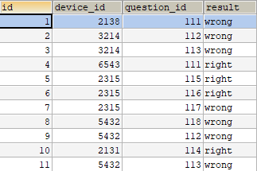
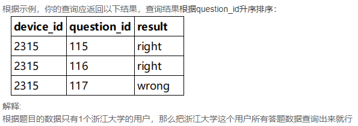
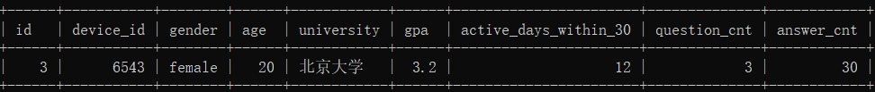
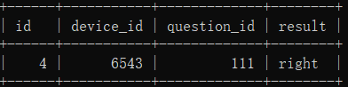
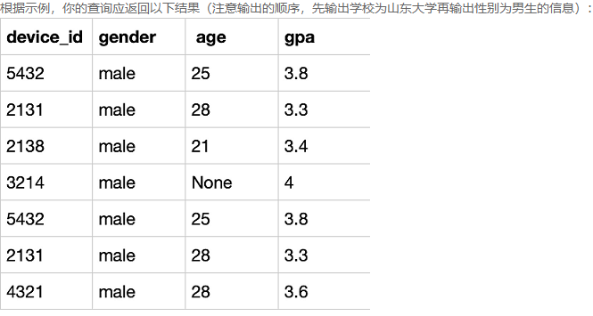
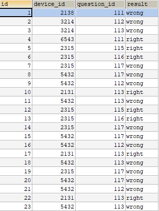
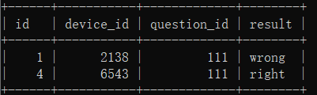
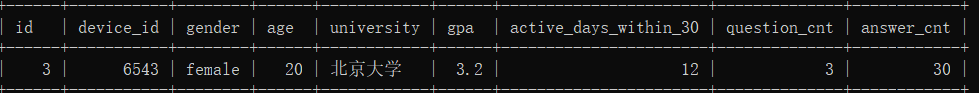
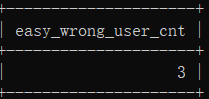

# 第1题：答题考生信息

题目1数据脚本：

```mysql
drop database if exists chapter8db1;
create database chapter8db1;
use chapter8db1;

drop table if  exists `question_practice_detail`;
CREATE TABLE `question_practice_detail` (
`id` int ,
`device_id` int ,
`question_id`int ,
`result` varchar(32) 
);
INSERT INTO question_practice_detail VALUES(1,2138,111,'wrong');
INSERT INTO question_practice_detail VALUES(2,3214,112,'wrong');
INSERT INTO question_practice_detail VALUES(3,3214,113,'wrong');
INSERT INTO question_practice_detail VALUES(4,6543,111,'right');
INSERT INTO question_practice_detail VALUES(5,2315,115,'right');
INSERT INTO question_practice_detail VALUES(6,2315,116,'right');
INSERT INTO question_practice_detail VALUES(7,2315,117,'wrong');
INSERT INTO question_practice_detail VALUES(8,5432,118,'wrong');
INSERT INTO question_practice_detail VALUES(9,5432,112,'wrong');
INSERT INTO question_practice_detail VALUES(10,2131,114,'right');
INSERT INTO question_practice_detail VALUES(11,5432,113,'wrong');

drop table if exists `user_profile`;
CREATE TABLE `user_profile` (
`id` int ,
`device_id` int ,
`gender` varchar(14) ,
`age` int ,
`university` varchar(32) ,
`gpa` float,
`active_days_within_30` int ,
`question_cnt` int ,
`answer_cnt` int 
);


INSERT INTO user_profile VALUES(1,2138,'male',21,'北京大学',3.4,7,2,12);
INSERT INTO user_profile VALUES(2,3214,'male',null,'复旦大学',4.0,15,5,25);
INSERT INTO user_profile VALUES(3,6543,'female',20,'北京大学',3.2,12,3,30);
INSERT INTO user_profile VALUES(4,2315,'female',23,'浙江大学',3.6,5,1,2);
INSERT INTO user_profile VALUES(5,5432,'male',25,'山东大学',3.8,20,15,70);
INSERT INTO user_profile VALUES(6,2131,'male',28,'山东大学',3.3,15,7,13);
INSERT INTO user_profile VALUES(7,4321,'male',28,'复旦大学',3.6,9,6,52);
```



- 第一行表示:某用户的设备id是2138，在question_id为111的题目上，回答错误
- ....
- 最后一行表示:某用户的设备id是5432，在question_id为113的题目上，回答错误
- 当前表中一共有11条答题记录


- 第一行表示:某用户的设备id是2138，性别为男，年龄21岁，北京大学，gpa为3.4在过去的30天里面活跃了7天，发帖数量为2，回答数量为12
  。。。
- 最后一行表示:某用户的设备id是4321，性别为男，年龄26岁，复旦大学，gpa为3.6在过去的30天里面活跃了9天，发帖数量为6，回答数量为52
- 当前表中一共有7个用户信息

## （1）查看所有来自浙江大学的用户题目回答明细情况

现在运营想要查看所有来自浙江大学的用户题目回答明细情况，请你取出相应数据



```mysql
SELECT qpd.device_id,
	question_id,
	result
FROM question_practice_detail qpd INNER JOIN user_profile up
	ON qpd.`device_id` = up.`device_id`
WHERE university='浙江大学';
```

## （2）查看问题“111”答对的同学的详细信息。

现在运营想要查看question_id为“111”问题答对的同学的详细信息，作为筹备活动的嘉宾候选人。



```mysql
SELECT up.*
FROM question_practice_detail qpd INNER JOIN user_profile up
	ON qpd.`device_id` = up.`device_id`
WHERE qpd.`question_id`='111' AND qpd.`result`='right';
```

## （3）查看北京大学女生的答题情况

现在运营想要查看所有北京大学的女生答题情况。



```mysql
SELECT qpd.*
FROM question_practice_detail qpd INNER JOIN user_profile up
	ON qpd.`device_id` = up.`device_id`
WHERE university='北京大学' AND gender='female';
```

## （4）查找山东大学或者性别为男生的信息

题目：现在运营想要分别查看学校为山东大学或者性别为男性的用户的device_id、gender、age和gpa数据，请取出相应结果，结果不去重。



```mysql
SELECT
    device_id, gender, age, gpa
FROM user_profile
WHERE university='山东大学'
 
UNION ALL #ALL不去重
 
SELECT
    device_id, gender, age, gpa
FROM user_profile
WHERE gender='male';
```


# 第2题：答题等级分析

题目1数据脚本：

```mysql
drop database if exists chapter8db2;
create database chapter8db2;
use chapter8db2;

drop table if exists `user_profile`;
drop table if  exists `question_practice_detail`;
drop table if  exists `question_detail`;

CREATE TABLE `user_profile` (
`id` int ,
`device_id` int ,
`gender` varchar(14) ,
`age` int ,
`university` varchar(32) ,
`gpa` float,
`active_days_within_30` int ,
`question_cnt` int ,
`answer_cnt` int 
);
CREATE TABLE `question_practice_detail` (
`id` int ,
`device_id` int ,
`question_id`int ,
`result` varchar(32) 
);
CREATE TABLE `question_detail` (
`id` int ,
`question_id`int ,
`difficult_level` varchar(32) 
);

INSERT INTO user_profile VALUES(1,2138,'male',21,'北京大学',3.4,7,2,12);
INSERT INTO user_profile VALUES(2,3214,'male',null,'复旦大学',4.0,15,5,25);
INSERT INTO user_profile VALUES(3,6543,'female',20,'北京大学',3.2,12,3,30);
INSERT INTO user_profile VALUES(4,2315,'female',23,'浙江大学',3.6,5,1,2);
INSERT INTO user_profile VALUES(5,5432,'male',25,'山东大学',3.8,20,15,70);
INSERT INTO user_profile VALUES(6,2131,'male',28,'山东大学',3.3,15,7,13);
INSERT INTO user_profile VALUES(7,4321,'male',28,'复旦大学',3.6,9,6,52);

INSERT INTO question_practice_detail VALUES(1,2138,111,'wrong');
INSERT INTO question_practice_detail VALUES(2,3214,112,'wrong');
INSERT INTO question_practice_detail VALUES(3,3214,113,'wrong');
INSERT INTO question_practice_detail VALUES(4,6543,111,'right');
INSERT INTO question_practice_detail VALUES(5,2315,115,'right');
INSERT INTO question_practice_detail VALUES(6,2315,116,'right');
INSERT INTO question_practice_detail VALUES(7,2315,117,'wrong');
INSERT INTO question_practice_detail VALUES(8,5432,117,'wrong');
INSERT INTO question_practice_detail VALUES(9,5432,112,'wrong');
INSERT INTO question_practice_detail VALUES(10,2131,113,'right');
INSERT INTO question_practice_detail VALUES(11,5432,113,'wrong');
INSERT INTO question_practice_detail VALUES(12,2315,115,'right');
INSERT INTO question_practice_detail VALUES(13,2315,116,'right');
INSERT INTO question_practice_detail VALUES(14,2315,117,'wrong');
INSERT INTO question_practice_detail VALUES(15,5432,117,'wrong');
INSERT INTO question_practice_detail VALUES(16,5432,112,'wrong');
INSERT INTO question_practice_detail VALUES(17,2131,113,'right');
INSERT INTO question_practice_detail VALUES(18,5432,113,'wrong');
INSERT INTO question_practice_detail VALUES(19,2315,117,'wrong');
INSERT INTO question_practice_detail VALUES(20,5432,117,'wrong');
INSERT INTO question_practice_detail VALUES(21,5432,112,'wrong');
INSERT INTO question_practice_detail VALUES(22,2131,113,'right');
INSERT INTO question_practice_detail VALUES(23,5432,113,'wrong');

INSERT INTO question_detail VALUES(1,111,'hard');
INSERT INTO question_detail VALUES(2,112,'medium');
INSERT INTO question_detail VALUES(3,113,'easy');
INSERT INTO question_detail VALUES(4,115,'easy');
INSERT INTO question_detail VALUES(5,116,'medium');
INSERT INTO question_detail VALUES(6,117,'easy');
```





## （5）查看难度等级为“hard”的题目答题情况



```mysql
SELECT qpd.*
FROM question_practice_detail qpd INNER JOIN question_detail qd
	ON qpd.`question_id`=qd.`question_id`
WHERE difficult_level='hard';
```

## （6）查看难度等级为“hard”的题目答对的用户信息



```mysql
SELECT up.*
FROM question_practice_detail qpd 
    INNER JOIN question_detail qd ON qpd.`question_id`=qd.`question_id`
    INNER JOIN user_profile up ON qpd.`device_id` = up.`device_id`
WHERE difficult_level='hard' AND qpd.`result`='right';
```

## （7）查看难度等级为"easy"的题目答错的用户数量

要求：如果同一个用户多"easy"题答错，算一个用户数量



```mysql
SELECT COUNT(DISTINCT up.device_id)
FROM question_practice_detail qpd 
    INNER JOIN question_detail qd ON qpd.`question_id`=qd.`question_id`
    INNER JOIN user_profile up ON qpd.`device_id` = up.`device_id`
WHERE difficult_level='easy' AND qpd.`result`='wrong';
```

