## 第1题：查看前2个用户明细设备ID数据

题目1数据脚本：

```mysql
drop database if exists chapter9db1;
create database chapter9db1;
use chapter9db1;

drop table if exists user_profile;
CREATE TABLE `user_profile` (
`id` int,
`device_id` int,
`gender` varchar(14),
`age` int ,
`university` varchar(32),
`province` varchar(32));
INSERT INTO user_profile VALUES(1,2138,'male',21,'北京大学','BeiJing');
INSERT INTO user_profile VALUES(2,3214,'male',null,'复旦大学','Shanghai');
INSERT INTO user_profile VALUES(3,6543,'female',20,'北京大学','BeiJing');
INSERT INTO user_profile VALUES(4,2315,'female',23,'浙江大学','ZheJiang');
INSERT INTO user_profile VALUES(5,5432,'male',25,'山东大学','Shandong');
```

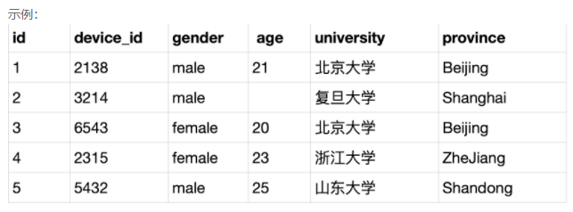

题目：现在运营只需要查看前2个用户明细设备ID数据，请你从用户信息表 user_profile 中取出相应结果。

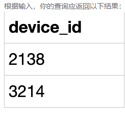

```mysql
SELECT device_id 
FROM user_profile 
LIMIT 0,2;
```


## 第2题：查看每个学校用户的平均发贴和回帖情况

题目2数据脚本：

```mysql
drop database if exists chapter9db2;
create database chapter9db2;
use chapter9db2;

drop table if exists user_profile;
CREATE TABLE `user_profile` (
`id` int,
`device_id` int,
`gender` varchar(14) ,
`age` int ,
`university` varchar(32) ,
`gpa` float,
`active_days_within_30` float,
`question_cnt` float,
`answer_cnt` float
);
INSERT INTO user_profile VALUES(1,2138,'male',21,'北京大学',3.4,7,2,12);
INSERT INTO user_profile VALUES(2,3214,'male',null,'复旦大学',4.0,15,5,25);
INSERT INTO user_profile VALUES(3,6543,'female',20,'北京大学',3.2,12,3,30);
INSERT INTO user_profile VALUES(4,2315,'female',23,'浙江大学',3.6,5,1,2);
INSERT INTO user_profile VALUES(5,5432,'male',25,'山东大学',3.8,20,15,70);
INSERT INTO user_profile VALUES(6,2131,'male',28,'山东大学',3.3,15,7,13);
INSERT INTO user_profile VALUES(7,4321,'male',28,'复旦大学',3.6,9,6,52);
```


- 30天内活跃天数字段（active_days_within_30）
- 发帖数量字段（question_cnt）
- 回答数量字段（answer_cnt）

例如：第一行表示:id为1的用户的常用信息为使用的设备id为2138，性别为男，年龄21岁，北京大学，gpa为3.4在过去的30天里面活跃了7天，发帖数量为2，回答数量为12

题目：现在运营想查看每个学校用户的平均发贴和回帖情况，寻找低活跃度学校进行重点运营，请取出平均发贴数低于5的学校或平均回帖数小于20的学校。

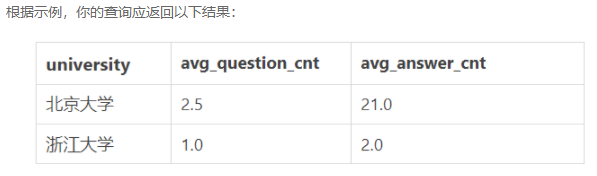

解释: 平均发贴数低于5的学校或平均回帖数小于20的学校有2个

- 属于北京大学的用户的平均发帖量为2.5，平均回答数量为21.0
- 属于浙江大学的用户的平均发帖量为1.0，平均回答数量为2.0

```mysql
SELECT university,
	AVG(question_cnt) AS avg_question_cnt,
	AVG(answer_cnt) AS avg_answer_cnt 
FROM user_profile
GROUP BY university
HAVING avg_question_cnt<5 OR avg_answer_cnt<20;
```


## 第3题：查看不同大学的用户平均发帖情况

题目3数据脚本：

```mysql
drop database if exists chapter9db3;
create database chapter9db3;
use chapter9db3;

drop table if exists user_profile;
CREATE TABLE `user_profile` (
`id` int,
`device_id` int,
`gender` varchar(14) ,
`age` int ,
`university` varchar(32) ,
`gpa` float,
`active_days_within_30` float,
`question_cnt` float,
`answer_cnt` float
);
INSERT INTO user_profile VALUES(1,2138,'male',21,'北京大学',3.4,7,2,12);
INSERT INTO user_profile VALUES(2,3214,'male',null,'复旦大学',4.0,15,5,25);
INSERT INTO user_profile VALUES(3,6543,'female',20,'北京大学',3.2,12,3,30);
INSERT INTO user_profile VALUES(4,2315,'female',23,'浙江大学',3.6,5,1,2);
INSERT INTO user_profile VALUES(5,5432,'male',25,'山东大学',3.8,20,15,70);
INSERT INTO user_profile VALUES(6,2131,'male',28,'山东大学',3.3,15,7,13);
INSERT INTO user_profile VALUES(7,4321,'male',28,'复旦大学',3.6,9,6,52);
```


- 30天内活跃天数字段（active_days_within_30）
- 发帖数量字段（question_cnt）
- 回答数量字段（answer_cnt）

现在运营想要查看不同大学的用户平均发帖情况，并期望结果按照平均发帖情况进行升序排列，请你取出相应数据。

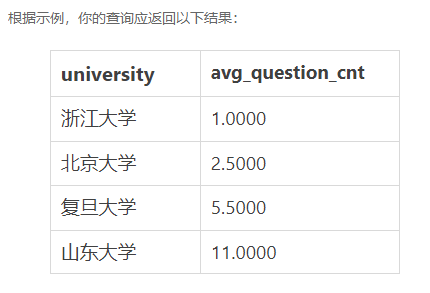

```mysql
SELECT university,
	FORMAT(AVG(question_cnt),4) AS avg_question_cnt  
FROM user_profile
GROUP BY university
ORDER BY avg_question_cnt;

或

SELECT university,
	AVG(question_cnt) AS avg_question_cnt  
FROM user_profile
GROUP BY university
ORDER BY avg_question_cnt;
```

## 第4题：查看每个学校不同性别的用户活跃情况和发帖数量

题目4数据脚本：

```mysql
drop database if exists chapter9db4;
create database chapter9db4;
use chapter9db4;

drop table if exists user_profile;
CREATE TABLE `user_profile` (
`id` int NOT NULL,
`device_id` int NOT NULL,
`gender` varchar(14) NOT NULL,
`age` int ,
`university` varchar(32) NOT NULL,
`gpa` float,
`active_days_within_30` float,
`question_cnt` float,
`answer_cnt` float
);
INSERT INTO user_profile VALUES(1,2138,'male',21,'北京大学',3.4,7,2,12);
INSERT INTO user_profile VALUES(2,3214,'male',null,'复旦大学',4.0,15,5,25);
INSERT INTO user_profile VALUES(3,6543,'female',20,'北京大学',3.2,12,3,30);
INSERT INTO user_profile VALUES(4,2315,'female',23,'浙江大学',3.6,5,1,2);
INSERT INTO user_profile VALUES(5,5432,'male',25,'山东大学',3.8,20,15,70);
INSERT INTO user_profile VALUES(6,2131,'male',28,'山东大学',3.3,15,7,13);
INSERT INTO user_profile VALUES(7,4321,'male',28,'复旦大学',3.6,9,6,52);
```

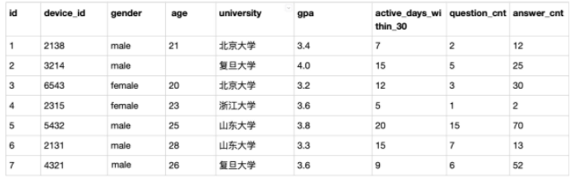

- 30天内活跃天数字段（active_days_within_30）
- 发帖数量字段（question_cnt）
- 回答数量字段（answer_cnt）

例如：第一行表示:id为1的用户的常用信息为使用的设备id为2138，性别为男，年龄21岁，北京大学，gpa为3.4在过去的30天里面活跃了7天，发帖数量为2，回答数量为12

现在运营想要对每个学校不同性别的用户活跃情况和发帖数量进行分析，请分别计算出每个学校每种性别的用户数、30天内平均活跃天数和平均发帖数量。

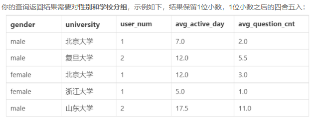

解释:

- 第一行表示：北京大学的男性用户个数为1，平均活跃天数为7天，平均发帖量为2
- 。。。
- 最后一行表示：山东大学的男性用户个数为2，平均活跃天数为17.5天，平均发帖量为11

```mysql
SELECT gender,university,
	COUNT(*) AS user_num, 
	AVG(active_days_within_30) AS avg_active_day, 
	AVG(question_cnt) AS avg_question_cnt
FROM user_profile
GROUP BY gender,university;
```


## 第5题：查询每个学校答过题的用户平均答题数量

题目5数据脚本：

```mysql
drop database if exists chapter9db5;
create database chapter9db5;
use chapter9db5;

drop table if  exists `question_practice_detail`;
CREATE TABLE `question_practice_detail` (
`id` int ,
`device_id` int ,
`question_id`int ,
`result` varchar(32) 
);
INSERT INTO question_practice_detail VALUES(1,2138,111,'wrong');
INSERT INTO question_practice_detail VALUES(2,3214,112,'wrong');
INSERT INTO question_practice_detail VALUES(3,3214,113,'wrong');
INSERT INTO question_practice_detail VALUES(4,6543,111,'right');
INSERT INTO question_practice_detail VALUES(5,2315,115,'right');
INSERT INTO question_practice_detail VALUES(6,2315,116,'right');
INSERT INTO question_practice_detail VALUES(7,2315,117,'wrong');
INSERT INTO question_practice_detail VALUES(8,5432,118,'wrong');
INSERT INTO question_practice_detail VALUES(9,5432,112,'wrong');
INSERT INTO question_practice_detail VALUES(10,2131,114,'right');
INSERT INTO question_practice_detail VALUES(11,5432,113,'wrong');

drop table if exists `user_profile`;
CREATE TABLE `user_profile` (
`id` int ,
`device_id` int ,
`gender` varchar(14) ,
`age` int ,
`university` varchar(32) ,
`gpa` float,
`active_days_within_30` int ,
`question_cnt` int ,
`answer_cnt` int 
);
INSERT INTO user_profile VALUES(1,2138,'male',21,'北京大学',3.4,7,2,12);
INSERT INTO user_profile VALUES(2,3214,'male',null,'复旦大学',4.0,15,5,25);
INSERT INTO user_profile VALUES(3,6543,'female',20,'北京大学',3.2,12,3,30);
INSERT INTO user_profile VALUES(4,2315,'female',23,'浙江大学',3.6,5,1,2);
INSERT INTO user_profile VALUES(5,5432,'male',25,'山东大学',3.8,20,15,70);
INSERT INTO user_profile VALUES(6,2131,'male',28,'山东大学',3.3,15,7,13);
INSERT INTO user_profile VALUES(7,4321,'male',28,'复旦大学',3.6,9,6,52);
```


- 第一行表示:id为1的用户的常用信息为使用的设备id为2138，在question_id为111的题目上，回答错误
- ....
- 最后一行表示:id为11的用户的常用信息为使用的设备id为5432，在question_id为113的题目上，回答错误


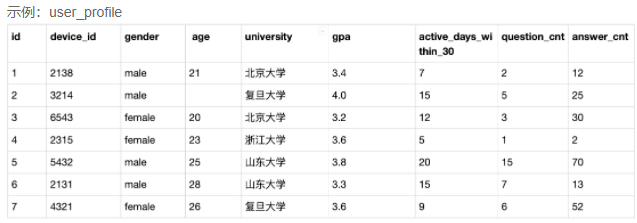

- 第一行表示:id为1的用户的常用信息为使用的设备id为2138，性别为男，年龄21岁，北京大学，gpa为3.4在过去的30天里面活跃了7天，发帖数量为2，回答数量为12
  。。。
- 最后一行表示:id为7的用户的常用信息为使用的设备id为4321，性别为男，年龄26岁，复旦大学，gpa为3.6在过去的30天里面活跃了9天，发帖数量为6，回答数量为52


运营想要了解每个学校答过题的用户平均答题数量情况，请你取出数据。

提示：

```mysql
（1）两个表联合查询

（2）按照学校分组统计

（3）答过题的用户平均答题数量=该学校用户答题总次数  COUNT(question_id) / 答过题的不同用户个数COUNT(DISTINCT device_id)
```

结果示例：

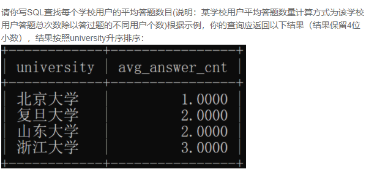

解释:

- 第一行：北京大学总共有2个用户，2138和6543，2个用户在question_practice_detail里面答了2题，平均答题数目为2/2=1.0000
- **....**
- 最后一行:浙江大学总共有1个用户，2315，这个用户在\**question_practice_detail里面答了3题，平均答题数目为3/1=3.0000

```mysql
SELECT university,
	COUNT(question_id)/COUNT(DISTINCT qpd.device_id) AS avg_answer_cnt
FROM question_practice_detail AS qpd 
	INNER JOIN user_profile
	ON qpd.`device_id` = user_profile.`device_id`
GROUP BY university;
```

## 第6题：计算一些**参加了答题**的不同学校、不同难度的用户平均答题量

题目6数据脚本：

```mysql
drop database if exists chapter9db6;
create database chapter9db6;
use chapter9db6;

drop table if  exists `question_practice_detail`;
CREATE TABLE `question_practice_detail` (
`id` int ,
`device_id` int ,
`question_id`int ,
`result` varchar(32) 
);
INSERT INTO question_practice_detail VALUES(1,2138,111,'wrong');
INSERT INTO question_practice_detail VALUES(2,3214,112,'wrong');
INSERT INTO question_practice_detail VALUES(3,3214,113,'wrong');
INSERT INTO question_practice_detail VALUES(4,6543,111,'right');
INSERT INTO question_practice_detail VALUES(5,2315,115,'right');
INSERT INTO question_practice_detail VALUES(6,2315,116,'right');
INSERT INTO question_practice_detail VALUES(7,2315,117,'wrong');
INSERT INTO question_practice_detail VALUES(8,5432,117,'wrong');
INSERT INTO question_practice_detail VALUES(9,5432,112,'wrong');
INSERT INTO question_practice_detail VALUES(10,2131,113,'right');
INSERT INTO question_practice_detail VALUES(11,5432,113,'wrong');
INSERT INTO question_practice_detail VALUES(12,2315,115,'right');
INSERT INTO question_practice_detail VALUES(13,2315,116,'right');
INSERT INTO question_practice_detail VALUES(14,2315,117,'wrong');
INSERT INTO question_practice_detail VALUES(15,5432,117,'wrong');
INSERT INTO question_practice_detail VALUES(16,5432,112,'wrong');
INSERT INTO question_practice_detail VALUES(17,2131,113,'right');
INSERT INTO question_practice_detail VALUES(18,5432,113,'wrong');
INSERT INTO question_practice_detail VALUES(19,2315,117,'wrong');
INSERT INTO question_practice_detail VALUES(20,5432,117,'wrong');
INSERT INTO question_practice_detail VALUES(21,5432,112,'wrong');
INSERT INTO question_practice_detail VALUES(22,2131,113,'right');
INSERT INTO question_practice_detail VALUES(23,5432,113,'wrong');

drop table if exists `user_profile`;
CREATE TABLE `user_profile` (
`id` int ,
`device_id` int ,
`gender` varchar(14) ,
`age` int ,
`university` varchar(32) ,
`gpa` float,
`active_days_within_30` int ,
`question_cnt` int ,
`answer_cnt` int 
);
INSERT INTO user_profile VALUES(1,2138,'male',21,'北京大学',3.4,7,2,12);
INSERT INTO user_profile VALUES(2,3214,'male',null,'复旦大学',4.0,15,5,25);
INSERT INTO user_profile VALUES(3,6543,'female',20,'北京大学',3.2,12,3,30);
INSERT INTO user_profile VALUES(4,2315,'female',23,'浙江大学',3.6,5,1,2);
INSERT INTO user_profile VALUES(5,5432,'male',25,'山东大学',3.8,20,15,70);
INSERT INTO user_profile VALUES(6,2131,'male',28,'山东大学',3.3,15,7,13);
INSERT INTO user_profile VALUES(7,4321,'male',28,'复旦大学',3.6,9,6,52);

drop table if exists `question_detail`;
CREATE TABLE `question_detail` (
`id` int NOT NULL,
`question_id`int NOT NULL,
`difficult_level` varchar(32) NOT NULL
);
INSERT INTO question_detail VALUES(1,111,'hard');
INSERT INTO question_detail VALUES(2,112,'medium');
INSERT INTO question_detail VALUES(3,113,'easy');
INSERT INTO question_detail VALUES(4,115,'easy');
INSERT INTO question_detail VALUES(5,116,'medium');
INSERT INTO question_detail VALUES(6,117,'easy');
```


- 第一行表示:id为1的用户的常用信息为使用的设备id为2138，在question_id为111的题目上，回答错误
- ....
- 最后一行表示:id为11的用户的常用信息为使用的设备id为5432，在question_id为113的题目上，回答错误


- 第一行表示:id为1的用户的常用信息为使用的设备id为2138，性别为男，年龄21岁，北京大学，gpa为3.4在过去的30天里面活跃了7天，发帖数量为2，回答数量为12
  。。。
- 最后一行表示:id为7的用户的常用信息为使用的设备id为4321，性别为男，年龄26岁，复旦大学，gpa为3.6在过去的30天里面活跃了9天，发帖数量为6，回答数量为52


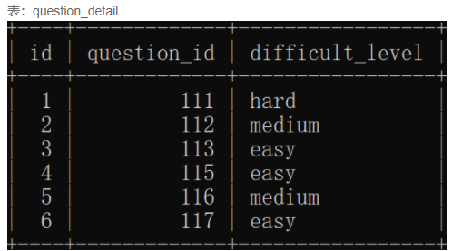

- 第一行表示: 题目id为111的难度为hard
- ....
- 第一行表示: 题目id为117的难度为easy


运营想要计算一些**参加了答题**的不同学校、不同难度的用户平均答题量，请你写SQL取出相应数据

提示：

```mysql
（1）三个表联合查询

（2）按照学校、难度等级分组统计

（3）答过题的用户平均答题数量=该学校用户答题总次数  COUNT(question_id) / 答过题的不同用户个数COUNT(DISTINCT device_id)
```

结果示例：

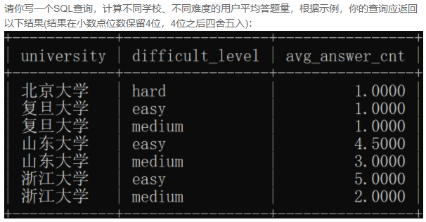

解释：

- 第一行：北京大学有设备id为2138，6543这2个用户，这2个用户在question_practice_detail表下都只有一条答题记录，且答题题目是111，从question_detail可以知道这个题目是hard，故 北京大学的用户答题为hard的题目平均答题为2/2=1.0000
- 第二行，第三行：复旦大学有设备id为3214，4321这2个用户，但是在question_practice_detail表只有1个用户(device_id=3214有答题，device_id=4321没有答题，不计入后续计算)有2条答题记录，且答题题目是112，113各1个，从question_detail可以知道题目难度分别是medium和easy，故 复旦大学的用户答题为easy, medium的题目平均答题量都为1(easy=1或medium=1) /1 (device_id=3214)=1.0000
- 第四行，第五行：山东大学有设备id为5432和2131这2个用户，这2个用户总共在question_practice_detail表下有12条答题记录，且答题题目是112，113，117，且数目分别为3，6，3，从question_detail可以知道题目难度分别为medium,easy,easy，所以，easy共有9个，故easy的题目平均答题量= 9(easy=9)/2 (device_id=3214 or device_id=5432) =4.5000，medium共有3个，medium的答题只有device_id=5432的用户，故medium的题目平均答题量= 3(medium=9)/1 ( device_id=5432) =3.0000
- .....

```mysql
SELECT university,difficult_level,
	COUNT(qd.question_id)/COUNT(DISTINCT qpd.device_id) AS avg_answer_cnt
FROM question_detail qd 
	INNER JOIN question_practice_detail qpd ON qpd.`question_id` = qd.`question_id`
	INNER JOIN user_profile up ON qpd.`device_id` = up.`device_id`
GROUP BY university, difficult_level;
```

## 第7题：查看**参加了答题**的山东大学的用户在不同难度下的平均答题题目数

题目7数据脚本：

```mysql
drop database if exists chapter9db7;
create database chapter9db7;
use chapter9db7;

DROP TABLE IF EXISTS `user_profile`;
DROP TABLE IF  EXISTS `question_practice_detail`;
DROP TABLE IF  EXISTS `question_detail`;

CREATE TABLE `user_profile` (
`id` INT ,
`device_id` INT ,
`gender` VARCHAR(14) ,
`age` INT ,
`university` VARCHAR(32) ,
`gpa` FLOAT,
`active_days_within_30` INT ,
`question_cnt` INT ,
`answer_cnt` INT 
);

CREATE TABLE `question_practice_detail` (
`id` INT ,
`device_id` INT,
`question_id`INT ,
`result` VARCHAR(32) 
);

CREATE TABLE `question_detail` (
`id` INT ,
`question_id`INT ,
`difficult_level` VARCHAR(32)
);

INSERT INTO user_profile VALUES(1,2138,'male',21,'北京大学',3.4,7,2,12);
INSERT INTO user_profile VALUES(2,3214,'male',NULL,'复旦大学',4.0,15,5,25);
INSERT INTO user_profile VALUES(3,6543,'female',20,'北京大学',3.2,12,3,30);
INSERT INTO user_profile VALUES(4,2315,'female',23,'浙江大学',3.6,5,1,2);
INSERT INTO user_profile VALUES(5,5432,'male',25,'山东大学',3.8,20,15,70);
INSERT INTO user_profile VALUES(6,2131,'male',28,'山东大学',3.3,15,7,13);
INSERT INTO user_profile VALUES(7,4321,'male',28,'复旦大学',3.6,9,6,52);

INSERT INTO question_practice_detail VALUES(1,2138,111,'wrong');
INSERT INTO question_practice_detail VALUES(2,3214,112,'wrong');
INSERT INTO question_practice_detail VALUES(3,3214,113,'wrong');
INSERT INTO question_practice_detail VALUES(4,6543,111,'right');
INSERT INTO question_practice_detail VALUES(5,2315,115,'right');
INSERT INTO question_practice_detail VALUES(6,2315,116,'right');
INSERT INTO question_practice_detail VALUES(7,2315,117,'wrong');
INSERT INTO question_practice_detail VALUES(8,5432,117,'wrong');
INSERT INTO question_practice_detail VALUES(9,5432,112,'wrong');
INSERT INTO question_practice_detail VALUES(10,2131,113,'right');
INSERT INTO question_practice_detail VALUES(11,5432,113,'wrong');
INSERT INTO question_practice_detail VALUES(12,2315,115,'right');
INSERT INTO question_practice_detail VALUES(13,2315,116,'right');
INSERT INTO question_practice_detail VALUES(14,2315,117,'wrong');
INSERT INTO question_practice_detail VALUES(15,5432,117,'wrong');
INSERT INTO question_practice_detail VALUES(16,5432,112,'wrong');
INSERT INTO question_practice_detail VALUES(17,2131,113,'right');
INSERT INTO question_practice_detail VALUES(18,5432,113,'wrong');
INSERT INTO question_practice_detail VALUES(19,2315,117,'wrong');
INSERT INTO question_practice_detail VALUES(20,5432,117,'wrong');
INSERT INTO question_practice_detail VALUES(21,5432,112,'wrong');
INSERT INTO question_practice_detail VALUES(22,2131,113,'right');
INSERT INTO question_practice_detail VALUES(23,5432,113,'wrong');

INSERT INTO question_detail VALUES(1,111,'hard');
INSERT INTO question_detail VALUES(2,112,'medium');
INSERT INTO question_detail VALUES(3,113,'easy');
INSERT INTO question_detail VALUES(4,115,'easy');
INSERT INTO question_detail VALUES(5,116,'medium');
INSERT INTO question_detail VALUES(6,117,'easy');
```

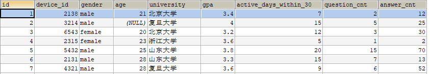


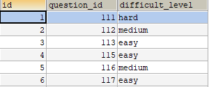

运营想要查看**参加了答题**的山东大学的用户在不同难度下的平均答题题目数，请取出相应数据。

提示：

```mysql
（1）从user_profile表筛选出“山东大学”的记录

（2）三个表联合查询

（3）按照难度等级分组统计

（4）答过题的用户平均答题数量=该学校用户答题总次数  COUNT(question_id) / 答过题的不同用户个数COUNT(DISTINCT device_id)
```

结果示例：

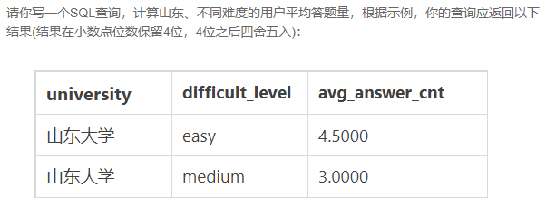


```mysql
SELECT
    t1.university,
    t3.difficult_level,
    COUNT(t2.question_id) / COUNT(DISTINCT t2.device_id) AS avg_answer_cnt
FROM
    user_profile AS t1 
    INNER JOIN question_practice_detail AS t2 ON t1.device_id = t2.device_id
    INNER JOIN question_detail AS t3 ON t2.question_id = t3.question_id
WHERE
    t1.university = '山东大学'
GROUP BY
	t1.university,
    t3.difficult_level;
```


