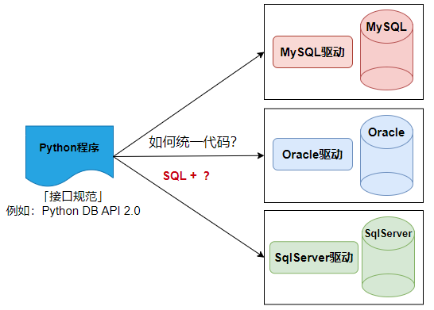

# 一、驱动



Python 生态中，有 2 个最常用的 MySQL 驱动库，**二选一安装即可**，都是生产环境常用的，推荐第一个：

✅ `mysql-connector-python`（MySQL 官方出品）

这是 **MySQL 官方为 Python 开发的驱动库**，功能强，性能好，大数据 / 复杂查询更快（C 优化）。带 C 扩展，在某些 Linux、macOS、ARM 环境可能编译失败或找不到预编译包。Oracle 亲儿子，对 MariaDB 适配一般，部分特性不兼容。MySQL 8.0 连接更省心，默认用 `caching_sha2_password`，很多旧环境连不上，要改用户认证插件。

安装命令如下（cmd / 终端直接执行）：

```bash
pip install mysql-connector-python
```

✅ `pymysql`（社区）

这是 Python 开发者社区最火的 MySQL 驱动，纯 Python，无编译、无依赖，MariaDB 兼容好，功能完善，**MIT 许可证，随便用、随便改，无法律风险**，Django、Flask、SQLAlchemy 默认常用。唯一小缺点：如果你的 Python 版本是 3.10+，偶尔会有微小的兼容告警。

安装命令如下：

```bash
pip install pymysql
```

# 二、Python DB API

## 2.1 使用 mysql-connector-python 连接 MySQL

```python
# 1. 导入官方驱动的核心模块
import mysql.connector

# 获取连接
def get_connection():
    # 数据库连接参数（替换成你的：主机、端口、用户名、密码、数据库名）
    conn_params = {
        "host": "localhost",  # 本地数据库写localhost，远程写服务器IP
        "port": 3306,  # MySQL默认端口3306
        "user": "root",  # 你的MySQL用户名
        "password": "123456",
        "database": "atguigu"  # 要连接的具体数据库
    }
    try:
        # 2. 建立数据库连接
        conn =  mysql.connector.connect(**conn_params)
        print("获取连接成功", conn)
        return conn
    except:
        print("获取连接的时候发生了异常")
        
if __name__ == '__main__':
    conn = get_connection()
    conn.close()
```


## 2.2 使用 pymysql 连接 MySQL

```python
"""
    该案例演示了python操作MySQL数据库
"""
import pymysql

# 获取连接
def get_connection():
    conn_params = {
        "host": "localhost",  # 本地数据库写localhost，远程写服务器IP
        "port": 3306,  # MySQL默认端口3306
        "user": "root",  # 你的MySQL用户名
        "password": "123456",
        "database": "atguigu"  # 要连接的具体数据库
    }
    try:
        conn = pymysql.connect(**conn_params)
        print("获取连接成功", conn)
        return conn
    except:
        print("获取连接的时候发生了异常")
    
    
if __name__ == '__main__':
    conn = get_connection()
    conn.close()
```


# 三、实现增删改查

```python
"""
    该案例演示了python操作MySQL数据库
"""
import pymysql

# 获取连接
def get_connection():
    conn_params = {
        "host": "localhost",  # 本地数据库写localhost，远程写服务器IP
        "port": 3306,  # MySQL默认端口3306
        "user": "root",  # 你的MySQL用户名
        "password": "123456",
        "database": "atguigu"  # 要连接的具体数据库
    }
    try:
        conn = pymysql.connect(**conn_params)
        print("获取连接成功", conn)
        return conn
    except:
        print("获取连接的时候发生了异常")

# 从数据库表中查询数据
def select_data(conn):
    # 创建游标对象
    my_cursor = conn.cursor()

    # 执行sql语句
    sql = "select * from t_department"
    my_cursor.execute(sql)

    # 获取查询结果
    results = my_cursor.fetchall()

    for row in results:
        print(row)
    my_cursor.close()

def insert_data(conn):
    my_c = conn.cursor()
    sql = "insert into t_department values (10,'test','testtest')"
    my_c.execute(sql)
    # 提交事务
    conn.commit()
    my_c.close()

def delete_data(conn):
    my_c = conn.cursor()
    sql = "delete from t_department where did=10"
    my_c.execute(sql)
    # 提交事务
    conn.commit()
    my_c.close()

def update_data(conn):
    my_c = conn.cursor()
    sql = "update t_department set dname='dev' where did=10"
    my_c.execute(sql)
    # 提交事务
    conn.commit()
    my_c.close()

if __name__ == '__main__':
    conn = get_connection()
    # insert_data(conn)
    # update_data(conn)
    # delete_data(conn)
    select_data(conn)
    conn.close()

```

# 四、拓展（ORM)

```python
# 1. 导入官方驱动的核心模块
import mysql.connector

# 获取连接
def get_connection():
    # 数据库连接参数（替换成你的：主机、端口、用户名、密码、数据库名）
    conn_params = {
        "host": "localhost",  # 本地数据库写localhost，远程写服务器IP
        "port": 3306,  # MySQL默认端口3306
        "user": "root",  # 你的MySQL用户名
        "password": "123456",
        "database": "atguigu"  # 要连接的具体数据库
    }
    try:
        # 2. 建立数据库连接
        conn =  mysql.connector.connect(**conn_params)
        print("获取连接成功", conn)
        return conn
    except:
        print("获取连接的时候发生了异常")

def update(conn,sql:str, params:dict=None):
    my_c = conn.cursor()
    my_c.execute(sql.format_map(params))
    my_c.close()

def get_list(conn,   class_name,  sql:str,  params:dict=None):
    my_c = conn.cursor(dictionary=True)  # 👈 关键：开启字典映射
    my_c.execute(sql.format_map(params))

    # 直接返回 字典列表：[{字段名:值}, {字段名:值}]
    rows = my_c.fetchall()
    results = [class_name(**row) for row in rows]
    my_c.close()
    return results


class Department:
    def __init__(self, did=None,dname=None,description=None):
        self.did = did
        self.dname = dname
        self.description = description

    def __repr__(self):
        return f"{self.did}, {self.dname}, {self.description}"

if __name__ == "__main__":
    conn = get_connection()
    #添加
    # new_department = Department(0,"测试5","测试x")
    # insert_sql = "insert into t_department(did,dname,description) values ({did},'{dname}','{description}')"
    # update(conn, insert_sql, new_department.__dict__)

    # #删除
    # remove_did = 4009
    # delete_sql = "delete from t_department where did={did}"
    # update(conn, delete_sql, {"did":remove_did})

    #查询所有
    select_all_sql = "select * from t_department"
    all = get_list(conn, Department,select_all_sql)
    for department in all:
        print(department)

    #修改
    # select_one_sql = "select * from t_department where did={did}"
    # select_did = 1
    # d = get_list(conn, select_one_sql, {"did": 1})[0]
    # d.description = "新新新"
    # update_sql = "update t_department set dname='{dname}',description='{description}' where did={did}"
    # update(conn, update_sql,d.__dict__)
    conn.commit()
```

