# 第1章 Linux入门

## 1.1 Linux概述


Linux 是一款**开源、免费的类 UNIX 操作系统内核**，由林纳斯·本纳第克特·托瓦兹（Linus Benedict Torvalds）于 1991 年发布首个版本。它并非完整的操作系统，而是与各种工具集、桌面环境组合后，形成了我们日常使用的**Linux 发行版**（如 Ubuntu、CentOS、Debian）。Linux 核心遵循 POSIX 标准，兼容绝大多数 UNIX 接口，是目前服务器、嵌入式设备、云计算等领域的主流操作系统。

### 1.1.1 Unix操作系统

Unix 是**现代操作系统的鼻祖**，是一款诞生于 1969 年的多用户、多任务类操作系统，由贝尔实验室的肯・汤普森（Ken Thompson）和丹尼斯・里奇（Dennis Ritchie）主导开发。它的核心设计思想（多用户、多任务、树形文件系统、Shell 命令行、管道通信等）深刻影响了后续几乎所有主流操作系统，包括 Linux、macOS、FreeBSD 等，也是 POSIX 标准的**原始参考蓝本**。

1、Unix 的发展堪称操作系统史上的经典，经历了**实验室开发→开源传播→商业闭源→标准化**四个阶段，也造就了其分支繁多的特点。

（1）实验室开发：Multics（Multiplexed Information and Computing Service）是 1960 年代由 MIT、贝尔实验室和通用电气联合开发的大型操作系统项目，旨在支持多用户、多任务。贝尔实验室后来退出了 Multics 项目，但几位参与该项目的研究人员（包括肯·汤普森和丹尼斯·里奇）从中获得了灵感，开始开发一个更轻量、更简洁的操作系统。这个新系统被肯·汤普森称为 **“Unics”**（Uniplexed Information and Computing Service），意为“单一的信息与计算服务”，与 **“Multics”**（多元的）形成对比，既是一种调侃，也体现了其设计哲学——简洁、专注。**“Unics”** 后来逐渐演变为 **“Unix”**，拼写更简洁，但保留了谐音和对比的含义。

（2）开源传播，分支涌现：贝尔实验室将 UNIX 源码免费提供给高校和研究机构，催生出两大核心分支：

- **BSD 分支**：由加州大学伯克利分校开发，新增 TCP/IP、虚拟内存等特性，是后续 FreeBSD、macOS 内核的基础。
- **System V 分支**：由 AT&T 主导的商业版本，成为企业级 UNIX 的主流标准。

（3）商业闭源，碎片化严重（1980s-1990s）：AT&T 收回 UNIX 版权并商业化，各大厂商基于 System V/BSD 开发自有版本（如 IBM AIX、HP-UX、Sun Solaris），接口差异逐渐扩大，导致软件移植困难。

（4）标准化与生态分化（1990s 至今）：为解决碎片化问题，IEEE （电气与电子工程师学会）制定了POSIX 标准（以 UNIX 接口为蓝本）；同时 Linux 开源崛起，抢占了中低端服务器市场，UNIX 则聚焦于高端企业级场景。

2、只有通过 **Open Group 的 UNIX 认证**的系统，才能被称为**正统 UNIX**，这类系统均为商业闭源版本，主打高端企业级场景，典型代表有：

- IBM AIX：适配 IBM 自研的 **Power 架构**小型机 / 大型机，是金融、电信行业核心系统的主流选择，以**超高稳定性、容错能力**著称，支持数百年不间断运行。
- HP-UX：惠普公司的 UNIX 系统，适配惠普 PA-RISC 架构和安腾（Itanium）架构，主打高端服务器市场，擅长大型数据库和企业级应用部署。
- Oracle Solaris：原 Sun 公司开发，后被甲骨文收购，支持 SPARC 架构和 x86 架构，拥有优秀的**虚拟化、集群、容错**特性，是甲骨文数据库的最佳配套系统。
- macOS：苹果公司的桌面操作系统，内核为 Darwin（基于 BSD 分支），是**唯一通过 UNIX 认证的桌面级 UNIX 系统**，兼顾了企业级稳定性和消费级易用性。

### 1.1.2 POSIX标准

POSIX（Portable Operating System Interface，可移植操作系统接口）是 IEEE 制定的一系列操作系统接口标准，正式称呼为 IEEE 1003（ISO/IEC 9945），核心是实现源代码级的软件可移植性，让符合标准的程序能在各类 POSIX 兼容系统间编译运行。

POSIX定义用户态 API、命令行 Shell 与工具接口，解决 UNIX 碎片化导致的移植难题。保证同一源码在不同 POSIX 兼容系统上，无需大幅修改即可编译执行。POSIX 拓展了 UNIX 的兼容性边界：没有 POSIX 之前，软件只能在特定 UNIX 分支运行；有了 POSIX 之后，只要软件遵循 POSIX 接口编写，就能在所有 POSIX 兼容系统（包括各类 UNIX、Linux、macOS 等）上编译运行。

- **正统的 UNIX 系统（如 AIX、HP - UX、Oracle Solaris、macOS）基本都符合 POSIX 标准**，以保证软件生态的兼容性。
- 一个操作系统只要实现了 POSIX 标准的接口，就可以被称为**类 UNIX 系统**，它可以不是传统意义上的 UNIX。
  - Linux 不是正统 UNIX（未通过 Open Group 认证），但它**完全兼容 POSIX 标准**，因此属于**类 UNIX 系统**。
  - Windows 本身不是类 UNIX 系统，但可以通过 WSL（Windows Subsystem for Linux）或 POSIX 子系统，实现对 POSIX 接口的`兼容`。

### 1.1.3 Linux操作系统

1、核心本质与定位

- **仅为内核**：Linux 本身只是操作系统的**内核（Kernel）**，负责管理硬件资源（CPU、内存、磁盘、网络）、调度进程、提供系统调用接口，不包含桌面、浏览器、命令行工具等用户态程序。
- **开源免费**：基于 **GPL 协议**（通用公共许可证），任何人可免费获取源码、修改、分发，商业公司也可基于其开发产品（如红帽企业版 Linux）。
- **POSIX 兼容**：完全实现 POSIX 标准接口，因此属于**类 UNIX 系统**，能直接运行遵循 POSIX 编写的软件，与 UNIX 生态高度互通。
- **多场景适配**：从微型嵌入式设备（路由器、智能手表）到大型服务器、超级计算机，再到桌面电脑、云计算平台，都有对应的 Linux 发行版。

2、完整的 Linux 发行版由**内核**和**用户态组件**两部分构成，二者协同工作。

|       组成部分       |                  核心作用                  |                           典型组件                           |
| :------------------: | :----------------------------------------: | :----------------------------------------------------------: |
|    **Linux 内核**    | 硬件管理、进程调度、系统调用、文件系统管理 |              内核源码（linux kernel）、设备驱动              |
|      **Shell**       |         命令解释器，连接用户与内核         |                   Bash（默认）、Zsh、Fish                    |
|     **系统工具**     |   实现系统管理、文件操作、网络配置等功能   |         ls、cd、cp、ps、netstat、yum/apt（包管理器）         |
|      **库文件**      |         提供程序运行所需的函数接口         |             glibc（GNU C 库）、pthread（线程库）             |
| **桌面环境（可选）** |               图形化操作界面               |                    GNOME、KDE、XFCE、Mate                    |
|     **应用程序**     |              满足用户业务需求              | 浏览器（Chrome/Firefox）、数据库（MySQL/PostgreSQL）、开发工具（GCC/Vim） |

3、主流 Linux 发行版（按使用场景分类）

Linux 发行版是厂商将**内核 + 上述用户态组件**打包后的成品，主要分为2大派系：redhat系列和debian系列。不同发行版针对不同场景优化，选择时可根据用途匹配：

> 1、服务器场景（稳定、安全、易维护）

- **CentOS/RHEL**：CentOS 是红帽企业版（RHEL：Red Hat Enterprise Linux）的社区免费版，稳定性极强，是国内服务器的主流选择（CentOS 8 后停止维护，替代版为 Rocky Linux、AlmaLinux）。
- **Ubuntu Server**：易用性高，包管理器（apt）生态丰富，适合快速部署服务，云计算平台（阿里云、AWS）广泛采用。
- **Debian**：以稳定、轻量著称，是 Ubuntu 的上游发行版，适合对稳定性要求极高的服务器。
- **SuSE**：SLE（SUSE Linux Enterprise）商业版 Linux 发行版，与 SAP 系统**深度兼容**（SAP 官方推荐），适合运行 SAP 系统的企业、制造业核心服务器、对跨平台兼容要求高的场景。

> 2、桌面场景（易用、美观、功能丰富）

- **Ubuntu Desktop**：新手友好，图形化界面完善，软硬件兼容性好，是桌面 Linux 的首选。
- **Linux Mint**：基于 Ubuntu，界面更贴近 Windows，操作门槛更低，适合从 Windows 迁移的用户。
- **Manjaro**：基于 Arch Linux，滚动更新（始终使用最新软件），界面美观，适合喜欢尝新的桌面用户。
- **Fedora**：红帽旗下的社区版，主打最新技术，适合开发者和技术爱好者。
- **openSUSE**：社区免费版，分Leap稳定版（与 SLE 共享核心代码，稳定性接近企业级，支持 3 年）和Tumbleweed滚动版（每日更新，软件最新）。默认搭载 KDE Plasma 桌面，定制化 / 美观度拉满。`zypper`包管理器更新速度快，系统流畅度高。

> 3、嵌入式 / 物联网场景（轻量、裁剪性强）

- **Buildroot/Yocto Project**：并非现成发行版，而是**构建工具**，可根据嵌入式设备需求（如路由器、智能家电）裁剪内核和组件，生成极小的 Linux 系统。
- **Raspbian**：专为树莓派设计的发行版，适合物联网开发、小型嵌入式项目。

> 4、特殊场景

- **Kali Linux**：预装大量渗透测试、网络安全工具，是网络安全工程师的专用系统。
- **Arch Linux**：滚动更新，高度可定制，适合有一定基础、喜欢手动配置系统的用户。

4、Linux 的应用领域

1. **服务器领域**：全球 90% 以上的互联网服务器（如淘宝、百度、谷歌）运行 Linux，核心优势是稳定、安全、资源占用低。
2. **云计算与大数据**：云计算平台（OpenStack、K8s）、大数据框架（Hadoop、Spark）均基于 Linux 开发和运行，是云计算的底层核心。
3. **嵌入式设备**：路由器、交换机、智能电视、智能家居、工业控制设备等，多采用裁剪后的 Linux 系统，体积小、功耗低。
4. **超级计算机**：全球 TOP500 超级计算机中，**100% 运行 Linux 系统**（2024 年数据），因其对多核、大内存的高效支持。
5. **开发领域**：程序员的主流开发环境，完美支持 C/C++、Python、Java、Go 等编程语言，拥有丰富的开发工具和包管理生态。
6. **桌面领域**：虽市场占比低，但在开发者、技术爱好者、隐私敏感用户中广泛使用，替代 Windows/macOS 完成日常办公和开发。

## 1.2 Linux 与 UNIX、Windows 的核心区别

- **Linux**：开源免费的 “万能型” 类 UNIX 系统，**服务器 / 嵌入式**为王，可定制性极强，命令行效率拉满；
- **UNIX**：闭源商业的 “企业级标杆”，**核心业务服务器**专属，稳定性 / 安全性极致，成本极高；
- **Windows**：闭源商业的 “消费级霸主”，**个人桌面**绝对主流，易用性拉满，企业级场景适配性中等。

以下从你指定的**12 个核心维度**，对三者进行精准、详细的对比，覆盖本质差异与实际使用场景，同时关联之前提到的 POSIX、发行版、权限管理等知识点：

|    对比维度    |                          **Linux**                           |         **UNIX（正统商业版，如 AIX、SLE、Solaris）**         |                **Windows（桌面 / 服务器版）**                |
| :------------: | :----------------------------------------------------------: | :----------------------------------------------------------: | :----------------------------------------------------------: |
| **免费与收费** | 「社区版完全免费」（Ubuntu、Rocky Linux、openSUSE）；「商业版仅收服务费」（RHEL、SLE），无授权费 | 「纯商业收费」，需购买硬件 + 软件授权 + 年度服务订阅，费用极高（数十万至数百万） | 「桌面版一次性购买」（Windows 11）；「服务器版按 CPU / 用户授权收费」（Windows Server），企业级授权成本高 |
|   **开源性**   | 「核心开源」：**内核完全开源**（GPL 协议），社区版所有组件均开源；商业版仅闭源少量企业级插件；「定制权限」：任何人可修改、分发源码，自主裁剪系统 | 「核心开源」：**整体闭源**，仅内核部分遵循开源协议（如 SLE 基于 Linux 内核），用户无源码访问权限；「定制权限」：仅厂商可修改，用户只能通过配置文件调整参数 | 「核心开源」：**完全闭源**，微软独占源码，用户无任何修改权限；「定制权限」：仅支持表面定制（桌面壁纸、图标），系统底层无法修改 |
|   **安全性**   | 「核心安全」：开源透明，漏洞被快速发现修复；原生支持 SELinux/AppArmor 强制访问控制；「风险点」：桌面版软件生态杂，部分第三方软件存在安全隐患 | 「核心安全」：闭源商业设计，安全漏洞少；企业级安全特性（审计、加密、隔离）完善，适配金融 / 电信等敏感行业；「风险点」：闭源导致漏洞发现周期可能更长 | 「核心安全」：闭源设计，系统漏洞需微软推送补丁；内置 Windows Defender，但病毒 / 恶意软件攻击面大；「风险点」：用户基数大，成为黑客主要攻击目标，权限管理相对宽松 |
|  **核心定位**  | 「主力场景」：**服务器、云计算、嵌入式**为核心，桌面版占比低；「设计目标」：开源免费、跨硬件适配、高性能、可定制 | 「主力场景」：**大型企业核心业务服务器、小型机 / 大型机**；「设计目标」：超高稳定性、安全性、容错能力，适配企业级关键业务 | 「主力场景」：**个人桌面、消费电子、中小企业办公服务器**；「设计目标」：易用性、兼容性、消费级生态丰富度 |
|  **应用场景**  | 1. 互联网服务器（淘宝、百度、谷歌）、云计算平台（AWS、阿里云）；2. 嵌入式设备（路由器、智能手表、工业控制）；3. 开发者桌面、超级计算机；4. 中小企业非核心业务服务器 | 1. 金融行业核心交易系统、证券清算系统；2. 电信行业移动通信核心网、计费系统；3. 大型企业级小型机 / 大型机、工业控制核心系统；4. 高端工作站（影视特效、航空航天设计） | 1. 个人桌面电脑、笔记本、平板电脑（消费级主力）；2. 中小企业办公服务器、文件服务器、打印服务器；3. 游戏主机（Xbox）、智能家居设备；4. 政企办公系统、轻量级业务系统 |
|  **使用习惯**  | 「操作方式」：**命令行优先**，效率极高，自动化脚本（Shell）是核心；桌面版（GNOME/KDE）操作逻辑与 Windows 差异较大；「学习成本」：命令行学习曲线陡，桌面版新手友好度中等 | 「操作方式」：**纯命令行为主**，企业级场景几乎不用图形界面；Shell（sh/ksh）与 Linux 兼容；「学习成本」：极高，需掌握厂商专属命令和企业级配置 | 「操作方式」：**图形化界面优先**，操作逻辑直观（鼠标点击、窗口交互），命令行（PowerShell/CMD）为辅；「学习成本」：极低，普通用户零门槛上手，企业级 PowerShell 学习成本中等 |
| **软件与支持** | 「软件生态」：开源软件超百万款，覆盖所有场景，免费软件占绝大多数；「技术支持」：社区版靠论坛 / 文档，商业版提供 7×24 小时 SLA 支持 | 「软件生态」：生态封闭，软件数量少，以企业级商业软件为主（如 Oracle、SAP）；「技术支持」：厂商提供专属 7×24 小时高端支持，故障响应快，有定制化解决方案 | 「软件生态」：消费级软件极丰富（游戏、办公、设计），企业级软件多为商业闭源；「技术支持」：微软官方提供付费支持，普通用户靠社区，故障排查依赖厂商补丁 |
|  **系统组成**  | 「架构模式」：**内核 + 开源用户态组件**（松耦合），内核由 Linus 社区维护，用户态组件（GNU 工具、Shell、桌面）由第三方开发；「发行形式」：以发行版为单位（Ubuntu、RHEL），厂商打包组合 | 「架构模式」：**一体化闭源设计**（内核 + 用户态工具深度整合），所有组件由厂商自研或定制；「发行形式」：厂商直接提供完整系统，无第三方发行版 | 「架构模式」：**一体化闭源设计**（内核 + 用户态组件完全由微软开发），组件高度耦合；「发行形式」：微软官方发布单一版本，按授权类型区分（家庭版、企业版、服务器版） |
| **POSIX 兼容** | 「兼容程度」：**完全兼容**，内核原生实现 POSIX 标准，所有发行版均遵循；「实际价值」：可直接运行 UNIX/POSIX 编写的软件，跨类 UNIX 系统移植无压力 | 「兼容程度」：**完全兼容**，是 POSIX 标准的原始参考实现，正统 UNIX 均通过 POSIX 认证；「实际价值」：作为 POSIX 标杆，推动类 UNIX 系统生态统一 | 「兼容程度」：**部分兼容**，原生不支持，需通过 WSL（Windows 子系统 for Linux）/POSIX 子系统模拟；「实际价值」：仅能运行简单的 POSIX 程序，企业级场景无实际意义 |
|  **权限管理**  | 「核心机制」：**用户 / 组 / 其他（UGO）三级权限**+ 文件属性（rwx），支持 ACL（访问控制列表）和 SELinux/AppArmor 强制访问控制；「管理特点」：权限粒度细，root 用户拥有最高权限，普通用户权限受限 | 「核心机制」：与 Linux 一致（UGO+rwx），在此基础上增加**企业级权限特性**（如角色化权限、资源隔离）；「管理特点」：权限控制更严格，适配多租户、高安全场景 | 「核心机制」：**基于用户账户的权限管理**（管理员 / 标准用户），NTFS 文件系统支持权限配置，但粒度较粗；「管理特点」：默认权限较宽松，普通用户可执行大部分操作，管理员权限易被滥用 |
|   **包管理**   | 「管理工具」：成熟的包管理器（apt、yum/dnf、zypper），基于 RPM/deb 包格式；「核心优势」：一键安装 / 更新 / 卸载软件，自动解决依赖，软件仓库资源丰富；「生态」：社区维护海量软件仓库，商业版有专属企业仓库 | 「管理工具」：厂商专属包管理器（如 SLE 的 zypper、Solaris 的 pkg），基于 RPM 或自研包格式；「核心优势」：软件经过严格测试，兼容性和稳定性极高；「生态」：包仓库由厂商维护，软件数量少，仅包含企业级必备软件 | 「管理工具」：无统一包管理器，依赖**微软商店、官网安装包、第三方工具**（如 Chocolatey）；「核心优势」：图形化安装直观，普通用户易操作；「生态」：软件需手动下载安装，依赖关系需用户自行解决，易出现 “dll 缺失” 等问题 |
|  **可定制性**  | 「定制深度」：**极致可定制**，从内核裁剪、系统组件选择到桌面环境美化，均可按需调整；「典型场景」：嵌入式系统可裁剪至几 MB，桌面版可定制成任意风格 | 「定制深度」：**有限定制**，仅能通过厂商提供的配置工具和参数调整，无法修改源码和核心组件；「典型场景」：根据企业需求配置集群、存储、网络参数 | 「定制深度」：**表层定制**，仅支持桌面外观、快捷方式、系统设置等基础调整，无法修改系统内核和核心功能；「典型场景」：企业级可通过组策略统一配置用户权限和系统参数 |

## 1.3 Ubuntu

Ubuntu Linux是由南非人马克·沙特尔沃思(Mark Shuttleworth)创办的基于Debian Linux的操作系统，于2004年10月公布。Ubuntu是一个以桌面应用为主的Linux发行版操作系统，其名称来自非洲南部祖鲁语或豪萨语的“ubuntu"一词，意思是“人性”“我的存在是因为大家的存在"，是非洲传统的一种价值观。Ubuntu基于Debian发行版和GNOME桌面环境，而从11.04版起，Ubuntu发行版放弃了GNOME桌面环境，改为Unity。此前人们认为Linux难以安装、难以使用，在Ubuntu出现后这些都成为了历史。Ubuntu也拥有庞大的社区力量，用户可以方便地从社区获得帮助。


# 第2章 安装虚拟机等工具

请看《03_尚硅谷大模型之Linux和Shell：VMware、Ubuntu、Xshell和Xftp安装》


# 第3章 Linux文件与目录结构

## 3.1 Linux文件

Linux系统中一切皆文件。

## 3.2 Linux目录结构

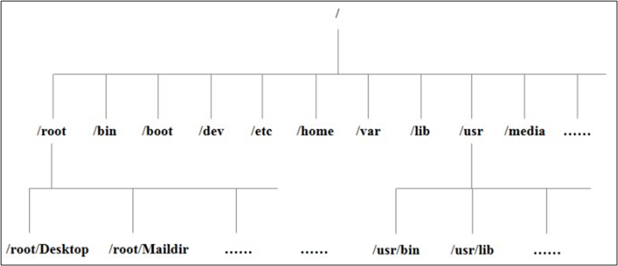

### 1、/bin目录（binary）

是Binary的缩写, 这个目录存放着最经常使用的`命令的可执行文件`，本质是/usr/bin的软链接。

### 2、/sbin目录（super binary）

s就是Super User的意思，这里存放的是系统管理员使用的系统管理程序，本质是/usr/sbin的软链接。

### 3、/home（user home）

存放普通用户的主目录，在Linux中每个用户都有一个自己的目录，一般该目录名是以用户的账号命名的。类似于Windows里的用户目录。

### 4、/root目录（root home）

该目录为系统管理员，也称作超级权限者的用户主目录。

### 5、/lib目录（library）

系统开机所需要最基本的动态连接共享库，其作用类似于Windows里的DLL文件。几乎所有的应用程序都需要用到这些共享库。

### 6、/etc目录（法语 etcetera各类系统配置文件等等）

所有的系统管理所需要的环境配置文件和子目录。

### 7、/usr目录（Unix System Resources）

这是一个非常重要的目录，`用户的很多应用程序和文件`都放在这个目录下，类似于windows下的Program Files目录。

### 8、/boot目录（boot启动）

这里存放的是启动Linux时使用的一些核心文件，包括一些连接文件以及映射文件，自己的安装别放这里。

### 9、/run目录（run运行）

系统运行产生和需要的一些重要文件。

### 10、/proc目录（Process File System）

这个目录是一个系统中运行的进程的虚拟映射的目录，我们可以通过直接访问这个目录来获取系统信息。

### 11、/srv目录（service服务目录）

service缩写，此目录用于存放系统运行时数据，特别是那些由系统上运行的服务所产生的数据。默认是空的。

### 12、/sys目录（system）

这是linux2.6内核的一个很大的变化。该目录下安装了2.6内核中新出现的一个文件系统。

### 13、/tmp目录（temp）

这个目录是用来存放一些临时文件的，过一段时间就会自动清除。

### 14、/dev目录（device）

类似于windows的设备管理器，把所有的硬件用文件的形式存储。

### 15、/media目录（media多媒体设备）

linux系统会自动识别一些设备，例如音响、耳机等等，当识别后，linux会把识别的设备挂载到这个目录下。

### 16、/mnt目录（mount挂载）

系统提供该目录是为了让用户临时挂载别的文件系统的，我们可以将外部的存储（U盘、移动硬盘）挂载在/mnt/上，然后进入该目录就可以查看里的内容了。默认是空的。

### 17、/opt目录（option可选的或第3方的）

主要用于安装可选的或第三方应用程序。比如你安装一个mysql数据库则就可以放到这个目录下。默认是空的。

### 18、/var（variable动态数据存储目录）

/var 被设计为动态数据存储目录，与存放静态文件（如配置、程序）的 /etc、/usr 形成明确区分。系统运行时产生的日志、缓存、临时数据、邮件等会持续写入、修改、增长的文件，都集中存放在这里，既保证了核心目录的静态性，也方便对动态数据进行统一管理（如单独分区、限制大小）。


# 第4章 远程登录

通常在工作过程中，公司中使用的真实服务器或者是云服务器，都不允许除运维人员之外的员工直接接触，因此就需要通过远程登录的方式来操作。所以，远程登录工具就是必不可缺的，目前，比较主流的有Xshell，SSH Secure Shell，SecureCRT，FinalShell等，同学们可以根据自己的习惯自行选择。

# 第5章 APT软件包管理器

## 5.1 概述

APT（Advanced Packaging Tools）是Debian及其派生Linux（Ubuntu 等）的软件包管理器，可以自动下载，配置，安装二进制或者源代码格式的软件包，因此简化了Unix系统上管理软件的过程。

注：Red Hat 系列（RHEL/CentOS/Fedora/Rocky/AlmaLinux）使用其他不同的包管理器。

## 5.2 常用命令

APT命令语法格式：

```bash
apt [选项] 命令
```

命令行软件包管理器 apt 提供软件包搜索，管理和信息查询等功能。它提供的功能与其他 APT 工具相同（像 apt-get 和 apt-cache），但是默认情况下被设置得更适合交互。

-  list - 根据名称列出软件包
-  **search -** 搜索软件包描述
-  show - 显示软件包细节
-  install - 安装软件包
-  reinstall - 重新安装软件包
-  remove - 移除软件包
-  autoremove - 卸载所有自动安装且不再使用的软件包
-  update - 更新可用软件包`列表`，**不会**升级已安装的软件包。比喻从购物网站下载更新最新的商品列表，但不更新已购买的商品，也不会下载新增的商品。
-  upgrade - 通过 安装/升级 软件来更新系统，安全升级（不删除包，不安装新依赖）
-  full-upgrade - 通过 卸载/安装/升级 来更新系统，完全升级（可能会删除一些包）
-  edit-sources - 编辑软件源信息文件
-  satisfy - 使系统满足依赖关系字符串

### 5.2.1 查询包

查询命令**不需要 sudo 管理员权限**，直接普通用户执行即可；只有安装 / 卸载 / 更新包（`apt install/remove/update`）才需要 sudo。

#### 1、list

> 命令格式：

```bash
apt list [参数选项] [软件包名称(可选)]

# Linux 所有命令对大小写敏感，必须小写 apt list，不能写 Apt List
# 但是软件包名不区分大小写
# 参数 --installed 可以简写为 -i，表示仅列出【系统已安装】的软件包
# 参数 --upgradeable 可以简写为 -u，表示仅列出【可升级】的软件包（已装 + 有新版本）
# 参数 --all-versions 可以简写为 -a，表示列出软件包的【所有可用版本】（含旧版 / 新版）
```

- `apt list`的软件包名**不支持模糊查询** ❌，如果要模糊查询使用`'*包名*'` 或 配合`grep`过滤（关于grep请看后面）
- `apt list`的输出结果格式是固定的，每行一个包，格式统一：`包名/发行版 版本号 架构 [状态]`

> 示例1

```bash
# 省略包名：列出软件源中所有可安装的包 + 系统中已安装的包，总数通常几万 +，输出内容会刷屏。
apt list 

# 指定具体包名
apt list net-tools # 查看已安装net-tools包
apt list --ia net-tools # 查看已安装net-tools包的所有版本

# apt原生模糊搜索（查所有带net的包）
apt list '*net*'
```


#### 2、search

> 命令格式：

```bash
apt search [参数] 关键词

# 参数--names-only：表示只检索软件包名，完全不看软件的描述 / 简介
# 参数-i、-u、-a同上
```

- 搜索维度：✅ 匹配**包名** + ✅ 匹配**包的描述 / 说明信息**
- `apt search`的关键词**支持模糊查询** ✔️
- `apt search`的输出结果格式是固定的，**两行一个包**，非常清晰
  - **第一行**：`包名/发行版 版本号 系统架构` → 和`apt list`的格式完全一致；
  - **第二行**：`包的描述信息` → 告诉你这个包是干嘛的、包含什么工具，**这是`apt list`没有的核心信息**！

> 示例：

```python
# 包名是完整的：精准搜索 软件包名完全等于 net-tools 的软件包（唯一匹配）
apt search net-tools

# 包名不完整：全局模糊搜索 所有包含字符 net 的软件包（apt search 默认原生模糊匹配）
# 匹配范围：软件包名 + 软件的完整描述 / 简介 / 说明文本 中，任意位置 只要包含 net 字符，都会被搜出来；
# 不区分大小写（比如 Net/NET/net 都能匹配）
# 缺点：结果会有很多「无关冗余包」，比如一个包名是abcde，但描述里写了network，也会被搜出来
apt search net

# 匹配范围：只检索软件包名，完全不看软件的描述 / 简介，是「包名专属模糊匹配」
# 包名中任意位置包含 net 字符就会匹配（比如 net-tools、network-manager、libnet1、netcat 都满足）
apt search --names-only net
```

#### 3、show

> 命令格式：

```bash
apt show [参数] 软件包名
# -i参数表示忽略大小写
# -a参数表示查看「所有可用版本」的完整详情
```

- `apt show ` 的包名**不支持模糊查询** ❌，必须写「完整精准包名」
- `apt show 包名` 的输出内容**非常丰富、格式固定**，是官方标准的软件包说明，内容比`apt list`/`apt search`多 10 倍以上，**所有重要信息都在这里**。

> 示例

```bash
apt show net-tools
```

#### 4、区别

✅ 三剑客 精准分工：

1. **`apt search 关键词` → 【找包】**：不知道包名，只知道功能 / 关键词（比如想找「网络工具」「数据库」），搜所有相关包，匹配「包名 + 包描述」，**用来找你需要的包**；
2. **`apt list 包名` → 【查状态】**：知道准确包名，快速看「是否安装、是否可升级、版本号」，信息极简精炼，**用来确认包的安装状态**；
3. **`apt show 包名` → 【看详情】**：知道准确包名，查看这个包的**完整详细信息**，内容最全最深度，**用来了解这个包到底是什么、有什么用、依赖什么**。

### 5.2.2  更新包

#### 1、update

> 命令格式

```bash
sudo apt update
```

✅ 作用`apt update` 的作用是：**从 Ubuntu 的官方软件源服务器，下载并刷新本地的「软件包索引数据库」**。这个索引数据库记录了所有可安装软件的**名称、最新版本号、下载地址、依赖关系**等信息。

✅ 通俗比喻：你打开手机应用商店，点击「下拉刷新」，刷新后看到哪些 APP 有新版本 → 这个「下拉刷新」的动作，就是 `apt update` 的作用。

✅ 关键细节

- **不下载、不安装、不更新任何软件本体**，只是「更新软件的版本信息」；
- **完全无风险**，执行这个命令永远不会出错、不会弄坏系统、不会占用大量磁盘空间；
- **必须优先执行**：执行 `upgrade`/`full-upgrade`/`install`/`reinstall`之前，一定要先执行 `apt update`，否则apt 会使用「过期的缓存」，系统不知道哪些软件有新版本，可能出现：**无效更新**或**安装失败、找不到包、安装的是旧版本、依赖缺失**等报错！

#### 2、upgrade

> 命令格式

```bash
# 一键更新
sudo apt upgrade

# 升级时自动确认所有操作，无需手动按Y回车（懒人必备，推荐）
sudo apt upgrade -y
```

✅ 作用：**根据 `apt update` 刷新的索引，下载并安装系统中所有软件包的「可用新版本」**。

✅ 通俗比喻：应用商店刷新后，点击「一键更新所有 APP」，只会升级 APP 版本，不会卸载你手机里的任何 APP → 这个动作就是 `apt upgrade` 的作用。

✅ 核心规则：

1. **只做「升级」，不做「删除」**：只会把已安装的软件包升级到新版本，**绝对不会删除你系统中任何已安装的软件包**；
2. **智能处理依赖**：升级时会自动下载安装「新版本软件需要的依赖包」，保证软件升级后能正常运行；
3. **遇到冲突则跳过**：如果某个软件包的升级，**需要删除其他已安装的软件包才能完成** → `apt upgrade` 会直接**跳过这个软件的升级**，保证系统现有软件不丢失；
4. **保留旧配置**：升级软件时，会保留你之前对软件的自定义配置文件（比如 MySQL/Nginx 的配置），不会覆盖。

> 示例

```bash
# 日常更新
sudo apt update && sudo apt upgrade -y && sudo apt autoremove -y
```


#### 3、full-upgrade

> 命令格式：

```bash
sudo apt full-upgrade

sudo apt full-upgrade -y
```

✅ 作用：`apt full-upgrade` 是 **`apt upgrade` 的「加强版」**，它包含了 `apt upgrade` 的所有功能，同时增加了「智能清理 + 深度处理依赖冲突」的能力。

✅ 核心规则

1. 包含 `apt upgrade` 的全部升级功能：正常升级所有可更新的软件包；
2. **允许「删除旧软件包」**：如果某个软件包的新版本，**必须删除一些过时 / 冲突的旧依赖包、旧软件包** 才能完成升级 → `full-upgrade` 会**自动删除这些冲突的包**，然后完成升级；例如：升级 A 软件需要卸载旧版的 B 插件 → `upgrade` 会跳过 A 的升级，`full-upgrade` 会卸载 B 插件，然后完成 A 的升级。
3. **处理「系统级大版本依赖变更」**：比如内核更新、系统组件更新、软件源版本迭代导致的依赖变更，只有 `full-upgrade` 能处理；
4. **保留旧配置**：同样保留自定义配置文件，不会覆盖。

> 示例

```bash
# 深度完整更新（建议每月执行 1 次，或长期未更新系统）
sudo apt update && sudo apt full-upgrade -y
```


#### 4、区别

|        命令        |     核心行为     |             是否删除软件包             |  处理依赖冲突能力  | 风险等级 |                        适用场景                         |    优先级    |
| :----------------: | :--------------: | :------------------------------------: | :----------------: | :------: | :-----------------------------------------------------: | :----------: |
|    `apt update`    | 更新软件版本索引 |                  ❌ 否                  |         无         |  无风险  |                所有更新前的必做前置步骤                 | ✅ 必须先执行 |
|   `apt upgrade`    | 常规升级所有软件 |  ❌ 否，只升不删，安全保守，保所有软件  |  弱（冲突则跳过）  | 极低风险 |            日常更新、每周维护、普通用户首选             | ✅ 日常主力 ✔️ |
| `apt full-upgrade` | 彻底升级所有软件 | ✅ 是，可删冲突包，激进彻底，保最新版本 | 强（解决所有冲突） | 中等风险 | 系统大版本更新、内核更新、长期未更新系统、开发者 / 运维 |   按需使用   |


### 5.2.3 安装包

#### 1、install

> 命令格式：

```bash
sudo apt install 软件包名1 软件包名2 [参数]
# -y 参数，表示自动回答「是」，跳过所有确认弹窗，一键静默安装。
# --only-upgrade参数，表示仅对「系统中已经安装」的包进行升级，不会对未安装的包执行安装操作。

# 默认apt install会装软件的最新稳定版，如果想装特定版本
sudo apt install 软件包名1=完整版本号 软件包名2 [参数]  
```

- `apt install` → **从系统软件源中下载并安装指定的软件包**，同时**自动下载安装所有必需的依赖包**（不用手动处理依赖，apt 全自动搞定）。

> 示例：

```bash
# 只升级已安装的sl到最新版，未安装则不操作（sl趣味小工具，小火车动画，安装后运行sl试一下）
ssudo apt install sl --only-upgrade -y

# 自动确认批量安装多个包（ncdu磁盘空间分析工具，安装后运行ncdu试一下）
sudo apt install sl ncdu -y
```

#### 2、reinstall

> 命令格式：

```bash
sudo apt reinstall 软件包名
```

✅ `apt reinstall` → **重新安装系统中「已经安装」的软件包**，注意：**仅对已安装的包生效**，如果包没安装，执行会报错！

✅ `apt reinstall` 只能重装「通过 apt 安装的包」，如果是手动解压 / 编译安装的软件，这个命令无效！

✅ `apt reinstall`不是随便用的，**只有以下 3 种情况，才需要执行重装**：

- ✔️ 场景 1：软件的**核心文件被误删除 / 损坏**

- ✔️ 场景 2：软件的**配置文件被改乱 / 失效**

- ✔️ 场景 3：软件**运行异常、闪退、功能缺失**


> 示例：

```bash
sudo apt reinstall net-tools -y
```

#### 3、区别

> apt install和apt reinstall的区别：

✔️ **`apt install 包名`** → 作用对象是「未安装的包」，执行后：**下载 → 解压 → 安装 → 配置**，是「从无到有」的过程；如果包**已安装**，执行这个命令会提示「已经是最新版，无需操作」，不会做任何修改。

✔️ **`apt reinstall 包名`** → 作用对象是「已安装的包」，执行后：**重新下载完整安装包 → 覆盖安装原有文件 → 重新配置**，是「从有到新」的过程；核心是**修复损坏的文件、重置软件配置、还原默认设置**，不会删除你的数据。

### 5.2.4 卸载包

#### 1、remove

> 命令格式

```bash
# 卸载单个包
sudo apt remove 软件包名

# 卸载多个包，空格分隔
sudo apt remove 软件包名1 软件包名2
```

✅ 作用：**卸载【你指定的软件包】本身**，但是 **不会卸载这个软件包对应的依赖包和配置文件**！

✅ 典型场景：适合「临时卸载某个软件，可能之后还要重装」的情况：因为依赖包还在，重装时不需要重新下载依赖，速度更快，配置文件也保留了，重装后可以直接用之前的配置。

> 示例

```bash
sudo apt remove net-tools
```

#### 2、autoremove

> 命令格式

```bash
# 最常用：无参数，自动清理系统所有无用依赖包（推荐定期执行）
sudo apt autoremove

# 组合用法：卸载指定包 + 自动清理其依赖（重点推荐）
sudo apt autoremove 软件包名列表
```

- ✅ 作用：自动检测并卸载系统中所有「孤立的、无主的依赖包」，也就是那些**曾经被某个软件包依赖安装，但现在对应的主软件包已经被你用`apt remove`卸载了，这些依赖包已经没有任何作用了**。

- ✅特性：
  - 只清理「无用依赖」，**绝对不会卸载你手动安装的任何主程序**
  - 不会删除配置文件；
  - 可以单独执行（无参数），也可以跟包名

> 示例

```bash
# 自动清理系统所有无用依赖包
sudo apt autoremove

# 卸载net-tools + 自动清理其依赖，等价于 sudo apt remove net-tools && sudo apt autoremove
sudo apt autoremove net-tools
```

#### 3、区别

- `apt remove` 是**卸你指定的软件**，`apt autoremove` 是**清系统里的依赖垃圾**；前者是「卸软件」，后者是「做清洁」。

|       命令        |      核心操作      |   是否删除依赖包   |  是否需要指定包名  |         本质         |
| :---------------: | :----------------: | :----------------: | :----------------: | :------------------: |
| `apt remove 包名` | 卸载「指定的主包」 | ❌ 不删除任何依赖包 |     ✅ 必须指定     | 主动卸载「目标软件」 |
| `apt autoremove`  | 清理「无用依赖包」 |   ✅ 只删无用依赖   | ❌ 无需指定（推荐） | 被动清理「系统垃圾」 |


# 第6章 常用基本命令

## 6.1 帮助命令

### 6.1.1 Manual Packages（了解）

#### 1、手册页说明文档

> 查看手册页说明文档的方式

```bash
man man
```

> 手册页简介

（1）名称

**man** - 系统参考手册的接口

（2）概述

- man [man 选项] [[章节] 页 ...] ...
- man -k [apropos 选项] 正则表达式 ...
- man -K [man 选项] [章节] 关键词 ...
- man -f [whatis 选项] 页 ...
- man -l [man 选项] 文件 ...
- man -w|-W [man 选项] page ...

（3）描述

手册页（Manual Packages），简称“man pages”，是Unix和类Unix系统（包括Linux和macOS）上提供程序、函数、命令及文件格式文档的一种方式。手册页是用户和管理员获取命令用法、程序功能、配置文件规范和某些API函数描述的重要资源。

手册的章节号（页）及其包含的手册类型对应关系如下。

- 1-可执行程序或shell命令：包含了绝大多数用户级别的外部命令或程序的文档，这些命令通常位于用户的PATH环境变量指定的目录下，如/bin、/usr/bin等。
- 2-系统调用（内核提供的函数）：提供了内核提供的系统调用的文档，系统调用是应用程序与操作系统内核之间进行交互的接口。
- 3-库调用（程序库中的函数）：包括标准C库函数和其他库函数的文档，这些库函数提供了执行特定任务（如字符串处理、文件操作）的编程接口。
- 4-特殊文件（通常位于/dev）：涉及到系统上的特殊文件，如设备文件的说明。
- 5-文件格式和规范，如/etc/passwd：描述了各种文件格式和配置文件的结构，比如/etc/passwd或/etc/shadow文件的格式。
- 6-游戏和屏保：有些系统会在这一节中提供游戏和屏保程序的文档。
- 7-杂项（包括宏包和规范）：包含了一些杂项文档，如宏包、约定等。如man(7)，groff(7)，man-pages(7)。
- 8-系统管理命令（通常只针对root用户）：提供了系统管理员级别的命令或程序的文档，这些命令通常位于/sbin、/usr/sbin等目录。
- 9-内核例程（并非所有的发行版都有）：某些系统会提供内核级别函数和例程的文档。

我们常用的文档位于第1、2、3、7页。

（4）手册页引用格式

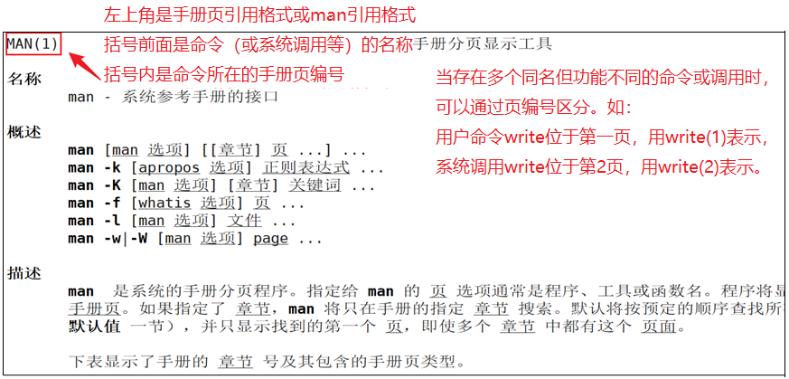

#### 2、man命令获得帮助信息

> 命令格式

```bash
man [页编号] [命令或配置文件]	
```

> 示例

```bash
# （1）查看ls命令的帮助信息
man ls

# （2）查看用户命令write的帮助信息
man write

# （3）查看系统调用write的帮助信息
man 2 write   
# 默认的手册页不完整，在第 2 节中没有关于 write 的手册条目
# 可以执行 sudo apt install manpages manpages-dev 下载最新的手册页包，再查看
```

### 6.1.2 help获取shell内建命令的帮助信息（了解）

shell内建命令是shell的一部分，他们没有单独的可执行文件或手册页，这类命令的文档通过help命令访问。

> 命令格式

```bash
# 查看所有内建命令
help

# 查看具体内建命令的帮助信息，例如内建命令cd
help cd 或 cd --help
```

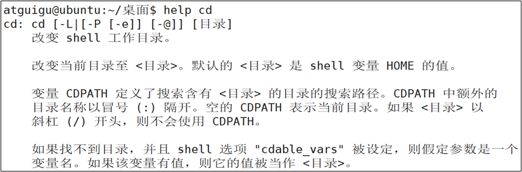

### 6.1.3 部分常用快捷键

|    快捷键    |                           功能说明                           |
| :----------: | :----------------------------------------------------------: |
| **Ctrl + C** |        终止当前运行的程序 / 命令（最常用，强制中断）         |
| **Ctrl + L** |          清屏（等价于输入 `clear`，不删除历史命令）          |
| **Ctrl + U** |              从光标位置**删除到行首**的所有字符              |
| **Ctrl + K** |              从光标位置**删除到行尾**的所有字符              |
| **Ctrl + W** |          向前删除**一个单词**（以空格 / 标点分隔）           |
|   **Tab**    | 命令 / 文件名**自动补全**（按一次补全，按两次显示所有匹配项） |
|  **↑ / ↓**   |            上下切换**历史命令**（按最近使用顺序）            |
| **Alt + .**  | 粘贴上一条命令的**最后一个参数**（比如上一条是 `ls /home/user`，按后会粘贴 `/home/user`） |

## 6.2 文件目录类

### 6.2.1 pwd 打印工作目录

pwd：对应单词print work directory

> 命令格式：

```bash
pwd
```

✅作用：pwd用于显示当前工作目录的绝对路径

> 示例


### 6.2.2 ls列出目录的内容

ls：对应单词list

> 命令格式

```bash
ls [选项] [目录或是文件]
```

| **选项** | **功能**                                                     |
| -------- | ------------------------------------------------------------ |
| **-a**   | 全部的文件，连同隐藏档（开头为 . 的文件） 一起列出来（常用） |
| **-l**   | 长数据串列出，包含文件的属性与权限等等数据；（常用）         |
| **-R**   | 递归（recursion）列出目录下所有子目录及文件                  |

> 示例

```bash
# （1）查看当前目录的所有内容信息
ls -al
ll  # ll是ls -alF的别名   （-F参数表示给文件分类标注符号，* → 可执行文件，/ → 目录，@ → 符号链接，| → 管道文件）
```


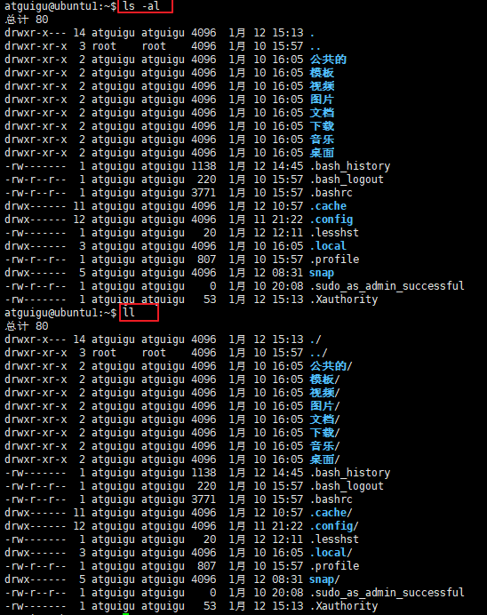

✅每行列出的信息依次是：文件类型与权限 链接数 文件属主 文件属组 文件大小(字节) 建立或最近修改的时间（月、日、时分） 名称

### 6.2.3 cd 切换目录

cd: 对应单词change directory

> 命令格式

```bash
cd [参数]
```

✅绝对路径 or 相对路径：以/开头的路径名是绝对路径，否则就是相对路径

> 示例

```bash
# 绝对路径：切换到 /opt目录
cd /opt

# 绝对路径：切换到 /根目录
cd /

# 如果现在在根目录下，也可以用相对路径的方式，切换到 /opt目录。
cd opt

#回到自己的home目录
cd  或  cd ~

# 回到上一次所在目录
cd -

#回到当前目录的上一级目录  
cd ..
```

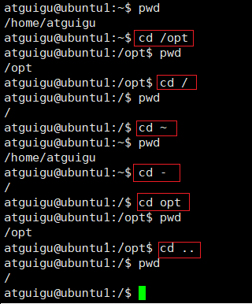

```bash
# 以下部分请看 6.2.14 软链接部分
cd -P 目录   # 物理跳转目录（遇软链接解析真实路径）
cd -P .     # 修正当前目录为物理路径
cd -P ..    # 基于物理路径跳上级目录
```

### 6.2.4 mkdir 创建一个新的目录

mkdir: 对应单词make directory

> 命令格式

```bash
mkdir [选项] 要创建的目录

# 选项-p：表示创建多层目录 (目标目录及其父目录)  
```

> 示例

```bash
# 创建一级目录：在当前目录下创建test目录
mkdir test

#创建一级目录：在当前目录的子目录test下创建demo1目录，如果父目录test不存在，创建demo1失败
mkdir test/demo1

#创建一级目录：在/home/atguigu目录下创建test2目录
mkdir /home/atguigu/test2

#创建多级目录：创建aaa目录，如果父目录 test/demo2/a/aa不存在一并创建
mkdir -p test/demo2/a/aa/aaa
```

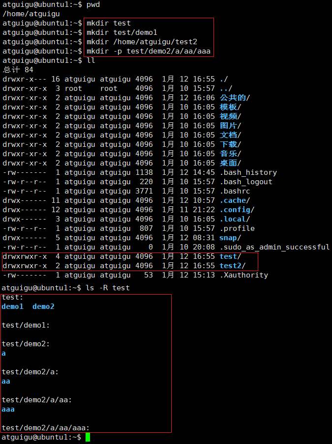

### 6.2.5 touch 创建空文件

> 命令格式：

```bash
touch 文件名称
```

✅touch：单词的意思是触摸，如果touch的文件不存在，就会创建一个空文件；如果touch的文件已存在，就会更新文件最后访问和修改时间

> 示例

```bash
# 在当前目录下创建一个空文件note.txt
touch note.txt

# 在当前目录的test/demo1子目录下创建1.txt
touch test/demo1/1.txt

# 在/home/atguigu/test2目录下创建2.txt
touch /home/atguigu/test2/2.txt

# 在当前目录的test2子目录下创建a.txt,b.txt,c.txt
touch test2/{a,b,c}.txt

```

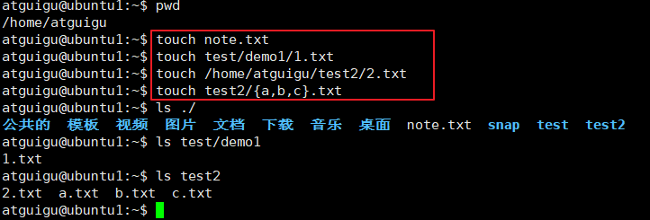

### 6.2.6 cp复制文件或目录

cp: 对应的单词copy

> 命令格式

```bash
cp [选项] source dest  #复制source到dest

# -r 选项表示递归复制整个文件夹
```

> 示例1：复制单个文件

```bash
# 复制：源文件是note.txt，目标文件是test/demo1/note副本.txt
cp note.txt test/demo1/note副本.txt
```

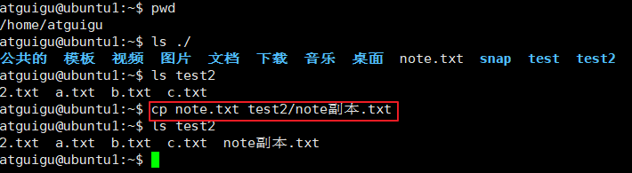

> 示例2：复制目录

```bash
# 创建文件
touch test/demo2/a/aa/aaa/hello.txt

#递归复制整个test文件夹（含test文件夹）到test2目录
cp -r test test2
```

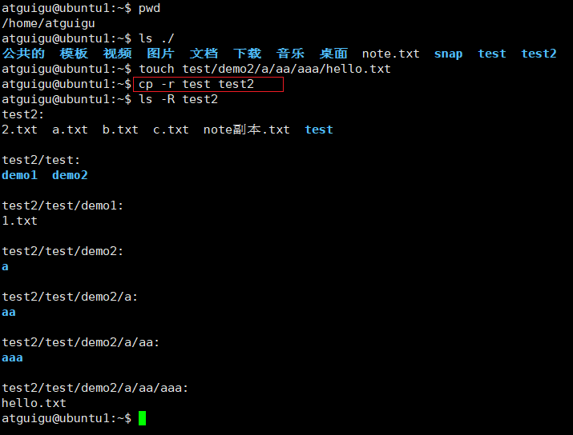

> 示例3：复制目录下的所有文件或子目录

```bash
#创建文件
touch test/demo2/world.txt

#递归复制整个test/demo2文件夹（不含demo2文件夹）到test2目录
cp -r test/demo2/* test2
```

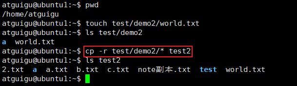

### 6.2.7 rm删除文件或目录

rm：对应单词remove

> 命令格式

```bash
rm [选项] 文件或目录

#-r	递归删除目录及其中所有内容   （默认只能删除文件）
#-f	强制执行删除操作，而不提示用于进行提示确认。
#-v	显示指令的详细执行过程
```

> 示例1

```bash
#删除文件
rm test/demo1/1.txt

#删除文件时显示指令的详细执行过程
rm -v test/demo1/note副本.txt

#删除目录（包括目录本身）
rm -r test2/test

#删除目录下的内容（不包括目录本身）
rm -r test2/*
```

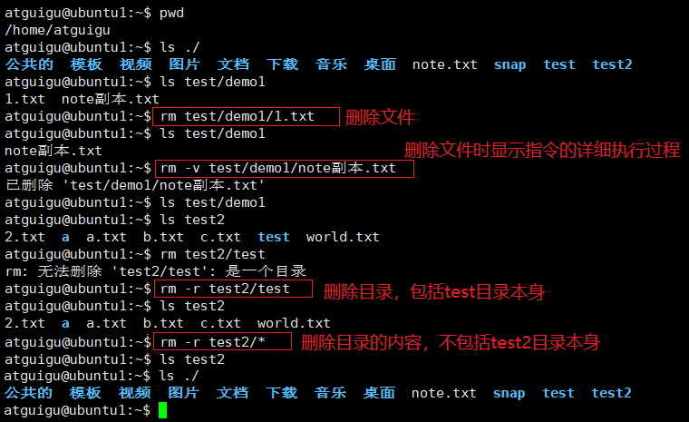

> 示例2

```bash
# 修改note.txt的权限：文件所有者 只有【读权限】 + 文件所属组 只有【读权限】 + 系统其他所有用户 只有【读权限】
chmod 444 note.txt

#静默强制删除note.txt文件，不询问
rm -f note.txt
```

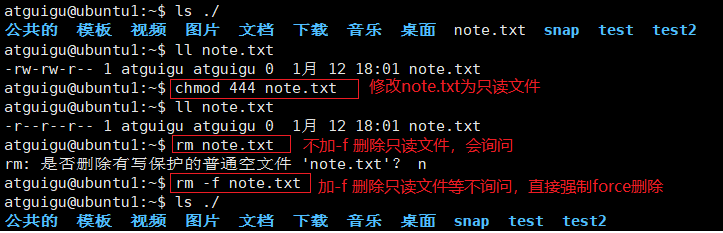

### 6.2.8 mv移动或重命名文件或目录

mv：对应单词move

> 命令格式

（1）移动或重命名文件

```bash
mv 原文件名 目标目录
mv 原文件名 目标目录/新文件名
```

🔴注意：

- 如果指定了新文件名，就是重命名；否则就是移动

- 如果已存在同名文件，则会直接覆盖。

（2）移动或重命名目录

```bash
mv 原目录名 新目标目录名
```

🔴注意：

- 如果原目录和新目标目录属于同一个目录，且同一个目录不存在同名的其他目录，则是重命名。其余的都是移动。
- 如果移动的新目标中存在同名目录，则会出现嵌套。

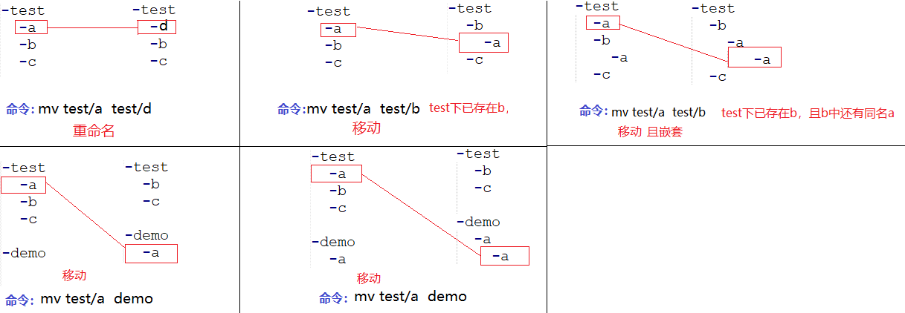

> 示例

```bash
# 重命名test目录下的hello.txt文件为hi.txt
mv test/hello.txt test/hi.txt  # 同目录

# 移动test目录下的hi.txt文件到test/demo1目录下，同时重命名文件
mv test/hi.txt test/demo1/xixi.txt

# 移动test/demo1目录下的xixi.txt到test目录下，保留原文件名
mv test/demo1/xixi.txt test

# 重命名test下的demo1目录为demo3
mv test/demo1 test/demo3

# 移动test下的demo3到test/demo2中
mv test/demo3 test/demo2 # 因为test中已存在demo2
```

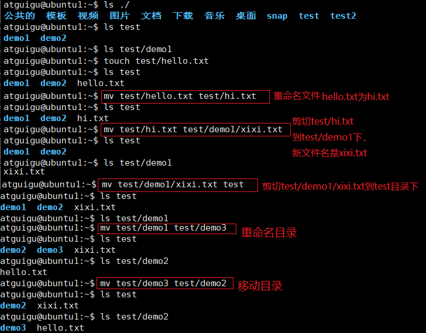

### 6.2.9 cat查看文件内容

cat：对应的单词concatenate（连接、串联）

> 命令格式

```bash
#在终端查看单个文件内容
cat 文件
cat -n 文件 # -n 表示显示所有行的行号，包括空行。

#连接多个文件内容
cat 文件1 文件2 	  # 在终端查看多个文件内容连接后的结果

# 写文件
cat 文件1 文件2 > 文件3 # 将多个文件内容连接后写入文件3。
cat 文件1 文件2 >> 文件3 # 将多个文件内容连接后写入文件3。
# > 如果文件不存在，则创建新文件；如果文件已存在，则覆盖。
# >> 如果文件不存在，则创建新文件；如果文件已存在，则追加。

#创建新文件 + 在终端输入内容并写入到文件（写入内容后Ctrl + D保存）
cat > 文件
cat >> 文件
```

> 示例

```bash
# 在test下创建新文件hello.txt，并将输入内容写入到hello.txt文件（输入内容后，Ctrl + D保存）
cat > test/hello.txt

# 创建test/world.txt文件，并写入内容
cat > test/world.txt

#查看test/hello.txt文件内容
cat test/world.txt

#查看test/hello.txt文件内容
cat test/world.txt

#查看test/hello.txt和test/world.txt文件内容连接的结果
cat test/hello.txt test/world.txt

#将test/hello.txt和test/world.txt文件内容连接后写入到hello_world.txt文件中
cat test/hello.txt test/world.txt > hello_world.txt

#查看hello_world.txt文件内容
cat hello_world.txt

#查看hello_world.txt文件内容，并加行号
cat -n hello_world.txt
```


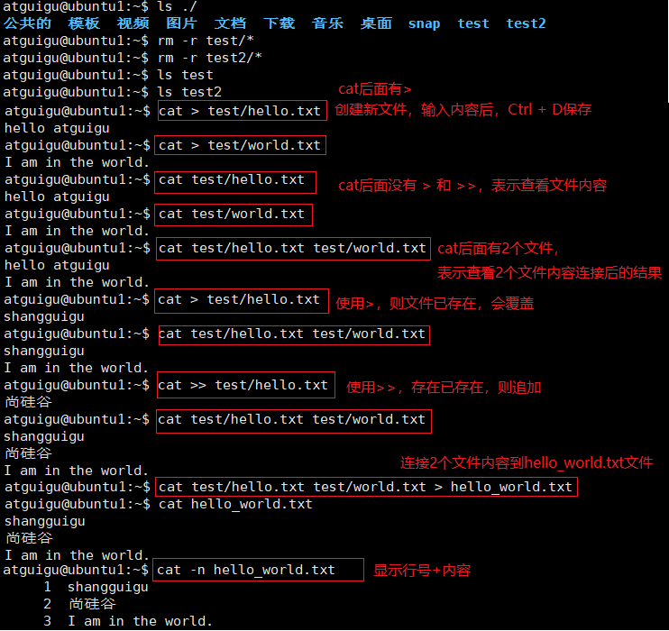

### 6.2.10 tail输出文件尾部内容

> 命令格式

```bash
tail  文件 			# 功能描述：默认查看文件尾部10行内容
tail  -n  count 文件 	# 功能描述：查看文件尾部count行内容
tail  -F  文件		# 功能描述：实时显示文件最新追加的内容，监视文件变化
```

> 示例

```bash
#查看 hello_world.txt 文件最后2行内容
tail -n 2 hello_world.txt

#实时显示hello_world.txt文件最新追加的内容，监视文件变化
tail -F hello_world.txt
```


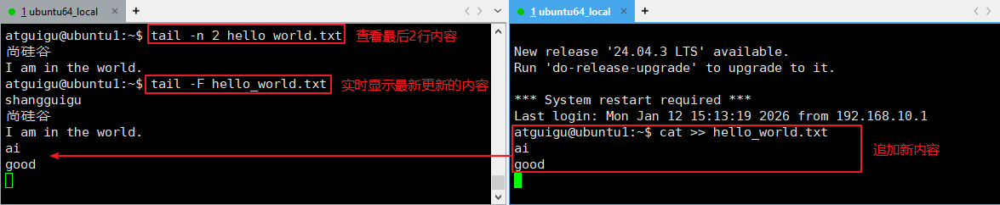

### 6.2.11 echo 输出内容

> 命令格式

```bash
echo 内容
echo -e "内容"  # 如果内容中包含转义字符，需要加""，和-e

echo 内容 >或>> 文件
echo -e "内容" >或>> 文件
```

> 示例

```bash
#在控制台回显helloworld
echo helloworld

#在控制台回显 hello	world
echo -e "hello\tworld"

#把helloworld写入到1.txt文件
echo helloworld > 1.txt

#把hello换行world追加到1.txt
echo -e "hello\nworld" >> 1.txt
```

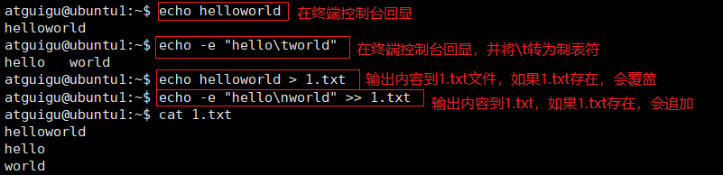

### 6.2.13 >和>>重定向

> 命令格式

```bash
ls [选项] [目录或是文件] >或>> 文件
cat >或>> 文件
cat 文件1 文件2 >或>> 文件3
echo 内容 >或>> 文件
echo -e "内容" >或>> 文件
# cat和echo用法示例请看对应小节
```

✅>：覆盖模式

✅>>：追加模式

> 示例

```bash
ll test>test_list.txt
```


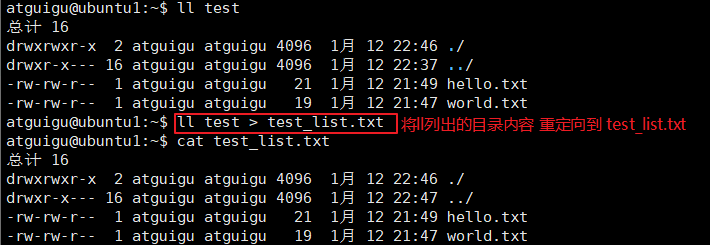

### 6.2.14 ln软链接（了解）

ln：对应的单词link

> 命令格式

```bash
# 创建软链接
ln -s [原文件或目录] [软链接名]

# 删除软链接
rm 软链接名
unlink 软链接名

#cd -P 参数-P表示跳转到实际物理路径，而非快捷方式路径
cd -P 目录   # 物理跳转目录（遇软链接解析真实路径）
cd -P .     # 修正当前目录为物理路径
cd -P ..    # 基于物理路径跳上级目录
```

✅软链接也成为符号链接，类似于windows里的快捷方式，有自己的数据块，主要存放了链接其他文件的路径。


> 示例

```bash
# 在/home/atguigu/test目录下创建软链接h，它对应的源文件是/home/atguigu/test/demo1/message/hello.txt
ln -s /home/atguigu/test/demo1/message/hello.txt /home/atguigu/test/h

# 在/home/atguigu/test目录下创建软链接m，它对应的源目录是/home/atguigu/test/demo1/message
ln -s /home/atguigu/test/demo1/message /home/atguigu/test/m
```

✔️ 必须加 `-s` 参数

✔️访问软链接 = 访问源文件 / 源目录

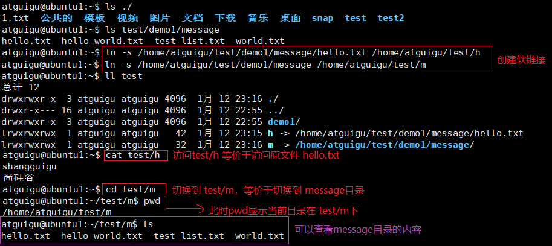

> 示例2

```bash
#cd -P 参数-P表示跳转到实际物理路径，而非快捷方式路径
cd -P .     # 修正当前目录为物理路径
cd -P ..    # 基于物理路径跳上级目录
cd -P 目录   # 物理跳转目录（遇软链接解析真实路径）
```


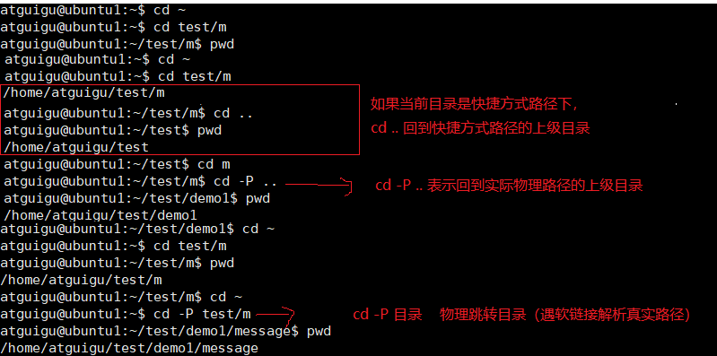

> 示例3

```bash
rm test/h
```

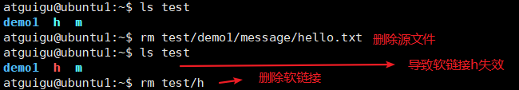

✔️删除软链接，**绝对不会影响源文件 / 源目录**

> ❌问题：当创建软链接时，源文件和软链接都使用相对路径会出现软链接失效

原因：软链接中记录的路径，是「你写的源路径原文」，不会自动转换成绝对路径。

例如：你执行 `ln -s test/demo1/message/hello.txt test/h` 时，系统会把 `test/demo1/message/hello.txt` **一字不差的写入软链接 `test/h` 中**。你的软链接存放在 `test/` 目录下，那么系统会从 `test/` 目录开始找 `test/demo1/message/hello.txt`，最终拼接的路径是`test/ + test/demo1/message/hello.txt = test/test/demo1/message/hello.txt`。而你的真实源文件路径是 `test/demo1/message/hello.txt`，系统找的是 `test/test/xxx`，**自然找不到源文件**，软链接直接变成「死链接」。

### 6.2.15 history 查看已经执行过历史命令（了解）

> 命令格式

```bash
history # 查看已经执行过历史命令

history -c #临时清空 当前终端的历史命令

history -c && history -w # 永久彻底清空 所有历史命令
rm /home/用户/.bash_history # 永久彻底清空 所有历史命令
```


## 6.3 VI/VIM编辑器

### 6.3.1 vi和vim是什么

VI是Unix操作系统和类Unix操作系统中最通用的文本编辑器。

VIM编辑器是从VI发展出来的一个性能更强大的文本编辑器。可以主动的以字体颜色辨别语法的正确性，方便程序设计。VIM与VI编辑器完全兼容。

在终端中执行以下命令安装vim：

```bash
sudo apt update
sudo apt install vim -y
```

### 6.3.2 准备测试数据

拷贝/etc/profile 数据到当前目录下

```bash
cp /etc/profile ./
```

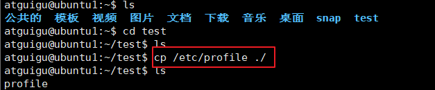

### 6.3.3 vim编辑器的三种模式

```
vim 文件名.txt
```

✅**一般模式**：以vim打开一个文档就直接进入一般模式了，又称为默认的模式、普通模式、中转站。在这个模式中， 你可以使用『上下左右』按键来移动光标，你可以使用『删除字符』或『删除整行』来处理档案内容， 也可以使用『复制、贴上』来处理你的文件数据。

✅**编辑模式**：在一般模式中可以进行删除、复制、粘贴等的动作，但是却无法编辑文件内容的！要等到你按下『i, I, o, O, a, A』等任何一个字母之后才会进入编辑模式，又称为插入模式。而如果要回到一般模式时， 则必须要按下『Esc』这个按键即可退出编辑模式。

✅**命令模式**：在一般模式当中，输入『 : / ?』3个中的任何一个按钮，就可以将光标移动到最底下那一行，又称为「末行模式、底线命令模式」。所有操作都是「输入指令 → 按回车执行」，主要处理**批量操作、文档级配置、保存退出、查找替换、行号显示**等复杂需求

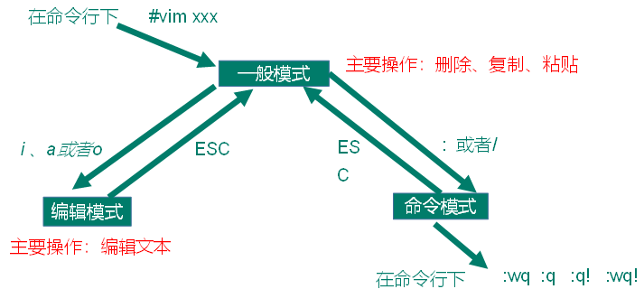

### 6.3.4 一般模式

**Vim 打开文件后，默认直接进入的就是「一般模式」，是 Vim 的核心模式**，也是所有模式的「中转站」—— 所有模式的切换，几乎都要先回到一般模式。

> ✔ 核心特点：**不能直接输入文字**，所有键盘敲击都被识别为「操作指令」，比如移动光标、复制、粘贴、删除、撤销等。

✅**光标精准移动**：

- `hjkl`（左下上右）、
- `w`（下一个单词）、`b`（上一个单词）
- `^`（当前行首字符）、`$`（行尾）、`0`（行首）、`)`（下一行行首字符）
- `gg`（文档首行）、`shift + g`或`G`（文档尾行）、`5 然后shift + g`（跳第5 行）

✅**文本快速操作**：

- `yy`（复制当前行）、`5yy`（复制当前行 + 往下 4 行，共 5 行）、`ggVG+y`（复制全文）
- `p`（粘贴到光标后/下一行）、`shift+p`或`P`（粘贴到光标前/上一行）
- `dd`（删除/剪切当前行）、`5dd`（删除/剪切 5 行）、`ggVG+d`（删除/剪切全文）
- `yw`（复制光标至单词尾）、`dw`（删除/剪切至下一个单词头）
- `x`（删除/剪切光标所在单个字符）、`shift+x`或`X`（删除/光标前面的单个字符）
- `r + 新字符`（替换光标所在单个字符，不用进编辑模式）

✅**快捷辅助操作**：`u`（撤销上一步操作）、`ctrl+r`（重做撤销的操作）

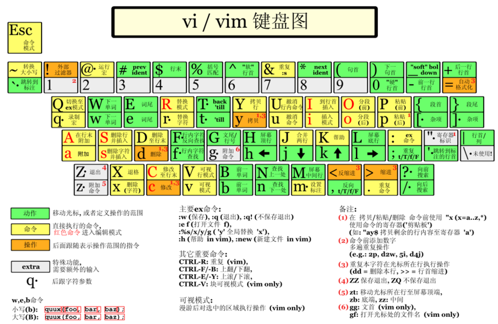

### 6.3.5 编辑模式

**Vim 中唯一能输入 / 修改文字的模式**，只能输入文字、修改内容，几乎没有「快捷操作」，所有按键都会被识别为「字符输入」。

按下『i, I, o, O, a, A』任一个字符后 Vim 底部会出现 `-- INSERT --`（插入） 字样，代表成功进入，常用 6 个高频进入方式（按需选择）：

1. `i` → 在**光标当前位置** 开始插入（最常用，原地编辑）
2. `a` → 在**光标后一位** 开始插入（补充输入，不用移动光标）
3. `o` → 在**光标当前行的下方** 新建一行，光标跳至新行开头插入（最常用，新建空行编辑）
4. `O` → 在**光标当前行的上方** 新建一行，光标跳至新行开头插入
5. `I` → 直接跳至**光标所在行的行首** 开始插入
6. `A` → 直接跳至**光标所在行的行尾** 开始插入
7. `R`→ 替换模式

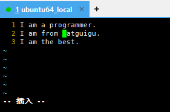

按下键盘左上角的 **ESC 键**，Vim 底部的 `-- INSERT --` 字样会消失，代表回到一般模式。

### 6.3.6 命令模式

在一般模式当中，输入『 : / ?』3个中的任何一个按钮就会进入命令模式，Vim 最底部会出现一个 『 : / ?』符号，光标会定位在这个符号后面，代表成功进入命令模式，所有操作都是「输入指令 → 按回车执行」。

- `/` → 进入「正向查找模式」，输入关键词按回车，光标跳至匹配关键词

- `?` → 进入「反向查找模式」，输入关键词按回车，光标向上匹配关键词

  - 忽略大小写（:set ignorecase），区分大小写（:set noignorecase），高亮显示（:set hlsearch）、取消高亮显示（:set nohlsearch）

  - 继续向下查找下一个（*）、继续向上查找下一个（#）

- `:w` → 保存当前文档（仅保存，不退出 Vim）

- `:w 新文件名` → 另存为新文件（比如`:w test2.txt`，不覆盖原文件）

- `:q` → 退出 Vim（文档无修改时可用，有修改会提示报错）

- `:wq` → 保存 + 退出 Vim（最常用，等价于 `:x`）

- `:q!` → 强制退出 Vim，**放弃所有修改**（写错内容不想保存）

- `:wq!`→ 保存 + 强制退出 Vim

- `:set nu` → 显示行号（编辑代码 / 长文档刚需，重启 Vim 失效）

- `:set nonu` → 隐藏行号

- `:n` → 跳转到文档的第 n 行（比如`:5`跳第 5 行，`:100`跳第 100 行）

- `:%s/旧内容/新内容/g` → 全文查找「旧内容」并替换为「新内容」（批量替换神器）

- `:d`（删除当前行）、`:m,nd`（删除m到n行）`:%d`或`:1,$d`（删除全文）、

  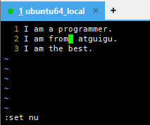

## 6.4 用户管理命令

### 6.4.1 root用户

#### 1、root用户概述

> root 用户是具有最高权限的超级用户，其用户 ID（UID）固定为 **0**。

✅root 用户特点

root 用户拥有系统的所有权限，可以对系统进行任何操作，但由于其权限过大，不当操作可能会导致系统出现严重问题，甚至无法正常运行。root 权限主要用于**系统级操作**，普通用户权限无法完成的任务均需要 root 介入，典型场景包括：

1. **系统配置修改**：编辑 `/etc` 目录下的配置文件（如网络配置 `/etc/network/interfaces`、用户配置 `/etc/passwd`）。
2. **软件安装与卸载**：使用包管理器（如`apt`）安装系统级软件（如 MySQL），或编译安装源码包到系统目录（`/usr/local`）。
3. **用户与权限管理**：创建 / 删除用户（`useradd`/`userdel`）、修改用户组（`usermod`）、调整文件 / 目录权限（`chmod`/`chown`）。
4. **进程与服务管理**：启动 / 停止 / 重启系统服务（`systemctl`、`service`），杀死任意进程（`kill`/`pkill`），查看所有进程（`ps -ef`）。
5. **硬件操作**：挂载 / 卸载磁盘分区（`mount`/`umount`）、配置外设（如打印机、USB 设备）。
6. **系统维护**：执行磁盘检查（`fsck`）、系统更新（`apt update/upgrade`）、备份核心系统文件。

✅默认情况

Ubuntu 默认情况下，root 用户是被锁定的，没有设置默认密码。这是为了提高系统的安全性，鼓励用户使用普通用户账户，并通过 sudo 命令来临时获取 root 权限执行需要高权限的操作。

✅为 root 用户设置密码

root 密码需满足复杂度要求（字母 + 数字 + 特殊字符，长度≥8 位），并定期更换；避免使用简单密码（如 `123456`、`root`）。

如果确实需要使用root用户登录或执行操作，可以通过以下步骤为root用户设置密码。以普通用户身份登录到 Ubuntu 系统（这里设置密码为atguigu123）：

```shell
sudo passwd root回车
```


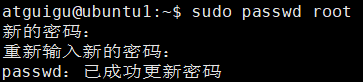

- 系统会提示你输入当前普通用户的密码，输入正确后按回车键。
- 接着会要求你设置 root 用户的新密码，输入两次相同的新密码后，root 用户的密码就设置完成了。

✅root 与普通用户的核心区别

|  对比维度  |                          root 用户                           |                        普通用户                        |
| :--------: | :----------------------------------------------------------: | :----------------------------------------------------: |
|    UID     | 固定为 0（Linux 系统通过 UID 识别用户身份，而非用户名，即使修改 root 用户名，UID 为 0 的用户仍拥有超级权限） |         从 1000 开始（部分发行版从 500 开始）          |
|    权限    |                  无任何限制，可操作所有资源                  | 仅拥有自身家目录和授权文件的权限，无法修改系统核心文件 |
| 命令提示符 |                             `#`                              |                          `$`                           |
|   家目录   |                           `/root`                            |                     `/home/用户名`                     |
|  环境变量  |            加载 `/root` 下的配置（如 `.bashrc`）             |              加载 `/home/用户名` 下的配置              |
|  进程管理  |              可杀死任意进程（包括系统核心进程）              |                 仅能杀死自身启动的进程                 |

#### 2、切换 / 使用 root 权限的2种方式

> （1） `su` 命令：切换到 root 用户

- `su` 是 **switch user** 的缩写，用于切换到其他用户，不加参数时默认切换到 root。

```bash
su  # 切换到 root 用户，获得root用户的执行权限，不能获得环境变量（类似于sudo
su - # 切换到 root 并加载 root 的环境变量

# 切换后，命令行提示符会从 "$" 变为 "#"（root 提示符标识）

exit #退出root用户
```

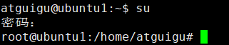

> （2）`sudo` 命令：临时以 root 权限执行命令

- `sudo` 是 **superuser do** 的缩写，是 Linux 中更安全、更常用的权限管理方式，允许普通用户在**授权范围内**以 root 身份执行命令。

```bash
sudo apt update
sudo apt install net-tools
```

### 6.4.2 useradd添加新用户

> 命令格式

```bash
useradd [选项] 用户名

#-g 指定用户的主组（需提前存在，可填组名或 GID），例如：useradd -g users testuser。如果没有指定组，自动创建与用户名相同的用户组，GID 与 UID 一致
#-e 指定用户过期日期（格式：YYYY-MM-DD，过期后无法登录），例如：useradd -e 2026-12-31 testuser
#-m 强制创建家目录（部分系统默认开启，若关闭则需手动指定），例如：useradd -m testuser
#其他参数略
```

> 示例

```bash
su -  				# 切换为root用户，否则无法创建用户
useradd shangguigu  # 创建用户
ll /home 			# 查看/home目录
useradd -m daguigu  # 创建用户，并强制创建家目录
ll /home 			# 查看/home目录
```

或

```bash
sudo useradd -m zhangsan  # 创建用户，并强制创建家目录
ll /home				  # 查看/home目录
```

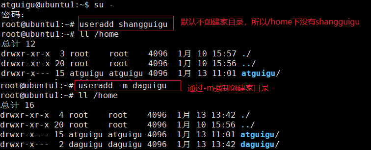

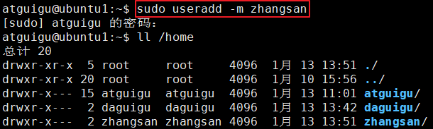

### 6.4.3 /etc/passwd文件查看最近创建了哪些用户

```bash
cat /etc/passwd		   #查看/etc/passwd文件内容
tail -n 5 /etc/passwd  #查看/etc/passwd文件最后5行内容
```

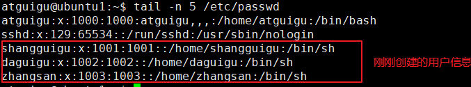

`/etc/passwd` 的内容采用**行式结构**，**每一行对应一个用户**，行内通过**冒号（:）** 分割为 **7 个固定字段**：`用户名:密码占位符:UID:GID:注释信息:家目录:登录Shell`

### 6.4.4 id查看用户是否存在

> 命令格式

```bash
id 用户
```

> 示例

```bash
id shangguigu		# 查看shangguigu用户id
id daguigu		    # 查看daguigu用户id
```

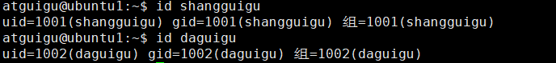

### 6.4.5 passwd设置用户密码

创建的用户默认无密码，无法直接登录，需通过 `passwd` 命令设置密码。

> 命令格式

```bash
# 语法1：修改【当前登录用户】自己的密码（普通用户默认用法）
passwd

# 语法2：给【指定用户】设置/修改密码（root专用，最常用）
su -  				# 切换为root用户，否则无法创建用户
passwd 用户名
exit                #退出root用户

#语法3：给【指定用户】设置/修改密码（普通用户使用root权限）
sudo passwd 用户名
```

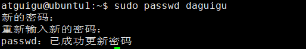

❓ 问题 1：输入密码时，终端什么都不显示，是卡住了吗？

✅ 解答：**不是卡顿，是正常现象**！Linux 为了防止别人通过「输入长度」猜测密码，输入密码时默认**无任何回显**，你只管正常输入密码，输完按回车即可，输入两次一致就成功。

❓ 问题 2：设置密码时，提示「密码太短 / 密码太简单」，无法设置？

✅ 解答：Ubuntu 有**密码复杂度策略**（默认开启）

### 6.4.6 userdel删除用户

用于**删除系统中已创建的用户账号**，本质是：从 `/etc/passwd`、`/etc/group`、`/etc/shadow` 这三个核心用户配置文件中，删除对应用户的所有记录。

> 命令格式

```bash
sudo userdel -r 用户名

# -r 删除用户的同时，递归删除用户的所有相关文件和目录，包含
# 1. 用户的家目录：/home/用户名 （比如 /home/daguigu）
# 2. 用户的邮件缓存文件：/var/spool/mail/用户名
# 3. 所有属于该用户的文件关联记录

```

> 示例

```bash
sudo userddel -r daguigu
```

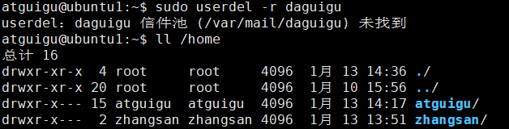

### 6.4.7 设置普通用户具有root权限（了解）

修改 /etc/sudoers 文件，在root下面添加一行，表示该用户有资格用 sudo 提权，如下所示：

```bash
## Allow root to run any commands anywhere
root  ALL=(ALL)   ALL
用户名  ALL=(ALL)   ALL
```

或者配置成采用sudo命令时，不需要输入密码

```bash
## Allow root to run any commands anywhere
root   ALL=(ALL)   ALL
用户名  ALL=(ALL)   NOPASSWD:ALL
```

✅修改完毕，通过:wq!退出编辑，然后可以用该用户帐号登录，用命令 sudo ，即可获得root权限进行操作。

🔴注：Ubuntu 创建的第一个初始用户（atguigu），默认被加入了 `sudo` 用户组，所以不需要在 /etc/sudoers 文件中设置。

> 示例

```bash
sudo passwd zhangsan #设置zhangsan用户密码，以便用zhangsan登录

su - zhangsan 		 #切换到zhangsan用户（exit退出）

sudo apt update      #用sudo提取执行apt update命令

sudo vi /etc/sudoers #编辑/etc/sudoers文件（:wq!强制保存退出）
```


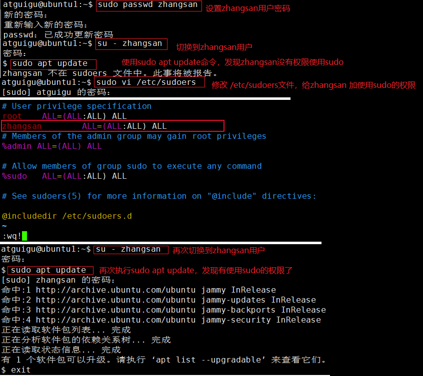

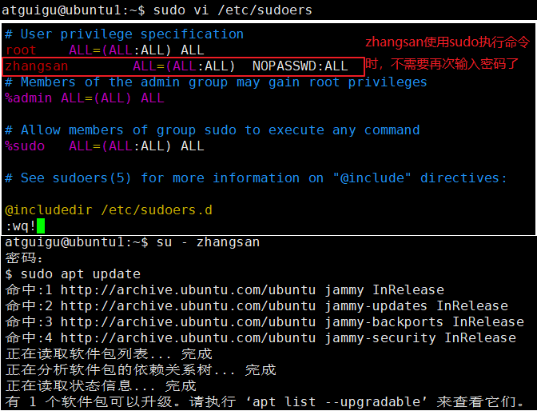

### 6.4.8 usermod修改用户（了解）

> 命令格式

```bash
sudo usermod -l 新用户名 老用户名
sudo usermod -d /home/新目录名 -m 新用户名
```

> 示例

```bash
ll /home					 	# 查看/home目录
sudo usermod -l zs zhangsan  	# 将zhangsan用户名修改为zs
sudo usermod -d /home/zs -m zs  # -d后面是用户的新主目录，-m表示将家目录内容移至新主目录（仅与-d一起使用）
```

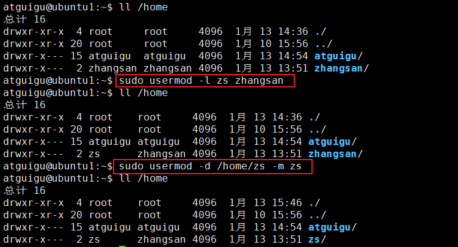

### 6.4.9 锁定和解锁用户（了解）

✅锁定 root 用户：如果你想再次锁定 root 用户，使其无法登录，可以使用以下命令：

```bash
sudo passwd -l root
```

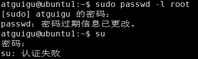

✅解锁 root 用户：若要解锁 root 用户，可以使用以下命令：

```bash
sudo passwd -u root
```

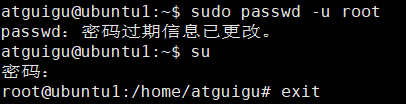

✅如果把上述命令后面root改为其他用户，就是锁定和解锁其他用户。

## 6.5 用户组管理命令

### 6.5.1 用户组概述

Linux 中的**用户组（Group）**，就是一个 **「用户的集合」**，把多个用户归类到同一个组里，给这个**组设置统一的权限**，那么组里的**所有用户**，都会自动拥有这个组的权限。

✅ Linux 的「用户 - 用户组」核心规则

✔️ 规则 1：**每个用户，必有且仅有 1 个【主组】(Primary Group)**

- 创建任何用户时（`useradd 用户名`），Linux 会**自动创建一个和「用户名同名」的用户组**，这个组就是该用户的**主组**。

✔️ 规则 2：**每个用户，可以加入 0~N 个【附加组】(Secondary Group)**

- 附加组是「额外的权限组」，用户可以加入多个，也可以一个都不加，是对主组权限的补充。附加组的核心作用：**给用户分配额外的权限**。

✔️ 规则 3：**Linux 识别权限时，「用户权限」优先，其次「用户组权限」**

- 文件 / 目录的权限分为三类：`所有者(用户)权限`、`所属组(用户组)权限`、`其他用户权限`

- 比如：一个文件属于`atguigu`用户、`sudo`组，那么：

  - `atguigu`用户操作这个文件 → 走「用户权限」（最高优先级）

  - 其他在`sudo`组的用户操作 → 走「用户组权限」

  - 不在这个组的用户操作 → 走「其他用户权限」

✅ 用户组的分类

✔️ 1. 【私有组】- 最常见，用户的「同名主组」。创建用户时，系统**自动创建**的、与「用户名完全相同」的用户组，**这个组里默认只有该用户自己**。

✔️ 2. 【系统内置组】- 系统自带，用于分配「系统级权限」。Ubuntu 装机时**默认自带**的用户组，不需要手动创建，系统提前定义好，作用是「给用户分配对应的系统权限」。例如：`sudo` （具有sudo提权的权限组）、`root`（最高权限组）、`docker`（docker 管理权限）、`adm`（日志查看权限）等

✔️ 3. 【自定义组】- 手动创建，按需批量管理用户。管理员通过 `groupadd` 命令**手动创建**的用户组，用于把多个用户归类到一起，分配统一的权限。


### 6.5.2 groups查看用户所属的组

> 命令格式

```bash
groups 用户名
```

执行`groups 用户名`，输出的**第一个组**就是主组，**从第二个开始的所有组**都是附加组。

> 示例

```bash
groups atguigu    #查看atguigu用户的组
groups zs 		  #查看zs用户的组
```

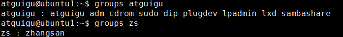

### 6.5.3 groupadd 新增组

> 命令格式

```bash
sudo groupadd 自定义组名
```

创建的组会写入系统核心文件`/etc/group`，永久生效。

> 示例

```bash
sudo groupadd ai  #创建ai组
```


### 6.5.4 /etc/group文件查看创建了哪些组

用户组的管理涉及用户组的添加、删除和修改。组的增加、删除和修改实际上就是对/etc/group文件的更新。

> 示例

```bash
cat /etc/group  # 查看/etc/group
```

查看结果如下：

```
root:x:0:   #x是密码的占位符，数字是组号
daemon:x:1:
bin:x:2:
sys:x:3:
adm:x:4:syslog,atguigu
tty:x:5:
disk:x:6:
lp:x:7:
mail:x:8:
news:x:9:
uucp:x:10:
man:x:12:
proxy:x:13:
kmem:x:15:
dialout:x:20:
fax:x:21:
voice:x:22:
cdrom:x:24:atguigu
floppy:x:25:
tape:x:26:
sudo:x:27:atguigu
audio:x:29:pulse
dip:x:30:atguigu
www-data:x:33:
backup:x:34:
operator:x:37:
list:x:38:
irc:x:39:
src:x:40:
gnats:x:41:
shadow:x:42:
utmp:x:43:
video:x:44:
sasl:x:45:
plugdev:x:46:atguigu
staff:x:50:
games:x:60:
users:x:100:
nogroup:x:65534:
systemd-journal:x:101:
systemd-network:x:102:
systemd-resolve:x:103:
crontab:x:104:
messagebus:x:105:
systemd-timesync:x:106:
input:x:107:
sgx:x:108:
kvm:x:109:
render:x:110:
syslog:x:111:
_ssh:x:112:
tss:x:113:
bluetooth:x:114:
ssl-cert:x:115:
uuidd:x:116:
systemd-oom:x:117:
tcpdump:x:118:
avahi-autoipd:x:119:
netdev:x:120:
avahi:x:121:
lpadmin:x:122:atguigu
rtkit:x:123:
whoopsie:x:124:
sssd:x:125:
fwupd-refresh:x:126:
nm-openvpn:x:127:
scanner:x:128:saned
saned:x:129:
colord:x:130:
geoclue:x:131:
pulse:x:132:
pulse-access:x:133:
gdm:x:134:
lxd:x:135:atguigu
atguigu:x:1000:
sambashare:x:136:atguigu
shangguigu:x:1001:
zhangsan:x:1003:
ai:x:1004:
```

### 6.5.5 groupmod修改组名

> 命令格式

```bash
sudo groupmod -n 新组名 老组名
```

> 示例

```bash
sudo groupmod -n aitest ai # 将ai组改为aitest
```

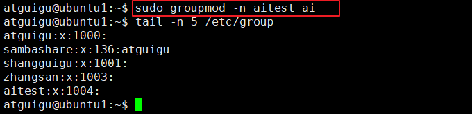

### 6.5.6 usermod修改用户的组

> 命令格式

```bash
sudo usermod -g 组名 用户名  #修改用户的主组
sudo usermod -aG 组名1,组名2,组名3 用户名 #给用户追加多个附加组
```

> 示例

```bash
sudo usermod -g aitest zs    #修改zs的主组
id zs						 #查看zs用户id信息
groups zs					 #查看zs所属的组信息
sudo usermod -g zhangsan zs  #修改zs的主组为zhangsan
sudo usermod -aG sudo,aitest zs #给zs增加附加组sudo,aitest     
```

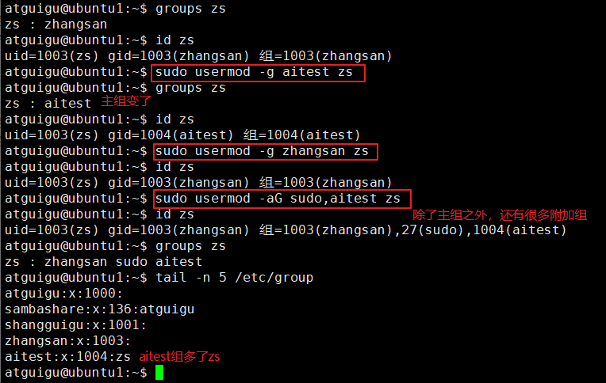

### 6.5.7 groupdel删除组

> 命令格式

```bash
sudo groupdel 组名
```

> 示例

```bash
sudo groupadd demo1			# 创建demo1组
sudo usermod -aG demo1 zs   #给zs添加附加值demo1
sudo groupdel demo1         #删除demo1组
```

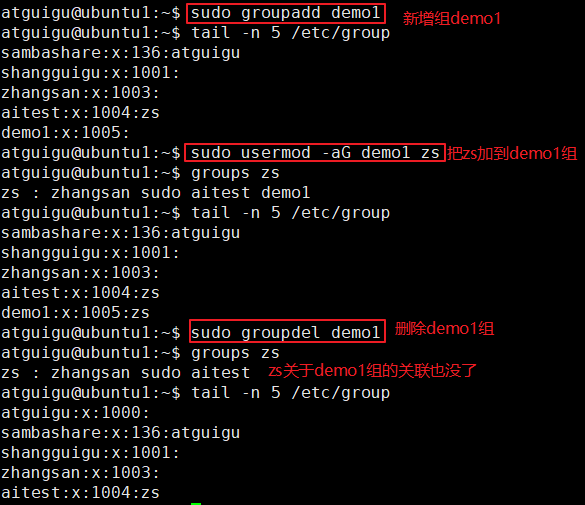


## 6.6 文件权限类

### 6.6.1 文件属性概述

能力越大，责任越大。权限越小，责任越小。

Linux系统是一种典型的多用户系统，不同的用户处于不同的地位，拥有不同的权限。为了保护系统的安全性，Linux系统对不同的用户访问同一文件（包括目录文件）的权限做了不同的规定。在Linux中我们可以使用ll或者ls -l命令来显示一个文件的属性以及文件所属的用户和组。

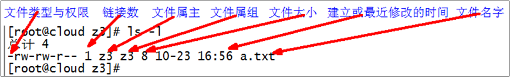


✅文件类型与权限：从左到右的10个字符表示

如果没有权限，就会出现减号[ - ]而已。从左至右用0-9这些数字来表示:

（1）0首位表示类型：在Linux中第一个字符代表这个文件是目录、文件或链接文件等。`-`代表文件，`d`代表目录，`l`代表软链接。

使用ll 或 ls -F 查看文件或目录时，在文件名或目录名后面还会有分类标注符号（* → 可执行文件，/ → 目录，@ → 符号链接，| → 管道文件）

（2）第1-3位确定属主（该文件的所有者）拥有该文件的权限。---User

（3）第4-6位确定属组（所有者的同组用户）拥有该文件的权限，---Group

（4）第7-9位确定其他用户拥有该文件的权限 ---Other

✅rwx作用文件和目录的不同解释

**读权限**：英文 `r` ，数字 `4`

- 文件：能查看文件内容（`cat/less/more` 命令）；
- 目录：能查看目录里的文件列表（`ls` 命令）；

**写权限**：英文 `w` ，数字 `2`

- 文件：能修改 / 编辑文件内容（`vim/echo` 命令）；
- 目录：能在目录里「增 / 删 / 改 / 移动」文件（`touch/rm/mv/mkdir` 命令）；

**执行权限**：英文 `x` ，数字 `1`

- 文件：能把文件当作「可执行程序 / 脚本」运行（比如 `./test.sh`）；
- 目录：能**进入**该目录（`cd 目录名` 命令）；

✅图标：


### 6.6.2 chmod 改变权限（常用）

`chmod` 有两种完全独立的配置权限方式：**【字母法】** 和 **【数字法】**，两种方式**效果完全一致**，可以互相替换，字母法「直观好记」，数字法「简洁高效」。

> 命令格式

```bash
chmod 权限配置 文件名/目录名
```

✅ 命令基础规则（通用）

1. 语法格式：`chmod 权限配置 文件名/目录名`

2. 执行权限：

   修改自己的文件：普通用户直接执行，无需 sudo；

   修改别人的文件：必须加sudo执行（比如 root 修改普通用户的文件）；

3. 递归修改：如果要修改「目录 + 目录里所有文件」的权限，加 `-R` 参数（`R=Recursive` 递归）！

#### 1、字母法

```bash
#字母法
chmod [u/g/o/a][+/-/=][r/w/x]  文件/目录名
```

✅ 语法拆解

1. 第一部分：`u/g/o/a` → 给谁配置权限（所有者 / 所属组 / 其他 / 所有人）；
2. 第二部分：`+/-/=` → 权限操作符
   - `+` ：**添加**权限（保留原有权限，追加新权限）；
   - `-` ：**移除**权限（保留原有权限，删除指定权限）；
   - `=` ：**赋值**权限（覆盖原有所有权限，只保留本次配置的权限）；
3. 第三部分：`r/w/x` → 配置什么权限（读 / 写 / 执行）。

> 示例：以 `test.txt` 文件为例，初始权限：`rw-rw-r--`

```bash
# 1. 给【所有者(u)】添加【执行(x)】权限 → 最常用
chmod u+x test.txt

# 2. 给【所属组(g)】移除【写(w)】权限
chmod g-w test.txt

# 3. 给【其他用户(o)】赋值【只读(r)】权限（覆盖原有所有权限）
chmod o=r test.txt

# 4. 给【所有人(a)】添加【执行(x)】权限 → 超级高频！
chmod a+x test.txt

# 5. 同时给 所有者+所属组 添加执行权限 → 用逗号分隔，无空格！
chmod u+x,g+x test.txt

# 6. 递归修改【目录+目录内所有文件】的权限 → 加 -R 参数，必学！
chmod -R a+rwx testdir
```

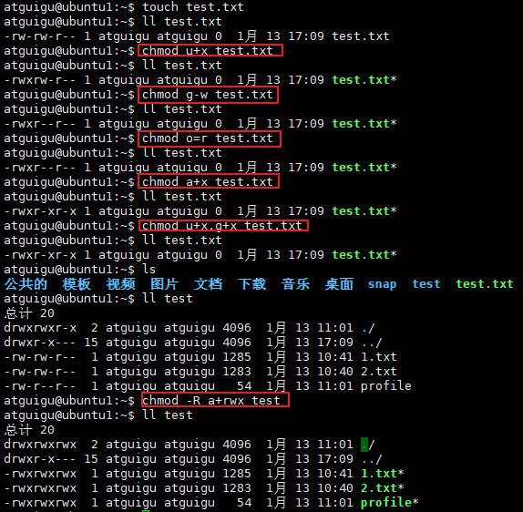

#### 2、数字法

```bash
#数字法
chmod 三位数字  文件/目录名
# 递归修改目录权限
chmod -R 三位数字  目录名
```

✅ 语法拆解

数字法是 Linux 的经典权限配置方式，核心是：**用一个 3 位数字，对应「u-g-o」的权限，每位数字是该主体的权限总和**。

1. 基础权限对应数字：`r=4` 、 `w=2` 、 `x=1` 、 `-=0`；
2. 权限计算规则：权限叠加，求和即可，比如：
   - 只读：`r--` = 4+0+0 = `4`
   - 读写：`rw-` =4+2+0 = `6`
   - 读写执行：`rwx` =4+2+1 = `7`
   - 无权限：`---` =0+0+0 = `0`
3. 3 位数字对应关系：`第一位=u的权限` 、 `第二位=g的权限` 、 `第三位=o的权限`；

> 示例：

```bash
# 1. 给test.txt配置 644 权限（所有者读写，组和其他只读）→ 普通文件标配
chmod 644 test.txt

# 2. 给test目录配置 755 权限（所有者全权限，组和其他只读+执行）→ 目录标配
chmod 755 test

# 3. 递归配置目录+所有文件为755权限 → 超级高频！
chmod -R 755 test

# 4. 给文件配置最高权限777（测试用，生产环境禁止）
chmod 777 test.txt
```

### 6.6.3 chgrp 改变所属组（了解）

chgrp: 改变所属组（change group）

> 命令格式

```bash
sudo chgrp [最终用户组] [文件或目录]
```

> 示例：test.txt的初始状态是  -rwxr-xr-- 1 root root 0  1月 13 17:09 test.txt*

问题：如果当前登录用户是atguigu用户，atguigu用户所属的组是atguigu，那么atguigu访问test.txt文件只能看【其他用户(o)】的权限【r--】。

```bash
sudo chgrp atguigu test.txt #修改test.txt文件所属的组是atguigu组
```

分析：修改test.txt文件所属的组是atguigu组之后，所有atguigu组的用户访问test.txt文件都可以看【所属组(g)】的权限【r-x】了。

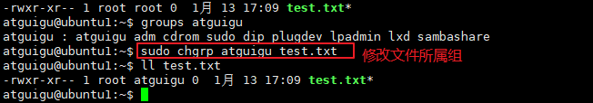

### 6.6.3 chown改变所有者和所属组（常用）

chown: 改变所有者（change owner）

> 命令格式

```bash
chown [选项] [最终用户] [文件或目录]

# -R 递归操作目录
```

> 示例1：test.txt的初始状态是  -rwxr-xr-- 1 root root 0  1月 13 17:09 test.txt*

问题：如果当前登录用户是atguigu用户，atguigu用户所属的组是atguigu，那么atguigu访问test.txt文件只能看【其他用户(o)】的权限【r--】。

```bash
sudo chown atguigu test.txt #修改文件的所有者是atguigu
```

分析：修改test.txt文件所有者是atguigu之后，atguigu用户访问test.txt文件都可以看【所有者(u)】的权限【rwx】了。

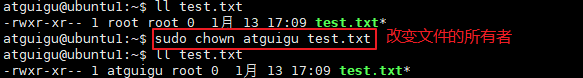

> 示例2：test.txt的初始状态是  -rwxr-xr-- 1 root root 0  1月 13 17:09 test.txt*

```bash
sudo chown atguigu:atguigu test.txt #修改文件的所有者是atguigu，所属组是atguigu
```

分析：修改test.txt文件所有者是atguigu之后，atguigu用户访问test.txt文件都可以看【所有者(u)】的权限【rwx】了。

​           修改test.txt文件所属的组是atguigu组之后，atguigu组的所有其他用户访问test.txt文件都可以看【所属组(g)】的权限【r-x】了。

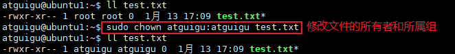

> 示例3：

```bash
sudo chown -R root:root test  #递归修改test目录的所有者和所属组
```

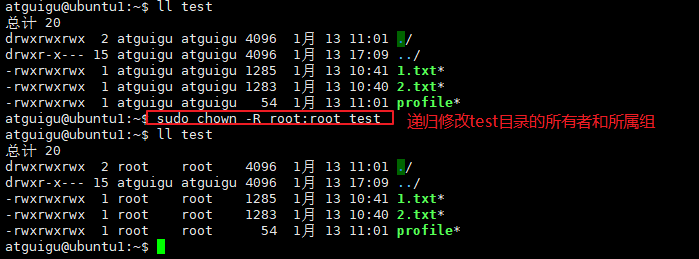

## 6.7 搜索查找类

### 6.7.1 find查找文件或者目录

find指令将从指定目录向下递归地遍历其各个子目录，将满足条件的文件显示在终端。

`find` 是 Linux 中**最常用的文件查找工具**，find可以**基于指定条件递归遍历文件系统**，精准定位符合要求的文件 / 目录，支持按名称、类型、大小、权限、修改时间等多维度筛选，还能直接对找到的文件执行后续操作。

> 命令格式

```bash
find [查找路径] [查找条件] [执行动作]
```

- **查找路径**：指定要搜索的目录，默认为**当前目录（.）**，可指定多个路径（如 `find /home /etc -name "*.conf"`）。
- **查找条件**：筛选文件的规则，是 `find` 的核心，支持单个或多个条件组合。
- **执行动作**：对找到的文件执行的操作，默认动作是`-print`（输出文件路径），其他动作：`-exec 命令 {} \;`（执行指定命令，{}代表每一个文件，\;代表命令结束）、`-ls`（以 ls -l 格式输出文件详情）等

#### 1. 按名称查找（最常用）

|       参数        |                             说明                             |                       示例                        |
| :---------------: | :----------------------------------------------------------: | :-----------------------------------------------: |
| `-name "文件名"`  | 按**精确文件名**查找，区分大小写，支持通配符（`*` 任意字符，`?` 单个字符） |          `find /etc -name "nginx.conf"`           |
| `-iname "文件名"` |           按名称查找，**不区分大小写**，支持通配符           | `find /home -iname "readme.md"`（匹配 ReadMe.md） |

> 示例

```bash
find ./ -name '*Ubuntu*'

find ./ -iname '*Ubuntu*'
```

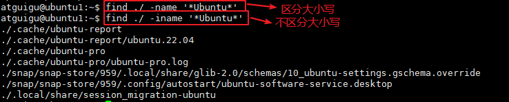

#### 2. 按文件类型查找（了解）

Linux 中一切皆文件，通过 `-type` 可精准筛选文件类型，参数为单个字母：

|   参数    |         文件类型         |                       示例                        |
| :-------: | :----------------------: | :-----------------------------------------------: |
| `-type f` | 普通文件（如文本、脚本） | `find /usr/bin -type f`（查找所有可执行普通文件） |
| `-type d` |           目录           | `find /home -type d -name "test"`（找 test 目录） |
| `-type l` |    符号链接（软链接）    |       `find /etc -type l`（查找所有软链接）       |
| `-type c` |  字符设备文件（如终端）  |  `find /dev -type c -name "tty*"`（找终端设备）   |
| `-type b` |   块设备文件（如硬盘）   |          `find /dev -type b`（找块设备）          |

```bash
find /home/ -name '*test*'
find /home/ -type d -name '*test*'
find /home/ -type f -name '*test*'
```

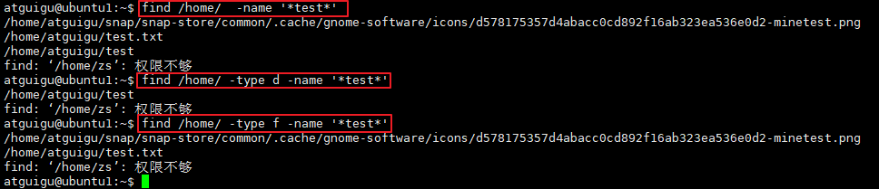

#### 3. 按文件大小查找（了解）

以 `-size` 为参数，支持多种单位，**单位必须紧跟数字**，无空格，数字前面有+表示大于，-表示小于，没有+/-表示等于。

| 单位 |        含义        |                     示例                     |
| :--: | :----------------: | :------------------------------------------: |
| `k`  | 千字节（1k=1024B） | `find / -size 100k`（找大小为 100k 的文件）  |
| `M`  | 兆字节（1M=1024k） | `find /home -size +10M`（找大于 10M 的文件） |
| `G`  | 吉字节（1G=1024M） |    `find / -size -5G`（找小于 5G 的文件）    |

#### 4. 按时间查找（了解）

Linux 文件有三个核心时间属性，`find` 可基于这些时间筛选，单位为**天（-mtime/-atime/-ctime）** 或**分钟（-mmin/-amin/-cmin）**：

|    参数    |      时间属性      |                        说明                        |                        示例                        |
| :--------: | :----------------: | :------------------------------------------------: | :------------------------------------------------: |
| `-mtime n` | 修改时间（modify） |             文件**内容**最后修改的时间             |  `find /var/log -mtime +7`（找 7 天前修改的日志）  |
| `-atime n` | 访问时间（access） |          文件最后**被读取 / 访问**的时间           |  `find /home -atime -1`（找 1 天内访问过的文件）   |
| `-ctime n` | 更改时间（change） | 文件**元数据**（权限、所有者、名称）最后修改的时间 | `find /etc -ctime +3`（找 3 天前元数据修改的文件） |

**符号说明**：与大小筛选一致，`+n` 表示超过 n 天 / 分钟，`-n` 表示不足 n 天 / 分钟。

#### 5. 按权限查找（了解）

|      参数       |                             说明                             |                          示例                          |
| :-------------: | :----------------------------------------------------------: | :----------------------------------------------------: |
| `-perm 权限值`  | 按**精确权限**查找（支持数字权限如 755，或符号权限如 u=rwx） | `find /usr/bin -perm 755`（找权限为 755 的可执行文件） |
| `-perm -权限值` |    按**至少包含指定权限**查找（文件权限包含所有指定权限）    |  `find /home -perm -600`（找所有者有读写权限的文件）   |
| `-perm /权限值` |    按**包含任意指定权限**查找（文件权限包含任一指定权限）    |   `find /tmp -perm /o=r`（找其他用户有读权限的文件）   |

#### 6. 按所有者 / 所属组查找（了解）

|        参数        |                          说明                          |                        示例                         |
| :----------------: | :----------------------------------------------------: | :-------------------------------------------------: |
| `-user 用户名/UID` |             查找**所有者**为指定用户的文件             |    `find /home -user root`（找 root 拥有的文件）    |
| `-group 组名/GID`  |              查找**所属组**为指定组的文件              | `find /var -group www-data`（找 www-data 组的文件） |
|     `-nouser`      | 查找**无有效所有者**的文件（所有者被删除，UID 不存在） |          `find / -nouser`（排查无主文件）           |
|     `-nogroup`     |   查找**无有效所属组**的文件（组被删除，GID 不存在）   |         `find / -nogroup`（排查无主组文件）         |

#### 7、实例应用（了解）

**（1）查找系统中所有后缀为 `.txt` 的普通文件**

```bash
find / -type f -name "*.txt"
```

**（2）查找 `/home` 下大于 500M 且 30 天未访问的文件**

```bash
find /home -type f -size +500M -atime +30 -ls
```

**（3）查找 `/var/log` 下 7 天前的日志文件并压缩**

```bash
find /var/log -name "*.log" -mtime +7 -exec gzip {} \;
```

**（4）查找当前目录下所有空文件（大小为 0）并删除**

```bash
find . -type f -size 0 -delete
```

**（5）查找 `/etc` 下权限为 777 的文件（安全排查，权限过宽）**

```bash
find /etc -perm 777 -ls
```

### 6.7.2 grep过滤查找

Grep（Global Regular Expression Print），用于从「给定的文本内容」中，匹配包含「指定关键字 / 正则表达式」的行，并将匹配到的整行内容打印出来。

两种核心使用场景：

1. 直接过滤文件内容：`grep 关键字 文件名` → 从文件里找匹配内容
2. 配合管道符过滤：`其他命令 | grep 关键字` → 从「其他命令的输出」里找匹配内容

#### 1、过滤文件内容（了解）

> 命令格式

```bash
#grep用法一：直接过滤文件内容
grep 关键字 文件名   # 从文件里找匹配内容
```

> 示例

```bash
sudo grep -n atguigu /etc/group # 查找/etc/group文件中出现atguigu的行，-n表示显示行号
```

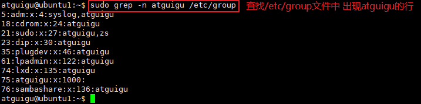


#### 2、与“|”管道符的过滤查找（常用）

管道符，“|”，表示将前一个命令的处理结果输出传递给后面的命令处理。

> 命令格式

```bash
#grep用法二：配合管道符过滤
A命令 | grep 过滤条件

#-i，表示忽略大小写
#-n，显示匹配行的行号
```

✔️ 执行顺序：先执行左边的`A命令`，该命令会在屏幕输出一堆内容

✔️ 数据流转：管道符`|`把这堆输出内容，全部「传递」给右边的`grep`

✔️ 过滤筛选：`grep`读取这些内容，只筛选出**包含「过滤条件」的行**，最终只打印这些匹配行

> 示例

```bash
# 只查看当前目录下所有 .sh 后缀的脚本文件
ls -l | grep .sh

# 只查看当前目录下所有 以 test 开头的文件
ls -l | grep ^test

# 只查看当前目录下的 目录（d开头是目录）
ls -l | grep ^d

# 查看mysql进程
ps -ef | grep mysql

# 从nginx日志中，筛选包含 404 错误的所有日志行
cat /var/log/nginx/access.log | grep 404
```

## 6.8 打包压缩和解压

`tar` 是 Ubuntu/Debian 等 Linux 发行版中**最核心、最常用的打包 / 压缩 / 解压工具**，原生预装无需额外安装，`tar` 原本是 `tape archive`（磁带归档）的缩写，最初用于磁带备份，现在是处理 `.tar、.tar.gz、.tar.xz、.tar.bz2` 等格式的标配命令。

### 6.8.1 tar命令的参数

✅ 核心必用参数（4 个）

- `-c` (create) ：**创建** 新的打包 / 压缩文件（打包 / 压缩必加）
- `-x` (extract)：**解压** 打包 / 压缩文件（解压必加）
- `-f` (file)   ：指定要操作的**文件名**（**必须放在所有参数最后一位**，跟文件名绑定）
- `-v` (verbose)：显示操作的**详细过程**（可选，建议加，能看到正在打包 / 解压的文件）

✅ 压缩格式参数（3 个，选其一即可）

- `-z` ：使用 `gzip` 算法压缩 / 解压 → 对应格式 `.tar.gz` (也可简写 `.tgz`)
- `-j` ：使用 `bzip2` 算法压缩 / 解压 → 对应格式 `.tar.bz2`
- `-J` ：使用 `xz` 算法压缩 / 解压 → 对应格式 `.tar.xz`

✅ 常用辅助参数

- `-C` (大写) ：指定**解压的目标目录**
- `-t` ：**查看压缩包内的文件列表**（不解压，只预览内容）
- `-p` ：打包 / 解压时**保留文件的原始权限**（通常用于备份）
- `--exclude=文件名` ：打包时**排除指定文件 / 文件夹**

### 6.8.2 打包和压缩操作

tar 命令的核心分为 **2 个独立操作**，一定要区分开：

1. **打包**：把多个文件 / 文件夹合并成一个 `.tar` 格式的归档文件（**无压缩**，体积基本不变）
2. **压缩**：在打包的基础上，调用 `gzip/bzip2/xz` 等压缩算法，生成压缩包（体积变小）

> 命令格式

```bash
tar [参数] 生成的压缩包名称.tar.格式 要打包的文件/文件夹

# 只打包不压缩
tar -cvf 包文件名称.tar 要打包的文件/文件夹

# 压缩单个文件
tar -zcvf 压缩包名称.tar.gz 文件名

# 压缩多个文件
tar -zcvf 压缩包名称.tar.gz 文件1 文件2 文件3

# 压缩文件夹
tar -zcvf 压缩包名称.tar.gz 文件夹名
```

> 示例

```bash
# 压缩单个文件
# 示例：把 test.txt 压缩为 test.tar.gz
tar -zcvf test.tar.gz test.txt

# 压缩多个文件
# 示例：压缩 test1.txt test2.txt 为 all_test.tar.gz
tar -zcvf all_test.tar.gz test1.txt test2.txt

# 压缩文件夹
# 示例：压缩当前目录下的 project 文件夹为 project.tar.gz
tar -zcvf project.tar.gz project/

#打包 project 文件夹，排除 .log 日志文件和 temp 临时目录
tar -zcvf project.tar.gz project/ --exclude=*.log --exclude=project/temp/
```

### 6.8.3 解压操作

> 命令格式

```bash
tar [解压参数] 压缩包名               #解压到当前目录
tar [解压参数] 压缩包名 -C 目标目录    #解压到目标目录
tar [解压参数] 压缩包名 要解压的文件名  #只解压压缩包中的【单个文件 / 指定文件】
```

解压的核心参数是 `-x`，解压时无需记格式，是否加`z,J,j`看压缩包后缀即可：

- `.tar.gz` → 用 `-zxvf`
- `.tar.xz` → 用 `-Jxvf`
- `.tar.bz2` → 用 `-jxvf`
- `.tar` → 用 `-xvf`（无压缩，仅解压）

> 示例

```bash
# 解压 project.tar.gz 到当前目录
tar -zxvf project.tar.gz

#把 project.tar.gz 解压到 /home/ubuntu/work 目录下
tar -zxvf project.tar.gz -C /home/ubuntu/work/

#把 project.tar.xz 解压到当前目录下的 dist 文件夹
tar -Jxvf project.tar.xz -C ./dist/

# 示例：只解压 project.tar.gz 中的 src 文件夹到当前目录
tar -zxvf project.tar.gz project/src/
```

### 6.8.4 常见错误

❌ 错误 1：`-f` 参数的位置写错。**`-f` 必须放在所有参数的最后一位**，后面紧跟「文件名」

- 正确写法：`tar -zcvf xxx.tar.gz 文件夹` ✔️
- 错误写法：`tar -zfcv xxx.tar.gz 文件夹` ❌ 、`tar -cvfz xxx.tar.gz 文件夹` ❌

❌ 错误 2：解压到指定目录时，`-C` 参数位置写错。**`-C 目标目录` 必须写在压缩包名称的后面**

- 正确写法：`tar -zxvf xxx.tar.gz -C /home/ubuntu` ✔️
- 错误写法：`tar -zxvf -C /home/ubuntu xxx.tar.gz` ❌

❌ 错误 3：解压 `.tar.xz` 时用小写 `-j`，导致解压失败。`.tar.xz` 对应 **大写 `-J`**，`.tar.bz2` 对应 小写 `-j`

- 正确：`tar -Jxvf xxx.tar.xz` ✔️
- 错误：`tar -jxvf xxx.tar.xz` ❌

❌ 错误 4：向压缩包（.tar.gz/.xz）追加文件，导致报错。`tar -r` 追加文件，**只支持无压缩的 .tar 文件**，所有带压缩的包都无法追加！

## 6.9 磁盘类

### 6.9.1 df 查看磁盘空间使用情况

df：对应单词disk free 空余硬盘

> 命令格式

```bash
df  [选项]

#-h	以人们较易阅读的 GBytes, MBytes, KBytes 等格式自行显示
```

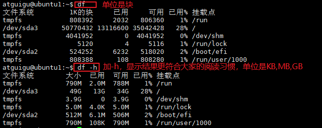

### 6.9.2 du文件和目录占用的磁盘空间大小

🔴`du` （disk use）显示的是**文件占用的磁盘块大小**，可能>=文件实际内容大小。因为Linux 磁盘按「块」分配空间，哪怕文件只占 1 个字节，也会占用 1 个块（默认 4KB）。

命令格式：

```bash
du [可选参数] [文件/目录路径]
```

✅不写路径时，**默认查看当前目录** 及子目录的空间占用

✅路径可以是「单个文件」「单个目录」「多个文件 / 目录」

✅参数

- 单位参数

  - 不写：默认显示单位是 KB

  - `-k` ：以 **KB** 为单位显示（默认，可省略）

  - `-m` ：以 **MB** 为单位显示

  - `-h` ：以 **人类可读的自动单位** 显示，自动适配：小文件显示 `KB`、中等文件 `MB`、大文件 `GB/TB`

- 其他参数
  - `-s` = **summarize**（汇总），作用是：**只输出目标路径的「总占用空间」，不递归展示子目录**
  - `-a` = **all**（全部），`du` 默认只会列出「目录」的大小，不会显示文件，加 `-a` 后会把目录 + 文件的大小全部列出
  - `--max-depth=N` 限制递归深度，`du` 默认会**无限递归**到最底层的子目录。例如：`--max-depth=1` ：只显示「当前目录」的总大小 + 「当前目录下一级子目录」的大小，不深入子目录内部

> 示例

```bash
# 查看当前目录下所有一级目录的大小，并按大小降序排列（最大的在最上面）
du -h --max-depth=1 | sort -hr  #（-hr，h表示以human易读K/M/G 等单位，r表示降序）

#递归查看当前目录的test子目录所有的文件目录及子目录大小
du -ha ./test

# 查看当前目录的test子目录的总大小
du -hs ./test
```

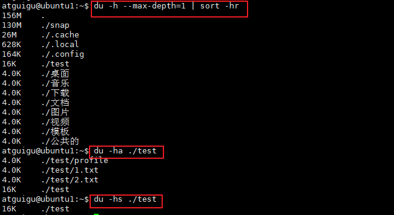


## 6.10 网络类

### 6.10.1 ifconfig查看当前网络IP

> 命令格式

```bash
ifconfig  #查看当前网络IP
```

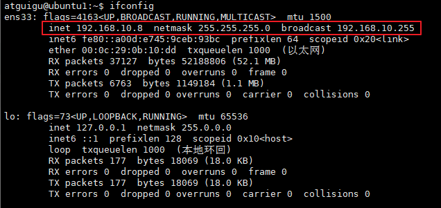

### 6.10.2 ping连通性测试

> 命令格式

```bash
ping 目标IP地址 #连通性测试
```

🔴在Window系统下，ping命令发送4个包后自动停止。在Linux系统下，ping命令会**无限循环**，需要按 `Ctrl+C` 停止。

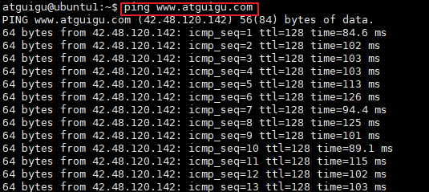

### 6.10.3 修改主机名称

Linux 安装时，默认主机名常为**通用名称**（如 `ubuntu`、`localhost`、`debian-s-1vcpu-1gb`（云服务器默认）），这类名称无法区分机器用途，**多机环境下极易混淆**。只有**单台个人使用的机器**（如个人笔记本、家用台式机），可以保持默认，无需修改。

- 正规企业或团队会制定**主机命名规范**（属于运维标准化的一部分），要求所有机器的主机名遵循统一规则（如「角色 - 环境 - 编号」「地区 - 机房 - 角色 - 编号」），确保团队成员对机器的认知一致。
  - 互联网公司：`bj-idc1-web-prod-01`（北京机房 1-Web 服务 - 生产环境 - 01 号）
  - 小型团队：`dev-app-01`（开发环境 - 应用服务 - 01 号）、`prod-db-02`（生产环境 - 数据库 - 02 号）
- 在**集群、分布式架构**（如 Kubernetes、Hadoop、Redis 集群、微服务节点）中，**主机名是节点标识的重要组成部分**，要求「唯一且有辨识度」。集群中节点主机名通常遵循统一命名规则（如 `k8s-master-01`、`k8s-node-02`、`hadoop-dn-03`），默认主机名会导致集群配置异常、节点识别失败。

> 查看当前主机名称的命令：

```bash
hostname
```

> 修改当前主机名称的命令：

```bash
vi /etc/hostname
```

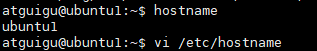

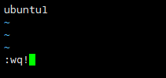

🔴在**同一局域网 / 网络段**内，两台机器的 hostname 不能重复，出现冲突必须改。

🔴部分行业（如金融、政务）的**安全合规审计**，会要求服务器主机名「不包含敏感信息，且与用途匹配」，避免通过主机名泄露系统架构或业务信息。**示例**：禁止使用 `pay-server-01`（支付服务器）这类直接暴露核心业务的主机名，容易被攻击，需修改为 `biz-server-01` 等模糊但内部可识别的名称。


## 6.11 进程线程类

进程是正在执行的一个程序或命令，

Linux 中「一切皆进程」：系统启动的服务、你执行的命令、打开的软件、后台运行的程序，都是进程；每一个进程都是一个`正在运行`的实体，都有自己的地址空间，并占用一定的系统资源。进程必有 PID（Process ID），它是进程的唯一编号，是操作进程（杀死、查看详情）的核心标识.

### 6.11.1 ps查看当前系统进程状态

`ps` 是 **Process Status** 的缩写

> 命令格式

```bash
ps #只显示当前终端、当前用户运行的进程（极简，只展示少量进程）

#查看子父进程之间的关系
ps -ef #系统级全量进程查看，e（every，显示系统中所有的进程）f（full，显示完整格式的进程信息）

# 查看CPU / 内存占用情况
ps -aux #显示所有终端上的所有用户进程，a（all）,u（user-oriented，以用户为中心的格式显示），x（without tty，显示无终端关联的进程，例如系统后台进程、守护进程）

ps [选项] | grep 关键词 #加过滤筛选
```

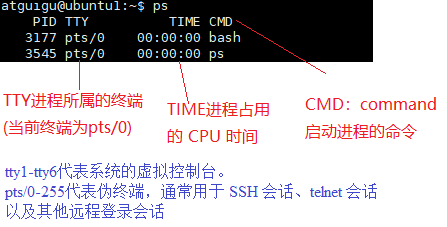

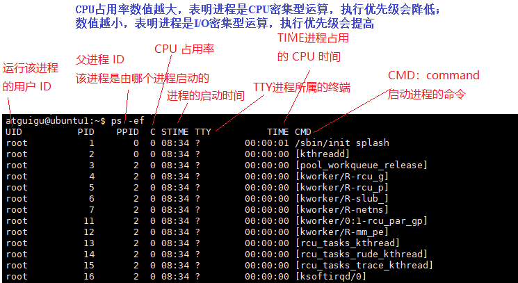

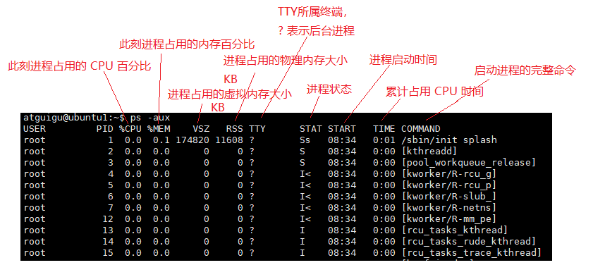

`ps -aux` 输出的 `STAT` 字段是**进程当前的运行状态**，由**1 个主状态 + 可选 1 个辅状态**组成

✅ 主状态

- **`R`** ：Running → **运行中**，进程正在占用 CPU 执行任务，或等待 CPU 调度
- **`S`** ：Sleeping → **睡眠中**，进程处于休眠状态，等待事件触发（比如等待网络请求、文件读写），**绝大多数正常进程的状态都是 S**，占 99%，这是健康状态！
- **`T`** ：Stopped → **暂停 / 停止**，进程被暂停（比如执行 `kill -19 PID` 暂停进程）
- **`Z`** ：Zombie → **僵尸进程**，找到父进程（PPID 列），终止 / 重启父进程即可让系统回收僵尸进程
- **`D`** ：Disk Sleep → **不可中断睡眠**，进程正在执行磁盘 IO 操作，此时无法被杀死，只能等待 IO 完成，是正常状态
- `I`：Idle→**空闲**，是**内核空闲线程**的专属状态，代表 CPU 空闲时运行的内核进程，是系统正常的调度机制，与用户态进程的 `S`（睡眠）状态有本质区别，无需关注和干预。

✅ 辅状态

- `s`：该进程是**会话首进程**。当一个主进程启动后，会衍生出多个子进程 / 子线程，形成一个「进程会话组」，这个首进程是**最先启动、统领所有子进程的根进程**。
- `l`：进程是多线程模式运行
- `+`：进程运行在 **当前终端的前台**（比如你在终端执行的 `python test.py`）
- `<`：进程优先级高（优先级高 ≠ 占用 CPU 高，只是给了「优先执行权」，如果线程休眠或空闲也不会占用CPU）
- `N`：进程优先级低

### 6.11.2 kill操作进程

`kill` 不是「杀手」，而是**信号发送工具**，「杀死进程」只是它的一个功能。

> 命令格式

```bash
kill [选项/信号] [进程PID]
killall [信号] 进程名
```

信号按用途分为 3 类，编号范围对应不同类别，普通用户只需关注「标准信号」：

|     分类     | 编号范围 |                 特点                  |            适用场景            |
| :----------: | :------: | :-----------------------------------: | :----------------------------: |
| **标准信号** |  1 ~ 31  |         最基础、最常用的信号          | 进程管理（杀进程、重载、暂停） |
| **实时信号** | 32 ~ 64  | 内核 / 系统底层使用（普通用户用不到） |     硬件驱动、内核模块开发     |
| **特殊信号** |    0     |    检测进程是否存在（无实际操作）     | `kill -0 PID` 验证进程是否运行 |

**常用信号数**：（编号 1、2、**9、15**、19、18），对应「重载/重启、中断、**强制杀、优雅杀（默认）**、暂停、恢复」

生产环境建议从温和→强制：`kill -1 PID`(重载) → `kill PID`(-15，优雅终止) → `kill -2 PID`(中断) → `kill -9 PID`(强制杀死)

#### 1、kill

> 命令格式

```bash
kill [选项/信号] [进程PID]
```

> 示例

（1）打开多个终端

（2）在终端1中运行`tail -F test.txt`命令

（3）在终端2中运行`ps -ef | grep tail`

（4）在终端2中运行`kill -9  对应的进程PID`

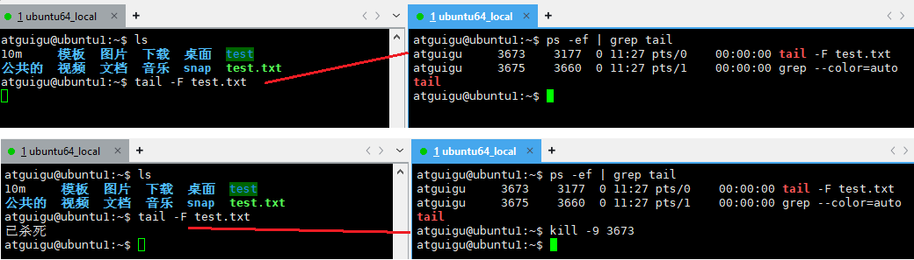

> kill 常见「报错 / 问题」

❌ 问题 1：执行 kill 后提示 `Operation not permitted`（权限不够）

- 原因：你要杀死的进程是**root 用户启动的**，而你当前是普通用户（ubuntu），没有权限操作 root 的进程
- 解决方案：加`sudo`提升权限

❌ 问题 2：`kill -9 PID` 都杀不死进程，执行后进程还在

- 原因：**进程状态是`D`（不可中断睡眠）** ，这类进程正在执行磁盘 IO 操作，内核会保护它，任何信号都无效；或者是`Z`（僵尸进程）
- 解决方案：
  1. D 状态：**等待几分钟**，进程完成 IO 后会自动变回 S 状态，此时再杀就可以了；
  2. Z 状态：杀死它的父进程（`ps -ef | grep 僵尸进程PID` 查到 PPID，再杀 PPID）。

#### 2、killall

> 命令格式

```bash
killall [信号] 进程名
```

✅killall特点：简单高效，**不用先查 PID**，直接写进程名就能杀死，适合快速操作。缺点是如果进程名重复可能误杀。

> 示例

```bash
killall  tail #优雅杀死所有tail进程
```

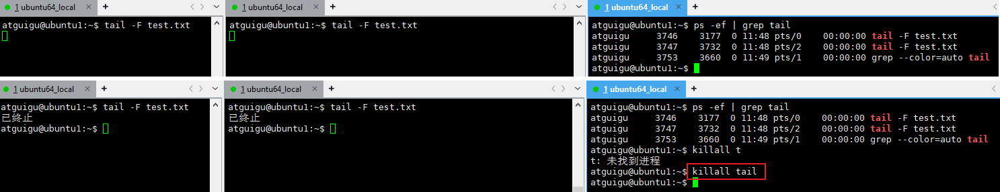

### 6.11.3 free查看服务器总体内存

`free` 是 Linux 系统中 **查看服务器 / 本机内存（物理内存 + 交换分区）使用情况**。

✅Linux 和 Windows 的内存管理逻辑**完全不同**

- Linux 会把空闲的物理内存，主动分配作为 **缓存 (cache)** 和 **缓冲区 (buffer)**，用来缓存磁盘文件、读写数据，目的是提升系统运行速度。**这部分内存不是被进程占用了，而是「备用高速缓存」，当程序需要内存时，系统会立刻释放这部分缓存，分配给程序使用** → 这部分内存属于「可回收内存」，**不算真正的内存占用**！

- **内存划分的 2 个核心分区**

  - **物理内存 (Mem)**：机器真实插的内存条，速度极快，程序运行的核心载体；

  - **交换分区 (Swap)**：硬盘划分的一块空间，当作「虚拟内存」使用，速度**远慢于物理内存**，只有物理内存耗尽时才会启用，是内存的兜底方案。

> 命令格式

```bash
free [选项]
```

- `-k` ：以 KB 为单位显示（默认单位，不加参数就是 KB）；
- `-m`：以 MB 为单位显示
- `-g` ：以 GB 为单位显示；
- `-h` = **human-readable** ，和`du、df`的`-h`完全一样 → **以「人类可读的单位」显示内存大小**（自动适配 `KB/MB/GB/TB`）
- `-s N` = `seconds` → **每隔 N 秒刷新一次内存数据，实时监控**，示例是`每隔2秒刷新一次`，适合观察内存占用的「动态变化」（比如某个程序运行时内存是否持续飙升）。
- `-t` = `total` → 在输出末尾增加一行 `Total:`，统计「物理内存 + 交换分区」的总大小、总占用、总空闲，适合快速看整体内存资源。

> 示例

```bash
```

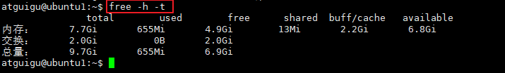

✔️ 第一行：物理内存 `Mem:` 

1. `total`：物理内存总大小
2. `used`：**真正被系统进程「实际占用」的内存** → 程序运行、系统服务占用的真实内存，这部分是「不可回收」的；
3. `free`：**完全空闲、未被任何程序 / 缓存占用的物理内存** → 纯空闲内存，Linux 下这个值小是正常的（因为有缓存）；
4. `shared`：共享内存 → 多进程共享的内存空间，一般很小，可忽略；
5. `buff/cache`：**缓存 + 缓冲区内存** → Linux 主动分配的高速缓存，前文说的「可回收内存」就是它！这部分内存**不算占用**，程序需要时会被立刻释放，**看到这个值大，不用慌，是好事**；
6. `available`：可用内存 = free + buff/cache 可回收部分

✔️ 第二行：交换分区 `Swap:` 

1. `total`：交换分区的总大小；
2. `used`：已使用的交换分区大小 。这个值如果**大于 0，且持续增大**，说明物理内存已经不够用了，系统开始用硬盘当内存，性能会急剧下降；如果这个值是`0B`，说明内存充足，完美状态；
3. `free`：空闲的交换分区大小。

### 6.11.4 top查看系统健康状态

`top` 对应的的单词**Table Of Processes**，直译「进程列表」

> 命令格式

```bash
top [选项]
```

✅实时监控系统的 **CPU 使用率、内存使用率、交换分区、系统负载、进程列表**，并且所有数据**动态刷新**，默认**每 3 秒刷新一次**。

| **选项**        | **功能**                                     |
| --------------- | -------------------------------------------- |
| **-d** **秒数** | 指定top命令每隔几秒更新。                    |
| **-i**          | 使top不显示任何闲置或者僵死进程。            |
| **-p**          | 通过指定监控进程ID来仅仅监控某个进程的状态。 |

| **top实时监控中按键** | **功能**                                                     |
| --------------------- | ------------------------------------------------------------ |
| 按 P 键               | 以CPU使用率排序，默认就是此项                                |
| 按 M 键               | 以内存的使用率排序                                           |
| 按 N 键               | 以PID排序                                                    |
| 按 u 键               | 按用户名过滤进程，按u后输入用户名                            |
| 按 k 键               | kill进程，按k后依次输入pid、回车、输入信号值（如15,9等）     |
| 按数字 1 键           | 展开所有 CPU 核心的使用率，CPU 行从 1 行变成多 行，能看到**每个核心的 CPU 占用率** |
| 按 b 键               | 高亮显示「运行中（R 状态）」的进程                           |
| 按 s 键               | 修改 top 的刷新频率，按 s 后输入数字                         |
| 按 q 键               | 退出top                                                      |

> 示例

```bash
top -d 1  #每1秒刷新1次
```


✅启动 `top` 后，界面分为上下两个区域，**上面是【系统全局概览】，下面是【进程详细列表】**

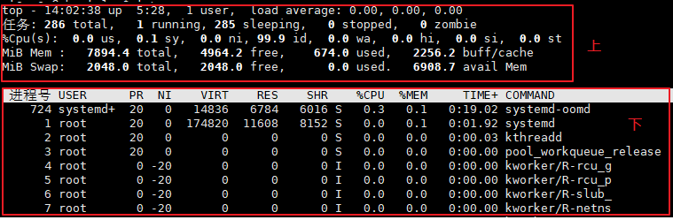

✅ 第一部分：上半区 → 系统全局信息

✔️ 第一行top：依次（1）当前系统时间（2）系统**开机运行时长**（3）当前登录系统的用户数（4）系统平均负载：分别是 **过去 1 分钟、5 分钟、15 分钟** 的系统负载值。负载值越低越好。比如你的服务器是 4 核 CPU，负载值在 4 左右是满负载，超过 8 就是高负载（卡顿）；

✔️ 第二行任务：依次（1）系统总进程数（2） R 状态（运行中）的进程数（3） S 状态（可中断睡眠）的进程数（4）T 状态（暂停）的进程数（5） Z 状态（僵尸进程）的进程数

✔️ 第三行%CPU：依次（1）用户态 CPU 占比（2）内核态 CPU 占比（系统内核、驱动占用的 CPU，正常情况下很低，超过 10% 说明系统内核有异常）（3）低优先级进程 CPU 占比（4）CPU 空闲率（这个值越高越好）（5）其余wa/hi/si/st分别是磁盘 IO 等待、硬件中断等，正常都是 0。

✔️ 第四、五行：内存 + 交换分区 占用信息。

✅ 第二部分：下半区 → 进程列表

依次是（1）PID（2）进程所属用户（3-4）**PR/NI** 进程优先级（5-7）虚拟内存、物理内存、共享内存（8）进程状态（S=睡眠、R=运行等）（9） 进程实时 CPU 占用率 （10）进程实时内存占用率（11）累计占用 CPU 时间（12）进程启动命令

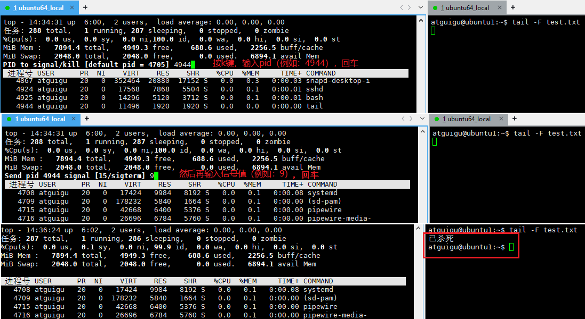

### 6.11.5 netstat显示网络统计信息和端口占用情况

`netstat`用来查看 **服务器端口占用、网络连接状态、TCP/UDP 链接、进程与端口的对应关系**，排查「端口被占用、服务启动失败、连接数过多、网络异常」。

> 命令格式

```bash
netstat [选项]
```

✅ 基础参数

- `-t`  → 只显示 TCP 协议的连接/端口（如http/https/ssh/mysql都是TCP协议） 
- `-u`  → 只显示 UDP 协议的连接/端口（如dns、dhcp）
- ` -l`  → 只显示「处于监听状态」的端口（只有处于**LISTEN**状态，外部才能访问，这是判断服务是否启动成功的核心依据）
- ` -n`  → 以「纯数字」显示IP和端口，不做域名/端口名解析
- ` -p`  → 显示「端口对应的进程名和PID」

> 示例

```bash
sudo netstat -tlnp  #参数无先后顺序要求

# 示例：查3306端口被谁占用
sudo netstat -tlnp | grep 3306
```

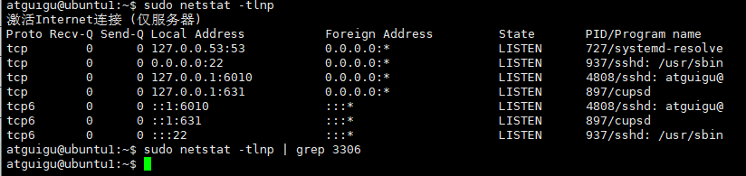

## 6.12 文件路径处理

✔️ 核心结论

1. **`basename`** → 从**完整文件 / 目录路径**中，**提取【文件名 / 目录名】（路径的最后一部分）**
2. **`dirname`** → 从**完整文件 / 目录路径**中，**提取【目录路径】（路径的除最后一部分外的全部）**

✔️ 分析

> 给一个完整路径，比如 `/home/ubuntu/test.txt`

- `basename` 回答的问题：**这个文件叫什么名字？** → `test.txt`
- `dirname` 回答的问题：**这个文件存放在哪里？** → `/home/ubuntu`

> 再比如路径 `/usr/local/nginx/`

- `basename` 回答的问题：**这个目录叫什么名字？** →提取：`nginx`
- `dirname` 回答的问题：**这个目录存放在哪里？**：`/usr/local`

### 6.12.1 basename提前文件或目录名

> 命令格式

```bash
# 语法1：最常用，直接跟【完整路径】
basename 完整文件/目录路径

# 语法2：进阶用法，去掉文件名的【指定后缀】
basename 完整文件路径 要去掉的后缀
```

✔️只关心路径的**最后一段字符串**，不管这个路径对应的文件 / 目录**是否真实存在**，纯字符串解析，不校验文件！

✔️路径结尾带不带 `/`，不影响结果，自动忽略结尾的 `/`

> 示例

```bash
#示例1：提取【文件】的文件名
basename /home/ubuntu/test.txt
# 输出结果：test.txt

# 示例2：提取【目录】的目录名
basename /usr/local/nginx
# 输出结果：nginx

# 示例3：路径结尾带/，不影响结果（自动忽略）
basename /usr/local/nginx/
# 输出结果：nginx

# 示例4：进阶核心：提取文件名【并去掉指定后缀】（写脚本必用）
basename /home/ubuntu/test.txt .txt
# 输出结果：test
```

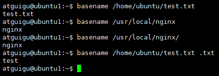

### 6.12.2 dirname提取父目录

> 命令格式

```bash
dirname 完整文件/目录路径
```

✔️和`basename`完全互补，**删掉路径的最后一段，剩下的内容就是 dirname 的输出**

✔️纯字符串解析路径，**不校验文件 / 目录是否真实存在**

✔️路径结尾带不带 `/`，不影响结果，自动忽略结尾的 `/`

> 示例

```bash
# 示例1：提取【文件】所在的目录路径（最常用）
dirname /home/ubuntu/test.txt
# 输出结果：/home/ubuntu

# 示例2：提取【目录】所在的上级目录路径
dirname /usr/local/nginx
# 输出结果：/usr/local

# 示例3：路径结尾带/，不影响结果（自动忽略）
dirname /usr/local/nginx/
# 输出结果：/usr/local

# 示例4：路径是简单文件名（无目录），返回当前目录 . 
dirname test.txt
# 输出结果：.

# 示例5：根路径特殊情况
dirname /
# 输出结果：/
```

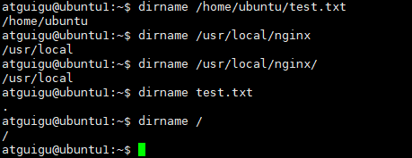


## 6.13 crontab系统定时任务

`crontab` 是 Linux 系统中**最核心的定时任务调度工具**。

应用场景：定时备份数据库、定时清理日志文件、定时执行脚本、定时同步数据、定时重启服务等，**所有需要「自动重复执行」的操作，都用 crontab 实现**。

### 6.13.1 cron服务

`crontab` 依赖系统的 `cron` 服务，Ubuntu 默认开机自启。

`cron`：Linux 系统的**定时任务守护进程**，后台常驻运行，每分钟检查一次是否有任务需要执行，是定时任务的「引擎」；

`crontab`：操作定时任务的**命令工具**，我们通过 `crontab` 命令「新增 / 编辑 / 删除 / 查看」定时任务，最终任务交由 `cron` 进程执行；

> 重新启动crontab服务

```bash
#重启crontab服务
sudo systemctl restart cron

#查看crontab服务状态
systemctl status cron
```

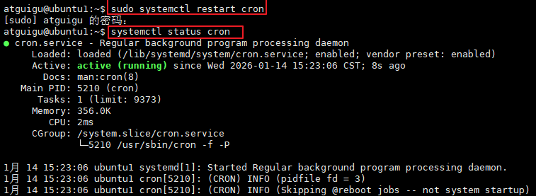


### 6.13.2 crontab定时任务管理

> 命令格式

```bash
crontab [选项]
```

| **选项** | **功能**                      |
| -------- | ----------------------------- |
| **-l**   | 查询crontab任务               |
| **-e**   | 编辑crontab定时任务           |
| **-r**   | 删除当前用户所有的crontab任务 |

#### 1、编辑定时任务

> 示例

```bash
# 编辑当前用户的定时任务（新增/修改/删除）
crontab -e

# 编辑【root用户】的定时任务（执行系统级操作必用）
sudo crontab -e
```

✅格式说明：

✔️一行只能写一个定时任务；

✔️前 5 个字段是 **时间规则**，分别对应 `分(0~59)、时(0~23)、日(1~31)、月(1-12)、周(0~7,其中0和7都代表周日)`，字段之间用「空格」分隔；

- `*` → 【任意匹配】 代表「该字段的所有取值」，比如分钟写`*`，就是「每分钟」执行；
- `/` → 【间隔执行】 代表「每隔多久执行一次」，格式：`起始值/间隔值`，比如分钟写`*/5`，就是「每 5 分钟」执行；
- `,` → 【枚举执行】 代表「指定多个离散的时间点」，比如小时写`8,12,18`，就是「每天 8 点、12 点、18 点」执行；

✔️第 6 个字段及以后是 **要执行的命令 / 脚本**，必须写「绝对路径」（crontab 的执行环境是纯净的，不识别相对路径，这是新手第一大坑！）；

✔️可以用 `#` 开头写注释，注释行不会执行。

✅ 时间规则经典案例

```bash
# ================= 频率从高到低 =================
# 分  时  日  月  周
* * * * *        # 每分钟 执行一次（最细粒度）
*/5 * * * *      # 每5分钟 执行一次
*/10 * * * *     # 每10分钟 执行一次
0 * * * *        # 每小时的【第0分钟】执行一次 → 每小时执行一次
0 */2 * * *      # 每2小时 执行一次

0 3 * * *        # 每天 凌晨3点整 执行一次（备份日志/数据库首选）
0 0 * * *        # 每天 凌晨0点整（午夜）执行一次
0 8,18 * * *     # 每天 早上8点、下午6点 各执行一次

0 0 * * 0        # 每周日 凌晨0点 执行一次
0 0 * * 1-5      # 每周一到周五 凌晨0点 执行一次（工作日执行）

0 0 1 * *        # 每个月 1号 凌晨0点 执行一次（月度任务）
0 0 1 1 *        # 每年 1月1号 凌晨0点 执行一次（年度任务）

# ================= 特殊场景 =================
30 2 * * *       # 每天 凌晨2点30分 执行一次
15 10 * * 6      # 每周六 上午10点15分 执行一次
0 0 15 */3 *     # 每3个月的15号 凌晨0点 执行一次
```

> 示例

```bash
crontab -e
```

任务：每隔1分钟，向 /home/atguigu/shangguigu.txt文件中写入一句“我爱尚硅谷”

```shell
*/1 * * * * /bin/echo "我爱尚硅谷" >> /home/atguigu/shangguigu.txt
```

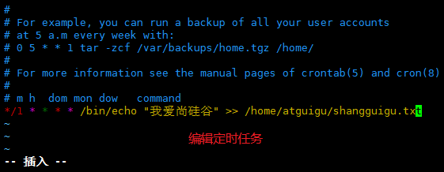

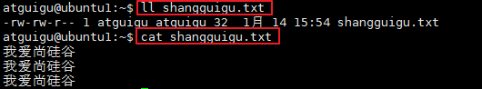

#### 2、查看定时任务

> 示例

```bash
crontab -l       #查看当前用户的定时任务

sudo crontab -l  #查看root用户的定时任务

# 查看指定用户的定时任务
sudo crontab -u atguigu -l
```

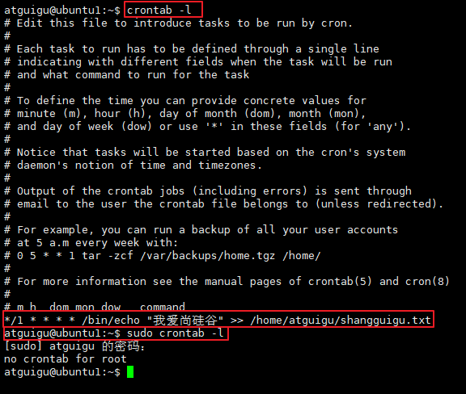

#### 3、删除定时任务

> 示例

```bash
# 删除当前用户的【所有】定时任务（一次性清空，无确认提示）
crontab -r

# 删除root用户的所有定时任务
sudo crontab -r
```

🔴删除「单个任务」的正确方式：用 `crontab -e` 打开编辑页面，直接删掉对应任务行，保存退出即可，这是最安全的方式。


