# 第 1 章 VMware

## 1.1 VMware Workstation简介

简称“VMware”，VMware Workstation 是一款由 VMware 公司开发的虚拟化软件，它允许用户在一台物理机器上创建和运行多个完整的虚拟机。每台虚拟机可以运行不同的操作系统，并且与主机系统和其他虚拟机之间保持良好的隔离性。

## 1.2 VMware安装

嵌入式硬件的上位机一般为嵌入式Linux，需要Linux开发环境。如果要在Windows中使用Linux开发环境，最方便的方法是使用虚拟机。

以下是VMware Workstation Pro 17.5.1（)的安装步骤。

### 1、欢迎界面

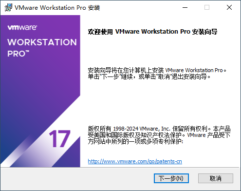

### 2、协议许可

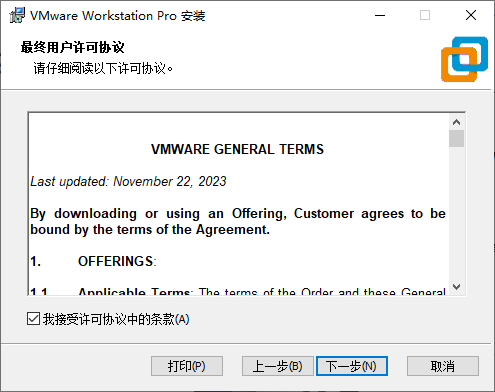

> 部分同学电脑上可能同时安装了WSL2、Docker Desktop 等，而这些程序依赖Hyper-V 的工具，则请勾选**自动安装 Windows Hypervisor Platform (WHP)** 复选框

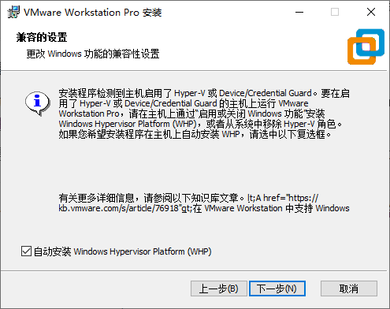

### 3、选择安装路径及其他功能

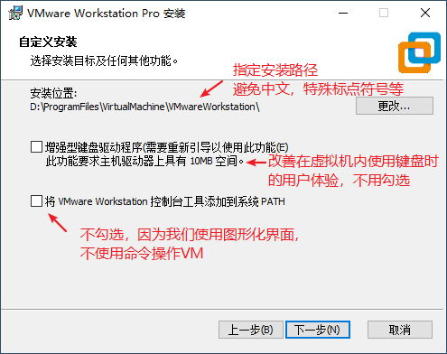

### 4、用户体验设置

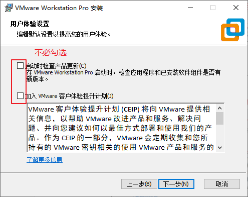

### 5、快捷方式

建议勾选，安装后使用起来会比较方便。

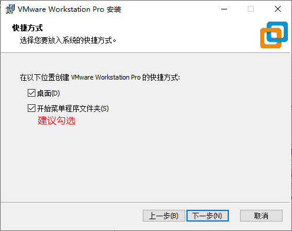

### 6、确认开始安装

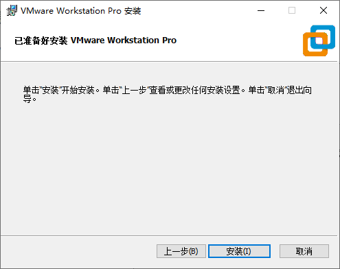

### 7、安装

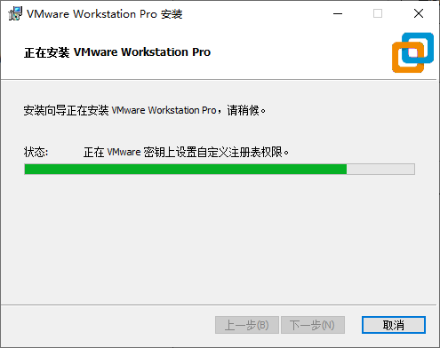

### 8、输入许可证

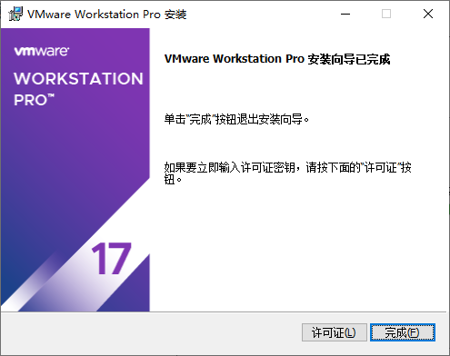

### 9、完成安装

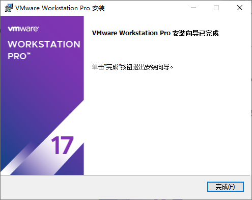

## 1.3 VMware卸载

第一步：控制面板>程序->卸载程序->VMware Workstation，双击卸载

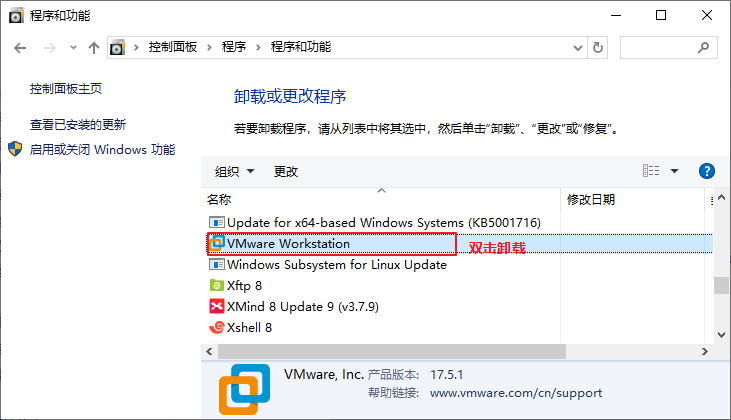

第二步：下一步

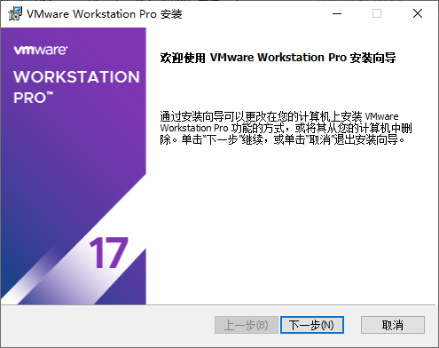

第三步：删除

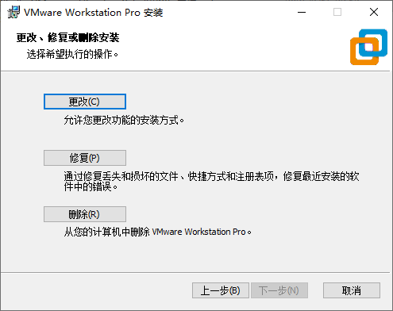

第四步：不保存，下一步

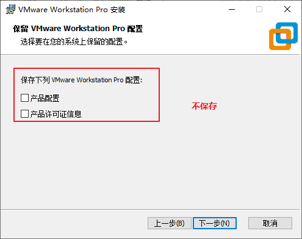

第五步：删除

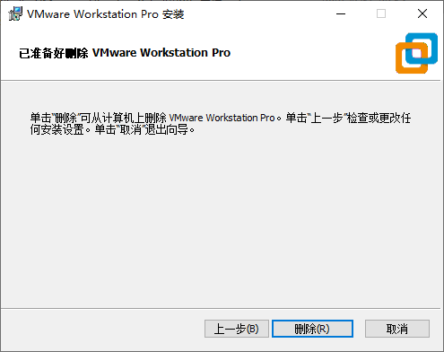

第六步：等待进度条完成


# 第2章 Ubuntu

系统的安装得分两个步骤，第一步得配置一台电脑，选配cpu，内存，磁盘，网卡等硬件。第二步才是安装系统。

## 2.1 配置电脑硬件信息

### 1、启动VMware并新建虚拟机

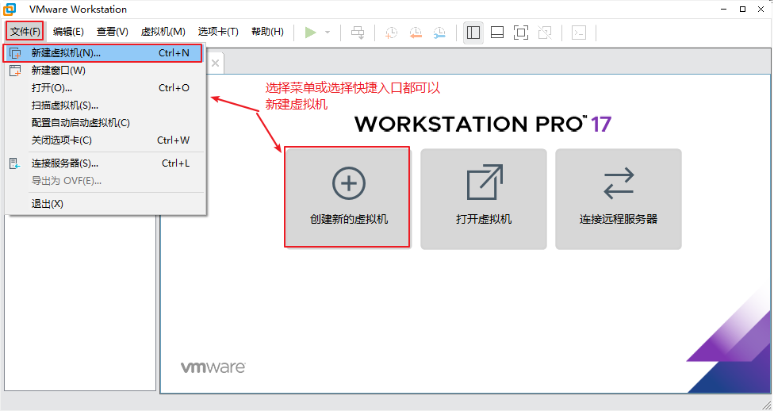

### 2、选择配置类型

- 选择“自定义新的虚拟机”（修改）

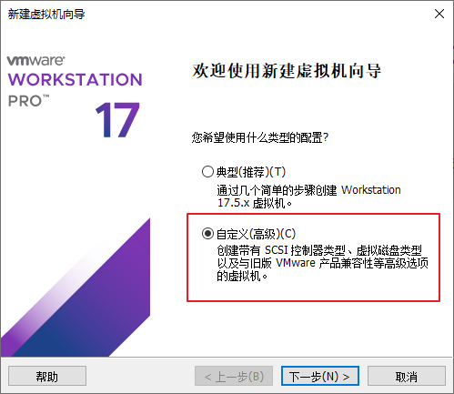

### 3、选择硬件兼容性版本

- 建议选择`Workstation 17.x`（修改）

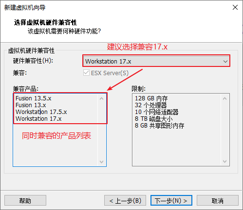

### 4、选择如何安装操作系统

- 选择“稍后安装操作系统”（修改）

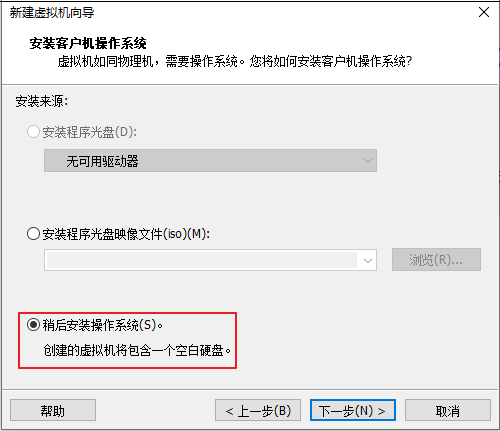

### 5、选择虚拟机将来需要安装的系统

因为不同的操作系统需要解决不同的兼容性问题，所以需要选择将来用什么系统，提前做适配。

- 选中“Linux”（修改）
- 选择`Ubuntu64位`（修改）

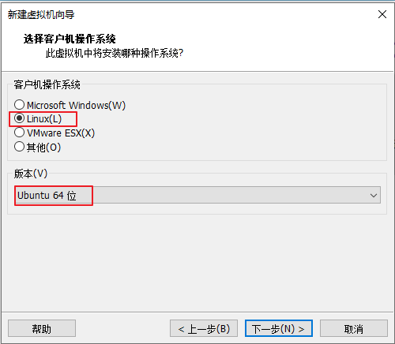

### 6、配置电脑

- 给自己配置电脑取个名字，并存放在物理机的位置在哪。（可以修改）

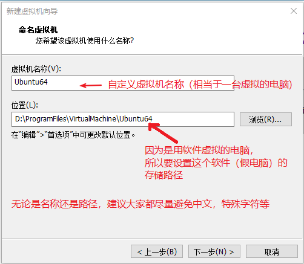

### 7、设置CPU

- 一般选择1个处理器和4个内核；配置高的，可以选择2个处理器和4个内核。（修改）
- 根据实际使用情况动态调整，从较少vCPU开始，不够再加。个人使用配置方案：
  - **主虚拟机**：分配物理核心的1/4到1/2
  - **测试虚拟机**：1-2 vCPU（目前是测试虚拟机）
  - **保留至少2个物理核心给宿主机**

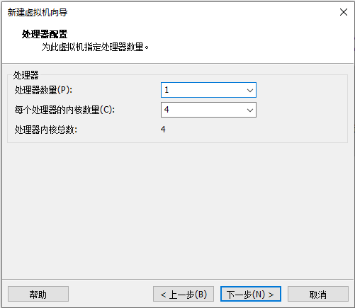

> 如何查看宿主机的CPU？

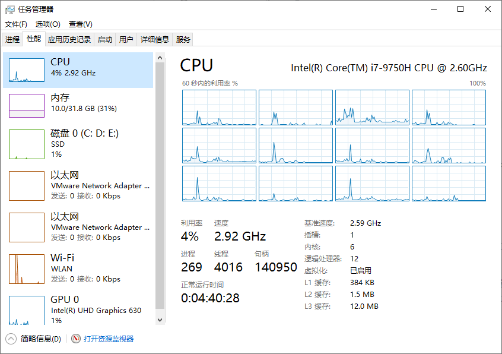

### 8、设置内存

- 内存4-8G，如果电脑配置高可以酌情增加。（修改）
- **多个虚拟机总分配内存** ≤ **物理内存** - **宿主机保留内存**
- **宿主机保留内存**：通常为 **4-8GB**（Windows需更多，Linux可略少）

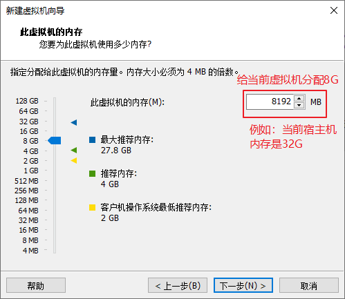

> 如何查看宿主机的内存？

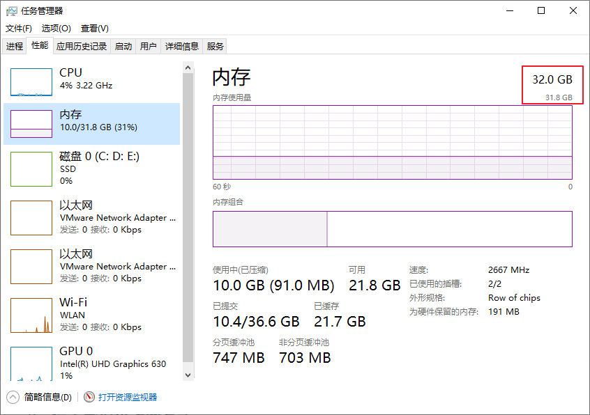

### 9、设置虚拟机上网方式

- 使用桥接网络：虚拟机和宿主机有独立的IP（在教室学生电脑 + 学生电脑上虚拟机 的IP地址总数量可能会超过192.168.2.x网段数量）
- `建议使用网络地址转换(NAT)：虚拟机与宿主机共享IP`
- 使用仅主机模式网络：相当于虚拟机只与宿主机通信，不与其他主机通信
- 不使用网络连接：虚拟机不与任何主机通信

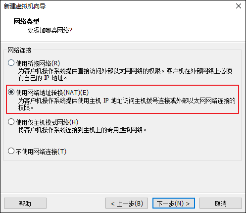

> 如何查看宿主机网络适配器信息？

- 安装VMware之后物理机的网络适配器信息（会多两个VMnet1 和VMnet8）
- 注意：VMnet8是虚拟机使用NAT模式上网的网卡。

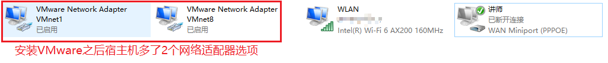

### 10、选择对应的文件系统的IO方式

- 选择“LSI Logic”（默认）

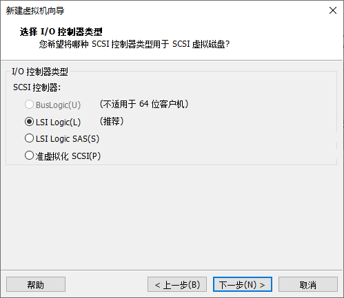

| 特性               | **标准SCSI (BusLogic)**                               | **LSI Logic**                                                | **LSI Logic SAS**                                            |
| :----------------- | :---------------------------------------------------- | :----------------------------------------------------------- | :----------------------------------------------------------- |
| **本质**           | 最古老的模拟控制器，兼容性极佳                        | 较新的模拟控制器，性能更好                                   | 更新的、为现代系统优化的模拟控制器                           |
| **仿真硬件**       | BusLogic BT-958 控制器                                | LSI 53C1030 Ultra320 SCSI 控制器                             | LSI SAS 1068 SAS 控制器                                      |
| **操作系统兼容性** | **极好**，尤其是旧系统（如Win 98， NT， 旧Linux内核） | **很好**，适用于多数现代和稍旧的系统（Win XP ~ Win 10, Linux） | **较好**，主要针对现代系统（Win 8/10/11, RHEL 6+, Ubuntu 12.04+, ESXi 6.0+） |
| **性能**           | 最低（仅单队列）                                      | 中等（支持多队列，比标准SCSI好）                             | **最高**（专为高吞吐量和SSD优化，原生支持SCSI命令队列）      |
| **队列深度**       | 低（通常为1）                                         | 较高                                                         | **最高**，能更好地处理并发I/O请求                            |
| **最大磁盘数**     | 通常15个/控制器                                       | 通常15个/控制器                                              | 通常255个/控制器                                             |
| **主要用途**       | 保证古董系统的兼容性                                  | **默认的通用选择**，平衡兼容性与性能                         | 追求**最佳性能**，特别是在SSD上，或作为现代虚拟化平台（如ESXi）的虚拟磁盘 |

### 11、选择磁盘的类型

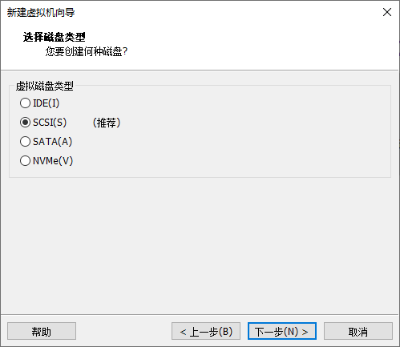

> 四种类型详解与选择建议

| 类型     | 兼容性   | 性能           | 推荐使用场景                                                 |
| :------- | :------- | :------------- | :----------------------------------------------------------- |
| **IDE**  | **最高** | **最差**       | **Windows XP及更老的系统**；某些无法识别SCSI驱动的古董操作系统安装盘。 |
| **SCSI** | **高**   | **高**         | **VMware的默认推荐**，适用于绝大多数现代服务器和桌面系统（Windows/Linux）。 |
| **SATA** | **中**   | **高**         | Windows 7/Vista及之后、Linux 2.6.19内核及之后的系统。性能与SCSI相当。 |
| **NVMe** | **低**   | **理论上最高** | **Windows 10/11， Server 2016+， 现代Linux发行版**。需系统内置驱动，追求极致性能。 |

> 为什么VMware“推荐SCSI”？（即使宿主机是SATA）

**VMware推荐SCSI，不是因为它物理上更快，而是因为它在虚拟化环境中的综合优势：**

1. **功能最全**：SCSI控制器支持高级功能，如**热添加磁盘**（在不断机的情况下给虚拟机增加新硬盘）、更高效的中断处理。
2. **队列深度高**：能更好地处理并发I/O请求，在多任务负载下表现更优。
3. **兼容性极佳**：所有现代操作系统（Windows/Linux/Unix）都自带稳定可靠的SCSI驱动，开箱即用。
4. **管理生态成熟**：VMware的全套工具链（快照、Storage vMotion、备份）对SCSI虚拟磁盘的支持和优化最成熟。
5. **性能不差**：在虚拟化层面，经过高度优化的SCSI控制器性能与SATA/NVMe模拟控制器在实际使用中感知差距不大，除非你进行极端基准测试。

**简单比喻**：SCSI就像一个经验丰富、功能全面的“老司机”，虽然开的车（模拟的）牌子不是最新款，但他熟悉所有道路和交通规则（VMware虚拟化层），能最安全、稳定、高效地把你的数据送到目的地。而NVMe模拟的控制器就像一个开超级跑车的新手，车本身潜力巨大，但可能在复杂的立交桥（虚拟化环境）上找不到最佳路线。

> 如何查看宿主机磁盘类型？

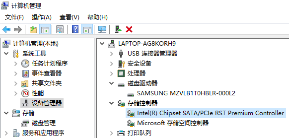

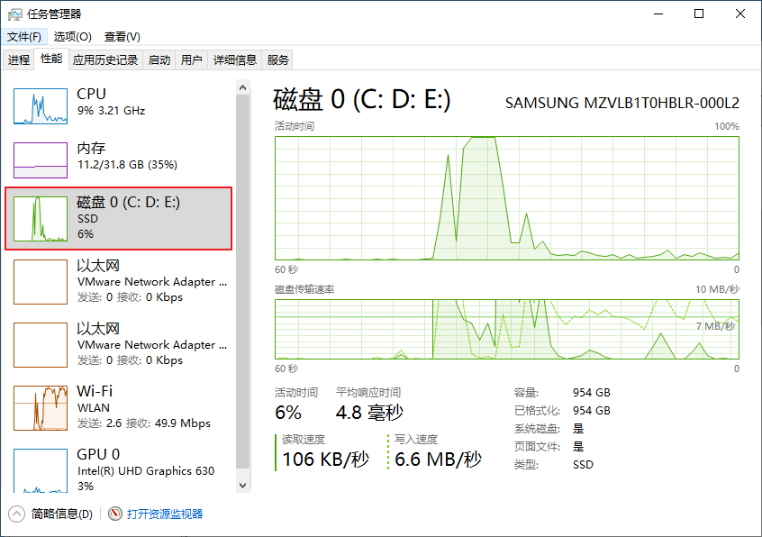

> SATA与SSD关系？

| 维度                | **SATA**                                                     | **SSD**                                                      |
| :------------------ | :----------------------------------------------------------- | :----------------------------------------------------------- |
| **本质是什么**      | **一种接口/通道标准**                                        | **一种存储介质/设备类型**                                    |
| **类比**            | **公路的类型**（如：省道、国道、高速公路）                   | **车的类型**（如：卡车、跑车）                               |
| **核心功能**        | 负责在**主板**和**存储设备**之间传输数据。定义物理连接器形状、电缆和通信协议。 | 用于**永久存储数据**。使用闪存芯片（NAND Flash）而非机械盘片来读写数据。 |
| **对立/对比的对象** | 与 **IDE/PATA**（上一代）、**SAS**（企业级）、**NVMe/PCIe**（新一代）等接口标准对比。 | 与 **HDD** 进行对比。HDD 是另一种存储设备类型（机械硬盘）。  |

| 存储设备类型        | 可能使用的接口/通道 | 性能比喻                                                   |
| :------------------ | :------------------ | :--------------------------------------------------------- |
| **HDD（机械硬盘）** | SATA（最常见）      | **拖拉机走国道**。国道限速远高于拖拉机速度，毫无压力。     |
| **SSD（固态硬盘）** | SATA                | **跑车走国道**。跑车性能被国道限速压制，无法发挥全部实力。 |
| **SSD（固态硬盘）** | **NVMe/PCIe**       | **跑车走高速公路**。路快、协议高效，跑车性能得到彻底释放。 |

### 12、选择创建磁盘方式

- 选择“创建新虚拟磁盘”（默认）

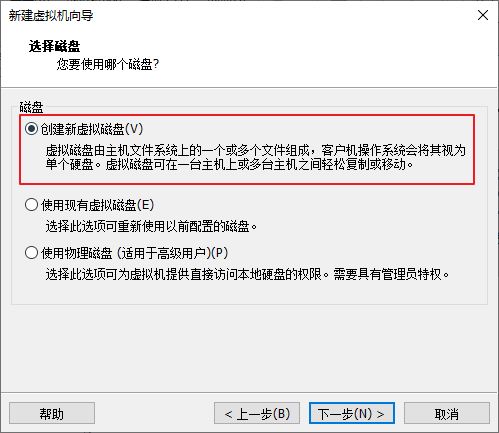

### 13、选择虚拟机的磁盘大小和文件个数

- 指定最大磁盘大小为：50G （修改）
- 选择虚拟硬盘文件个数为：1 （修改）

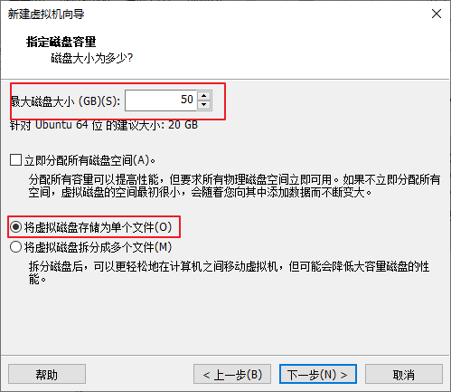

### 14、虚拟机文件的存放位置

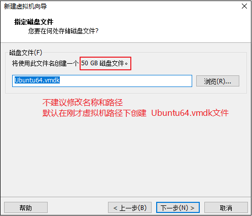

### 15、电脑配置完毕

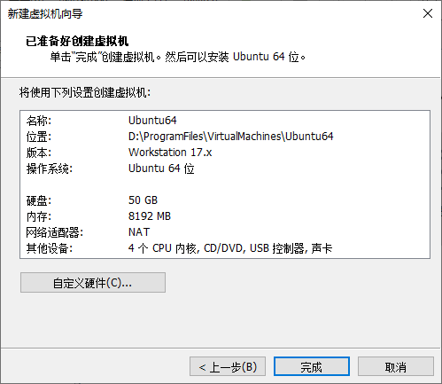

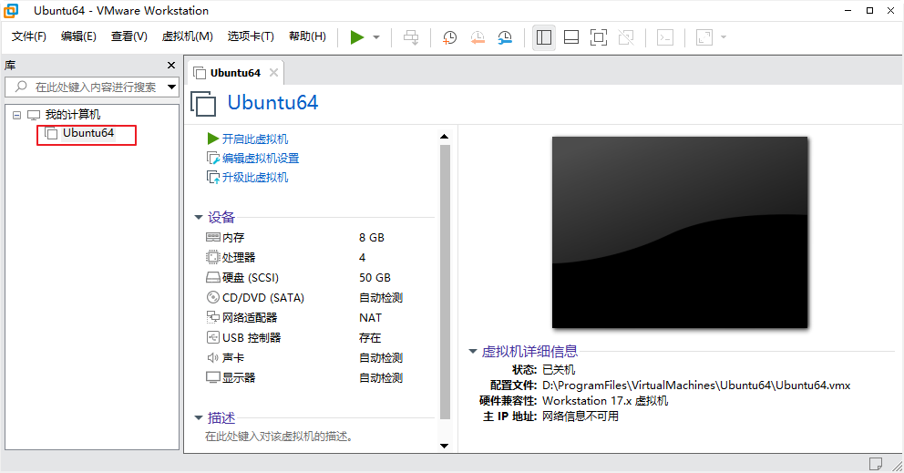

## 2.2 安装Ubuntu系统

### 2.2.1 准备工作

#### 1、检查虚拟机bios是否开启

在安装系统之前需要检查自己虚拟机的bios的虚拟化是否打开（大部分的电脑都是打开的，大家可以先尝试直接安装，如果出现错误再去调试，没有出错就不用管了）。

注：如果虚拟化没有开启报的是以下错误。

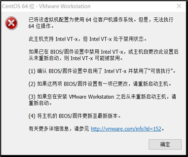

> 如何查看虚拟机的bios的虚拟化是否打开？

（1）window10

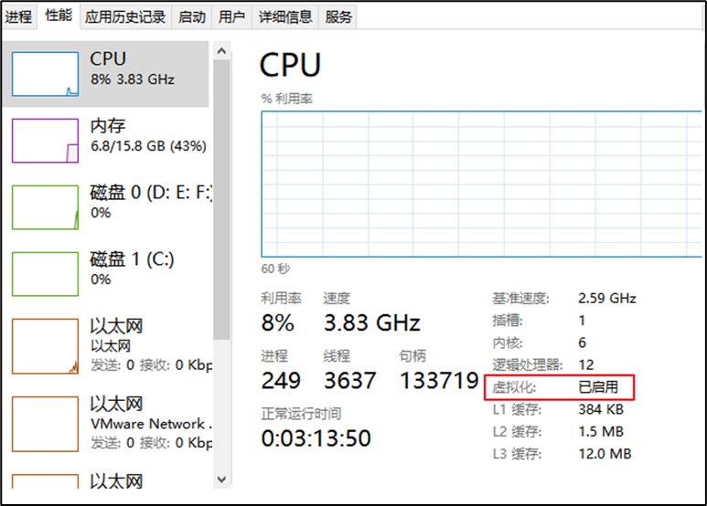

（2）window7里面看不到（得去bios里面看）

> 如何开启bios虚拟化？

- 如果发现bios虚拟化没有开启怎么办，重启电脑，在加载界面时按f1-f10,或者电脑旁边一个小洞，具体怎么进入得去查一下（按照自己电脑的型号去查）

- 修改虚拟化为开启（thinkpad为例）找到security里面的VT并改成enabled

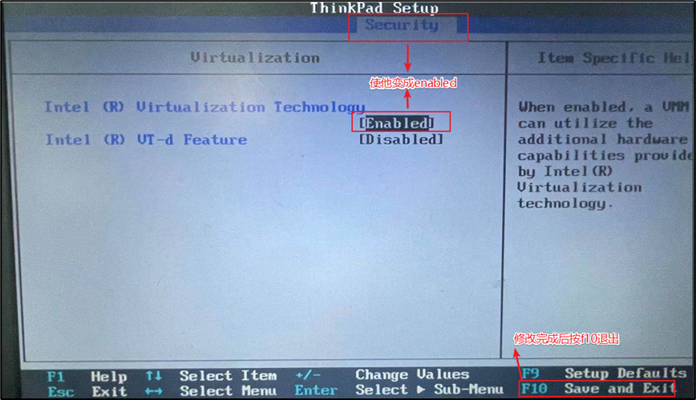

#### 2、选择cd/dvd的方式安装系统

镜像下载网站：https://mirrors.tuna.tsinghua.edu.cn/ubuntu-releases/22.04.4/

> 老师已经给大家在软件资料目录下准备了“ubuntu-22.04.4-desktop-amd64.iso”

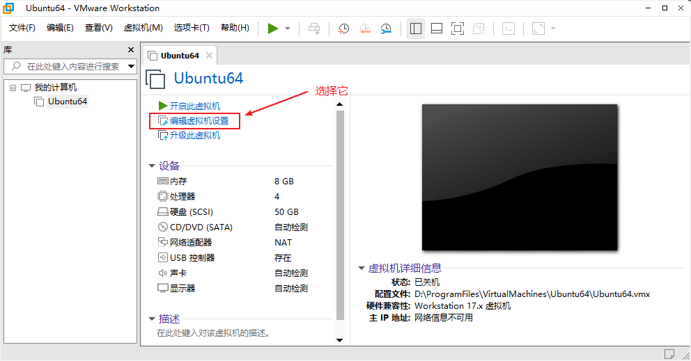

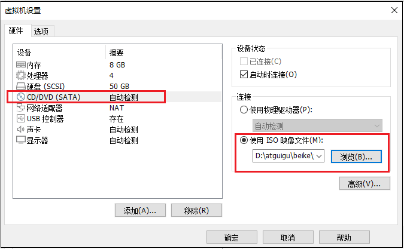

### 2.2.2 正式安装Ubuntu系统

#### 1、启动虚拟机

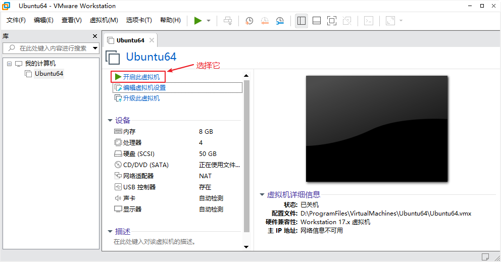

#### 2、进入安装界面

你得需要将鼠标点击进入界面中，但是鼠标会消失，你此刻得用键盘的上下键来控制选项，图标变白了表示当前选中的是哪个选项，然后敲回车，表示执行所选选项。

🔔注意：如果这个时候你需要鼠标可以使用ctrl+alt一起按呼出鼠标。

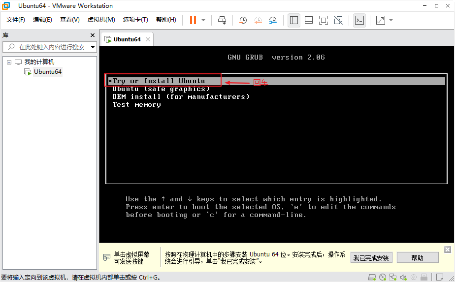

#### 3、选择安装Ubuntu以及界面的语言

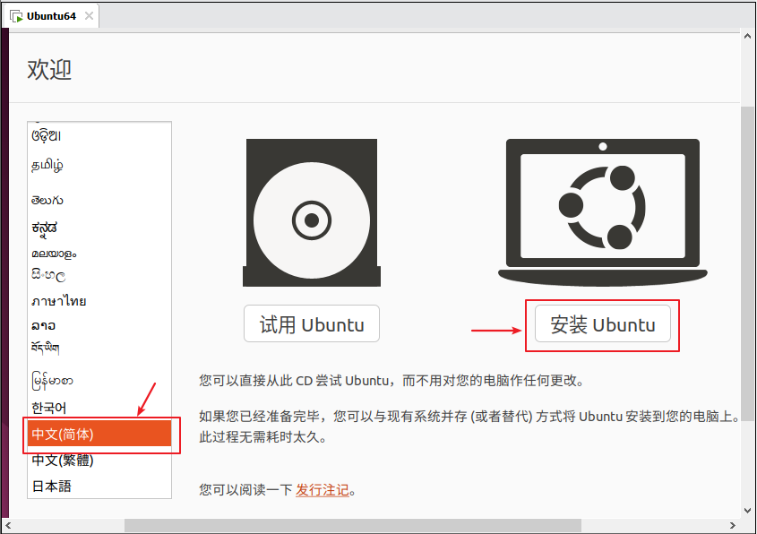


#### 4、选择键盘布局

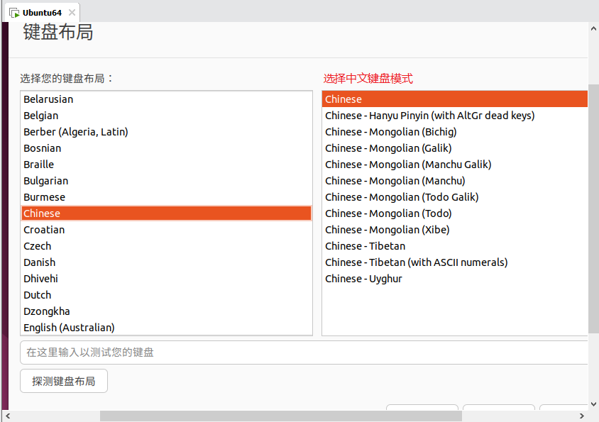

#### 5、选择是否更新和安装其他软件

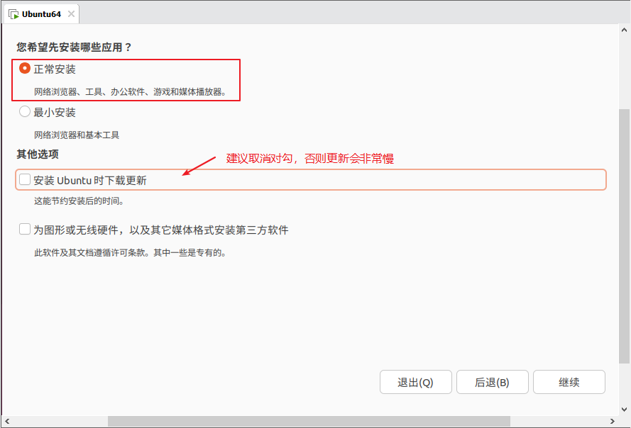

#### 6、选择安装类型

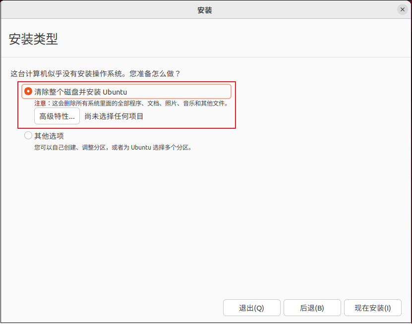

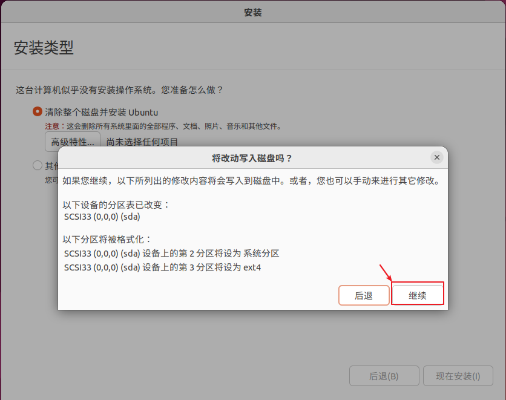

#### 7、选择时区

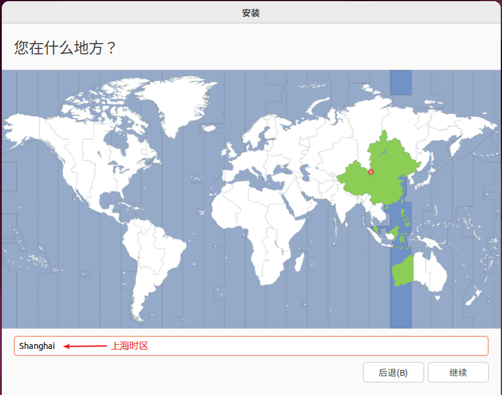

#### 8、设置计算机名称、用户名、密码

🔔 注意：用户名最终都是小写（即使输入大写，最终存储的都是小写的），不要用中文

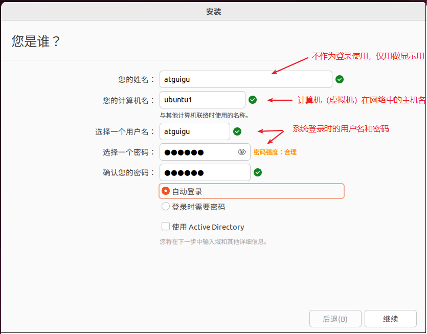

#### 9、等待安装完成


#### 10、重启虚拟机


#### 11、移除安装镜像


### 2.2.3 虚拟机的使用引导界面

#### 1、跳过账户页面


#### 2、跳过启用Ubuntu Pro


#### 3、不发送系统信息


#### 4、不开启定位


#### 5、完成


#### 6、不升级

如果弹出升级建议，可以选择不升级。


### 2.2.4 配置网络

在未进行自定义网络配置前，当前虚拟机就已经可以通过宿主系统（Windows）连接外网了。当前配置网络并不是为了让虚拟机能上网。

❓问题：当前虚拟机在宿主机上的`内网`虚拟IP是动态产生的，而宿主机想要连接虚拟机需要确定虚拟机的IP地址才能连接，动态变化的IP极不方便。

✅解决：接下来通过相关网络配置来固定虚拟机的`内网`虚拟IP。


#### 1、固定虚拟机的内网虚拟IP

（1）选择VMware的【编辑】菜单->【虚拟网络编辑器(N)...】


（2）弹出虚拟网络编辑窗口，选择【更改设置】


（3）设置子网IP

🔴如果当前教室网段是10，这里就要修改为其他网段

🔴子网IP：192.168.x.0，最后一位“0”是子网地址的常规写法，不能随意更改。例如：`192.168.10.0` 在这里表示一个**子网地址**，而不是一个可用的IP地址，这个写法表示：

- 网络地址：192.168.10.0
- 可用IP范围：192.168.10.1 - 192.168.10.254
- 广播地址：192.168.10.255


> 三种模式对比总览

| 特性               | **桥接模式**                                             | **NAT模式 (VMnet8)** | **仅主机模式 (VMnet1)** |
| :----------------- | :------------------------------------------------------- | :------------------- | :---------------------- |
| **网络位置**       | 同宿主机物理网络（会占用教室网络IP，与某学生电脑IP冲突） | 独立虚拟网络         | 独立虚拟网络            |
| **IP分配**         | 物理网络DHCP                                             | 虚拟网络DHCP         | 虚拟网络DHCP            |
| **访问宿主机**     | ✅ 直接                                                   | ✅ 通过虚拟网络       | ✅ 通过虚拟网络          |
| **访问其他物理机** | ✅ 直接                                                   | ❌ 不能直接           | ❌ 不能直接              |
| **访问Internet**   | ✅ 直接                                                   | ✅ 通过NAT转换        | ❌ 不能                  |
| **被外部访问**     | ✅ 直接可达                                               | ❌ 需端口转发         | ❌ 完全隔离              |
| **网段要求**       | 与物理网络同网段                                         | 与物理网络不同       | 任意设置                |

（4）NAT设置网关IP


然后全部点击确定，VMware的网络配置就好了。

> 🔧 如何确定网关IP？

- 家用路由器：通常是 `.1`
- 企业防火墙：可能是 `.254` 或 `.1`
- VMware虚拟网络：默认 `.2`

网关IP必须满足：

1. **在同一子网内**：192.168.10.1 - 192.168.10.254
2. **不能是网络地址**：不能是 192.168.10.0
3. **不能是广播地址**：不能是 192.168.10.255
4. **不能与已有设备冲突**

#### 2、虚拟机网络IP修改地址配置

（1）启动并进入虚拟机


（2）关闭网络并打开设置


（3）手动设置IP

🔴如果前面设置的网络地址是192.168.10.0，网关是192.168.10.2，那么可用IP范围：192.168.10.1 - 192.168.10.254（除了192.168.10.2）都可以。


（4）重新打开网络


#### 3、测试宿主机与虚拟机的连接

（1）宿主机：以windows为例

- `ipconfig`：查看本机IP地址等信息
- `ping 目标IP` ：连通性测试。发送4个包后自动停止。


（2）虚拟机：Ubuntu64

- `ifconfig`：查看本机IP地址等信息（注意区别）
- `ping 目标IP` ：连通性测试。**无限循环**，按 `Ctrl+C` 停止


> 注意，第一次执行`ifconfig`命令，需要安装net-tools包。

```bash
sudo apt update  # 类似于打开手机应用商店，点击「下拉刷新」，必做，否则可能安装失败、找不到包、安装的是旧版本、依赖缺失等报错
sudo apt install net-tools # 类似于下载并安装net-tools应用
```


> 测试连接宿主机：ping 宿主机的IP


（6）在宿主机上测试连接虚拟机

```bash
ping 虚拟机的IP
```

### 2.2.4 删除Ubuntu系统


# 第3章 远程终端工具安装

Xshell：windows系统工具，连接本地或远程的Linux系统虚拟机或服务器，通过命令来操作虚拟机或服务器。

Xftp：windows系统工具，连接本地或远程的Linux系统虚拟机或服务器，进行文件传输操作。


## 3.1 ssh服务端安装（必须）

在Ubuntu中打开终端，执行以下命令：

```txt
sudo apt update  #更新包管理工具
sudo apt install -y ssh
```


## 3.2 Xshell8安装和配置

### 3.2.1 Xshell的安装


#### 1、欢迎页


> 如果提示需要下载最新版的Xshell，请到官网下载一下即可。下载路径：https://www.xshell.com/zh/free-for-home-school/


#### 2、接收许可证协议


#### 3、选择安装路径


#### 4、选择程序文件夹

- 保持默认即可


#### 5、完成安装


#### 6、注册

- 不想注册的就跳过注册，但是每次启动都会出现上述弹窗
- 可以根据左下角的“免费用户注册指南”自行注册。


### 3.2.2 配置Xshell终端

#### 1、新建连接


#### 2、填写虚拟机信息

> 方式一：直接填写虚拟机的IP地址


> 方式二：填写hosts文件中配置的主机名


🔴注意：直接保存没法存，可以先存到桌面上，然后再覆盖原来的hosts文件。


#### 3、连接


## 3.3 Xftp8安装和配置

### 3.3.1 安装Xftp8


#### 1、欢迎页


#### 2、接收许可证协议


#### 3、选择安装路径


#### 4、选择程序文件夹


#### 5、完成安装


### 3.3.2 配置Xftp8

#### 1、新建连接


#### 2、填写虚拟机信息


#### 3、确认字符编码为UTF-8


#### 4、连接

- 连接之后两边就可以拖拽文件了


