# 第一章 Docker简介

## 1.1 Docker是什么

**Docker 是一款能把「应用程序 + 它的所有运行依赖」打包成一个独立、可移植「容器」的工具**，核心是实现**应用的「一次打包，到处运行」**。

## 1.2 为什么要用Docker

Docker 的核心优势：

> **1、解决「环境地狱」，彻底告别 “我本地能跑啊”**

开发过程中最常见的扯皮：开发本地代码能正常运行，部署到测试 / 生产环境就报错，原因大概率是**环境不一致**。

Docker 会把**应用本身 + 运行所需的所有依赖（编程语言、库、配置、系统工具）** 一起打包成一个独立的**镜像（Image）**，基于镜像运行的**容器（Container）** 就是一个隔离的 “迷你运行环境”。这个容器在 Windows、Mac、Linux 任何系统，在本地、测试服务器、云服务器上的运行结果**完全一致**，从根本上消灭了环境差异的问题。

> **2、部署超简单，告别繁琐的 “环境搭建步骤”**

AI 学习中最常见的问题：跟着教程写代码，却因为**Python 版本不对、第三方库版本冲突、CUDA没装对、系统差异（Windows/Mac/Linux）**，导致代码跑不起来，甚至花几小时装依赖还装失败。

用 Docker 后，部署只需要两步：

1. 拉取提前打好的应用镜像（`docker pull 镜像名`）；
2. 启动容器（`docker run 镜像名`）。

哪怕是复杂的项目，也能通过`Docker Compose`写一个简单的配置文件，执行`docker-compose up`就能**一键启动所有服务**，无需手动逐个配置，部署效率提升十倍以上。

> **3、对多项目 / 多环境开发：轻量级隔离，避免环境污染**

Python/AI 学习中会同时做多个项目：比如一个项目用 PyTorch1.13（需要 CUDA11.7），另一个项目用 PyTorch2.2（需要 CUDA12.1），还有一个项目用纯 CPU 的 TensorFlow—— 如果直接装在本地，多个版本的库、CUDA 会冲突，导致所有项目都跑不起来。

- 普通 Python 虚拟环境（venv/conda）：只能隔离 Python 包，无法隔离**系统级依赖**（比如 CUDA、cuDNN、系统工具），还是会出现冲突；
- Docker 容器：**每个容器都是完全独立的隔离环境**，不同容器可以装不同版本的 Python、PyTorch、CUDA，彼此之间没有任何影响，启动 / 停止容器只需要一行命令，占用资源极少（比虚拟机轻几十倍）。多个容器同时运行，互不干扰，关闭容器后不会在本地留下任何垃圾文件。

> **4. 版本管理 + 回滚，应用发布更安全**

Docker 的镜像支持**版本标签**（比如`app:v1.0`、`app:v1.1`），可以为每个版本的应用打一个独立镜像，相当于给应用做了 “快照”。

如果新版本上线后出现 BUG，无需重新搭建环境，直接停止新版本容器、启动旧版本镜像的容器，**几秒就能完成回滚**，比传统的代码回滚 + 环境重新配置快得多，大幅降低线上故障的影响范围。

同时，镜像可以推送到**镜像仓库**（Docker Hub / 私有仓库）统一管理，团队成员可以随时拉取指定版本的镜像，避免版本混乱。

> **5. 跨平台兼容，适配所有部署环境**

Docker 镜像可以在**Windows、macOS、Linux**（CentOS/Ubuntu/Debian）等所有主流系统上运行，也能无缝适配**阿里云 / 腾讯云 / 华为云**等各大云平台，AI 算力平台（AutoDL、智谱 AI），甚至是边缘设备。

本地打包好的 AI 模型服务镜像，直接上传到云平台，就能一键部署成在线服务，不用再在云服务器上手动配环境、装依赖，大大降低部署难度；

## 1.3 Docker与虚拟机的区别

你可能会问：“虚拟机也能隔离环境，为什么不用虚拟机？”—— 这是 Docker 和虚拟机的核心区别，也是 Docker 的一大优势。

- 虚拟机（VMware/VirtualBox）：是**硬件级隔离**，每个虚拟机都需要独立的操作系统、内核，启动慢（分钟级）、占用资源多（比如一个虚拟机至少占 1G 内存），一台服务器跑不了几个虚拟机。
- Docker 容器：是**进程级隔离**，所有容器共享宿主机的操作系统内核，容器只封装应用和依赖，体积极小（几十 M / 几百 M）、启动超快（秒级），一台服务器能跑上百个容器，资源利用率直接拉满。

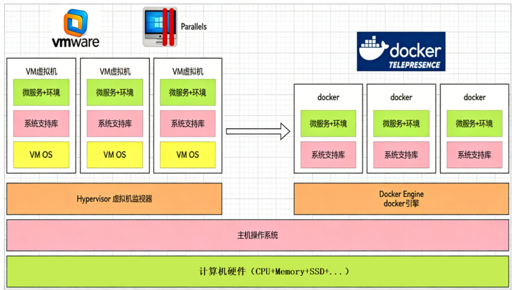

## 1.4 Docker如何跨平台

**Docker 容器是基于「Linux 内核」的轻量级隔离**，这是 Docker 的底层根基（和之前讲的「容器共享宿主机内核」呼应）。

- Linux 系统（Ubuntu/CentOS/Deepin）是 Docker 的「原生运行环境」，容器可以直接跑，没有任何额外层；
- Windows/Mac 系统本身没有 Linux 内核，Docker 会在本地**悄悄启动一个轻量级的 Linux 虚拟机（VM）**，把容器跑在这个 Linux 虚拟机里 —— 对用户来说，这个虚拟机是「透明的」，你感觉不到它的存在，只需要正常用 Docker 命令就行。

简单说：**所有 Docker 容器，最终都是跑在 Linux 内核上的**，Windows/Mac 只是做了一层「内核兼容层」，这是 Docker 能跨平台的**底层基础**。

# 第二章 Docker架构

## 2.1 核心架构模式：C/S（客户端 - 服务器）

Docker 并非单进程程序，而是由**客户端（Docker Client）** 和**服务端（Docker Daemon）** 两大部分组成，二者通过**REST API**（HTTP/HTTPS）通信，支持本地通信（Unix 套接字）和远程通信（TCP/IP）。

- **运行逻辑**：你在终端执行`docker run`、`docker pull`等命令时，实际是**客户端**将命令封装成 API 请求，发送给**服务端**；服务端接收请求后，执行真正的镜像拉取、容器创建 / 启动等操作，再将结果返回给客户端。
- **灵活部署**：客户端和服务端可以在**同一台主机**（默认情况），也可以在**不同主机**（比如远程管理云服务器上的 Docker）。

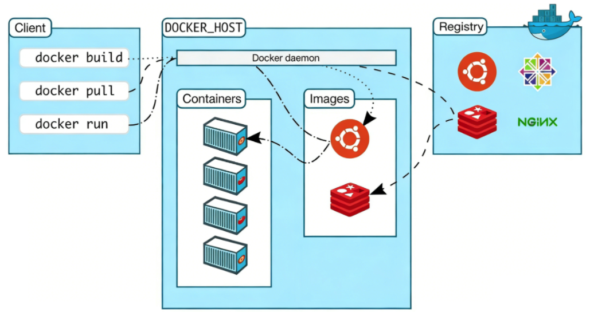

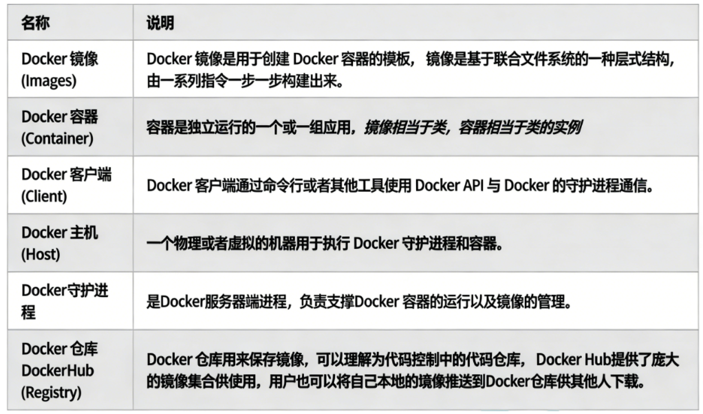


## 2.2 Docker 核心概念

镜像、容器、仓库是 Docker 架构中最核心的三个部分，也是日常使用中接触最多的，三者层层依赖、协同工作，**镜像是基础，容器是镜像的运行实例，仓库是镜像的存储仓库**。

### 2.2.1  镜像（Docker Image）- 容器的「模板 / 蓝图」

- **本质**：一个**只读的分层文件系统**，包含了运行某个应用所需的**所有依赖**（代码、运行时、库、环境变量、配置文件等），相当于容器的 “安装包”。
- 核心特性：分层存储、写时复制（Copy-on-Write）
  - 分层：一个镜像由多个只读层叠加而成（比如基础层`ubuntu:20.04`、依赖层`python3.9`、应用层`自己的代码`），分层可以实现镜像复用（多个镜像共享相同基础层，节省磁盘空间）。
  - 写时复制：镜像本身`只读`，当基于镜像创建容器时，会在镜像最上层加一个**可写层**；只有容器对文件进行修改时，才会将修改的文件复制到可写层，不影响底层的只读镜像，保证镜像的纯净性。
- **作用**：为容器提供统一、可移植的运行基础，确保 “一次构建，到处运行”。

### 2.2.2 容器（Docker Container）- 镜像的「运行实例」

- **本质**：基于镜像创建的**可读写的运行环境**，是 Docker 的核心执行单元，包含了独立的进程、网络、文件系统等资源。
- **与镜像的关系**：镜像是静态的只读模板，容器是动态的可写实例；**一个镜像可以创建无数个容器**，容器被删除后，镜像依然存在。
- 核心特性：隔离性、轻量级
  - 隔离性：通过 Linux 底层技术实现，容器之间的资源（进程、网络、文件系统）相互隔离，互不影响。
  - 轻量级：容器不需要模拟完整的操作系统（与宿主机共享内核），启动速度毫秒级，资源占用远低于虚拟机。
- **生命周期**：可通过`docker run/create/start/stop/restart/rm`等命令管理，容器停止后，其数据（可写层）默认保留，删除则丢失（可通过数据卷持久化）。

### 2.2.3 仓库（Docker Registry）- 镜像的「存储 / 分发中心」

- **本质**：一个用于**存储和分发 Docker 镜像**的远程服务器 / 平台，相当于代码仓库（Git/GitHub），负责镜像的上传（push）和拉取（pull）。
- 分类：
  - **公有仓库**：全网可访问，最常用的是**Docker Hub**（Docker 官方仓库，包含海量官方镜像和社区镜像），还有阿里云、华为云等国内公有镜像仓库（解决海外拉取慢的问题）。官方仓库地址：https://hub.docker.com/ （无需注册也能下载公开镜像，注册后可保存自定义镜像）。
  - **私有仓库**：企业 / 个人内部使用，需自行搭建（比如 Docker Registry、Harbor），保证镜像的安全性和私密性。
- **运行逻辑**：本地构建好镜像后，通过`docker push`上传到仓库；在其他主机需要时，通过`docker pull`从仓库拉取镜像，再创建容器，实现镜像的跨主机分发。

### 2.2.4 数据卷（Volume）- 类比「电脑的D盘（专门存数据）」

定义：数据卷是Docker中用于持久化数据的工具，相当于“给容器挂一个独立的存储盘”，容器删除后，数据卷中的数据不会丢失。

实操关联：我们在Docker Compose配置中，会用「volumes: mysql-data:/var/lib/mysql」配置数据卷，用于保存MySQL的数据，这样即使删除MySQL容器，下次启动新容器，之前的数据库、表、数据依然存在，移植时数据也能保留。


# 第三章 Windows下Docker安装与卸载

Docker 本质是**Linux 容器技术**，原生只能跑在 Linux 内核上；Windows 没有 Linux 内核，而WSL2（Windows子系统，Windows Subsystem for Linux 2） 用来在 Windows 里提供轻量化 Linux 内核，即Docker在Windows上运行需依赖WSL2，必须先完成准备工作，否则Docker无法启动。

**WSL2 = Windows 内置轻量级 Linux 运行环境，基于精简 Hyper-V 虚拟化，搭载原生 Linux 内核，不用装虚拟机、不用双系统即可在 Windows 跑完整 Linux 系统**。

| 特性     | WSL1                              | WSL2                                 |
| -------- | --------------------------------- | ------------------------------------ |
| 内核     | 系统调用转译层，无原生 Linux 内核 | **真实官方 Linux 内核（5.15/6.18）** |
| 兼容性   | 无法运行 Docker、systemd          | 全兼容 Linux 软件、Docker、容器      |
| 磁盘性能 | Windows 磁盘 IO 极差              | Linux 分区读写接近原生物理机         |
| 架构     | API 翻译                          | 轻量 Hyper-V 微型虚拟机              |

## 3.1 安装前准备工作

### 3.1.1 开启虚拟化

可以通过任务管理器-性能，查看虚拟化是否开启

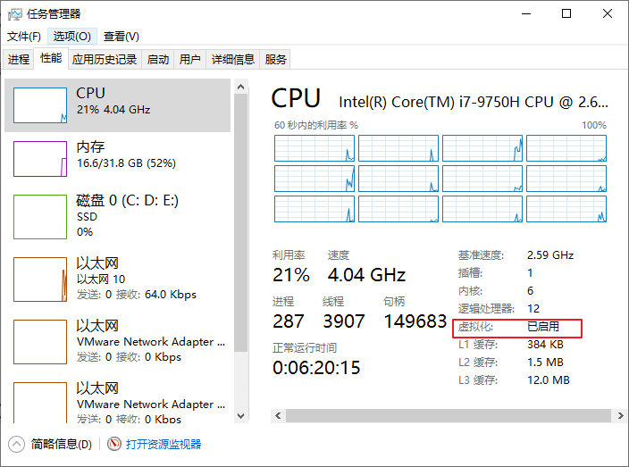

一般电脑都已经开启，如果没有开启，重启电脑，开机时按主板快捷键（联想F2、戴尔F12、华硕F8）进入BIOS，找到“Virtualization Technology”（虚拟化技术），设置为“Enabled”（启用），保存并重启电脑。

### 3.1.2 启用WSL2和虚拟机平台功能

#### 1、检查运行 WSL 2 的环境要求

若要更新到 WSL 2，必须运行 Windows 10+

- 对于 x64 系统：版本 1903 或更高版本，内部版本为 18362.1049 或更高版本。
- 对于 ARM64 系统：版本 2004 或更高版本，内部版本为 19041 或更高版本。

或 Windows 11。

查看系统和处理器类型方式：

1. 按 `Win + R` 打开运行窗口
2. 输入 `msinfo32` 回车

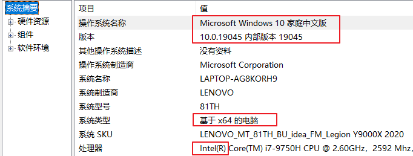

#### 2、启用虚拟机功能

安装 WSL 2 之前，必须启用 **虚拟机平台** 可选功能。 计算机将需要**虚拟化功能**才能使用此功能。以下2种方式，二选一。

**方式一：可视化方式**

在控制面板-程序-启用或关闭Windows功能中勾选适用于Linux的Windows子系统以及虚拟机平台(wsl2需要)

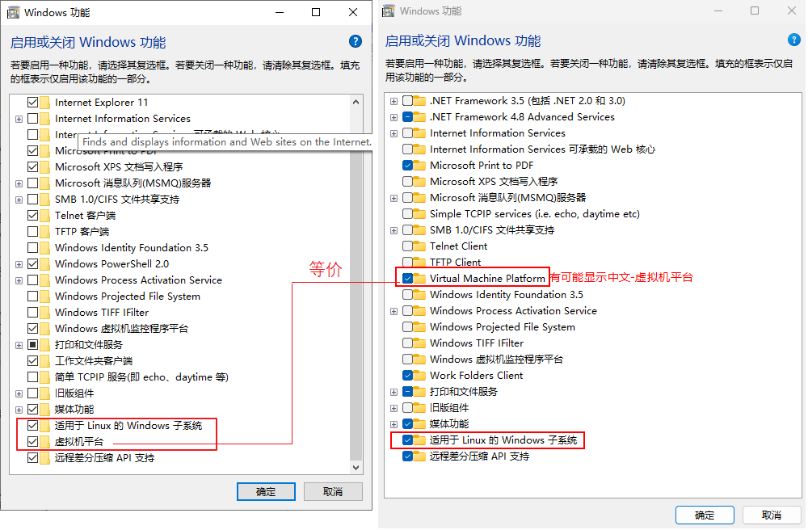

**方式二：命令行方式**

打开 PowerShell（**管理员**）：

```
dism.exe /online /enable-feature /featurename:Microsoft-Windows-Subsystem-Linux /all /norestart
```

```powershell
dism.exe /online /enable-feature /featurename:VirtualMachinePlatform /all /norestart
```

> 完成后：重启电脑（非常重要）

### 3.1.3 更新wsl2内核

#### 1、下载wsl2

如果通过命令更新会非常慢。为了加快速度，直接从github里面下载最新版本。

https://github.com/microsoft/WSL/releases

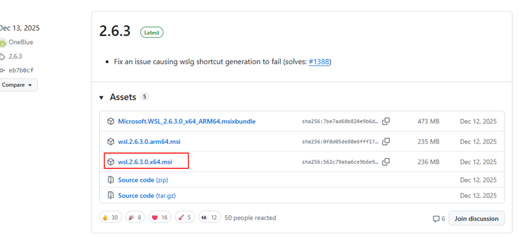

注意：如果是arm架构请选择对应的文件。

#### 2、默认安装

微软新版 WSL2 内核 MSI**硬编码安装路径：`C:\Windows\System32\lxss\`，无法通过命令改安装源路径**。下载完成后，双击直接安装。

#### 3、测试安装结果

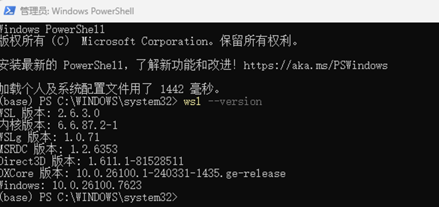

## 3.2 安装Docker

### 3.2.1 下载Docker安装包

访问Docker官方下载页，下载“Docker Desktop for Windows”安装包。

官方下载地址：https://www.docker.com/products/docker-desktop/

### 3.2.2 安装Docker

#### 1、默认安装Docker

如果是默认安装，直接双击下载的安装包，点击“下一步”，安装完成后Docker会自动启动，如果安装的过程中有阻止对host的修改，点击允许。

- 默认安装路径：C:\Program Files\Docker
- 默认数据路径：C:\Users\[你的用户名]\AppData\Local\Docker\wsl\data\ext4.vhdx，**这个 ext4.vhdx = 全部镜像 / 容器 / 数据盘**，docker-desktop-data 整个子系统就封装在这一个文件里。

#### 2、指定路径安装Docker

- 软件安装目录：D:\ProgramFiles\Docker，**Windows 程序文件**（docker.exe、服务、UI 程序，体积小几百 MB）
- 数据目录：D:\ProgramFiles\Docker\wsl-data，**WSL2 虚拟磁盘**（`ext4.vhdx`，所有镜像、容器、数据等，镜像容器越多，体积越大）

以**管理员身份打开 CMD**，进入安装包所在目录执行：

```
start /w "" "Docker Desktop Installer.exe" install --backend=wsl-2 --accept-license --installation-dir="D:\ProgramFiles\Docker" --wsl-default-data-root="D:\ProgramFiles\Docker\wsl-data"
```

参数说明：

- `--installation-dir`：**Docker 主程序安装路径 = D:\ProgramFiles\Docker**（替换默认 C:\Program Files\Docker\Docker）
- `--wsl-default-data-root`：**WSL2 的 docker-desktop-data 虚拟磁盘 (ext4.vhdx) 根目录**，镜像 / 容器 / 卷全存在这里，彻底避免 C 盘膨胀
- `--backend=wsl-2`：强制使用 WSL2 作为运行后端（默认就是 wsl2，显式指定更稳妥）Docker
- `--accept-license`：静默同意协议，安装完不用手动勾选许可

#### 3、安装界面

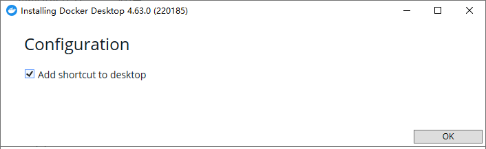

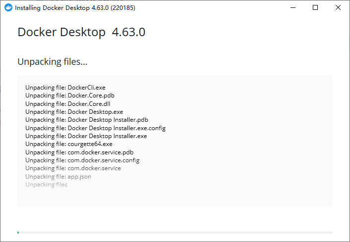

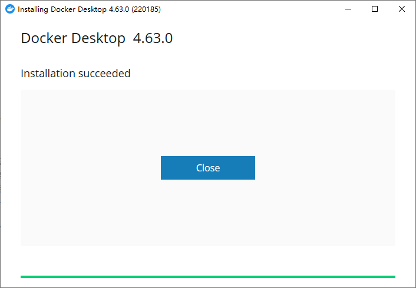


### 3.2.3 验证安装

打开Windows终端（CMD或PowerShell），执行以下两条命令，若均能显示版本号，说明安装成功：

```
docker --version
docker compose version
```

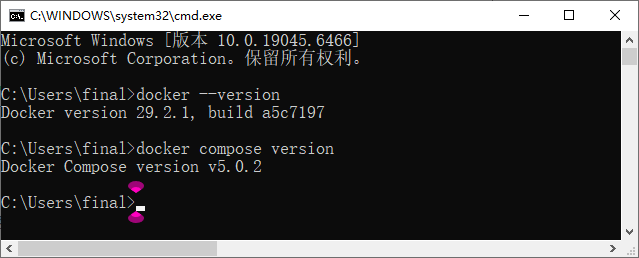

## 3.3 配置Docker镜像源

默认Docker镜像源为国外官方仓库（Docker Hub），下载镜像（如mysql:8.0.45、python:3.12-slim）速度较慢，甚至超时失败，配置国内镜像源（阿里云）可大幅提升下载速度。

第一步：确保Docker已启动，点击右上角“设置”（齿轮图标）。

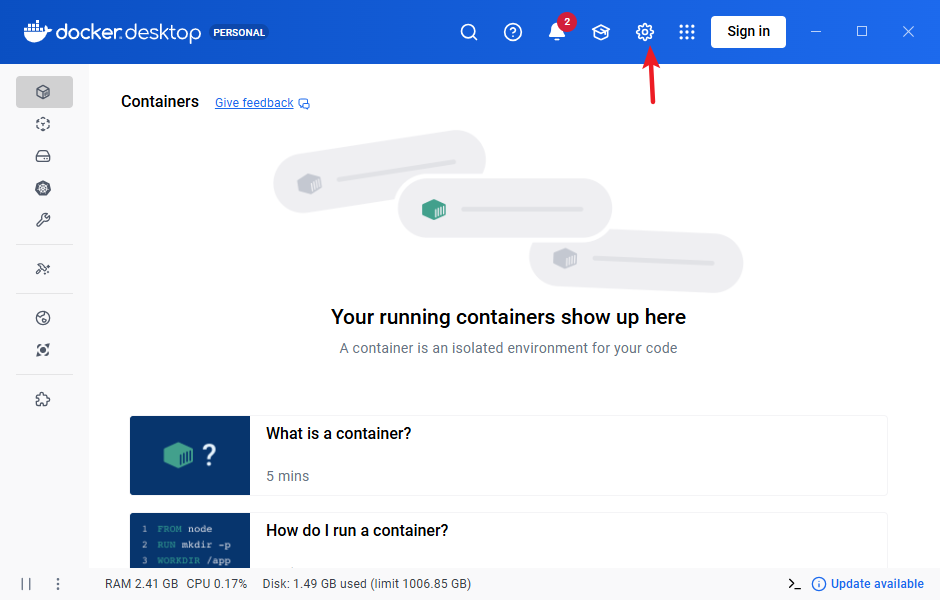

第二步：在左侧菜单找到“Docker Engine”（Docker引擎），点击进入配置页面。

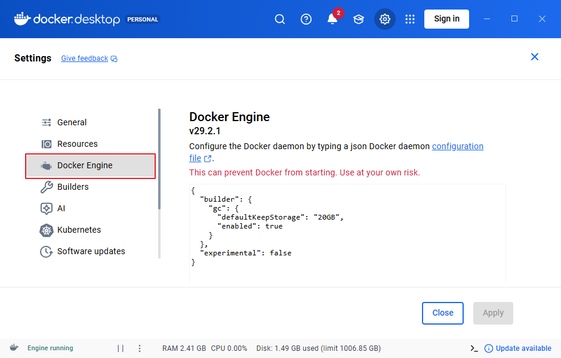

第三步：在配置文件中，找到“registry-mirrors”字段，添加阿里云镜像源（若没有该字段，手动新增），完整配置如下：

```
{
  "builder": {
    "gc": {
      "defaultKeepStorage": "20GB",
      "enabled": true
    }
  },
  "experimental": false,
  "features": {
    "buildkit": true
  },
  "registry-mirrors": [
    "https://docker.xuanyuan.me",
    "https://docker.1ms.run",
    "https://docker.m.daocloud.io"
  ]
}

```

> 如果镜像不稳定，还可以切换成下面的试一下

```
{
  "builder": {
    "gc": {
      "defaultKeepStorage": "20GB",
      "enabled": true
    }
  },
  "experimental": false,
  "features": {
    "buildkit": true
  },
  "registry-mirrors": [
    "https://docker.mirrors.ustc.edu.cn",
    "https://hub-mirror.c.163.com",
    "https://docker.1ms.run"
  ]
}
```


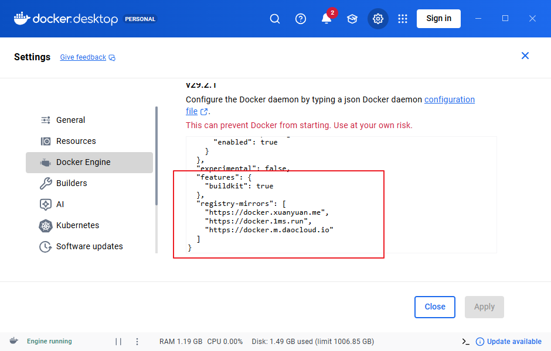

第四步：点击页面右下角“Apply & Restart”（应用并重启），等待Docker重启完成，镜像源配置生效。

## 3.4 卸载

若Docker安装失败、版本不兼容，或无需使用Docker，可按以下步骤彻底卸载，避免残留文件影响后续操作：

第一步：停止Docker服务

找到任务栏右下角的 Docker 鲸鱼图标（可能在隐藏图标里，点 ^ 展开） ，右键点击 → 选择 Quit Docker Desktop / 退出 Docker Desktop ，等待几秒，Docker 就完全停止了

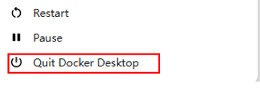

第二步：卸载Docker应用

打开 “控制面板” → “程序” → “卸载”，找到“Docker Desktop”->“卸载”，按提示完成卸载。

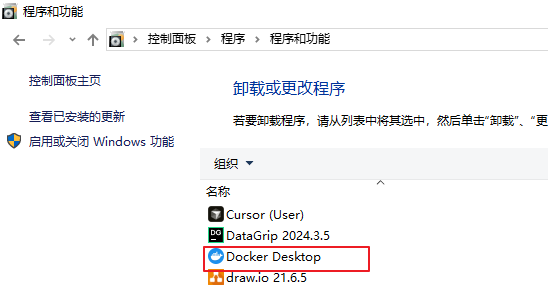

第三步：删除 WSL 2 相关的 Docker 发行版（关键）

以**管理员身份**打开CMD，执行

```
wsl --shutdown

# 查看已安装的 WSL 发行版（会看到 docker-desktop等）
wsl --list --verbose

# 删除 Docker 相关的 WSL 发行版（彻底清理镜像/容器数据）
wsl --unregister docker-desktop
wsl --unregister docker-desktop-data
```

第四步：删除残留文件（可选，彻底清理）

（1）删除用户目录下的Docker残留：删除C:\Users\你的用户名\\.docker，删除整个.docker文件夹；

（2）删除C:\Users\你的用户名\AppData\Local\Docker，docker-secrets-engine（WSL 虚拟磁盘、日志）

（3）删除C:\Program Files\Docker（安装目录残留）

（4）删除 C:\ProgramData\DockerDesktop（日志目录）

（5）如果自定义Docker安装目录的，还要检查安装目录（例如：D:\ProgramFiles\Docker）是否有残余

第五步：验证卸载

终端执行 docker --version，若提示“不是内部或外部命令”，说明卸载成功。

第六步：卸载wsl

（1）右键wsl.2.6.3.0.x64.msi，选择卸载wsl

（2）取消勾选 虚拟机平台

（3）取消勾选 适用于Linux的Windows子系统

# 第四章 基础案例：Docker中拉取MySQL

原来我们自己在windows上安装的MySQL，现在MySQL从Docker镜像下载。

基础案例适合初学者理解“镜像→容器→连接”的核心流程，手动操作、步骤简单，无需复杂工具，重点掌握“下载镜像→启动容器→本地连接”的逻辑。

## 4.1 下载并启动MySQL 8.0.45容器

### 4.1.1 下载MySQL 8.0.45镜像源

 从Docker Hub下载MySQL 8.0.45镜像（已配置国内镜像源，速度更快）

以**管理员身份**打开CMD，执行

```shell
docker pull mysql:8.0.45
```

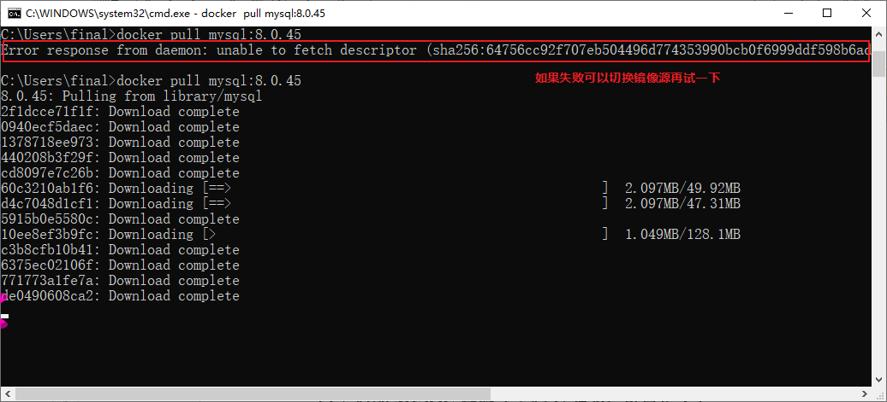

### 4.1.2 查看已下载好的镜像

以**管理员身份**打开CMD，执行

```
docker images
```

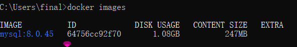

### 4.1.3 启动MySQL容器

以**管理员身份**打开CMD，执行

```
docker run -d --name mysql-db -p 9999:3306 -e MYSQL_ROOT_PASSWORD=123456 -v D:/ProgramFiles/Docker/mysql:/var/lib/mysql --user 999:999 mysql:8.0.45
```

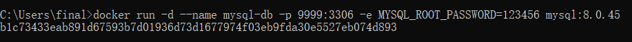

命令说明

- docker run   创建并启动一个Docker
- -d 后台运行（detach），不占用当前终端
- --name mysql-db 给容器命名为mysql-db，自定义名称，方便后续操作，不加会生成随机名
  - `docker start mysql-db`：启动容器
  - `docker stop mysql-db`：停止容器

- -p 9999:3306 端口映射：主机9999端口→容器内3306端口，左边是电脑本机端口，右边是容器内端口；本机端口可改
- -e MYSQL_ROOT_PASSWORD=123456  设置 MySQLroot用户的密码为123456 （密码自己定），MySQL镜像必须设置这个变量，否则容器启动失败；
- -v D:/ProgramFiles/Docker/mysql:/var/lib/mysql（如果路径中有空格需要用引号-v "D:/Program Files/Docker/mysql/data1:/var/lib/mysql" ）表示设置MySQL数据目录，如果不设置，默认目录在 Docker 管理的目录中（Windows 下通常在 \\wsl$\docker-desktop-data\... 或虚拟机磁盘里）
- --user 999:999 ：Windows 目录挂载到 Linux 容器可能有权限问题，MySQL 需要 999 用户的写入权限。
- mysql:8.0.45 要运行的MySQL镜像名

### 4.1.4 查看容器

以**管理员身份**打开CMD，执行

```
docker ps
```

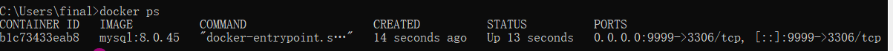

### 4.1.5 删除容器

以**管理员身份**打开CMD，执行

```
docker stop mysql-db && docker rm mysql-db
```


## 4.2 测试连接docker中的mysql

### 4.2.1 windows本机连接

以**管理员身份**打开CMD，执行

```
mysql -hlocalhost -P9999 -uroot -p
Enter password: ******
```

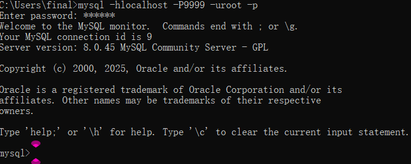

### 4.2.2 navicat连接

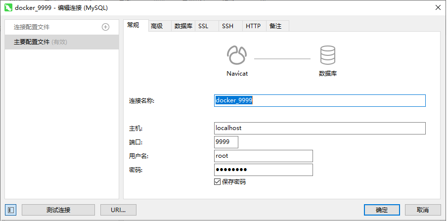

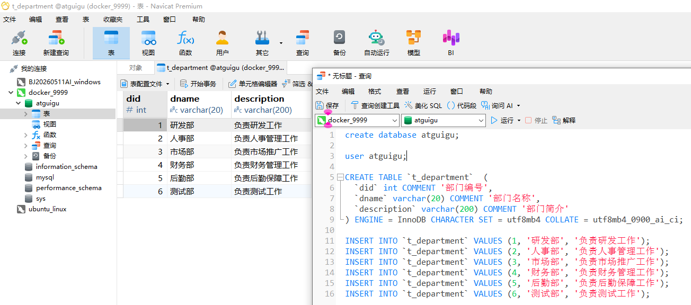

### 4.2.3 python代码连接

> 在pycharm中进行如下操作

步骤一：确保本地已经有python环境以及安装了pymysql及其依赖的相关库

```
pip install pymysql
```

注意：如果连接提示缺少cryptography，新版**MySQL 使用了 `caching_sha2_password` 加密方式登录，而 `pymysql` 需要安装 `cryptography` 库才能支持这种加密登录**。

```
pip install cryptography 
```

步骤二：编写Python连接脚本

```python
import pymysql
def get_connection():
    conn_params = {
        "host": "localhost",  # 本地数据库写localhost，远程写服务器IP。
        "port": 9999,  # # 映射后的端口
        "user": "root",  # 通过哪个MySQL用户名进行登录
        "password": "123456",
        "database": "atguigu"  # 要连接的具体数据库，等价于 use 数据名
    } #这里的key是固定
    try:
        conn = pymysql.connect(**conn_params) # **解包传参，会把字典中的每一对(key,value)按照关键字传参的方式给connect方法
        if conn:
            print("pymysql连接成功")
            return conn
    except:
        print("pymysql连接失败")

def select_department(conn):
    my_cursor = conn.cursor()
    sql = "select * from t_department"
    row_number = my_cursor.execute(sql)
    print(f"一共返回了{row_number}行记录")
    print("每一行的数据：")
    rows = my_cursor.fetchall()
    for row in rows:
        print(row)

#测试
if __name__ == "__main__":
    conn = get_connection()
    select_department(conn) #查询
    conn.close()
```


# 第五章 进阶案例：Docker中Python容器连接MySQL容器

## 5.1 核心工具

### 5.1.1 Dockerfile —自定义镜像的“构建脚本”

定义：Dockerfile是一个纯文本文件（无后缀名），包含一系列简单的指令，用于告诉Docker“如何构建自定义镜像”。

核心作用：解决“环境配置繁琐、版本不一致”的问题。比如我们需要一个“包含Python 3.12+pymysql依赖+自定义脚本”的镜像，无需手动安装Python和依赖，只要编写Dockerfile，执行一条命令，Docker就会自动构建出符合需求的镜像。

实操关联：后续我们会编写Dockerfile，构建一个包含Python环境和连接脚本的镜像，用于和MySQL容器联动。

### 5.1.2 Docker Compose —多容器的“一键管理工具”

定义：Docker Compose是一个用于管理多容器的工具，通过一个yaml格式的配置文件（固定命名为docker-compose.yml），定义多个关联容器的配置（比如镜像、端口、依赖关系），执行一条命令就能一键启动、停止所有容器。

YAML 是一种人类可读的**数据序列化格式**，一种比 JSON、XML 更容易阅读和书写的“数据记录方式”。**配置文件**：Docker Compose、Kubernetes、Ansible、GitHub Actions 都用它。YAML 对**缩进**极度敏感。如果该对齐的没对齐，程序就会报错。建议统一用 **2 个空格** 缩进，避免使用 Tab。

**YAML 写法：**（文件后缀名**`.yaml`** 或 **`.yml`**）

```yaml
name: 张三
age: 25
hobbies:
  - 读书
  - 跑步
  - 写代码
# 这是注释，很好用
```

核心作用：简化多容器部署。比如我们需要同时启动MySQL容器和Python容器，且Python容器要依赖MySQL容器（先启动MySQL，再启动Python），无需手动逐个启动，用Docker Compose一键搞定。

实操关联：后续我们会编写docker-compose.yml，配置MySQL（8.0.45）和Python两个容器，实现一键启动和联动。

> 如果需要将多个 Docker 主机组成一个 “集群”，就需要Docker Swarm（官方）、Kubernetes（K8s，非官方，但也是主流的）等容器编排工具。

## 5.2 实践步骤

### 5.2.1 新建项目目录

例如新建一个文件夹，命名为"docker-python-mysql"（名称可自定义，后续命令对应即可）。

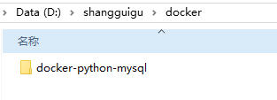

### 5.2.2 编写Dockerfile（构建Python自定义镜像）

进入docker-python-mysql目录，新建一个文本文件，删除后缀名（确保文件名为“Dockerfile”，无.txt等扩展名），复制以下代码

```shell
# 1. 指定基础镜像：Python 3.12（稳定版，兼容性好）
FROM python:3.12

# 2. 设置容器内的工作目录，用于存放脚本和依赖
WORKDIR /app

# 3. 复制本地项目目录下的所有文件（test_mysql.py脚本文件、Dockerfile构建脚本文件等），到容器的/app目录
COPY . /app

# 4. 安装Python依赖（pymysql），使用清华源加速下载，避免超时（初学者无需修改）
RUN pip install --upgrade pip -i https://pypi.tuna.tsinghua.edu.cn/simple
RUN pip install pymysql cryptography -i https://pypi.tuna.tsinghua.edu.cn/simple

# 5. 容器启动时，自动执行的命令：运行Python连接脚本
CMD ["python", "test_mysql.py"]
```

💡 关键理解：通过以上指令，Docker会自动构建一个包含Python 3.12、pymysql依赖的镜像，无需我们手动安装Python环境。

### 5.2.3 编写docker-compose.yml（配置多容器）

在docker-python-mysql目录下，新建一个文本文件，命名为docker-compose.yml（后缀为yml，不能错），复制以下代码

```shell
# 核心功能：一键启动MySQL容器+Python应用容器，实现容器间通信、数据持久化

services:
  # 容器1：MySQL服务容器
  mysql-db2: #因为上一个案例中已经有一个MySQL服务容器叫做mysql-db，所以这里为了区分取个不同的容器名称
    # 基础镜像：指定MySQL 8.0.45版本（稳定性高，适配Python连接）
    image: mysql:8.0.45
    # 重启策略：容器意外关闭/服务器重启时，自动重启（保证服务可用性）
    restart: always
    # 环境变量：配置MySQL核心参数
    environment:
      MYSQL_ROOT_PASSWORD: "123456"  # root用户密码
      MYSQL_DATABASE: "test_db"      # 自动创建初始测试数据库
    # 端口映射：本地8888端口 → 容器内3306端口（避免与本地MySQL端口冲突）
    ports:
      - "8888:3306"
    # 数据卷挂载：Windows本地D盘mysql-data目录 → 容器内MySQL数据目录（持久化数据）
    # 否则数据存储在 Docker 管理的目录中（Windows 下通常在 \\wsl$\docker-desktop-data\... 或虚拟机磁盘里）
    # 该数据卷中如果已经有数据，那么将复用之前的数据
    volumes:
      - D:/ProgramFiles/Docker/mysql:/var/lib/mysql
    # 加入自定义网络：与Python容器互通（容器间通信的基础）
    networks:
      - app-network
    # 健康检查：判断MySQL服务是否真正就绪（而非仅容器启动），解决连接拒绝问题
    healthcheck:
      test: ["CMD", "mysqladmin", "ping", "-h", "localhost", "-uroot", "-p123456"]  # 检测MySQL是否可ping通
      interval: 3s          # 每3秒检查一次
      timeout: 3s           # 单次检查超时时间3秒
      retries: 10           # 最多重试10次（覆盖MySQL启动初始化时间）
      start_period: 5s      # 容器启动后，延迟5秒再开始检查（避免过早检测）

  # 容器2：Python应用容器
  python-app:
    # 构建规则：基于当前目录下的Dockerfile，构建自定义Python镜像
    build: .
    # 依赖条件：等待mysql-db2容器的健康检查通过后，再启动本容器（核心修复：解决MySQL未就绪问题）
    depends_on:
      mysql-db2:
        condition: service_healthy  # 仅当MySQL服务就绪时，才启动Python容器
    # 环境变量：传递MySQL连接信息（Python代码可通过os.getenv获取，无需硬编码）
    environment:
      MYSQL_HOST: "mysql-db2"    # 容器间通信地址：直接填MySQL容器名（无需IP）
      MYSQL_PORT: "3306"        # MySQL容器内端口（非本地8888）
      MYSQL_USER: "root"        # 与MySQL容器的用户名一致
      MYSQL_PASSWORD: "123456"  # 与MySQL容器的密码一致（修改需同步）
      MYSQL_DB: "test_db"       # 与MySQL容器自动创建的数据库名一致
    # 加入自定义网络：与MySQL容器在同一网络，才能通信
    networks:
      - app-network

# 自定义网络：桥接模式（Docker默认），保证两个容器相互可见、可访问
networks:
  app-network:
    driver: bridge

```

💡 关键提醒MySQL密码为123456，可自定义修改，但需同步修改Python容器的MYSQL_PASSWORD，否则连接失败。

### 5.2.4 编写test_mysql.py

```python
import pymysql
import os

# 连接MySQL（参数与启动容器时一致）
# 请看容器2：Python应用容器中环境变量的名
conn = pymysql.connect(
    host=os.getenv('MYSQL_HOST', 'localhost'),
    port=(int)(os.getenv('MYSQL_PORT', '3306')),
    user=os.getenv('MYSQL_USER', 'root'),
    password=os.getenv('MYSQL_PASSWORD', ''),
    database=os.getenv('MYSQL_DB', 'mysql')
)

cursor = conn.cursor()
# 测试连接：查询MySQL版本
cursor.execute("SELECT VERSION()")
print(f"MySQL版本：{cursor.fetchone()}")

# 关闭连接
cursor.close()
conn.close()
print("基础版：Python连接MySQL（8.0.45）成功！")
```

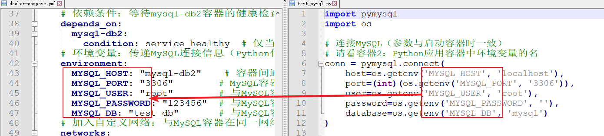

### 5.2.5 验证

打开Windows命令行终端，进入docker-python-mysql目录，执行以下命令（可直接复制，按需求选择）

```shell
# 1.一键启动所有容器（后台运行，首次执行会自动构建Python镜像、下载MySQL镜像）
docker compose up -d

# 2. 查看所有容器的运行状态（看不到python-app容器是因为执行脚本任务完成之后它就结束了）
docker compose ps

# 3. 查看Python容器的运行日志（验证Python是否成功连接MySQL）
docker compose logs python-app
```

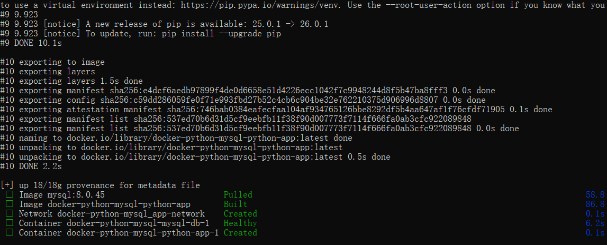

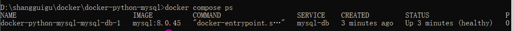


如果启动失败，可以尝试其他命令（根据需要选择使用）。

```shell
# 1. 停止并删除所有容器（数据保留，下次启动可恢复）
docker compose down

# 2. 重新构建Python镜像，并启动所有容器（修改Dockerfile后需执行）
docker compose up -d --build

# 3. 彻底清理旧资源（关键：避免缓存干扰） 删除所有镜像
docker compose down --rmi all && docker system prune -af
```


# 第六章 在Ubuntu上安装Docker

## 6.1 卸载Docker（适用deb文件安装方式）

第一步：停止 Docker 相关服务

卸载前先停掉 Docker 的运行服务，避免进程占用导致卸载失败：

```bash
sudo systemctl stop docker
sudo systemctl stop docker.socket
sudo systemctl disable docker docker.socket  # 顺带取消开机自启，可选但建议执行
```

如果提示`Unit docker.service could not be found`，说明 Docker 服务未启动 / 未注册，直接跳过这步即可。

第二步：卸载 Docker 主程序及相关组件

通过 deb 包安装的 Docker，核心组件包括`docker-ce`、`docker-ce-cli`、`containerd.io`、`docker-buildx-plugin`、`docker-compose-plugin`（这些是官方 deb 包的标准组件），执行以下命令一键卸载**已安装的 Docker 相关包**：

```bash
sudo apt-get purge -y docker-ce docker-ce-cli containerd.io docker-buildx-plugin docker-compose-plugin docker-ce-rootless-extras
```

- `purge` 比普通的`remove`更彻底：不仅删除程序文件，还会删除**配置文件**（关键，避免残留配置影响后续重装）；
- `-y` 表示自动确认卸载，无需手动输入 y。

第三步：清理 Docker 的依赖包

卸载主程序后，会留下一些 Docker 的依赖包（无其他程序使用），执行以下命令自动清理：

```bash
sudo apt-get autoremove -y --purge
```

- `autoremove` 清理无用依赖，`--purge` 连带清理这些依赖的配置文件。

第四步：删除 Docker 残留的目录和数据（谨慎）

deb 包卸载不会自动删除 Docker 的**镜像、容器、卷、配置残留目录**，如果需要彻底清理（后续重装想从零开始），执行以下命令删除所有残留：

```bash
sudo rm -rf /var/lib/docker
sudo rm -rf /var/lib/containerd
sudo rm -rf /etc/docker
sudo rm -rf ~/.docker  # 用户目录下的Docker配置，如登录信息、本地配置
```

> 注意：**/var/lib/docker** 目录存储了所有 Docker 镜像、容器、卷数据，删除后**数据无法恢复**，如果需要保留数据，跳过这步即可。

第五步：验证是否彻底卸载

执行以下命令，若均无输出 / 提示`command not found`，说明卸载成功：

```bash
# 检查docker命令是否存在
docker --version
# 检查containerd是否存在
containerd --version
# 检查docker相关进程
ps -ef | grep docker
ps -ef | grep containerd
```

如果有残留进程，执行`sudo kill -9 进程号`强制杀死即可。

## 6.2 安装Docker

提示：如果有旧版本先卸载

安装步骤：参考docker官网https://docs.docker.com/engine/install/ubuntu/#install-using-the-repository 

### 6.2.1 下载Docker的deb文件

步骤一：打开网页[`https://download.docker.com/linux/ubuntu/dists/`](https://download.docker.com/linux/ubuntu/dists/?_gl=1*20y7a2*_gcl_au*NDQ2NzczMDM2LjE3Njk3NDEwMTU.*_ga*MTIzNTE4MjAzMy4xNzY5NzQxMDE2*_ga_XJWPQMJYHQ*czE3Njk5MjcyNzIkbzIkZzEkdDE3Njk5Mjc1ODUkajM1JGwwJGgw)

步骤二：选择你的Ubuntu版本，例如：`jammy`

步骤三：前往 pool/stable/ 目录，然后选择适用的架构（amd64、armhf、arm64 或 s390x）。例如：https://download.docker.com/linux/ubuntu/dists/jammy/pool/stable/amd64/

步骤四：下载以下 Docker 引擎、CLI、containerd 和 Docker Compose 软件包的 deb 文件。

- Docker引擎：`docker-ce_<version>_<arch>.deb`
- 命令行工具：`docker-ce-cli_<version>_<arch>.deb`
- 容器运行时：`containerd.io_<version>_<arch>.deb`
- 构建工具：`docker-buildx-plugin_<version>_<arch>.deb`
- Compose插件：`docker-compose-plugin_<version>_<arch>.deb`

例如：

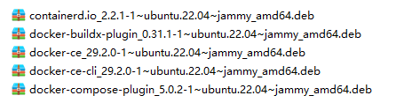

| 组件                      | 角色                     | 类比         | 是否必需     |
| :------------------------ | :----------------------- | :----------- | :----------- |
| **docker-ce-cli**         | 客户端/命令行            | 汽车方向盘   | 必需（控制） |
| **docker-ce**             | 服务端/引擎              | 汽车发动机   | 必需（运行） |
| **containerd.io**         | 底层运行时               | 传动系统     | 必需（默认） |
| **docker-buildx-plugin**  | 多平台构建和高级构建功能 | 多功能工具包 | 可选但推荐   |
| **docker-compose-plugin** | 编排工具                 | 车队调度系统 | 可选但常用   |

### 6.2.2 安装Docker的deb文件

步骤1：将docker的所有beb文件放到一个docker的目录中

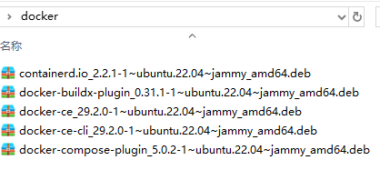

步骤2：使用xftp8工具将docker目录上传到ubuntu的用户目录下

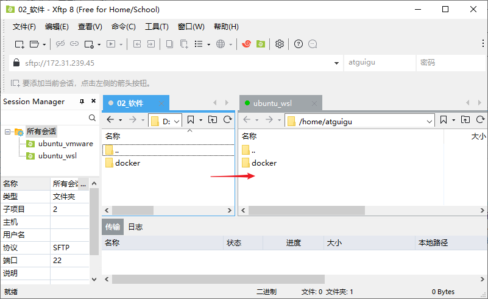

步骤3：将其移动到/opt/software目录

要是没有software目录先创建

```
sudo mkdir /opt/software
```

将docker目录移动到/opt/software目录

```bash
sudo mv /home/atguigu/docker /opt/software
```

步骤4：进入/opt/software/docker目录

```bash
cd /opt/software/docker
```

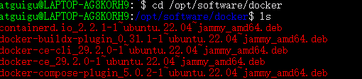

步骤5：安装docker

```bash
# 命令格式
sudo dpkg -i ./containerd.io_<version>_<arch>.deb \
  ./docker-ce_<version>_<arch>.deb \
  ./docker-ce-cli_<version>_<arch>.deb \
  ./docker-buildx-plugin_<version>_<arch>.deb \
  ./docker-compose-plugin_<version>_<arch>.deb
```

根据我们下载的deb文件，命令如下：

```bash
# 例如
sudo dpkg -i ./containerd.io_2.2.1-1~ubuntu.22.04~jammy_amd64.deb \
  ./docker-ce_29.2.0-1~ubuntu.22.04~jammy_amd64.deb \
  ./docker-ce-cli_29.2.0-1~ubuntu.22.04~jammy_amd64.deb \
  ./docker-buildx-plugin_0.31.1-1~ubuntu.22.04~jammy_amd64.deb \
  ./docker-compose-plugin_5.0.2-1~ubuntu.22.04~jammy_amd64.deb
```

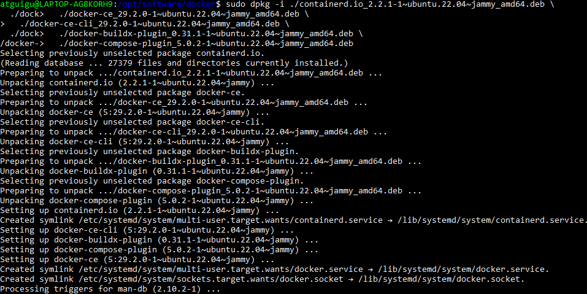

步骤6：查看状态

Docker 服务在安装后会自动启动。要验证 Docker 是否正在运行，请使用：

```bash
sudo systemctl status docker
```

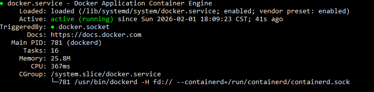

## 6.3 配置国内 Docker 镜像源

docker的使用过程中，需要从远程仓库下载镜像，但是默认为国外网站，所以在下载时可能会出现下载连接超时导致下载失败，因此需要为其配置镜像加速器，以提高下载速度。

### 6.3.1 国内配置的镜像地址

受目前网络环境影响，其它加速器可能暂时不能使用，参考下面网站推荐的加速器地址：

https://www.coderjia.cn/archives/dba3f94c-a021-468a-8ac6-e840f85867ea

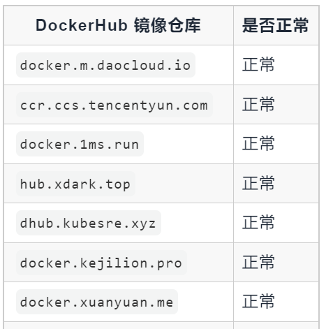

### 6.3.2 配置过程

步骤 1：编辑 Docker 镜像源配置文件

创建 / 修改`daemon.json`配置文件（Docker 的核心配置文件）：

```bash
sudo vim /etc/docker/daemon.json
```

如果提示文件不存在，直接新建即可，vim 中按`i`进入编辑模式，粘贴以下配置（推荐**阿里云镜像源**，也可以用网易 / 清华源）：

```json
{
    "registry-mirrors": [
    	"https://docker.m.daocloud.io",
        "https://docker.1ms.run",
        "https://docker.xuanyuan.me",
        "https://ccr.ccs.tencentyun.com"
    ]
}
```

步骤 2：保存配置并重启 Docker 服务

1. vim 中按`Esc`，输入`:wq`回车保存并退出；
2. 重启 Docker 守护进程，让配置生效：

```bash
sudo systemctl daemon-reload
sudo systemctl restart docker
```

步骤 3：验证镜像源是否配置成功

执行以下命令，查看输出中`Registry Mirrors`是否是你配置的国内源：

```bash
sudo docker info
```

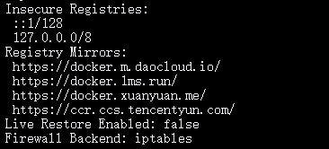

### 6.3.3 执行 hello-world 命令

通过运行 hello-world 镜像来验证安装是否成功。此命令会下载一个测试镜像并在容器中运行它。当容器运行时，它会打印一条确认消息然后退出。

```bash
sudo docker run hello-world
```

1. 首先 Docker 会提示`Unable to find image 'hello-world:latest' locally`（正常，本地确实还没有）；

2. 紧接着会从你配置的国内镜像源快速拉取，出现类似这样的拉取日志：

   ```
   latest: Pulling from library/hello-world
   719385e32844: Pull complete 
   Digest: sha256:xxxxxxx（一串哈希值）
   Status: Downloaded newer image for hello-world:latest
   ```

3. 最后直接打印出 **`Hello from Docker!`** 开头的完整成功提示，说明 Docker 环境彻底正常了。

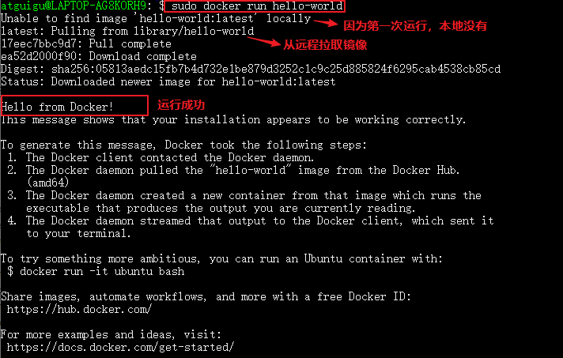

执行后如果看到屏幕打印出 **`Hello from Docker!`** 开头的一大段文字，就说明：

1. Docker 镜像源配置生效 ✅
2. Docker 拉取镜像功能正常 ✅
3. Docker 创建并运行容器功能正常 ✅
4. 你的 Docker 环境完全可用 ✅

## 6.4 设置免sudo运行Docker命令

执行后无需每次用 `sudo` 就能运行 Docker 命令，解决普通用户默认无权限操作 Docker 的问题。

```
# 4. 免sudo运行
sudo usermod -aG docker $USER
```

注意：执行完此步后，`请关闭当前终端并重新连接，配置才会生效`。


# 第七章 Windows环境移植到Ubuntu

## 7.1 准备工作

1、停止并删除容器

在Windows终端进入docker-python-mysql目录

```
docker compose down
```


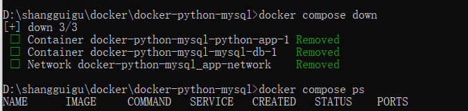

2、确认 Windows 的核心文件 / 目录

确认 docker-python-mysql目录包含以下文件（后续需上传到 Ubuntu）

```
docker-compose.yml（容器配置文件）
test_mysql.py（Python 连接脚本，可选）
Dockerfile（可选，离线同步式无需）
```

## 7.2 方式一：在线下载式（简单，推荐网络良好场景）

1、上传文件

将 Windows下的docker-python-mysql目录（包含docker-compose.yml等核心文件）上传到Ubuntu 的/home/你的用户名/docker-python-mysql目录下。

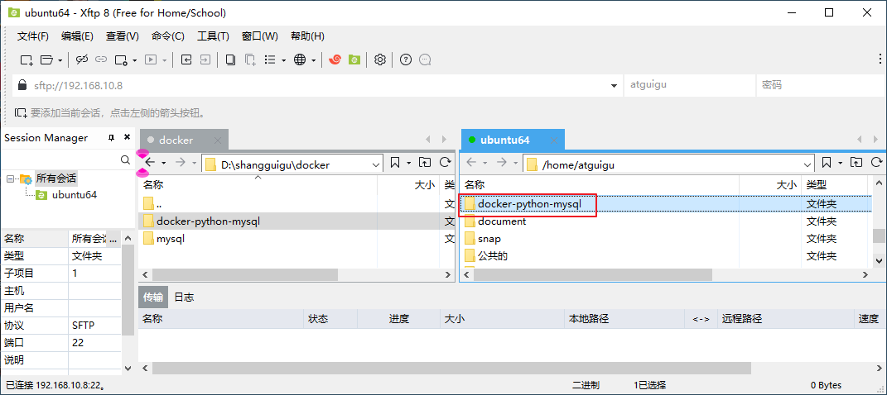

2、将用户目录下的docker-python-mysql移动到/opt/software目录下

```shell
sudo mv docker-python-mysql /opt/software
```

3、修改Ubuntu上的docker-compose.yml配置文件

```shell
cd /opt/software/docker-python-mysql
sudo vim docker-compose.yml
```

修改docker-compose.yml的MySQL数据卷路径（适配Ubuntu）

```yml
 volumes:
   - /opt/data/mysql-data:/var/lib/mysql
```

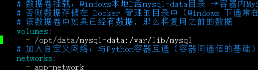

4、手动创建/opt/data/mysql-data目录

```shell
sudo mkdir -p /opt/data/mysql-data2
```

5、一键启动所有容器

一键启动所有容器（自动下载MySQL镜像、构建Python镜像）

```
sudo docker compose up -d
```

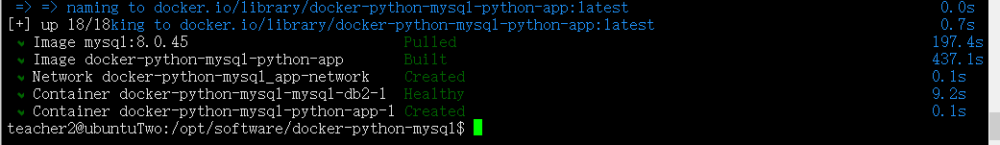

5、验证移植成功

```shell
sudo docker compose logs python-app
# 看到“连接成功”和测试数据，说明移植完成
```

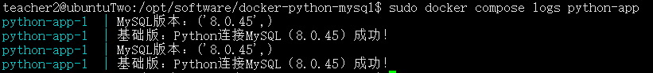

## 7.3 方式二：离线同步式（无网络可用，环境 100% 一致）

1、查看 Windows本地镜像（确认需要打包的镜像）

在Windows终端进入docker-python-mysql目录

```
docker images
```

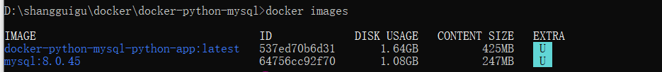

2、打包 MySQL 8.0.45 镜像（离线文件）

在Windows终端进入docker-python-mysql目录

```
docker save 【mysql镜像名】 -o ./mysql-8.0.45.tar
```

例如：

```
docker save mysql:8.0.45 -o ./mysql-8.0.45.tar
```

3、打包自定义 Python 镜像（关键）

```
docker save 【Python镜像名】 -o ./python-app.tar
```

例如：

```
docker save docker-python-mysql-python-app:latest -o ./python-app.tar
```

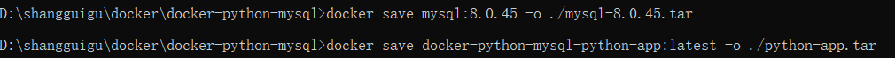

4、准备同步文件清单（需上传到 Ubuntu）

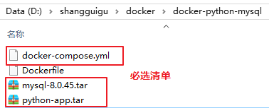

5、上传所有文件到 Ubuntu

将Windows的`docker-python-mysql`目录（含镜像包 + 配置）上传到Ubuntu的`/home/你的用户名/docker-python-mysql`

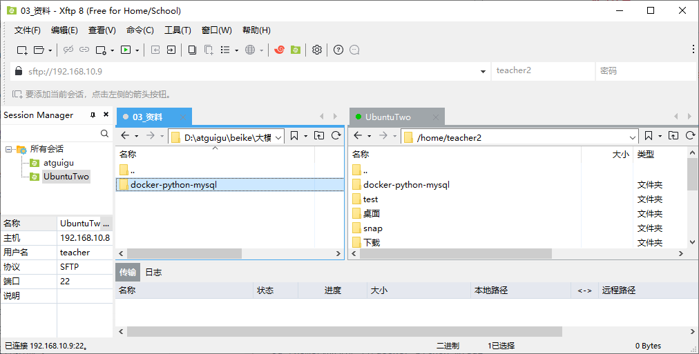

6、将用户目录下的docker-python-mysql移动到/opt/software目录下

```shell
sudo mv docker-python-mysql /opt/software
```

7、修改Ubuntu上的docker-compose.yml配置文件

```shell
cd /opt/software/docker-python-mysql
sudo vim docker-compose.yml
```

修改docker-compose.yml的MySQL数据卷路径（适配Ubuntu）

```yml
 volumes:
   - /opt/data/mysql-data:/var/lib/mysql
```


8、手动创建/opt/data/mysql-data目录

```shell
sudo mkdir -p /opt/data/mysql-data
```

9、Ubuntu 离线导入镜像

```shell
# 1. 进入项目目录
cd /opt/software/docker-python-mysql

# 2. 导入MySQL镜像（离线，无需联网）
docker load -i ./mysql-8.0.45.tar

# 3. 导入Python自定义镜像（离线）
docker load -i ./python-app.tar

# 4. 验证镜像导入成功（能看到这两个新镜像和其他镜像）
docker images
```

10、启动所有容器（全程离线，无需下载/构建）

```shell
sudo docker compose up -d
```

11、验证运行结果

```
docker compose ps  # 查看容器状态

docker compose logs python-app  # 查看Python连接日志
```

# 第八章 常见问题（供自己排查）

实操过程中，初学者容易遇到以下问题，对应解决方法直接复制执行即可，无需复杂操作。

> 1、Win11启动Docker失败，提示“WSL2未配置”？

解决：重新执行“Win11下Docker安装”的“安装前准备”步骤，确保虚拟化开启、WSL2功能和内核已安装，重启电脑后再启动Docker。

> 2、Python连接MySQL失败，提示“Connection refused”（连接被拒绝）？

解决：检查MySQL容器是否启动，执行docker compose ps 或docker ps，确保容器状态为“Up”；

> 3、Docker Compose启动失败，提示“yaml格式错误”？

解决：检查docker-compose.yml的缩进（必须用空格，不能用Tab），确保冒号后加空格，所有引号都是英文引号，配置项对齐规范。

> 4、Ubuntu下执行docker命令，提示“权限不足”（Permission denied）？

解决：加sudo或执行以下命令，给当前用户赋予Docker权限，注销Ubuntu后重新登录即可：

```
sudo usermod -aG docker $USER
```

# 第 九 章 附录：Docker常用命令

## 9.1 容器管理常用命令

| 命令                            | 作用                              | 示例                                                         |
| ------------------------------- | --------------------------------- | ------------------------------------------------------------ |
| docker run [参数] <镜像名>      | 创建并启动容器（最核心）          | docker run -d --name mysql-db -p 3306:3306 -e  MYSQL_ROOT_PASSWORD=123456 mysql:8.0.26 |
| docker ps                       | 查看正在运行的容器                | docker ps                                                    |
| docker ps -a                    | 查看所有容器（含已停止）          | docker ps -a   或 docker ps -n 5  # 显示最近5个容器          |
| docker start <容器名/容器ID>    | 启动已停止的容器                  | docker start mysql-db                                        |
| docker stop <容器名/容器ID>     | 停止运行中的容器（优雅停止）      | docker stop mysql-db                                         |
| docker restart <容器名/容器ID>  | 重启容器                          | docker restart mysql-db                                      |
| docker rm <容器名/容器ID>       | 删除已停止的容器                  | docker rm mysql-db                                           |
| docker rm -f <容器名/容器ID>    | 强制删除运行中的容器              | docker rm -f mysql-db                                        |
| docker rm -f $(docker ps -aq)   | 强制删除所有容器（慎用）          | -                                                            |
| docker exec -it <容器名> <命令> | 进入容器交互终端（最常用）        | docker exec -it mysql-db bash（进容器）  docker exec -it mysql-db mysql -uroot -p（直接进 MySQL） |
| docker logs <容器名>            | 查看容器日志                      | docker logs mysql-db（实时）  docker logs -f mysql-db（实时跟踪） |
| docker inspect <容器名/镜像名>  | 查看容器 / 镜像详细信息（排障用） | docker inspect mysql-db                                      |

例如：

```shell
docker ps -a  #查看所有容器
docker stop docker-python-mysql-mysql-db2-1  #停止docker-python-mysql-mysql-db2-1容器

docker rm docker-python-mysql-mysql-db2-1  #删除docker-python-mysql-mysql-db2-1容器
docker rm docker-python-mysql-python-app-1  #删除docker-python-mysql-python-app-1容器
```


## 9.2 镜像管理常用命令

| 命令                                     | 作用                             | 示例                                                |
| ---------------------------------------- | -------------------------------- | --------------------------------------------------- |
| docker pull <镜像名:版本>                | 拉取镜像（版本不写默认  latest） | docker pull mysql:8.0.26                            |
| docker images                            | 查看本地所有镜像                 | docker images（精简）  docker images -a（含中间层） |
| docker rmi <镜像ID/镜像名>               | 删除单个镜像                     | docker rmi mysql:8.0.26                             |
| docker rmi -f $(docker images -q)        | 强制删除所有本地镜像（慎用）     | -                                                   |
| docker search <关键词>                   | 搜索 Docker  Hub 镜像            | docker search mysql                                 |
| docker build -t <自定义镜像名:版本> .    | 基于  Dockerfile 构建镜像        | docker build -t my-app:1.0 .                        |
| docker save -o <保存文件名.tar> <镜像名> | 导出镜像为压缩包（离线传输）     | docker save -o mysql8.tar mysql:8.0.26              |
| docker load -i <压缩包.tar>              | 导入本地镜像压缩包               | docker load -i mysql8.tar                           |

```shell
docker images    #查看本地所有镜像
docker rmi docker-python-mysql-python-app:latest #删除docker-python-mysql-python-app:latest镜像
docker rmi mysql:8.0.45 #删除mysql:8.0.45镜像
```

## 9.3 docker compose常用命令

| **分类** | **命令**                                                  | **作用**                                                     | **教程适配示例**                                             |
| -------- | --------------------------------------------------------- | ------------------------------------------------------------ | ------------------------------------------------------------ |
| 核心启动 | docker compose up -d                                      | 后台启动项目：自动下载  / 构建镜像、创建容器、启动服务，处理依赖 | docker compose up -d（启动 MySQL+Python）                    |
| 核心启动 | docker compose up -d mysql-db                             | 后台仅启动指定服务（如  MySQL）                              | docker compose up -d mysql-db（仅启动 MySQL）                |
| 核心启动 | docker compose up python-app                              | 前台启动指定服务（如  Python），实时输出日志                 | docker compose up python-app（前台运行 Python 脚本）         |
| 停止管理 | docker compose stop                                       | 停止所有运行中的服务（保留容器）                             | docker compose stop（停止 MySQL+Python）                     |
| 停止管理 | docker compose stop mysql-db                              | 仅停止指定服务（如  MySQL）                                  | docker compose stop mysql-db（仅停止 MySQL）                 |
| 停止管理 | docker compose down                                       | 停止并删除容器 + 自定义网络，保留镜像和数据卷                | docker compose down（停止项目，保留数据）                    |
| 状态查看 | docker compose ps                                         | 查看运行中的容器状态                                         | docker compose ps（检查 MySQL 是否运行）                     |
| 状态查看 | docker compose ps -a                                      | 查看所有容器状态（含已退出的 Python 容器）                   | docker compose ps -a（查看 Python 容器状态）                 |
| 日志调试 | docker compose logs python-app                            | 查看 Python 服务的全部日志                                   | docker compose logs python-app（查看 Python 连接结果）       |
| 日志调试 | docker compose logs -f python-app                         | 实时跟踪 Python 服务的日志                                   | docker compose logs -f python-app（实时看 Python 执行过程）  |
| 镜像构建 | docker compose build python-app                           | 仅构建 Python 服务的镜像（不启动）                           | docker compose build python-app（构建 Python 镜像）          |
| 镜像构建 | docker compose up -d --build                              | 强制重建所有镜像并启动项目                                   | docker compose up -d --build（重建所有镜像并启动）           |
| 镜像构建 | docker compose up -d --build python-app                   | 仅重建 Python 镜像并启动                                     | docker compose up -d --build python-app（重建 Python 并启动） |
| 脚本执行 | docker compose run --rm python-app                        | 临时运行 Python 脚本，执行后自动删除容器                     | docker compose run --rm python-app（重新执行 Python 脚本）   |
| 容器调试 | docker compose exec mysql-db mysql -uroot  -p123456       | 进入 MySQL 容器，打开 MySQL 控制台                           | docker compose exec mysql-db mysql -uroot  -p123456          |
| 清理重置 | docker compose down -v                                    | 停止并删除容器 + 网络 + 数据卷（清空 MySQL 数据，慎用）      | docker compose down -v（清空 MySQL 数据）                    |
| 清理重置 | docker compose down --rmi all                             | 停止并删除容器，删除项目关联的所有镜像                       | docker compose down --rmi all（删除 MySQL+Python 镜像）      |
| 清理重置 | docker compose down --rmi all && docker  system prune -af | 彻底清理容器、镜像、全局未使用资源                           | docker compose down --rmi all && docker  system prune -af（完全重置） |

 

