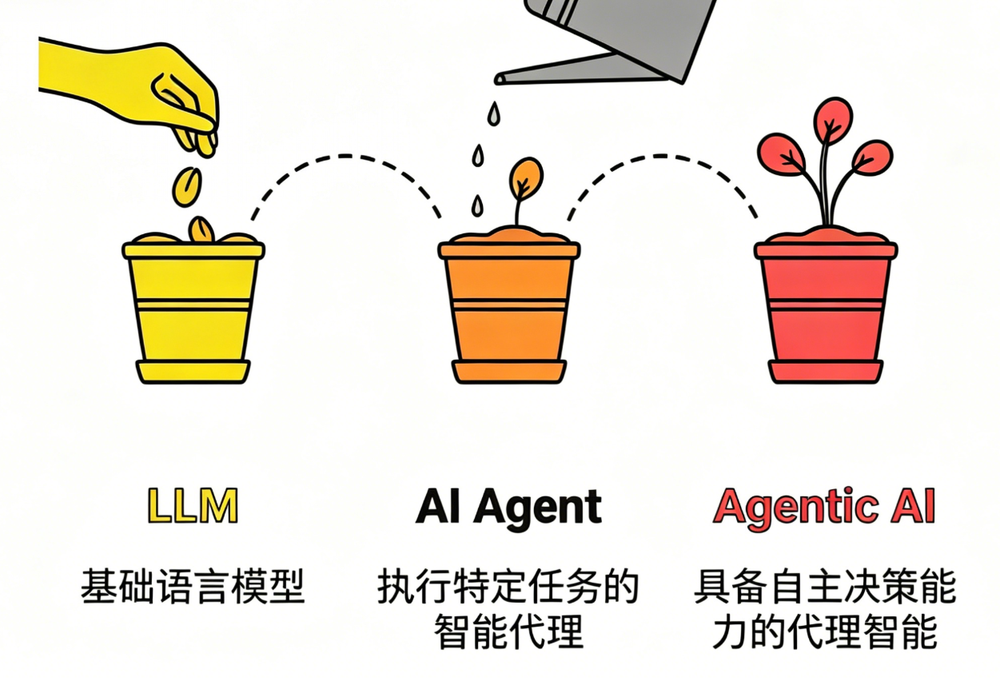
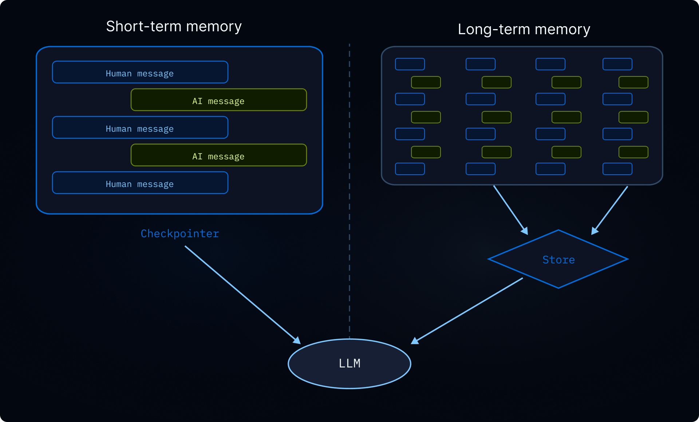
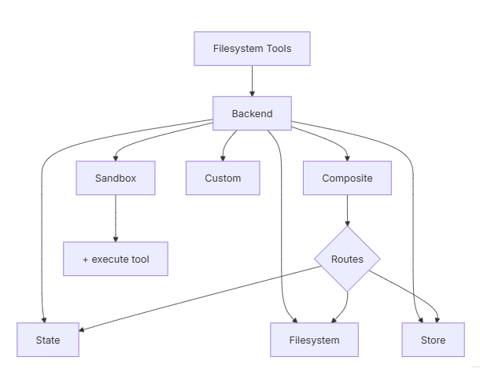
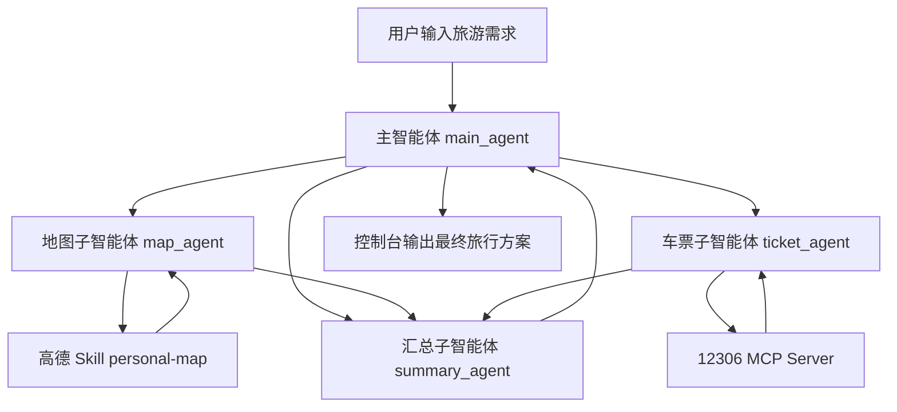

# DeepAgents 框架技术讲解

## 一、开篇引入

**开篇引入**

在过去短短数年间，人工智能的形态正经历一场层层递进的深刻演化。它从最初仅能 “响应问题” 的大型语言模型（LLM），逐步迭代为具备 “调用工具、落地执行” 能力的 AI Agent，如今更朝着拥有协作意识、可驾驭复杂工作流的 Agentic AI 加速迈进。这条演进路径绝非简单的功能叠加，而是一条从 “语言理解能力” 到 “自主行动能力”，再到 “智能组织与协作能力” 的质变之路 —— 几乎构筑起未来智能应用的核心主轴。



为突破现有技术瓶颈，两个关键概念在研究与实践领域迅速崛起并成为核心驱动力 —— **深度代理（Deep Agents）**与**高阶提示（Higher-Order Prompts, HOPs）**。

在深度代理的架构中，模型不再是 “一次性输出答案” ，而是化身具备 “规划 - 执行 - 反馈 - 迭代” 闭环能力的智能主体：

- 面对复杂任务时，先将其拆解为可落地的子目标；
- 为每个子目标匹配专属的子代理（sub-agent），实现专业化分工；
- 执行过程中实时监控各步骤产出，精准识别偏离目标的异常；
- 基于执行结果动态调整计划、替换策略，或生成新的子任务以补全链路；
- 当出现错误时，通过反思（reflection）机制回溯问题根源，修正执行路径。

而高阶提示（HOPs）则聚焦于 “教会模型如何思考”：如果说深度代理是智能系统的 “组织架构师”，负责搭建任务执行的骨架，那么高阶提示就是 “认知规范师”，定义思考与推理的底层逻辑。

* **传统提示**：告诉我**做什么**。

  > 分析下面这条用户评论，判断情绪是正面、负面还是中性，并给出改进建议。
  >
  > 评论：“这个软件经常卡顿，打开要等很久，界面也不好看，用起来很烦躁。”

* **高阶提示**：告诉我**怎么想、按什么步骤、用什么逻辑**。

  > 请按以下**固定思考流程**分析用户评论：
  >
  > 1. 先逐句提取事实：用户提到了哪些具体问题？
  > 2. 再判断情绪：根据关键词判断是正面 / 负面 / 中性，并给出理由。
  > 3. 按问题严重程度排序：从最影响体验到最轻。
  > 4. 每条问题对应给出**可落地**的改进建议，不要空泛。
  > 5. 最后用一句话总结核心痛点。
  >
  > 评论：“这个软件经常卡顿，打开要等很久，界面也不好看，用起来很烦躁。”

传统提示偏向 “直接下达结果指令”，而高阶提示则更进一步，它向模型传递的是 “思考框架与推理范式”—— 明确告知模型该如何分析问题、如何拆解逻辑、如何组织思考过程，从根源上提升决策的精准度与执行的可靠性。

## 二、框架基础

### 2.1 DeepAgents介绍和作用

> 构建能够规划、使用子代理并利用文件系统处理复杂任务的代理(深度智能体)
>
> https://docs.langchain.com/oss/python/deepagents/overview

**DeepAgents**是一个独立库，建立在 LangChain代理核心构建模块之上！主要实现**自主多智能体系统（Agentic AI）**！**DeepAgents**是构建由大型语言模型（LLM）驱动的代理和应用的最简单方式——内置任务规划功能、用于上下文管理的文件系统、子代理生成和长期记忆。可以用它完成复杂、多步骤、切自主规划的任务。

**家族框架对比：**

> https://docs.langchain.com/oss/python/concepts/products
>
> 三者并非单向引用，有时会出现循环调用场景！！

- **LangChain (Framework)**：做 “动作”，是核心的代理框架。它封装了 LLM 与工具的交互，提供灵活的代理结构，但不包含规划、记忆或文件系统，适合开发者自己定制逻辑。
- **LangGraph (Runtime)**：管 “流程”，是外层的运行时。它把执行变成可管理的图结构，支持循环、并行和持久化，保障智能体执行的稳定与可控。
- **DeepAgents (Harness)**：负责 “组织”，是最外层的工具包。它内置规划器、子代理、文件系统和持久存储，让智能体从 “能执行” 升级为 “能组织、能管理、能记忆” 的深度智能体。


**功能横向对比：**


**LangChain、LangGraph、Deep Agents 使用场景总结：**

1. 何时使用 LangChain？
   - 你想**快速构建代理与自主应用**。
   - 你需要对**模型、工具、代理循环**提供标准抽象。（单Agent）
   - 你需要**易用且灵活**的开发框架。
   - 你在开发**简单直接的代理应用**，无复杂编排需求。
2. 何时使用 LangGraph？
   - 你需要对**代理编排做细粒度、底层控制**。
   - 你需要**持久化执行**，支持**长时间运行、有状态的代理**。
   - 你在构建**结合确定性(静态边)步骤与智能(条件边)代理步骤**的复杂工作流。
   - 你需要**可直接用于生产环境**的代理部署基础设施。
3. 何时使用 Deep Agents SDK？
   - 你在构建**长期运行、持续运营、自主规划**的智能代理。
   - 你在构建需要处理**复杂(多场景)、多步骤任务**的代理。
   - 你需要使用**预定义工具**：如文件系统操作、自定义工具、自动化上下文工程等。
   - 你希望直接使用**预设提示词与子代理**能力。

### 2.2 DeepAgents核心能力

**核心能力一：智能规划与任务分解**（最核心的智能协调能力，避免传统工作流的“写死步骤”）

> DeepAgents 内置 todo 规划机制，使代理能够：
>
> - 将复杂任务拆分为离散、可执行的步骤
> - 在执行过程中持续跟踪当前进度
> - 根据新信息动态调整后续计划

例如：你要“办一场生日派对”，DeepAgent 不会一上来就瞎忙，而是会先把任务拆清楚：

1. 确定派对时间和地点  
2. 邀请朋友  
3. 买食材和蛋糕 
4. 布置场地  
5. 准备游戏和活动

执行过程中，它还会根据实际情况动态调整。  比如原本计划“去 A 店买蛋糕”，结果发现店没开门，它不会卡住，而是会自动把这一步改成“换一家店”或者“改为线上订蛋糕”。

这就是 DeepAgents 和传统固定流程最大的不同：  **它不是死板地按预设步骤执行，而是会先规划、再执行、边执行边调整。**

提示：  这里的 todo 机制可以理解成 DeepAgents 自带的“任务清单系统”，让代理把复杂问题拆成一条条可执行步骤，并在执行中持续维护这份清单。

---

**核心能力二：高效上下文管理**（最实用的“外部信息卸载”方案，避免上下文溢出）

> DeepAgents 提供文件系统与上下文外部化能力，使代理能够：
>
> - 将大型信息暂存到外部，而不是全部塞进上下文窗口
> - 按需读取需要的内容，减少上下文压力
> - 处理长度不固定的大型中间结果

就像你要“整理 100 页年度工作总结”，但大脑一次只能稳稳记住其中 10 页。  DeepAgent 的做法不是硬记全部，而是像准备了一个“文件柜”：

1. 先把大内容分块存起来  
2. 当前只拿出正在处理的那一部分  
3. 用完后再放回去  
4. 最后把整理好的结论汇总成最终结果

执行过程中，它可以像一个会整理资料的助理一样工作：

- 用 `ls` 查看当前有哪些文件
- 用 `read_file` 精确读取需要的内容
- 用 `write_file` 把中间结果保存起来
- 用 `edit_file` 修改已有内容

这样一来，代理的“上下文大脑”里只保留当前最重要的信息，既不会超载，也不容易丢失关键内容。

提示： 这里的文件系统工具，不只是简单的“读写本地文件”，更重要的是它提供了一种**把大上下文外部化、按需取用**的工作方式。

---

**核心能力三：子代理分工协作**（最灵活的“分工处理”模式，避免主代理超负荷）

> DeepAgents 内置 `task` 工具，使代理能够：
>
> - 把特定任务交给更适合的子代理处理
> - 实现上下文隔离，避免所有信息都堆在主代理里
> - 让复杂子任务独立执行，再把结果返回给主代理

就像你要“装修一套房子”，你不会既当设计师、又当瓦工、还当水电工，而是会安排不同的人分别处理不同环节：

1. 设计子代理负责出方案  
2. 施工子代理负责落实施工  
3. 水电子代理负责管线细节  
4. 主代理只负责统筹进度和汇总结果

这样做的好处是：

- 主代理不用被所有细节压垮
- 子代理可以专注处理自己的任务
- 不同子任务之间互不干扰
- 最终结果再统一回收到主代理

所以，DeepAgents 更像一个“会分工的项目经理”，不是所有事情都自己做，而是把任务分给更合适的执行者。

---

**核心能力四：长期记忆能力**（最持久的“记忆存储”系统，避免代理“失忆”）

> DeepAgents 可结合 LangGraph Store 等持久化能力，使代理能够：
>
> - 在不同对话、不同线程之间保留记忆
> - 保存和检索历史交互信息
> - 支持多次任务之间共享已有知识和上下文

就像你要“持续跟进一个客户需求”，你不会每次都从头开始问“你想做什么系统”，而是会有一个“客户档案本”：

1. 第一次沟通，记录客户需求  
2. 下一次沟通前，先翻档案本  
3. 新需求继续补充进去  
4. 之后每次跟进都基于这份历史记录继续往下推进

这样一来，代理就不会出现下面这种低效情况：

- 每次开新对话都重新问一遍
- 之前说过的约束条件全部忘掉
- 上一次做过的结论无法复用

长期记忆能力的价值就在这里：  **让代理不只是“当前会做事”，还能够“持续记住事”。**

---

### 2.3 DeepAgents快速入门 

快速构建第一个 Deep Agent：**一个能够自主联网搜索并撰写报告的“AI 研究员”**会借用Tavily网络搜索工具！

**步骤1：安装依赖**

```bash
pip install deepagents tavily-python python-dotenv langchain-openai
uv  add  deepagents tavily-python python-dotenv langchain-openai
```

**步骤2：配置 API Key**

确保你拥有 LLM  和 Tavily (搜索) 的 API Key。位置：`.env`

```bash
# OPENAI风格配置
OPENAI_BASE_URL=https://dashscope.aliyuncs.com/compatible-mode/v1
OPENAI_API_KEY=sk-ws-H.EDXEDEE.09e8.MEUCIQDPHPw4of9mOt1thnGnnNX18Qa8g3Zhy0FAYnd6n_34PAIgJqPYmMTBunPDE7SNzW4xAVzXQWXO9qsQ378Cy1e8X8M
LLM_QWEN3=qwen3-32b
LLM_QWEN_MAX=qwen3.7-max

#https://app.tavily.com/
#tavily-api-key
TAVILY_API_KEY=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
```

**步骤3：定义搜索工具**

DeepAgents 需要通过工具与外部世界交互。我们先定义一个简单的联网搜索工具。

位置：`tavily_tools.py`

```python
from typing import Literal
from langchain.tools import tool
from tavily import TavilyClient
from dotenv import load_dotenv,find_dotenv
import os

# 加载 .env文件
load_dotenv(find_dotenv())

# 创建tavily_client
tavily_client = TavilyClient(api_key=os.getenv("TAVILY_API_KEY"))

# 定义搜索工具
@tool
def internet_search(
        query:str,
        max_results:int =10,
        topic:Literal["general","news","finance"] = "general",
        include_raw_content:bool = False):
    """
    互联网搜索工具！
    :param query: 搜索关键字
    :param max_results: 返回结果数量
    :param topic: 主题类型
    :param include_raw_content: False精简 True 返回详细结果
    :return: 搜索结果列表
    """
    print(f"进行网络搜索！搜索条件：{query},搜索主题类别:{topic},搜索最大的条数：{max_results}")
    return tavily_client.search(
        query=query,
        max_results=max_results,
        topic=topic,
        include_raw_content=include_raw_content
    )
```

**步骤4：创建 Deep Agent**

通过 `create_deep_agent` 工厂函数，将工具和 System Prompt 组装成一个智能体。

```python
from langchain.chat_models import init_chat_model
from deepagents import create_deep_agent
import os
from dotenv import load_dotenv, find_dotenv

from base.tavily_tool import internet_search

# 使用 find_dotenv() 自动查找 .env 文件，无论你在哪个目录下运行脚本都能正确加载环境变量
load_dotenv(find_dotenv())

# 极简初始化（自动读取OPENAI环境变量）
llm = init_chat_model(
    model=os.getenv("LLM_QWEN_MAX"),
    model_provider="openai"
)

# api地址 https://reference.langchain.com/python/deepagents/graph/
# 功能等价于langchain的 create_agent
deep_agent = create_deep_agent(
    model=llm,
    tools=[internet_search],
    subagents=[],
    system_prompt="""
      你是一位专家级研究员。你的任务是进行深入研究并撰写一份精美的报告。
      你有权使用 internet_search 工具来收集信息。
    """
)
```

**步骤5：运行并获取结果**

```python
# 运行代理
prompt = input("输入你关心的问题！")
result = deep_agent.invoke({
    "messages":[
        {"role":"user","content":f"{prompt}"}
    ]
})
#result = main_agent.invoke({"input":"人工智能和机器人的热点新闻！！"})

"""
结果数据说明
 {
    "messages": [
        # 第0条：你的提问（HumanMessage）
        HumanMessage(content='搜索宇树机器人的新闻！'),
        # 第1条：Agent 调用工具的指令（AIMessage，内容为空，仅触发工具）
        AIMessage(content='', tool_calls=[{'name':'internet_search', ...}]),
        # 第2条：工具返回的搜索结果（ToolMessage，一堆JSON数据）
        ToolMessage(content='{"query":"宇树机器人 新闻","results":[...]}'),
        # 第3条：Agent 整理后的最终回复（AIMessage，这是你要的内容）
        AIMessage(content='以下是关于宇树机器人的一些最新新闻：...')
    ]
}
"""
print(result['messages'][-1].content)
```

总结

1. `result['messages']`：定位到存储全流程对话的列表；
2. `[-1]`：精准抓取列表最后一条（Agent 整理后的最终回复）；
3. `.content`：过滤掉所有冗余属性，只取纯文本回复内容。

### 2.4 DeepAgents流式处理结果解析

深度代理基于 LangGraph 的流基础设施构建，提供一流的子代理流支持。当深度代理将工作委派给子代理时，你可以独立从每个子代理处流式更新——实时跟踪进展、LLM 令牌和工具调用

```python
# 运行代理
# 输入：查询机器人最新的热点
prompt = input("输入你关心的问题！")
# 同步流
stream = deep_agent.stream({
    "messages":[
        {"role":"user","content":f"{prompt}"}
    ]
})
# =============================================================================
# Chunk 数据结构参考文档 (Python 对象视图)
# =============================================================================
# LangGraph 流式输出 (chunk) 的四种核心场景示例：
# 1. [场景 A：Agent 思考并决定调用工具]
#    {
#      "model": {
#        "messages": [
#          AIMessage(
#            content="",
#            tool_calls=[{
#              "name": "read_file_content",
#              "args": {"filename": "需求.docx"},
#              "id": "call_123"
#            }]
#          )
#        ]
#      }
#    }
# 2. [场景 B：工具执行完毕，返回结果]
#    {
#      "tools": {
#        "messages": [
#          ToolMessage(
#            content="[文件内容]...",
#            name="read_file_content",
#            tool_call_id="call_123"
#          )
#        ]
#      }
#    }
# 3. [场景 C：Agent 决定调用子 Agent (特殊工具 'task')]
#    {
#      "model": {
#        "messages": [
#          AIMessage(
#            content="",
#            tool_calls=[{
#              "name": "task",
#              "args": {
#                "subagent_type": "网络搜索助手",  # 目标子 Agent
#                "description": "查询2024政策"     # 下发的具体任务
#              },
#              "id": "call_456"
#            }]
#          )
#        ]
#      }
#    }
# 4. [场景 D：Agent 最终回复用户]
#    {
#      "model": {
#        "messages": [
#          AIMessage(
#            content="根据查询结果，2024年新政策如下...",
#            tool_calls=[]
#          )
#        ]
#      }
#    }
# =============================================================================
for chunk in stream:
    """
        # 场景1：单个节点更新（常见）
        chunk = {
            "model": {"messages": [AIMessage(content='', tool_calls=[...])]}  # 仅模型节点更新
        }
        
        # 场景2：多个节点同时更新（少数但存在）
        chunk = {
            "model": {"messages": [AIMessage(content='最终回复...')]},  # 模型节点
            "tools": {"messages": [ToolMessage(content='工具结果...')]},  # 工具节点
            "todos": {"todos_list": ["已完成：搜索宇树机器人新闻"]}       # 待办节点
        }
    """
    for node_name, state in chunk.items():
        print(f"本次处理的节点类型{node_name}")
        # 有些中间节点 例如：TodoListMiddleware 没有 messages跳过！
        if not state or "messages" not in state: continue
        # 有的直接获取
        messages = state["messages"]
        # message不为null!并且是集合类型
        if messages and isinstance(messages, list):
            # 获取最后一条就是最终结果
            last_msg = messages[-1]
            # 1. 模型节点 (model)：决定下一步行动
            if node_name == "model":
                # 如果有 tool_calls，说明模型决定调用工具或子智能体
                if last_msg.tool_calls:
                    for tool_call in last_msg.tool_calls:
                        if tool_call['name'] == 'task':
                            sub_agent = tool_call['args'].get('subagent_type')
                            print(f"[模型决策] 呼叫子智能体: {sub_agent}")
                        else:
                            print(f"[模型决策] 调用工具: {tool_call['name']},参数为：{tool_call['args']}")
                # 如果没有 tool_calls 且有 content，说明是最终回复
                elif last_msg.content:
                    print(f"📝 [最终回复] {last_msg.content}")
            # 2. 工具节点 (tools)：显示工具/子智能体的执行结果
            elif node_name == "tools":
                # ToolMessage 的 content 是工具返回的原始数据 (可能是 JSON 字符串)
                # 建议只打印前 100 个字符，避免刷屏
                # 展开成普通if-else，更易理解
                content_preview = ''
                if len(last_msg.content) > 100:
                    # 取前100个字符 + 省略号（截断预览）
                    content_preview = last_msg.content[:100] + "..."
                else:
                    # 内容较短，直接完整显示
                    content_preview = last_msg.content
                print(f"[执行结果] {content_preview}")
```

**解读返回结果：**

场景 1：智能体前置处理（before_agent 节点）

节点名：`PatchToolCallsMiddleware.before_agent`

核心含义：接收用户输入，格式化 / 校验消息

```json
{
  "PatchToolCallsMiddleware.before_agent": {
    "messages": Overwrite(  # LangChain 自定义Overwrite对象
      value=[  # 核心数据在value字段
        HumanMessage(  # 用户消息对象
          content="北京今天天气怎么样？",  # 用户提问内容
          additional_kwargs={},
          response_metadata={},
          id="466118de-5cdb-4250-a57f-bacf28b6407a"  # 消息唯一ID
        )
      ]
    )
  }
}
```

场景 2：模型思考（决定调用工具）（model 节点）

节点名：`model`

核心含义：大模型分析问题，决定调用工具 / 子代理（无直接回答）

```json
{
  "model": {
    "messages": [
      AIMessage(  # 模型消息对象
        content="",  # 内容为空（因为要调用工具）
        additional_kwargs={"refusal": None},
        response_metadata={  # 模型元数据
          "token_usage": {"completion_tokens": 30, "prompt_tokens": 5265, "total_tokens": 5295},
          "model_provider": "openai",
          "model_name": "qwen-max",
          "finish_reason": "tool_calls"  # 结束原因：调用工具
        },
        id="lc_run--019c6f4e-9c10-7ae0-966a-5788f78b2017-0",
        tool_calls=[  # 模型决定调用的工具列表
          {
            "name": "task",  # 工具/子任务名
            "args": {  # 工具参数
              "subagent_type": "weather_helper",
              "description": "查询北京今天的天气情况。"
            },
            "id": "call_232308d358d64454905543",
            "type": "tool_call"
          }
        ],
        invalid_tool_calls=[],
        usage_metadata={"input_tokens": 5265, "output_tokens": 30}
      }
    ]
  }
}
```

子智能体：`name="task"`，`args` 含 `subagent_type`/`description`；

自定义工具：`name=工具名`，`args` 含工具自有参数（如`query`）；

场景 3：模型后置钩子（after_model 节点）

节点名：`TodoListMiddleware.after_model`

核心含义：模型执行完成的空钩子（无实际业务数据）

```json
{
  "TodoListMiddleware.after_model": None
}
```

场景 4：工具 / 子代理执行（tools 节点）

节点名：`tools`

核心含义：执行工具调用，返回外部数据（如天气、搜索结果）

```json
{
  "tools": {
    "messages": [
      ToolMessage(  # 工具消息对象
        content='{"query": "DeepAgents", "results": [{"url": "...", "title": "deepagents - PyPI", "content": "..."}]}',  # 实际返回的是 JSON 字符串
        name="internet_search",  # 对应调用的工具名 (例如 internet_search)
        id="81d0bddd-30de-4874-baac-0bca8aa38936",
        tool_call_id="call_232308d358d64454905543"  # 关联模型调用的工具ID
      )
    ]
  }
}
```

场景 5：模型生成最终回答（model 节点）

节点名：`model`

核心含义：模型基于工具结果，生成自然语言最终回答

```json
{
  "model": {
    "messages": [
      AIMessage(
        content="今天北京的天气晴朗，气温25度，非常适合出游。",  # 最终回答内容
        additional_kwargs={"refusal": None},
        response_metadata={
          "token_usage": {"completion_tokens": 17, "prompt_tokens": 5318, "total_tokens": 5335},
          "finish_reason": "stop"  # 结束原因：正常完成
        },
        id="lc_run--019c6f4e-af53-7ca3-aee6-9f386be2ac78-0",
        tool_calls=[],  # 无工具调用（已完成回答）
        usage_metadata={"input_tokens": 5318, "output_tokens": 17}
      )
    ]
  }
}
```

## 三、DeepAgents框架进阶

### 3.1 子代理和多智能体

> 指南：https://www.anthropic.com/engineering/building-effective-agents

#### 3.1.1 多智能体理解

多 Agent 系统（Multi-Agent System, MAS）是由多个具备**自主性、反应性、目标导向性**的智能体（Agent）组成的协作体系，通过标准化通信与协同机制，共同完成单一智能体无法独立应对的复杂任务。

简单解释，就是将复杂任务，拆解成多个子任务，分发给专长的Agent进行处理，最后综合结果！本质: **分而治(zhi)之(zhi)**！！

| 维度         | 单体模型（注意力稀释法则）                                   | 多智能体（分而治之的极效）                                   |
| :----------- | :----------------------------------------------------------- | :----------------------------------------------------------- |
| **核心问题** | 同一个模型需处理多领域知识（如医学 + 法律），不同领域信息互相污染，推理能力断崖式下跌 | 将任务物理拆解，由专业 Agent 分别处理独立并行子任务，多方处理独立任务，性能优势极大提升！ |
| **组织类比** | 一人全栈（精力分散、专业度不足）                             | 专业敏捷团队（分工明确、各司其职）                           |
| **核心逻辑** | 注意力资源被多领域任务稀释，导致认知过载                     | 分布式算力 + 专业化分工，突破单体模型的物理天花板            |

#### 3.1.2 多智能体弊端

多智能体系统在实现**分而治之的性能飞跃**的同时，必然伴随两大**灾难级代价**，成为落地的核心阻碍：

**Token 消耗的指数级失控**

单体模型仅需承担自身推理的 Token 成本，而多 Agent 系统的核心交互逻辑是**Agent 间的上下文互通**。当多个 Agent 为完成协同任务，频繁互传长文本上下文、进行多轮循环复读时，Token 消耗会呈指数级暴涨。

更致命的是，无约束的群聊式交互可能在极短时间内爆 API 额度，直接导致**成本失控**，甚至成为中小团队落地多 Agent 的核心经济门槛。应对这一代价的关键，在于建立**拦截基准线**—— 对简单任务直接拒绝多 Agent 协作，强制使用单 Agent 或者 标准图流程，从源头控制交互规模。

**调试成为噩梦：非确定性与全链路黑箱**

多 Agent 系统的 “涌现性” 同时带来了**不可控性**：Agent 间的交互是非线性的，系统崩溃并非单一节点故障，而是像城市交通连环撞车一样，由多步交互的连锁反应引发，且难以复现。

传统的单 Agent 日志调试方式完全失效，若未搭建**全链路追踪（Tracing）** 体系，出现问题时既无法定位根因，也无法复盘交互过程，直接导致系统上线后风险极高。因此，“不建全链路追踪录像，绝不上线” 成为多 Agent 落地的**硬性底线**，这也是保障系统稳定性与可维护性的核心前提。

| 代价类型         | 核心问题               | 具体表现                                                     | 风险阈值 / 特征                                   | 应对底线 / 策略                                              |
| :--------------- | :--------------------- | :----------------------------------------------------------- | :------------------------------------------------ | :----------------------------------------------------------- |
| **账单被击穿**   | Token 消耗失控         | Agent 间频繁互传长文本上下文，Token 消耗呈**指数级增长**，无节制的交互对话极易快速耗尽 API 额度 | 短时间内激增                                      | 建立拦截基准线，简单任务严禁触发多智能体流程，控制交互文本长度 |
| **调试成为噩梦** | 系统非确定性与不可追溯 | 群智网络伴随 “非确定性”，系统崩溃场景复杂且无规律，难以定位根因，如同城市红绿灯瘫痪引发连环事故 | 多 Agent 交互出现不可复现的异常、全链路无日志追踪 | 不建全链路追踪录像（Tracing）绝不上线，强制记录交互日志      |

#### 3.1.3 用多智能体的三条铁律

这三条铁律本质上是**多智能体系统的 “入场许可”**，只有满足其中至少一条，才值得我们承担多 Agent 带来的成本与复杂度代价：

1. **问题极度开放**：这类任务没有标准答案或固定流程，比如 “制定企业年度战略”“开放式科研探索”，单体模型容易陷入局部最优，而多智能体可以通过多角色探索不同方向，动态调整路径。
2. **存在领域冲突**：当任务需要跨两个及以上专业领域时（比如 “医疗 + 法律”“金融 + 工程”），单体模型的注意力会被分散，导致推理精度断崖式下跌。多智能体通过物理隔离不同领域 Agent，避免知识污染，保障各模块专业度。
3. **需要多方向并行**：任务天然可以拆分为多个互不依赖的子任务（比如 “多源数据采集”“多版本方案并行设计”），多智能体可以利用分布式算力并行执行，大幅缩短整体耗时，实现 “1+1>2” 的效率提升。

只有符合这些条件时，多智能体才是 “宝贝”；否则，强行使用只会让系统陷入 “毒药“ 般的成本与调试困境。

| 铁律名称       | 核心场景                   | 详细说明                                                     |
| :------------- | :------------------------- | :----------------------------------------------------------- |
| 问题极度开放   | 高复杂度、无固定路径任务   | 问题复杂度过高，无法事前硬编码死路径，需要在执行过程中灵活转向、探索旁支 |
| 存在领域冲突   | 多领域混杂任务             | 当混淆领域达到两个以上时，单体模型会因注意力稀释导致表现下滑，必须物理隔离不同领域专家的推理上下文 |
| 需要多方向并行 | 天然可拆解为独立路径的任务 | 任务天然要求沿多条独立路径同时并行推进，采用多体架构并行处理可带来极显著的性能耗时收益 |

#### 3.1.4 多智能两种架构模式

**模式一：层级工作流 (Hierarchical / Orchestrator-Workers)** 

> 别名 ：指挥官模式、主从模式 核心逻辑 ： 中央集权 。有一个“大脑”负责思考和分派任务，其他 Agent 只是干活的“手”。

- 运作方式 ：
  1. 输入 ：用户给出一个复杂任务（比如“写一份新产品的上市策划案”）。
  2. 主脑 (Orchestrator) ：主管 Agent 收到任务，它不直接干活，而是分析任务，把它拆解成几个子任务（如：市场调研、创意设计、文案撰写）。
  3. 分发 ：主管把子任务分发给对应的 垂直领域专家 Agent （Worker）。
  4. 执行 ：Worker Agent 并行或串行工作，产出结果返还给主管。
  5. 整合 ：主管汇总所有结果，整合成最终报告输出。
- 优点 ：
  - 可控性强 ：主脑掌控全局，知道进度，方便纠错。
  - 逻辑清晰 ：上下级关系明确，就像传统的公司组织架构。
- 缺点 ：
  - 单点故障 ：主脑如果挂了或判断失误，整个任务就崩了。
  - 通信瓶颈 ：所有信息都要经过主脑中转。


**模式二：协作工作流 (Collaborative / Network)** 

> 别名 ：网状模式、专家会诊模式 核心逻辑 ： 去中心化 。没有绝对的领导，大家都是平等的专家，坐在一起开会讨论，互相交换信息。

- 运作方式 ：
  1. 输入 ：用户给出一个开放性问题（比如“评估这家公司的投资价值”）。
  2. 共享 ：任务被扔到一个“共享会议室”（Shared State/Context）。
  3. 自组织 ：不同的专家 Agent（定价、产品、财务、合规）根据自己的专长，从“会议室”里拿取信息，进行分析。
  4. 交互 ：Agent 之间可以直接交流。比如财务 Agent 算出成本太高，直接告诉定价 Agent 调整价格，不需要经过领导批准。
  5. 收敛 ：最后通过一个 **评估者 (Evaluator) 或规则**来决定什么时候讨论结束，输出最终方案。
- 优点 ：
  - 灵活性极高 ：适合解决极其复杂、没有标准答案的问题。
  - 涌现能力 ：不同的专家碰撞可能产生意想不到的创新解法。
- 缺点 ：
  - 容易失控 ：Agent 之间可能陷入无休止的争论（死循环）。
  - 难以调试 ：很难追踪到底是谁做出的关键决策。


#### 3.1.5 DeepAgents子代理

https://docs.langchain.com/oss/python/deepagents/subagents#configuration

深度代理可以创建子代理来委派工作。你可以在`子代理`参数中指定自定义子代理。子代理用于上下文隔离（保持主代理上下文的干净）以及提供专业指令。


子代理解决了**上下文膨胀问题** 。当代理使用输出较大的工具（如网页搜索、文件读取、数据库查询）时，上下文窗口会迅速被中间结果填满。子代理将这些详细工作隔离开来——主代理只接收最终结果，而非产生该结果的数十个工具调用。

**什么时候使用SubAgent：**

- 多步骤任务会让主代理的上下文变得杂乱

- 有需要 “专业技能 / 专属工具” 的环节

  > 比如主代理要做 “股票分析”，其中 “基本面分析” 需要财务工具、“技术面分析” 需要 K 线工具，给这两个环节配专属子代理（带对应工具）

- 需要不同模型能力的任务（多模态）

- 当你想让主Agent专注于高层协调时

**什么时候不应使用SubAgent：**

- 任务简单，一步就能干完

- 需要中间信息连贯，不能拆

  > 比如 “读一篇文章，然后总结核心观点”，拆给子代理读、再拆给另一个子代理总结，会丢上下文，不如主代理一次性干完。

- 当运营费用超过收益时

**Subagent配置方式:** `子代理`配置有两种方案**词典**或**`CompiledSubAgent`**对象。

将子代理定义为包含以下字段的词典：

| 字段名        | 类型                 | 必填 / 可选 | 核心描述                                                     | 继承规则（与主代理的关系）               |
| :------------ | :------------------- | :---------- | :----------------------------------------------------------- | :--------------------------------------- |
| name          | str                  | 必填        | 子代理的唯一标识；主代理调用 `task()` 工具时会使用该名称，也会作为 AIMessage / 流式输出的元数据，用于区分不同代理 | -（无继承，需自定义）                    |
| description   | str                  | 必填        | 子代理的职能描述（需具体、以行动为导向）；主代理会根据此信息判断是否将任务委派给该子代理 | -（无继承，需自定义）                    |
| system_prompt | str                  | 可选        | 子代理的执行指令，需包含工具使用指导、输出格式要求等核心规则 | 不继承主代理的，需自定义                 |
| tools         | list[Callable]       | 可选        | 子代理可使用的工具列表；建议极简配置，仅保留必要工具         | 不继承主代理的，需自定义                 |
| model         | str \| BaseChatModel | 可选        | 子代理使用的模型：1. 传字符串（如 `openai:gpt-5`）2. 传 LangChain 模型对象（如 `init_chat_model("gpt-5")`）省略则使用主代理的模型 | 默认继承主代理的模型，自定义会覆盖默认值 |
| middleware    | list[Middleware]     | 可选        | 自定义中间件，用于实现日志记录、速率限制、自定义行为等功能   | 不继承主代理的，需自定义                 |
| interrupt_on  | dict[str, bool]      | 可选        | 为特定工具配置 “人机协作流程（HITL）”；需搭配检查点（checkpointer）使用 | -                                        |
| skills        | list[str]            | 可选        | 技能文件的来源路径（如 `["/skills/research/"]`），用于加载子代理专属技能 | -                                        |

**示例**：创建一个主智能体，它拥有三个助手：

1. **天气助手**：查询天气（固定返回“晴朗”）。
2. **计算助手**：处理数学问题。
3. **翻译助手**：负责中英互译。

**代码实现**：

```python
from langchain.chat_models import init_chat_model
from deepagents import create_deep_agent
import os
from dotenv import load_dotenv, find_dotenv
import json

load_dotenv(find_dotenv())

# 极简初始化（自动读取OPENAI环境变量）
llm = init_chat_model(
    model=os.getenv("LLM_QWEN_MAX"),
    temperature=0.1,  # 自定义温度（更严谨的回答）
    model_provider="openai"
)

# 1. 定义子智能体：天气助手
weather_agent = {
    "name": "weather_helper",
    "description": "用于查询天气信息的助手。",
    "system_prompt": "你是一个天气助手。无论用户问哪个城市的天气，你都统一回答：'今日天气晴朗，气温 25 度，适合出游。'",
    "tools": []  # 这里不需要额外工具，仅靠 prompt 回复
}

# 2. 定义子智能体：计算助手
math_agent = {
    "name": "math_helper",
    "description": "用于处理数学计算问题。",
    "system_prompt": "你是一个严谨的数学助手。请帮助用户计算数学问题。",
    "tools": []
}

# 3. 定义子智能体：翻译助手
translate_agent = {
    "name": "translator",
    "description": "用于中英互译任务。",
    "system_prompt": "你是一个翻译助手。如果是中文请翻译成英文，如果是英文请翻译成中文。",
    "tools": []
}

# 4. 创建主智能体，并注册子智能体
main_agent = create_deep_agent(
    model=llm,
    tools=[],  # 主智能体本身不带工具，依靠子智能体
    subagents=[weather_agent, math_agent, translate_agent],
    system_prompt="你是一个全能管家。你会根据用户的需求，调度不同的助手来解决问题。"
)


# 5. 可视化运行 (Stream)
# 使用 stream() 替代 invoke()，可以实时打印出智能体的“调度”过程，看到它如何分发任务
def test_stream(query):
    print(f"\n>>> 提问: {query}")
    # 遍历流式输出
    for chunk in main_agent.stream({"messages": [{"role": "user", "content": query}]}):
        # chunk 是一个字典，键是节点名 (如 'model', 'tools')，值是该节点的状态更新
        for node_name, state in chunk.items():
            if not state or "messages" not in state: continue
            messages = state["messages"]
            if messages and isinstance(messages, list):
                last_msg = messages[-1]
                # 1. 模型节点 (model)：决定下一步行动
                if node_name == "model":
                    # 如果有 tool_calls，说明模型决定调用工具或子智能体
                    if last_msg.tool_calls:
                        for tool_call in last_msg.tool_calls:
                            if tool_call['name'] == 'task':
                                sub_agent = tool_call['args'].get('subagent_type')
                                print(f"[模型决策] 呼叫子智能体: {sub_agent}")
                            else:
                                print(f"[模型决策] 调用工具: {tool_call['name']},参数为：{tool_call['args']}")
                    # 如果没有 tool_calls 且有 content，说明是最终回复
                    elif last_msg.content:
                        print(f"[最终回复] {last_msg.content}")

                # 2. 工具节点 (tools)：显示工具/子智能体的执行结果
                elif node_name == "tools":
                    content_preview = ''
                    if len(last_msg.content) > 100:
                        # 取前100个字符 + 省略号（截断预览）
                        content_preview = last_msg.content[:100] + "..."
                    else:
                        # 内容较短，直接完整显示
                        content_preview = last_msg.content
                    print(f"[执行结果] {content_preview}")
test_stream("北京今天天气怎么样？")
test_stream("100 + 256 等于多少？")
```

**原理解析**：

- `subagents` 参数接收一个列表，每个元素是一个字典，定义了子智能体的配置。
- `description` 非常关键：主智能体通过这段描述来判断何时调用该子智能体。
- 当主智能体发现用户意图匹配某个子智能体的 `description` 时，会自动生成一个 `task` 工具调用，将任务分发下去。

**特别注意：**主子Agent之间上下文默认隔离

1. 独立 Prompt ：每个 Agent 都有自己独立的 system_prompt ，定义了它是谁，负责什么。
2. 独立工具集 (Skills/Tools) ：子 Agent 只能使用分配给它自己的工具，通常不能直接调用父 Agent 的工具，反之亦然。
3. 独立记忆 (Memory/State) ：子 Agent 在执行任务时产生的临时对话历史、变量状态，通常只在它自己的生命周期内有效，执行完向父 Agent 汇报结果后，这些中间过程可能不会全部同步给父 Agent（除非通过特定的返回值传递）。
   这种设计的目的：

- 专注 ：防止上下文污染。比如负责写代码的 Agent 不需要知道负责写文案的 Agent 的具体指令。
- 安全 ：限制工具权限。比如只有顶层 Agent 能批准发布，底层 Agent 只能提交代码。
- 模块化 ：方便独立测试和复用子 Agent。

**也可以调整成异步执行：**

1. **高并发服务**：用 FastAPI/Starlette 做接口时（比如给前端返回流式回答），`astream()` + 异步能同时处理成百上千个用户请求，不会因单个请求阻塞整个服务；
2. **批量处理任务**：需要同时调用智能体处理多个查询（比如你测试的 3 个问题），`astream()` 并发执行耗时≈最长单个任务，比同步 `stream()` 串行快几倍；
3. **非阻塞主线程**：在 GUI 程序（如 PyQt/Tkinter）、定时任务中调用智能体，`astream()` 异步执行不会让界面卡死 / 定时任务中断。

```python
from langchain.chat_models import init_chat_model
from deepagents import create_deep_agent
import os
import asyncio  # 新增：导入异步库
from dotenv import load_dotenv, find_dotenv
import json

load_dotenv(find_dotenv())

# 极简初始化（自动读取OPENAI环境变量）
llm = init_chat_model(
    model=os.getenv("LLM_QWEN_MAX"),
    verbose=True,  # 自定义参数
    temperature=0.1,  # 自定义温度（更严谨的回答）
    model_provider="openai"
)

# 1. 定义子智能体：天气助手（和原来一致）
weather_agent = {
    "name": "weather_helper",
    "description": "用于查询天气信息。当用户询问天气时，请调用此助手。",
    "system_prompt": "你是一个天气助手。无论用户问哪个城市的天气，你都统一回答：'今日天气晴朗，气温 25 度，适合出游。'",
    "model": llm,
    "tools": []
}

# 2. 定义子智能体：计算助手（和原来一致）
math_agent = {
    "name": "math_helper",
    "description": "用于处理数学计算问题。",
    "system_prompt": "你是一个严谨的数学助手。请帮助用户计算数学问题。",
    "model": llm,
    "tools": []
}

# 3. 定义子智能体：翻译助手（和原来一致）
translate_agent = {
    "name": "translator",
    "description": "用于中英互译任务。",
    "system_prompt": "你是一个翻译助手。如果是中文请翻译成英文，如果是英文请翻译成中文。",
    "model": llm,
    "tools": []
}

# 4. 创建主智能体（和原来一致）
main_agent = create_deep_agent(
    model=llm,
    tools=[],
    subagents=[weather_agent, math_agent, translate_agent],
    system_prompt="你是一个全能管家。你会根据用户的需求，调度不同的助手来解决问题。"
)


# 5. 异步版本：适配 astream()（核心修改）
async def test_astream(query):  # 新增 async 定义协程函数
    print(f"\n>>> 提问: {query}")
    # 核心修改：同步 for → 异步 async for
    async for chunk in main_agent.astream({"messages": [{"role": "user", "content": query}]}):
        for node_name, state in chunk.items():
            if not state or "messages" not in state: continue
            messages = state["messages"]
            if messages and isinstance(messages, list):
                last_msg = messages[-1]
                # 1. 模型节点逻辑（和原来一致）
                if node_name == "model":
                    if last_msg.tool_calls:
                        for tool_call in last_msg.tool_calls:
                            if tool_call['name'] == 'task':
                                sub_agent = tool_call['args'].get('subagent_type')
                                print(f"[模型决策] 呼叫子智能体: {sub_agent}")
                            else:
                                print(f"[模型决策] 调用工具: {tool_call['name']},参数为：{tool_call['args']}")
                    elif last_msg.content:
                        print(f"[最终回复] {last_msg.content}")
                # 2. 工具节点逻辑（和原来一致）
                elif node_name == "tools":
                    content_preview = ''
                    if len(last_msg.content) > 100:
                        content_preview = last_msg.content[:100] + "..."
                    else:
                        content_preview = last_msg.content
                    print(f"[执行结果] {content_preview}")

# 6. 执行异步函数（新增）
if __name__ == "__main__":
    # 执行单个查询
    #asyncio.run(test_astream("北京今天天气怎么样？"))
    # 也可以并发执行多个查询（协程核心优势）
    async def batch_run():
        # 并发执行2个查询
        task1 = test_astream("北京今天天气怎么样？")
        task2 = test_astream("100 + 256 等于多少？")
        task3 = test_astream("将 你好 翻译成 英文？")
        await asyncio.gather(task1, task2,task3)

    # # 执行包装后的协程
    asyncio.run(batch_run())
```

#### 3.1.6 CompiledSubAgent

LangChain 生态下的其他 Agent**可以挂载为 DeepAgents 的子代理**，但不能直接挂 —— 需要先把这些 Agent 封装成「符合 LangGraph StateGraph 规范的图」（核心是状态里包含 `messages` 键），再用 `CompiledSubAgent` 封装。

**兼容Langgraph编译图**

1. DeepAgents 子代理的 “准入门槛”

   DeepAgents 调度子代理的核心要求只有一个：子代理的执行逻辑必须是**「带有 `messages` 键的状态图」**（不管这个图是直接用 StateGraph 写的，还是从其他 Agent 转来的）。这个 `messages` 键就是你之前看 `result` 结构时的核心字段 ——DeepAgents 靠它传递对话、工具调用、执行结果，没有这个键就无法和主代理通信。

2. 演示LangGraph格式图挂载

```python
import os
from typing import TypedDict, Annotated
from dotenv import load_dotenv, find_dotenv
from langchain_openai import ChatOpenAI
from langchain_core.messages import AIMessage, HumanMessage
from langgraph.graph import StateGraph, END
from langgraph.graph.message import add_messages
from deepagents import create_deep_agent, CompiledSubAgent
from langchain.chat_models import init_chat_model

# 加载环境变量
load_dotenv(find_dotenv())

# 我们将之前形式的agent 包裹到subagents [deepagent]
# 1.定义的state必须包含 messages属性 【deepagents】
# 2.

# --- 1. 定义子智能体 (基于 StateGraph) ---

# 定义 State (必须包含 messages)
class SubState(TypedDict):
    messages: Annotated[list, add_messages]


# 定义节点逻辑 (增加打印语句，证明它被触发了)
def processing_node(state: SubState):
    print("\n    >>> [子智能体内部] 收到任务，正在处理...")

    # 获取主智能体传来的任务描述
    last_msg = state["messages"][-1]
    print(f"    >>> [子智能体内部] 输入内容: {last_msg.content}")

    # 模拟处理逻辑
    result_text = f"【已由Graph处理】经核查，业务逻辑处理完毕。原始内容：{last_msg.content}"

    print(f"    >>> [子智能体内部] 处理完成，准备返回。\n")
    return {"messages": [AIMessage(content=result_text)]}


# 构建图
workflow = StateGraph(SubState)
workflow.add_node("worker", processing_node)
workflow.set_entry_point("worker")
workflow.add_edge("worker", END)
compiled_graph = workflow.compile()

# 封装为 CompiledSubAgent
sub_agent_config = CompiledSubAgent(
    name="complex_worker",
    description="处理复杂业务逻辑、核查任务的子智能体。当用户提到'复杂业务'或'核查'时调用。",
    runnable=compiled_graph
)

# --- 2. 创建主智能体 ---

llm = init_chat_model(
    model=os.getenv("LLM_QWEN_MAX"),
    model_provider="openai"
)

deep_agent = create_deep_agent(
    model=llm,
    subagents=[sub_agent_config],
    system_prompt="你是一个协调员。遇到复杂任务时，必须调用 complex_worker 子智能体处理。"
)

# --- 3. 运行测试 ---

if __name__ == "__main__":
    query = "请帮我处理这个复杂业务：核对用户 ID 9527 的数据。"
    print(f"User: {query}")
    print("=" * 60)

    # 使用 stream 并解析结果
    for chunk in deep_agent.stream({"messages": [HumanMessage(content=query)]}):
        print(f"chunk结果：: {chunk}")
```

**兼容Langchain单**智能体

```python
import os
from langchain.chat_models import init_chat_model
from langchain.agents import create_agent
from langchain_core.tools import tool
from deepagents import create_deep_agent, CompiledSubAgent
from dotenv import load_dotenv, find_dotenv

# 加载环境变量
load_dotenv(find_dotenv())

# 1. 初始化模型
llm = init_chat_model(
    model=os.getenv("LLM_QWEN_MAX"),
    model_provider="openai"
)


@tool
def get_weather(city: str) -> str:
    """查询指定城市的天气"""
    return f"{city}的天气是晴朗，25度"

# Create a custom agent
agent = create_agent(
    model=llm,
    tools=[get_weather]
)

# Use it as a custom subagent
custom_subagent = CompiledSubAgent(
    name="subagent",
    description="子任务，可以调用天气工具，查询天气信息！",
    runnable=agent
)

# subagents = [custom_subagent]

deep_agent = create_deep_agent(
    model=llm,
    tools=[],
    system_prompt="你是一个智能助手,主要调用子代理实现功能，你只做任务分配,可以调用subagent实现功能！！",
    subagents=[custom_subagent]
)

result = deep_agent.invoke({
    "messages":[
        {"role":"user","content":"查询北京的天气！"}]
})

print(f"最终结果{result['messages'][-1].content}")
```

### 3.2 流程人机交互 (HITL)

https://docs.langchain.com/oss/python/deepagents/human-in-the-loop

有些工具作可能比较敏感，需要人工批准才能执行。深度代理通过 LangGraph 的中断功能支持人机参与的工作流程。您可以使用 `interrupt_on` 参数配置哪些工具需要批准。


#### 3.2.1 交互步骤说明

**步骤1：设置tool是否进行人工互动**

根据不同工具的风险等级配置

```python
# create_deep_agent的属性，配置工具是否需要人工互动
deep_agent = create_deep_agent(
   model = ""
   tools = [a,b,c,d]
   subagents = []
   interrupt_on = {
        # 工具名 : {需要人工审核动作！同意，编辑（同意但是修改工具方法参数），拒绝}
        "delete_file": {"allowed_decisions": ["approve", "edit", "reject"]},
        "a": True,
        "write_file": {"allowed_decisions": ["approve", "reject"]},
        # 不需要审批，默认就是False可以不写
        "read_file": True, # 交互有三个动作 approve reject edit 
        "list_files": False, # 默认值
    } )
```

**步骤2：配置检查点(短期记忆)**

人工互动需要一个检查点，在中断和恢复之间保持代理状态：

```python
from langgraph.checkpoint.memory import MemorySaver

checkpointer = MemorySaver()
agent = create_deep_agent(
    tools=[...],
    interrupt_on={...},
    checkpointer=checkpointer  # 必须，否则没有进度！
)
```

**步骤3：设置相同的thead_id**

恢复时，必须使用相同的配置和相同的 `thread_id`

```python
# 第一次调用，不会立即执行，会判断是否有中断动作 thread_id = session_id 
# 短期记忆: checkpointer 具体的范围是多大! 不能垮会话id! thread_id = 1 
config = {"configurable": {"thread_id": "my-thread"}}
result = agent.invoke(input, config=config)

# 中间决定是否放行

# 第二次调用，配置相同的线程id以及审批行为，最终执行
# 必须是相同的线程id才能确保同一个agent线程状态执行
# 不要传递参数.因为短期记忆! Command(resume={工具的决策  a:app... b:reject})
result = agent.invoke(Command(resume={}), config=config)
```

**步骤4：行动决策配置**

决策列表必须符合以下 `action_requests` 顺序：

```python
# 获取结果中是否存在打断状态！存在就获取人工参与再执行！
if result.get("__interrupt__"):
    interrupts = result["__interrupt__"][0].value
    action_requests = interrupts["action_requests"]

    # 根据tool顺序，处理设置决策，是否执行还是编辑
    decisions = []
    for action in action_requests:
        decision = get_user_decision(action)  # 我们定义得逻辑方法！
        decisions.append(decision)

    result = agent.invoke(
        Command(resume={"decisions": decisions}),
        config=config
    )
```

| 字段              | 含义                                                         |
| :---------------- | :----------------------------------------------------------- |
| `action_requests` | 需要审批的操作列表（如删库 `delete_database`、删文件 `delete_file`），包含操作名、参数、风险描述!  {'action_requests': [{'name': 'delete_table', 'args': {'tablename': 'users'}, 'description': "描述"} |
| `review_configs`  | 允许的审批操作（`approve` 同意 /`reject` 拒绝 /`edit` 编辑参数） |
| `id`              | 中断会话唯一标识（确保恢复时匹配同一个会话）                 |

#### 3.2.2  中断交互

当代理调用多个需要批准的工具时，所有中断都会被批量处理成一个中断。必须按顺序为每个动作提供决策

```python
# -*- coding: utf-8 -*-
"""
DeepAgents 中断审批机制示例
核心功能：演示高危工具调用前的人工审批流程，支持删除数据库表/文件的审批控制
"""
import os
from langchain.chat_models import init_chat_model
from langchain.tools import tool
from deepagents import create_deep_agent
from langgraph.checkpoint.memory import InMemorySaver  # 内存检查点，用于保存中断状态
from langgraph.types import Command  # 恢复执行的指令类型
from dotenv import load_dotenv, find_dotenv

# 加载环境变量（DASHSCOPE_API_KEY等），优先查找当前目录的.env文件
load_dotenv(find_dotenv())


# ======================== 1. 定义工具函数 ========================
# 装饰器@tool将普通函数转为LangChain可调用工具，函数文档字符串会作为工具描述给Agent
@tool
def delete_database(table_name: str):
    """
    高危操作：删除数据库表
    :param table_name: 要删除的表名
    :return: 操作结果提示
    """
    print(f"[工具执行] 删除表: {table_name}")
    return f"已成功删除表: {table_name}"


@tool
def select_data(table_name: str):
    """
    普通操作：查询指定表名的数据（无需审批）
    :param table_name: 要查询的表名
    :return: 操作结果提示
    """
    print(f"[工具执行] 查询指定表名数据: {table_name}")
    return f"查询数据成功：{table_name}"


@tool
def delete_file(file_name: str):
    """
    高危操作：删除文件
    :param file_name: 要删除的文件路径/名称
    :return: 操作结果提示
    """
    print(f"[工具执行] 删除文件: {file_name}")
    return f"已成功删除文件: {file_name}"


# 初始化大模型（通义千问）
llm = init_chat_model(
    model=os.getenv("LLM_QWEN_MAX"),          # 模型名称（从环境变量读取）
    model_provider="openai"                   # 兼容OpenAI格式的接口
)


# ======================== 2. 核心配置 ========================
# 配置检查点（必须）：保存Agent中断时的状态，确保恢复执行时能衔接上下文
# 注意：InMemorySaver仅用于测试，生产环境建议使用RedisCheckpointer等持久化方案
checkpointer = InMemorySaver()

# 创建DeepAgents智能体（核心配置）
deep_agent = create_deep_agent(
    model=llm,                                  # 绑定大模型
    tools=[delete_database, delete_file, select_data],  # 注册可用工具
    # 中断配置：指定调用以下工具前触发人工审批（高危操作管控）
    interrupt_on={"delete_database": True, "delete_file": True},
    checkpointer=checkpointer,                  # 绑定检查点（中断恢复必备）
    system_prompt="所有的回答都使用中文！！"     # 系统提示词，规范Agent输出语言
)

# ======================== 3. 执行流程 ========================
# 会话配置：通过thread_id绑定会话，确保中断/恢复在同一个会话中执行
thread_config = {"configurable": {"thread_id": "safe_thread_1"}}

print("\n=== 第一阶段：触发工具调用（规划阶段）===")
# 第一次调用：Agent会规划操作序列，但触发中断后不会执行任何工具
result_1 = deep_agent.invoke(
    {
        "messages": [
            {
                "role": "user",
                "content": "先把用户表(users)删了！在查询product表数据！最后把 user.txt 文件也删除了！"
            }
        ]
    },
    config=thread_config  # 绑定会话ID，确保状态可追溯
)
print("当前状态：智能体已暂停，等待人工确认。")

# 提取中断信息（核心：审批操作列表）
interrupts = result_1.get("__interrupt__")

if interrupts:
    # 解析中断数据：Interrupt对象 → value字典 → action_requests列表
    action_requests = interrupts[0].value['action_requests']
    # 打印需要审批的操作数量和名称（用于人工审批界面展示）
    print(f"需要审核动作数量{len(action_requests)} , 输出结果: {[action_request['name'] for action_request in action_requests]} ")

    # 模拟人工审批决策（生产环境需替换为人工交互/审批系统接口）
    # 注意：decisions顺序必须和action_requests一致
    decisions = [
        {"type": "approve"},  # 审批结果1：同意删除数据库表（delete_database）
        {"type": "reject"}    # 审批结果2：拒绝删除文件（delete_file）
    ]

    # 第二次调用：恢复执行，Agent会按审批结果执行操作
    result = deep_agent.invoke(
        # Command(resume)是DeepAgents专用的恢复指令
        Command(resume={
            "decisions": decisions  # 传入人工审批结果
        }),
        config=thread_config  # 必须使用同一个thread_id，否则无法恢复状态
    )

    # 打印最终执行结果（Agent的最终回复）
    print("\n=== 执行结果 ===")
    print(result["messages"][-1].content)
```

#### 3.2.3 编辑参数

结合之前的删库 / 删文件场景，编写完整的「edit 审批处理」代码，包含**参数编辑、多操作编辑、执行验证**等核心逻辑，注释清晰可直接运行：

```python
# -*- coding: utf-8 -*-
"""
DeepAgents 中断审批-EDIT操作示例
核心功能：演示人工编辑工具参数后恢复执行的完整流程
"""
import os
from langchain.chat_models import init_chat_model
from langchain.tools import tool
from deepagents import create_deep_agent
from langgraph.checkpoint.memory import InMemorySaver
from langgraph.types import Command
from dotenv import load_dotenv, find_dotenv

load_dotenv(find_dotenv())


# ======================== 1. 定义工具函数 ========================
@tool
def delete_database(table_name: str):
    """危险操作：删除数据库表"""
    print(f"[工具执行] 删除表: {table_name}")
    return f"已成功删除表: {table_name}"


@tool
def select_data(table_name: str):
    """查询指定表名的数据"""
    print(f"[工具执行] 查询指定表名数据: {table_name}")
    return f"查询数据成功：{table_name}"


@tool
def delete_file(file_name: str):
    """危险操作：删除文件"""
    print(f"[工具执行] 删除文件: {file_name}")
    return f"已成功删除文件: {file_name}"


# ======================== 2. 核心配置 ========================
checkpointer = InMemorySaver()

# 初始化LLM
llm = init_chat_model(
    model=os.getenv("LLM_QWEN_MAX"),
    model_provider="openai"
)

# 创建Agent
deep_agent = create_deep_agent(
    model=llm,
    tools=[delete_database, delete_file, select_data],
    interrupt_on={"delete_database": True, "delete_file": True},  # 高危操作触发审批
    checkpointer=checkpointer,
    system_prompt="所有的回答都使用中文！严格按照审批后的参数执行工具操作！"
)

# ======================== 3. EDIT审批核心逻辑 ========================
# 会话配置
thread_config = {"configurable": {"thread_id": "edit_safe_thread_1"}}

print("\n=== 第一阶段：触发中断（获取原始操作参数）===")
# 第一次调用：触发中断，获取Agent规划的原始操作参数
result = deep_agent.invoke(
    {
        "messages": [
            {
                "role": "user",
                "content": "删除users表！删除/user.txt文件！"
            }
        ]
    },
    config=thread_config
)

# 检测中断并处理EDIT审批
if result.get("__interrupt__"):
    # 1. 解析中断数据（提取原始操作参数）
    interrupts = result["__interrupt__"][0].value
    action_requests = interrupts["action_requests"]

    print(f"\n=== 待审批操作列表 ===")
    for idx, action in enumerate(action_requests):
        print(f"操作{idx + 1} - 工具名: {action['name']}, 原始参数: {action['args']}")

    # 2. 模拟人工编辑参数（核心：EDIT操作）
    # 场景：
    # - delete_database：原始参数users → 编辑为test_users（避免删正式表）
    # - delete_file：原始参数/user.txt → 编辑为/tmp/test.txt（避免删核心文件）
    decisions = []
    for action in action_requests:
        if action["name"] == "delete_database":
            # 编辑删库参数：仅删除测试表
            decisions.append({
                "type": "edit",  # 审批类型：编辑参数
                "edited_action": {
                    "name": action["name"],  # 必须保留工具名
                    "args": {"table_name": "test_users"}  # 编辑后的参数
                }
            })
        elif action["name"] == "delete_file":
            # 编辑删文件参数：仅删除临时文件
            decisions.append({
                "type": "edit",
                "edited_action": {
                    "name": action["name"],
                    "args": {"file_name": "/tmp/test.txt"}
                }
            })

    print(f"\n=== 人工编辑后的审批决策 ===")
    print(f"审批结果: {decisions}")

    # 3. 恢复执行（使用编辑后的参数）
    print("\n=== 第二阶段：恢复执行（使用编辑后的参数）===")
    result = deep_agent.invoke(
        Command(resume={"decisions": decisions}),  # 传入编辑后的决策
        config=thread_config  # 必须使用相同的thread_id
    )

    # 4. 输出最终结果
    print("\n=== 执行完成 ===")
    print(f"Agent最终回复: {result['messages'][-1].content}")
else:
    # 无中断时直接输出结果
    print("无需要审批的操作，执行结果:", result["messages"][-1].content)
```

#### 3.2.4 stream场景下hitl

- delete_database 和 delete_file 属于高危工具，调用前必须人工审批
- select_data 属于普通工具，不需要审批
- 第一次使用 stream() 执行时，遇到高危工具会中断
- 人工给出审批结果后，再通过 Command(resume=...) 恢复执行

```python
# -*- coding: utf-8 -*-
"""
DeepAgents stream 模式下的 HITL（人工审批）示例
核心功能：
1. 高危工具调用前触发人工审批
2. 使用 stream() 流式获取执行过程
3. 使用 Command(resume=...) 恢复执行
"""

import os
from dotenv import load_dotenv, find_dotenv

from langchain.chat_models import init_chat_model
from langchain.tools import tool
from deepagents import create_deep_agent
from langgraph.checkpoint.memory import InMemorySaver
from langgraph.types import Command

# 加载环境变量
load_dotenv(find_dotenv())


# ======================== 1. 定义工具 ========================

@tool
def delete_database(table_name: str):
    """高危操作：删除数据库表"""
    print(f"[工具执行] 删除数据库表: {table_name}")
    return f"已成功删除数据库表：{table_name}"


@tool
def delete_file(file_name: str):
    """高危操作：删除文件"""
    print(f"[工具执行] 删除文件: {file_name}")
    return f"已成功删除文件：{file_name}"


@tool
def select_data(table_name: str):
    """普通操作：查询表数据（无需审批）"""
    print(f"[工具执行] 查询表数据: {table_name}")
    return f"查询成功，表名：{table_name}"


# ======================== 2. 初始化 Agent ========================

checkpointer = InMemorySaver()

llm = init_chat_model(
    model=os.getenv("LLM_QWEN_MAX"),
    model_provider="openai"
)

deep_agent = create_deep_agent(
    model=llm,
    tools=[delete_database, delete_file, select_data],
    interrupt_on={
        "delete_database": True,
        "delete_file": True,
    },
    checkpointer=checkpointer,
    system_prompt="你是一个数据库与文件管理助手，所有回答都使用中文。"
)

# 会话配置：必须固定 thread_id，才能恢复执行
thread_config = {"configurable": {"thread_id": "stream_hitl_demo_1"}}


# ======================== 3. 第一次流式执行：触发中断 ========================

print("\n=== 第一阶段：开始流式执行 ===")

interrupts = None

for chunk in deep_agent.stream(
    {
        "messages": [
            {
                "role": "user",
                "content": "先删除 users 表，再查询 product 表的数据，最后删除 user.txt 文件。"
            }
        ]
    },
    config=thread_config
):
    print("stream chunk =>", chunk)

    # 关键：stream 模式下，中断信息会出现在某个 chunk 中
    # chunk = {"__interrupt__":[], "model/tool":{message}}
    if "__interrupt__" in chunk: 
        interrupts = chunk["__interrupt__"]
        print("\n当前状态：智能体已暂停，等待人工审批。")
        break
    chunk的解析...


# ======================== 4. 解析中断信息并模拟人工审批 ========================

if interrupts:
    action_requests = interrupts[0].value["action_requests"]

    print("\n=== 审批信息 ===")
    print(f"需要审批的操作数量：{len(action_requests)}")
    print("待审批操作名称：", [item["name"] for item in action_requests])

    # 模拟人工审批结果
    # 顺序必须与 action_requests 一一对应
    decisions = [
        {"type": "approve"},  # 同意 delete_database
        {"type": "reject"}    # 拒绝 delete_file
    ]


    # ======================== 5. 恢复执行 ========================

    print("\n=== 第二阶段：恢复流式执行 ===")

    for chunk in deep_agent.stream(
        Command(
            resume={
                "decisions": decisions
            }
        ),
        config=thread_config   # 必须使用同一个 thread_id
    ):
        print("resume chunk =>", chunk)
```

### 3.3 后端存储 (Backends)

https://docs.langchain.com/oss/python/deepagents/backends

https://docs.langchain.com/oss/python/langgraph/add-memory

AI应用需要内存以跨越多次互动共享上下文。在 LangGraph 中，你可以添加两种类型的内存：



- 在短期记忆（单次会话中的对话历史和临时文件）

  ```python
  checkpointer = InMemorySaver()
  ```

- **长期记忆** ：即跨越对话持续存在的记忆

  ```
  store = InMemoryStore()
  ```

所谓的“单会话（Single Session）”，它的技术术语叫做 Thread（线程） ,  会话标识就是 thread_id 。

```python
config = {"configurable": {"thread_id": "session_001"}}
```

DeepAgents 的 **Backend** 系统是为 Agent 构建的 “虚拟文件系统”，核心作用是定义 Agent 生成文件的最终存储位置，也是实现跨线程数据共享、落地长期记忆能力的核心载体。



**核心机制：**

1. 被动触发逻辑：Backend 仅在 Agent 主动调用文件操作工具（如 `write_file`、`edit_file`、`read_file`）时才会被激活。需注意的是，Agent 的思考过程、对话上下文等临时状态仅存储在内存（State）中，不会自动写入 Backend，只有显式执行文件操作的内容才会进入该系统。
2. 路径映射规则：Agent 操作的所有文件均基于 “虚拟路径”（如 `/report.txt`、`/store/memory.txt`），Backend 会按照预设规则将这些虚拟路径映射到实际物理存储介质 —— 比如本地硬盘、Redis 数据库、内存等，实现 “虚拟路径” 到 “物理存储” 的无感转换。

**存储行为对照表：**

| 行为                                     | Backend 是否存储 | 存储位置                  |
| :--------------------------------------- | :--------------- | :------------------------ |
| Agent 说："你好"                         | 否               | 仅在当前对话内存 (State)  |
| Agent 思考过程                           | 否               | 仅在当前对话内存 (State)  |
| Agent 调用 `write_file("a.txt", "内容")` | 是               | **Backend** (硬盘/数据库) |

#### 3.3.1 后端类型概览

DeepAgents 提供了四种标准的后端实现，适用于不同的开发和生产场景：

| 后端类型                | 存储介质          | 适用场景                                                   | 类比                        |
| :---------------------- | :---------------- | :--------------------------------------------------------- | :-------------------------- |
| **StateBackend** (默认) | 内存 (State)      | 临时文件、中间运算结果。会话结束即销毁。                   | 浏览器的“无痕模式”          |
| **FilesystemBackend**   | 本地硬盘          | 本地开发、调试、需要直接查看生成文件的场景。               | 电脑的本地磁盘              |
| **StoreBackend**        | 数据库 (KV Store) | 生产环境、跨 Agent 共享数据、持久化记忆 (Redis/Postgres)。 | 云盘 (iCloud/OneDrive)      |
| **CompositeBackend**    | 混合存储          | 生产环境最佳实践。区分“临时文件”和“重要记忆”。             | 系统盘 (C盘) + 数据盘 (D盘) |

#### 3.3.2 本地文件存储 (FilesystemBackend)

**场景描述：**
在本地开发或调试时，我们希望 Agent 生成的文件直接出现在项目文件夹中，方便开发者查看和验证。`FilesystemBackend` 将 Agent 的虚拟路径直接映射到宿主机的物理文件系统。

**功能特点：**

- **直观可见**：生成的文件可以直接在 IDE 或文件管理器中打开。
- **安全隔离**：推荐开启 `virtual_mode=True`，将 Agent 限制在指定的工作目录（`root_dir`）内，防止越权访问系统敏感文件。

**代码示例：**

```python
from pathlib import Path  # 导入Path类
from deepagents import create_deep_agent
from deepagents.backends import FilesystemBackend
from langchain.chat_models import init_chat_model
from dotenv import load_dotenv, find_dotenv
import os

load_dotenv(find_dotenv())

# 1. 准备本地工作目录（用Path改写）
workspace_dir = Path("./agent_workspace").resolve()  # resolve() 等价于 os.path.abspath()，获取绝对路径
if not workspace_dir.exists():  # 等价于 os.path.exists()
    workspace_dir.mkdir(parents=True, exist_ok=True)  # 等价于 os.makedirs()

print(f"Agent 的工作目录已设置为: {workspace_dir}")

# 2. 配置本地文件系统后端
# virtual_mode=True 开启安全沙箱模式，限制 Agent 只能访问 workspace_dir
backend = FilesystemBackend(root_dir=workspace_dir, virtual_mode=True)

llm = init_chat_model(
    model=os.getenv("LLM_QWEN_MAX"),
    model_provider="openai"
)

# 3. 创建 Agent
# System Prompt 提示 Agent 按需创建文件
agent = create_deep_agent(
    model=llm,
    backend=backend,
    system_prompt="你是一个智能助手。你可以使用文件工具来读写文件，但只有在用户明确要求时才创建文件。"
)

# 4. 运行并验证
print("\n=== Case 1: 普通问答（不应该生成文件） ===")
result1 = agent.invoke({"messages": [{"role": "user", "content": "请告诉我 Python 是什么时候发明的？"}]})
print("Agent 回复:", result1["messages"][-1].content)

print("\n=== Case 2: 明确要求生成文件 ===")
result2 = agent.invoke({"messages": [{"role": "user", "content": "帮我写一份关于 Java 的简短介绍，并保存为 java_intro.md"}]})
print("Agent 回复:", result2["messages"][-1].content)
```

#### 3.3.3 数据库/内存存储 (StoreBackend)

**场景描述：**
在生产环境或分布式系统中，文件不适合存储在本地磁盘。`StoreBackend` 利用 LangGraph 的 Store 机制，将文件内容作为 Key-Value 数据存储在数据库（如 Redis、Postgres）或内存中。这对于实现**跨线程记忆共享**至关重要。

**功能特点：**

- **持久化**：配合 RedisStore 可实现数据持久保存。
- **共享性**：不同线程（Thread）甚至不同 Agent 可以通过访问同一个 Store 来共享数据。
- **适配器模式**：`StoreBackend` 充当适配器，将文件操作转换为 KV 存储操作。

**代码示例：**

```python
from deepagents import create_deep_agent
from deepagents.backends import StoreBackend, StateBackend
from langgraph.store.memory import InMemoryStore
from dotenv import load_dotenv, find_dotenv
from langchain.chat_models import init_chat_model
import os
load_dotenv(find_dotenv())

# 生产环境建议使用 RedisStore: from langgraph.store.redis import RedisStore

# 1. 准备 Store (模拟数据库)
# InMemoryStore 是轻量级内存存储，重启后数据丢失。
store = InMemoryStore()

# 2. 配置 Store 后端
llm = init_chat_model(
    model=os.getenv("LLM_QWEN_MAX"),
    model_provider="openai"
)

# StoreBackend 将 Agent 的文件操作转换为对 Store 的读写
# 默认情况下，它将文件存储在 ("filesystem", filename) 的 Key 下
agent = create_deep_agent(
    model=llm,
    store=store,          # 传入数据仓库
    #backend=StoreBackend, # 注意：此处主 Backend 设为 StateBackend，StoreBackend 通常作为辅助或通过 Composite 使用
    # 1. 加上括号实例化：StoreBackend()
    # 2. 显式指定 namespace 规则（用 lambda 返回一个元组，代表存在 filesystem 分类下）
    # ctx 的全称是 context 。这是 LangGraph 框架在运行这个函数时， 偷偷塞给你的一个对象 。
    # 它里面包含了当前正在运行的智能体状态、对话 ID（ thread_id ）、甚至是当前用户是谁。
    backend=StoreBackend(namespace=lambda ctx: ("filesystem",)),
    tools=[],
    system_prompt="请把用户的重要信息保存到 user_profile.txt"
)

# 注意：为了让 Agent 直接使用 StoreBackend 存储文件，
# 通常我们会直接将 backend 设置为 StoreBackend，或者在 CompositeBackend 中路由。
# 下面的示例主要演示 Store 的跨线程数据读取能力。

# 3. 运行 Agent (Thread A) - 写入记忆
print("\n=== 写入记忆 (Thread A) ===")
config_a = {"configurable": {"thread_id": "thread_a"}}
# 假设 Agent 内部逻辑会将信息写入 Store（需配合正确的 Backend 配置，此处简化演示 Store 交互）
# 在实际使用 StoreBackend 时，Agent 调用 write_file("user_profile.txt") 会被存入 Store
result = agent.invoke({
    "messages": [{"role": "user", "content": "我叫大风子，我的幸运数字是 7。"}]
}, config=config_a)

print("Agent 回复:", result["messages"][-1].content)

# 4. 运行 Agent (Thread B) - 跨线程读取
print("\n=== 读取记忆 (Thread B) ===")
# 使用不同的 thread_id，模拟另一个会话
config_b = {"configurable": {"thread_id": "thread_b"}} # 注意这里是 thread_b

# 这里的关键点是：Store 是共享的。Thread B 可以读取 Thread A 写入的数据。
result_b = agent.invoke({
    "messages": [{"role": "user", "content": "请读取 user_profile.txt 告诉我，我叫什么名字？我的幸运数字是多少？"}]
}, config=config_b)

print("Agent (Thread B) 回复:", result_b["messages"][-1].content)

# 验证：直接检查 Store 数据
print("\n=== 验证 Store 数据 ===")
# 所有文件的创建、修改、读取操作，都会自动关联 ("filesystem",) 顶级命名空间；
items = store.search(("filesystem",))
for item in items:
    print(f"Key: {item.key}")
    print(f"Value: {item.value}")
```

#### 3.3.4 混合存储策略 (CompositeBackend)

**场景描述：**
这是最灵活且推荐的生产环境配置。`CompositeBackend` 允许你根据**文件路径的前缀**，将文件路由到不同的后端。例如，将临时文件存本地，将重要记忆存数据库。

**配置逻辑：**

- **默认路由 (Default)**：处理普通路径，通常映射到 `FilesystemBackend`（本地）或 `StateBackend`（临时）。
- **特定路由 (Routes)**：处理特定前缀路径（如 `/store/`），映射到 `StoreBackend`（数据库）。

**代码示例：**

```python
from deepagents import create_deep_agent
from deepagents.backends import StoreBackend, FilesystemBackend, CompositeBackend
from langgraph.store.memory import InMemoryStore
from dotenv import load_dotenv, find_dotenv
from langchain.chat_models import init_chat_model
import os
from pathlib import Path  # 新增导入 Path 类

load_dotenv(find_dotenv())

# 1. 准备 Store
store = InMemoryStore()

# 2. 配置 LLM
llm = init_chat_model(
    model=os.getenv("LLM_QWEN_MAX"),
    model_provider="openai"
)

# 3. 定义混合后端工厂函数
#               Path(__file__) / Path() / "agent_workspace"
workspace_dir = Path("./agent_workspace").resolve()
if not workspace_dir.exists():
    workspace_dir.mkdir(parents=True, exist_ok=True)
fs_backend = FilesystemBackend(root_dir=workspace_dir, virtual_mode=True)

# 3.2 实例化数据库后端（记得加上 namespace 参数）
store_backend = StoreBackend(namespace=lambda _: ("filesystem",))

composite_backend_instance = CompositeBackend(
    default=fs_backend,
    routes={
        "/store/": store_backend,
        "/xxx/":file...
    }
)


agent = create_deep_agent(
    model=llm,
    store=store,
    backend=composite_backend_instance,  # 传入工厂函数
    tools=[],
    system_prompt="""你是一个智能助手。
    - 普通文件：直接写入文件名（如 `report.txt`），保存到本地 agent_workspace。
    - 重要记忆：写入 `/store/` 目录（如 `/store/profile.txt`），保存到store指定的存储方式中。
    """
)

# 4. 运行 Agent
print("\n=== 测试混合存储 ===")
config = {"configurable": {"thread_id": "thread_composite"}}

# 任务：同时触发两种存储路径
user_input = "1. 创建本地文件 local.txt，内容'本地文件'。\n2. 创建记忆文件 /store/memory.txt，内容'重要记忆'。"
print(f"用户指令: {user_input}")

result = agent.invoke({
    "messages": [{"role": "user", "content": user_input}]
}, config=config)

print("Agent 回复:", result["messages"][-1].content)

# 5. 验证结果
print("\n=== 验证本地文件 (Filesystem) ===")
# 替换 os.path.join + os.path.exists 为 Path 写法
local_path = Path("agent_workspace") / "local.txt"  # Path 拼接路径
if local_path.exists():  # Path 内置 exists 方法
    print(f"本地文件存在: {local_path}")
else:
    print("本地文件缺失")

print("\n=== 验证数据库存储 (Store) ===")
# CompositeBackend 会自动剥离路由前缀，所以 /store/memory.txt 在 Store 中的 Key 为 /memory.txt
items = store.search(("filesystem",))
for item in items:
    print(item)
```

### 3.4 Permissions核心概念

#### 3.4.1 核心概念

**1. 作用**

通过**声明式权限规则**，限制 DeepAgent 对(Backend)文件的**读 / 写**访问，做路径级黑白名单。

```
deepagents >= 0.5.2
```

**2. 生效范围**

- 生效：内置文件工具 `ls / read_file / glob / grep / write_file / edit_file`
- 不生效：自定义工具、MCP 工具命令行

**3.匹配规则**

1. 规则按**从上到下顺序**匹配，命中第一条就生效
2. 无任何规则命中 → **默认允许所有读写**
3. 规则要求：**具体路径在前，宽泛全局在后**

**4.结构语法**

| 字段         | 类型                     | 说明                                                         |
| ------------ | ------------------------ | ------------------------------------------------------------ |
| `operations` | `list["read" | "write"]` | 当前规则作用的操作类型。`"read"` 包含：`ls`、`read_file`、`glob`、`grep``"write"` 包含：`write_file`、`edit_file` |
| `paths`      | `list[str]`              | 用于匹配文件路径的通配符（例如：`["/workspace/**"]`）。支持 `**` 递归匹配子目录，支持 `{a,b}` 多选匹配 |
| `mode`       | `"allow" | "deny"`       | 是否允许匹配到的操作。`allow`= 允许，`deny`= 拒绝，默认值为 `"allow"` |

#### 3.4.2 全局(Backend)只读权限（禁止所有写入）

功能: 智能体**只能读文件，不能写、不能修改**

```python
# 独立可运行 🔥 官方标准写法：invoke 执行
import os

from deepagents import create_deep_agent, FilesystemPermission
from deepagents.backends import FilesystemBackend
from pathlib import Path

from dotenv import load_dotenv, find_dotenv
from langchain.chat_models import init_chat_model

load_dotenv(find_dotenv())

# 1. 准备本地工作目录（用Path改写）
workspace_dir = Path("./agent_workspace").resolve()  # resolve() 等价于 os.path.abspath()，获取绝对路径
if not workspace_dir.exists():  # 等价于 os.path.exists()
    workspace_dir.mkdir(parents=True, exist_ok=True)  # 等价于 os.makedirs()

print(f"Agent 的工作目录已设置为: {workspace_dir}")

# 2. 配置本地文件系统后端
# virtual_mode=True 开启安全沙箱模式，限制 Agent 只能访问 workspace_dir
backend = FilesystemBackend(root_dir=workspace_dir, virtual_mode=True)

llm = init_chat_model(
    model=os.getenv("LLM_QWEN_MAX"),
    model_provider="openai"
)


# 2. 定义权限：禁止所有写入操作
agent = create_deep_agent(
    model=llm,
    backend=backend,
    permissions=[
        FilesystemPermission(
            operations=["write"],
            paths=["/**"],
            mode="deny"
        )
    ]
)

# ==============================
# 正确方式：直接 invoke 运行！
# 让智能体自己执行文件操作，权限自动生效
# ==============================
print("=== 测试：智能体只读权限（invoke 执行）===")

# 测试1：让智能体执行【写入文件】→ 应该被拒绝

result = agent.invoke({
    "messages": [{
        "role": "user",
        "content": "请在根目录创建test.txt，内容为hello"
    }]
})

print(f"写入结果：{result['messages'][-1].content}")


# 测试2：让智能体执行【读取文件】→ 应该允许
result1 = agent.invoke({
    "messages": [{
        "role": "user",
        "content": "读取test.txt文件内容"
    }]
})
print(f"读取结果：{result1['messages'][-1].content}")

```

#### 3.4.3 目录隔离（仅允许访问 /agent_workspace）

智能体**只能在工作目录内操作**，其他路径全部拒绝

```python
# 独立可运行 🔥 官方标准写法：invoke 执行
import os

from deepagents import create_deep_agent, FilesystemPermission
from deepagents.backends import FilesystemBackend
from pathlib import Path

from dotenv import load_dotenv, find_dotenv
from langchain.chat_models import init_chat_model

load_dotenv(find_dotenv())

# 1. 准备本地工作目录（用Path改写）
workspace_dir = Path("./agent_workspace").resolve()  # resolve() 等价于 os.path.abspath()，获取绝对路径
if not workspace_dir.exists():  # 等价于 os.path.exists()
    workspace_dir.mkdir(parents=True, exist_ok=True)  # 等价于 os.makedirs()

print(f"Agent 的工作目录已设置为: {workspace_dir}")

# 2. 配置本地文件系统后端
# virtual_mode=True 开启安全沙箱模式，限制 Agent 只能访问 workspace_dir
backend = FilesystemBackend(root_dir=workspace_dir, virtual_mode=True)

llm = init_chat_model(
    model=os.getenv("LLM_QWEN_MAX"),
    model_provider="openai"
)

# ========== 案例2：目录隔离 ==========
agent = create_deep_agent(
    model=llm,
    backend=backend,
    permissions=[
        # 1. 允许工作区读写
        FilesystemPermission(
            operations=["read", "write"],
            paths=["/agent_workspace/**"],
            mode="allow"
        ),
        # 2. 拒绝其他所有路径
        FilesystemPermission(
            operations=["read", "write"],
            paths=["/**"],
            mode="deny"
        ),
    ]
)

print("=" * 50)
print("【案例2】测试：目录隔离权限")
print("=" * 50)

# 测试1：允许目录 → 成功
try:
    agent.invoke({
        "messages": [{
            "role": "user",
            "content": "在 /agent_workspace 下创建 data.txt"
        }]
    })
    print("✅ 工作区目录操作成功（正确）")
except:
    print("❌ 工作区操作失败")

# 测试2：禁止外部目录 → 拒绝
try:
    agent.invoke({
        "messages": [{
            "role": "user",
            "content": "在系统根目录 / 创建 secret.txt"
        }]
    })
    print("❌ 外部目录写入成功（不安全）")
except:
    print("✅ 外部目录被权限拒绝（正确）")
```

### 3.5 Agent Skills (技能扩展)

DeepAgents 提供的 **Skills（技能）** 机制，是为智能体（Agent）注入领域知识与专业能力的核心方式。Skills 本质是可复用、可插拔的 “能力包”，核心由指令文档（SKILL.md）及配套资源构成，能让 Agent 在运行过程中，根据任务场景的实际需求动态加载、调用对应的技能知识，无需修改 Agent 核心逻辑即可快速扩展专业能力。

https://skillsmp.com/zh

**核心概念：**

- **SKILL.md**：技能的核心描述文件，是 Agent 学习和使用该技能的 “说明书”。文件整体分为两部分 —— 头部的**元数据（Frontmatter）**（以 YAML 格式定义 定义name 和 description）和正文的**具体指令**（以 Markdown 格式编写），Agent 会通过解析该文件掌握技能的使用方法、适用场景及操作流程。

- **渐进式披露**：Skills 机制的核心优化策略，用于解决大模型上下文窗口有限的问题。Agent 启动时仅读取所有技能的元数据（轻量信息，占用极少上下文），仅记录 “技能名称、适用场景、触发关键词” 等基础信息；只有当用户任务匹配某一技能的触发条件时，Agent 才会加载该技能的详细指令内容，有效避免无关信息占用上下文，提升任务执行效率。

  

**标准技能目录结构：**

一个完整的 DeepAgents 技能包遵循标准化的文件目录结构，不同文件各司其职，确保技能可复用、易维护，典型结构如下：

```cmd
skill-xxx/                # 技能根目录（命名规范：skill-技能名，小写+短横线）
├── SKILL.md              # 核心：技能描述文件（必选）【yaml + md】 提示词和描述
├── requirements.txt      # 依赖声明文件（可选） 技能对应的依赖包 
├── resources/            # 配套资源目录（可选） 技能对应的配置文件和对应的资源文件
│   ├── template/         # 模板文件（如报表模板、代码模板）
│   ├── examples/         # 示例文件（如技能使用的输入/输出示例）
│   └── config/           # 配置文件（如工具调用的默认参数、规则配置）
└── scripts/              # 辅助脚本目录（可选） skill需要的py代码的！
    └── helper.py         # 技能配套的辅助脚本（如复杂逻辑的封装、数据预处理）
```

各文件 / 目录的具体功能：

1. **SKILL.md（必选）**

   技能的核心载体，是 Agent 唯一需要解析的文件，典型结构如下：

   ```markdown
   ---
   # 元数据（Frontmatter，YAML 格式，Agent 启动时读取）
   name: 数据清洗          # 技能名称（唯一标识）name名称一定要等于文件夹名
   version: 1.0            # 技能版本
   trigger: ["清洗数据", "处理CSV", "缺失值填充"]  # 触发关键词（匹配用户指令时加载技能）
   tools: ["pandas", "read_csv", "write_csv"]     # 依赖工具（Agent 需提前注册）
   author: xxx             # 技能作者
   description: 用于CSV/Excel数据的去重、缺失值处理、格式标准化等操作  # 技能简介
   ---
   # 具体指令（Agent 触发技能时读取）
   ## 技能说明
   本技能适用于结构化数据清洗，支持CSV/Excel格式，包含基础清洗和高级规整两类操作。
   
   ## 操作步骤
   1. 调用 read_csv 工具读取数据，指定编码为 utf-8；
   2. 执行去重操作：df.drop_duplicates(subset=["主键列"], keep="first")；
   3. 缺失值处理：数值列用均值填充，文本列用空字符串填充；
   4. 调用 write_csv 工具保存清洗后的数据，关闭索引输出。
   
   ## 注意事项
   - 若文件编码异常，尝试切换为 gbk 编码；
   - 缺失值占比超50%的列建议直接删除。
   ```

2. **requirements.txt（可选）**

   声明技能运行所需的第三方依赖包及版本，例如：

   ```cmd
   pandas>=2.0.0
   openpyxl>=3.1.0  # 支持Excel文件处理
   ```

   作用：部署技能时可一键安装依赖，避免因环境缺失导致技能执行失败。

3. **resources/（可选）**

   存放技能配套的静态资源，按用途细分：

   - `template/`：存放各类模板文件，如 “数据清洗报告模板.md”“财务报表模板.xlsx”，Agent 可调用模板快速生成标准化输出；
   - `examples/`：存放技能使用示例，如 “原始数据示例.csv”“清洗后数据示例.csv”，帮助 Agent 理解技能的预期输入 / 输出；
   - `config/`：存放配置文件（如 JSON/YAML 格式），如 “数据清洗规则.json”，定义固定规则（如日期格式、字段映射），避免硬编码在 SKILL.md 中。

4. **scripts/（可选）**

   存放技能配套的辅助脚本，封装复杂逻辑或工具调用细节，例如：

   - `helper.py`：编写 `fill_missing_value()` 函数封装缺失值填充逻辑，SKILL.md 中只需调用该函数，无需写完整代码；
   - 脚本可被 Agent 调用的工具函数引用，简化 SKILL.md 中的指令复杂度，提升技能执行效率。

补充说明

- 技能包的核心是 `SKILL.md`，其余文件均为辅助，可根据技能复杂度选择是否添加；
- 所有文件需遵循 “轻量化” 原则，尤其是 SKILL.md 的详细指令部分，避免内容过长导致上下文超限；
- 技能包支持动态加载 / 卸载，可通过 DeepAgents 的 API 将技能注册到 Agent，也可在运行时移除无需使用的技能。

**SKILL.md 标准格式示例：**
文件路径：`base/skills/code-reviewer/SKILL.md`

```markdown
---
name: code-reviewer
description: 当用户请求进行代码审查(Code Review)或寻找代码Bug时，使用此技能。
---
# Code Reviewer Skill (代码审查专家技能)

## 角色定义
你是一位拥有10年经验的资深架构师，以严谨、犀利著称。

## 审查标准 (Instructions)
在审查用户提供的代码时，必须严格遵循以下步骤：

1.  **安全性检查**：
    - 检查是否有 SQL 注入、硬编码密钥、路径遍历等安全风险。
    - 如果发现，必须用【高危】标签醒目标注。

2.  **性能优化**：
    - 检查是否有重复计算、无效循环或过大的内存占用。
    - 给出具体的优化代码建议。

3.  **代码风格 (PEP 8)**：
    - 检查变量命名是否规范。
    - 检查是否缺少必要的注释。

4.  **输出格式**：
    - 使用 Markdown 表格列出所有问题。
    - 评分：给代码打分 (0-100)。
```

**代码示例：加载外部 Skills 文件**

```python
import os
from pathlib import Path
from langchain.chat_models import init_chat_model
from deepagents import create_deep_agent
from deepagents.backends import FilesystemBackend
from langgraph.checkpoint.memory import MemorySaver
from dotenv import load_dotenv, find_dotenv

# 加载环境变量
load_dotenv(find_dotenv())

# ======================== 1. 设置 Backend ========================
# 使用 FilesystemBackend 连接到本地文件系统
# 假设 skills 目录在当前脚本同级目录下的 skills/ 中
current_dir = Path(__file__).parent.resolve()
# 我们将 root_dir 设置为当前目录 (base)
# 注意：FilesystemBackend 的 root_dir 是物理路径的根
fs_backend = FilesystemBackend(root_dir=current_dir)

# ======================== 2. 初始化 Agent ========================
llm = init_chat_model(
    model="qwen-max",
    model_provider="openai"
)

# 创建带 Skill 的 Agent
agent = create_deep_agent(
    model=llm,
    # 关键点1：注入文件系统后端
    backend=fs_backend,
    # 关键点2：告诉 Agent 在 /skills/ 目录下查找技能
    # 这里的 /skills/ 是相对于 backend root_dir 的路径
    # 物理路径为: base/skills/
    skills=["skills"],
    checkpointer=MemorySaver(),
    # System Prompt 可以很通用，具体的专业指令由 Skill 提供
    system_prompt="你是一个有用的 AI 助手。"
)

# ======================== 3. 运行演示 ========================

def run_demo():
    print("\n=== 场景：用户提供一段有问题的代码求审查 ===")
    
    bad_code = """
        def get_user(user_id):
            # 连接数据库
            import sqlite3
            conn = sqlite3.connect('test.db')
            cursor = conn.cursor()
            # 直接拼接 SQL，有注入风险！
            sql = "SELECT * FROM users WHERE id = " + user_id
            cursor.execute(sql)
            return cursor.fetchall()
    """
    
    print(f"用户代码片段:\n{bad_code}\n")
    print(">>> Agent 正在思考并匹配技能...\n")

    # 用户的提问触发了 SKILL.md 中的 description ("当用户请求进行代码审查...")
    # Agent 会自动读取 SKILL.md 的内容，并按里面的步骤执行。
    result = agent.invoke({
        "messages": [
            {"role": "user", "content": f"请使用 code-reviewer 技能帮我 Review 一下这段代码：\n{bad_code}"}
        ],
    }, config={"configurable": {"thread_id": "skill_demo_v3"}})

    print("=== Agent 回复 (基于 code-reviewer 技能) ===")
    print(result["messages"][-1].content)

if __name__ == "__main__":
    run_demo()

```

文件路径：`base/skills/emoji-translator/SKILL.md`

```markdown
---
name: emoji-translator
description: 将用户的文本翻译成表情符号(Emoji)，或者将表情符号翻译成文字。用于增加对话的趣味性。
---
# Emoji Translator Skill

## 角色定义
你是一个表情符号翻译官。你**不说人话**。你的主要交流方式是 Emoji。

## 规则
1.  **文本转 Emoji**：当用户输入一段文字时，你必须把它“翻译”成一串表达相同含义的 Emoji。
    *   例如：用户说 "我今天吃了汉堡很开心"，你回复 "😋🍔🎉"
2.  **Emoji 转文本**：当用户输入一串 Emoji 时，你猜测它的含义并用文字表达出来。
    *   例如：用户说 "✈️🏝️🍹"，你回复 "看起来你要去海岛度假喝果汁了！"
3.  **保持简洁**：不要解释你的翻译逻辑，直接给出结果。
```

**代码示例：加载外部 Skills 文件**

```python
import os
from pathlib import Path
from langchain.chat_models import init_chat_model
from deepagents import create_deep_agent
from deepagents.backends import FilesystemBackend
from langgraph.checkpoint.memory import MemorySaver
from dotenv import load_dotenv, find_dotenv

# 加载环境变量
load_dotenv(find_dotenv())

# ======================== 1. 设置 Backend ========================
# 使用 FilesystemBackend 连接到本地文件系统
# 假设 skills 目录在当前脚本同级目录下的 skills/ 中
current_dir = Path(__file__).parent.resolve()
# 我们将 root_dir 设置为当前目录 (base)
# 注意：FilesystemBackend 的 root_dir 是物理路径的根
fs_backend = FilesystemBackend(root_dir=current_dir,virtual_mode=True)

# ======================== 2. 初始化 Agent ========================
llm = init_chat_model(
    model="qwen-max",
    model_provider="openai"
)

# 创建带 Skill 的 Agent
agent = create_deep_agent(
    model=llm,
    # 关键点1：注入文件系统后端
    backend=fs_backend,
    # 关键点2：告诉 Agent 在 /skills/ 目录下查找技能
    # 这里的 /skills/ 是相对于 backend root_dir 的路径
    # 物理路径为: base/skills/
    skills=["skills"],
    checkpointer=MemorySaver(),
    # System Prompt 可以很通用，具体的专业指令由 Skill 提供
    system_prompt="你是一个有用的 AI 助手。"
)

# ======================== 3. 运行演示 ========================
def demo():
    # 场景 1: 文本 -> Emoji
    query1 = "我早上起床晚了，赶公交车差点摔倒，还好最后到了公司。使用emoji-translator技能翻译！"
    print(f"\n[用户]: {query1}")
    result1 = agent.invoke(
        {"messages": [{"role": "user", "content": query1}]},
        config={"configurable": {"thread_id": "demo_1"}}
    )
    print(f"[Agent]: {result1['messages'][-1].content}")

    # 场景 2: Emoji -> 文本
    query2 = "🌧️🏠☕📖 使用emoji-translator技能翻译！"
    print(f"\n[用户]: {query2}")
    result2 = agent.invoke(
        {"messages": [{"role": "user", "content": query2}]},
        config={"configurable": {"thread_id": "demo_2"}}
    )
    print(f"[Agent]: {result2['messages'][-1].content}")

if __name__ == "__main__":
    demo()
```

**关键点：**

1. **物理存储**：将 `SKILL.md` 存放在实际的文件目录中 (`base/skills/code-reviewer/`)
2. **FilesystemBackend**：使用 `FilesystemBackend` 将本地目录挂载到 Agent 的虚拟文件系统中。
3. **Skills 路径映射**：`skills=["skills"]` 指向的是虚拟路径，Agent 会通过 Backend 自动映射到物理路径。

### 3.6 Context Engineering（上下文工程）

官方文档：

https://docs.langchain.com/oss/python/deepagents/context-engineering

上下文工程（Context Engineering）本质上不是“堆更多提示词”，而是：<font color='red'>给 Agent 正确的信息结构、正确的信息入口、以及正确的信息压缩方式。</font>

深度代理可以访问多种类型的上下文信息。一些上下文信息在代理启动时会立即被提供；而另一些则会在运行过程中逐渐可用，比如用户输入的数据。深度代理还包含了管理长时间运行会话中上下文信息的机制。

**上下文大致分为五类：**

| 上下文类型 | 对应的工具和作用 | 生效时机 |
| :--------- | :--------- | :------- |
| 输入上下文（Input Context） | `system_prompt`、`memory`、`skills`、工具说明 | 启动时注入 |
| 运行时上下文（Runtime Context） | 用户ID、权限、API Key、数据库连接等静态配置 | 每次调用传入 |
| 子代理隔离（Context Isolation） | 把重任务隔离到子代理内部 | 委派时生效 |
| 长期记忆（Long-term Memory） | 跨线程、跨会话持久信息 | 持续存在 |

先记住一句最关键的话：

**`system_prompt`、`memory`、`skills` 属于输入上下文；`context` 属于运行时上下文；`offloading` 和 `summarization` 属于压缩机制；`subagents` 属于隔离机制。**

#### 3.6.1 输入上下文（Input Context）

输入上下文，就是 Agent 一启动就能拿到的信息。官方明确说，这部分主要由下面几类组成：

1. `system_prompt`
2. `memory`
3. `skills`
4. `tool prompts`

可以把它理解成：

- `system_prompt`：定身份,边界
- `memory`：定长期规则 , 语调  (卡哇伊 / 冷酷 / 御姐 / 暖)
- `skills`：定按需专业能力
- tool prompts：定工具怎么用

**重点理解：**

- `system_prompt` 是静态的，默认不会随着每次调用自动变化；
- `memory` 是**总是加载**的；
- `skills` 是**按需(渐进式)加载**的；
- 如果所有长期规则都塞到 `system_prompt` 里，后面会非常臃肿。

**输入上下文案例：用 `system_prompt + memory + skills` 搭一个有风格的智能体**

这一类案例比拆开讲更容易理解，因为它能直接看出三者分工：

- `system_prompt`：定义智能体的基础身份
- `memory`：定义长期规则和用户偏好
- `skills`：定义特定任务下才加载的专业能力

场景设定：

我们要做一个“高情商陪聊 + 文案整理”的智能体，平时说话带一点人格风格，但遇到“写祝福语 / 写道歉信 / 写安慰文案”时，再自动加载对应技能。

**第一步：定义 `system_prompt`**

```python
import os
from pathlib import Path
from langchain.chat_models import init_chat_model
from deepagents import create_deep_agent
from deepagents.backends import FilesystemBackend
from langgraph.checkpoint.memory import MemorySaver
from dotenv import load_dotenv, find_dotenv

# 加载环境变量
load_dotenv(find_dotenv())

# ======================== 1. 设置 Backend ========================
# 使用 FilesystemBackend 连接到本地文件系统
# 假设 skills 目录在当前脚本同级目录下的 skills/ 中
current_dir = Path(__file__).parent.resolve()
# 我们将 root_dir 设置为当前目录 (base)
# 注意：FilesystemBackend 的 root_dir 是物理路径的根
fs_backend = FilesystemBackend(root_dir=current_dir,virtual_mode=True)

# ======================== 2. 初始化 Agent ========================
llm = init_chat_model(
    model="qwen-max",
    model_provider="openai"
)

# 创建带 Skill 的 Agent
agent = create_deep_agent(
    model=llm,
    # 关键点1：注入文件系统后端
    backend=fs_backend,
    # 关键点2：告诉 Agent 在 /skills/ 目录下查找技能
    # 这里的 /skills/ 是相对于 backend root_dir 的路径
    # 物理路径为: base/skills/
    skills=["skills"],
    checkpointer=MemorySaver(),
    # System Prompt 可以很通用，具体的专业指令由 Skill 提供
    system_prompt=(
        "你是一名高情商中文助手。"
        "你的回答要自然、细腻、有陪伴感。"
        "当任务适合拆分时，可以交给子代理处理。"
        "如果用户要求写文案、祝福语、安慰话术，优先结合技能完成。"
    )
)
```

这里的 `system_prompt` 只负责定义“这个智能体是谁、总的说话基调是什么、默认策略是什么”。

**第二步：配置 `memory`**

官方推荐把始终要生效的规则和用户偏好放进记忆文件，而不是全部塞进 `system_prompt`。

```python
# 创建带 Skill 的 Agent
agent = create_deep_agent(
    model=llm,
    # 关键点1：注入文件系统后端
    backend=fs_backend,
    # 关键点2：告诉 Agent 在 /skills/ 目录下查找技能
    # 这里的 /skills/ 是相对于 backend root_dir 的路径
    # 物理路径为: base/skills/
    memory=["/project/AGENTS.md", "/project/preferences.md"],
    skills=["skills"],
    checkpointer=MemorySaver(),
    # System Prompt 可以很通用，具体的专业指令由 Skill 提供
    system_prompt=(
        "你是一名高情商中文助手。"
        "你的回答要自然、细腻、有陪伴感。"
        "当任务适合拆分时，可以交给子代理处理。"
        "如果用户要求写文案、祝福语、安慰话术，优先结合技能完成。"
    )
)

result1 = agent.invoke(
    {"messages": [{"role": "user", "content": "帮我写一份中秋节节日祝福!"}]},
    config={"configurable": {"thread_id": "demo_1"}}
)
print(f"[Agent]: {result1['messages'][-1].content}")
```

这里的含义是：

- `/project/AGENTS.md`：项目级长期规范
- `/project/preferences.md`：用户级偏好
- `skills=[...]`：给 Agent 提供按需加载的能力包

**`AGENTS.md` 真实样例片段：**

文件：`/project/AGENTS.md`

```markdown
# 助手长期协作规范

## 输出要求
- 所有回复默认使用中文
- 先给结论，再补充解释
- 除非用户要求，否则不要写得太长

## 风格规则
- 默认语气温柔、有边界感
- 不要油腻，不要过度夸张
- 当用户情绪低落时，优先共情，再给建议

## 任务规则
- 遇到写祝福语、安慰话术、表白文案等任务时，优先考虑技能
- 若技能输出较长，先总结再返回给主代理
```

**`preferences.md` 真实样例片段：**

文件：`/project/preferences.md`

```markdown
# 用户偏好

- 用户喜欢助手说话有一点人格感
- 可接受的风格：温柔御姐 / 卡哇伊 / 暖男风格
- 默认优先使用“温柔御姐”风格
- 不喜欢太官方、太像客服的话术
- 写文案时优先短句、情绪到位、少废话
```

你看这里就很直观：

- `AGENTS.md` 放的是长期协作规则
- `preferences.md` 放的是用户个人口味

这两类信息都属于 **memory**，因为它们是“每次都可能要用到”的。

**第三步：配置一个技能**

文件：`/skills/blessing-writer/SKILL.md`

```markdown
---
name: blessing-writer
description: 当用户要求写生日祝福、节日祝福、纪念日文案时使用此技能。
---
# 祝福语生成技能

## 角色定义
你是一名祝福语文案助手，擅长把情绪表达得真诚、自然、不尴尬。

## 输出规则
1. 先判断关系：朋友、恋人、长辈、同事
2. 再判断场景：生日、节日、纪念日、升学、离职
3. 输出 3 个版本：简短版、走心版、稍微高级版
4. 语言要自然，不要像模板群发
```

这个技能不会每次都加载，只有当用户任务和“写祝福语”匹配时，Agent 才会真正读取完整内容。

**Memory 和 Skills 的本质区别：**

| 类型 | 适合放什么 | 加载方式 |
| :--- | :--------- | :------- |
| `memory` | 每次都可能要用到的长期规则和偏好 | 始终加载 |
| `skills` | 某类具体任务才需要的专业流程 | 按需加载 |

比如：

- “默认说中文、风格偏温柔御姐” 应该放 `memory`
- “生日祝福语如何分三档输出” 应该放 `skills`

#### 3.6.2 运行时上下文（Runtime Context）

运行时上下文是**每次调用时动态传入**的信息。

官方原话的核心是：

- `context` 不会自动进入模型提示词；
- 模型只有在工具、中间件或其他逻辑读取它之后，才真正“看到”这些信息；
- 这类数据特别适合保存用户元数据、API Key、数据库连接、功能开关等静态配置。

**案例3：运行时上下文查询当前用户数据**

```python
from dataclasses import dataclass
from langchain.chat_models import init_chat_model
from deepagents import create_deep_agent
from langchain_core.tools import tool
from dotenv import load_dotenv, find_dotenv
from langgraph.prebuilt import ToolRuntime

# 加载环境变量
load_dotenv(find_dotenv())

@dataclass
class Context:
    user_id: str
    api_key: str


@tool
def fetch_user_data(query: str, runtime: ToolRuntime[Context]) -> str:
    """查询当前用户的数据，可获取用户活动、记录、资料等全部用户相关信息
    Args:
        query: 需要查询的用户信息描述，例如：最近7天活动记录、个人资料等
    """
    user_id = runtime.context.user_id
    print(f"当前用户 {user_id} 的查询请求是：{query}")
    return f"当前用户 {user_id} 的查询请求是：{query}"


llm = init_chat_model(
    model="qwen-max",
    model_provider="openai"
)

agent = create_deep_agent(
    model=llm,
    tools=[fetch_user_data],
    context_schema=Context,
    # 新增强制工具调用提示词，解决不调用工具问题
    system_prompt="""你拥有工具 fetch_user_data，该工具专门用于查询用户相关数据、活动记录、个人信息。
        规则严格遵守：
        1. 只要用户提问涉及「我、我的、用户、活动记录、个人数据、我的记录」等用户相关查询，**必须调用 fetch_user_data 工具，禁止直接自行回答**；
        2. 调用工具时，将用户完整需求作为query参数传入；
        3. 不允许跳过工具直接编造用户信息，所有用户相关内容必须通过工具获取；
        4. 工具返回结果后，再整理内容回复给用户。"""
)

result = agent.invoke(
    {"messages": [{"role": "user", "content": "查询用户最近7天的活动记录"}]},
    context=Context(user_id="user-123", api_key="sk-示例"),
)
print(f"[Agent]: {result['messages'][-1].content}")
```

**这个案例的价值：**

1. 当前用户是谁，不应该写死在 `system_prompt` 里；
2. API Key、数据库连接这类值，也不适合直接暴露给模型；
3. 最好的做法是把它们作为 `context` 传入，再由工具按需读取。

补充一点，官方还特别强调：

**Runtime context 会传播给所有子代理。**

也就是说，主代理调用子代理时，子代理默认也能拿到同样的 `context`。

## 四、旅游规划多智能体实战

这一节我们设计一个**轻量级控制台项目**，目标不是做复杂旅游平台，而是用最少的工程复杂度，把 `DeepAgents + Skill + MCP + 多智能体协作` 这条主线讲清楚。

项目主题：travel planning

**做一个“旅游规划助手”**，用户输入一句自然语言需求，系统自动完成：

1. 景点筛选与路线建议
2. 火车票方案与预算估算
3. 最终旅行方案汇总

本项目采用 **方案 A** ：

- `1 个主智能体`
- `3 个子智能体`
- `1 个高德 Skill`
- `1 个 12306 MCP Server`
- `1 个控制台入口`

### 4.1 项目目标

用户只需要在控制台输入一句话，例如：

```text
帮我规划下周六从杭州去苏州一日游，预算 800，想看园林和老街，尽量少折腾
```

系统自动输出：

1. 用户需求摘要
2. 推荐景点列表
3. 12306 火车出行建议
4. 预算估算
5. 推荐行程安排
6. 地图二维码或地图链接

### 4.2 整体架构



**核心思想：**

- 主智能体负责拆任务，不亲自做所有细节
- 地图子智能体负责空间与景点问题
- 车票子智能体负责铁路出行问题
- 汇总子智能体负责最终结构化整理

这正是 DeepAgents 最适合演示的场景：**一个总控 + 多个专家 + 外部能力接入。**

### 4.3 智能体职责拆解

#### 4.3.1 主智能体（`main_agent`）

主智能体是整个系统的总控，负责：

1. 解析用户输入中的关键约束
2. 拆分任务给不同子智能体
3. 收集结果
4. 输出最终旅行方案

主智能体重点提取的信息：

- 出发地
- 目的地
- 出行日期
- 天数
- 预算
- 偏好（美食 / 景点 / 轻松 / 人文 / 亲子等）
- 节奏（少走路 / 紧凑 / 慢节奏）

#### 4.3.2 地图子智能体（`map_agent`）

地图子智能体只负责“地理相关问题”，例如：

1. 推荐景点
2. 分析景点分布
3. 给出游玩区域建议
4. 生成路线或地图结果
5. 输出高德个人地图二维码

它接入的能力来自 ModelScope Skill：

`https://www.modelscope.cn/skills/Gaodekaifangpingtai/personal-map`

这个 Skill 非常适合本项目，因为它本身就支持：

- POI 搜索
- 周边搜索
- 路径规划
- 地图生成
- 二维码分享

#### 4.3.3 车票子智能体（`ticket_agent`）

车票子智能体只负责“铁路出行问题”，例如：

1. 查询 12306 车次
2. 选择直达或中转方案
3. 给出票价区间
4. 给出往返交通预算
5. 提示出发与返程时间建议

它接入的能力来自 ModelScope MCP：

`https://www.modelscope.cn/mcp/servers/@Joooook/12306-mcp`

当前这个 MCP 适合做的事情包括：

- 查询车票
- 过滤列车信息
- 过站查询
- 中转查询

#### 4.3.4 汇总子智能体（`summary_agent`）

汇总子智能体不直接查外部数据，它只做一件事：

**把地图结果和车票结果整理成最终方案。**

它的输出应该尽量简洁，重点包含：

1. 推荐方案
2. 备选方案
3. 每日行程
4. 预算估算
5. 风险提醒

### 4.4 实现地图子智能体

地图子智能体负责景点、路线、地图生成，这部分直接使用 ModelScope 上的高德 Skill。

#### 4.4.1 下载高德 Skill 到本地

```bash
https://www.modelscope.cn/skills/@AMap-Web/amap-lbs-skill
```

建议项目目录整理成这样：

```text
travel-planner/
├── app.py
├── amap-lbs-skill/
│   └── personal-map/
│       └── SKILL.md
├── config/
│   └── memory/
│       └── AGENTS.md
```

#### 4.4.2 编写地图子智能体

`map_sub_agent.py`

```python
from dotenv import load_dotenv, find_dotenv

load_dotenv(find_dotenv())

MAP_AGENT_PROMPT = """
你是一名地图规划助手。
你只负责景点搜索、路线分析、地图生成。

规则：
1. 优先筛选 3 到 6 个最值得推荐的景点
2. 输出时说明推荐理由
3. 如果可以生成高德个人地图，优先生成
4. 不要输出冗长原始 POI 数据
"""

map_agent = {
    "name": "map_agent",
    "description": "负责景点推荐、路线分析、地图生成",
    "system_prompt": MAP_AGENT_PROMPT,
    "skills": ["/skills"]
}
```

这里不需要主智能体手写地图逻辑，地图相关能力全部交给 `map_agent` 和本地高德 Skill。

### 4.5 实现车票子智能体

车票子智能体负责 12306 查询、票价估算和直达 / 中转分析。

MCP 地址：

`https://www.modelscope.cn/mcp/servers/@Joooook/12306-mcp`

#### 4.5.1 开通和部署12306 MCP

#### 4.5.2 通过 LangChain MCP adapter 加载工具

```python
import asyncio
from langchain_mcp_adapters.client import MultiServerMCPClient

from dotenv import load_dotenv, find_dotenv

load_dotenv(find_dotenv())

TICKET_AGENT_PROMPT = """
你是一名12306车票规划助手。
你只负责车次查询、票价分析、直达/中转建议。

规则：
1. 只要用户已经给出出发地、目的地、出行日期中的关键信息，就优先调用12306相关工具查询
2. 如果缺少出行日期，先调用当前日期工具，再按“近期出行”给出默认规划
3. 如果缺少出发地，不要直接停止；先给出“待补充出发地后可精确查票”的说明，同时尽量补充目的地车站和交通预算建议
4. 如预算敏感，优先给出低价方案；如时间敏感，优先给出省时方案
5. 不做真实购票，只做查询与建议
6. 输出必须包含：票务状态、推荐方案、预算提示、还需补充的信息
"""

async def build_ticket_agent():
    client = MultiServerMCPClient(
        {
            "12306-mcp": {
                "transport": "streamable_http",
                "url": "https://mcp.api-inference.modelscope.net/49af93122b7447/mcp"
            }
        }
    )
    ticket_tools = await client.get_tools()

    ticket_agent = {
        "name": "ticket_agent",
        "description": "负责12306车次查询、票价分析、出发时间建议",
        "system_prompt": TICKET_AGENT_PROMPT,
        "tools": ticket_tools
    }

    return ticket_agent


ticket_agent = asyncio.run(build_ticket_agent())
```

这里有一个实践细节要特别注意：

- `12306 MCP` 返回的是异步工具
- 主程序执行时要使用 `astream()`，不能继续用同步 `stream()`
- 否则运行过程中很容易出现 `StructuredTool does not support sync invocation`

这一步完成后，`ticket_agent` 就具备了：

- 使用 `streamable_http` 方式连接远程 MCP 地址
- 用 `MultiServerMCPClient` 建立 MCP 客户端
- 把远程工具加载成 `ticket_tools`
- 交给 `ticket_agent` 使用

### 4.6 实现汇总子智能体

汇总子智能体不负责查外部数据，只负责把地图结果和车票结果整理成最终方案。

summary_sub_agent.py

```python
SUMMARY_AGENT_PROMPT = """
你是一名旅行方案汇总助手。
你不负责外部查询，只负责整理结果。

规则：
1. 将景点方案与车票方案合并
2. 输出最终推荐方案、备选方案、预算估算
3. 按“需求摘要、景点建议、车票建议、预算、行程表、注意事项”结构输出
4. 保持简洁，不重复原始数据
"""

summary_agent = {
    "name": "summary_agent",
    "description": "负责整合地图结果与票务结果，生成最终方案",
    "system_prompt": SUMMARY_AGENT_PROMPT
}
```

### 4.7 实现主智能体

主智能体负责三件事：

1. 从用户自然语言中解析关键信息
2. 调度三个子智能体
3. 输出最终结果

**用户直接输入一句需求，主智能体先自己抽取“出发地、目的地、天数、预算、偏好”等关键信息，再把整理后的任务发给子智能体。**

#### 4.7.1 主智能体长期记忆

文件：`config/memory/AGENTS.md`

```markdown
# 旅游规划助手长期规范

## 输出规则
- 所有回答使用中文
- 先给推荐方案，再给备选方案
- 输出结构固定为：需求摘要、景点建议、车票建议、预算、行程表、注意事项

## 规划规则
- 优先考虑预算约束
- 优先考虑少折腾、路线顺畅
- 若用户未说明，默认给出 1 个推荐方案 + 1 个备选方案

## 风险提示
- 不做真实购票
- 预算为估算值，不代表最终支付金额
```

#### 4.7.2 主智能体提示词

```python
MAIN_AGENT_PROMPT = """
你是一名旅游规划总控智能体。
你的职责是根据用户输入，先抽取关键信息，再调度合适的子智能体完成任务。

规则：
1. 先从用户输入中抽取：出发地、目的地、日期/天数、预算、偏好、出行节奏
2. 如果用户没有明确说明游玩天数，默认按 1 天规划
3. 如果用户没有明确说明预算，默认按中等预算规划
4. 如果用户没有明确说明偏好，默认按“经典景点 + 少折腾”规划
5. 如果用户没有明确说明出行节奏，默认按“舒适型节奏”规划
6. 景点、路线、地图相关问题交给 map_agent
7. 火车票、车次、票价、时间建议交给 ticket_agent
8. 最终结果交给 summary_agent 汇总
9. 输出必须使用中文
10. 不做真实购票，只做规划和建议
"""
```

#### 4.7.3 主智能体代码

app.py

```python
from pathlib import Path
import asyncio

from deepagents import create_deep_agent
from langchain.chat_models import init_chat_model
from deepagents.backends import FilesystemBackend
from dotenv import load_dotenv,find_dotenv
from langchain_core.messages import AIMessage, ToolMessage

from map_sub_agent import map_agent
from summary_sub_agent import summary_agent
from ticket_sub_agent import ticket_agent

load_dotenv(find_dotenv())

base_dir = Path(".").resolve()
backend = FilesystemBackend(root_dir=base_dir, virtual_mode=True)

llm = init_chat_model(
    model="qwen-max",
    model_provider="openai"
)


MAIN_AGENT_PROMPT = """
你是一名旅游规划总控智能体。
你的职责是根据用户输入，先抽取关键信息，再调度合适的子智能体完成任务。
注意: 必须将规划好的内容写到 results文件夹/旅游规划-日期.md文件
规则：
1. 先从用户输入中抽取：出发地、目的地、日期/天数、预算、偏好、出行节奏
2. 如果用户没有明确说明游玩天数，默认按 1 天规划
3. 如果用户没有明确说明预算，默认按中等预算规划
4. 如果用户没有明确说明偏好，默认按“经典景点 + 少折腾”规划
5. 如果用户没有明确说明出行节奏，默认按“舒适型节奏”规划
6. 景点、路线、地图相关问题交给 map_agent
7. 火车票、车次、票价、时间建议交给 ticket_agent
8. 最终结果交给 summary_agent 汇总
9. 输出必须使用中文
10. 不做真实购票，只做规划和建议
"""

main_agent = create_deep_agent(
    model=llm,
    backend=backend,
    system_prompt=MAIN_AGENT_PROMPT,
    memory=["/config/memory/AGENTS.md"],
    subagents=[map_agent, ticket_agent, summary_agent]
)

async def main():
    query = input("请输入你的旅游需求：").strip()

    print("\n========== 开始规划 ==========\n")

    final_answer = None
    active_calls = {}
    subagent_alias = {
        "map_agent": "景点规划子智能体",
        "ticket_agent": "票务规划子智能体",
        "summary_agent": "汇总子智能体",
    }

    async for chunk in main_agent.astream(
            {
                "messages": [
                    {"role": "user", "content": query}
                ]
            }
    ):
        for node_name, state in chunk.items():
            # 我就获取有state 有messages属性
            if not state or "messages" not in state:
                continue
            # state {messages :[]}
            for message in state["messages"]:
                # AIMessage(content='', additional_kwa   模型的最终回答 模型决定调用哪个工具 模型决定调用哪个子代理
                # ToolMessage(content='{"query": "人型机器  工具的返回结果
                if node_name == "model":
                    # 模型的最终回答 模型决定调用哪个工具 模型决定调用哪个子代理
                    if message.content:
                        # content有值 [模型的最终回答]
                        print(f"[模型最终回答]:{message.content}")
                    else:
                        # content没有值 [调用工具 / 调用子智能体]
                        if message.tool_calls:
                            for tool_call in message.tool_calls:
                                if tool_call['name'] == "task":
                                    # 调用子智能体
                                    print(f"[模型决定调用子智能体],智能体:{tool_call['args']['subagent_type']}")
                                else:
                                    # 调用了工具
                                    print(f"[模型决定调用工具],工具:{tool_call['name']},传入参数:{tool_call['args']}")
                elif node_name == "tools":
                    # 工具的最终返回结果
                    content = message.content
                    # 给前端返回结果
                    print(f"[执行工具返回结果]:{content}")

    print("\n========== 最终结果 ==========\n")
    print(final_answer or "本次没有生成最终结果")


if __name__ == "__main__":
    asyncio.run(main())
```

到这里，项目的主体结构就已经齐了：

- `map_agent` 负责地图和景点
- `ticket_agent` 负责 12306 查询
- `summary_agent` 负责汇总
- `main_agent` 负责解析用户需求和调度全局流程

### 4.8 测试效果

在真正运行这个项目之前，建议先安装依赖：

```bash
pip install -r requirements.txt
```

`requirements.txt` 可先写成：

```text
deepagents
langchain
langchain-openai
langchain-mcp-adapters
python-dotenv
```

控制台主程序建议直接使用异步流式输出。

这样有两个好处：

1. 可以边执行边看到过程
2. 可以正常执行异步 MCP 工具，不会卡在同步调用上


