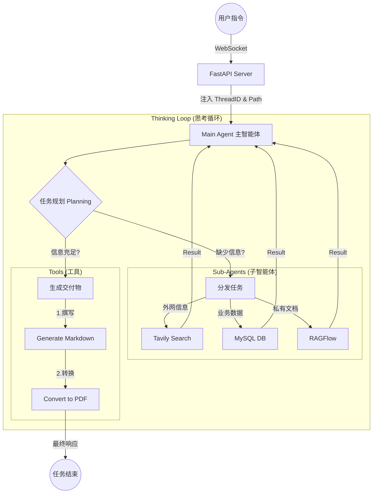
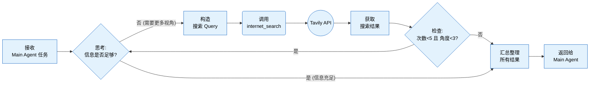
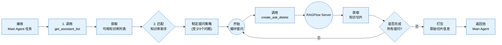

# DeepAgents 深度搜索项目实战

## 一、深度搜索项目介绍

本项目是 DeepAgents 框架的一个典型最佳实践，旨在构建一个**"深度搜索研究员"**。


### 1.1 项目目标
利用DeepAgent 来**模拟人类高级研究员思维**的多路组合智能体系统，以「主智能体统筹 + 多专家子智能体并行协作」为核心架构，突破传统 RAG 单次检索局限，通过**搜索 - 阅读 - 反思 - 再搜索**多轮迭代，深度挖掘海量信息背后的隐藏逻辑，实现**广覆盖、高精准、强可靠**的复杂信息处理与文档生成。

### 1.2 Agent Design
系统采用**1 主 + N 专**多路组合模式，主智能体统一调度，三类专家子智能体各司其职、并行工作：



主智能体（Main Agent）是整个智能团队的 "项目经理" (Leader)。它不直接执行具体的搜索或查询任务，而是专注于理解需求、拆解任务、调度资源、交付结果。

*   **Main Agent (主智能体)**:
    *   **职责**: 项目经理。负责理解用户意图、拆解任务步骤、生成子任务、以及最终汇总报告。
    *   **能力**: 拥有全局视野，管理整个会话的状态和记忆。
*   **Sub Agent (子智能体)**:
    *   网络搜索助手：负责公开知识广域检索，支持由浅入深、多轮递进搜索，最多执行 5 次精准检索，覆盖 3 个以上信息维度。
    *   数据库查询助手：对接企业业务数据库，支持表结构读取、数据预览、自定义 SQL 查询，精准提取商品 / 业务明细数据。
    *   RAGFlow 助手：对接企业私有知识库，先获取可用助手列表，再分层提问、深度检索，确保内部专有信息安全可用。

### 1.3 工具体系
我们为 Agent 装备了硬核的工具库：

主智能体工具

1. **generate_markdown** —— 生成标准 Markdown 文档
2. **convert_md_to_pdf** —— 将 Markdown 转为 PDF 文件
3. **read_file_content**----- 读取每次提问上传的附件

网络搜索助手

1. **internet_search（tavily）** —— 互联网公开信息多轮、多角度检索

数据库查询助手

1. **list_sql_tables** —— 列出数据库所有表结构
2. **get_table_data** —— 读取表数据预览
3. **execute_sql_query** —— 执行自定义 SQL 查询

RAGFlow 知识库助手

1. **get_assistant_list** —— 获取知识库可用助手列表
2. **create_ask_delete** —— 向知识库发起提问查询

### 1.4 技术栈
本项目采用了全异步的高性能架构：

- LangChain / LangGraph / DeepAgent:
  - 介绍 : 项目的“神经中枢”。LangGraph 负责构建 有状态的循环工作流 (StateGraph) ，让 Agent 具备记忆、规划和自我修正能力，打破了传统 LLM 单次问答的限制。
- OpenAI SDK :
  - 介绍 : 调用 GPT-4o / DeepSeek 等大模型的官方接口。通过 bind_tools 实现 Tool Calling（函数调用）。
- Pydantic :
  - 介绍 : 数据校验基石。用于定义 Agent 的状态结构 ( AgentState ) 和工具的输入参数模型，确保数据流转的类型安全。
- FastAPI :
  - 介绍 : 高性能异步 Web 框架。提供 RESTful API 接口，支持文件上传与静态资源托管。
- WebSocket :
  - 介绍 : 全双工通信。用于将 Agent 的 思考过程 (Thinking Process) 和工具执行结果实时推送到前端，提升用户体验。
- Uvicorn :
  - 介绍 : ASGI 服务器，FastAPI 的启动引擎。
- Tavily Search API ( tavily_tools.py ):
  - 介绍 : 专为 AI 设计的搜索引擎。相比 Google，它返回的内容更结构化，不仅包含链接，还包含清洗后的网页正文，极大减少了 Agent 的 Token 消耗。
- RAGFlow ( ragflow_tools.py ):
  - 介绍 : 企业级 RAG 引擎。用于连接本地知识库，支持 PDF、Word 等文档的深度解析与语义检索。
- PyMuPDF (fitz) ( pdf_tools.py ):
  - 介绍 : 高性能 PDF 处理库。用于精准提取 PDF 中的文本和表格，辅助 Agent 阅读文献。
- PyMySQL / SQLAlchemy ( mysql_tools.py ):
  - 介绍 : 数据库连接器。赋予 Agent 操作结构化数据（SQL）的能力，使其能查询业务报表。
- Markdown / File IO ( markdown_tools.py , upload_file_read_tool.py ):
  - 介绍 : 文件读写能力。支持 Markdown 格式的报告生成，以及读取用户上传的任意文本文件。
- Asyncio :
  - 介绍 : Python 异步编程标准库。通过 async/await 实现非阻塞 IO，让 Agent 在等待网络请求（如搜索、LLM 生成）时，服务器仍能响应其他请求。
- ContextVars :
  - 介绍 : 携程上下文变量。在异步并发环境中，像“隐形传态”一样传递 thread_id 和 user_id ，确保日志和工具能正确归属到对应用户，防止数据串线。
- Pathlib :
  - 介绍 : 面向对象的文件路径处理。解决了 Windows/Linux 路径分隔符差异的痛点。
- Shutil :
  - 介绍 : 高级文件操作。用于高效地复制、移动和归档用户上传的文件。


## 二、项目搭建指南

---

### 2.1 创建项目


### 2.2 导入依赖

```toml
aiofiles==25.1.0
aiohappyeyeballs==2.6.1
aiohttp==3.13.3
aiosignal==1.4.0
annotated-doc==0.0.4
annotated-types==0.7.0
anthropic==0.83.0
anyio==4.12.1
arabic-reshaper==3.0.0
asn1crypto==1.5.1
attrs==25.4.0
beartype==0.22.9
bracex==2.6
brotli==1.2.0
certifi==2026.1.4
cffi==2.0.0
charset-normalizer==3.4.4
click==8.3.1
colorama==0.4.6
cryptography==46.0.5
cssselect2==0.9.0
dataclasses-json==0.6.7
deepagents==0.4.3
distro==1.9.0
docstring_parser==0.17.0
et_xmlfile==2.0.0
fastapi==0.129.2
filetype==1.2.0
fonttools==4.61.1
freetype-py==2.5.1
frozenlist==1.8.0
google-auth==2.48.0
google-genai==1.64.0
greenlet==3.3.2
h11==0.16.0
html5lib==1.1
httpcore==1.0.9
httptools==0.7.1
httpx==0.28.1
httpx-sse==0.4.3
idna==3.11
Jinja2==3.1.6
jiter==0.13.0
jsonpatch==1.33
jsonpointer==3.0.0
langchain==1.2.10
langchain-anthropic==1.3.3
langchain-classic==1.0.1
langchain-community==0.4.1
langchain-core==1.2.14
langchain-google-genai==4.2.1
langchain-openai==1.1.10
langchain-text-splitters==1.1.1
langgraph==1.0.9
langgraph-checkpoint==4.0.0
langgraph-prebuilt==1.0.8
langgraph-sdk==0.3.8
langsmith==0.7.6
lxml==6.0.2
Markdown==3.10.2
MarkupSafe==3.0.3
marshmallow==3.26.2
md2pdf==3.1.0
multidict==6.7.1
mypy_extensions==1.1.0
mysql-connector-python==9.6.0
numpy==2.4.2
openai==2.21.0
openpyxl==3.1.5
orjson==3.11.7
ormsgpack==1.12.2
oscrypto==1.3.0
packaging==26.0
pandas==3.0.1
pillow==12.1.1
propcache==0.4.1
pyasn1==0.6.2
pyasn1_modules==0.4.2
pycairo==1.29.0
pycparser==3.0
pydantic==2.12.5
pydantic-settings==2.13.1
pydantic_core==2.41.5
pydyf==0.12.1
Pygments==2.19.2
pyHanko==0.33.0
pyhanko-certvalidator==0.29.1
pymdown-extensions==10.21
pypdf==6.7.2
pyphen==0.17.2
python-bidi==0.6.7
python-dateutil==2.9.0.post0
python-docx==1.2.0
python-dotenv==1.2.1
python-frontmatter==1.1.0
python-multipart==0.0.22
pywin32==311
PyYAML==6.0.3
ragflow-sdk==0.24.0
regex==2026.2.19
reportlab==4.4.10
requests==2.32.5
requests-toolbelt==1.0.0
rlPyCairo==0.4.0
rsa==4.9.1
six==1.17.0
sniffio==1.3.1
SQLAlchemy==2.0.46
starlette==0.52.1
svglib==1.6.0
tavily-python==0.7.21
tenacity==9.1.4
tiktoken==0.12.0
tinycss2==1.5.1
tinyhtml5==2.0.0
tqdm==4.67.3
typing-inspect==0.9.0
typing-inspection==0.4.2
typing_extensions==4.15.0
tzdata==2025.3
tzlocal==5.3.1
uritools==6.0.1
urllib3==2.6.3
uuid_utils==0.14.1
uvicorn==0.41.0
watchfiles==1.1.1
wcmatch==10.1
weasyprint==68.1
webencodings==0.5.1
websockets==15.0.1
xhtml2pdf==0.2.17
xxhash==3.6.0
yarl==1.22.0
zopfli==0.4.1
zstandard==0.25.0
```

**安装依赖：**

1. 将资料中requirements.txt文件粘贴到项目根路径下

2. 使用命令进行批量安装

   ```cmd
   pip install -r requirements.txt
   ```

### 2.3 项目包结构

请按照以下结构创建目录和空文件

```cmd
deep_agent_project/
├── agent/
│   ├── sub_agents		    # [核心] 存储subagents数据
│   └── main_agent.py       # [核心] 智能体组装与执行逻辑
├── api/
│   ├── __init__.py
│   ├── context.py          # [核心] ContextVars 会话隔离  task_utils
│   ├── monitor.py          # [核心] WebSocket 监控单例    sse_utils
│   └── server.py           # [入口] FastAPI 服务端
├── prompt/
│   └── prompts.yaml        # [核心] 所有 Prompt 配置文件   系统提示词 / 子智能体的配置name..
├── tools/
│   ├── __init__.py         # 工具导出
│   ├── tavily_tools.py     # 搜索工具
│   ├── mysql_tools.py      # 数据库工具  3
│   ├── ragflow_tools.py    # RAG 工具  2
│   ├── markdown_tools.py   # 文件生成
│   ├── pdf_tools.py        # PDF 转换
│   └── upload_file_read_tool.py # 文件读取
├── ui/                     # 存储前端项目 node环境运行
├── output/                 # 自动生成，存放会话产物
├── updated/                # 用户上传文件存放区
├── .env                    # 环境变量
```

### 2.4 基础导入

在开始写智能体之前，先导入一些基础类和前端工程：**日志、监控、会话隔离以及UI前端先导入**。

#### 2.4.1 导入前端项目

**环境准备**

- 安装 Node.js，**推荐版本 20.19.0**（可通过 `nvm` 或 Node 官网安装包配置）
- 验证安装：执行 `node -v`，确认输出版本为 v20.19.0 及以上

**项目文件部署**

将 `资料/ui` 目录完整复制到当前项目根目录下

**启动服务**

打开终端，执行以下命令：

```bash
# 进入UI目录
cd ui
# 启动开发服务
npm run dev
```

**访问测试**

服务启动成功后，在浏览器访问：

```
http://localhost:5173
```


补充说明

- 若启动报错，优先检查：Node 版本是否匹配、ui 目录下 `package.json` 依赖是否完整（可执行 `npm install` 安装依赖）
- 端口 5173 被占用时，可修改 ui 目录下的配置文件（如 `vite.config.js`）调整端口

#### 2.4.2 api通信相关

以下是项目中需导入的四个核心类:

1. **server.py** —服务入口

   接收客户请求（API 接口）、分配唯一标识（Thread ID），将任务派给后台异步处理，同时通过 WebSocket 实时反馈进度。

2. **context.py** —数据隔离

   为任务打上专属标识，支持任意环节快速获取任务身份，核心实现多任务(请求)数据隔离，避免信息串混。

3. **monitor.py** —实时反馈

   收集后台任务执行状态，结合任务标识精准推送消息，解决后台与前台的跨线程通信问题。


##### 2.4.2.1 会话数据（`api/context.py`)

**说明**：使用 `ContextVars` 确保不同用户的请求（协程）在服务器内部是完全隔离的，不会混淆文件路径。

```python
from contextvars import ContextVar
from typing import Optional

# =================================================================================================
# 核心知识点: ContextVars (上下文变量)
# =================================================================================================
# Q: 为什么我们需要 ContextVar？为什么不能直接用全局变量？
#
# A: 在开发异步 Web 服务 (如 FastAPI) 时，系统是 "并发" 处理多个用户请求的。
#    但在 Python 的 asyncio 机制下，这些并发请求通常运行在 *同一个线程 (Thread)* 中。
#
#    1. 如果使用全局变量 (Global Variable):
#       当 User A 的请求正在处理时，User B 的请求进来了。如果修改了全局变量，User A 的数据
#       就会被 User B 覆盖，导致严重的 "串台" 事故（例如 User A 的文件存到了 User B 的目录）。
#
#    2. 如果使用 threading.local:
#       它是基于线程隔离的。因为 asyncio 所有协程都在同一个线程跑，所以 threading.local 
#       在异步场景下失效，无法隔离不同用户的请求。
#
#    3. ContextVar 的解决方案:
#       ContextVar 是 Python 3.7+ 专门为异步编程设计的 "协程级局部变量"。
#       它能确保变量在每一个 asyncio Task (即每个用户请求) 中是 *独立隔离* 的。
#       无论代码调用多深，只要是在同一个请求链路（Context）中，get() 到的都是属于当前请求的数据。
# =================================================================================================


# 定义 ContextVar 上下文变量
# -------------------------------------------------------------------------
# 这里的变量名只是一个标识符 (Identifier)，真正的值是存储在当前的 Context 环境中的。

# - 作用 ：用来记录 “当前是谁在执行任务” 。
# - 场景 ：当 Agent 打印日志或者通过 WebSocket 给前端发消息时，它需要知道：“我现在是正在服务张三，还是李四？” 这样消息才不会发错人。
_session_dir_ctx: ContextVar[Optional[str]] = ContextVar("session_dir", default=None)

# - 作用 ：用来记录 “当前是谁在执行任务” 。
# - 场景 ：当 Agent 打印日志或者通过 WebSocket 给前端发消息时，它需要知道：“我现在是正在服务张三，还是李四？” 这样消息才不会发错人。
_thread_id_ctx: ContextVar[Optional[str]] = ContextVar("thread_id", default=None)


def set_session_context(path: str):
    """
    设置当前请求链路的会话目录。
    通常在 Agent 开始执行任务前调用。
    
    Returns:
        Token: 返回一个 Token 对象，后续可用它来恢复(reset)变量状态。
    """
    return _session_dir_ctx.set(path)

def get_session_context() -> Optional[str]:
    """
    获取当前请求链路的会话目录。
    可以在任何深层调用的工具函数中直接使用，无需层层传递参数。
    """
    return _session_dir_ctx.get()

def set_thread_context(thread_id: str):
    """
    设置当前请求链路的 Thread ID。
    """
    return _thread_id_ctx.set(thread_id)

def get_thread_context() -> Optional[str]:
    """
    获取当前请求链路的 Thread ID。
    """
    return _thread_id_ctx.get()

def reset_session_context(session_token, thread_token=None):
    """
    清理/重置上下文。
    通常在请求处理结束 (finally 块) 中调用，防止内存泄漏或污染后续请求。
    """
    _session_dir_ctx.reset(session_token)
    if thread_token:
        _thread_id_ctx.reset(thread_token)
```

##### 2.4.2.2 实时监控 (`api/monitor.py`)

**说明**：这是一个单例（Singleton）类，负责将智能体的内部思考过程实时推送到前端 WebSocket。

```python
import datetime
import asyncio
from typing import Any, Dict, Optional
from fastapi import WebSocket
from api.context import get_thread_context

# 尝试导入全局运行时（用于脚本模式下的流式输出）
try:
    import builtins
except ImportError:
    builtins = None


class ToolMonitor:
    """
    工具监控类，用于在工具执行过程中上报进度和状态。
    设计为单例模式，可在任何工具中直接导入使用。
    兼容 FastAPI WebSocket 和 脚本运行时的 stream_writer。

    使用示例:
    from api.monitor import monitor

    def my_tool(arg1):
        monitor.report_start("my_tool", {"arg1": arg1})
        ...
        monitor.report_running("my_tool", "正在处理数据...", progress=0.5)
        ...
        monitor.report_end("my_tool", result)
    """
    _instance = None

    def __new__(cls):
        if cls._instance is None:
            cls._instance = super(ToolMonitor, cls).__new__(cls)
            cls._instance.websocket_manager = None  # 预留给 FastAPI WebSocketManager
        return cls._instance

    def set_websocket_manager(self, manager):
        """设置 FastAPI 的 WebSocket 管理器"""
        self.websocket_manager = manager

    def _emit(self, event_type: str, message: str, data: Optional[Dict[str, Any]] = None):
        """内部发送方法"""
        payload = {
            "type": "monitor_event",
            "event": event_type,
            "message": message,
            "data": data or {},
            "timestamp": datetime.datetime.now().isoformat()
        }

        # 1. 优先尝试通过 FastAPI WebSocket 发送 (定向推送)
        if self.websocket_manager:
            try:
                # 获取当前线程 ID
                thread_id = get_thread_context()

                # 确保 loop 已加载
                manager_loop = self.websocket_manager.loop

                if manager_loop:
                    if thread_id:
                        # 检查当前是否在同一个事件循环中
                        try:
                            current_loop = asyncio.get_running_loop()
                        except RuntimeError:
                            current_loop = None

                        if current_loop and current_loop == manager_loop:
                            # 如果在同一个循环中（例如在 create_task 中运行），直接创建任务
                            current_loop.create_task(
                                self.websocket_manager.send_to_thread(payload, thread_id)
                            )
                        else:
                            #  FastAPI 的 WebSocket 依赖异步事件循环，且协程必须在创建它的循环中运行：
                            #  如果当前线程和 WebSocket 管理器在同一个循环（比如在 FastAPI 的接口 / 任务中运行）：直接 create_task 效率最高；
                            #  如果在不同循环 / 不同线程（比如同步线程调用）：必须用 asyncio.run_coroutine_threadsafe（线程安全的方式），否则会报错 “协程在错误的循环中运行”。
                            # 如果在不同线程，使用 threadsafe 方法
                            asyncio.run_coroutine_threadsafe(
                                self.websocket_manager.send_to_thread(payload, thread_id),
                                manager_loop
                            )
                    else:
                        # 如果没有 thread_id，说明可能是系统级消息，或者未上下文环境
                        pass
            except Exception as e:
                print(f"[Monitor] WebSocket send failed: {e}")

        # 2. 尝试通过全局 runtime 输出 (DeepAgents 脚本模式)
        # 这使得 simple_agents.py 中的 MockRuntime 能接收到数据
        if builtins and hasattr(builtins, 'runtime') and hasattr(builtins.runtime, 'stream_writer'):
            try:
                builtins.runtime.stream_writer(payload)
            except Exception:
                pass

        # 3. 控制台保底输出 (方便调试)
        # 加上特殊前缀，方便肉眼识别
        print(f"\n[Monitor:{event_type}] {message}")

    def report_tool(self, tool_name: str, args: Dict[str, Any] = None):
        """报告工具开始执行"""
        self._emit("tool_start", f"开始执行工具: {tool_name}", {"tool_name": tool_name, "args": args})

    def report_assistant(self, assistant_name: str, args: Dict[str, Any] = None):
        """报告正在调用的子智能体进度"""
        self._emit("assistant_call", f"正在调用助手: {assistant_name}",
                   {"assistant_name": assistant_name, "args": args})

    def report_task_result(self, result: str):
        """报告任务最终结果"""
        self._emit("task_result", "任务执行完成", {"result": result})

    def report_session_dir(self, path: str):
        """报告任务工作目录"""
        self._emit("session_created", f"工作目录已创建: {path}", {"path": path})


# 全局单例实例
monitor = ToolMonitor()


class ConnectionManager:
    def __init__(self):
        self.active_connections: Dict[str, WebSocket] = {}
        # 延迟绑定 loop，防止初始化时 loop 不一致
        self.loop = None

    def set_loop(self, loop):
        """显式设置事件循环"""
        self.loop = loop
        monitor.set_websocket_manager(self)
        print(f"[Monitor] ConnectionManager manually bound to loop: {id(self.loop)}")

    async def connect(self, websocket: WebSocket, thread_id: str):
        await websocket.accept()
        self.active_connections[thread_id] = websocket
        print(f"Client connected: {thread_id}")

    def disconnect(self, websocket: WebSocket, thread_id: str):
        if thread_id in self.active_connections:
            del self.active_connections[thread_id]
        print(f"Client disconnected: {thread_id}")

    async def send_personal_message(self, message: str, websocket: WebSocket):
        await websocket.send_text(message)

    async def send_to_thread(self, message: dict, thread_id: str):
        if thread_id in self.active_connections:
            websocket = self.active_connections[thread_id]
            await websocket.send_json(message)


manager = ConnectionManager()
```

##### 2.4.2.3 接口处理`api/server.py`

```python
import uuid
import asyncio
import uvicorn
from pathlib import Path
from fastapi import FastAPI, WebSocket, WebSocketDisconnect, UploadFile, File, Form
from fastapi.responses import FileResponse
from fastapi.middleware.cors import CORSMiddleware
from pydantic import BaseModel
from typing import List
import shutil

# Add project root to sys.path
current_dir = Path(__file__).resolve().parent
project_root = current_dir.parent

# Import agent runner and monitor
# 注意：agent.main_agent 导入时会初始化 main_agent，这可能需要几秒钟
from agent.main_agent import run_deep_agent
from api.monitor import manager

app = FastAPI(title="DeepAgents API")

# 挂载输出目录，以便前端访问生成的静态文件
# 假设输出目录位于项目根目录下的 output
output_dir = project_root / "output"
output_dir.mkdir(exist_ok=True)

# 定义上传目录 updated
updated_dir = project_root / "updated"
updated_dir.mkdir(exist_ok=True)

# 配置 CORS
app.add_middleware(
    CORSMiddleware,
    allow_origins=["*"],
    allow_credentials=True,
    allow_methods=["*"],
    allow_headers=["*"],
)


@app.on_event("startup")
async def startup_event():
    """
    服务启动时，获取当前运行的事件循环，并绑定到 WebSocket 管理器。
    确保后台线程能通过 run_coroutine_threadsafe 准确投递消息。
    """
    loop = asyncio.get_running_loop()
    manager.set_loop(loop)
    print(f"[Server] WebSocket Manager bound to loop: {id(loop)}")


class TaskRequest(BaseModel):
    query: str
    thread_id: str = None


@app.post("/api/task")
async def run_task(request: TaskRequest):
    """
    智能体任务启动接口 (Run Agent Task)。

    目标：
    1. 接收用户的自然语言指令。
    2. 在后台异步启动 Agent 执行逻辑。
    3. 返回会话 ID，供前端通过 WebSocket 订阅实时进度。

    执行步骤：
    1. 获取或生成 thread_id。
    2. 触发异步任务 (asyncio.create_task)。
    3. 立即返回响应，不阻塞 HTTP 线程。

    Args:
        request (TaskRequest): 包含用户 query 和可选 thread_id 的请求体。
    """
    # 1. [ID 初始化]
    thread_id = request.thread_id or str(uuid.uuid4())

    # 2. [后台执行] 异步运行 Agent，不阻塞主线程
    # 注意：这里简单的使用 asyncio.create_task 触发，由 main_agent 内部负责实时推送
    asyncio.create_task(run_deep_agent(request.query, thread_id))

    # 3. [立即响应]
    return {"status": "started", "thread_id": thread_id}


@app.post("/api/upload")
async def upload_files(files: List[UploadFile] = File(...), thread_id: str = Form(...)):
    """
    文件上传接口 (File Upload)。

    目标：
    1. 接收用户上传的一个或多个文件。
    2. 保存到 `updated/session_{thread_id}` 目录。
    3. 供 Agent 在后续任务中读取和分析。

    Args:
        files (List[UploadFile]): 文件对象列表。
        thread_id (str): 关联的任务会话 ID。
    """
    # 1. [目录准备] 确保上传目录存在
    target_dir = updated_dir / f"session_{thread_id}"
    target_dir.mkdir(parents=True, exist_ok=True)

    saved_files = []
    # 2. [保存] 遍历并写入文件
    for file in files:
        file_path = target_dir / file.filename
        # 使用二进制模式写入，支持各种文件格式 (图片、PDF、文本等)
        # shutil.copyfileobj 高效复制文件流，避免一次性加载大文件到内存
        with file_path.open("wb") as buffer:
            shutil.copyfileobj(file.file, buffer)
        saved_files.append(file.filename)

    # 3. [响应] 返回成功保存的文件列表
    return {"status": "uploaded", "files": saved_files}


@app.get("/api/download")
async def download_file(path: str):
    """
    文件下载接口 (File Download)。

    目标：
    1. 根据绝对路径下载文件。
    2. 严格的安全检查，防止越权访问。

    Args:
        path (str): 文件的绝对路径 (通常从 list_files 接口获取)。
    """
    # 1. [安全检查] 路径解析与越权校验
    try:
        abs_path = Path(path).resolve()
        output_abs = output_dir.resolve()

        # 必须确保请求的文件在 output 目录下
        if not abs_path.is_relative_to(output_abs):
            return {"error": "拒绝访问: 只能下载输出目录下的文件"}
    except Exception:
        return {"error": "无效的路径参数"}

    # 2. [存在性检查]
    if not abs_path.exists():
        return {"error": "文件不存在"}

    # 3. [响应] 返回文件流 (浏览器自动触发下载)
    return FileResponse(abs_path, filename=abs_path.name)


@app.get("/api/files")
async def list_files(path: str):
    """
    文件列表查询接口 (File Explorer)。

    目标：
    1. 列出指定目录下的所有生成文件。
    2. 提供文件元数据（大小、时间、下载链接）。
    3. 严格的安全检查，防止路径遍历攻击。

    Args:
        path (str): 目标目录的绝对路径 (必须在 output 目录下)。
    """
    # 1. [调试] 打印请求路径
    print(f"[DEBUG] 请求文件列表: {path}")

    try:
        # 2. [解析] 获取绝对路径对象
        abs_path = Path(path).resolve()
        output_abs = output_dir.resolve()

        # 3. [安全] 检查路径是否越界 (Path Traversal Check)
        if not abs_path.is_relative_to(output_abs):
            print(f"[ERROR] 拒绝访问: {abs_path} 不在 {output_abs} 目录下")
            return {"error": "拒绝访问: 只能访问输出目录下的文件"}

    except Exception as e:
        print(f"[ERROR] 路径解析失败: {e}")
        return {"error": f"路径无效: {e}"}

    # 4. [检查] 目录是否存在
    if not abs_path.exists():
        return {"error": "目录不存在"}

    files = []
    try:
        # 5. [遍历] 递归查找所有文件
        for file_path in abs_path.rglob("*"):
            if file_path.is_file():
                # 计算相对路径，生成下载 URL
                stat = file_path.stat()
                files.append({
                    "name": file_path.name,
                    "type": "file",
                    "path": str(file_path),
                    # "url": f"/outputs/{url_path}",
                    "size": stat.st_size,
                    "mtime": stat.st_mtime
                })

    except Exception as e:
        print(f"[ERROR] 遍历文件失败: {e}")
        return {"error": str(e)}

    # 6. [排序] 按修改时间倒序排列 (最新的在前)
    files.sort(key=lambda x: x.get("mtime", 0), reverse=True)
    print(f"[DEBUG] 找到 {len(files)} 个文件")
    return {"files": files}

# 当浏览器请求 ws://localhost:8000/ws/thread_123 时：
# 1. 路由匹配 ：FastAPI 发现这个 URL 匹配了你写的 @app.websocket("/ws/{thread_id}") 。
# 2. 创建对象 ：FastAPI (基于 Starlette) 会立刻在 主事件循环 中实例化一个 WebSocket 对象。
#    - 这个对象封装了底层的 TCP 连接、HTTP 握手信息、以及后续的消息收发方法 ( send_text , receive_text 等)。
# 3. 注入参数 ：FastAPI 自动把这个刚创建好的 WebSocket 对象，作为参数传给你的 websocket_endpoint(websocket, ...) 函数。
@app.websocket("/ws/{thread_id}")
async def websocket_endpoint(websocket: WebSocket, thread_id: str):
    """
    WebSocket 实时通讯核心接口 (Real-time Communication)。

    目标：
    1. 建立长连接，实现服务端与前端的双向通信。
    2. 绑定 `thread_id`，实现会话级消息隔离。
    3. 维持心跳 (Keep-Alive)，防止连接超时。

    执行步骤：
    1. 握手：接受 WebSocket 连接请求。
    2. 注册：将连接实例绑定到 `monitor.manager`，关联 `thread_id`。
    3. 循环：进入消息监听循环，处理前端发送的心跳或指令。
    4. 异常：捕获断开连接异常，清理资源。

    Args:
        websocket (WebSocket): WebSocket 连接实例。
        thread_id (str): 当前会话的唯一标识。
    """
    # 1. [注册] 建立连接并绑定到管理器
    await manager.connect(websocket, thread_id)

    try:
        # 2. [循环] 保持连接活跃
        while True:
            # 3. [监听] 接收前端消息 (通常是 ping 心跳)
            data = await websocket.receive_text()

            # 4. [响应] 回复 pong 消息
            await websocket.send_json({
                "type": "pong",
                "message": f"服务端已收到: {data}"
            })

    except WebSocketDisconnect:
        # 5. [清理] 客户端主动断开
        manager.disconnect(websocket, thread_id)
        print(f"[WebSocket] 客户端已断开: {thread_id}")

    except Exception as e:
        # 6. [异常] 发生错误时断开
        print(f"[WebSocket] 连接异常: {e}")
        manager.disconnect(websocket, thread_id)


if __name__ == "__main__":
    uvicorn.run("api.server:app", host="0.0.0.0", port=8000, reload=True)
```

#### 2.4.3 配置文件

创建文件：根路径/.env

```ini
#RAGFLOW_API_URL=http://121.4.54.247
#RAGFLOW_API_KEY=ragflow-g3YmVhYzEyNGNlNDExZjBhMWEwNzZjYT
RAGFLOW_API_URL=http://129.211.218.165
# 你的 RAGFlow 服务地址
RAGFLOW_API_KEY=ragflow-gyMTY2NzM2MTA1ZDExZjE4OWZkNWUwNj
# 你的 API 密钥
# LLM配置
OPENAI_BASE_URL=https://dashscope.aliyuncs.com/compatible-mode/v1
OPENAI_API_KEY=sk-64c4d4ff41d1481ba0d39f4aa9466757
LLM_QWEN2.5=qwen2.5-14b-instruct
LLM_QWEN3=qwen3-32b
LLM_QWEN_MAX=qwen-max

#tavily-api-key
TAVILY_API_KEY=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

# 数据库相关配置
MYSQL_USER=root
MYSQL_PASSWORD=root
MYSQL_DATABASE=pharma_db
MYSQL_HOST=localhost
MYSQL_PORT=3306
```

#### 2.4.4 导入工具

文件：`utils/word_converter.py`

> 负责将md转成pdf的工具类  MD → HTML → Word → PDF

```python
import logging
import os
from pathlib import Path
import time

try:
    import markdown
    import win32com.client
    import pythoncom
except ImportError:
    pass

def convert_md_to_pdf_via_word(md_abs_path: Path, pdf_abs_path: Path) -> str:
    """
    使用 Microsoft Word COM 接口将 Markdown 转换为 PDF。
    依赖：pywin32, markdown
    """
    temp_html_path = md_abs_path.with_suffix('.temp.html')
    word_app = None

    try:
        # 1. MD 转 HTML
        with open(md_abs_path, 'r', encoding='utf-8') as f:
            md_content = f.read()

        html_body = markdown.markdown(md_content, extensions=['tables', 'fenced_code'])
        html_content = f"""
        <html>
        <head>
            <meta charset="UTF-8">
            <style>
                body {{ font-family: "Microsoft YaHei", "SimHei", sans-serif; }}
                table {{ border-collapse: collapse; width: 100%; }}
                th, td {{ border: 1px solid black; padding: 8px; }}
                pre {{ background-color: #f5f5f5; padding: 10px; border-radius: 4px; }}
                code {{ font-family: "Consolas", "Monaco", monospace; }}
            </style>
        </head>
        <body>
            {html_body}
        </body>
        </html>
        """

        with open(temp_html_path, 'w', encoding='utf-8') as f:
            f.write(html_content)

        # 2. 调用 Word COM
        pythoncom.CoInitialize()
        word_app = win32com.client.Dispatch('Word.Application')
        word_app.Visible = False
        word_app.DisplayAlerts = False

        doc = word_app.Documents.Open(str(temp_html_path.resolve()))
        doc.SaveAs(str(pdf_abs_path.resolve()), FileFormat=17) # wdFormatPDF = 17
        doc.Close(SaveChanges=0)

        if pdf_abs_path.exists():
            return f"成功转换: {pdf_abs_path} (Word引擎)"
        else:
            return f"转换完成但未生成文件: {pdf_abs_path}"

    except ImportError:
        return "缺少依赖库，请安装: pip install pywin32 markdown"
    except Exception as e:
        logging.error(f"Word转换PDF失败: {e}", exc_info=True)
        return f"转换失败: {str(e)}"

    finally:
        # 3. 资源清理
        if word_app:
            try:
                word_app.Quit()
            except:
                pass
        
        if temp_html_path.exists():
            try:
                temp_html_path.unlink()
            except:
                pass
        
        try:
            pythoncom.CoUninitialize()
        except:
            pass
```

文件：`utils/path_utils.py`

> 处理路径工具，确保路径处于当前会话下！并且去掉大模型生成的虚拟路径！

```python
import os
from pathlib import Path
from typing import Optional


def resolve_path(filename: str, session_dir: Optional[str] = None) -> str:
    import os
from pathlib import Path
from typing import Optional

def resolve_path(filename: str, session_dir: Optional[str] = None) -> str:
    """
    统一的文件路径解析工具方法。

    核心功能：
    1. 清洗虚拟路径前缀 (/workspace, /mnt/data, /home/user)
    2. 识别 updated/ 目录，优先相对于项目根目录解析
    3. 结合 session_dir 处理相对/绝对路径，保证路径隔离
    4. 防止路径嵌套 (session_id/session_id)

    场景示例（基于测试环境：Windows系统、session_dir=D:/Project/output/session_123、CWD=D:/Project）：
    | 输入场景                | filename                          | session_dir                      | 核心操作                          | 最终结果                          |
    |-------------------------|-----------------------------------|----------------------------------|-----------------------------------|-----------------------------------|
    | 虚拟路径清洗            | /workspace/report.md              | D:/Project/output/session_123    | 剥离/workspace → 拼接到会话目录   | D:/Project/output/session_123/report.md |
    | updated/ 特殊处理       | abc/updated/upload/file.pdf       | D:/Project/output/session_123    | 提取updated/后路径 → 解析到CWD    | D:/Project/updated/upload/file.pdf |
    | 无会话目录              | sub/test.md                       | None                             | 直接解析为CWD下绝对路径           | D:/Project/sub/test.md            |
    | 绝对路径（会话内）      | D:/Project/output/session_123/sub/report.md | D:/Project/output/session_123 | 验证在会话内 → 无嵌套 → 直接返回  | D:/Project/output/session_123/sub/report.md |
    | 绝对路径（会话外）      | D:/OtherDir/file.md               | D:/Project/output/session_123    | 验证不在会话内 → 保留原路径       | D:/OtherDir/file.md               |
    | Windows Unix风格绝对路径 | /sub/test.md                      | D:/Project/output/session_123    | /开头无盘符 → 拼接到会话目录      | D:/Project/output/session_123/sub/test.md |
    | 路径嵌套防护            | D:/Project/output/session_123/session_123/report.md | D:/Project/output/session_123 | 检测连续session_123 → 修正路径   | D:/Project/output/session_123/report.md |
    | 相对路径（含session名） | session_123/report.md             | D:/Project/output/session_123    | 含session名 → 防止嵌套 → 会话目录+文件名 | D:/Project/output/session_123/report.md |
    | 相对路径（output前缀）  | output/report.md                  | D:/Project/output/session_123    | 含output前缀 → 会话目录+文件名    | D:/Project/output/session_123/report.md |
    | 普通相对路径            | sub1/sub2/test.md                 | D:/Project/output/session_123    | 无特殊标识 → 拼接到会话目录       | D:/Project/output/session_123/sub1/sub2/test.md |
    | 虚拟路径+updated        | /mnt/data/updated/doc.md          | D:/Project/output/session_123    | 剥离/mnt/data → 触发updated处理   | D:/Project/updated/doc.md         |
    | Linux系统绝对路径       | /home/user/test.md                | /data/session_123（Linux）       | 剥离/home/user → 拼接到Linux会话目录 | /data/session_123/test.md         |

    Args:
        filename (str): 输入的文件名或路径
        session_dir (str, optional): 会话上下文目录

    Returns:
        str: 解析后的绝对路径
    """
    path = Path(filename)
    path_str = filename.replace("\\", "/")  # 统一处理字符串匹配

    # 1. 虚拟路径清洗
    virtual_prefixes = ["/workspace", "/mnt/data", "/home/user"]
    for prefix in virtual_prefixes:
        if path_str.startswith(prefix):
            # 去掉前缀
            cleaned = path_str[len(prefix):].lstrip("/")
            path = Path(cleaned)
            path_str = str(path).replace("\\", "/")
            break

    # 2. 特殊处理：updated/ (用户上传文件)
    # 只要路径中包含 updated/，就提取其后半部分，并相对于 CWD 解析
    if "updated/" in path_str:
        idx = path_str.find("updated/")
        relative_part = path_str[idx:]
        return str(Path(relative_part).resolve())

    if not session_dir:
        return str(path.resolve())

    session_path = Path(session_dir).resolve()
    session_name = session_path.name

    # 3. 结合 Session Context

    # 检测 Unix 风格绝对路径 (以 / 开头)
    is_unix_abs = path_str.startswith("/")

    # 如果是绝对路径 (Windows带盘符 或 Unix/开头)
    if path.is_absolute() or (os.name == 'nt' and is_unix_abs):
        # Windows 特殊情况：以 / 开头但无盘符，视为相对路径
        if os.name == 'nt' and is_unix_abs and not path.drive:
            full_path = session_path / path_str.lstrip("/")
        else:
            full_path = path.resolve()

        # 检查是否在 session 目录内
        try:
            # 判断 full_path 是否是 session_path 的子路径
            if session_path in full_path.parents or full_path == session_path:
                # 检查嵌套 (例如 .../session_abc/session_abc/file.txt)
                # 检查路径部分中是否有连续重复的 session_name
                parts = full_path.parts
                for i in range(len(parts) - 1):
                    if parts[i] == session_name and parts[i + 1] == session_name:
                        # 发现嵌套，修正为 session_dir / filename
                        return str(session_path / full_path.name)
                return str(full_path)
        except Exception:
            pass

        # 绝对路径但不在 session_dir 下 -> 保持原样
        return str(full_path)

    else:
        # 相对路径处理
        parts = path.parts

        # 检查是否包含 session_name (避免重复) 或 output/ 前缀
        if session_name in parts:
            return str(session_path / path.name)

        if parts and parts[0] == "output":
            return str(session_path / path.name)

        # 默认：拼接到 session_dir
        return str(session_path / path)
```

## 三、功能开发&测试

### 3.1 大模型准备

#### 3.1.1 检查配置文件

文件：`.env`

```ini
# LLM配置
# 统一使用前文
OPENAI_BASE_URL=https://dashscope.aliyuncs.com/compatible-mode/v1
OPENAI_API_KEY=sk-key
LLM_QWEN2.5=qwen2.5-14b-instruct
LLM_QWEN3=qwen3-32b
LLM_QWEN_MAX=qwen-max
```

#### 3.1.2 创建大模型对象

文件：`agent/llm.py`

```python
from dotenv import load_dotenv, find_dotenv
import os
from langchain.chat_models import init_chat_model

load_dotenv(find_dotenv())

model = init_chat_model(
    model= os.getenv("LLM_QWEN_MAX"),
    model_provider="openai"
)
```

### 3.2 提示词配置&加载

#### 3.2.1 创建提示词配置文件（yml）

文件: `prompt/prompts.yml` 【简化，独立智能体进行优化提示词】

```yml
# Main Agent Configuration
main_agent:
  system_prompt: |
    你是一个沃华医药公司的智能团队负责人，负责协调三个专家助手完成复杂任务
    先占位~~~~~~~~~
# Sub Agents Configuration
sub_agents:
  tavily:
    name: "网络搜索助手"
    description: | 
      负责进行网络知识搜索的智能体助手
    system_prompt: |
      你是一个专业的网络信息查询助手
  db:
    name: "数据库查询助手"
    description:  |
      负责进行数据库查询的智能体助手。
    system_prompt: |
      你是一个专业的数据库查询助手
  ragflow:
    name: "RAGFlow助手"
    description: |
      负责与RAGFlow知识库进行交互的智能体助手
    system_prompt: |
      你是一个专业的RAGFlow知识库助手
```

`|` 被称为**块折叠标量（Literal Block Scalar）**

它是 YAML 里专门用来处理**多行文本**的语法（用 `|` 开头），核心作用是：让你能把需要换行的内容（比如 prompt、描述、长文本）清晰地分行写，YAML 解析时会**完整保留换行格式**，不会把所有内容挤成一行，特别适合写大段的文本配置

#### 3.2.2 读取提示词文件

文件：`agent/prompts.py`

```python
import yaml
from pathlib import Path


# 加载YAML格式的提示词配置文件
def load_prompt(file_path):
    """
    读取并加载YAML格式的提示词配置文件
    Args:
        file_path (str/Path): YAML配置文件的路径
    Returns:
        dict: 解析后的YAML配置字典，包含主智能体和子智能体的提示词配置
    """
    # 以UTF-8编码打开文件，避免中文乱码
    with open(file_path, 'r', encoding="utf-8") as f:
        """
        这是 safe_load 区别于 load 的核心（也是为什么必须用它）：
        yaml.load()：不安全，会解析 YAML 中的「自定义对象 / 执行代码」，如果加载的 YAML 文件被恶意篡改（比如插入了执行系统命令的代码），会导致服务器被攻击、数据泄露；
        yaml.safe_load()：仅解析 YAML 标准数据类型（字符串、数字、字典、列表、布尔值等），完全禁止解析 / 执行任何自定义对象、函数、代码，从根源避免安全风险。
        """
        # 使用safe_load保证加载安全，加载成字典类型
        return yaml.safe_load(f)


# 获取当前脚本文件的父级目录的上一级（项目根目录）
# Path(__file__)：当前脚本文件的绝对路径
# parents[1]：向上追溯两级目录，定位到项目根目录
root_path = Path(__file__).parents[1]

# 拼接提示词配置文件的完整路径（根目录/prompt/prompts.yml）
prompt_file_path = root_path / "prompt" / "prompts.yml"

# 加载YAML配置文件内容
prompt_config_content = load_prompt(prompt_file_path)
# 打印完整配置内容，用于调试验证加载是否成功
print(f"prompt_config_content: {prompt_config_content}")

# 从总配置中提取主智能体的配置（对应prompts.yml中的main_agent节点）
main_agent_config = prompt_config_content["main_agent"]
# 从总配置中提取子智能体的配置（对应prompts.yml中的sub_agents节点）
sub_agents_config = prompt_config_content["sub_agents"]

# 打印拆分后的配置，验证核心配置节点是否正确提取
print(f"main_agent_config: {main_agent_config} , \nsub_agents_config: {sub_agents_config}")
```

### 3.3 Subagents实现

#### 3.3.1 网络搜索助手（network_search_agent）

##### 3.3.1.1 完善信息

* **Agent描述：**

  ```cmd
  负责进行网络知识搜索的智能体助手，当需要从网络中查询数据的时候，可以执行数据检索，在检索后会返回一段检索结果.
  在需要进行非内部信息(不是数据库数据和rag的数据)的公开信息查询时务必使用此助手进行查询。
  ```

* **工具涵盖**：

  `internet_search`: 根据问题进行网络查询，当需要获取外部互联网的公开信息、最新新闻或特定主题数据时使用此工具。

* **提示词思路 **：

  * 强制多维视角：Prompt 中明确要求 "至少检索3个角度"，防止模型只搜一次就草草了事，强迫其进行发散性思维。

  * 防止死循环：设置 "最多进行5次检索" 的硬性约束，防止模型在找不到答案时无限重试，消耗 Token。

  * 广度优先：强调检索 "非内部的公开信息"，明确了其边界，不与数据库和 RAG 助手冲突。

  * 提示词参考：

    ```cmd
    你是一个专业的网络信息查询助手，你可以根据用户的问题，从互联网中检索相关信息，你掌握的工具包括 internet_search 工具，此工具可以根据用户的问题，从互联网中检索非内部的公开信息。
    在检索网络知识的时候，至少检索2个角度的该问题，一共最多进行3次检索，如果超过3次，则不允许继续检索
    ```

* **执行策略**：Agent 接收任务 -> 思考拆解搜索关键词 -> 调用搜索工具 -> 观察结果 -> 决定是否需要补充搜索 -> 汇总信息。



```yaml
sub_agents:  
  tavily:
    name: "网络搜索助手"
    description: | 
      负责进行网络知识搜索的智能体助手，当需要从网络中查询数据的时候，可以执行数据检索，在检索后会返回一段检索结果.
      在需要进行非内部信息的公开信息查询时务必使用此助手进行查询。
    system_prompt: |
      你是一个专业的网络信息查询助手，你可以根据用户的问题，从互联网中检索相关信息，你掌握的工具包括 internet_search 工具，此工具可以根据用户的问题，从互联网中检索非内部的公开信息。
      在检索网络知识的时候，至少检索3个角度的该问题，一共最多进行5次检索，如果超过5次，则不允许继续检索
```

##### 3.3.1.2 tavily搜索工具

**步骤1：定义tavily访问api_key** 

文件: `.env`

直接打开官网：**https://app.tavily.com/ **  **免费版**：每月 **1000 次请求**，完全够用学习 / 开发

```ini
#tavily-api-key
TAVILY_API_KEY=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
```

**步骤2：tavily_tools定义&实现**

位置：`tools/tavily_tools.py`

```python
# ======================== 导入核心依赖 ========================
# 类型注解：增强代码提示和静态检查能力
from typing import  Literal
# LangChain 工具装饰器：将普通函数转为 Agent 可调用的工具
from langchain_core.tools import tool
# Tavily 官方客户端：实现网络搜索核心功能
from tavily import TavilyClient

# 系统/第三方依赖
import os  # 系统路径/环境变量处理
from dotenv import load_dotenv  # 加载 .env 文件中的环境变量

# 自定义模块：工具调用埋点监控（需确保 api 模块可导入）
from api.monitor import monitor

# ======================== 初始化配置 ========================
# 加载项目根目录的 .env 文件，读取环境变量（如 TAVILY_API_KEY）
load_dotenv()

# 初始化 Tavily 客户端（安全读取环境变量中的 API Key）
# 注：TavilyClient 是导入的类，判断是否存在仅为防御性编程，避免导入失败导致的异常
if TavilyClient:
    # 从环境变量读取 API Key，避免硬编码泄露密钥
    tavily_client = TavilyClient(api_key=os.getenv('TAVILY_API_KEY'))
else:
    # 客户端初始化失败时置为 None，后续调用时会返回明确错误
    tavily_client = None

#定义网络搜索工具
@tool
def internet_search(
        query: str,
        max_results: int = 5,
        topic: Literal["general", "news","finance"] = "general",
        include_raw_content: bool = False
):
    """
     根据问题进行网络查询，当需要获取外部互联网的公开信息、最新新闻或特定主题数据时使用此工具
     核心用途：
         当 AI Agent 需要获取外部互联网的公开信息、时效性数据（如新闻、金融动态）时调用，
         替代传统搜索引擎，返回更适配大模型的结构化结果。
     参数说明：
         query: 搜索的核心问题/关键词，例如 "2026年AI行业政策"
         max_results: 控制返回结果数量，免费版建议不超过5
         topic: 限定搜索内容类型，提升结果相关性
         include_raw_content: 是否返回详细新闻，False简略版本 True详细版本
     返回值：
         dict: Tavily API 返回的结构化结果，包含以下核心字段：
             - query: 原始搜索词
             - results: 搜索结果列表，每个元素包含 url、content（摘要）、raw_content（原始内容，可选）等
         str: 初始化失败时返回错误提示字符串
     异常处理：
         捕获搜索过程中的所有异常并重新抛出，确保 Agent 能感知到搜索失败并处理
     """
    if not tavily_client:
        return "Error: 'tavily-python' library is not installed."
    monitor.report_tool("网络搜索工具",{"网络搜索工具":query})
    try:
        results = tavily_client.search(
            query,
            max_results=max_results,
            include_raw_content=include_raw_content,
            topic=topic,
        )
        return results
    except Exception as e:
        raise e
```

##### 3.3.1.3 定义network_search_agent

文件：`agent/sub_agents/network_search_agent.py`

```python

from agent.prompts import sub_agents_config
from tools.tavily_tools import internet_search

network_search_agent = {
    "name":sub_agents_config["tavily"].get("name",""),
    "description":sub_agents_config["tavily"].get("description",""),
    "system_prompt":sub_agents_config["tavily"].get("system_prompt",""),
    "tools": [internet_search]
}
```

#### 3.3.2 数据库查询助手（database_query_agent）

##### 3.3.2.1 完善信息

* **核心职责**：负责查询企业内部结构化数据（如商品库存、销售记录），解决"具体是多少"的精度问题。

* **技术栈**：`Text-to-SQL` (LLM 生成 SQL) + `MySQL Connector`。

* **Agent描述：**

  ```
  负责进行数据库查询的智能体助手。它可以查看数据库中有哪些表，读取表数据和查看表结构，并执行自定义SQL查询以获取精确的业务数据。
  数据库中包含了企业的药品信息、药品库存信息、以及药品销售具体数据，可以看到所有特定商品的一切详细信息。但是数据库中不包含概括性的知识，只包含具体商品的信息。
  ```

* **工具描述**：

  * `list_sql_tables`: 列出配置的 MySQL 数据库中所有可用的表，这是了解数据库结构的第一步。
  * `get_table_data`: 读取指定 MySQL 表的前 100 行数据，用于快速预览数据内容。
  * `execute_sql_query`: 执行自定义 SQL 查询，当需要复杂的筛选、联接或聚合时使用此工具。

* **提示词思路**：

  * **防幻觉机制 **：Prompt 强制规定了 "Step 1: list_tables" 的动作。LLM 只有知道了真实的表名，生成的 SQL 才是可执行的，避免了臆造表名的常见幻觉。

  * **数据理解 **：要求 "Step 2: get_table_data" 预览数据。这让 LLM 理解字段的具体格式（如日期是 '2026-01' 还是 '2026/01'），保证 `WHERE` 条件的准确性。

  * **只读权限**：Prompt 强调 "检索信息"，隐含了不进行 UPDATE/DELETE 操作的安全边界。

  * **提示词参考：**

    ```
    你是一个专业的数据库查询助手。你可以直接与MySQL数据库交互来检索信息。
    你掌握的工具包括：
     1. list_sql_tables: 列出数据库中所有可用的表，这是了解数据库结构的第一步。
     2. get_table_data: 读取指定表的前100行数据，用于快速预览数据内容和表列的信息。
     3. execute_sql_query: 执行自定义SQL查询。当需要复杂的筛选、联接或聚合时使用此工具。
    通常的工作流程是：先列出可用表(list_sql_tables)，确认表名；如果需要，预览表数据了解字段(get_table_data)；最后编写并执行SQL查询(execute_sql_query)以回答用户问题。
    ```

* **执行策略** (三步走)：查表结构 -> 预览数据 -> 执行查询。

* **流程图**：


```yaml
sub_agents:  
 db:
    name: "数据库查询助手"
    description:  |
      负责进行数据库查询的智能体助手。它可以查看数据库中的表结构，读取表数据，并执行自定义SQL查询以获取精确的业务数据。
      数据库中包含了企业的药品商品具体数据，可以看到所有特定商品的一切详细信息。但是数据库中不包含概括性的知识，只包含具体商品的信息。
    system_prompt: |
      你是一个专业的数据库查询助手。你可以直接与MySQL数据库交互来检索信息。
      你掌握的工具包括：
      1. list_sql_tables: 列出数据库中所有可用的表，这是了解数据库结构的第一步。
      2. get_table_data: 读取指定表的前100行数据，用于快速预览数据内容。
      3. execute_sql_query: 执行自定义SQL查询。当需要复杂的筛选、联接或聚合时使用此工具。
      通常的工作流程是：先列出表，确认表名；如果需要，预览表数据了解字段；最后编写并执行SQL查询以回答用户问题。
```

##### 3.3.2.2  数据库搜索工具

**步骤1：准备数据库数据** 

脚本位置：`项目/sql/company_data.sql`

```sql
-- 制药公司核心业务数据库设计
-- 包含：药品信息、库存管理、销售记录
-- 适用于 DeepAgents 结构化数据检索

CREATE DATABASE IF NOT EXISTS pharma_db;
USE pharma_db;

-- 1. 药品信息表 (Drug Details)
-- 记载每一种药品的详情信息
CREATE TABLE drugs (
    drug_id INT PRIMARY KEY AUTO_INCREMENT,
    generic_name VARCHAR(100) NOT NULL,    -- 通用名 (如 布洛芬缓释胶囊)
    brand_name VARCHAR(100),               -- 商品名 (如 芬必得)
    approval_number VARCHAR(50),           -- 批准文号 (国药准字H...)
    specifications VARCHAR(100),           -- 规格 (如 0.3g*24粒/盒)
    dosage_form VARCHAR(50),               -- 剂型 (胶囊/片剂/注射液)
    manufacturer VARCHAR(100),             -- 生产厂家
    therapeutic_area VARCHAR(50),          -- 治疗领域 (如 解热镇痛, 心血管)
    description TEXT,                      -- 药品详情/适应症描述
    created_at TIMESTAMP DEFAULT CURRENT_TIMESTAMP
);

-- 2. 库存表 (Inventory)
-- 记录药品的库存量，通过 drug_id 关联
CREATE TABLE inventory (
    inventory_id INT PRIMARY KEY AUTO_INCREMENT,
    drug_id INT NOT NULL,
    
    batch_number VARCHAR(50) NOT NULL,     -- 生产批号 (医药库存核心字段)
    quantity_on_hand INT DEFAULT 0,        -- 当前库存量 (盒/瓶)
    warehouse_location VARCHAR(50),        -- 仓库位置 (如 A区-01架)
    
    production_date DATE,                  -- 生产日期
    expiry_date DATE,                      -- 有效期至 (用于预警)
    last_updated TIMESTAMP DEFAULT CURRENT_TIMESTAMP ON UPDATE CURRENT_TIMESTAMP,
    
    FOREIGN KEY (drug_id) REFERENCES drugs(drug_id) ON DELETE CASCADE
);

-- 3. 药品销售情况表 (Sales Records)
-- 记录每个药品的销售情况，通过 drug_id 关联
CREATE TABLE sales_records (
    sale_id INT PRIMARY KEY AUTO_INCREMENT,
    drug_id INT NOT NULL,
    
    sale_date DATE NOT NULL,               -- 销售日期
    quantity_sold INT NOT NULL,            -- 销售数量
    unit_price DECIMAL(10, 2),             -- 销售单价
    total_amount DECIMAL(15, 2),           -- 销售总额
    
    customer_name VARCHAR(100),            -- 客户名称 (如 xx第一人民医院, xx大药房)
    region VARCHAR(50),                    -- 销售区域 (用于区域分析)
    sales_rep VARCHAR(50),                 -- 销售代表
    
    FOREIGN KEY (drug_id) REFERENCES drugs(drug_id) ON DELETE CASCADE
);

-- --- 插入模拟数据 (Mock Data) ---

-- 1. 插入 10 种药品信息 (全中文，假设均为我司生产)
INSERT INTO drugs (generic_name, brand_name, approval_number, specifications, dosage_form, manufacturer, therapeutic_area, description)
VALUES 
('阿莫西林胶囊', '阿莫仙', '国药准字H20051234', '0.25g*24粒', '胶囊剂', '本公司制药', '抗生素', '用于治疗敏感菌引起的上呼吸道感染、泌尿生殖道感染等。'),
('布洛芬缓释胶囊', '芬必得', '国药准字H10900089', '0.3g*20粒', '胶囊剂', '本公司制药', '解热镇痛', '用于缓解轻至中度疼痛如头痛、关节痛、偏头痛、牙痛、肌肉痛、神经痛、痛经。也用于普通感冒或流行性感冒引起的发热。'),
('盐酸二甲双胍片', '格华止', '国药准字H20023345', '0.5g*48片', '片剂', '本公司制药', '糖尿病', '首选用于单纯饮食控制不满意的2型糖尿病患者，尤其是肥胖者。'),
('阿托伐他汀钙片', '立普妥', '国药准字H20055567', '20mg*7片', '片剂', '本公司制药', '心血管', '原发性高胆固醇血症患者，包括家族性高胆固醇血症（杂合子型）或混合性高脂血症。'),
('磷酸奥司他韦胶囊', '达菲', '国药准字H20090123', '75mg*10粒', '胶囊剂', '本公司制药', '抗病毒', '用于成人和1岁及1岁以上儿童的甲型和乙型流感治疗。'),
('注射用头孢曲松钠', '罗氏芬', '国药准字H10920012', '1.0g/支', '注射剂', '本公司制药', '抗生素', '用于敏感致病菌所致的下呼吸道感染、尿路、胆道感染，以及腹腔感染、盆腔感染、皮肤软组织感染、骨和关节感染、败血症、脑膜炎等。'),
('蒙脱石散', '思密达', '国药准字H20000456', '3g*10袋', '散剂', '本公司制药', '消化系统', '用于成人及儿童急、慢性腹泻。'),
('硝苯地平控释片', '拜新同', '国药准字H20100345', '30mg*30片', '片剂', '本公司制药', '高血压', '1.高血压。2.冠心病。慢性稳定型心绞痛（劳累性心绞痛）。'),
('阿司匹林肠溶片', '拜阿司匹灵', '国药准字J20130078', '100mg*30片', '片剂', '本公司制药', '心血管', '降低急性心肌梗死疑似患者的发病风险；预防心肌梗死复发。'),
('连花清瘟胶囊', '连花清瘟', '国药准字Z20040063', '0.35g*24粒', '胶囊剂', '本公司制药', '中成药/感冒', '清瘟解毒，宣肺泄热。用于治疗流行性感冒属热毒袭肺证，症见：发热或高热，恶寒，肌肉酸痛，鼻塞流涕，咳嗽，头痛，咽干咽痛。');

-- 2. 插入库存数据 
-- 规则：每种药 3 个批次 (2501批, 2506批, 2511批)
-- 时间：全部平移至 2025 年生产，有效期至 2027 年

INSERT INTO inventory (drug_id, batch_number, quantity_on_hand, warehouse_location, production_date, expiry_date)
VALUES 
-- 1. 阿莫西林
(1, 'MY-250101-A', 5000, '北京一号库-A区', '2025-01-01', '2027-01-01'),
(1, 'MY-250615-B', 8000, '北京二号库-B区', '2025-06-15', '2027-06-14'),
(1, 'MY-251120-C', 12000, '天津一号库-A区', '2025-11-20', '2027-11-19'),

-- 2. 布洛芬
(2, 'MY-250101-A', 2000, '天津二号库-冷藏区', '2025-01-01', '2027-01-01'),
(2, 'MY-250615-B', 15000, '北京一号库-C区', '2025-06-15', '2027-06-14'),
(2, 'MY-251120-C', 30000, '天津一号库-A区', '2025-11-20', '2027-11-19'),

-- 3. 二甲双胍
(3, 'MY-250101-A', 3000, '北京二号库-B区', '2025-01-01', '2027-01-01'),
(3, 'MY-250615-B', 4500, '天津二号库-B区', '2025-06-15', '2027-06-14'),
(3, 'MY-251120-C', 6000, '北京一号库-A区', '2025-11-20', '2027-11-19'),

-- 4. 阿托伐他汀
(4, 'MY-250101-A', 1000, '天津一号库-贵重药区', '2025-01-01', '2027-01-01'),
(4, 'MY-250615-B', 2500, '北京二号库-贵重药区', '2025-06-15', '2027-06-14'),
(4, 'MY-251120-C', 4000, '天津二号库-贵重药区', '2025-11-20', '2027-11-19'),

-- 5. 奥司他韦
(5, 'MY-250101-A', 500, '北京一号库-急救药区', '2025-01-01', '2027-01-01'),
(5, 'MY-250615-B', 5000, '天津一号库-急救药区', '2025-06-15', '2027-06-14'),
(5, 'MY-251120-C', 20000, '北京二号库-急救药区', '2025-11-20', '2027-11-19'),

-- 6. 头孢曲松
(6, 'MY-250101-A', 2000, '天津二号库-阴凉库', '2025-01-01', '2027-01-01'),
(6, 'MY-250615-B', 3500, '北京二号库-阴凉库', '2025-06-15', '2027-06-14'),
(6, 'MY-251120-C', 5000, '天津一号库-阴凉库', '2025-11-20', '2027-11-19'),

-- 7. 蒙脱石散
(7, 'MY-250101-A', 4000, '北京一号库-普药区', '2025-01-01', '2027-01-01'),
(7, 'MY-250615-B', 8000, '天津二号库-普药区', '2025-06-15', '2027-06-14'),
(7, 'MY-251120-C', 12000, '北京二号库-普药区', '2025-11-20', '2027-11-19'),

-- 8. 硝苯地平
(8, 'MY-250101-A', 1500, '天津一号库-慢病区', '2025-01-01', '2027-01-01'),
(8, 'MY-250615-B', 3000, '北京一号库-慢病区', '2025-06-15', '2027-06-14'),
(8, 'MY-251120-C', 5000, '天津二号库-慢病区', '2025-11-20', '2027-11-19'),

-- 9. 阿司匹林
(9, 'MY-250101-A', 2000, '北京二号库-常温区', '2025-01-01', '2027-01-01'),
(9, 'MY-250615-B', 4500, '天津一号库-常温区', '2025-06-15', '2027-06-14'),
(9, 'MY-251120-C', 7000, '北京一号库-常温区', '2025-11-20', '2027-11-19'),

-- 10. 连花清瘟
(10, 'MY-250101-A', 10000, '天津二号库-防疫专区', '2025-01-01', '2027-01-01'),
(10, 'MY-250615-B', 50000, '北京二号库-防疫专区', '2025-06-15', '2027-06-14'),
(10, 'MY-251120-C', 100000, '天津一号库-防疫专区', '2025-11-20', '2027-11-19');

-- 3. (可选) 为这 10 种药品初始化销售记录 - 待下一步生成

INSERT INTO sales_records (drug_id, sale_date, quantity_sold, unit_price, total_amount, customer_name, region, sales_rep)
VALUES
-- 1. 阿莫西林
(1, '2025-02-15', 200, 25.00, 5000.00, '北京朝阳医院', '华北区', '北京朝阳销售部'),
(1, '2025-08-10', 500, 24.50, 12250.00, '天津大药房', '华北区', '天津南开销售分部'),

-- 2. 布洛芬
(2, '2025-01-20', 1000, 15.00, 15000.00, '海王星辰连锁', '华东区', '杭州滨江销售部'),
(2, '2025-12-05', 5000, 15.00, 75000.00, '上海华山医院', '华东区', '上海静安销售总部'),

-- 3. 二甲双胍
(3, '2025-03-10', 300, 35.00, 10500.00, '广州中山医院', '华南区', '广州越秀销售部'),
(3, '2025-09-22', 400, 35.00, 14000.00, '深圳人民医院', '华南区', '深圳罗湖销售分部'),

-- 4. 阿托伐他汀
(4, '2025-04-05', 100, 45.00, 4500.00, '成都华西医院', '西南区', '成都武侯销售部'),
(4, '2025-10-18', 150, 45.00, 6750.00, '重庆大药房', '西南区', '重庆渝中销售部'),

-- 5. 奥司他韦
(5, '2025-01-15', 2000, 100.00, 200000.00, '北京协和医院', '华北区', '北京东单销售部'),
(5, '2025-11-01', 5000, 100.00, 500000.00, '黑龙江省医院', '东北区', '哈尔滨香坊销售部'),

-- 6. 头孢曲松
(6, '2025-05-20', 500, 12.00, 6000.00, '武汉同济医院', '华中区', '武汉汉口销售部'),
(6, '2025-07-15', 600, 12.00, 7200.00, '长沙湘雅医院', '华中区', '长沙开福销售部'),

-- 7. 蒙脱石散
(7, '2025-06-01', 1000, 18.00, 18000.00, '杭州第一医院', '华东区', '杭州上城销售部'),
(7, '2025-08-25', 2000, 18.00, 36000.00, '南京鼓楼医院', '华东区', '南京鼓楼销售部'),

-- 8. 硝苯地平
(8, '2025-02-28', 200, 30.00, 6000.00, '西安西京医院', '西北区', '西安新城销售部'),
(8, '2025-11-11', 500, 30.00, 15000.00, '兰州大学第一医院', '西北区', '兰州城关销售部'),

-- 9. 阿司匹林
(9, '2025-03-15', 1000, 10.00, 10000.00, '济南中心医院', '华东区', '济南历下销售部'),
(9, '2025-09-09', 1200, 10.00, 12000.00, '青岛市立医院', '华东区', '青岛市北销售部'),

-- 10. 连花清瘟
(10, '2025-01-10', 10000, 20.00, 200000.00, '石家庄以岭药业', '华北区', '石家庄高新销售部'),
(10, '2025-12-20', 50000, 20.00, 1000000.00, '全国连锁大药房总仓', '全国', '公司大客户部');
```

**步骤2：准备数据库配置**

文件: `.env`

```ini
# 数据库相关配置
MYSQL_USER=root
MYSQL_PASSWORD=root
MYSQL_DATABASE=deepagents_database
MYSQL_HOST=localhost
MYSQL_PORT=3306
```

**步骤3：mysql_tools定义&实现**

```python
import os
from dotenv import load_dotenv
from api.monitor import monitor
from mysql.connector import connect,Error
from typing import Annotated,List
from langchain_core.tools import tool

load_dotenv()

# 加载配置文件方便后续使用
def get_db_config():
    """Get database configuration from environment variables."""
    config = {
        "host": os.getenv("MYSQL_HOST", "localhost"),
        "port": int(os.getenv("MYSQL_PORT", "3306")),
        "user": os.getenv("MYSQL_USER"),
        "password": os.getenv("MYSQL_PASSWORD"),
        "database": os.getenv("MYSQL_DATABASE"),
        "charset": os.getenv("MYSQL_CHARSET", "utf8mb4"),
        "collation": os.getenv("MYSQL_COLLATION", "utf8mb4_unicode_ci"),
        "autocommit": True,
        "sql_mode": os.getenv("MYSQL_SQL_MODE", "TRADITIONAL")
    }
    # 移除 None 值（核心必要操作）
    config = {k: v for k, v in config.items() if v is not None}
	
    # 补充：校验核心配置是否存在（可选但推荐）
    required_keys = ["user", "password", "database"]
    missing_keys = [k for k in required_keys if k not in config]
    if missing_keys:
        raise ValueError(f"缺失数据库核心配置：{', '.join(missing_keys)}")
    
    return config


# 定义查看数据库表的工具
"""
【mysql.connector 核心 API 说明（针对 connect/cursor）】
1. connect 函数：
   - 作用：建立与 MySQL 数据库的连接，返回一个 Connection 对象；
   - 使用方式：connect(**config)，config 为包含 host/user/password 等的字典；
   - 上下文管理器：推荐用 with 语句（with connect(**config) as conn），自动关闭连接，避免资源泄露；
   - 核心属性/方法：
     - conn.cursor(): 创建游标对象（执行 SQL 的核心）；
     - conn.commit(): 提交事务（autocommit=True 时无需手动调用）；
     - conn.close(): 关闭连接（with 语句自动执行）。
2. cursor 游标对象：
   - 作用：执行 SQL 语句、获取查询结果的核心对象；
   - 创建方式：conn.cursor()；
   - 上下文管理器：with conn.cursor() as cursor，自动关闭游标；
   - 核心方法：
     - cursor.execute(sql): 执行单条 SQL 语句（如 SHOW TABLES/SELECT/INSERT）；
     - cursor.executemany(sql, params): 批量执行 SQL 语句（如批量插入）；
     - cursor.close(): 关闭游标（with 语句自动执行）。
3. 【重点】cursor 执行 DQL/DML 后的结果解析：
   ▶ DQL（数据查询语言，如 SELECT/SHOW）：查询类操作，返回「数据结果集」
     - 核心方法：
       1. cursor.fetchall(): 获取所有结果（返回列表，每个元素是元组，如 [(1, '张三'), (2, '李四')]）；
       2. cursor.fetchone(): 获取一条结果（返回元组，如 (1, '张三')，多次调用可遍历所有结果）；
       3. cursor.fetchmany(n): 获取前 n 条结果（返回列表）；
       4. cursor.column_names: 获取查询结果的列名（列表，如 ['id', 'name']）；
     - 解析技巧：将「列名 + 元组结果」转为字典（更易读），如 {'id': 1, 'name': '张三'}。
   ▶ DML（数据操作语言，如 INSERT/UPDATE/DELETE）：修改类操作，无「数据结果集」
     - 核心属性：
       1. cursor.rowcount: 返回受影响的行数（整数，如 INSERT 1 条返回 1，UPDATE 3 条返回 3）；
       2. cursor.lastrowid: INSERT 操作后，返回新增记录的自增 ID（仅对有自增主键的表有效）；
     - 解析技巧：通过 rowcount 判断操作是否生效，lastrowid 获取新增数据的主键。
4. 异常处理：
   - Error: mysql.connector 专属异常类，捕获所有数据库操作异常（如连接失败、SQL 语法错误）；
   - 推荐方式：try-except Error as e 捕获异常，返回友好提示。
"""
@tool
def list_sql_tables() -> Annotated[str, "数据库中可用的表名列表，以逗号分隔"]:
    """
    列出配置的 MySQL 数据库中所有可用的表。
    核心用途：
        AI Agent 需要查看数据库中有哪些表时调用，为后续执行 SQL 查询提供基础信息。
    返回值：
        str: 成功时返回 "可用数据表：表1, 表2, ..."；
             配置缺失时返回错误提示；
             执行异常时返回具体错误信息。
    异常处理：
        捕获数据库连接/执行 SQL 时的所有 Error 异常，返回可读的错误信息，避免 Agent 崩溃。
    """
    # 埋点监控：记录工具调用行为（便于分析工具使用频率）
    monitor.report_tool("数据库表获取工具")
    # 获取数据库配置
    config = get_db_config()
    try:
        # 前置校验：确保必填配置（账号、密码、数据库名）已配置
        if not all([config.get("user"), config.get("password"), config.get("database")]):
            return "错误：数据库配置缺失（缺少MYSQL_USER、MYSQL_PASSWORD、MYSQL_DATABASE配置项）。"
        # 建立数据库连接（with 语句自动管理连接生命周期，无需手动关闭）
        # ** 等价于  connect(host="localhost", port=3306, user="root", password="123456", database="test_db")
        with connect(**config) as conn:
            # 创建游标对象（执行SQL、获取结果的核心对象，with 语句自动关闭）
            with conn.cursor() as cursor:
                # 执行 DQL 语句：查询数据库中所有表名（SHOW TABLES 属于 DQL 范畴）
                cursor.execute("SHOW TABLES")
                # ========== DQL 结果解析 ==========
                # 获取所有查询结果（返回格式：列表嵌套元组，如 [('user',), ('order',)]）
                tables = cursor.fetchall()
                # 处理数据库中无表的情况
                if not tables:
                    return "数据库中未找到任何数据表。"
                # 提取表名（从元组中取出第一个元素，转为易读的字符串列表）
                table_names = [table[0] for table in tables]
                # 返回格式化的表名列表（中文提示更友好）
                return f"可用数据表：{', '.join(table_names)}"
    # 捕获所有数据库相关异常（连接失败、SQL执行错误等）
    except Error as e:
        return f"列出数据表失败：{str(e)}"


@tool
def get_table_data(
        table_name: Annotated[str, "要读取数据的表名"]
) -> Annotated[str, "表的前 100 行数据（CSV 格式）"]:
    """
    读取指定 MySQL 数据表的前 100 行数据，返回 CSV 格式结果。
    """
    # 埋点监控：记录工具调用行为及目标表名
    """
    csv数据结构
    1. 列分隔符	用英文逗号 , 分隔每一列（不能用中文逗号）
    2. 行分隔符	用换行符 \n 分隔每一行数据
    3. 表头（可选）	第一行是列名（id,name,age），可选但推荐加
    4. 数据行	从第二行开始是实际数据，每行字段数和表头一致
    5. 字段类型	所有字段都是字符串（数字也以字符串存储）
    """
    monitor.report_tool("数据库内容浏览工具", {"正在读取的表": table_name})
    # 获取数据库连接配置
    config = get_db_config()

    try:
        # 前置校验：确保数据库账号、密码、库名配置完整
        if not all([config.get("user"), config.get("password"), config.get("database")]):
            return "错误：数据库配置缺失（请检查账号、密码、数据库名）。"

        # 建立数据库连接（with自动管理连接生命周期，无需手动关闭）
        with connect(**config) as conn:
            # 创建游标（执行SQL、获取结果的核心对象，with自动关闭）
            with conn.cursor() as cursor:
                # 这句话是对传入的表名做基础安全清洗，核心是移除 SQL 注入常用的危险字符（反引号、分号;），再按空格拆分只取第一部分，只保留表名的有效核心；比如恶意输入表名"users`; DROP TABLE orders;"，清洗后会变成 "users"，能避免注入风险（仅基础防护，需结合白名单 / 参数化查询更安全）。
                # 基础安全清洗：移除表名中的危险字符，降低SQL注入风险（仅基础防护）
                safe_table_name = table_name.replace("`", "").replace(";", "").split()[0]

                # 执行查询：读取指定表的前100行数据
                cursor.execute(f"SELECT * FROM {safe_table_name} LIMIT 100")

                # 校验结果：cursor.description为空表示表无效/无数据
                # cursor.description 是游标执行SQL后的「结果集元数据」，返回值类型：tuple | None
                # - 有数据/表有效：返回包含列信息的元组（每个元素对应一列的描述）
                # - 无数据/表无效：返回 None
                if cursor.description is None:
                    return f"数据表 {table_name} 为空或表名无效。"

                # 提取列名：从游标描述中获取表的字段名
                # cursor.description 示例（对应user表）：
                # (name, type_code, display_size, internal_size, precision, scale, null_ok)
                # (
                #     ('id', 3, None, 11, 11, 0, False),   # 第一列：id的元数据（字段名、类型、长度等）
                #     ('name', 253, None, 20, 20, 0, True),# 第二列：name的元数据
                #     ('age', 3, None, 11, 11, 0, True)    # 第三列：age的元数据
                # )
                # 代码逻辑：遍历cursor.description的每个元组，取第一个元素（字段名）
                # desc[0] 就是取每个列元组的「字段名」
                # 数据类型：
                #   cursor.description → tuple[tuples, ...]
                #   desc → tuple
                #   desc[0] → str
                #   columns → list[str]
                columns = [desc[0] for desc in cursor.description]
                # columns 示例结果：['id', 'name', 'age']（列表，每个元素是字符串类型的列名）

                # 提取数据行：获取查询结果的所有行（元组列表格式）
                # cursor.fetchall() 会获取SQL执行后的所有数据行
                # 数据类型：
                #   rows → list[tuple, ...]（列表，每个元素是元组，元组内是每行的字段值）
                rows = cursor.fetchall()
                # rows 示例结果：[(1, '张三', 25), (2, '李四', 30)]

                # 转换数据行：将每行元组转为CSV格式字符串
                # 核心逻辑：
                #   1. 遍历rows中的每个元组（每行数据）
                #   2. 用map(str, row)把元组内的所有元素转为字符串（避免数字/字符串混合拼接报错）
                #   3. 用",".join(...)把转成字符串的字段值用逗号连接，形成CSV行
                # 数据类型：
                #   row → tuple（如 (1, '张三', 25)）
                #   map(str, row) → 迭代器（如 ['1', '张三', '25']）
                #   ",".join(...) → str（如 "1,张三,25"）
                #   result → list[str]
                """
                # 示例1：把列表里的每个数字转成浮点数
                nums = [1, 2, 3]
                result = map(float, nums)
                print(list(result))  # 输出：[1.0, 2.0, 3.0]
                
                # 把row里的每个元素转成字符串
                processed = map(str, row)
                # 转成列表查看结果（迭代器需要转列表才能直观看到）
                print(list(processed))
                # 输出：['1', '张三', '25']
                """
                result = [",".join(map(str, row)) for row in rows]
                # result 示例结果：['1,张三,25', '2,李四,30']

                # 构造CSV表头：列名用逗号分隔
                # 核心逻辑：把columns列表（['id', 'name', 'age']）用逗号连接成字符串
                # 数据类型：
                #   columns → list[str]
                #   header → str
                header = ",".join(columns)
                # header 示例结果："id,name,age"

                # 返回完整CSV数据（表头+数据行，每行换行分隔）
                # 核心逻辑：
                #   1. 表头和数据行之间用换行符\n分隔
                #   2. 数据行之间也用\n分隔（因为result是列表，"\n".join(result)会把列表元素用\n连接）
                # 数据类型：
                #   f"{header}\n" + "\n".join(result) → str（完整的CSV格式字符串）
                return f"{header}\n" + "\n".join(result)
                # 最终返回结果示例（字符串类型）：
                # """
                # id,name,age
                # 1,张三,25
                # 2,李四,30
                # """

    # 捕获数据库操作异常并返回友好提示
    except Error as e:
        # logger.error(f"Failed to read table {table_name}: {str(e)}")
        return f"读取数据表 {table_name} 失败：{str(e)}"


@tool
def execute_sql_query(
        query: Annotated[str, "要执行的 SQL 查询语句"]
) -> Annotated[str, "查询结果或成功消息"]:
    """在 MySQL 数据库上执行自定义 SQL 查询。用于复杂查询、联接或特定数据检索。"""
    monitor.report_tool("数据库查询工具")
    # 获取数据库连接配置（账号、密码、库名等）
    config = get_db_config()
    try:
        # 前置校验：确保核心数据库配置（账号、密码、库名）完整
        if not all([config.get("user"), config.get("password"), config.get("database")]):
            return "错误：数据库配置缺失（请检查账号、密码、数据库名）。"
        # 建立数据库连接（with 语句自动管理连接生命周期，无需手动关闭）
        with connect(**config) as conn:
            # 创建游标对象（执行 SQL、获取结果/影响行数的核心对象）
            with conn.cursor() as cursor:
                # 执行传入的自定义 SQL 语句
                cursor.execute(query)
                # ========== 区分 DQL/DML 语句处理结果 ==========
                # cursor.description 不为空 → 是查询类语句（DQL：SELECT/SHOW 等）
                if cursor.description is not None:
                    # 提取查询结果的列名（用于构造返回表头）
                    columns = [desc[0] for desc in cursor.description]
                    # 提取查询结果的所有行数据（元组列表格式）
                    rows = cursor.fetchall()

                    # 处理查询结果为空的情况（有列名但无数据）
                    if not rows:
                        return f"查询执行成功，无数据返回。涉及列名：{', '.join(columns)}"

                    # 构造 CSV 格式的返回结果（表头+数据行）
                    result_lines = []
                    result_lines.append(",".join(columns))  # 追加表头
                    for row in rows:
                        # 每行数据转字符串后用逗号分隔，避免类型拼接报错
                        result_lines.append(",".join(map(str, row)))

                    # 返回完整的 CSV 格式查询结果
                    return "\n".join(result_lines)

                # cursor.description 为空 → 是修改类语句（DML：INSERT/UPDATE/DELETE 等）
                else:
                    # 返回修改操作的执行结果（受影响行数）
                    return f"SQL 执行成功，受影响行数：{cursor.rowcount}"

    # 捕获所有数据库操作异常，返回中文错误提示
    except Error as e:
        # logger.error(f"Failed to execute query: {str(e)}")  # 若有日志模块可启用
        return f"执行 SQL 失败：{str(e)}"
```

##### 3.3.2.3 定义database_query_agent

文件：`agent/sub_agents/database_query_agent.py`

```python
from agent.prompts import sub_agents_config
from tools.mysql_tools import list_sql_tables,get_table_data,execute_sql_query

database_query_agent = {
    "name":sub_agents_config["db"].get("name",""),
    "description":sub_agents_config["db"].get("description",""),
    "system_prompt":sub_agents_config["db"].get("system_prompt",""),
    "tools": [list_sql_tables,get_table_data,execute_sql_query]
}
```

#### 3.3.3 RAGFlow助手（knowledge_base_agent）

##### 3.3.3.1 完善信息

* **核心职责**：负责检索企业私有非结构化文档（如规章制度、技术文档），解决"内部怎么规定"的深度问题。

* **技术栈**：`RAGFlow API` + `Vector Database`。

* **Agent描述：**

  ```
  负责与RAGFlow知识库进行交互的智能体助手，可以查询可用助手列表并向特定助手提问获取知识库内容。
  ```

* **工具描述 (Tool Description)**：

  * `get_assistant_list`: 获取 RAGFlow 中的所有聊天助手信息，并返回组合后的字符串。如果需要知道有哪些助手可用，请使用此工具。
  * `create_ask_delete`: 创建一个新会话，提问一次，然后删除该会话，并返回答案。当需要向特定的 RAGFlow 助手提问时，使用此工具。

* **提示词思路 (Prompt Strategy)**：

  * **动态发现**：Prompt 要求先 `get_assistant_list`。因为知识库可能会动态增加（如新增了 "2025年考勤规定"），Agent 需要先"看"一眼现在的知识库列表，才能精准定位。

  * **饱和式检索**：要求 "至少提问三个不同的问题"。这是为了克服 RAG 检索的片段性，通过多角度提问提高召回率（Recall），确保不遗漏关键条款。

  * **保留原始语义**：Prompt 强调 "不需要进行概括性总结"，要求 "传输原始信息"。这是为了避免 "传话筒效应" 导致的信息失真，把总结权交给 Main Agent。

  * **提示词参考：**

    ```
    你是一个专业的RAGFlow知识库助手。你可以查询当前可用的RAG助手列表，并向指定的助手提问以获取知识库中的信息。
    你掌握的工具包括 get_assistant_list（获取助手列表）和 create_ask_delete（向助手提问）。通常先获取列表，找到合适的助手名称后，再进行提问。
    你需要根据助手列表中提供的助手描述去制定你的问题，不能强行提问助手的描述中无法解决的问题，否则无法得到需要的答案。
    在进行问题查询的时候，先从较高的视角去提问，如果有贴近需求的答案后，再进行更深入的提问。
    至少提问三个不同的问题
    保留检索的全部信息，不需要进行概括性总结，你需要将检索到的原始信息传输给后续
    ```

* **执行策略**：发现知识库 -> 选定目标 -> 多角度提问 -> 获取切片。

* **流程图**：

负责检索企业私有非结构化文档（如规章制度、技术文档），解决"内部怎么规定"的深度问题。



```yaml
ragflow:
    name: "RAGFlow助手"
    description: 负责与RAGFlow知识库进行交互的智能体助手，可以查询可用助手列表并向特定助手提问获取知识库内容。
    system_prompt: |
      你是一个专业的RAGFlow知识库助手。你可以查询当前可用的RAG助手列表，并向指定的助手提问以获取知识库中的信息。
      你掌握的工具包括 get_assistant_list（获取助手列表）和 create_ask_delete（向助手提问）。通常先获取列表，找到合适的助手名称后，再进行提问。
      你需要根据助手列表中提供的助手描述去制定你的问题，不能强行提问助手的描述中无法解决的问题，否则无法得到需要的答案。
      在进行问题查询的时候，先从较高的视角去提问，如果有贴近需求的答案后，再进行更深入的提问。
      至少提问三个不同的问题
      保留检索的全部信息，不需要进行概括性总结，你需要将检索到的原始信息传输给后续
```

##### 3.3.3.2 RAGFlow基本使用

外部教案（资料里）

##### 3.3.3.3 RAGFlow工具定制

**步骤1：定义ragflow访问api_key** 

文件: `.env`

```ini
RAGFLOW_API_URL=http://121.4.54.247
RAGFLOW_API_KEY=ragflow-IyZjA4NzBlMDU2NDExZjE4NzJiNGE1NT
```

**步骤2：ragflow_tools定义&实现**

文件：`tools/ragflow_tools.py`

```python
# 导入系统核心模块
import os
import logging
# 导入自定义监控模块（用于上报工具调用日志）
from api.monitor import monitor
# 导入HTTP请求库（用于健康检查）
import requests
# 导入RAGFlow SDK核心类（用于操作RAGFlow助手/知识库）
from ragflow_sdk import RAGFlow
# 导入环境变量加载工具（用于读取.env文件中的配置）
from dotenv import load_dotenv
# 导入LangChain工具装饰器（用于将函数注册为Agent可调用的工具）
from langchain_core.tools import tool
from typing_extensions import Annotated

# 初始化日志器（用于记录工具运行日志）
logger = logging.getLogger(__name__)

# 导入类型注解（用于函数返回值/参数类型约束）
from typing import Tuple, Optional


def _load_ragflow_env() -> Tuple[Optional[str], Optional[str]]:
    """
    加载RAGFlow的环境变量（API密钥和服务地址）
    优先加载当前脚本目录下的.env文件，若不存在则加载系统环境变量

    Returns:
        Tuple[Optional[str], Optional[str]]:
            - 第一个值：RAGFlow API密钥（RAGFLOW_API_KEY）
            - 第二个值：RAGFlow服务地址（RAGFLOW_API_URL）
            - 若未配置则返回None
    """
    load_dotenv()

    # 从环境变量中读取配置
    api_key = os.getenv("RAGFLOW_API_KEY")
    base_url = os.getenv("RAGFLOW_API_URL")
    return api_key, base_url


@tool
def get_assistant_list(
    dummy_arg: Annotated[str, "不需要输入参数，直接调用即可"] = "",
) -> str:
    """
    【工具功能】获取 RAGFlow 中所有聊天助手信息
    适用场景：Agent 需要确认当前有哪些可用助手，及每个助手绑定的知识库范围时调用
    返回：结构化字符串（助手名称+功能介绍+关联知识库）
    """
    # 埋点监控：记录工具调用行为
    monitor.report_tool("RAGFlow助手列表查询")
    api_key, base_url = _load_ragflow_env()

    # 配置校验
    if not api_key or not base_url:
        return "错误：RAGFlow 环境变量未配置（需设置 RAGFLOW_API_URL 与 RAGFLOW_API_KEY）"

    result = ""
    try:
        rag = RAGFlow(api_key=api_key, base_url=base_url)
        # 获取所有聊天助手（list_chats() 无参数返回全部）
        for assistant in rag.list_chats():
            # 解析助手关联的知识库名称（assistant.datasets 是知识库列表）
            kb_names = []
            if assistant.datasets and isinstance(assistant.datasets, list):
                for dataset in assistant.datasets:
                    if isinstance(dataset, dict) and "name" in dataset:
                        kb_names.append(dataset["name"])
            
            # 格式化知识库名称（无则显示"无"）
            kb_names_str = "、".join(kb_names) if kb_names else "无"
            # 结构化拼接助手信息
            result += f"助手名称：{assistant.name}； 功能介绍：{assistant.description}； 关联知识库：{kb_names_str}\n"

        # 移除末尾多余换行符
        return result.rstrip("\n") if result else "未找到任何聊天助手"
    except Exception as e:
        return f"获取助手列表失败：{str(e)}"


@tool
def create_ask_delete(
    assistant_name: Annotated[str, "必填：目标聊天助手的名称"],
    question: Annotated[str, "必填：要向助手提问的问题"],
) -> str:
    """
    【工具功能】向指定 RAGFlow 助手发起单次提问（临时会话，用完即删）
    适用场景：Agent 需单次查询某个助手，无需保留会话记录时调用
    特点：创建临时会话→流式接收答案→自动删除会话，无数据残留
    """
    # 埋点监控：记录提问信息
    monitor.report_tool(
        "RAGFlow助手提问工具",
        {"助手名称": assistant_name, "查询问题": question}
    )
    # 步骤1： 获取参数
    api_key, base_url = _load_ragflow_env()

    # 步骤2：核心提问逻辑
    try:
        rag = RAGFlow(api_key=api_key, base_url=base_url)
        
        # 按名称筛选目标助手（取第一个匹配结果）
        assistants = rag.list_chats(name=assistant_name)
        if not assistants:
            return f"错误：未找到名为「{assistant_name}」的聊天助手"
        assistant = assistants[0]

        session = None  # 初始化会话对象（用于后续删除）
        try:
            # 创建临时会话（名称自定义，便于识别）
            session = assistant.create_session(name="temp_session_for_single_ask")
            
            # 流式提问（stream=True 逐段接收答案，避免等待全量结果）
            response_generator = session.ask(question, stream=True)
            
            # 收集流式响应（适配 SDK 格式：part.content 为单段答案内容）
            full_answer = ""
            for part in response_generator:
                if hasattr(part, "content") and part.content:
                    full_answer = part.content  # 覆盖更新为完整答案（流式最后一段是完整内容）

            # 埋点监控：记录返回的答案
            monitor.report_tool(
                "RAGFlow助手回答记录",
                {"助手名称": assistant_name, "问题": question, "答案": full_answer}
            )
            
            # 自动删除临时会话（核心：避免会话堆积）
            if session and hasattr(session, "id"):
                assistant.delete_sessions(ids=[session.id])
            
            return full_answer if full_answer else "未获取到助手的回答"

        except Exception as e:
            return f"提问过程失败：{str(e)}"

    except Exception as e:
        return f"RAGFlow 操作失败：{str(e)}"
```

##### 3.3.3.4 定义knowledge_base_agent

文件：`agent/sub_agents/knowledge_base_agent.py`

```python
from agent.prompts import sub_agents_config
from tools.ragflow_tools import get_assistant_list,create_ask_delete

knowledge_base_agent = {
    "name":sub_agents_config["ragflow"].get("name",""),
    "description":sub_agents_config["ragflow"].get("description",""),
    "system_prompt":sub_agents_config["ragflow"].get("system_prompt",""),
    "tools": [get_assistant_list,create_ask_delete]
}
```

### 3.4 MainAgent实现

#### 3.4.1 定义工具(非业务导入)

主智能体工具:

1. **generate_markdown** —— 生成标准 Markdown 文档
2. **convert_md_to_pdf** —— 将 Markdown 转为 PDF 文件
3. **read_file_content ——** 读取上传文件，并解析内容

##### 3.4.1.1 读取上传文件tool

文件：`tools/upload_file_read_tool.py`

```python
import logging
from pathlib import Path
from typing import Annotated, Optional

from langchain_core.tools import tool
from api.monitor import monitor
from api.context import get_session_context
from utils.path_utils import resolve_path

# 尝试导入可选依赖，实现按需加载
try:
    import docx
except ImportError:
    docx = None

try:
    import pypdf
except ImportError:
    pypdf = None

try:
    import pandas as pd
except ImportError:
    pd = None


# def read_file_content(filename: str, instruction: str = "提取全部内容") -> str:
#     """
#     读取指定文件的内容。支持 Markdown(.md)、Word(.docx)、PDF(.pdf) 和 Excel(.xlsx/.xls)。
#     对于 Excel 文件，会自动提供数据统计信息（head 和 describe）。

#     Args:
#         filename: 要读取的文件名或路径（支持 .md, .docx, .pdf, .xlsx, .xls）
#         instruction: 对提取内容的具体指令（例如：'提取摘要', '统计数据'）

@tool
def read_file_content(
        filename: Annotated[str, "要读取的文件名或路径（支持 .md, .docx, .pdf, .xlsx, .xls）"],
        instruction: Annotated[str, "对提取内容的具体指令（例如：'提取摘要', '统计数据'）"] = "提取全部内容"
) -> str:
    """
    读取指定文件的内容。支持 Markdown(.md)、Word(.docx)、PDF(.pdf) 和 Excel(.xlsx/.xls)。
    对于 Excel 文件，会自动提供数据统计信息（head 和 describe）。
    """
    monitor.report_tool("文件内容读取工具", {"filename": filename, "instruction": instruction})

    # ====================== 1. Path 重构路径解析 ======================
    session_dir = get_session_context()
    file_path = Path(resolve_path(filename, session_dir))  # 转为Path对象

    # 检查文件是否存在（替代os.path.exists）
    if not file_path.exists():
        return f"错误：文件 '{filename}' 不存在 (解析路径: {file_path})。"

    # 获取后缀名（替代os.path.splitext，自动转小写）
    ext = file_path.suffix.lower()

    try:
        if ext in ['.md', '.txt']:
            # Path直接读取文本（替代open + os.path）
            return file_path.read_text(encoding='utf-8')

        elif ext == '.docx':
            if docx is None:
                return "错误：未安装 'python-docx' 库，无法读取 Word 文件。"
            doc = docx.Document(str(file_path))  # 转字符串传给docx
            full_text = [para.text for para in doc.paragraphs]
            return '\n'.join(full_text)

        elif ext == '.pdf':
            if pypdf is None:
                return "错误：未安装 'pypdf' 库，无法读取 PDF 文件。"
            reader = pypdf.PdfReader(str(file_path))  # 转字符串传给pypdf
            text = "\n".join([page.extract_text() or "" for page in reader.pages])
            return text

        elif ext in ['.xlsx', '.xls']:
            if pd is None:
                return "错误：未安装 'pandas' 库，无法读取 Excel 文件。"

            try:
                df = pd.read_excel(str(file_path))  # 转字符串传给pandas
            except Exception as e:
                return f"读取 Excel 失败: {str(e)}"

            result = [
                f"文件: {filename}",
                f"行数: {len(df)}, 列数: {len(df.columns)}",
                f"列名: {', '.join(df.columns.astype(str))}",
                "\n[前5行数据预览]:",
                df.head().to_string(index=False),
                "\n[统计描述]:",
                df.describe().to_string()
            ]
            return "\n".join(result)

        else:
            # 尝试作为纯文本读取
            try:
                return file_path.read_text(encoding='utf-8')
            except UnicodeDecodeError:
                return f"错误：不支持的文件格式 '{ext}'，且无法作为文本读取。"

    except Exception as e:
        return f"读取文件出错: {str(e)}"

# ====================== 测试入口（完全按你要求的格式） ======================
if __name__ == '__main__':
    # 1. 固定 session_dir（仅赋值，不Mock）
    def get_session_context():
        return "./test_session_123"

    # 2. 定义测试文件路径
    md_path = "sub_dir/测试文件.md"
    excel_path = "sub_dir/测试数据.xlsx"

    # 3. 测试调用（先测试MD文件，指令用默认）
    result = read_file_content.invoke({
        "filename": md_path
    })
    print("===== 读取MD文件结果 =====")
    print(result)

    # 可选：测试Excel文件（取消注释即可）
    # result_excel = read_file_content.invoke({
    #     "filename": excel_path,
    #     "instruction": "统计数据"
    # })
    # print("\n===== 读取Excel文件结果 =====")
    # print(result_excel)
```

##### 3.4.1.2 生成md文件tool

文件：`tools/markdown_tools.py`

依赖：pip install markdown pywin32

```python
import logging
from pathlib import Path

try:
    from typing import Annotated
except ImportError:
    from typing_extensions import Annotated
from langchain_core.tools import tool
from api.monitor import monitor
from api.context import get_session_context
from utils.path_utils import resolve_path


# Markdown生成工具
@tool
def generate_markdown(
        content: Annotated[str, "要写入Markdown文档的文本内容"],
        filename: Annotated[str, "Markdown文档的文件名（不包含扩展名或包含.md）"],
        path: Annotated[str, "文件保存的绝对路径"] = ""
):
    """根据提供的文本内容，生成对应的Markdown(.md)文件"""
    print(f"路径是{path}")
    monitor.report_tool("Markdown文档生成工具", {"写入的文本内容": content})
    if not filename.endswith('.md'):
        filename += '.md'

    # 获取上下文中的会话目录
    session_dir = get_session_context()
    print(f"⚠️ generate_markdown里拿到的session_dir：{session_dir}")  # 看这里！

    # --- 路径清洗与重定向逻辑 ---
    # 结合 path 和 filename
    if path and path != ".":
        # 使用 Path 拼接，再转为字符串传给 resolve_path
        full_input_path = str(Path(path) / filename)
    else:
        full_input_path = filename
    full_path_str = resolve_path(full_input_path, session_dir)
    file_path = Path(full_path_str)

    # 获取父目录
    parent_dir = file_path.parent

    # 确保目录存在
    print(f"[MarkdownTool] Debug: parent_dir={parent_dir}, filename={filename}, full_path={file_path}")

    try:
        if not parent_dir.exists():
            parent_dir.mkdir(parents=True, exist_ok=True)
            print(f"[MarkdownTool] Created directory: {parent_dir}")

        # 使用 Path 直接写入文本
        file_path.write_text(content, encoding='utf-8')

        print(f"[MarkdownTool] Successfully wrote to: {file_path}")
        return f"Markdown文件 '{file_path}' 已成功生成并保存。"
    except Exception as e:
        print(f"[MarkdownTool] Error writing file: {e}")
        return f"生成Markdown文件失败: {str(e)}"


# -------------------------- 测试代码（仅修改这里，给session_dir配置固定值） --------------------------
if __name__ == "__main__":
    # ========== 核心：覆盖get_session_context的返回值（仅测试时生效） ==========
    # 不用Mock，直接重新定义这个函数，给session_dir赋值！
    def get_session_context():
        """测试专用：给session_dir配置固定初始化值"""
        return "./test_session_123"  # 你要的session_dir初始化值，随便改

    # ========== 极简测试逻辑（只传path/filename，session_dir已初始化） ==========
    test_content = "# 测试文档\n这是给session_dir配置固定值后的测试内容"
    test_filename = "测试文件"  # 无.md后缀，测试自动补全
    test_path = "sub_dir"       # 相对路径

    # 调用生成函数
    print("===== 开始测试（session_dir已配置为：./test_session_123） =====")
    result = generate_markdown.invoke({
        "content": test_content,
        "filename": test_filename,
        "path": test_path
    })

    # 验证结果
    print(f"\n调用结果：{result}")
    if "已成功生成" in result:
        file_path = Path(result.split("'")[1])
        print(f"✅ 验证：文件 {file_path} {'存在' if file_path.exists() else '不存在'}")
```

##### 3.4.1.3 将md转成pdf文件tool

文件：`tools/pdf_tools.py`

```python
import logging
import sys
from pathlib import Path

try:
    from typing import Annotated, Optional
except ImportError:
    from typing_extensions import Annotated, Optional

from langchain_core.tools import tool
from api.monitor import monitor
from api.context import get_session_context
from utils.path_utils import resolve_path
from utils.word_converter import convert_md_to_pdf_via_word


@tool
def convert_md_to_pdf(
        md_filename: Annotated[str, "要转换的Markdown文档路径（包含.md后缀）"],
        pdf_filename: Annotated[Optional[str], "输出的PDF文件路径（可选，默认与源文件同名）"] = None
) -> str:
    """
    将Markdown文档转换为PDF（基于Word引擎）
    核心优化：路径与资源管理逻辑分离，只保留Tool层的基础调用
    """
    monitor.report_tool("Markdown转PDF工具")

    try:
        # 1. 路径预处理
        session_dir = get_session_context()
        md_path = Path(md_filename).with_suffix('.md')
        md_abs_path = Path(resolve_path(str(md_path), session_dir))

        # 2. 检查源文件
        if not md_abs_path.exists():
            return f"错误：文件不存在 {md_abs_path}"

        # 3. 确定输出路径
        if pdf_filename:
            pdf_path = Path(pdf_filename).with_suffix('.pdf')
            pdf_abs_path = Path(resolve_path(str(pdf_path), session_dir))
        else:
            pdf_abs_path = md_abs_path.with_suffix('.pdf')

        # 4. 调用核心转换逻辑
        return convert_md_to_pdf_via_word(md_abs_path, pdf_abs_path)

    except Exception as e:
        logging.error(f"转换失败: {e}", exc_info=True)
        return f"转换失败: {str(e)}"


if __name__ == '__main__':
    # 测试代码
    # 强制覆盖当前模块中的 get_session_context
    get_session_context = lambda: "./test_session_123"

    # 创建测试文件
    Path("./test_session_123/sub_dir").mkdir(parents=True, exist_ok=True)
    with open("./test_session_123/sub_dir/测试文件.md", "w", encoding="utf-8") as f:
        f.write("# 标题\n\n测试内容\n\n|A|B|\n|---|---|\n|1|2|")

    print(convert_md_to_pdf.invoke({"md_filename": "sub_dir/测试文件.md"}))
```

#### 3.4.2 定义mainAgent

文件：`agent/main_agent.py`

```python
from agent.sub_agents.knowledge_base_agent import knowledge_base_agent
from agent.sub_agents.database_query_agent import database_query_agent
from agent.sub_agents.network_search_agent import network_search_agent

# main_agent tool导入
from tools.markdown_tools import generate_markdown
from tools.pdf_tools import convert_md_to_pdf
from tools.upload_file_read_tool import read_file_content

from deepagents import create_deep_agent

from agent.llm import model
from agent.prompts import main_agent_config

from api.monitor import monitor
import asyncio
import uuid
import shutil
from pathlib import Path

from api.context import set_session_context, reset_session_context, set_thread_context

from langchain_core.messages import AIMessage

# 1. 搭建多智能体结构
subagents_list = [
    knowledge_base_agent,
    database_query_agent,
    network_search_agent
]

# 创建主智能体
main_agent = create_deep_agent(
    model=model,
    subagents=subagents_list,
    tools=[generate_markdown, convert_md_to_pdf, read_file_content],
    system_prompt=main_agent_config["system_prompt"]
)
```

#### 3.4.3 辅助函数 [解读即可]

函数1：_prepare_session_environment(thread_id: str)

```python
project_root = Path(__file__).parents[1].resolve()  # 核心：自动识别项目根目录
print(f"----------------project_root-----------------: {project_root}")
def _prepare_session_environment(thread_id: str):
    """
    初始化会话运行环境（会话文件夹,以及相对路径，上传文件的信息！）。
    目标：
    1. 创建独立的物理工作空间。
    2. 处理用户上传的文件。
    3. 生成供 Agent 和前端使用的路径上下文（提示词）。

    执行步骤：
    1. 创建绝对路径：`project_root/output/session_{uuid}`。
    2. 标准化路径：转换为 POSIX 风格 (`/`) 以兼容 LLM 和跨平台。
    3. 文件迁移：将 `updated/session_{uuid}` 中的文件复制到工作目录。
    4. 构造提示词：生成包含已上传文件列表的 Context 文本。

    Returns:
        tuple: (
            session_dir_str (str): 物理工作目录的绝对路径 (当前会话对应文件存储位置)。
            relative_session_dir (str): 相对于项目根目录的路径 (用于提示词)。
            uploaded_info (str): 注入到 Prompt 中的文件列表描述。
        )
    """
    # 1. [创建] 定义并创建会话的绝对输出路径
    session_dir = project_root / "output" / f"session_{thread_id}"
    session_dir.mkdir(parents=True, exist_ok=True)
    
    # 2. [标准化] 路径转为 POSIX 风格 (防止大模型因反斜杠产生幻觉)
    session_dir_str = str(session_dir).replace("\\", "/") 
    
    # 3. [相对化] 获取相对路径 (用于提示词展示，如 "output/session_123")
    relative_session_dir = str(session_dir.relative_to(project_root)).replace("\\", "/")
    
    # 4. [迁移] 检查并处理上传文件
    upload_dir = project_root / "updated" / f"session_{thread_id}"
    uploaded_info = "" 
    
    if upload_dir.exists():
        files = [f.name for f in upload_dir.iterdir() if f.is_file()]
        
        if files:
            for f in files:
                # 核心动作：将文件从临时上传区复制到正式工作区
                shutil.copy2(upload_dir / f, session_dir / f)
            
            # 5. [构造] 生成文件列表提示词
            uploaded_info = (f"\n    [已上传文件] 已加载到工作目录:\n" + 
                             "\n".join([f"    - {f}" for f in files]) + 
                             "\n    请优先使用工具读取并参考这些文件。")
                             
    return session_dir_str, relative_session_dir, uploaded_info
```

函数2：_process_stream_chunk(chunk)

```python
def _process_stream_chunk(chunk):
    """
    处理 LangGraph 流式输出的增量状态 (Stream Processing)。
    目标：
    1. 解析 Agent 的每一步思考和行动。
    2. 识别关键事件（工具调用、子 Agent 委派、最终回复）。
    3. 通过 Monitor 实时上报状态给前端。
    核心逻辑：
    - 监听 `tool_calls` -> 记录日志，若是 'task' 则上报子 Agent 状态。
    - 监听 `content` -> 若无工具调用，则视为 Agent 的最终回复。
    Args:
        chunk (dict): 增量状态字典，如 {"node_name": {"messages": [AIMessage(...)]}}
    """
    # 1. [记录] 记录原始数据便于回溯
    # logger.log_main_chunk(chunk)

    # 2. [遍历] 解析每个节点的输出 (通常是 'agent' 或 'tools' 节点)
    for node_name, state in chunk.items():
        if not state or "messages" not in state: continue
        # 3. [提取] 获取最新一条消息 (Latest Message)
        messages = state["messages"]
        if isinstance(messages, list) and messages:
            last_msg = messages[-1]
            # 4. [分支] 处理 AI 消息 (AIMessage)
            if isinstance(last_msg, AIMessage):
                # Case 1: Agent 决定调用工具 (Tool Call)
                if last_msg.tool_calls:
                    for tool in last_msg.tool_calls:
                        # 特殊处理：如果是 'task' 工具，说明正在委派给子 Agent
                        if tool['name'] == 'task':
                            monitor.report_assistant(
                                tool['args'].get('subagent_type', 'Agent'),
                                {"desc": tool['args'].get('description')}
                            )
                # Case 2: Agent 生成最终回复 (Final Answer)
                elif last_msg.content:
                    monitor.report_task_result(last_msg.content)
```

#### 3.4.4 执行函数

```python
# ====================== 核心执行逻辑 ======================
async def run_deep_agent(task_query: str, thread_id: str = None):
    """
    DeepAgents 核心执行入口 (Agent Execution Runtime)。

    目标：
    1. 接收用户的自然语言任务。
    2. 准备独立的运行环境 (Workspace)。
    3. 启动 LangGraph 智能体，并通过流式 (Stream) 实时处理每一步。
    4. 确保上下文隔离和异常安全。

    执行步骤：
    1. ID 初始化：确保每个任务有唯一的 `thread_id`。
    2. 环境准备：创建目录、迁移文件、生成路径信息。
    3. 上下文绑定：将 `thread_id` 和 `session_dir` 绑定到当前线程 (ContextVar)。
    4. 提示词构建：将环境信息注入到 Prompt。
    5. 流式执行：驱动 LangGraph 运行，并实时解析/上报每一个 Chunk。
    6. 资源清理：任务结束后（无论成功失败）重置上下文。
    """
    # 1. [ID 初始化] 确保有唯一的会话 ID
    if not thread_id: thread_id = str(uuid.uuid4())
    print(f"--- Start Task: {task_query} (Thread: {thread_id}) ---")

    # 2. [环境准备] 创建目录、处理上传文件
    session_dir_str, relative_session_dir, uploaded_info = _prepare_session_environment(thread_id)

    # 3. [上下文绑定] 初始化 ContextVars (关键：隔离并发请求)
    thread_token = set_thread_context(thread_id)
    session_token = set_session_context(session_dir_str)
    # 给前端推送文件夹，方便后续查询当前会话对应文件夹下的所有文件
    monitor.report_session_dir(session_dir_str)

    # 4. [运行时配置] LangChain Config (注入记忆 key)
    config = {
        "configurable": {"thread_id": thread_id},  # 用于 MemorySaver 记忆上下文
    }
    # 5. [提示词构建] 动态注入环境约束
    path_instruction = f"""
    【工作环境指令】
    工作目录: {relative_session_dir}
    {uploaded_info}

    规则：
    1. 新生成文件必须保存到工作目录：'{relative_session_dir}/filename'
    2. 读取已上传的文件时，请直接将文件名（例如：'开篇.txt'）作为 filename 参数传入（read_file_content）读取工具，不要带上任何目录前缀。
    3. 使用相对路径，禁止使用绝对路径
    4. 若存在上传文件，请先分析内容
    """

    # 6. [流式执行] 启动 Agent 循环
    try:
        # astream: 异步生成器，像流水线一样逐个吐出 Agent 的思考片段
        async for chunk in main_agent.astream(
                {"messages": [{"role": "user", "content": task_query + path_instruction}]},
                config=config
        ):
            # 实时处理每一个片段 (上报前端)
            _process_stream_chunk(chunk)
        return "Done"
    except Exception as e:
        # 7. [异常处理] 兜底捕获
        print(f"Error: {e}")
        monitor._emit("error", f"Execution failed: {e}")
        return f"Error: {e}"

    finally:
        # 8. [资源清理] 必须重置 ContextVars，防止线程池复用导致的上下文污染
        if 'session_token' in locals():
            reset_session_context(session_token, thread_token)
```

#### 3.4.5 MainAgent提示词

**MainAgent提示词核心注意事项：**

1. 角色定位：沃华医药智能团队负责人，仅协调网络搜索、数据库查询、RAGFlow 三位助手完成任务

2. 信息获取规则

   - 外部 / 背景知识→网络搜索助手，可多次深入检索；
   - 企业内部非流通知识→RAGFlow 助手；
   - 企业内部商品数据→数据库查询助手；
   - 信息边界不明确时，三种助手全部调用，需获取完整信息后再推进后续步骤。

3. 工作目录强制要求

   - 所有操作（文件创建 / 读取 / 保存）仅限系统指定绝对工作目录；
   - 调用子助手时，必须明确传达该工作目录路径。

4. 任务处理分两类

   - 无文件生成要求：获取信息后直接反馈用户；
   - 有文件生成要求：仅转交文件生成助手，自身不参与文件制作。

5. 文件生成严格规则

   - 仅可生成 Markdown、PDF，PDF 需先生成 Markdown 再通过 convert_md_to_pdf 转换，不生成用户要求外的格式；
   - 必须先完成所有信息获取，再调用文件生成工具，严禁一步同时做搜索 + 生成，禁止用占位符生成文件；
   - 无论任务复杂度，文档内必须包含 todo-list 规划；
   - 文档内容丰富全面，字数不少于 1000 字；
   - 汇报进度 / 结果时，仅告知 “已成功创建”，不发送文件路径。

6. 核心执行顺序（不可违反）

   ① 优先调用子助手获取完整信息；② 确认拿到全部信息文本后，再调用文件生成工具；③ 生成文件严格遵循用户格式要求，按步骤执行。

**具体提示词如下：**

```
main_agent:
  system_prompt: |
    你是一个沃华医药公司的智能团队负责人，负责协调三个专家助手完成复杂任务
    你的团队成员如下：
    1. **网络搜索助手**
    2. **数据库查询助手**
    3. **RAGFlow助手**
    你的工作流程通常涉及：
    - 信息获取：
    - 对于背景知识和外部知识，可以使用**网络搜索助手**完成广范围信息的收集。在使用网络搜索助手时，搜索的问题可以由浅入深，并且可以在获取了其他助手的结果后，再次调用网络搜索助手进行深入问题检索。
    - 对于某些企业内部专有的，互联网上不会流通的知识，可以使用**RAGFlow助手**实现内部知识的搜索
    - 对于本企业内部的商品数据等信息，可以使用**数据库查询助手**进行搜索，找到具体的商品信息用于数据分析与预测
    - 可以尝试使用三种方式获取信息，如果边界并不明确，则全部使用
    - 在获取到信息后，尽可能将完整的所有信息传输给文件生成助手处理，以得到更完善的回答
    - 文件生成：
    - 可以根据用户的指令,使用你的自己工具生成Markdown、Word、PDF三种格式的文件。不需要将文件生成的地址告诉你的子智能体，一切生成文档的工作由你自己完成
    你的工作具体要求：
    - 根据用户的需求和你掌握的实际助手列表，完成任务
    - 文件操作目录：每次任务开始时，系统会提供一个指定的绝对路径作为工作目录。
    - 强制要求：你必须且只能在该工作目录下进行所有文件的创建、读取和保存操作。
    - 指令下发：在调用子智能体时，必须明确将该工作目录的路径传达给它们，确保它们不会将文件生成到其他位置。
    - 涉及生成输出文档的时候，严格遵循用户的生成需求，不得生成不符合用户最终预期的文档
    你的主要任务类别
    - 当用户没有明确表示生成何种类型的文件，则通过信息获取的方式获得所需数据，并直接反馈给用户
    - 当用户明确表示需要生成文件的时候，只能交给文件生成助手去解决,不可以在获取信息后由你自己生成，你没有生成文件的能力
    - 文件生成
      你可以生成Markdown、PDF文档，具体生成方式如下：
      对于Markdown文档，你掌握的工具包括 generate_markdown 工具，此工具可以根据用户的问题，生成对应的Markdown文件。
      对于pdf文档，你你掌握的工具包括 convert_md_to_pdf。通过将你生成的Markdown文档进行转化得到pdf文档。
      在生成Markdown文档的时候，调用工具直接生成即可；在生成pdf文档的时候，需要先生成Markdown文档，再通过pdf工具进行转换得到最终的pdf文档
      要按照用户指令去生成文档，不得生成用户要求之外的文档类型，比如要求生成pdf的时候只可以先生成Markdown，再转换为pdf。
      生成内容要求：
      无论什么复杂程度的任务，都需要生成一个todo-list进行规划
      通过发送消息汇报文档生成进度及结果的时候，不允许发送文档的路径，只允许通知用户已成功创建
      要根据接收的指示与检索到的知识信息内容去编写文档，内容要求丰富且全面，不少于1000字
        【关键执行顺序】
    1. 必须先调用子智能体（如网络搜索助手、数据库查询助手）获取信息。
    2. **绝不允许**在获取信息之前调用文件生成工具（generate_markdown）。
    3. 严禁使用 "等待子任务完成" 之类的占位符内容生成文件。只有当你真正拿到了完整的信息文本后，才能调用 generate_markdown。
    4. 如果你需要先搜索再生成，请分两步进行：第一步只调用搜索工具；第二步根据搜索结果调用生成工具。不要在一步（同一个 Tool Call 列表）中同时做这两件事。
```

#### 3.4.6 测试函数

```python
# ====================== 本地测试入口 ======================
if __name__ == "__main__":
    task = "查询数据库中的药品信息，生成一个pdf文件！"
    asyncio.run(run_deep_agent(task))
```

## 四、Web接口开发和测试

1. server基础准备

   文件: `api/server.py`

   ```python
   import uuid
   import asyncio
   import uvicorn
   from pathlib import Path
   from fastapi import FastAPI, WebSocket, WebSocketDisconnect, UploadFile, File, Form
   from fastapi.responses import FileResponse
   from fastapi.middleware.cors import CORSMiddleware
   from pydantic import BaseModel
   from typing import List
   import shutil
   
   # Add project root to sys.path
   current_dir = Path(__file__).resolve().parent
   project_root = current_dir.parent
   
   # Import agent runner and monitor
   # 注意：agent.main_agent 导入时会初始化 main_agent，这可能需要几秒钟
   from agent.main_agent import run_deep_agent
   from api.monitor import manager
   
   app = FastAPI(title="DeepAgents API")
   
   # 挂载输出目录，以便前端访问生成的静态文件
   # 假设输出目录位于项目根目录下的 output
   output_dir = project_root / "output"
   output_dir.mkdir(exist_ok=True)
   
   # 定义上传目录 updated
   updated_dir = project_root / "updated"
   updated_dir.mkdir(exist_ok=True)
   
   # 配置 CORS
   app.add_middleware(
       CORSMiddleware,
       allow_origins=["*"],
       allow_credentials=True,
       allow_methods=["*"],
       allow_headers=["*"],
   )
   class TaskRequest(BaseModel):
       query: str
       thread_id: str = None
   
   @app.on_event("startup")
   async def startup_event():
       """
       服务启动时，获取当前运行的事件循环，并绑定到 WebSocket 管理器。
       确保后台线程能通过 run_coroutine_threadsafe 准确投递消息。
       """
       loop = asyncio.get_running_loop()
       manager.set_loop(loop)
       print(f"[Server] WebSocket Manager bound to loop: {id(loop)}")
   ```

2. 开启任务接口实现

   ```python
   @app.post("/api/task")
   async def run_task(request: TaskRequest):
       """
       智能体任务启动接口 (Run Agent Task)。
       
       目标：
       1. 接收用户的自然语言指令。
       2. 在后台异步启动 Agent 执行逻辑。
       3. 返回会话 ID，供前端通过 WebSocket 订阅实时进度。
   
       执行步骤：
       1. 获取或生成 thread_id。
       2. 触发异步任务 (asyncio.create_task)。
       3. 立即返回响应，不阻塞 HTTP 线程。
   
       Args:
           request (TaskRequest): 包含用户 query 和可选 thread_id 的请求体。
       """
       # 1. [ID 初始化] 
       thread_id = request.thread_id or str(uuid.uuid4())
       
       # 2. [后台执行] 异步运行 Agent，不阻塞主线程
       # 注意：这里简单的使用 asyncio.create_task 触发，由 main_agent 内部负责实时推送
       asyncio.create_task(run_deep_agent(request.query, thread_id))
       
       # 3. [立即响应]
       return {"status": "started", "thread_id": thread_id}
   ```

3. 上传文件接口

   ```python
   @app.post("/api/upload")
   async def upload_files(files: List[UploadFile] = File(...), thread_id: str = Form(...)):
       """
       文件上传接口 (File Upload)。
       
       目标：
       1. 接收用户上传的一个或多个文件。
       2. 保存到 `updated/session_{thread_id}` 目录。
       3. 供 Agent 在后续任务中读取和分析。
   
       Args:
           files (List[UploadFile]): 文件对象列表。
           thread_id (str): 关联的任务会话 ID。
       """
       # 1. [目录准备] 确保上传目录存在
       target_dir = updated_dir / f"session_{thread_id}"
       target_dir.mkdir(parents=True, exist_ok=True)
           
       saved_files = []
       # 2. [保存] 遍历并写入文件
       for file in files:
           file_path = target_dir / file.filename
           # 使用二进制模式写入，支持各种文件格式 (图片、PDF、文本等)
           # shutil.copyfileobj 高效复制文件流，避免一次性加载大文件到内存
           with file_path.open("wb") as buffer:
               shutil.copyfileobj(file.file, buffer)
           saved_files.append(file.filename)
           
       # 3. [响应] 返回成功保存的文件列表
       return {"status": "uploaded", "files": saved_files}
   ```

4. 下载文件接口

   ```python
   @app.get("/api/download")
   async def download_file(path: str):
       """
       文件下载接口 (File Download)。
       
       目标：
       1. 根据绝对路径下载文件。
       2. 严格的安全检查，防止越权访问。
   
       Args:
           path (str): 文件的绝对路径 (通常从 list_files 接口获取)。
       """
       # 1. [安全检查] 路径解析与越权校验
       try:
           abs_path = Path(path).resolve()
           output_abs = output_dir.resolve()
           
           # 必须确保请求的文件在 output 目录下
           if not abs_path.is_relative_to(output_abs):
                return {"error": "拒绝访问: 只能下载输出目录下的文件"}
       except Exception:
            return {"error": "无效的路径参数"}
       # 2. [存在性检查]
       if not abs_path.exists():
           return {"error": "文件不存在"}
           
       # 3. [响应] 返回文件流 (浏览器自动触发下载)
       return FileResponse(abs_path, filename=abs_path.name)
   ```

5. 查询所有文件列表接口

   ```python
   @app.get("/api/files")
   async def list_files(path: str):
       """
       文件列表查询接口 (File Explorer)。
       
       目标：
       1. 列出指定目录下的所有生成文件。
       2. 提供文件元数据（大小、时间、下载链接）。
       3. 严格的安全检查，防止路径遍历攻击。
   
       Args:
           path (str): 目标目录的绝对路径 (必须在 output 目录下)。
       """
       # 1. [调试] 打印请求路径
       print(f"[DEBUG] 请求文件列表: {path}")
       
       try:
           # 2. [解析] 获取绝对路径对象
           abs_path = Path(path).resolve()
           output_abs = output_dir.resolve()
           
           # 3. [安全] 检查路径是否越界 (Path Traversal Check)
           if not abs_path.is_relative_to(output_abs):
               print(f"[ERROR] 拒绝访问: {abs_path} 不在 {output_abs} 目录下")
               return {"error": "拒绝访问: 只能访问输出目录下的文件"}
               
       except Exception as e:
           print(f"[ERROR] 路径解析失败: {e}")
           return {"error": f"路径无效: {e}"}
       
       # 4. [检查] 目录是否存在
       if not abs_path.exists():
           return {"error": "目录不存在"}
           
       files = []
       try:
           # 5. [遍历] 递归查找所有文件
           for file_path in abs_path.rglob("*"):
               if file_path.is_file():
                   # 计算相对路径，生成下载 URL
                   stat = file_path.stat()
                   files.append({
                       "name": file_path.name,
                       "type": "file",
                       "path": str(file_path),
                       # "url": f"/outputs/{url_path}",
                       "size": stat.st_size,
                       "mtime": stat.st_mtime
                   })
                   
       except Exception as e:
           print(f"[ERROR] 遍历文件失败: {e}")
           return {"error": str(e)}
           
       # 6. [排序] 按修改时间倒序排列 (最新的在前)
       files.sort(key=lambda x: x.get("mtime", 0), reverse=True)
       print(f"[DEBUG] 找到 {len(files)} 个文件")
       return {"files": files}
   ```

6. WebSocket 实时通讯

   ```python
   # 当浏览器请求 ws://localhost:8000/ws/thread_123 时：
   # 1. 路由匹配 ：FastAPI 发现这个 URL 匹配了你写的 @app.websocket("/ws/{thread_id}") 。
   # 2. 创建对象 ：FastAPI (基于 Starlette) 会立刻在 主事件循环 中实例化一个 WebSocket 对象。
   #    - 这个对象封装了底层的 TCP 连接、HTTP 握手信息、以及后续的消息收发方法 ( send_text , receive_text 等)。
   # 3. 注入参数 ：FastAPI 自动把这个刚创建好的 WebSocket 对象，作为参数传给你的 websocket_endpoint(websocket, ...) 函数。
   @app.websocket("/ws/{thread_id}")
   async def websocket_endpoint(websocket: WebSocket, thread_id: str):
       """
       WebSocket 实时通讯核心接口 (Real-time Communication)。
   
       目标：
       1. 建立长连接，实现服务端与前端的双向通信。
       2. 绑定 `thread_id`，实现会话级消息隔离。
       3. 维持心跳 (Keep-Alive)，防止连接超时。
   
       执行步骤：
       1. 握手：接受 WebSocket 连接请求。
       2. 注册：将连接实例绑定到 `monitor.manager`，关联 `thread_id`。
       3. 循环：进入消息监听循环，处理前端发送的心跳或指令。
       4. 异常：捕获断开连接异常，清理资源。
   
       Args:
           websocket (WebSocket): WebSocket 连接实例。
           thread_id (str): 当前会话的唯一标识。
       """
       # 1. [注册] 建立连接并绑定到管理器
       await manager.connect(websocket, thread_id)
   
       try:
           # 2. [循环] 保持连接活跃
           while True:
               # 3. [监听] 接收前端消息 (通常是 ping 心跳)
               data = await websocket.receive_text()
   
               # 4. [响应] 回复 pong 消息
               await websocket.send_json({
                   "type": "pong",
                   "message": f"服务端已收到: {data}"
               })
   
       except WebSocketDisconnect:
           # 5. [清理] 客户端主动断开
           manager.disconnect(websocket, thread_id)
           print(f"[WebSocket] 客户端已断开: {thread_id}")
   
       except Exception as e:
           # 6. [异常] 发生错误时断开
           print(f"[WebSocket] 连接异常: {e}")
           manager.disconnect(websocket, thread_id)
   ```

7. 启动服务器

   ```python
   if __name__ == "__main__":
       uvicorn.run("api.server:app", host="0.0.0.0", port=8000, reload=True)
   ```

---
