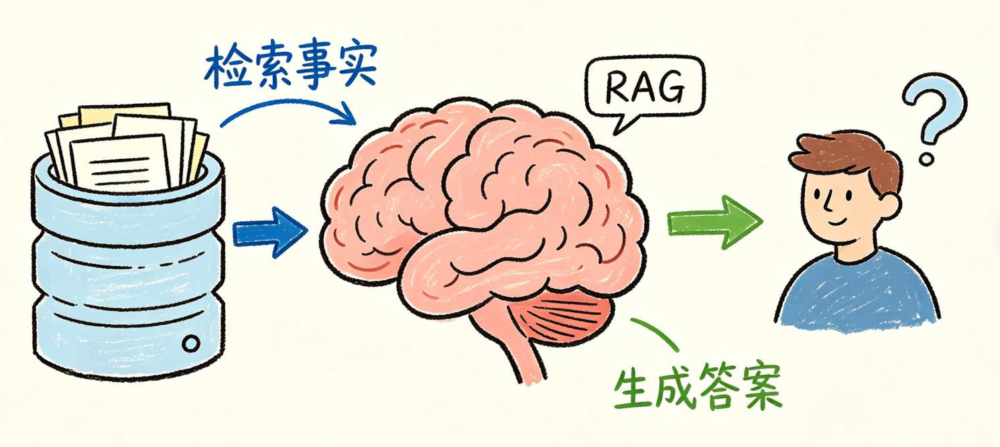
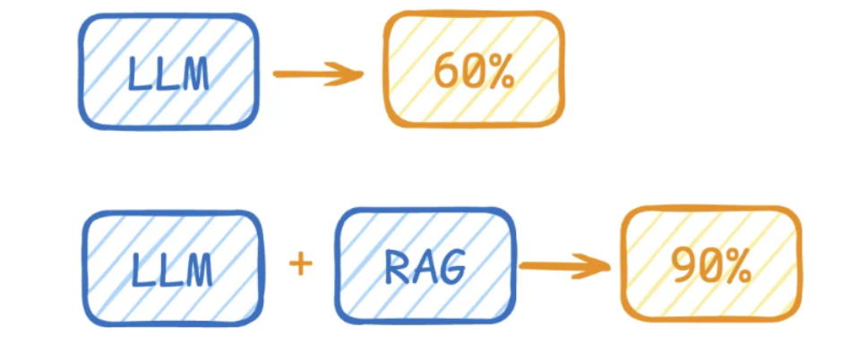
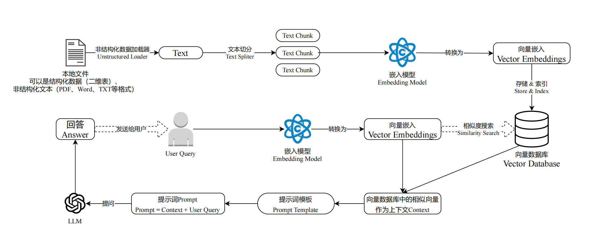
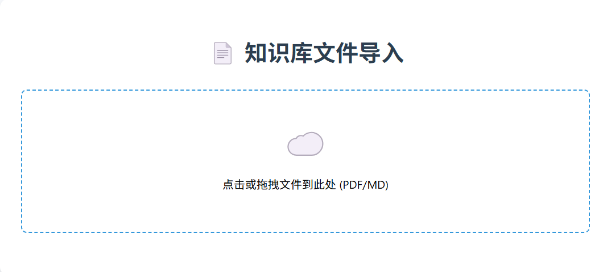
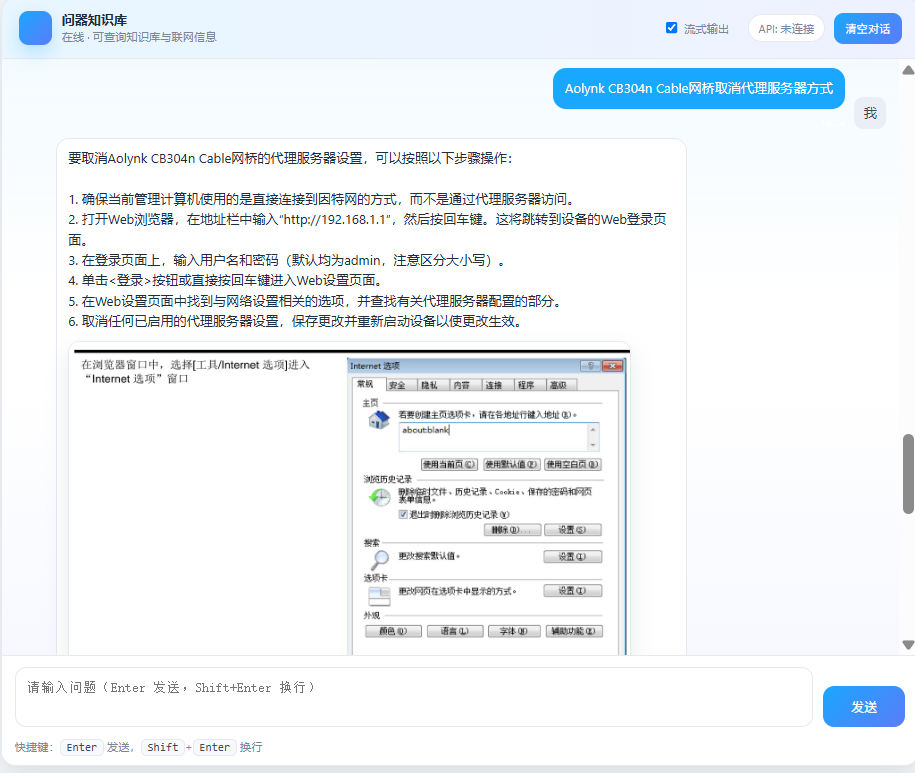
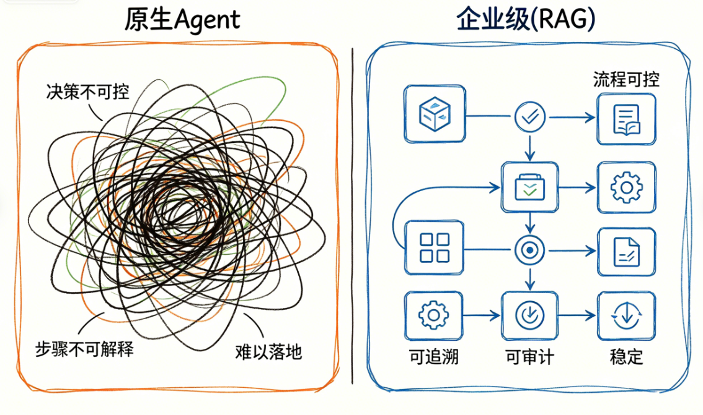

# 掌柜智库 RAG 项目介绍

### 一、 掌柜智库项目概述

#### 1.1 项目介绍与定位

**掌柜智库**是一套基于 RAG 架构的**企业级私有知识库智能问答系统**，专注解决企业内部知识管理、智能客服、专业咨询等场景的 AI 落地难题。

项目工程化代码规模 **5500+ 行**，实现从文档接入、知识库构建、智能检索到答案生成的**全链路生产级能力**。



掌柜智库是一套**全链路、高鲁棒性、可扩展**的企业级智能问答系统(核心定位)

- 支持私有知识安全管理与私有化部署
- 实现高精准问答，显著降低模型幻觉
- 支持多格式文档自动解析与结构化入库
- 融合多路检索、混合向量、重排序、联网补充等高级策略
- 最终为企业提供**稳定、可信、可解释**的智能问答服务

### 二、技术基础：RAG核心简介

#### 2.1 什么是 RAG?

RAG（检索增强生成）（Retrieval-Augmented Generation）是当下大模型**企业级落地**的主流架构与核心方案。

传统大模型仅依赖预训练知识作答，在垂直业务、内部私有数据、实时信息等场景下，极易产生**事实幻觉、答案失真、无可靠引用**等问题，无法满足企业对准确性与合规性的要求。



RAG 采用**先检索、后生成**架构，先从企业内部私有知识库精准匹配相关资料，再让大模型依托真实文档素材生成答案，从根源降低幻觉、提升回复准确度与可追溯性，完美适配各类企业业务场景。

#### 2.2 RAG核心价值

- 规避大模型事实幻觉风险，确保应答内容完全基于权威事实，契合企业合规性与专业性要求，降低业务决策误判成本。
- 无需对大模型进行全量重新训练，可快速接入企业私有业务知识、行业专属数据，大幅降低企业大模型落地的技术成本与时间成本，实现知识快速复用。
- 支持知识库实时更新、增量迭代，可同步企业业务动态、行业政策、实时数据，确保大模型应答内容的时效性，适配企业快速变化的业务需求。
- 实现企业私有数据的安全可控，知识库可部署于企业内网或私有服务器，避免核心业务数据泄露，完美适配企业内部协同、客户服务、合规咨询等核心场景。

#### 2.3 RAG 核心流程



1. **离线数据准备阶段（知识库构建）**

   企业原始文档（结构化数据、PDF/MD 等非结构化文本）通过加载器统一接入，再经文本切分拆分为语义连贯的文本片段；接着由嵌入模型将这些片段转换为向量嵌入，最终存入向量数据库并建立索引，完成企业私有知识库的构建，为后续在线检索提供数据支撑。

2. **在线问答生成阶段（检索增强生成）**

   用户发起查询后，系统先对用户问题进行向量化，再通过相似度检索从向量数据库中召回最相关的知识片段；随后将检索到的内容作为上下文，与用户问题一起填入预设的提示词模板，形成增强型 Prompt 发送给大模型；大模型基于真实的外部知识生成回答，确保结果精准、可信、可追溯，并返回给用户。

**RAG 中的关键模型应用**

* **Embedding 向量化**：通过嵌入模型将文本转换为向量表示，支持稠密向量与稀疏向量，为高效相似度检索提供基础能力。

* **Rerank 重排序**：通过重排序模型对召回结果做精细化排序，过滤低相关片段，显著提升上下文质量与答案准确性。

* **LLM 大模型生成**：基于检索增强后的高质量上下文，结合用户问题，由大语言模型生成可信、精准、可解释的最终回答。
* **视觉模型（图片识别）**：针对用户上传的图片、截图等视觉内容，完成图像解析、信息提取与内容理解，将视觉信息转化为可参与检索、问答的文本语义，支撑图文混合场景的交互。

### 三、掌柜智库项目流程&技术选型

#### 3.1 项目流程梳理 

项目依托标准的RAG流程，并进行了适当的拓展！主要以 “**离线知识库构建 + 在线智能问答**” 为双核心，形成闭环式工程化流程，覆盖数据处理、检索增强、生成交付全链路：

1. **知识库构建流水线（离线数据处理）**：实现企业内部文档的结构化接入与向量化资产沉淀，核心链路为：`原始文档 → 结构化解析与多模态理解 → 智能语义切片 → 元数据与实体标签提取 → 混合向量生成 → 向量数据库持久化`。

   程通过任务分发机制适配 PDF、Markdown 等多格式源数据，结合结构化解析、图片理解与智能分块技术，完成文档的标准化处理，最终生成携带丰富元数据的向量资产，为后续精准检索提供高质量数据支撑。

   

   ```mermaid
   flowchart LR
       A[START]
       B[1.任务分发]
       C[2.PDF结构化解析]
       D[3.多模态图片理解]
       E[4.智能文档切片]
       F[5.主体识别与标签提取]
       G[6.混合向量化]
       H[7.数据持久化]
       I[END]
       
       A-->B
       B-->|PDF|C
       B-->|Markdown|D
       C-->D
       D-->E
       E-->F
       F-->G
       G-->H
       H-->I
       
       %% 核心样式设置：圆角 + 配色区分
       style A fill:#e8f4f8,stroke:#4299e1,stroke-width:2px,rx:20,ry:20
       style I fill:#f0f8fb,stroke:#38b2ac,stroke-width:2px,rx:20,ry:20
   ```

2. **智能检索与生成流水线（在线问答服务）**：面向用户查询实现低延迟、高可信的智能问答交付，核心链路为：`用户提问 → 意图识别与查询改写 → 多路召回（向量搜索/HyDE/网络搜索） → 结果融合与粗排 → 重排序优化 → LLM增强生成 → SSE流式输出`。

   该流程通过意图理解提升查询精准度，采用多策略召回扩大知识覆盖范围，再经融合、排序优化上下文质量，最终通过 LLM 生成可溯源的可信答案，并以流式输出提升用户交互体验。

   

   ```mermaid
   flowchart LR
       
       A[用户查询入口] --> STAR[开始]
       STAR --> B[1.意图识别与改写]
       B --> C[2.多路召回]
       C --> D[向量搜索]
       C --> E[HyDE检索]
       C --> F[网络搜索]
       D --> G[3.结果融合与粗排]
       E --> G
       F --> G
       G --> H[4.重排序]
       H --> I[5.LLM生成答案]
       I --> END[结束]
       END --> J[SSE流式输出]
       
       
       %% 核心样式设置：圆角 + 配色区分
       style STAR fill:#e8f4f8,stroke:#4299e1,stroke-width:2px,rx:20,ry:20
       style END fill:#e8f4f8,stroke:#4299e1,stroke-width:2px,rx:20,ry:20
       style A fill:#f0f800,stroke:#38b2ac,stroke-width:2px,rx:20,ry:20
       style J fill:#f0f800,stroke:#38b2ac,stroke-width:2px,rx:20,ry:20
   ```

#### 3.2 项目核心目标

1. **理解 RAG 全流程逻辑** <font color='red'>[理解]</font>

   掌握从文档处理、向量构建、多路检索到答案生成的完整链路，理解 “先检索、后生成” 的核心机制，确保系统逻辑清晰、可解释、可维护。

2. **实现完整工程化代码** <font color='blue'>[实践]</font>

   基于标准 RAG 架构，完成从知识库构建到智能问答的全流程代码开发，实现生产级可用、可运行、可部署的稳定系统。

3. **支持业务灵活扩展** <font color='green'>[扩展]</font>

   系统具备高扩展性，可快速接入新文档类型、新增检索策略、对接不同大模型，并支持私有化部署、业务定制与功能迭代，满足企业真实场景需求。

#### 3.3 项目技术选型(langchain / langgraph)

当前企业级 RAG 场景对**流程可控性、稳定性、可追溯性、可审计性**要求极高，原生 Agent（自主智能体）虽然具备自主决策能力，但存在**决策不可控、步骤不可解释、执行不可复现、容易偏离任务、难以在生产环境落地**等问题，无法满足企业对稳定性与合规性的刚性需求。



本项目**不采用黑盒式原生 Agent**，而是选择 **LangGraph 图结构工作流**作为核心编排方案，核心优势如下：

1. **流程完全可控，避免 Agent 不可预测行为**

   LangGraph 通过**显式定义节点、边、执行路径**，让每一步检索、排序、生成都在预设流程内执行，杜绝 Agent 自主决策带来的偏离、幻觉与不可控问题，确保生产环境稳定运行。

2. **执行路径可解释、可追溯、可审计**

   图结构能清晰记录每一步执行节点与状态变化，满足企业对**问答溯源、操作审计、故障定位**的强需求，这是黑盒 Agent 无法提供的。

3. **兼顾智能决策 + 流程稳定性（比 Agent 更适合企业）**

   LangGraph 支持**条件路由、分支判断、循环、状态持久化**，能实现类似智能体的灵活能力，但**所有逻辑都在图结构内可控执行**，既保留灵活性，又保证业务安全合规。

4. **状态管理更适合复杂 RAG 与多轮对话**

   原生 Agent 状态管理弱，而 LangGraph 具备全局状态共享能力，可在多轮问答、多路检索、多步骤处理中稳定传递上下文，完美适配企业级复杂场景。

5. **易调试、易扩展、易维护**

   图结构可视化程度高，流程可插拔、可替换、可单独测试，远比 Agent 更适合工程化落地与长期迭代。

**核心框架与工作流编排**

| ***\*类别\**** | ***\*技术栈\****                     | ***\*选型理由\****                    |
| -------------- | ------------------------------------ | ------------------------------------- |
| 后端框架       | FastAPI + Uvicorn                    | 高性能异步框架，原生支持 SSE 流式响应 |
| AI 框架        | LangGraph + LangChain                | LangGraph 工作流编排，状态管理清晰    |
| 大语言模型     | 通义千问 Qwen-Flash / Qwen3-VL-Flash | 国产模型，中文能力强，API 稳定        |
| 向量模型       | BGE-M3 (1024维)                      | 混合稠密+稀疏向量，兼顾语义和精确匹配 |
| 重排序模型     | BGE-rerank-large(512序列)            | 专门用于重排序，提升 Top-K 准确性     |
| 向量数据库     | Milvus                               | 支持混合检索，高性能向量数据库        |
| 文档数据库     | MongoDB                              | 存储历史对话记录                      |
| 对象存储       | MinIO                                | 存储原始文档文件                      |
| 文档解析       | MinerU                               | 开源 PDF 解析工具，支持复杂格式       |
| 前端技术栈     | 原生 HTML + JavaScript + EventSource | 轻量级，SSE 原生支持                  |
