# 掌柜智库项目(RAG)实战

## 3. 环境准备

### 3.1 uv环境创建

`uv` 是 Rust 开发的**高性能 Python 环境与依赖管理工具**，速度远优于传统 venv、pip，原生支持虚拟环境创建、依赖安装与解析，全程兼容 Python 标准生态。本项目统一使用 `uv` 管理虚拟环境，已安装环境可自动识别调用，未安装可通过 `pip` 一键安装，能够快速搭建干净、统一、无冲突的项目开发环境。

#### 3.1.1 安装uv

使用 `uv` 方式创建虚拟环境，如果之前用其他方式安装过 `uv` 则此处会自动识别出 `uv` 路径，如果没安装过 `uv` 直接点击 `安装 uv via pip`

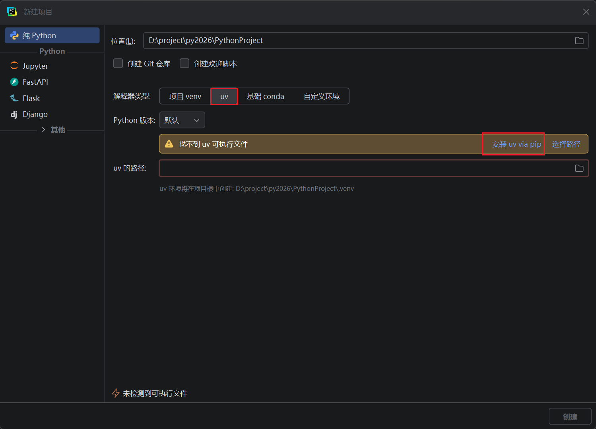

`PyCharm`版本没有 `uv` 选项，则选择 `自定义环境`，类型选 `uv`，然后再点击 `安装 uv via pip`

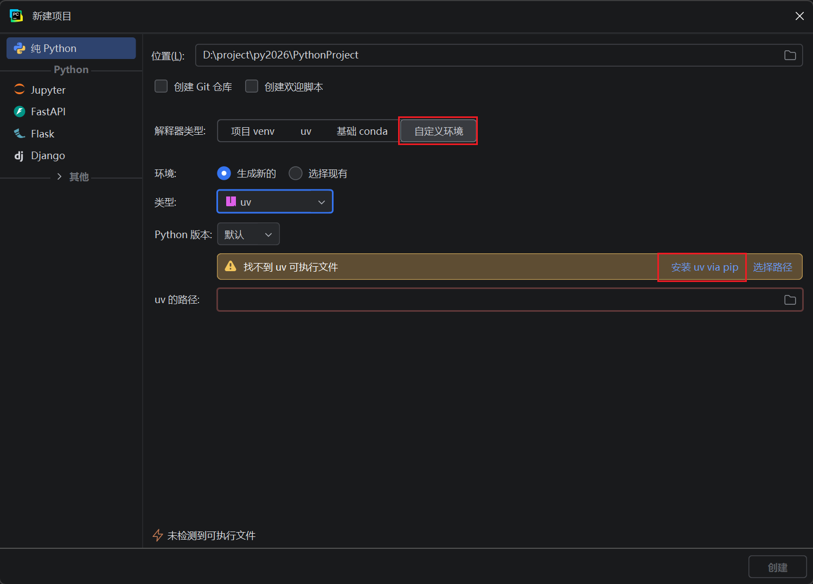

#### 3.1.2 配置环境变量

安装完 uv 后，查看 uv 安装路径：

```bash
pip show uv
```

将 uv 所在路径（默认一般是：`C:\Users\你的用户名\AppData\Roaming\Python\Scripts`）配置到系统 **Path** 环境变量中。

配置成功查看uv版本即可:

```bash
C:\Users\admin>uv --version
uv 0.11.14 (3fdfdc7d4 2026-05-12 x86_64-pc-windows-msvc)
```

注意：**2024 版本 PyCharm 没有内置 uv 选项**，直接使用 `pip install uv` 安装即可正常使用。

#### 3.1.3 镜像配置

**方法 1：项目内配置（仅当前项目生效）**

1. 进入 UV 项目根目录（需有 `pyproject.toml` 文件，无则执行 `uv init` 生成）；

2. 打开 pyproject.toml，添加以下配置（直接复制粘贴）：

   ```toml
   # 项目下配置环境变量(更推荐)
   [[tool.uv.index]]
   name = "tsinghua"
   url = "https://pypi.tuna.tsinghua.edu.cn/simple"
   default = true
   ```

3. 保存文件，配置立即生效，后续 `uv add/update/sync` 均从清华镜像下载依赖。

**方法 2：全部配置（当期电脑生效）**

编辑 `uv.toml` 文件，添加以下内容 (C:\Users\登录用户名\AppData\Roaming\uv) [没有就新建]

```toml
# 配置默认的 PyPI 镜像源 (清华源)
[[index]]
url = "https://pypi.tuna.tsinghua.edu.cn/simple"
default = true
```

### 3.2 使用 PyCharm 或命令创建 uv 项目

#### 3.2.1 方式 1：PyCharm 2024 及以上版本直接创建

1. 打开 PyCharm → 新建项目

2. 选择 **uv** 作为环境管理器

   

3. 设置项目名称：`ai_班级号_knowledge_base`  

4. Python 版本选择 3.11 → 直接创建

创建完成后，项目根目录自动生成 `pyproject.toml`

#### 3.2.2 方式 2：命令行创建 + PyCharm 打开 

打开命令窗口,运行: 

```bash
# 命令行创建干净项目（不带Git）
uv init ai_班级号_knowledge_base --bare
cd ai_班级号_knowledge_base
pycharm直接打开即可 自动创建虚拟环境

uv venv # 手动创建虚拟环境 不推荐

# 基于2024版本pycharm
uv init 项目名 --bare   
# 项目文件  pyproject.toml [被uv管理的标识 -> uv依赖信息]
pycharm - open - 项目文件夹
# 命令窗口 初始化虚拟环境
uv venv #创建虚拟环境
uv venv --python=3.11 #指定python版本
# 激活虚拟环境
# window 
./.venv/Scripts / active....
# 状态 (项目名) ... 
# 注意: (base)(项目名) 取消conda管理 deactive
```

创建完成后，用 PyCharm 打开项目文件夹，自动关联虚拟环境

创建完成后，项目根目录自动生成 `pyproject.toml`

`--bare` 纯净版创建,避免git管理以及初始化py文件

#### 3.2.3 同步依赖

1. 复制 `pyproject.toml` + `uv.lock` 到项目根目录(项目依赖文件)

   

2. 终端执行同步安装:

   ```bash
   解释过程: 
     同步项目所以依赖信息
     1. 粘贴 pyproject.toml  uv.lock  [项目需要的依赖信息]
     2. 同步命令 uv sync  [根据pyproject.toml提供需要的依赖 uv.lock确定的版本 真正去下载依赖]
   uv sync 
   # 根据uv.lock锁定依赖版本进行依赖安装和同步
   ```

 3. 解释pyproject.toml和uv.lock

    `pyproject.toml` 需求清单**，写明项目需要的 Python 版本、依赖包（如 langchain、requests）和源地址；**`uv.lock` 是 uv 自动生成的锁定文件，记录所有包的精确版本、依赖关系，保证环境完全一致。

    `uv sync` 先读取 `pyproject.toml` 获取依赖要求，再检查 `uv.lock` 是否存在且匹配，存在则按它精准安装，不存在则根据清单生成新的 lock 文件并安装。

    ```toml
    [project]
    name = "pythonproject18"
    version = "0.1.0"
    description = "Add your description here"
    requires-python = ">=3.11"
    dependencies = [
        "langchain>=1.2.15",
        "requests>=2.33.1",
    ]
    
    # 项目下配置环境变量(更推荐)
    [[tool.uv.index]]
    name = "tsinghua"
    url = "https://pypi.tuna.tsinghua.edu.cn/simple"
    default = true
    ```

**注意:** 执行 `uv`/`pip` 报**执行策略错误**：把 PowerShell 切成 **CMD** 就好

1. 打开 PyCharm，点击顶部菜单栏的 `File` → `Settings`。

2. 在设置窗口左侧找到 `Tools` → `Terminal`，在右侧的 `Shell path` 输入框中，把原来的 `powershell.exe` 改成 `cmd.exe`。

3. 点击窗口右下角的 `Apply` → `OK`，然后关闭并重新打开 PyCharm 底部的 Terminal（快捷键 Alt+F12），新打开的终端就是 CMD 模式了，再执行 `uv` 命令就不会被 PowerShell 的执行策略限制。

### 3.3 使用uv进行包管理

uv pip 就是 “长得像 pip、速度是 uv” 的兼容层，用来无缝替换老项目里的 pip，又不破坏 uv 项目模式；而 uv add 是 uv 专属、面向项目托管的方式：

```bash
# 兼容所有pip的使用命令,速度等于uv的速度 !! 本质底层还是uv
# 挖坑小能手: 使用兼容命令,不会记录到项目的依赖清单 pyproject.toml 
# 建议你是怀旧的人,这个包一定是临时包!!!
# 安装包
uv pip install requests                  # 安装最新版本
uv pip install requests==2.31.0          # 安装特定版本
uv pip install -r requirements.txt       # 从 requirements.txt 批量安装

# 升级/卸载/查看包
uv pip install --upgrade requests        # 升级包
uv pip uninstall requests                # 卸载包
uv pip list                              # 查看已安装的包

# 导出依赖
uv pip freeze > requirements.txt         # 导出当前环境依赖到 requirements.txt
```

在项目模式下，推荐使用 `uv add` 和 `uv remove` 管理依赖，它们会自动更新 `pyproject.toml` 和 `uv.lock`：

```bash
# 添加生产依赖
uv add requests
# 添加指定版本的依赖
uv add "requests>=2.31.0"
# 移除依赖
uv remove requests
```

**uv pip**：**高速兼容版 pip**，不写配置文件，用于老项目迁移、临时安装、toml保持脚本不变。

**uv add**：**uv 项目专属依赖管理**，自动写 pyproject + uv.lock，用于正式项目依赖。

### 3.4 知识库项目基础介绍和导入 

#### 3.4.1 项目结构设计

- 导入流程与查询流程的可运行能力，并统一收口到 `app/process`
- 当前采用 `api / infra / shared / rag / process` 分层
- 查询链核心能力已按节点职责下沉到 `app/rag/query`
- 导入链核心能力已下沉到 `app/rag/import_`
- 保持导入服务与查询服务双入口、双端口运行

```bash
app/
    ├─ api/                           # 接口层
    │  ├─ http/                       # 导入/查询两个可运行 server 入口
    │  └─ schemas/                    # 请求与响应数据结构
    ├─ infra/                         # 基础设施正式出口
    │  ├─ config/                     # 应用运行配置与端口设置
    │  ├─ document_parse/             # PDF 解析服务门面（MinerU）
    │  ├─ llm/                        # LLM / Embedding / Reranker 提供者出口
    │  ├─ object_storage/             # 对象存储门面（MinIO）
    │  ├─ persistence/                # 持久化门面（聊天历史等）
    │  └─ vectorstore/                # 向量库门面（Milvus）
    ├─ process/                       # 流程编排层
    │  ├─ import_/                    # 导入图、导入状态与导入页面
    │  │  ├─ agent/                   # LangGraph 导入图与各节点
    │  │  └─ page/                    # 导入演示页面
    │  └─ query/                      # 查询图、查询状态与查询页面
    │     ├─ agent/                   # LangGraph 查询图与各节点
    │     └─ page/                    # 查询演示页面
    ├─ rag/                           # RAG 核心能力层
    │  ├─ import_/                    # 导入域能力：入口识别、图片增强、切块、向量化、入库
    │  └─ query/                      # 查询域能力：主体确认、检索、HyDE、RRF、Rerank、答案生成
    ├─ resources/                     # 应用资源目录
    │  └─ prompts/                    # 提示词模板
    ├─ shared/                        # 公共底座
    │  ├─ clients/                    # 底层客户端工具（Milvus / Mongo / MinIO）
    │  ├─ config/                     # 原子配置读取与各组件配置对象
    │  ├─ model/                      # 模型工具封装
    │  ├─ runtime/                    # 运行时能力（日志、Prompt 加载）
    │  ├─ tool/                       # 模型下载等辅助脚本
    │  └─ utils/                      # 通用工具（SSE、任务状态、限流、路径等）
    └─ __init__.py
test/                                 # 测试与实验脚本
doc /                                 # 项目测试文档
output /                              # 项目文件生成存储位置
logs /                                # 项目日志文件位置
.env /                                # 项目的配置文件
.env.example /                        # 项目配置示例,传入到git仓库
```

#### 3.4.2  项目配置文件

> `.env` 文件（不提交到Git，配置apikey）
>
> 文件位置: 掌柜智库项目\资料\配置文件
>
> 存储位置: 项目根路径


测试环境变量的读取

```python
# test/01_env_test.py
import os
from dotenv import load_dotenv

load_dotenv(
    override=True
)

print(os.environ.get("BGE_M3_PATH"))
# load_dotenv(override=True) → 输出 dotenv_val（.env覆盖系统）
```

#### 3.4.3 统一日志工具

##### 3.4.3.1 安装依赖

`loguru` (洛古鲁) 是 Python 中一款**开箱即用、功能强大且极简的日志工具**，核心作用是替代 Python 标准库的 `logging` 模块，解决原生日志配置繁琐、用法不友好的问题。我用新手能看懂的方式讲清楚它的核心作用和优势：

```bash
[已导入]
uv add loguru
或
pip install loguru  

print() -> 日志 -> 写到任何

print(f"xxx") 1. 控制台  2. 格式单一 3. 没有标准的输出级别不方便统一控制 (1[最低]2345 [最高])
```

##### 3.4.3.2 日志模块代码

> **资料**
>
> 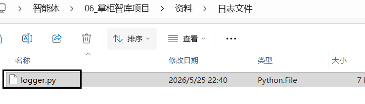
>
> 导入位置: `app/shared/runtime/logger.py`

##### 3.4.3.3 测试日志记录

[参照文档](https://loguru.readthedocs.io/en/stable/api.html)

```python
"""
项目日志工具类
基于loguru实现，支持.env配置控制台/文件双输出，自动生成logs/app_年月日.log
特性：
1. 配置驱动：通过.env开关输出、修改日志级别
2. 自动路径：文件日志默认输出到 项目根/logs/app_YYYYMMDD.log
3. 自动清理：按配置保留日志，自动删除过期文件
4. 中文友好：utf-8编码，彻底解决中文乱码
5. 异步安全：开启异步入队，支持多线程/异步场景，避免日志错乱
6. 开箱即用：项目所有模块直接导入logger即可使用
7. 位置终极精准：穿透loguru内部+工具类自身，完美显示业务模块实际调用位置
"""
import sys
import inspect
from pathlib import Path
import os
from dotenv import load_dotenv
from loguru import logger


# -------------------------- 第一步：加载.env配置文件 --------------------------
load_dotenv()

# -------------------------- 第二步：读取.env配置（带默认值，防止配置缺失） --------------------------
LOG_CONSOLE_ENABLE = os.getenv("LOG_CONSOLE_ENABLE", "True").lower() == "true"
LOG_CONSOLE_LEVEL = os.getenv("LOG_CONSOLE_LEVEL", "INFO").upper()
LOG_FILE_ENABLE = os.getenv("LOG_FILE_ENABLE", "True").lower() == "true"
LOG_FILE_LEVEL = os.getenv("LOG_FILE_LEVEL", "INFO").upper()
LOG_FILE_RETENTION = os.getenv("LOG_FILE_RETENTION", "7 days")

# -------------------------- 第三步：定义日志路径（自动推导项目根） --------------------------
PROJECT_ROOT = Path(__file__).resolve().parent.parent.parent.parent
LOG_DIR = PROJECT_ROOT / "logs"
LOG_FILE_NAME = "app_{time:YYYYMMDD}.log"
LOG_FILE_PATH = LOG_DIR / LOG_FILE_NAME

# -------------------------- 第四步：定义日志格式（彩色、结构化、易读） --------------------------
LOG_FORMAT = (
    "<green>{time:YYYY-MM-DD HH:mm:ss.SSS}</green> | "
    "<level>{level: <8}</level> | "
    "<cyan>{name: <20}</cyan>:<cyan>{function: <15}</cyan>:<cyan>{line: <4}</cyan> - "
    "<level>{message}</level>"
)

# -------------------------- 第五步：初始化日志配置（核心方法） --------------------------
def init_logger():
    """
    初始化全局日志配置
    1. 移除loguru默认控制台输出（避免重复打印）
    2. 根据.env配置开启/关闭控制台输出
    3. 根据.env配置开启/关闭文件输出（自动创建logs文件夹）
    4. 配置日志格式、级别、分割、保留策略
    :return: 配置完成的loguru logger实例
    """
    # 1. 移除loguru默认的控制台输出
    logger.remove()

    # 2. 配置控制台输出（若.env开启）
    if LOG_CONSOLE_ENABLE:
        logger.add(
            sink=sys.stdout,
            level=LOG_CONSOLE_LEVEL,
            format=LOG_FORMAT,
            colorize=True,
            enqueue=True
        )

    # 3. 配置文件输出（若.env开启）
    if LOG_FILE_ENABLE:
        LOG_DIR.mkdir(parents=True, exist_ok=True)
        logger.add(
            sink=LOG_FILE_PATH,
            level=LOG_FILE_LEVEL,
            format=LOG_FORMAT,
            rotation="00:00",
            retention=LOG_FILE_RETENTION,
            encoding="utf-8",
            enqueue=True,
            backtrace=True,
            diagnose=True
        )

    return logger

# -------------------------- 第六步：初始化并终极修正全局logger --------------------------
base_logger = init_logger()

def fix_log_position(record):
    """遍历调用栈，跳过loguru内部帧+工具类自身帧，提取业务代码实际调用位置"""
    for frame in inspect.stack():
        # 终极过滤：排除loguru内部 + 排除工具类logger.py自身，直接定位业务模块
        if ("_logger.py" in frame.filename or frame.function == "_log") or "logger.py" in frame.filename:
            continue
        # 更新日志字段为业务代码实际位置
        record.update(
            name=frame.filename.split("/")[-1].split("\\")[-1],
            function=frame.function,
            line=frame.lineno
        )
        break

# 应用终极修复，导出全局可用的logger
logger = base_logger.patch(fix_log_position)


from functools import wraps
import time
from typing import Mapping

def _trace_id(state) -> str:
    if isinstance(state, Mapping):
        return str(state.get("session_id") or state.get("task_id") or "-")
    return "-"

def node_log(node_name: str):
    def deco(func):
        @wraps(func)
        def wrapper(state, *args, **kwargs):
            trace_id = _trace_id(state)
            start_ts = time.time()
            logger.info(f"[{node_name}] 节点开始，追踪ID={trace_id}")
            try:
                result = func(state, *args, **kwargs)
                cost_ms = int((time.time() - start_ts) * 1000)
                logger.info(f"[{node_name}] 节点完成，追踪ID={trace_id}，耗时={cost_ms}ms")
                return result
            except Exception:
                logger.exception(f"[{node_name}] 节点异常，追踪ID={trace_id}")
                raise
        return wrapper
    return deco

def step_log(step_name: str):
    """
    步骤日志装饰器：
    - 自动打印 步骤开始 / 步骤完成 / 步骤异常（含堆栈）
    - 不吞异常，保持原有业务语义
    """
    def deco(func):
        @wraps(func)
        def wrapper(*args, **kwargs):
            start_ts = time.time()
            logger.info(f"[{step_name}] 步骤开始")
            try:
                result = func(*args, **kwargs)
                cost_ms = int((time.time() - start_ts) * 1000)
                logger.info(f"[{step_name}] 步骤完成，耗时={cost_ms}ms")
                return result
            except Exception:
                logger.exception(f"[{step_name}] 步骤异常")
                raise
        return wrapper
    return deco

# -------------------------- 测试代码（验证修复效果） --------------------------
if __name__ == '__main__':
    # 【debug】开发调试用，记录细节、变量，上线一般关闭
    logger.debug("【调试】进入主程序入口，开始初始化日志")

    # 【info】正常流程日志，记录程序运行状态
    logger.info("【信息】logger.py内部调用（仅测试，业务模块调用会显示正确文件名）")

    print(f"日志文件输出路径：{LOG_FILE_PATH}")

    # 【warning】警告，不影响运行，但需要关注
    logger.warning("【警告】未读取到自定义配置，使用默认配置")

    # 【error】当前功能出错，程序不会崩溃，但业务失败
    logger.error("【错误】logger.py内部调用（仅测试，业务模块调用会显示正确文件名）")

    # 【exception】必须在except里，自动打印完整异常堆栈（定位bug用）
    try:
        result = 10 / 0
        logger.info(f"【信息】业务计算结果：{result}")
    except Exception:
        logger.exception("【异常】捕获到业务异常，输出完整堆栈信息")
```

修改`.env`文件中的`日志配置`进行测试，例如 `LEVEL、ENABLE`

```python
# ===================== 日志配置 =====================
# 控制台日志：True=开启/False=关闭，级别可选(DEBUG/INFO/WARNING/ERROR/CRITICAL)
LOG_CONSOLE_ENABLE=True
LOG_CONSOLE_LEVEL=INFO

# 日志配置
# 文件日志：True=开启/False=关闭，级别与控制台可独立设置
LOG_FILE_ENABLE=True
LOG_FILE_LEVEL=ERROR
# 日志文件保留天数（自动删除过期日志，避免磁盘占满）
LOG_FILE_RETENTION=7 days
```

#### 3.4.4 准备提示词和导入工具

> 位置: 资料/ 提示文件
>
> prompts
> load_prompt.py
>
> 导入位置: app/resources/prompts  存放提示词文本
>
> 导入位置: app/shared/runtime/load_prompt.py

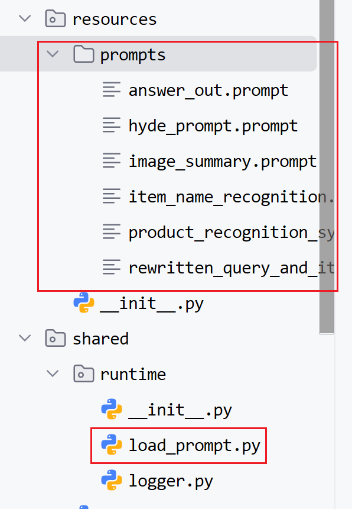

#### 3.4.5 配置config介绍和导入

> 位置:  \资料\配置加载类
>
> 集中管理所有配置
>
> ​	不用在代码里到处写 `os.getenv("xxx")`，所有配置都在一个类里，找起来一目了然。
>
> 统一读取环境变量 /.env 文件
>
> ​	像 `MCP_DASHSCOPE_BASE_URL`、`OPENAI_API_KEY` 这种敏感信息，**不写死在代码里**，更安全。
>
> 类型安全，不容易写错
>
> ​	定义 `mcp_base_url: str`，确保配置是字符串类型，避免运行时出错。
>
> 导入位置: app/shared/config


#### 3.2.6 shared其他工具类导入

> **资料** / shared工具类
>
> 暂时使用不到,用的时候单独解释即可

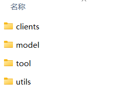

#### 3.2.7 PDF文件

> **资料** / doc
>
> `设备手册`放入项目根目录`doc`文件夹

#### 3.2.8  公共服务模块

infra = 项目所有外部服务 / 第三方能力的【统一出口门面层】作用：把所有外部依赖（LLM、数据库、存储、向量库）封装一遍，统一对外暴露，业务代码永远不直接调用第三方库，**方便随时替换技术栈、统一管理日志 / 异常 / 重试、让业务代码更简洁稳定**。

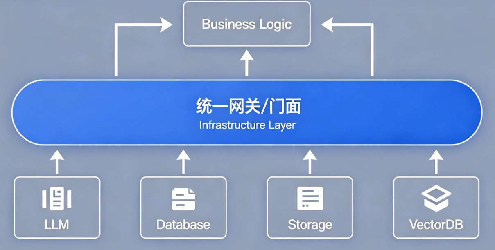

包位置：`app/infra/config/providers.py`

```python
from app.shared.config.embedding_config import embedding_config
from app.shared.config.lm_config import lm_config
from app.shared.config.bailian_mcp_config import mcp_config
from app.shared.config.milvus_config import milvus_config
from app.shared.config.mineru_config import mineru_config
from app.shared.config.minio_config import minio_config
from app.shared.config.reranker_config import reranker_config
from app.shared.config.settings_config import settings

from dataclasses import dataclass , field

@dataclass
class InfraConfig:
    app: object = field(default_factory=lambda: settings)
    llm: object = field(default_factory=lambda: lm_config)
    embedding: object = field(default_factory=lambda: embedding_config)
    reranker: object = field(default_factory=lambda: reranker_config)
    mcp: object = field(default_factory=lambda: mcp_config)
    milvus: object = field(default_factory=lambda: milvus_config)
    mineru: object = field(default_factory=lambda: mineru_config)
    minio: object = field(default_factory=lambda: minio_config)

infra_config = InfraConfig()

print(infra_config.app.import_app_name)
```

其他补全包代码在需要的时候定义即可!

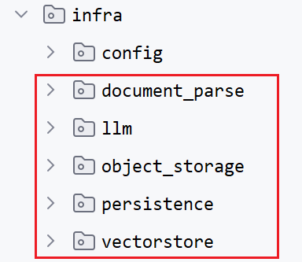

### 3.5 项目git管理和提交

#### 3.5.1 添加忽略文件

1. 先安装git忽略文件插件,快速创建忽略文件

   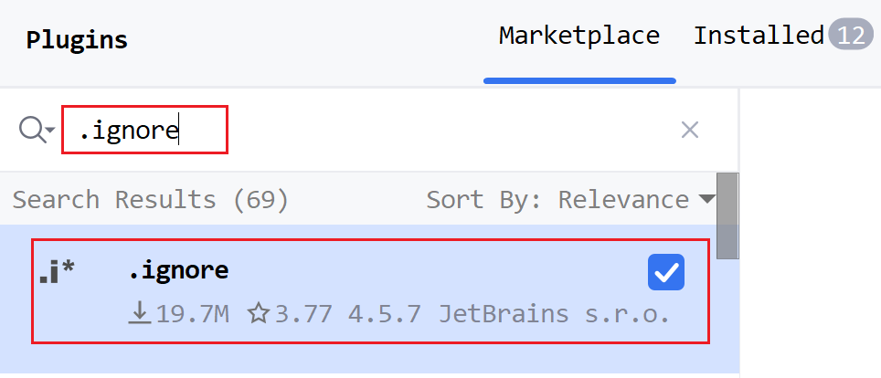

2. 快速创建忽略文件

   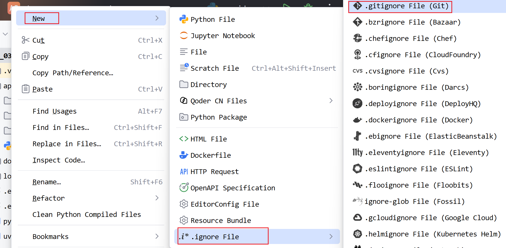

   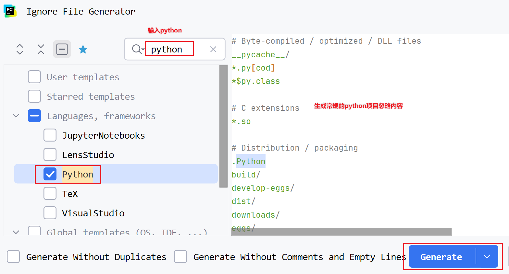

3. 检查和确认必要文件被忽略

   

   ```
   # 自己单独添加即可  其他已经正常忽略了
   doc/
   logs/
   ```

#### 3.5.2 git管理并提交到gitee

1. PyCharm 顶部点击 vcs

   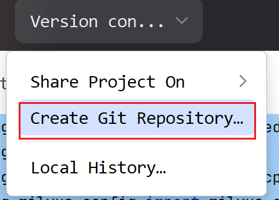

2. 填写提交信息（如：项目初始化）→ 点击提交

3. 右键项目 → `Git` → `Manage Remotes`

4. 添加 Gitee 远程仓库地址 [注意git项目一定要设置开源,要空白仓库,创建两个]

5. 右键项目 → `Git` → `Push` 推送到 Gitee

#### 3.5.3 更新项目进度表

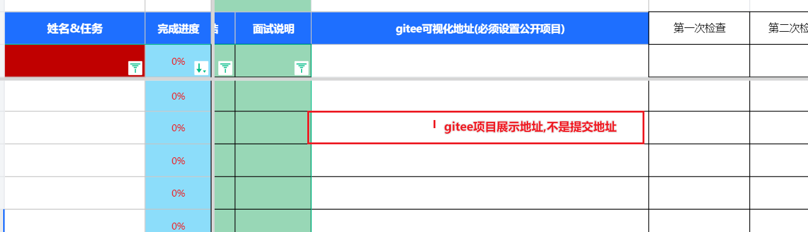

