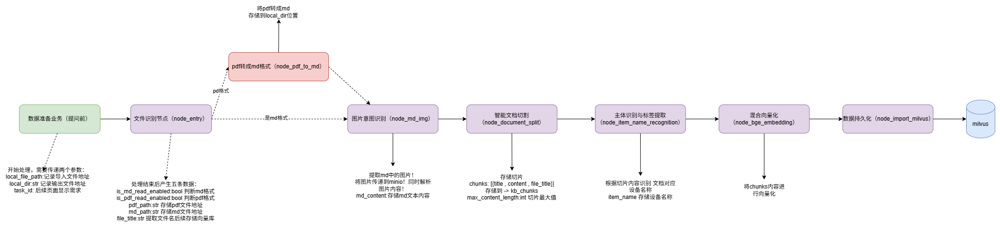
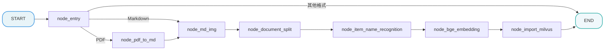

# 掌柜智库项目(RAG)实战

## 4. 导入数据图与状态定义

### 4.1 定义状态 (State)

所有节点共享同一个状态对象。我们需要定义它来存储处理过程中的数据（如 PDF 路径、MD 内容、切片列表、向量等）。



```
node_entry
- 读 local_file_path ：因为要判断输入是 .md 还是 .pdf 。
- 读 task_id ：任务追踪。
- 写 is_md_read_enabled / is_pdf_read_enabled ：给路由函数决定下一跳。
- 写 md_path / pdf_path ：把原始文件路径标准化到后续节点约定字段。
- 写 file_title ：后续 item_name 识别失败时做兜底语义。
node_pdf_to_md
- 读 pdf_path ：PDF 解析入口文件。
- 读 local_dir ：解析产物落盘目录。
- 读 task_id ：任务追踪。
- 写 md_path ：告诉下游 markdown 文件在哪里。
- 回写 local_dir ：确保是规范化后的实际目录字符串。
node_md_img
- 读 md_path ：定位 markdown 和 images/ 目录。
- 读 md_content （可空）：有就用，没有就从 md_path 读取。
- 读 task_id ：任务追踪。
- 写 md_content ：替换图片链接后的新内容。
- 写 md_path ：可能变成 _new.md ，下游必须跟新路径走。
node_document_split
- 读 md_content ：切片原材料。
- 读 file_title ：给每个 chunk 补 metadata（语义归属）。
- 读 local_dir ：把 chunks.json 备份到本地。
- 读 task_id ：任务追踪。
- 写 chunks ：这是后续识别、向量化、入库的核心载体。
node_item_name_recognition
- 读 chunks ：从前几段内容构建上下文给 LLM 识别主体。
- 读 file_title / md_path ：识别失败时兜底出 item_name 。
- 读 task_id ：任务追踪。
- 写 item_name ：文档级主语（后续幂等删除、检索过滤都依赖）。
- 写 chunks ：把 item_name 回填到每个 chunk，保证 chunk 自包含。
node_bge_embedding
- 读 chunks ：拿 item_name + content 生成向量输入。
- 读 task_id （可选）：任务追踪。
- 写 embeddings_content ：补 dense_vector / sparse_vector ，供 Milvus 入库。
node_import_milvus
- 读 embeddings_content ：真正要入库的数据。
- 读 task_id ：任务追踪。
- 用 chunks[0].item_name 做幂等删除：同主体重复导入先删旧数据。
- 写 embeddings_content ：把插入回显的 chunk_id 回填，方便后续追踪与引用。
```

**文件**: `app/process/import_/agent/state.py`

```python
from typing import TypedDict
import copy


class ImportGraphState(TypedDict):
    """
    图的状态定义，包含所有节点产生和消费的数据字段。
    TypedDict 让我们在代码中能有自动补全和类型检查。
    使用字典式访问（如 state["task_id"]、state.get("chunks")）。
    """
    task_id: str

    # --- 流程控制标记 ---
    is_md_read_enabled: bool
    is_pdf_read_enabled: bool

    # --- 路径相关 ---
    local_dir: str  # 文件夹地址  (pdf -> md  -> 输出的文件夹地址)
    local_file_path: str  # 传入文件地址 不确定md pdf 
    file_title: str
    pdf_path: str  # pdf地址 文件 <- local_file_path
    md_path: str   # md地址 文件 <- local_file_path

    # --- 内容数据 ---
    md_content: str
    chunks: list
    item_name: str

    # --- 数据库相关 ---
    embeddings_content: list


graph_default_state: ImportGraphState = {
    "task_id": "",
    "is_pdf_read_enabled": False,
    "is_md_read_enabled": False,
    "local_dir": "",
    "local_file_path": "",
    "pdf_path": "",
    "md_path": "",
    "file_title": "",
    "md_content": "",
    "chunks": [],
    "item_name": "",
    "embeddings_content": [],
}


def create_default_state(**overrides) -> ImportGraphState:
    """
    创建默认状态，支持覆盖。
    """
    state = copy.deepcopy(graph_default_state)
    state.update(overrides)
    return state


def get_default_state() -> ImportGraphState:
    """
    返回一个新的状态实例，避免全局变量污染。
    """
    return copy.deepcopy(graph_default_state)
```

### 4.2 定义主图 

为了确保整体流程设计的科学性与执行连贯性，我们采用 **"Top-Down"（自顶向下）** 的开发模式，以 “总指挥部” 的全局视角统筹推进，具体实施步骤如下：

1. **搭建节点骨架（Stubs）**：优先定义全流程所需的所有功能节点。当前项目里，这一层已经不再是只有 `return state` 的空函数，而是演化成了轻量的节点适配层，负责日志、任务状态记录以及调用对应 service；
2. **串联主图（Graph）**：基于预设的业务流转规则，编写主图逻辑将所有节点骨架按序串联，明确节点间的输入输出关系、分支判断条件（如文件格式分流逻辑），形成完整的流程链路；
3. **验证流程通畅性**：启动端到端测试，验证节点间的调用链路是否通顺、数据流转是否符合预期、分支跳转是否准确，确保流程无阻塞、无逻辑漏洞；
4. **填充节点核心逻辑**：在流程链路验证通过后，再逐一聚焦每个节点的内部实现，完成复杂业务逻辑的开发（如 PDF 结构化转换、向量编码、重排序算法等），实现 “骨架” 到 “完整系统” 的落地。

该模式的核心优势在于：先保障 “流程走得通”，再聚焦 “功能做得好”，避免因局部逻辑复杂导致整体流程设计偏差，大幅提升开发效率与流程稳定性。

#### 4.2.1 第一步：创建节点骨架

我们仍然保留“先搭节点骨架、再串主图”的教学路线，但要和当前项目代码保持一致。  也就是说，这里的节点已经不是最初只有 `return state` 的空函数，而是已经演化为 **process 层节点适配器**：

1. 负责承接 `LangGraph state`
2. 负责记录节点开始/完成任务状态
3. 负责调用 `rag/import_` 中的真实业务 service

**请在 `app/process/import_/agent/nodes` 和 `app/rag/import_` 目录下，按“一个节点配一个 service”的方式一起创建。**

#### 4.2.1.1 `node_entry` + `resolve_input_file`

两者关系：

- `node_entry` 是图中的入口节点，负责承接 LangGraph 的 `state`
- `resolve_input_file` 是对应的业务 service，负责真正做文件类型识别和字段回写
- 也就是说，`process` 层负责“调度”，`rag` 层负责“实现”

**节点文件**: `app/process/import_/agent/nodes/node_entry.py`

```python
from app.shared.runtime.logger import node_log
from app.shared.utils.task_utils import add_done_task, add_running_task
from app.process.import_.agent.state import ImportGraphState
from app.rag.import_.entry_service import resolve_input_file

@node_log("node_entry")
def node_entry(state: ImportGraphState) -> ImportGraphState:
    """
    节点: 入口节点 (node_entry)
    为什么叫这个名字: 作为图的 Entry Point，负责接收外部输入并决定流程走向。
    """
    add_running_task(state["task_id"], "node_entry")
    state = resolve_input_file(state)
    add_done_task(state["task_id"], "node_entry")
    return state
```

**对应 service 文件**: `app/rag/import_/entry_service.py`

```python
from app.process.import_.agent.state import ImportGraphState


def resolve_input_file(state: ImportGraphState) -> ImportGraphState:
    """
    入口识别服务：
    1. 校验 local_file_path
    2. 识别文件类型（PDF / Markdown）
    3. 回写 is_pdf_read_enabled / is_md_read_enabled
    4. 回写 pdf_path / md_path / file_title
    """
    return state
```

#### 4.2.1.2 `node_pdf_to_md` + `parse_pdf_to_markdown`

两者关系：

- `node_pdf_to_md` 是图中的第二步节点
- `parse_pdf_to_markdown` 负责真正调用 MinerU 做 PDF 解析
- 节点本身不处理解析细节，只负责衔接图状态和 service

**节点文件**: `app/process/import_/agent/nodes/node_pdf_to_md.py`

```python
from app.shared.runtime.logger import node_log
from app.shared.utils.task_utils import add_done_task, add_running_task
from app.process.import_.agent.state import ImportGraphState
from app.rag.import_.pdf_parse_service import parse_pdf_to_markdown

@node_log("node_pdf_to_md")
def node_pdf_to_md(state: ImportGraphState) -> ImportGraphState:
    """
    节点: PDF转Markdown (node_pdf_to_md)
    为什么叫这个名字: 核心任务是将 PDF 非结构化数据转换为 Markdown 结构化数据。
    """
    add_running_task(state["task_id"], "node_pdf_to_md")
    state = parse_pdf_to_markdown(state)
    add_done_task(state["task_id"], "node_pdf_to_md")
    return state
```

**对应 service 文件**: `app/rag/import_/pdf_parse_service.py`

```python
from app.process.import_.agent.state import ImportGraphState


def parse_pdf_to_markdown(state: ImportGraphState) -> ImportGraphState:
    """
    PDF 解析服务：
    1. 调用 MinerU
    2. 下载并解压解析结果
    3. 获取 Markdown 路径和正文内容
    4. 回写 md_path / md_content / local_dir
    """
    return state
```

#### 4.2.1.3 `node_md_img` + `enrich_markdown_images`

两者关系：

- `node_md_img` 是图中的图片增强节点
- `enrich_markdown_images` 负责真正扫描 Markdown 图片、调用视觉模型、上传 MinIO
- 节点只保留调度和任务状态记录

**节点文件**: `app/process/import_/agent/nodes/node_md_img.py`

```python
from app.shared.runtime.logger import node_log
from app.shared.utils.task_utils import add_done_task, add_running_task
from app.process.import_.agent.state import ImportGraphState
from app.rag.import_.enrich_markdown_images import enrich_markdown_images

@node_log("node_md_img")
def node_md_img(state: ImportGraphState) -> ImportGraphState:
    """
    节点: 图片处理 (node_md_img)
    为什么叫这个名字: 处理 Markdown 中的图片资源 (Image)。
    """
    add_running_task(state["task_id"], "node_md_img")
    state = enrich_markdown_images(state)
    add_done_task(state["task_id"], "node_md_img")
    return state
```

**对应 service 文件**: `app/rag/import_/markdown_image_service.py`

```python
from app.process.import_.agent.state import ImportGraphState


def enrich_markdown_images(state: ImportGraphState) -> ImportGraphState:
    """
    Markdown 图片增强服务：
    1. 扫描 Markdown 中的图片
    2. 调用多模态模型生成图片说明
    3. 上传图片到 MinIO
    4. 替换 Markdown 图片地址并回写 md_content
    """
    return state
```

#### 4.2.1.4 `node_document_split` + `split_document`

两者关系：

- `node_document_split` 是图中的文档切分节点
- `split_document` 负责真正完成标题切分和长度切分
- 节点只负责把上游 `state` 传给 service，再把结果继续往下游传

**节点文件**: `app/process/import_/agent/nodes/node_document_split.py`

```python
from app.shared.runtime.logger import node_log
from app.shared.utils.task_utils import add_done_task, add_running_task
from app.process.import_.agent.state import ImportGraphState
from app.rag.import_.split_service import split_document

@node_log("node_document_split")
def node_document_split(state: ImportGraphState) -> ImportGraphState:
    """
    节点: 文档切分 (node_document_split)
    为什么叫这个名字: 将长文档切分成小的 Chunks (切片) 以便检索。
    """
    add_running_task(state["task_id"], "node_document_split")
    state = split_document(state)
    add_done_task(state["task_id"], "node_document_split")
    return state
```

**对应 service 文件**: `app/rag/import_/split_service.py`

```python
from app.process.import_.agent.state import ImportGraphState


def split_document(state: ImportGraphState) -> ImportGraphState:
    """
    文档切分服务：
    1. 按标题层级做一级粗切
    2. 对超长文本做二次细切
    3. 构造 chunks 列表
    4. 回写 chunks
    """
    return state
```

#### 4.2.1.5 `node_item_name_recognition` + `recognize_and_index_item_name`

两者关系：

- `node_item_name_recognition` 是图中的主体识别节点
- `recognize_and_index_item_name` 负责真正做 LLM 主体识别和主体索引写入
- 节点负责图调度，service 负责识别逻辑

**节点文件**: `app/process/import_/agent/nodes/node_item_name_recognition.py`

```python
from app.shared.runtime.logger import node_log
from app.shared.utils.task_utils import add_done_task, add_running_task
from app.process.import_.agent.state import ImportGraphState
from app.rag.import_.item_name_service import recognize_and_index_item_name

@node_log("node_item_name_recognition")
def node_item_name_recognition(state: ImportGraphState) -> ImportGraphState:
    """
    节点: 主体识别 (node_item_name_recognition)
    为什么叫这个名字: 识别文档核心描述的物品/商品名称 (Item Name)。
    """
    add_running_task(state["task_id"], "node_item_name_recognition")
    state = recognize_and_index_item_name(state)
    add_done_task(state["task_id"], "node_item_name_recognition")
    return state
```

**对应 service 文件**: `app/rag/import_/item_name_service.py`

```python
from app.process.import_.agent.state import ImportGraphState


def recognize_and_index_item_name(state: ImportGraphState) -> ImportGraphState:
    """
    主体识别服务：
    1. 基于 chunks 构造上下文
    2. 调用 LLM 识别 item_name
    3. 将 item_name 回填到 state 和 chunks
    4. 同步写入主体名称索引
    """
    return state
```

#### 4.2.1.6 `node_bge_embedding` + `generate_chunk_embeddings`

两者关系：

- `node_bge_embedding` 是图中的向量化节点
- `generate_chunk_embeddings` 负责真正调用 Embedding 模型生成向量
- 节点负责图执行衔接，service 负责批量向量化

**节点文件**: `app/process/import_/agent/nodes/node_bge_embedding.py`

```python
from app.shared.runtime.logger import node_log
from app.shared.utils.task_utils import add_done_task, add_running_task
from app.process.import_.agent.state import ImportGraphState
from app.rag.import_.embedding_service import generate_chunk_embeddings

@node_log("node_bge_embedding")
def node_bge_embedding(state: ImportGraphState) -> ImportGraphState:
    """
    节点: 向量化 (node_bge_embedding)
    为什么叫这个名字: 使用 BGE-M3 模型将文本转换为向量 (Embedding)。
    """
    add_running_task(state["task_id"], "node_bge_embedding")
    state = generate_chunk_embeddings(state)
    add_done_task(state["task_id"], "node_bge_embedding")
    return state
```

**对应 service 文件**: `app/rag/import_/embedding_service.py`

```python
from app.process.import_.agent.state import ImportGraphState


def generate_chunk_embeddings(state: ImportGraphState) -> ImportGraphState:
    """
    向量化服务：
    1. 读取 chunks
    2. 生成 dense_vector / sparse_vector
    3. 将向量结果补充回 chunks
    """
    return state
```

#### 4.2.1.7 `node_import_milvus` + `index_chunks`

两者关系：

- `node_import_milvus` 是图中的最终入库节点
- `index_chunks` 负责真正准备集合、删除旧数据、写入 Milvus
- 节点只负责把最终结果送进向量库 service

**节点文件**: `app/process/import_/agent/nodes/node_import_milvus.py`

```python
from app.shared.runtime.logger import node_log
from app.shared.utils.task_utils import add_done_task, add_running_task
from app.process.import_.agent.state import ImportGraphState
from app.rag.import_.index_service import index_chunks

@node_log("node_import_milvus")
def node_import_milvus(state: ImportGraphState) -> ImportGraphState:
    """
    节点: 导入向量库 (node_import_milvus)
    为什么叫这个名字: 将处理好的向量数据写入 Milvus 数据库。
    """
    add_running_task(state["task_id"], "node_import_milvus")
    state = index_chunks(state)
    add_done_task(state["task_id"], "node_import_milvus")
    return state
```

**对应 service 文件**: `app/rag/import_/index_service.py`

```python
from app.process.import_.agent.state import ImportGraphState


def index_chunks(state: ImportGraphState) -> ImportGraphState:
    """
    入库服务：
    1. 准备集合 schema 和索引
    2. 根据 item_name 删除旧数据
    3. 批量插入新的 chunks
    4. 回写 chunk_id 等入库结果
    """
    return state
```

#### 4.2.2 第二步：编写主图代码

节点思路总结：



**文件**: `app/process/import_/agent/main_graph.py`

```python
from dotenv import load_dotenv
from langgraph.graph import StateGraph, END

from app.process.import_.agent.state import ImportGraphState
from app.process.import_.agent.nodes.node_entry import node_entry
from app.process.import_.agent.nodes.node_pdf_to_md import node_pdf_to_md
from app.process.import_.agent.nodes.node_md_img import node_md_img
from app.process.import_.agent.nodes.node_document_split import node_document_split
from app.process.import_.agent.nodes.node_item_name_recognition import node_item_name_recognition
from app.process.import_.agent.nodes.node_bge_embedding import node_bge_embedding
from app.process.import_.agent.nodes.node_import_milvus import node_import_milvus

load_dotenv()

workflow = StateGraph(ImportGraphState)

workflow.add_node("node_entry", node_entry)
workflow.add_node("node_pdf_to_md", node_pdf_to_md)
workflow.add_node("node_md_img", node_md_img)
workflow.add_node("node_document_split", node_document_split)
workflow.add_node("node_item_name_recognition", node_item_name_recognition)
workflow.add_node("node_bge_embedding", node_bge_embedding)
workflow.add_node("node_import_milvus", node_import_milvus)

workflow.set_entry_point("node_entry")

def after_entry_node(state: ImportGraphState):
    """
    入口节点后的路由函数：
    - Markdown 文件：直接进入图片处理节点
    - PDF 文件：先进入 PDF 转 Markdown 节点
    - 其他类型：直接结束
    """
    if state["is_md_read_enabled"]:
        return "node_md_img"
    elif state["is_pdf_read_enabled"]:
        return "node_pdf_to_md"
    else:
        return END

workflow.add_conditional_edges(
    "node_entry",
    after_entry_node,
    {
        "node_md_img": "node_md_img",
        "node_pdf_to_md": "node_pdf_to_md",
        END: END,
    },
)

workflow.add_edge("node_pdf_to_md", "node_md_img")
workflow.add_edge("node_md_img", "node_document_split")
workflow.add_edge("node_document_split", "node_item_name_recognition")
workflow.add_edge("node_item_name_recognition", "node_bge_embedding")
workflow.add_edge("node_bge_embedding", "node_import_milvus")
workflow.add_edge("node_import_milvus", END)

kb_import_app = workflow.compile()
```

回顾不同的state: 

```python
from typing_extensions import TypedDict
from langgraph.graph import StateGraph, START, END
from langgraph.runtime import Runtime


# --------------------------
# 1. state_schema：全局状态（整个图共享、持久化）
# --------------------------
class GraphState(TypedDict):
    query: str
    answer: str
    step: int


# --------------------------
# 2. context_schema：运行时上下文（不可变、单次调用、不持久化）
# --------------------------
class RunContext(TypedDict):
    user_id: str
    debug: bool


# --------------------------
# 3. input_schema：图的入口格式（invoke时传的结构）
# --------------------------
class GraphInput(TypedDict):
    query: str


# --------------------------
# 4. output_schema：图的出口格式（invoke返回的结构）
# --------------------------
class GraphOutput(TypedDict):
    answer: str


# --------------------------
# 节点函数（纯函数，无装饰器）
# --------------------------
def process_node(state: GraphState, runtime: Runtime[RunContext]) -> GraphState:
    # 用全局 state
    print("当前 step:", state["step"])
    # 用临时 context（不进 state）
    if runtime.context["debug"]:
        print("debug 模式：用户ID", runtime.context["user_id"])
    # 更新 state
    return {
        "answer": f"回复：{state['query']}",
        "step": state["step"] + 1
    }


# --------------------------
# 核心：创建 StateGraph 时直接传 4 个 schema（不用装饰器）
# --------------------------
builder = StateGraph(
    state_schema=GraphState,      # 全局状态
    context_schema=RunContext,    # 临时上下文
    input_schema=GraphInput,      # 图输入
    output_schema=GraphOutput     # 图输出
)

# 添加节点、边
builder.add_node("process", process_node)
builder.add_edge(START, "process")
builder.add_edge("process", END)

# 编译图
graph = builder.compile()


# --------------------------
# 调用（严格按 input_schema，返回按 output_schema）
# --------------------------
result = graph.invoke(
    input={"query": "什么是 LangGraph？"},  # 匹配 GraphInput
    context={"user_id": "u123", "debug": True}  # 匹配 RunContext
)

print("最终结果:", result)  # 只含 answer（匹配 GraphOutput）
```

#### 4.2.3 第三步：验证图流程

在实现具体业务逻辑前，我们先跑一个测试脚本，看看图能不能跑通，路线对不对。

**创建测试文件**: `test/01_test_import_graph_flow.py`

```python
import json

from app.process.import_.agent.main_graph import kb_import_app
from app.process.import_.agent.state import create_default_state
from app.shared.runtime.logger import logger

logger.info("===== 开始测试 =====")

initial_state = create_default_state(local_file_path="万用表RS-12的使用.pdf")
final_state = None

for event in kb_import_app.stream(initial_state):
    for key, value in event.items():
        logger.info(f"节点: {key}")
        final_state = value

logger.info(f"最终状态: {json.dumps(final_state, indent=4, ensure_ascii=False)}")

logger.info("图结构:")
kb_import_app.get_graph().print_ascii()

logger.info("===== 测试结束 =====")
```

**预期效果**:
你应该能看到控制台依次打印出每个节点的开始、完成日志，以及 `节点: xxx` 这一类图执行输出。

*   PDF 流程应包含：`node_entry` -> `node_pdf_to_md` -> `node_md_img` -> ... -> `node_import_milvus`
*   Markdown 流程应包含：`node_entry` -> `node_md_img` -> ... -> `node_import_milvus` **(跳过了 node_pdf_to_md)**
*   其他格式的文档只包含：`node_entry`**（直接结束）**

**如果能看到这些日志，说明我们的图结构搭建成功！接下来就可以放心地去填充每个节点的具体代码了。**

