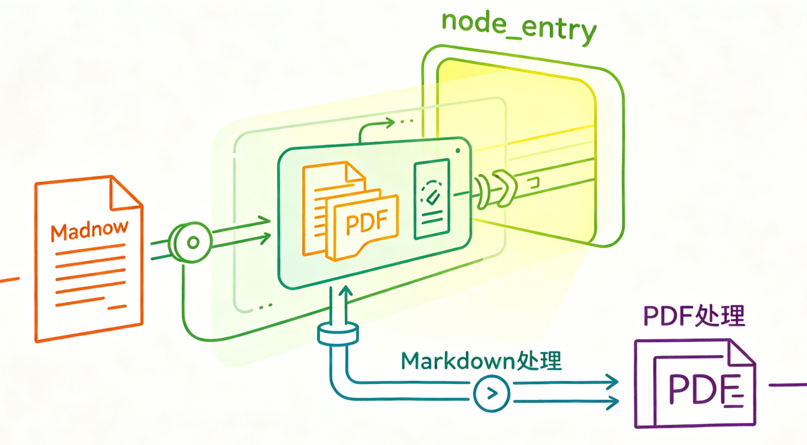

# 掌柜智库项目(RAG)实战

## 5. 导入数据节点实现与测试

### 5.1 入口与类型判断 (node_entry)

**节点文件**: `app/process/import_/agent/nodes/node_entry.py`
**对应 service 文件**: `app/rag/import_/entry_service.py`
**相关工具类位置**: `app/shared/utils/task_utils.py`

#### 节点作用与实现思路

**节点作用**：`node_entry` 作为导入流程的**入口节点**，承担文件路由分发的核心职责。节点接收全局流转状态 `state`，更新自身执行状态后，调用业务方法完成文件类型解析，依据识别结果划分不同执行分支，为后续差异化处理流程提供决策依据。

**对应服务能力**：`resolve_input_file()` 是文件类型识别的核心业务方法。该方法读取状态中的本地文件路径，判定文件为 Markdown 或 PDF 格式，并将文件路径、文件名称、各类文件启用标识等信息回填至全局状态，完成基础数据装填。



**补充理解**: 这一层虽然现在只识别 `.md` 和 `.pdf`，但它本质上也是导入流程的统一入口。后期如果项目要扩展 `docx`、`txt` 或其他文件类型，通常也是优先从这一节点和对应 service 开始扩展。

**实现思路**:

1. **文件类型识别**：作为导入流程首环节，优先判定待处理文件格式，暂不执行文本分块、向量化等后续操作。
2. **状态数据补全**：识别完成后，将文件路径、标题及功能启停标识等信息回填至全局状态`state`。
3. **流程分支路由**：主图依据状态内的启停标识，将任务分发至对应处理链路，分别执行 Markdown 或 PDF 专属流程。
4. **预留扩展能力**：当前仅适配 Markdown、PDF 格式，后续新增 docx、txt 等文件类型时，可在此层迭代识别逻辑，快速完成兼容。
5. **任务进度上报**：调用工具类记录节点启停状态，同步任务进度，支撑前端状态展示。

#### 步骤分解

**节点层 (`node_entry`) 步骤**

1.  **接收状态**: 获取主图传入的 `state`。
2.  **记录开始**: 调用 `add_running_task()` 标记当前节点开始执行。
3.  **调用 service**: 将 `state` 交给 `resolve_input_file()` 做真正业务处理。
4.  **记录完成**: 调用 `add_done_task()` 标记当前节点执行完成。
5.  **返回结果**: 将更新后的 `state` 返回给主图。

**service 层 (`resolve_input_file`) 步骤**

1.  **读取输入路径**: 获取 `local_file_path`。
2.  **空值校验**: 若路径为空，直接输出警告并返回原状态。
3.  **判断文件类型**: 检查后缀是 `.md` 还是 `.pdf`。
4.  **回写路由标记**: 设置 `is_md_read_enabled` 或 `is_pdf_read_enabled`。
5.  **回写标准路径**: 把识别结果写入 `md_path` 或 `pdf_path`。
6.  **提取文件标题**: 用 `Path(local_file_path).stem` 提取 `file_title`。
7.  **返回最新状态**: 把可供下游节点继续使用的状态返回。

####  工具类解读：任务追踪

**文件**: `app/shared/utils/task_utils.py`

**实现思路**:

1.  **内存管理**: 使用简单的内存字典 `_tasks_running_list` 和 `_tasks_done_list` 记录任务状态，轻量高效。
2.  **状态映射**: 维护 `_NODE_NAME_TO_CN` 字典，将技术性的节点名称（如 `node_entry`）映射为用户友好的中文名称（如 `检查文件`），方便前端展示。
3.  **懒初始化**: 通过 `_ensure_task()` 保证任务字典在首次使用时自动初始化，不要求入口节点手动提前创建。
4.  **SSE 集成**: 集成 SSE 推送机制，在需要时可以实时把任务进度推送到前端。
5.  **操作封装**: 提供 `add_running_task` 和 `add_done_task` 接口，方便各节点调用，屏蔽底层状态管理细节。

#### 节点代码实现


```python
from app.shared.runtime.logger import logger, node_log
from app.shared.utils.task_utils import add_done_task, add_running_task
from app.process.import_.agent.state import ImportGraphState, create_default_state
from app.rag.import_ import resolve_input_file


@node_log("node_entry")
def node_entry(state: ImportGraphState) -> ImportGraphState:
    """
    节点: 入口节点 (node_entry)
    为什么叫这个名字: 作为图的 Entry Point，负责接收外部输入并决定流程走向。
    # 
    """
    add_running_task(state["task_id"], "node_entry")
    # 这里仅负责识别文件类型和补齐基础状态，不承担重业务逻辑。
    state = resolve_input_file(state)
    add_done_task(state["task_id"], "node_entry")
    return state
```

#### service 代码实现

```python
import json
from pathlib import Path

from app.shared.runtime.logger import node_log
from app.shared.utils.task_utils import add_done_task, add_running_task
from app.process.import_.agent.state import ImportGraphState
from app.rag.import_.entry_service import resolve_input_file


@step_log("resolve_input_file")
def resolve_input_file(state: dict) -> ImportGraphState:
    """
    文件类型识别与状态初始化节点（导入流程入口）
    核心功能：根据本地文件路径识别文件类型，自动装配对应状态字段，为后续流程路由提供依据
    
    业务逻辑：
        1. 校验文件路径是否存在
        2. 根据后缀识别 MD / PDF 文件
        3. 自动填充对应路径、路由开关、文件标题
        4. 不支持的文件类型直接终止流程
    Args:
        state: 导入流程全局状态，必须包含 local_file_path 字段
    Returns:
        ImportGraphState: 补全文件信息后的完整状态对象
    """
    # 1. 获取文件本地路径
    local_file_path = state.get("local_file_path")
    
    # 2. 校验文件路径是否为空，为空则直接结束流程
    if not local_file_path:
        node_log.warning("节点:resolve_input_file, 文件路径为空，直接终止当前导入流程")
        return state

    # 3. 识别文件类型并设置对应状态与路由开关
    if local_file_path.endswith(".md"):
        # Markdown 文件：启用 MD 处理链路，禁用 PDF 处理链路
        state["md_path"] = local_file_path
        state["is_md_read_enabled"] = True
        state["is_pdf_read_enabled"] = False

    elif local_file_path.endswith(".pdf"):
        # PDF 文件：启用 PDF 处理链路，禁用 MD 处理链路
        state["pdf_path"] = local_file_path
        state["is_pdf_read_enabled"] = True
        state["is_md_read_enabled"] = False

    else:
        # 不支持的文件类型，直接终止流程
        node_log.warning(
            f"节点:resolve_input_file, 不支持的文件类型: {local_file_path}，终止流程"
        )
        return state

    # 4. 自动提取文件标题（不带后缀） s
    state["file_title"] = Path(local_file_path).stem

    # 5. 返回补全后的状态
    return state
```

关键语法补充说明

| 语法 / 函数                       | 具体作用                            | 执行示例                                        |
| :-------------------------------- | :---------------------------------- | :---------------------------------------------- |
| `Path(local_file_path).stem`      | 从完整路径提取文件名（不含后缀）    | `C:/data/test.pdf` → `test`                     |
| `state.get("key", "")`            | 安全提取状态值，无 key 时返回默认值 | `state.get("a", "")` → 无 "a" 则返回 ""         |
| `@node_log("node_entry")`         | 记录节点开始、完成、异常日志        | 包装 `node_entry`，自动输出节点级日志           |
| `@step_log("resolve_input_file")` | 记录 service 步骤开始、完成、异常   | 包装 `resolve_input_file`，自动输出步骤级日志   |
| `add_running_task/add_done_task`  | 记录任务的节点运行状态              | 用于任务监控面板，展示节点执行进度(fastapi使用) |

#### 单元测试

##### 节点测试

您可以在 `node_entry.py` 文件底部直接运行以下测试代码：

```python
if __name__ == '__main__':
    from app.shared.runtime.logger import logger
    from app.process.import_.agent.state import create_default_state
    # 单元测试：覆盖不支持类型、MD、PDF三种场景
    logger.info("===== 开始node_entry节点单元测试 =====")

    # 测试1: 不支持的TXT文件
    test_state1 = create_default_state(
        task_id="test_task_001",
        local_file_path="联想海豚用户手册.txt"
    )
    result_1 =  node_entry(test_state1)
    print(f"第一次测试结果: \n {json.dumps(result_1, indent=4, ensure_ascii=False)}")
    # 测试2: MD文件
    test_state2 = create_default_state(
        task_id="test_task_002",
        local_file_path="小米用户手册.md"
    )
    result_2 = node_entry(test_state2)
    print(f"第二次测试结果: \n {json.dumps(result_2, indent=4, ensure_ascii=False)}")
    # 测试3: PDF文件
    test_state3 = create_default_state(
        task_id="test_task_003",
        local_file_path="万用表的使用.pdf"
    )
    result_3 = node_entry(test_state3)

    print(f"第三次测试结果: \n {json.dumps(result_3, indent=4, ensure_ascii=False)}")

    logger.info("===== 结束node_entry节点单元测试 =====")
```
