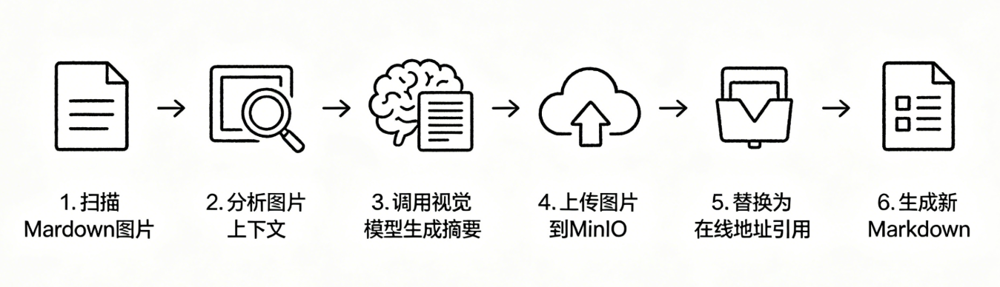

# 掌柜智库项目(RAG)实战

## 5. 导入数据节点实现与测试

### 5.3 图片处理 (node_md_img)

**节点文件**: `app/process/import_/agent/nodes/node_md_img.py`
**相关工具类位置**: `app/shared/utils/task_utils.py`

#### 场景背景与能力目标

本节主要处理 Markdown 内的图片，解决原图引用无法适配检索流程的问题。原始本地图片引用存在三大弊端：路径跨环境易失效、图片无文本语义无法参与向量检索、大模型无法读取图片内容。



本节点会对图片做增强处理，改造引用格式，让图片可正常参与多模态 RAG 全流程，具体流程如下：

1. 提取文档内所有引用图片
2. 截取图片周边文本上下文
3. 调用视觉模型生成图片文字摘要
4. 将图片上传至 MinIO 对象存储
5. 用``替换原有本地图片引用
6. 生成新 Markdown 并更新流程状态

处理后的文档同时保留图片语义与可外网访问地址，完美适配后续切块、检索、问答等环节。

#### 1. 节点与依赖定位

**节点文件**: `app/process/import_/agent/nodes/node_md_img.py`
**对应 service 文件**: `app/rag/import_/markdown_image_service.py`
**第一次引入的 infra 文件 1**: `app/infra/object_storage/minio_gateway.py`
**第一次引入的 infra 文件 2**: `app/infra/llm/providers.py`
**提示词加载位置**: `app/shared/runtime/load_prompt.py`
**提示词文件位置**: `app/resources/prompts/image_summary.prompt`
**相关配置位置**: `app/rag/import_/config.py`

#### 2. 节点职责与 service 入口

**节点作用**: `node_md_img` 的职责是承接图节点状态、记录任务进度，并把具体业务交给 `enrich_markdown_images()`。

**对应 service 作用**: `enrich_markdown_images()` 是这一节真正的业务总入口。它会完成六件事：

1. 读取 Markdown 正文、Markdown 路径和图片目录
2. 判断当前文档是否存在可处理图片
3. 扫描 Markdown 中真实被引用的图片并截取上下文
4. 调用视觉模型生成图片摘要
5. 上传图片到 MinIO 并替换 Markdown 中的本地引用
6. 生成新的 Markdown 文件并回写 `md_path` 与 `md_content`

#### 3. 基础设施能力说明

##### 3.1 MinIO 安装与启动

如果本地已经安装了 Docker，可以直接用下面的命令启动 MinIO：

```cmd
docker run -d --name minio \
    -p 9000:9000 -p 9001:9001 \
    -e "MINIO_ROOT_USER=minioadmin" \
    -e "MINIO_ROOT_PASSWORD=minioadmin" \
    -v $(pwd)/volumes/minio/data:/data \
    quay.io/minio/minio server /data --console-address ":9001"
```

启动完成后，可以通过下面两个地址访问：

- 对象存储服务地址：`http://部署服务ip:9000`
- MinIO 控制台地址：`http://部署服务ip:9001`

默认登录账号和密码就是启动命令中设置的：

- 用户名：`minioadmin`
- 密码：`minioadmin`

启动后，需要把 `.env` 中的 MinIO 配置和服务保持一致：

```ini
MINIO_ENDPOINT=39.105.7.90:9000
MINIO_ACCESS_KEY=minioadmin
MINIO_SECRET_KEY=minioadmin
MINIO_BUCKET_NAME=enterprise-rag
MINIO_IMG_DIR=/kb-images
MINIO_SECURE=False
```

这里有两个细节需要特别注意：

1. `MINIO_ENDPOINT` 只写 `39.105.7.90:9000`，不要带 `http://` 或 `https://`
2. `MINIO_IMG_DIR` 建议以 `/` 开头，这样后面拼接对象路径时更统一

如果需要查看运行状态，可以继续使用下面这几个命令：

```cmd
docker stop minio
docker start minio
docker logs -f minio
```

MinIO 在 **2025 年 5 月之后的社区版** 中，**完全移除了 Web 控制台（9001 端口）的权限管理入口**（包括 Identity、Policies 等菜单），仅保留「文件 / 桶的基础浏览上传功能」，这是官方对社区版的功能精简（商业版仍保留完整控制台权限功能）。

**Minio使用和工具类封装**

官方API: https://www.minio.org.cn/docs/minio/linux/developers/python/API.html

````python
"""
工具模块，负责提供 minio 相关的辅助能力。
"""
import json

# 导入MinIO官方Python SDK核心类（用于MinIO对象存储的客户端操作）
from minio import Minio

# 导入项目内部配置与日志工具
from app.shared.config.minio_config import minio_config  # MinIO相关配置（端点、密钥、桶名等）
from app.shared.runtime.logger import logger            # 项目统一日志工具

# 全局MinIO客户端实例（单例模式，避免重复创建连接，提升性能）
_minio_client: Minio | None = None


# 1. 定义MinIO客户端连接创建函数（私有函数，仅内部调用）
def _create_minio_client() -> Minio:
    """
    创建并返回MinIO客户端连接
    核心作用：读取配置文件中的MinIO参数，初始化客户端连接
    :return: 初始化完成的MinIO客户端对象
    """
    return Minio(
        endpoint=minio_config.endpoint,        # MinIO服务端点（IP:端口）
        access_key=minio_config.access_key,    # MinIO访问密钥
        secret_key=minio_config.secret_key,    # MinIO秘密密钥
        secure=minio_config.minio_secure       # 是否启用HTTPS（True/False）
    )


# 2. 定义桶访问策略生成函数（私有函数，仅内部调用）
def _set_bucket_policy(bucket_name: str) -> str:
    """
    生成MinIO桶的访问策略字符串（JSON格式）
    核心策略：允许所有用户（Principal: "*"）对桶内所有对象执行读取操作（s3:GetObject）
    适配场景：图片上传后需公开访问（如MD中图片在线URL）
    :param bucket_name: 目标桶名
    :return: 序列化后的JSON格式访问策略字符串
    """
    # 策略模板（遵循AWS S3策略规范，MinIO兼容该规范）
    policy = {
        "Version": "2012-10-17",  # 策略版本（固定值，兼容S3标准）
        "Statement": [
            {
                "Effect": "Allow",  # 策略效果：允许访问
                "Principal": {"AWS": ["*"]},  # 授权对象：所有用户
                "Action": ["s3:GetObject"],  # 授权操作：读取桶内对象
                "Resource": [f"arn:aws:s3:::{bucket_name}/*"],  # 授权范围：桶内所有对象
            }
        ],
    }
    # 将字典策略序列化为JSON字符串，供MinIO设置使用
    return json.dumps(policy)


# 3. 定义桶初始化函数（私有函数，仅内部调用）
def _create_bucket_ready(client: Minio):
    """
    检查MinIO桶是否存在，不存在则创建，并设置访问策略
    核心作用：确保图片上传所需的桶已就绪，避免上传失败
    :param client: 已初始化的MinIO客户端对象
    """
    bucket_name = minio_config.bucket_name  # 从配置中获取目标桶名
    # 检查桶是否存在
    if not client.bucket_exists(bucket_name):
        client.make_bucket(bucket_name)  # 不存在则创建桶
        # 为新桶设置访问策略（允许公开读取，适配图片在线访问需求）
        client.set_bucket_policy(bucket_name, _set_bucket_policy(bucket_name))
        logger.info(f"MinIO桶 {bucket_name} 已创建，并设置访问策略")
    else:
        # 桶已存在，仅打印日志，不重复操作
        logger.info(f"MinIO桶 {bucket_name} 已存在，无需重复创建")


def get_minio_client() -> Minio:
    """
    获取全局MinIO客户端（懒加载模式，无锁版本，适配单线程场景）
    核心逻辑：
    1. 首次调用：初始化客户端 + 检查/创建桶 + 设置策略，将客户端实例赋值给全局变量
    2. 后续调用：直接复用全局客户端实例，避免重复创建连接（提升性能、节省资源）
    :return: 全局唯一的MinIO客户端对象
    """
    # 声明使用全局变量（修改全局变量需显式声明）
    global _minio_client

    # 懒加载：仅在客户端未初始化时执行创建逻辑
    if _minio_client is None:
        logger.info("开始初始化MinIO客户端（首次调用，执行懒加载）")
        client = _create_minio_client()          # 创建客户端连接
        _create_bucket_ready(client)             # 检查并初始化桶
        _minio_client = client                   # 赋值给全局变量，供后续复用
        logger.info("MinIO客户端初始化完成，已就绪可使用")

    # 复用全局客户端实例，直接返回
    return _minio_client
````

##### 3.2 MinIO gateway 定位

**文件**: `app/infra/object_storage/minio_gateway.py`

这一节第一次正式使用对象存储能力。当前项目没有把 MinIO 调用细节直接散落到 `rag/import_` 中，而是通过 `minio_gateway` 统一提供对象存储出口。

当前这层主要承担四个职责：

1. 暴露桶名 `bucket_name`
2. 暴露图片目录前缀 `image_dir`
3. 提供客户端对象 `client()`
4. 提供图片公开地址拼接方法 `build_image_url()`

```python
from minio import Minio

from app.shared.clients.minio_utils import get_minio_client
from app.infra.config.providers import infra_config


class MinIOGateway:
    """
    MinIO 对象存储网关类
    统一封装 MinIO 客户端获取、配置读取、图片URL拼接等能力，
    供全项目统一调用，避免到处写配置、重复拼接URL
    """

    @property
    def bucket_name(self) -> str:
        """获取 MinIO 存储桶名称（从全局配置读取）"""
        return infra_config.minio.bucket_name

    @property
    def image_dir(self) -> str:
        """获取 MinIO 中存放图片的目录路径（从全局配置读取）"""
        return infra_config.minio.minio_img_dir

    def client(self) -> Minio:
        """获取 MinIO 客户端实例，用于上传、下载、查询文件等操作"""
        return get_minio_client()

    def build_image_url(self, stem: str, image_name: str) -> str:
        """
        拼接生成 MinIO 图片的可访问URL（HTTP/HTTPS）
        :param stem: 文档名称（不带后缀），用于区分不同文档的图片
        :param image_name: 图片原始文件名
        :return: 可直接访问的 MinIO 图片完整URL
        """
        # 根据配置决定使用 http 还是 https
        protocol = "https" if infra_config.minio.minio_secure else "http"
        
        # 拼接最终可访问的图片在线地址
        return (
            f"{protocol}://{infra_config.minio.endpoint}/"
            f"{self.bucket_name}{self.image_dir}/{stem}/{image_name}"
        )


# 创建全局唯一的 MinIO 网关实例，全项目复用
minio_gateway = MinIOGateway()
```

##### 3.3 LLM provider 定位

**文件**: `app/infra/llm/providers.py`

这一节还第一次正式用到视觉模型。这里没有在业务函数里直接初始化模型客户端，而是统一通过 `llm_provider` 获取。

这一层当前最关键的是 `vision_chat()`：

- 上层业务只关心“拿到视觉模型客户端”
- 不关心底层到底怎么读配置、怎么创建客户端
- 这样后续如果更换视觉模型或调整接入方式，改动点会更集中

```python
from langchain_openai import ChatOpenAI

from app.infra.config.providers import infra_config
from app.shared.model import generate_embeddings, get_bge_m3_ef, get_llm_client, get_reranker_model


class LLMProvider:
    """
    LLM 模型统一网关（提供器）
    作用：封装所有大模型调用入口，统一管理普通对话、视觉模型、向量模型等
    外部业务只需要调用 llm_provider 就能获取各种模型，不用关心底层配置
    """

    def chat(self, model: str | None = None, json_mode: bool = False) -> ChatOpenAI:
        """
        获取【普通文本对话】LLM 客户端
        :param model: 可选，指定模型名称，不填则使用默认配置
        :param json_mode: 是否开启 JSON 格式输出模式
        :return: 可直接调用的 LangChain LLM 客户端
        """
        return get_llm_client(model=model, json_mode=json_mode)

    def vision_chat(self) -> ChatOpenAI:
        """
        获取【视觉对话】LLM 客户端（用于图片理解、图片摘要、多模态理解）
        默认使用配置中的 lv_model（视觉大模型）
        :return: 视觉模型客户端
        """
        return get_llm_client(model=infra_config.llm.lv_model)


# 创建全局唯一的 LLM 提供器实例，全项目通用，避免重复创建
llm_provider = LLMProvider()
```

##### 3.4 提示词加载位置

图片摘要提示词不写死在业务函数里，而是放到资源目录统一管理。

**提示词文件**: `app/resources/prompts/image_summary.prompt`

```text
这是“{root_folder}”文件中的一张图片，图片上文部分为“{image_content[0]}”，
下文部分为“{image_content[1]}”，请用中文简要总结这张图片的内容，用于 Markdown 图片标题，控制在50字以内。
```

**提示词加载函数**: `app/shared/runtime/load_prompt.py`

```python
from pathlib import Path
from app.shared.utils.path_util import PROJECT_ROOT
from app.shared.runtime.logger import logger


def load_prompt(name: str, **kwargs) -> str:
    prompt_path = PROJECT_ROOT / "app" / "resources" / "prompts" / f"{name}.prompt"
    if not prompt_path.exists():
        raise FileNotFoundError(f"提示词文件不存在：{prompt_path.absolute()}")

    raw_prompt = prompt_path.read_text(encoding="utf-8")
    if kwargs:
        rendered_prompt = raw_prompt.format(**kwargs)
        logger.debug(f"提示词渲染成功，替换变量：{list(kwargs.keys())}")
        return rendered_prompt
    return raw_prompt
```

#### 4. 环境变量与关键配置

这一节同时依赖视觉模型配置和 MinIO 配置。对应口径以当前项目 `.env.example` 为准。

.env

```ini
OPENAI_BASE_URL=https://your-llm-endpoint/v1
OPENAI_API_KEY=sk-your-key
LLM_DEFAULT_MODEL=qwen-plus
LLM_DEFAULT_TEMPERATURE=0.1
VL_MODEL=qwen-vl-max

MINIO_ENDPOINT=127.0.0.1:9000
MINIO_ACCESS_KEY=minioadmin
MINIO_SECRET_KEY=minioadmin
MINIO_BUCKET_NAME=enterprise-rag
MINIO_IMG_DIR=/kb-images
MINIO_SECURE=False
```

这一节还会用到一个导入链配置常量：

config.py

```python
SUPPORTED_IMAGE_EXTENSIONS = {".jpg", ".jpeg", ".png", ".gif", ".bmp", ".webp"}
```

#### 5. 业务步骤分析

这一节涉及 7 个核心函数，主链路如下：

`node_md_img -> enrich_markdown_images -> load_markdown_and_image_dir / scan_images / summarize_images / upload_images_and_replace / backup_markdown`

##### 5.1 `node_md_img`

**函数签名**: `node_md_img(state: ImportGraphState) -> ImportGraphState`

**步骤**

1. 记录当前节点开始执行
2. 调用 `enrich_markdown_images(state)` 执行图片增强主流程
3. 记录当前节点执行完成
4. 返回更新后的 `state`

##### 5.2 `enrich_markdown_images`

**函数签名**: `enrich_markdown_images(state: dict) -> dict`

**步骤**

1. 调用 `load_markdown_and_image_dir()` 读取正文、路径和图片目录
2. 判断图片目录是否存在且是否为空
3. 调用 `scan_images()` 获取图片与上下文列表
4. 调用 `summarize_images()` 生成图片摘要
5. 调用 `upload_images_and_replace()` 替换 Markdown 中的图片引用
6. 调用 `backup_markdown()` 生成新的 Markdown 文件
7. 回写 `state["md_content"]` 和 `state["md_path"]`

##### 5.3 `load_markdown_and_image_dir`

**函数签名**: `load_markdown_and_image_dir(state: dict) -> tuple[str, Path, Path]`

**步骤**

1. 读取 `md_content` 和 `md_path`
2. 校验 `md_path` 是否为空
3. 如果 `md_content` 为空，则按 `md_path` 读取文件正文
4. 拼接图片目录 `images`
5. 返回正文、Markdown 路径和图片目录路径

##### 5.4 `scan_images`

**函数签名**: `scan_images(md_content: str, images_path_obj: Path) -> list[tuple[str, str, tuple[str, str]]]`

**步骤**

1. 遍历 `images` 目录下的文件
2. 调用 `is_supported_image()` 过滤非图片文件
3. 使用正则表达式检查图片是否在 Markdown 中被引用
4. 截取图片前后各 100 个字符作为上下文
5. 返回图片名、图片路径、上下文元组列表

##### 5.5 `summarize_images`

**函数签名**: `summarize_images(image_context_list: list[tuple[str, str, tuple[str, str]]], stem: str) -> Dict[str, str]`

**步骤**

1. 通过 `llm_provider.vision_chat()` 获取视觉模型客户端
2. 对每张图片先调用 `apply_api_rate_limit()` 控制访问频率
3. 调用 `load_prompt()` 渲染图片摘要提示词
4. 把图片字节转成 Base64 字符串
5. 构造 `HumanMessage` 多模态消息
6. 调用模型生成图片摘要
7. 返回 `{图片名: 图片摘要}` 字典

##### 5.6 `upload_images_and_replace`

**函数签名**: `upload_images_and_replace(image_context_list: list[tuple[str, str, tuple[str, str]]], image_summaries_dict: Dict[str, str], md_content: str, stem: str) -> str`

**步骤**

1. 通过 `minio_gateway.client()` 获取 MinIO 客户端
2. 查询并删除当前文档在对象存储中的旧图片
3. 将本次图片重新上传到 MinIO
4. 通过 `minio_gateway.build_image_url()` 生成公开访问地址
5. 用 `` 替换原始 Markdown 图片引用
6. 返回替换后的 Markdown 正文

##### 5.7 `backup_markdown`

**函数签名**: `backup_markdown(new_md_content: str, md_path_obj: Path) -> str`

**步骤**

1. 在原 Markdown 同目录下生成 `_new.md` 文件名
2. 将增强后的 Markdown 内容写入新文件
3. 返回新文件路径字符串

#### 6. 节点代码实现

```python
from app.shared.runtime.logger import node_log
from app.shared.utils.task_utils import add_done_task, add_running_task
from app.process.import_.agent.state import ImportGraphState
from app.rag.import_ import enrich_markdown_images


@node_log("node_md_img")
def node_md_img(state: ImportGraphState) -> ImportGraphState:
    """
    节点: 图片处理 (node_md_img)
    为什么叫这个名字: 处理 Markdown 中的图片资源 (Image)。
    """
    add_running_task(state["task_id"], "node_md_img")
    state = enrich_markdown_images(state)
    add_done_task(state["task_id"], "node_md_img")
    return state
```

#### 7. service 总入口

`enrich_markdown_images()` 是这一节的 service 总入口。它负责串联“读取 -> 扫描 -> 总结 -> 上传替换 -> 备份”这 5 个子步骤。

```python
import base64
import mimetypes
import os
import re
from pathlib import Path
from typing import Dict

from langchain.messages import HumanMessage
from langchain_core.output_parsers import StrOutputParser
from minio.deleteobjects import DeleteObject

from app.shared.runtime.load_prompt import load_prompt
from app.shared.runtime.logger import logger, step_log
from app.infra.llm import llm_provider
from app.rag.import_.config import SUPPORTED_IMAGE_EXTENSIONS
from app.infra.object_storage import minio_gateway
from app.shared.utils.rate_limit_utils import apply_api_rate_limit


@step_log("enrich_markdown_images")
def enrich_markdown_images(state: dict) -> dict:
    md_content, md_path_obj, images_path_obj = load_markdown_and_image_dir(state)
    if not images_path_obj.is_dir() or len(list(images_path_obj.iterdir())) == 0:
        logger.warning("图片文件夹为空或者没有图片,无需后续处理!")
        return state

    image_context_list = scan_images(md_content, images_path_obj)
    logger.info(f"已经获取上下文信息:{image_context_list}")
    image_summaries_dict = summarize_images(image_context_list, md_path_obj.stem)
    new_md_content = upload_images_and_replace(image_context_list, image_summaries_dict, md_content, md_path_obj.stem)
    state["md_content"] = new_md_content
    state["md_path"] = backup_markdown(new_md_content, md_path_obj)
    return state
```

#### 8. 子函数 1：读取 Markdown 与图片目录

##### 8.1 函数说明：`load_markdown_and_image_dir`

```python
@step_log("load_markdown_and_image_dir")
def load_markdown_and_image_dir(state: dict) -> tuple[str, Path, Path]:
    md_content = state.get("md_content", "")
    md_path = state.get("md_path")
    if not md_path:
        logger.error("md_path核心参数为空,无法继续!!")
        raise ValueError("md_path核心参数为空,无法继续!!")

    md_path_obj = Path(md_path)
    if not md_content:
        logger.warning("md_content为空,根据地址读取!")
        md_content = md_path_obj.read_text(encoding="utf-8")
        state["md_content"] = md_content

    images_path_obj = md_path_obj.parent / "images"
    return md_content, md_path_obj, images_path_obj
```

**参数与返回值说明**

- 输入参数：`state: dict`
- 返回结果：`tuple[str, Path, Path]`
- 返回内容：依次是 `md_content`、`md_path_obj`、`images_path_obj`

**实现要点**

1. `md_content` 允许为空，空时可以从磁盘兜底读取
2. `md_path` 必须存在，否则后续图片处理无从谈起
3. 图片目录固定按 `Markdown 同目录 / images` 组织

#### 9. 子函数 2：扫描图片与提取上下文

##### 9.1 `re` 基础示例

这一节会用到 `re.compile()`、`re.search()` 和 `re.escape()`。当前目标不是做复杂语法解析，而是从 Markdown 正文中找出“某张图片是否被引用”。

```python
import re

md_content = "这里有一张图 .png) 再来一张 .png)"
image_name = "demo(1).png"
# 编译正则（不变） 正则中有两类字符 元字符 . * ? ! [a-z] {} 字面字符 a  png
rep = re.compile(r"\!\[.*?\]\(.*?" + re.escape(image_name) + r".*?\)")

# 1. search：全文找【第一个】匹配 → 返回 match 对象
match_obj = rep.search(md_content)
print("1. search 结果：", match_obj.group() if match_obj else "未找到")

# 2. match：只从【开头】匹配 → 这里开头不是图片语法，必找不到
match_first = rep.match(md_content)
print("2. match 结果：", "找到" if match_first else "未找到（只匹配开头）")

# 3. findall：找【所有】匹配 → 返回字符串列表
all_list = rep.findall(md_content)
print("3. findall 列表：", all_list)

# 4. finditer：找【所有】匹配 → 返回 match 对象（你要的“search 匹配所有”）
print("4. finditer 遍历所有：")
for m in rep.finditer(md_content):
    print("  - 内容：", m.group(), " | 位置：", m.span())

# () 和 ?  贪婪匹配
text = "A123B456B"
# 1. 用 .*  → 贪婪（吃到最后）
print(re.findall(r"A(.*)B", text))  # 输出：['123B456']
# 2. 用 .*? → 非贪婪（找到第一个就停）
print(re.findall(r"A(.*?)B", text)) # 输出：['123']
```

这里最关键的是 `re.escape(image_name)`。因为图片文件名里可能带有 `(`、`)`、`.` 这类正则特殊字符，如果不先转义，正则表达式就可能匹配失败或误匹配。

##### 9.2 函数说明：`scan_images`

```python
def is_supported_image(image_name):
    """
    判断文件是否为支持的图片格式
    :param image_name: 文件名（含后缀）
    :return: 是支持的图片返回 True，否则 False
    """
    return image_name.lower() in SUPPORTED_IMAGE_EXTENSIONS


@step_log("scan_images")
def scan_images(md_content: str, images_path_obj: Path) -> list[tuple[str, str, tuple[str, str]]]:
    """
    扫描图片目录 + Markdown 内容，找出【真正被MD引用的图片】，并提取图片上下文
    作用：只处理真正用到的图片，过滤无效文件，同时截取上下文给视觉模型做摘要

    :param md_content: Markdown 文本内容
    :param images_path_obj: 图片所在文件夹路径
    :return: 列表 -> (图片名, 图片完整路径, (上文100字符, 下文100字符))
    """
    # 存储最终筛选出的【有效图片 + 上下文信息】
    image_context_list: list[tuple[str, str, tuple[str, str]]] = []
    # 遍历图片目录下的所有文件
    for image_file in images_path_obj.iterdir():
        image_name = image_file.name 
        # 1. 过滤：不是支持的图片格式直接跳过
        if not is_supported_image(image_name):
            logger.warning(f"{image_name}不是图片,无需处理,跳过本次!!")
            continue
        # 2. 正则匹配：在 MD 内容中查找是否引用了当前图片
        # 匹配格式：
        rep = re.compile(r"\!\[.*?\]\(.*?" + re.escape(image_name) + r".*?\)")
        match_obj = rep.search(md_content)
        # 图片存在，但 MD 里没用到 → 跳过
        if not match_obj:
            logger.warning(f"{image_name}没有在md中使用,跳过本次处理!")
            continue
        # 3. 获取图片在 MD 中的位置（起始、结束下标）
        start, end = match_obj.span()
        # 4. 截取图片【上方100字符】作为上文（防止越界）
        pre_context = md_content[max(start - 100, 0):start]
        # 5. 截取图片【下方100字符】作为下文（防止越界）
        pos_context = md_content[end:min(end + 100, len(md_content))]
        # 6. 把有效信息加入结果列表
        # 格式：(图片名, 图片完整路径, (上文, 下文))
        image_context_list.append((image_name, str(image_file), (pre_context, pos_context)))

    # 返回所有真正被使用的图片信息
    return image_context_list
```

**参数与返回值说明**

- 输入参数：`md_content: str`、`images_path_obj: Path`
- 返回结果：`list[tuple[str, str, tuple[str, str]]]`
- 返回内容：每一项都是 `(图片名, 图片路径, (上文, 下文))`

**实现要点**

1. 不是目录里的所有图片都处理，只处理 Markdown 里真正被引用的图片
2. 上下文信息会直接用于后续视觉模型提示词构造
3. 这里只取前后各 100 个字符，避免上下文过长

#### 10. 子函数 3：图片语义总结

##### 10.1 多模态消息结构

这一节不是把图片路径直接扔给模型，而是把“图片本体 + 文本提示词”一起组装成多模态消息。


```python
from langchain.messages import HumanMessage

message = HumanMessage(
    content=[
        {
            "type": "image_url",
            "image_url": {"url": "data:image/png;base64,xxx"},
        },
        {
            "type": "text",
            "text": "请用中文简要总结这张图片内容",
        },
    ]
)
```

这里有两个关键点：

- 图片不是传本地路径，而是传 `data:image/...;base64,...`
- 文本部分不是固定写死，而是来自 `load_prompt()` 渲染后的提示词

base64使用基本说明:

```python
import base64
from app.shared.runtime.logger import logger,PROJECT_ROOT


# ====================== 【你只需要改这里】填写你的图片路径 ======================
IMAGE_PATH = PROJECT_ROOT / "images" / "55.png"  # 改成你的图片：a.jpg / logo.png 等
COPY_IMAGE_PATH = PROJECT_ROOT / "images" / "55_copy.png"  # 改成你的图片：a.jpg / logo.png 等
# ==============================================================================

# -------------------- 1. 图片 → Base64 字符串（编码） --------------------
print("正在把图片转 Base64...")
with open(IMAGE_PATH, "rb") as image_file:
    # 读取图片二进制 → 转 base64 → 转字符串
    base64_string = base64.b64encode(image_file.read()).decode("utf-8")
print("✅ 图片转 Base64 完成！")
print("Base64 字符串前50个字符：", base64_string[:50], "...")


# -------------------- 2. Base64 字符串 → 还原成图片（解码） --------------------
print("\n正在把 Base64 转回图片...")
output_image_path = COPY_IMAGE_PATH
# 解码 Base64 回到二进制
image_binary = base64.b64decode(base64_string)
# 写入文件
with open(output_image_path, "wb") as f:
    f.write(image_binary)
```

##### 10.2 函数说明：`summarize_images`

```python
@step_log("summarize_images")
def summarize_images(image_context_list: list[tuple[str, str, tuple[str, str]]], stem: str) -> Dict[str, str]:
    image_summaries_dict: Dict[str, str] = {}
    vm_model = llm_provider.vision_chat()
    for image_name, image_path_str, context in image_context_list:
        apply_api_rate_limit()
        image_context_prompt = load_prompt("image_summary", root_folder=stem, image_content=context)
        image_path_obj = Path(image_path_str)
        image_data = base64.b64encode(image_path_obj.read_bytes()).decode(encoding="utf-8")
        message = HumanMessage(
            content=[
                {
                    "type": "image_url",
                    "image_url": {
                        "url": f"data:{mimetypes.guess_type(image_name)[0]};base64,{image_data}"
                    },
                },
                {"type": "text", "text": image_context_prompt},
            ]
        )
        summary = (vm_model | StrOutputParser()).invoke([message])
        image_summaries_dict[image_name] = summary
    return image_summaries_dict
```

**参数与返回值说明**

- 输入参数：`image_context_list`、`stem`
- 返回结果：`Dict[str, str]`
- 返回内容：`{图片文件名: 图片摘要}`

**实现要点**

1. `apply_api_rate_limit()` 是全局滑动窗口限流工具，避免连续调用视觉模型触发限流
2. `mimetypes.guess_type()` 会根据图片文件名推断 MIME 类型
3. `StrOutputParser()` 用来把模型输出收成纯文本摘要

#### 11. 子函数 4：上传图片并替换 Markdown 引用

##### 11.1 函数说明：`upload_images_and_replace`

```python
@step_log("upload_images_and_replace")
def upload_images_and_replace(
    image_context_list: list[tuple[str, str, tuple[str, str]]],
    image_summaries_dict: Dict[str, str],
    md_content: str,
    stem: str,
) -> str:
    """
    图片上传 + Markdown内容替换
    1. 清空MinIO中该文档的旧图片（避免脏数据）
    2. 上传新图片到MinIO
    3. 将MD中原生本地图片 → 替换为【图片摘要】+【在线URL】
    返回替换完成后的新MD文本
    """
    # 获取MinIO客户端实例
    minio_client = minio_gateway.client()

    # ===================== 1. 清空该文档在MinIO中的旧图片 =====================
    # 列出当前文档(stem)在MinIO中已存在的所有图片
    object_list = minio_client.list_objects(
        bucket_name=minio_gateway.bucket_name,
        prefix=f"{minio_gateway.image_dir[1:]}/{stem}/",
        recursive=True,
    )
    # 构造批量删除对象列表
    delete_object_list = [DeleteObject(obj.object_name) for obj in object_list]
    # 执行批量删除
    errors = minio_client.remove_objects(
        bucket_name=minio_gateway.bucket_name,
        delete_object_list=delete_object_list,
    )
    # 打印删除失败的错误信息
    for error in errors:
        logger.warning(f"删除失败,失败原因:{error}")

    # ===================== 2. 上传所有新图片到 MinIO =====================
    # 存储：图片文件名 → 在线访问URL
    image_url_dict: dict[str, str] = {}
    for image_name, image_path_str, _ in image_context_list:
        try:
            # 上传本地图片到MinIO
            minio_client.fput_object(
                bucket_name=minio_gateway.bucket_name,
                object_name=f"{minio_gateway.image_dir}/{stem}/{image_name}",
                file_path=image_path_str,
                content_type=mimetypes.guess_type(image_name)[0],
            )
            # 构建图片在线URL并保存
            image_url_dict[image_name] = minio_gateway.build_image_url(stem=stem, image_name=image_name)
        except Exception:
            logger.warning(f"本次图片上传失败:{image_name},跳过继续上传下一张!")
            continue

    # 如果所有图片都上传失败，直接返回原内容
    if not image_url_dict:
        logger.warning("图片上传全部失败!")
        return md_content

    # ===================== 3. 替换 MD 中的图片引用 =====================
    # 遍历所有已上传成功的图片
    for image_name, image_url in image_url_dict.items():
        # 拿到当前图片的AI摘要
        image_summary = image_summaries_dict[image_name]
        # 正则匹配：
        rep = re.compile(r"\!\[.*?\]\(.*?" + re.escape(image_name) + r".*?\)")

        # ----------------------- 重点：为什么用 lambda？-----------------------
        # re.sub 的第二个参数需要是【替换模板】或【处理函数】
        # 我们需要动态拼接： → 必须用函数动态生成
        # lambda _: ...  这里的 _ 表示匹配到的对象（我们不需要它，所以用下划线忽略）
        # -------------------------------------------------------------------
        md_content = rep.sub(lambda _: f"", md_content)

    # 返回替换完成的最终MD内容
    return md_content
```

**参数与返回值说明**

- 输入参数：`image_context_list`、`image_summaries_dict`、`md_content`、`stem`
- 返回结果：`str`
- 返回内容：替换后的 Markdown 正文

**实现要点**

1. 每次上传前先删除当前文档对应的旧图片，避免对象存储残留旧版本
2. 图片 URL 不手写拼接，而是统一走 `minio_gateway.build_image_url()`
3. 正则替换时使用 `lambda`，可以避免替换字符串再次被正则解释

#### 12. 子函数 5：备份 Markdown 文件

##### 12.1 函数说明：`backup_markdown`

```python
@step_log("backup_markdown")
def backup_markdown(new_md_content: str, md_path_obj: Path) -> str:
    """
    备份并保存【增强后的新 Markdown 文件】
    作用：不覆盖原始 MD 文件，生成一个 _new.md 的新版本，保证原始文件安全
    :param new_md_content: 图片增强、替换完成后的最新 MD 内容
    :param md_path_obj: 原始 MD 文件路径对象
    :return: 新 MD 文件的字符串路径
    """
    # 拼接新文件路径：原始文件名 + _new.md（例如：手册.md → 手册_new.md）
    new_md_path_obj = md_path_obj.with_name(f"{md_path_obj.stem}_new.md")
    
    # 将新的 Markdown 内容写入文件，使用 UTF-8 编码保证中文不乱码
    new_md_path_obj.write_text(new_md_content, encoding="utf-8")
    
    # 返回新文件的字符串路径，存入 state 供后续节点使用
    return str(new_md_path_obj)
```

**参数与返回值说明**

- 输入参数：`new_md_content: str`、`md_path_obj: Path`
- 返回结果：`str`
- 返回内容：新 Markdown 文件路径

**实现要点**

1. 当前实现不会覆盖原始 Markdown，而是生成 `_new.md`
2. 这样既能保留原始文件，也便于课堂演示前后差异

#### 13. 关键语法补充和说明

##### 13.1 `base64.b64encode()`

```python
import base64
from pathlib import Path

image_data = base64.b64encode(Path("demo.png").read_bytes()).decode("utf-8")
```

作用是把图片字节转换成 Base64 字符串，便于拼成 `data:image/...;base64,...` 这类多模态输入。

##### 13.2 `mimetypes.guess_type()`

```python
import mimetypes

print(mimetypes.guess_type("demo.png")[0])
print(mimetypes.guess_type("demo.jpg")[0])
```

作用是根据文件名推断 MIME 类型。当前节点里既用于多模态消息，也用于上传 MinIO 时的 `content_type`。

##### 13.3 `Path.with_name()`

```python
from pathlib import Path

md_path_obj = Path("output/demo.md")
print(md_path_obj.with_name("demo_new.md"))
```

作用是在保持目录不变的前提下，直接替换文件名。当前节点里用它生成 `_new.md` 文件。

##### 13.4 `apply_api_rate_limit()`

```python
from app.shared.utils.rate_limit_utils import apply_api_rate_limit

apply_api_rate_limit()
```

当前实现是一个全局滑动窗口限流工具。视觉模型调用前先执行一次，可以避免单位时间内请求过多。

#### 14. 测试优化

这一节建议拆成两类测试：

1. **节点联调测试**: 验证 `node_md_img -> enrich_markdown_images` 整条链路是否打通
2. **service 级测试**: 优先测试不依赖外部服务的 `scan_images()` 或 `load_markdown_and_image_dir()`

##### 14.1 节点联调测试

```python
if __name__ == "__main__":
    from app.shared.utils.path_util import PROJECT_ROOT
    logger.info(f"本地测试 - 项目根目录：{PROJECT_ROOT}")

    test_md_name = os.path.join(r"output\hak180使用说明书", "hak180使用说明书.md")
    test_md_path = os.path.join(PROJECT_ROOT, test_md_name)

    if not os.path.exists(test_md_path):
        logger.error(f"本地测试 - 测试文件不存在：{test_md_path}")
        logger.info("请检查文件路径，或手动将测试MD文件放入项目根目录的output目录下")
    else:
        test_state = {
            "md_path": test_md_path,
            "task_id": "test_task_123456",
            "md_content": "",
        }
        logger.info("开始本地测试 - MD图片处理全流程")
        result_state = node_md_img(test_state)
        logger.info(f"本地测试完成 - 处理结果状态：{result_state}")
```

##### 14.2 service 级测试

这一节更适合先测 `scan_images()`，因为它不依赖 MinIO，也不依赖视觉模型，只验证“图片筛选 + Markdown 引用匹配 + 上下文截取”是否正确。

```python
from pathlib import Path


def test_scan_images_demo():
    md_content = "前文说明  后文说明"
    images_path_obj = Path("output/demo/images")
    result = scan_images(md_content, images_path_obj)
    print(result)
```

这个测试真正要准备的只有两样：

- `images_path_obj` 目录下存在 `demo.png`
- `md_content` 中确实引用了这张图
