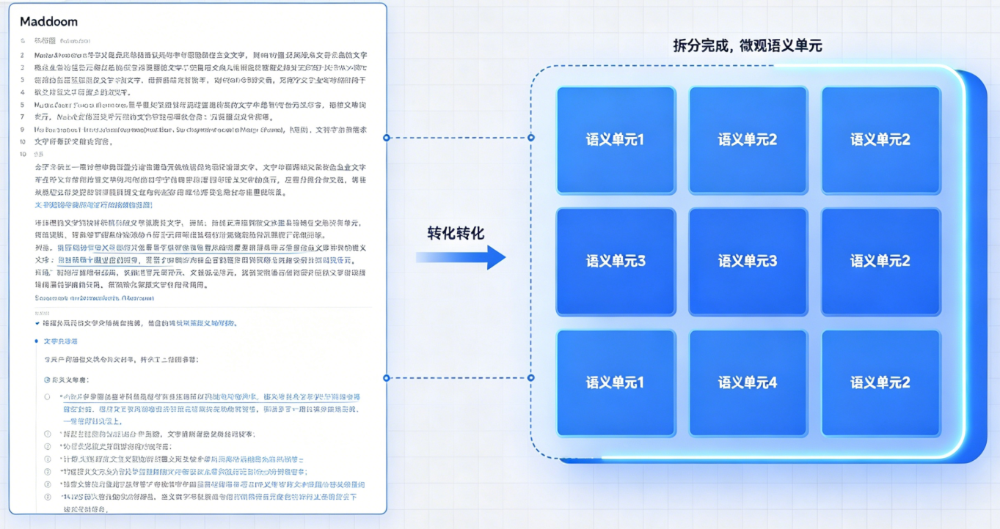

# 掌柜智库项目(RAG)实战

## 5. 导入数据节点实现与测试

### 5.4 文档切分 (node_document_split)

**节点文件**: `app/process/import_/agent/nodes/node_document_split.py`
**相关配置位置**: `app/rag/import_/config.py`

#### 切割原则

核心是将**长篇、无结构 / 半结构化的 Markdown 文档**，转化为「可直接向量化入库、可精准检索」的微观语义单元（Chunk），是 RAG 知识库的核心基础 —— 切分质量直接决定后续检索召回率、答案准确率，没有合理切分，再好的向量模型也无法发挥作用。



**切割核心原则**

1. 语义完整：不切断句子、代码块、表格、条款，保证单个 Chunk 是「完整的知识点 / 逻辑单元」；
2. 长度可控：Chunk 大小适配大模型上下文窗口和 Embedding 模型输入限制，不超上限、不碎片化；
3. 边界清晰：相邻 Chunk 保留合理重叠，避免关键信息落在两块交界处；
4. 可追溯：每个 Chunk 携带完整元数据（标题、父标题、文件名），便于后续溯源和引用。

#### 不同类型文档的切分思路

不同文档的结构、用途不同，切分形式和侧重点会不同，介绍每类「切分形式、核心要求、操作细节」

**类型 1：技术文档 / 手册 / API 文档**

有清晰的标题层级（# 一级标题、## 二级标题……），包含步骤、代码块、参数说明，核心是「步骤完整、代码可读、参数不遗漏」。

**切分思路:**

1. 语义拆分（第一步）：按「标题层级」切分，一级标题（#）拆分为大模块，二级标题（##）拆分为子模块，以此类推，确保每个模块对应一个完整的知识点；
2. 代码块保护：识别代码块标记（```/~~~），代码块整体保留，不拆分、不切割（哪怕代码块过长，也单独作为一个 Chunk，避免代码不可读）；
3. 长度优化（第二步）：
   - 若单个标题下的内容过长（如超过 2000 (自行设定)token），按「段落」拆分，优先在段落空行处切割，不切断步骤、不切断代码；
   - 若单个标题下的内容过短（如 < 300 token），且与相邻子标题属于同一知识点，合并为一个 Chunk；
4. 细节补充（第三步）：
   - 重叠率：5%~8%（如 2000 字符的 Chunk，重叠 100~160 字符）；
   - 元数据：保留「父标题（上级标题）、当前标题、文件名」，便于追溯知识点所属模块。

核心要求: *不切断步骤、不切断代码块、不切断参数说明，确保每个 Chunk 能独立体现一个 “操作 / 知识点”。*

**类型 2：论文 / 研究报告 / 长叙述文本**

有摘要、引言、章节、结论，以文字叙述为主，核心是「论点与论据连贯、逻辑完整」，无代码块，多为段落式结构。

**切分思路**

1. 语义拆分（第一步）：按「章节标题 + 段落」切分，先按章节标题拆分为大模块，再按段落拆分为子模块，确保每个子模块对应一个完整的论点 / 论据（如 “2.1 实验方法” 下的某一段实验描述）；
2. 长度优化（第二步）：
   - 若单个段落过长（如超过 3000 字符），按「句子」拆分，优先在句号、感叹号处切割，不硬断句子；
   - 若单个段落过短（如 < 400 字符），且与相邻段落属于同一论点，合并为一个 Chunk；
3. 细节补充（第三步）：
   - 重叠率：8%~12%（如 2500 字符的 Chunk，重叠 200~300 字符），避免论点边界丢失；
   - 元数据：保留「章节标题、段落序号、文件名」，标注论点所属章节。

核心要求: *论点与论据不分离，不切断句子，确保每个 Chunk 能完整表达一个观点 / 一段论述。*

**类型 3：对话记录 / 日志 / 工单（特殊场景）**

无标题、无章节，多为 “角色 + 内容” 的轮次结构（如客服对话、系统日志），核心是「上下文承接、轮次完整」。

**切分思路**

1. 语义拆分（第一步）：按「轮次 / 时间戳」切分，优先按 “完整轮次” 拆分（如 “用户提问→客服回复” 为一个完整轮次），日志按 “时间戳分段” 拆分；
2. 长度优化（第二步）：
   - 若轮次过长（如多轮对话累计超过 1500 字符），按「单轮对话」拆分，确保每轮对话独立成块；
   - 若轮次过短（如单句对话 < 200 字符），合并相邻轮次（如连续 3 轮短对话合并为一个 Chunk），避免碎片化；
3. 细节补充（第三步）：
   - 重叠率：15%~20%（如 1000 字符的 Chunk，重叠 150~200 字符），确保上下文承接不丢失；
   - 元数据：保留「角色（如用户 / 客服）、时间戳、文件名」，标注对话 / 日志的时间顺序。

核心要求: *轮次完整、上下文承接，不切断单轮对话，确保每个 Chunk 能体现一段完整的交互 / 日志片段。*

**类型 4：法律 / 合同 / 制度文档（严谨场景）**

有清晰的条款编号（如 “第一条、第二条”），语言严谨，核心是「条款完整、不破坏引用关系」，不可拆分单条条款。

**切分思路:**

1. 语义拆分（第一步）：按「条款编号」切分，单条条款（如 “第一条 定义”）作为一个基础语义单元，若条款过长（如包含多个子条款），按「子条款」拆分（如 “第一条 1.1 定义”）；
2. 长度优化（第二步）：
   - 若单条条款过长（如超过 2000 字符），按「条款内的分句」拆分，优先在分号、句号处切割，不破坏条款逻辑；
   - 不合并任何条款（哪怕条款过短），避免条款边界模糊、引用错误；
3. 细节补充（第三步）：
   - 重叠率：5%~10%（如 1500 字符的 Chunk，重叠 75~150 字符）；
   - 元数据：保留「条款编号、父条款（若有）、文件名」，标注条款所属章节。

核心要求: *不拆分单条条款、不破坏引用关系，确保每个 Chunk 是完整的一条 / 一段条款，可直接用于法律检索、条款引用。*

#### 配置说明

**文件**: `app/rag/import_/config.py`

```python
# 文本切块最大长度：单个文本块最多包含 1000 字符（防止过长导致向量失真）
CHUNK_MAX_SIZE = 1000
# 文本切块基准长度：单个文本块理想大小为 600 字符（兼顾语义完整性 + 检索精度）
CHUNK_SIZE = 600
# 文本块重叠长度：相邻块之间重叠 20 字符，保证语义不被切断、上下文连贯
CHUNK_OVERLAP = 50
# 最小碎片阈值：低于这个长度判定为短碎片，需要尝试合并
CHUNK_MIN = 400
```

当前真正参与切分逻辑的主要是前两个：

- `CHUNK_MAX_SIZE`：单个 Chunk 的最大长度上限
- `CHUNK_SIZE`：短块合并时使用的最小长度阈值

需要特别注意：

- 当前 `split_service.py` 的主流程里，实际使用的是 `CHUNK_MAX_SIZE` 和 `CHUNK_SIZE`
- 当前递归切分器的 `chunk_overlap` 固定为 `0`
- 也就是说，这一版主逻辑已经不依赖 `CHUNK_OVERLAP` 来做主切分策略

#### 1. 节点与 service 定位

**节点文件**: `app/process/import_/agent/nodes/node_document_split.py`
**对应 service 文件**: `app/rag/import_/split_service.py`

**节点作用**: `node_document_split` 负责承接图状态、记录任务开始与结束，并调用 `split_document()`。

**对应 service 作用**: `split_document()` 是文档切分总入口，负责串联“读取内容 -> 标题粗切 -> 长切短合 -> 结果备份 -> 状态回写”这一整条链路。

#### 2. 业务步骤分析

这一节的主链路是：

`node_document_split -> split_document -> load_markdown_content -> split_by_titles -> refine_chunks -> backup_chunks`

其中 `refine_chunks()` 内部又继续调用：

`_split_long_section -> _merge_short_sections`

##### 2.1 `node_document_split`

**函数签名**: `node_document_split(state: ImportGraphState) -> ImportGraphState`

**步骤**

1. 记录当前节点开始执行
2. 调用 `split_document(state)` 执行文档切分主流程
3. 记录当前节点执行完成
4. 返回更新后的 `state`

##### 2.2 `split_document`

**函数签名**: `split_document(state: dict) -> dict`

**步骤**

1. 调用 `load_markdown_content()` 获取 Markdown 正文与文件标题
2. 调用 `split_by_titles()` 按标题做语义粗切
3. 调用 `refine_chunks()` 执行长切短合
4. 调用 `backup_chunks()` 备份切分结果
5. 回写 `state["chunks"]`
6. 返回最新状态

##### 2.3 `load_markdown_content`

**函数签名**: `load_markdown_content(state: dict) -> tuple[str, str]`

**步骤**

1. 读取 `md_content`、`file_title` 和 `md_path`
2. 如果 `md_content` 为空，则尝试根据 `md_path` 重新读取文件
3. 如果 `file_title` 为空，则根据 `md_path.stem` 自动兜底
4. 统一换行符格式
5. 返回 Markdown 正文和文件标题

      ##### 2.4 `split_by_titles`

**函数签名**: `split_by_titles(md_content: str, file_title: str) -> list[dict]`

**步骤**

1. 按行扫描 Markdown 内容
2. 用正则识别 `#` 到 `######` 的标题行
3. 遇到代码块标记时切换状态，避免误把代码注释当标题
4. 按标题边界把正文组织成初始章节块
5. 如果全文没有标题，则用 `default` 做兜底
6. 返回粗切后的章节列表

##### 2.5 `refine_chunks`

**函数签名**: `refine_chunks(sections: list[dict], max_len: int = CHUNK_MAX_SIZE, min_len: int = CHUNK_SIZE) -> list[dict]`

**步骤**

1. 调用 `_split_long_section()` 把超长章节继续切短
2. 调用 `_merge_short_sections()` 把过短章节在同父标题下向后合并
3. 补齐 `part` 字段
4. 补齐 `parent_title` 字段
5. 返回最终可入库的 Chunk 列表

##### 2.6 `_split_long_section`

**函数签名**: `_split_long_section(section: dict[str, Any], max_length: int = CHUNK_MAX_SIZE) -> list[dict[str, Any]]`

**步骤**

1. 读取章节内容与标题
2. 如果章节长度未超阈值，则直接返回原章节
3. 统一正文换行符
4. 计算标题前缀和正文可用长度
5. 使用 `RecursiveCharacterTextSplitter` 按分隔符优先级递归切分正文
6. 为每个子块补上 `title`、`parent_title`、`part`、`file_title`
7. 返回切分后的子章节列表

##### 2.7 `_merge_short_sections`

**函数签名**: `_merge_short_sections(sections: list[dict[str, Any]], min_length: int = CHUNK_SIZE, max_length: int = CHUNK_MAX_SIZE) -> list[dict[str, Any]]`

**步骤**

1. 顺序遍历所有子章节
2. 判断当前块是否小于 `min_length`
3. 判断是否与下一块属于同一个 `parent_title`
4. 计算合并后长度是否仍然不超过 `max_length`
5. 满足条件则合并，否则断开并进入下一个块
6. 返回合并后的章节列表

##### 2.8 `backup_chunks`

**函数签名**: `backup_chunks(chunks: list[dict], md_path: str) -> None`

**步骤**

1. 根据 `md_path` 定位输出目录
2. 生成 `chunks.json`
3. 把最终切分结果写入本地备份文件

#### 3. 节点代码实现

```python
from app.shared.runtime.logger import node_log
from app.shared.utils.task_utils import add_done_task, add_running_task
from app.process.import_.agent.state import ImportGraphState
from app.rag.import_.split_service import split_document


@node_log("node_document_split")
def node_document_split(state: ImportGraphState) -> ImportGraphState:
    """
    节点: 文档切分 (node_document_split)
    为什么叫这个名字: 将长文档切分成小的 Chunks (切片) 以便检索。
    """
    add_running_task(state["task_id"], "node_document_split")
    state = split_document(state)
    add_done_task(state["task_id"], "node_document_split")
    return state
```

#### 4. service 总入口

`split_document()` 是这一节的总入口。它本身不直接做所有细节，而是把读取、粗切、长切短合和备份这几步串起来。

```python
import json
import re
from pathlib import Path
from typing import Any

from langchain_text_splitters import RecursiveCharacterTextSplitter

from app.shared.runtime.logger import logger, step_log
from app.rag.import_.config import CHUNK_MAX_SIZE, CHUNK_SIZE


@step_log("split_document")
def split_document(state: dict) -> dict:
    """
    文档切块核心节点（RAG 最关键步骤）
    功能：加载增强后的 Markdown 内容 → 按标题智能切块 → 优化块大小 → 备份切块结果 → 写入状态
    输出：将分块后的文本列表存入 state，供后续向量化、入库使用
    """
    # 1. 从状态中加载【增强后的Markdown内容】和【文档标题】
    md_content, file_title = load_markdown_content(state)

    # 2. 按 Markdown 标题（#、##、###）进行【智能语义切块】（保持段落完整性）
    chunks = split_by_titles(md_content, file_title)

    # 3. 优化切块：对过长的块再次拆分、过短的块过滤，保证符合向量库入库标准
    # CHUNK_MAX_SIZE：块最大长度；CHUNK_SIZE：块最小有效长度
    chunks = refine_chunks(chunks, max_len=CHUNK_MAX_SIZE, min_len=CHUNK_SIZE)

    # 4. 备份切块结果到本地文件（方便调试、审计、回溯）
    backup_chunks(chunks, state["md_path"])

    # 5. 将最终合格的切块列表写入流程状态，传递给下游节点（向量化/入库）
    state["chunks"] = chunks

    # 6. 返回更新后的状态
    return state
```
#### 5. 子函数 1：读取 Markdown 内容

##### 5.1 函数说明：`load_markdown_content`

```python
@step_log("load_markdown_content")
def load_markdown_content(state: dict) -> tuple[str, str]:
    """
    从状态字典中安全加载 Markdown 内容和文档标题
    1. 优先从 state 中直接读取
    2. 缺失时自动从文件读取兜底
    3. 统一换行符格式，保证文本干净
    :return: (处理后的md内容, 文件标题)
    """
    # 从状态中获取核心数据：md内容、文件标题、md文件路径
    md_content = state.get("md_content", "")
    file_title = state.get("file_title", "")
    md_path = state.get("md_path", "")

    # ===================== 处理 md_content 缺失场景 =====================
    # 如果状态中没有md内容，尝试从本地md文件读取（兜底逻辑）
    if not md_content:
        logger.warning("没有从state读取到md_content内容,我们使用md_path尝试再次读取!")

        # 如果文件路径存在，则读取文件内容
        if md_path:
            md_content = Path(md_path).read_text(encoding="utf-8")
            state["md_content"] = md_content  # 读取后回填到状态，避免重复读取

        # 双重校验：仍然无内容，直接抛出异常终止流程
        if not md_content:
            raise ValueError("md_content没数据,并且尝试读取md_path依然没有数据,终止执行!!")

    # ===================== 处理 file_title 缺失场景 =====================
    # 如果标题为空，使用文件名（无后缀）作为标题；无路径则使用默认值
    if not file_title:
        file_title = Path(md_path).stem if md_path else "default"
        state["file_title"] = file_title  # 回填到状态

    # ===================== 统一文本格式 =====================
    # 替换所有换行符为 \n，解决 Windows/Linux 换行符不一致问题
    md_content = md_content.replace("\r\n", "\n").replace("\r", "\n")

    # 返回处理好的文本内容 + 标题，给后续切块使用
    return md_content, file_title
```

**实现要点**

- 当前函数支持“正文优先、文件兜底”的读取方式
- `file_title` 缺失时不会中断，而是自动从文件名补齐
- 统一换行符是为了避免不同系统下切分不一致
          
#### 6. 子函数 2：按标题做语义粗切

##### 6.1 `re` 标题匹配示例

```python
import re

rep = re.compile(r"^\s*#{1,6}\s.+")
print(bool(rep.match("## 商品说明")))
print(bool(rep.match("普通正文")))
```

这条正则的作用是：匹配 Markdown 中从一级标题到六级标题的标题行。

##### 6.2 函数说明：`split_by_titles`

```python
@step_log("split_by_titles")
def split_by_titles(md_content: str, file_title: str) -> list[dict]:
    """
    按 Markdown 标题（#、##、###...）进行【语义化文档切块】
    特点：
        1. 自动识别标题，保证段落语义完整
        2. 跳过代码块内部的内容，不把 ``` 内的内容误判为标题
        3. 每个块包含：内容、当前标题、文档标题，方便后续检索
    :param md_content: Markdown 文本内容
    :param file_title: 文档名称（用于溯源）
    :return: 切块列表，每个元素是 {content, title, file_title}
    """
    # 正则：匹配 Markdown 标题（# ~ ###### 开头的行）
    reg = re.compile(r"^\s*#{1,6}\s.+")
    
    # 将全文按换行符切割成逐行处理
    lines = md_content.split("\n")
    
    # 存储最终切块结果
    chunks: list[dict] = []
    
    # 当前正在拼接的块标题
    current_title = None
    
    # 当前块的所有行内容
    current_title_lines: list[str] = []
    
    # 标记：是否处于代码块（```...```）内部
    is_code_block = False
    
    # 记录切块数量
    chunk_size = 0

    # 逐行遍历 MD 内容
    for raw_line in lines:
        line = raw_line.strip()

        # ===================== 代码块判断 =====================
        # 遇到 ``` 或 ~~~ 标记，切换代码块状态
        if line.startswith("```") or line.startswith("~~~"):
            is_code_block = not is_code_block
            current_title_lines.append(line)  # 把代码行加入当前块
            continue

        # ===================== 识别标题并切分 =====================
        # 如果当前行是标题，并且**不在代码块内**，才进行切分
        if reg.match(line) and not is_code_block:
            # 如果已有上一个块内容，就把上一个块保存
            if current_title and len(current_title_lines) > 1:
                chunks.append({
                    "content": "\n".join(current_title_lines),  # 块内容
                    "title": current_title,                     # 块标题
                    "file_title": file_title                    # 文档名（溯源用）
                })
            
            # 以当前行作为新块的标题
            current_title = line
            current_title_lines = [current_title]
            chunk_size += 1
        
        # 普通行 → 直接追加到当前块
        else:
            current_title_lines.append(line)

    # ===================== 保存最后一个块 =====================
    if current_title:
        chunks.append({
            "content": "\n".join(current_title_lines),
            "title": current_title,
            "file_title": file_title
        })

    # ===================== 兜底：全文无标题时 =====================
    if chunk_size == 0:
        chunks.append({
            "content": md_content,
            "title": "default",
            "file_title": file_title
        })

    return chunks
```

**实现要点**

- 代码块里的 `#` 不参与标题切分
- 标题切分后的章节仍然保留原始标题文本
- 无标题文档不会丢失，而是整体作为一个 `default` 块处理

#### 7. 子函数 3：长切短合

##### 7.1 `RecursiveCharacterTextSplitter` 基础示例

```python
from langchain_text_splitters import RecursiveCharacterTextSplitter

splitter = RecursiveCharacterTextSplitter(
    chunk_size=500,
    chunk_overlap=0,
    separators=["\n\n", "\n", "。", "！", "？", "；", ".", "!", "?", ";", " "],
)

chunks = splitter.split_text("第一段内容\n\n第二段内容\n\n第三段内容")
print(chunks)
```

这里的关键点是：分隔符有优先级，切分器会优先尝试在更自然的语义边界断开，而不是一上来就机械按字符数硬切。

##### 7.2 函数说明：`refine_chunks`

```python
@step_log("refine_chunks")
def refine_chunks(
    sections: list[dict],
    max_len: int = CHUNK_MAX_SIZE,
    min_len: int = CHUNK_SIZE,
) -> list[dict]:
    """
    【切块精细化处理】RAG 核心优化步骤
    作用：把按标题切好的块，进一步调整成【长度标准、适合入库】的块
    流程：
        1. 太长的块 → 拆分（不超过 max_len）
        2. 太短的块 → 合并（不低于 min_len）
        3. 统一补全字段（part、parent_title）
    返回：最终标准、可用的切块列表
    """
    # 如果最大长度配置无效，直接返回原始切块，不做处理
    if not max_len or max_len <= 0:
        logger.warning(f"步骤4：Chunk最大长度配置无效（{max_len}），跳过精细化处理")
        return sections

    # 存储处理后的中间切块
    refined_split = []

    # 遍历所有按标题切好的块
    for sec in sections:
        # 拆分过长的块，并加入结果列表
        refined_split.extend(_split_long_section(sec, max_len))

    # 合并过短的块，得到最终符合长度要求的切块
    final_sections = _merge_short_sections(refined_split, min_length=min_len, max_length=max_len)

    # 统一给所有块补全字段（方便后续检索、溯源、展示）
    for sec in final_sections:
        # 给切块编号：同一标题下的第 N 部分，默认 0
        if "part" not in sec:
            sec["part"] = 0
        # 记录父标题：用于溯源属于哪个大章节
        if not sec.get("parent_title"):
            sec["parent_title"] = sec.get("title") or ""

    # 返回最终标准化的切块
    return final_sections
```

**实现要点**

- 这一步不是简单切一遍，而是分成“超长切分”和“短块合并”两段
- `max_len` 控制单块上限，`min_len` 控制短块合并阈值
- 当前逻辑里，短块合并只会发生在同一个 `parent_title` 下

##### 7.3 函数说明：`_split_long_section`

```python
def _split_long_section(section: dict[str, Any], max_length: int = CHUNK_MAX_SIZE) -> list[dict[str, Any]]:
    """
    内部工具函数：拆分【过长的文本块】，保证单个chunk不超过最大长度限制
    核心逻辑：
        1. 检查内容长度，不长则直接返回
        2. 标题单独保留，只拆分正文内容
        3. 使用语义化拆分器，按段落、句子拆分，保证语义完整
    :param section: 待拆分的切块（包含title、content等）
    :param max_length: 单个块最大字符长度
    :return: 拆分后的子块列表
    """
    # 获取块的正文内容
    content = section.get("content", "") or ""

    # 如果内容长度未超限，无需拆分，直接返回原块
    if len(content) <= max_length:
        return [section]

    # 统一换行符格式，避免不同系统换行符导致拆分异常
    content = content.replace("\r\n", "\n").replace("\r", "\n")
    # 获取当前块的标题
    title = section.get("title", "") or ""

    # 拼接标题前缀（标题+换行），这部分会占用长度，需要预留空间
    prefix = f"{title}\n\n" if title else ""
    # 计算正文可使用的最大长度（总长度 - 标题占用长度）
    available_len = max_length - len(prefix)

    # 如果预留后正文无可用长度，直接返回原块，不拆分
    if available_len <= 0:
        return [section]

    # 提取纯正文内容：如果正文以标题开头，剔除标题部分，只保留内容
    body = content
    if title and body.lstrip().startswith(title):
    	body = body[len(title):].lstrip()  # 直接切掉标题长度

    # 初始化递归字符拆分器（LangChain官方工具）
    # 按 段落→换行→句子→空格 优先级拆分，保证语义完整性
    splitter = RecursiveCharacterTextSplitter(
        chunk_size=available_len,       # 拆分后的正文最大长度
        chunk_overlap=0,                # 块之间无重叠
        separators=["\n\n", "\n", "。", "！", "？", "；", ".", "!", "?", ";", " "],
    )

    sub_sections = []
    # 遍历拆分后的正文片段，生成子块
    for idx, chunk in enumerate(splitter.split_text(body), start=1):
        text = chunk.strip()
        # 跳过空内容
        if not text:
            continue

        # 拼接完整内容：标题 + 拆分后的正文
        full_text = (prefix + text).strip()

        # 构造子块，保留溯源信息，添加分区编号
        sub_sections.append({
            "title": f"{title}-{idx}" if title else f"chunk-{idx}",  # 子标题：原标题-序号
            "content": full_text,                                    # 完整内容
            "parent_title": title,                                   # 父标题（用于溯源）
            "part": idx,                                             # 序号（同一章节下的第N部分）
            "file_title": section.get("file_title"),                 # 文档原始标题
        })

    # 返回拆分完成的所有子块
    return sub_sections
```

**实现要点**

- 只有超长块才会进入这一步
- 标题前缀会保留在每个子块里，保证子块仍然有上下文
- 当前切分器 `chunk_overlap=0`，因为这一版主策略是“先保语义，再长切短合”

##### 7.4 函数说明：`_merge_short_sections`

```python
def _merge_short_sections(
    sections: list[dict[str, Any]],
    min_length: int = CHUNK_SIZE,
    max_length: int = CHUNK_MAX_SIZE,
) -> list[dict[str, Any]]:
    """
    内部工具函数：合并【过短的文本块】，避免碎片内容
    核心规则：
        1. 只有长度 < 最小长度 的短块才会被合并
        2. 必须是**同一个父标题/章节**下的内容才会合并（保证语义相关）
        3. 合并后不能超过最大长度，避免再次超长
        4. 自动去重重复标题，保证内容干净
    :param sections: 待合并的文本块列表
    :param min_length: 最小长度阈值，低于此值视为短块
    :param max_length: 最大长度阈值，合并后不能超限
    :return: 合并完成后的规整文本块列表
    """
    # 空列表直接返回
    if not sections:
        return []

    # 存储最终合并完成的块
    merged_sections = []
    # 当前正在累积合并的块
    current_chunk = None

    # 遍历所有待处理的块
    for sec in sections:
        # 初始化：第一个块直接作为当前块
        if current_chunk is None:
            current_chunk = sec
            continue

        # 获取当前块的内容
        current_content = current_chunk.get("content", "")
        # 判断：当前块是否过短
        is_current_short = len(current_content) < min_length
        # 判断：当前块 和 下一个块 是否属于同一个父章节（保证语义相关）
        is_same_parent = current_chunk.get("parent_title") == sec.get("parent_title")

        # ===================== 满足条件：执行合并 =====================
        if is_current_short and is_same_parent:
            # 获取父标题，用于去重
            parent_title = sec.get("parent_title", "")
            next_content = sec["content"]

            # 如果下一个块内容以父标题开头，剔除重复标题，避免冗余
            if parent_title and next_content.startswith(parent_title):
                next_content = next_content[len(parent_title):].lstrip()

            # 拼接合并后的内容
            merged_content = current_content + "\n\n" + next_content
            # 判断：合并后是否会超过最大长度限制
            will_exceed_max = max_length > 0 and len(merged_content) > max_length

            # 如果合并会超长 → 不合并，保存当前块，将下一个块作为新的当前块
            if will_exceed_max:
                merged_sections.append(current_chunk)
                current_chunk = sec
                continue

            # 执行合并：更新当前块内容
            current_chunk["content"] = merged_content
            # 同步序号信息（可选，用于溯源）
            if "part" in sec:
                current_chunk["part"] = sec["part"]

        # ===================== 不满足合并条件：直接保存当前块 =====================
        else:
            merged_sections.append(current_chunk)
            current_chunk = sec

    # 循环结束，把最后一个当前块加入结果
    if current_chunk is not None:
        merged_sections.append(current_chunk)

    # 返回合并完成的规整块列表
    return merged_sections
```

**实现要点**

- 当前块只有在 **小于 `CHUNK_SIZE`** 时才考虑向后合并
- 只能和同一个 `parent_title` 下的下一块合并
- 合并后如果超过 `CHUNK_MAX_SIZE`，就立即断开，不继续并

#### 8. 子函数 4：结果备份

##### 8.1 函数说明：`backup_chunks`

```python
@step_log("backup_chunks")
def backup_chunks(chunks: list[dict], md_path: str) -> None:
    """
    备份文档切块结果到本地 JSON 文件
    作用：持久化保存切块数据，方便调试、校验、回溯，避免重复处理
    :param chunks: 文档切块后的列表数据
    :param md_path: 原始 Markdown 文件路径（用于确定保存目录）
    """
    # 在 MD 文件所在目录下，生成 chunks.json 保存路径
    chunks_json_path = Path(md_path).parent / "chunks.json"
    
    # 将切块列表转为格式化 JSON 并写入文件
    # ensure_ascii=False：保证中文正常显示不转义
    # indent=4：格式化缩进，方便人工查看
    chunks_json_path.write_text(json.dumps(chunks, ensure_ascii=False, indent=4), encoding="utf-8")
    
    # with open(chunks_json_path, "w", encoding="utf-8") as f:
    # json.dump(chunks, f, ensure_ascii=False, indent=4)
```

这一步的作用很直接：把最终切分结果额外落盘，方便检查切片质量，也方便排查后续入库问题。

#### 9. 关键语法补充和说明

##### 9.1 `Path.stem`  

```python
from pathlib import Path

print(Path("output/demo.md").stem)
```

作用是获取不带后缀的文件名。当前节点里它主要用于 `file_title` 兜底。

##### 9.2 `list.extend()`

```python
result = [1, 2]
result.extend([3, 4])
print(result)
```

作用是把另一个列表里的元素逐个追加到当前列表尾部。当前节点里它用于把多个子 Chunk 平铺加入总结果。

##### 9.3 `dict.get()`

```python
state = {"md_path": "output/demo.md"}
print(state.get("md_content", ""))
```

作用是在字段不存在时提供兜底默认值。当前节点里大量使用它来降低状态缺字段时的出错概率。

#### 10. 测试优化

这一节建议拆成两类测试：

1. **节点联调测试**：先跑 `node_md_img`，再接 `node_document_split`，验证导入链连续节点能否打通
2. **service 级测试**：优先测试 `split_by_titles()` 或 `refine_chunks()`，这样更容易观察切分策略本身是否符合预期

##### 10.1 节点联调测试

```python
if __name__ == '__main__':
    from app.shared.utils.path_util import PROJECT_ROOT
    from app.process.import_.agent.nodes.node_md_img import node_md_img

    logger.info(f"本地测试 - 项目根目录：{PROJECT_ROOT}")

    test_md_name = os.path.join(r"output\hak180产品安全手册", "hak180产品安全手册.md")
    test_md_path = os.path.join(PROJECT_ROOT, test_md_name)

    if not os.path.exists(test_md_path):
        logger.error(f"本地测试 - 测试文件不存在：{test_md_path}")
        logger.info("请检查文件路径，或手动将测试MD文件放入项目根目录的output目录下")
    else:
        test_state = {
            "md_path": test_md_path,
            "task_id": "test_task_123456",
            "md_content": "",
            "file_title": "hak180产品安全手册",
            "local_dir": os.path.join(PROJECT_ROOT, "output"),
        }
        result_state = node_md_img(test_state)
        final_state = node_document_split(result_state)
        final_chunks = final_state.get("chunks", [])
        logger.info(f"测试成功：最终生成{len(final_chunks)}个有效Chunk")
```

##### 10.2 service 级测试

```python
def test_refine_chunks_demo():
    sections = [
        {
            "title": "## 功能说明",
            "content": "## 功能说明\n\n" + "A" * 1200,
            "file_title": "demo",
        },
        {
            "title": "## 参数说明",
            "content": "## 参数说明\n\n参数1：xxx",
            "file_title": "demo",
        },
    ]
    result = refine_chunks(sections, max_len=1000, min_len=600)
    print(result)
```

这一类测试更适合先观察三件事：

- 超长块有没有被继续切短
- 过短块有没有在同父标题下被合理合并
- 最终每个 Chunk 是否都补齐了 `parent_title` 和 `part`
