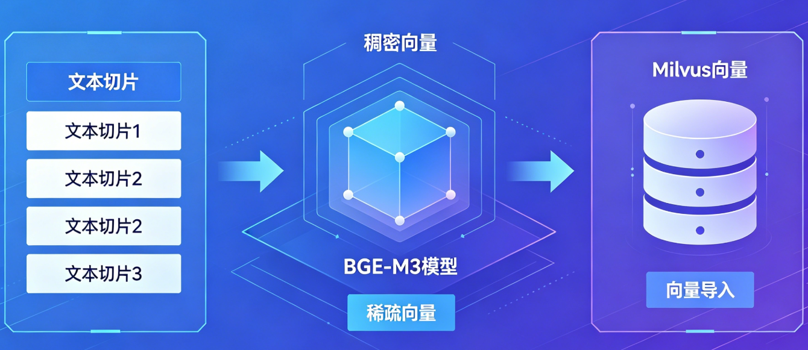

# 掌柜智库项目(RAG)实战

## 5. 导入数据节点实现与测试

### 5.6 向量化 (node_bge_embedding)

**节点文件**: `app/process/import_/agent/nodes/node_bge_embedding.py`
**对应 service 文件**: `app/rag/import_/embedding_service.py`
**相关配置位置**: `app/rag/import_/config.py`

本章节讲解**RAG 知识库构建中最核心、最底层的技术环节：文本切片向量化**。

在文档完成切分、主体识别后，必须将人类可读的文本，转化为机器可理解的**高维向量**，才能存入向量库、实现语义检索。

#### 1. 节点作用与实现思路

本节点是**RAG 知识库从 "文本" 走向 "可检索" 的核心桥梁**，负责将预处理完成的文本切片（Chunk）转化为机器可计算、可存储、可匹配的向量表示。

通过**BGE‑M3 多粒度向量模型**，**同时生成稠密向量（Dense）与稀疏向量（Sparse）**，为系统提供**混合检索能力**—— 既支持语义理解式模糊匹配，也支持关键词级精准匹配，大幅提升知识库召回率、准确率与鲁棒性，是整个 RAG 架构中**决定检索质量的关键底层模块**。



**实现思路**:

1.  **双向量同步编码**

    依托 BGE‑M3 模型特性，**一次推理同时输出稠密向量与稀疏向量**，稠密向量负责捕获深层语义相似度，稀疏向量负责关键词与实体精准匹配，实现 "语义 + 关键词" 双驱动检索。
2.  **核心主体增强**

    采用**item_name（主体）+ content（切片内容）** 拼接策略，将核心实体前置强化，让向量更聚焦业务主体，显著提升实体级检索精度。

3. **批处理高效计算**

   采用分批向量化模式，避免大批次文本导致显存溢出，提升 GPU/CPU 利用率，保证大规模文档导入时的稳定性与效率。

4. **工程化鲁棒保障**

   全流程异常隔离、单批次失败不影响整体、向量自动归一化、输入严格校验，确保向量化流程稳定不中断、数据不丢失、结果无偏差。

#### 2. 步骤分解

1.  **导入与配置**: 引入必要的库（LangChain, Milvus, etc.）及配置参数。
2.  **节点入口函数**: LangGraph 节点的入口，负责记录任务状态并调用 service 层。
3.  **Service 总入口**: `generate_chunk_embeddings()` 是向量化总入口，负责串联所有子步骤。
4.  **步骤 1: 校验输入**: 校验 State 中的 `chunks`，缺失时抛出异常。
5.  **步骤 2: 批量生成向量**: 分批拼接文本、调用 Embedding 模型生成双向量，为切片绑定向量字段。
6.  **步骤 3: 状态更新**: 将带向量的 chunks 更新回全局状态，供下游 Milvus 入库节点使用。
7.  **单元测试**: 独立运行的测试代码，验证核心流程。

#### 3. 节点与 service 定位

**节点文件**: `app/process/import_/agent/nodes/node_bge_embedding.py`
**对应 service 文件**: `app/rag/import_/embedding_service.py`

**节点作用**: `node_bge_embedding` 负责承接图状态、记录任务开始与结束，并调用 `generate_chunk_embeddings()`。

**对应 service 作用**: `generate_chunk_embeddings()` 是向量化总入口，负责串联"校验输入 -> 批量生成向量 -> 状态回写"这一整条链路。

##### 3.1 节点代码实现

```python
import os

from dotenv import load_dotenv

from app.shared.runtime.logger import logger,node_log
from app.shared.utils.task_utils import add_done_task, add_running_task
from app.process.import_.agent.state import ImportGraphState
from app.rag.import_.embedding_service import generate_chunk_embeddings

@node_log("node_bge_embedding")
def node_bge_embedding(state: ImportGraphState) -> ImportGraphState:
    """
    作用: chunks - chunk - 生成稠密和稀疏向量
    细节: 1. 批量生成 embedding 8192  2. 语义增强 item_name + content  3. 批量处理(异常处理)
    """
    # 向量化节点开始后，会批量为所有切片补齐 dense/sparse 两类向量。
    add_running_task(state["task_id"], "node_bge_embedding")
    # 这里不关心模型细节，只负责衔接图状态和向量化 service。
    state = generate_chunk_embeddings(state)
    add_done_task(state["task_id"], "node_bge_embedding")
    return state
```

**实现要点**

- 当前节点只做三件事：记录任务开始、调用 service、记录任务结束
- 所有业务逻辑都下沉到 `embedding_service.py` 中
- 保持节点轻量，便于后续维护和替换

#### 4. Service 总入口

`generate_chunk_embeddings()` 是这一节的总入口。它本身不直接做所有细节，而是把校验、批量向量化和状态回写这几步串起来。

```python
from app.shared.runtime.logger import logger, step_log
from app.infra.llm import llm_provider
from app.rag.import_.config import EMBEDDING_BATCH_SIZE


@step_log("generate_chunk_embeddings")
def generate_chunk_embeddings(state: dict) -> dict:
    """
    向量化服务总入口
    功能：校验切块数据 → 批量生成稠密/稀疏向量 → 回写到 state
    输出：更新后的 state，包含带有 dense_vector 和 sparse_vector 的 chunks
    """
    # 先确认 chunks 存在，再批量写回 dense/sparse 向量字段
    state["chunks"] = embed_chunks(require_chunks(state))
    return state
```

#### 5. 业务步骤分析

主链路是：

`node_bge_embedding -> generate_chunk_embeddings -> require_chunks -> embed_chunks`

##### 5.1 `node_bge_embedding`

**函数签名**: `node_bge_embedding(state: ImportGraphState) -> ImportGraphState`

**步骤**

1. 记录当前节点开始执行
2. 调用 `generate_chunk_embeddings(state)` 执行向量化主流程
3. 记录当前节点执行完成
4. 返回更新后的 `state`

##### 5.2 `require_chunks`

**函数签名**: `require_chunks(state: dict) -> list[dict]`

**步骤**

1. 从 state 中获取 `chunks` 字段
2. 如果 `chunks` 为空，抛出异常终止流程
3. 返回校验后的 `chunks` 列表

##### 5.3 `embed_chunks`

**函数签名**: `embed_chunks(chunks: list[dict], *, step: int = EMBEDDING_BATCH_SIZE) -> list[dict]`

**步骤**

1. 初始化结果列表 `chunks_vector`
2. 获取总切片数，按批次大小分批处理
3. 遍历每个批次：
   - 截取当前批次的切片
   - 为每个切片拼接文本："主体:{item_name},内容:{content}"
   - 调用 `llm_provider.embed_documents()` 生成批量向量
   - 为每个切片复制原数据，添加 `dense_vector` 和 `sparse_vector` 字段
   - 将带向量的切片加入结果列表
4. 如果某批次发生异常，记录警告并跳过该批次，继续处理下一批次
5. 返回所有带向量的切片列表

#### 6. 子函数 1：校验输入

##### 6.1 函数说明：`require_chunks`

```python
@step_log("require_chunks")
def require_chunks(state: dict) -> list[dict]:
    """
    校验导入状态中是否已经生成切块结果
    功能：确保后续流程有有效的输入数据，缺失时抛出异常
    :param state: LangGraph 流程状态字典
    :return: 已通过校验的切块列表
    """
    # 从 state 中获取核心数据
    chunks = state.get("chunks", [])
    
    # ===================== 校验 chunks =====================
    # 如果 chunks 为空，无法继续业务，直接抛出异常终止流程
    if not chunks:
        logger.error("chunks为空,无法继续业务处理!")
        raise ValueError("chunks为空,无法继续业务处理!")
    
    # 返回校验后的数据
    return chunks
```

**实现要点**

- `chunks` 是必填项，缺失时直接抛异常，因为无切片就无法进行向量化
- 使用 `state.get("chunks", [])` 提供默认值，避免 KeyError
- 校验逻辑简单明确，失败时给出清晰的错误提示

#### 7. 子函数 2：批量生成向量

##### 7.1 配置说明

**文件**: `app/rag/import_/config.py`

```python
# 向量化批次大小：每批处理 5 条切片，避免显存溢出
EMBEDDING_BATCH_SIZE = 5
```

当前真正参与向量化逻辑的主要是这个配置：

- `EMBEDDING_BATCH_SIZE`：控制每批处理的切片数量，考虑显存和嵌入式模型序列长度

##### 7.2 函数说明：`embed_chunks`

```python
@step_log("embed_chunks")
def embed_chunks(chunks: list[dict], *, step: int = EMBEDDING_BATCH_SIZE) -> list[dict]:
    """
    批量为文本切片生成稠密和稀疏向量
    功能：分批拼接文本 → 调用 Embedding 模型 → 绑定向量字段 → 异常隔离
    :param chunks: 文档切片列表，每个元素包含 item_name、content 等字段
    :param step: 批次大小，默认由配置 EMBEDDING_BATCH_SIZE 控制
    :return: 带向量字段的切片列表
    """
    # 初始化结果列表，存储带有向量的 chunk 数据
    chunks_vector: list[dict] = []
    
    # 获取总切片数
    total = len(chunks)
    
    # ===================== 分批处理 =====================
    # 按批次大小循环处理，每次处理 step 条切片
    for index in range(0, total, step):
        try:
            # 截取当前批次的切片，最后一批自动适配剩余数量
            step_chunks = chunks[index:index + step]
            
            # ===================== 构造模型输入文本 =====================
            # 拼接格式："主体:{item_name},内容:{content}"
            # 核心词前置原则：Embedding 模型对前 128 个 token 的注意力最集中
            vector_str_list = []
            for item in step_chunks:
                item_name = item.get("item_name")
                content = item.get("content", "")
                # 有主体名称则拼接，无则直接使用内容
                vector_str_list.append(f"主体:{item_name},内容:{content}" if item_name else content)
            
            # ===================== 调用 Embedding 模型 =====================
            # 调用 llm_provider.embed_documents() 生成批量向量
            # 返回格式：{"dense": [稠密向量列表], "sparse": [稀疏向量列表]}
            result = llm_provider.embed_documents(vector_str_list)
            
            # ===================== 绑定向量字段 =====================
            # 为当前批次每个切片绑定对应向量，复制原数据避免修改上游源数据
            for i, chunk in enumerate(step_chunks):
                chunk_new = chunk.copy()
                chunk_new["dense_vector"] = result["dense"][i]   # 绑定稠密向量
                chunk_new["sparse_vector"] = result["sparse"][i] # 绑定稀疏向量
                chunks_vector.append(chunk_new)
        
        except Exception as exc:
            # ===================== 异常处理 =====================
            # 捕获异常，记录警告信息并跳过当前批次
            logger.warning(f"index={index}步骤,发生错误,跳过,继续生成向量!!,错误信息:{str(exc)}")
            # 跳过当前批次，继续处理下一批次，保证整体流程不中断
            continue
    
    # 返回所有带向量的切片列表
    return chunks_vector
```

**实现要点**

- **核心词前置**：采用 `f"主体:{item_name},内容:{content}"` 拼接策略，将核心实体前置强化，让向量更聚焦业务主体
- **分批处理**：按 `EMBEDDING_BATCH_SIZE` 分批处理，避免大批次导致显存溢出
- **异常隔离**：单批次失败不影响其他批次，通过 `try-except` 捕获异常并跳过
- **数据保护**：使用 `chunk.copy()` 复制原数据，避免修改上游源数据
- **模型调用**：统一通过 `llm_provider.embed_documents()` 调用 Embedding 模型，简化模型管理

#### 8. 关键语法补充和说明

##### 8.1 `llm_provider.embed_documents()`

```python
from app.infra.llm import llm_provider

result = llm_provider.embed_documents([
    "主体:华为Mate60 Pro,内容:这是华为2023年发布的旗舰手机...",
    "主体:华为Mate60 Pro,内容:后置5000万像素摄像头..."
])

dense_vectors = result["dense"]  # 稠密向量列表
sparse_vectors = result["sparse"]  # 稀疏向量列表
```

作用是调用 Embedding 模型生成混合向量。返回结果是一个字典，包含 `dense`（稠密向量列表）和 `sparse`（稀疏向量字典列表）。当前节点里它用于为切片批量生成向量。

##### 8.2 `chunk.copy()`

```python
chunk_new = chunk.copy()
chunk_new["dense_vector"] = [0.1, 0.2, ...]
```

作用是浅拷贝字典，避免直接修改原始数据。当前节点里它用于保护上游节点的原始切片数据，只在副本上添加向量字段。

##### 8.3 核心词前置原则

Embedding 模型（尤其是基于 BERT 架构的）对前 128 个 token 的注意力最集中，越往后的词对最终向量方向的拉扯力越弱。因此：

- **优化前**：`content + "\n" + item_name`（主体在后，容易被忽略）
- **优化后**：`f"主体:{item_name},内容:{content}"`（主体在前，强化核心特征）

这种拼接策略能显著提升实体级检索精度，是 RAG 系统中的常用优化技巧。

#### 9. 测试优化

这一节建议拆成两类测试：

1. **节点联调测试**：先跑上游节点（如 `node_item_name_recognition`），再接 `node_bge_embedding`，验证导入链连续节点能否打通
2. **service 级测试**：优先测试 `embed_chunks()`，这样更容易观察向量化逻辑本身是否符合预期

##### 9.1 节点联调测试

```python
if __name__ == '__main__':
    # 加载环境变量：定位项目根目录下的.env，读取模型路径/设备等配置
    current_dir = os.path.dirname(os.path.abspath(__file__))
    project_root = os.path.dirname(os.path.dirname(current_dir))
    load_dotenv(os.path.join(project_root, ".env"))

    # 构造模拟测试状态：模拟上游节点输出的chunks数据，贴合真实业务场景
    test_state = ImportGraphState({
        "task_id": "test_task_embedding_001",  # 测试任务ID
        "chunks": [  # 模拟带item_name的文本切片（上游商品名称识别节点产出）
            {
                "content": "这是一个测试文档的内容，用于验证向量化是否成功。",
                "title": "测试文档标题",
                "item_name": "测试项目",
                "file_title": "测试文件.pdf"
            },
            {
                "content": "这是第二个测试文档的内容，用于验证批量处理逻辑。",
                "title": "测试文档标题2",
                "item_name": "测试项目",
                "file_title": "测试文件.pdf"
            }
        ]
    })

    # 执行本地测试
    logger.info("=== BGE-M3向量化节点本地单元测试启动 ===")
    try:
        # 调用核心节点函数
        result_state = node_bge_embedding(test_state)
        # 提取测试结果
        result_chunks = result_state.get("chunks", [])

        # 打印测试结果统计
        logger.info(f"=== 向量化节点本地测试完成 ===")
        logger.info(f"测试任务ID：{test_state.get('task_id')}")
        logger.info(f"待处理切片数：2 | 实际处理切片数：{len(result_chunks)}")
        logger.info(f"返回的结果:{result_chunks}")


    except Exception as e:
        logger.error(f"=== 向量化节点本地测试失败 ===" f"错误原因：{str(e)}", exc_info=True)
        # 新手友好提示：给出核心排查方向
        logger.warning("排查提示：请检查BGE-M3模型路径、显存是否充足、环境变量配置是否正确")
```
