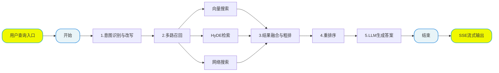

# 掌柜智库项目(RAG)实战

## 7. 检索数据图与状态定义

### 7.1 定义状态 (State)

所有节点共享同一个状态对象。我们需要定义它来存储处理过程中的数据（如查询原始问题、改写问题、历史对话、不同方向切片结果等）。



#### 状态字段分析

```
node_item_name_confirm
- 读 original_query ：用户原始问题。  他好吃么??
- 读 history ：历史对话记录，用于上下文理解。 history 历史记录[数据库]
- 读 session_id ：会话追踪。   一个客户端一个session  每次问题不并发!!
- 写 item_names ：识别出的商品名称列表。 [确认的实体名称] 
- 写 rewritten_query ：改写后的精准问题。  重写问题

# item_name识别场景: 1. llm没有识别出来 2. 检索分太低,都不可信  3. 检索的分不太高 可选 4. 检索分比较可信可以确认
- 写 answer ：如果无法确认或需要反问，直接写入答案并提前结束流程。 [查询流程对应的答案]
     可选: 请你确认,你要查询的内容: 1,2,3,4 嘛?
     没有确认: 不明确,本次查询对应主体! 请明确!!

node_search_embedding
- 读 rewritten_query ：改写后的问题进行向量检索。
- 读 item_names ：限定检索范围（只在这些商品内搜索）。
- 读 session_id ：任务追踪。
- 写 embedding_chunks ：普通向量检索回来的 Top-K 切片。

node_search_embedding_hyde
- 读 rewritten_query ：生成假设性答案的原材料。
- 读 item_names ：限定检索范围。
- 读 session_id ：任务追踪。
- 写 hyde_embedding_chunks ：HyDE 策略检索回来的切片。

node_web_search_mcp
- 读 rewritten_query ：网络搜索的查询词。
- 读 session_id ：任务追踪。
- 写 web_search_docs ：联网搜索返回的文档列表。

node_rrf
- 读 embedding_chunks ：向量检索结果。
- 读 hyde_embedding_chunks ：HyDE 检索结果。
- 读 session_id ：任务追踪。
- 写 rrf_chunks ：RRF 融合排序后的统一列表。

node_rerank
- 读 rrf_chunks ：待重排的文档列表。
- 读 web_search_docs ：网络搜索结果。
- 读 rewritten_query ：用于计算相关性得分。
- 读 session_id ：任务追踪。
- 写 reranked_docs ：重排序后的最终 Top-K 文档。

node_answer_output
- 读 reranked_docs ：作为 LLM 回答的参考依据。
- 读 rewritten_query ：用户问题。
- 读 history ：历史对话。
- 读 session_id / is_stream ：控制输出方式。
- 写 answer ：最终生成的答案。
- 写 image_urls ：从引用文档中提取的图片链接。
```

**文件**: `app/process/query/agent/state.py`

```python
from typing_extensions import TypedDict
from typing import List
import copy

class QueryGraphState(TypedDict):
    """
    QueryGraphState 定义了整个查询流程中流转的数据结构。
    TypedDict 让我们在代码中能有自动补全和类型检查。
    使用字典式访问（如 state["session_id"]、state.get("answer")）。
    """
    session_id: str  # 会话唯一标识
    original_query: str  # 用户原始问题

    # 检索过程中的中间数据
    embedding_chunks: list  # 普通向量检索回来的切片
    hyde_embedding_chunks: list  # HyDE 检索回来的切片
    web_search_docs: list  # 网络搜索回来的文档

    # 排序过程中的数据
    rrf_chunks: list  # RRF 融合排序后的切片
    reranked_docs: list  # 重排序后的最终 Top-K 文档

    # 生成过程中的数据
    prompt: str  # 组装好的 Prompt
    answer: str  # 最终生成的答案

    # 辅助信息
    item_names: List[str]  # 提取出的商品名称
    rewritten_query: str  # 改写后的问题
    history: list  # 历史对话记录
    is_stream: bool  # 是否流式输出标记
    image_urls: List[str]  # 答案中引用的图片链接


# ========================
# 默认状态（全部为空）
# ========================
query_graph_default_state: QueryGraphState = {
    "session_id": "",
    "original_query": "",
    "embedding_chunks": [],
    "hyde_embedding_chunks": [],
    "web_search_docs": [],
    "rrf_chunks": [],
    "reranked_docs": [],
    "prompt": "",
    "answer": "",
    "item_names": [],
    "rewritten_query": "",
    "history": [],
    "is_stream": False,
    "image_urls": []
}


# ========================
# 创建默认状态（可覆盖）
# ========================
def create_query_default_state(**overrides) -> QueryGraphState:
    """
    创建查询流程的默认状态，支持覆盖字段
    """
    state = copy.deepcopy(query_graph_default_state)
    state.update(overrides)
    return state


# ========================
# 获取干净状态
# ========================
def get_query_default_state() -> QueryGraphState:
    """
    返回一个新的状态实例，避免全局变量污染。
    """
    return copy.deepcopy(query_graph_default_state)


# ========================
# 状态复制函数
# ========================
def copy_query_state(state: QueryGraphState, **overrides) -> QueryGraphState:
    """
    复制现有状态并可覆盖字段，深拷贝，不污染原数据
    """
    new_state = copy.deepcopy(state)
    new_state.update(overrides)
    return new_state


if __name__ == "__main__":
    # 测试
    state = create_query_default_state(
        session_id="test_001",
        original_query="华为P60怎么样?",
        is_stream=False
    )
    print("初始化状态：", state)

    # 复制状态
    new_state = copy_query_state(
        state,
        original_query="修改后的问题"
    )
    print("复制后的状态：", new_state)
```

### 7.2 定义主图 

为了确保整体流程设计的科学性与执行连贯性，我们采用 **"Top-Down"（自顶向下）** 的开发模式，以 "总指挥部" 的全局视角统筹推进，具体实施步骤如下：

1. **搭建节点骨架（Stubs）**：优先定义全流程所需的所有功能节点。当前项目里，这一层已经不再是只有 `return state` 的空函数，而是演化成了轻量的节点适配层，负责日志、任务状态记录以及调用对应 service；
2. **串联主图（Graph）**：基于预设的业务流转规则，编写主图逻辑将所有节点骨架按序串联，明确节点间的输入输出关系、分支判断条件（如意图确认后是否需要反问），形成完整的流程链路；
3. **验证流程通畅性**：启动端到端测试，验证节点间的调用链路是否通顺、数据流转是否符合预期、分支跳转是否准确，确保流程无阻塞、无逻辑漏洞；
4. **填充节点核心逻辑**：在流程链路验证通过后，再逐一聚焦每个节点的内部实现，完成复杂业务逻辑的开发（如意图识别、多路召回、重排序算法等），实现 "骨架" 到 "完整系统" 的落地。

该模式的核心优势在于：先保障 "流程走得通"，再聚焦 "功能做得好"，避免因局部逻辑复杂导致整体流程设计偏差，大幅提升开发效率与流程稳定性。

#### 7.2.1 第一步：创建节点骨架

我们仍然保留"先搭节点骨架、再串主图"的教学路线，但要和当前项目代码保持一致。也就是说，这里的节点已经不是最初只有 `return state` 的空函数，而是已经演化为 **process 层节点适配器**：

1. 负责承接 `LangGraph state`
2. 负责记录节点开始/完成任务状态
3. 负责调用 `rag/query` 中的真实业务 service

**请在 `app/process/query/agent/nodes` 和 `app/rag/query` 目录下，按"一个节点配一个 service"的方式一起创建。**

#### 7.2.1.1 `node_item_name_confirm` + `confirm_item_name`

两者关系：

- `node_item_name_confirm` 是图中的入口节点，负责承接 LangGraph 的 `state`
- `confirm_item_name` 是对应的业务 service，负责真正做意图识别、商品名提取和问题改写
- 也就是说，`process` 层负责"调度"，`rag` 层负责"实现"

**节点文件**: `app/process/query/agent/nodes/node_item_name_confirm.py`

```python
import json
import sys

from app.shared.runtime.logger import node_log
from app.rag.query.item_name_confirm_service import confirm_item_name
from app.shared.utils.task_utils import add_done_task, add_running_task

@node_log("node_item_name_confirm")
def node_item_name_confirm(state):
    """
    节点功能：确认用户问题中的核心商品名称。
    输入：state['original_query']
    输出：更新 state['item_names']
    """
    # 先登记节点开始，前端进度区可以立即感知"主体确认"已启动。
    add_running_task(state["session_id"], sys._getframe().f_code.co_name, state["is_stream"])
    # 调用 rag/query service 层
    state = confirm_item_name(state)
    # 识别完成后写入完成列表，方便前端展示当前节点已结束。
    add_done_task(state["session_id"], sys._getframe().f_code.co_name, state["is_stream"])
    return state
```

**对应 service 文件**: `app/rag/query/item_name_confirm_service.py`

```python
from app.process.query.agent.state import QueryGraphState


def confirm_item_name(state: QueryGraphState) -> QueryGraphState:
    """
    意图确认服务：
    1. 结合历史对话提取商品名
    2. 将模糊问题改写为完整独立的精准问题
    3. 在 Milvus 向量库中进行混合搜索
    4. 根据评分高低自动对齐标准型号，或生成反问让用户手动确认
    5. 同步历史记录到 MongoDB
    """
    return state
```

#### 7.2.1.2 `node_search_embedding` + `search_by_embedding`

两者关系：

- `node_search_embedding` 是图中的向量检索节点
- `search_by_embedding` 负责真正调用 BGE-M3 模型进行混合检索
- 节点本身不处理检索细节，只负责衔接图状态和 service

**节点文件**: `app/process/query/agent/nodes/node_search_embedding.py`

```python
import sys

from app.shared.runtime.logger import node_log
from app.rag.query.embedding_search_service import search_by_embedding
from app.shared.utils.task_utils import add_done_task, add_running_task

@node_log("node_search_embedding")
def node_search_embedding(state):
    """
    节点功能：进行向量内容检索
    """
    add_running_task(state["session_id"], sys._getframe().f_code.co_name, state.get("is_stream"))
    state = search_by_embedding(state)
    add_done_task(state["session_id"], sys._getframe().f_code.co_name, state.get("is_stream"))
    return state
```

**对应 service 文件**: `app/rag/query/embedding_search_service.py`

```python
from app.process.query.agent.state import QueryGraphState


def search_by_embedding(state: QueryGraphState) -> QueryGraphState:
    """
    向量检索服务：
    1. 根据改写后的问题和限定的商品范围
    2. 利用 BGEM3 混合检索（稠密+稀疏）技术
    3. 从 Milvus 向量数据库中召回 Top-K 最相关的知识切片
    4. 回写 embedding_chunks
    """
    return state
```

#### 7.2.1.3 `node_search_embedding_hyde` + `search_by_hyde`

两者关系：

- `node_search_embedding_hyde` 是图中的 HyDE 检索节点
- `search_by_hyde` 负责真正实现 HyDE 策略（生成假设性答案 → 用答案检索）
- 节点只保留调度和任务状态记录

**节点文件**: `app/process/query/agent/nodes/node_search_embedding_hyde.py`

```python
import sys

from app.shared.runtime.logger import node_log
from app.rag.query.hyde_search_service import search_by_hyde
from app.shared.utils.task_utils import add_done_task, add_running_task

@node_log("node_search_embedding_hyde")
def node_search_embedding_hyde(state):
    """
    节点功能：HyDE (Hypothetical Document Embedding)
    先让 LLM 生成假设性答案，再对答案进行向量检索，提高召回率。
    """
    add_running_task(state["session_id"], sys._getframe().f_code.co_name, state.get("is_stream"))
    state = search_by_hyde(state)
    add_done_task(state["session_id"], sys._getframe().f_code.co_name, state.get("is_stream"))
    return state
```

**对应 service 文件**: `app/rag/query/hyde_search_service.py`

```python
from app.process.query.agent.state import QueryGraphState


def search_by_hyde(state: QueryGraphState) -> QueryGraphState:
    """
    HyDE 检索服务：
    1. 让 LLM 基于问题虚构一个"理想答案"
    2. 对这个假设性答案进行向量化
    3. 用答案向量在 Milvus 中检索真实文档
    4. 回写 hyde_embedding_chunks
    """
    return state
```

#### 7.2.1.4 `node_web_search_mcp` + `search_by_web`

两者关系：

- `node_web_search_mcp` 是图中的网络搜索节点
- `search_by_web` 负责真正调用百炼 MCP 联网搜索服务
- 节点只负责把上游 `state` 传给 service，再把结果继续往下游传

**节点文件**: `app/process/query/agent/nodes/node_web_search_mcp.py`

```python
import sys

from app.shared.runtime.logger import node_log
from app.rag.query.web_search_service import search_by_web
from app.shared.utils.task_utils import add_done_task, add_running_task

@node_log("node_web_search_mcp")
def node_web_search_mcp(state):
    """
    节点功能：调用外部搜索引擎补充信息
    """
    add_running_task(state["session_id"], sys._getframe().f_code.co_name, state["is_stream"])
    state = search_by_web(state)
    add_done_task(state["session_id"], sys._getframe().f_code.co_name, state["is_stream"])
    return state
```

**对应 service 文件**: `app/rag/query/web_search_service.py`

```python
from app.process.query.agent.state import QueryGraphState


def search_by_web(state: QueryGraphState) -> QueryGraphState:
    """
    网络搜索服务：
    1. 通过 MCP 协议异步调用百炼联网搜索接口
    2. 将用户的查询转化为实时的、结构化的网络搜索结果
    3. 包含标题、链接和摘要
    4. 回写 web_search_docs
    """
    return state
```

#### 7.2.1.5 `node_rrf` + `fuse_by_rrf`

两者关系：

- `node_rrf` 是图中的倒排融合排序节点
- `fuse_by_rrf` 负责真正实现 RRF 算法
- 节点负责图调度，service 负责融合逻辑

**节点文件**: `app/process/query/agent/nodes/node_rrf.py`

```python
import sys

from app.shared.runtime.logger import node_log
from app.rag.query.rrf_service import fuse_by_rrf
from app.shared.utils.task_utils import add_done_task, add_running_task

@node_log("node_rrf")
def node_rrf(state):
    """
    节点功能：Reciprocal Rank Fusion
    将多路召回的结果（向量、HyDE、Web）进行加权融合排序。
    """
    add_running_task(state["session_id"], sys._getframe().f_code.co_name, state.get("is_stream"))
    state = fuse_by_rrf(state)
    add_done_task(state['session_id'], sys._getframe().f_code.co_name, state.get("is_stream"))
    return state
```

**对应 service 文件**: `app/rag/query/rrf_service.py`

```python
from app.process.query.agent.state import QueryGraphState


def fuse_by_rrf(state: QueryGraphState) -> QueryGraphState:
    """
    RRF 融合服务：
    1. 合并来自不同检索源的文档列表
    2. 应用 RRF 算法消除分数差异
    3. 给出综合排名最高的文档列表（Top 10）
    4. 回写 rrf_chunks
    """
    return state
```

#### 7.2.1.6 `node_rerank` + `rerank_documents`

两者关系：

- `node_rerank` 是图中的重排序节点
- `rerank_documents` 负责真正调用 Cross-Encoder 模型进行精排
- 节点负责图执行衔接，service 负责重排序逻辑

**节点文件**: `app/process/query/agent/nodes/node_rerank.py`

```python
import sys

from app.shared.runtime.logger import node_log
from app.rag.query.rerank_service import rerank_documents
from app.shared.utils.task_utils import add_done_task, add_running_task

@node_log("node_rerank")
def node_rerank(state):
    """
    节点功能：使用 Cross-Encoder 模型对 RRF 后的结果进行精确打分重排。
    """
    add_running_task(state["session_id"], sys._getframe().f_code.co_name, state.get("is_stream"))
    state = rerank_documents(state)
    add_done_task(state['session_id'], sys._getframe().f_code.co_name, state.get("is_stream"))
    return state
```

**对应 service 文件**: `app/rag/query/rerank_service.py`

```python
from app.process.query.agent.state import QueryGraphState


def rerank_documents(state: QueryGraphState) -> QueryGraphState:
    """
    重排序服务：
    1. 合并 RRF 和 Web Search 的文档
    2. 使用 BGE Reranker 模型计算相关性得分
    3. 根据得分动态截断，智能截取 TopK
    4. 回写 reranked_docs
    """
    return state
```

#### 7.2.1.7 `node_answer_output` + `generate_answer`

两者关系：

- `node_answer_output` 是图中的最终答案生成节点
- `generate_answer` 负责真正组装 Prompt、调用 LLM、流式输出
- 节点只负责把最终结果送给用户

**节点文件**: `app/process/query/agent/nodes/node_answer_output.py`

```python
import sys

from app.shared.runtime.logger import node_log
from app.rag.query.answer_service import generate_answer
from app.shared.utils.task_utils import add_done_task, add_running_task

@node_log("node_answer_output")
def node_answer_output(state):
    """
    节点功能：生成最终回答并交付给用户（支持流式/非流式）。
    """
    add_running_task(state["session_id"], sys._getframe().f_code.co_name, state["is_stream"])
    state = generate_answer(state)
    add_done_task(state['session_id'], sys._getframe().f_code.co_name, state["is_stream"])
    return state
```

**对应 service 文件**: `app/rag/query/answer_service.py`

```python
from app.process.query.agent.state import QueryGraphState
from app.shared.utils.task_utils import add_done_task,add_running_task,push_to_session
from app.shared.utils.sse_utils import SSEEvent
from app.shared.runtime.logger import logger
import time
import sys

def generate_answer(state: QueryGraphState) -> QueryGraphState:
    """
    答案生成服务：
    1. 检查前置答案（如有追问或拒绝回答，直接输出）
    2. 构建 Prompt（用户问题 + 历史对话 + TopK 文档）
    3. 调用 LLM 生成最终答案（支持流式推送）
    4. 从引用文档中提取图片 URL
    5. 写入 MongoDB 历史记录
    6. 回写 answer 和 image_urls
    """
    ""
    print("---node_answer_output 节点处理开始---")
    add_running_task(state["session_id"], sys._getframe().f_code.co_name, state.get("is_stream"))

    session_id = state["session_id"]
    is_stream = state.get("is_stream", True)
    base_answer = state.get("answer") or f"这是关于「{state.get('original_query', '当前问题')}」的测试回答，正在演示打字机流式输出效果。"
    final_text = ""

    if is_stream:
        for ch in base_answer:
            final_text += ch
            push_to_session(session_id, SSEEvent.DELTA, {"delta": ch})
            time.sleep(0.03)

        image_urls = ["https://example.com/demo-1.png", "https://example.com/demo-2.png"]
        push_to_session(
            session_id,
            SSEEvent.FINAL,
            {
                "answer": final_text,
                "status": "completed",
                "image_urls": image_urls
            }
        )
        logger.info(f"流式输出完成，总长度: {len(final_text)}")
    else:
        final_text = base_answer

    add_done_task(state['session_id'], sys._getframe().f_code.co_name, state.get("is_stream"))
    print("---node_answer_output 节点处理结束---")
    # 关键点：return 必须保留 session_id！
    return {
        "session_id": session_id,  # 必须带回去
        "answer": "你的回答内容",
        "is_stream": state.get("is_stream")
    }
```

#### 7.2.2 第二步：编写主图代码

节点思路总结：


**文件**: `app/process/query/agent/main_graph.py`

```python
from langgraph.graph import StateGraph, END

from app.process.query.agent.nodes.node_answer_output import node_answer_output
from app.process.query.agent.nodes.node_item_name_confirm import node_item_name_confirm
from app.process.query.agent.nodes.node_rerank import node_rerank
from app.process.query.agent.nodes.node_rrf import node_rrf
from app.process.query.agent.nodes.node_search_embedding import node_search_embedding
from app.process.query.agent.nodes.node_search_embedding_hyde import node_search_embedding_hyde
from app.process.query.agent.nodes.node_web_search_mcp import node_web_search_mcp
from app.process.query.agent.state import QueryGraphState
from app.shared.runtime.logger import logger

# 1. 定义状态图对象，并且指定全局的 state
query_graph = StateGraph(QueryGraphState)

# 2. 添加节点信息
query_graph.add_node("node_item_name_confirm", node_item_name_confirm)
query_graph.add_node("node_search_embedding", node_search_embedding)
query_graph.add_node("node_search_embedding_hyde", node_search_embedding_hyde)
query_graph.add_node("node_web_search_mcp", node_web_search_mcp)
query_graph.add_node("node_rrf", node_rrf)
query_graph.add_node("node_rerank", node_rerank)
query_graph.add_node("node_answer_output", node_answer_output)

# 3. 指定入口节点（有条件边）
query_graph.set_entry_point("node_item_name_confirm")

# 4. 指定条件边，动态边
# state answer 进行判定!
# None -> 第一个节点已经顺利的识别出了 item_names，提问没有问题
# str  -> 提问是空 | 有不确定的 item_names | 没有识别对应的 item_name
def node_item_name_confirm_after_router(state: QueryGraphState):
    # 如果前置节点已经生成了澄清或兜底答案，就直接跳转到输出节点收口。
    if state['answer']:
        # 不为空!
        # str  -> 提问是空 | 有不确定的item_names  | 没有识别对应的item_name
        logger.warning(f"node_item_name_confirm_无法继续向后执行: {state['answer']}")
        return "node_answer_output"
    # 为空，可以正常执行，并发执行多路检索节点
    return "node_search_embedding", "node_search_embedding_hyde", "node_web_search_mcp"

query_graph.add_conditional_edges(
    "node_item_name_confirm",
    node_item_name_confirm_after_router,
    {
        "node_answer_output": "node_answer_output",
        "node_search_embedding": "node_search_embedding",
        "node_search_embedding_hyde": "node_search_embedding_hyde",
        "node_web_search_mcp": "node_web_search_mcp"
    }
)

# 5. 指定静态边
query_graph.add_edge("node_search_embedding", "node_rrf")
query_graph.add_edge("node_search_embedding_hyde", "node_rrf")
query_graph.add_edge("node_web_search_mcp", "node_rrf")
query_graph.add_edge("node_rrf", "node_rerank")
query_graph.add_edge("node_rerank", "node_answer_output")
query_graph.add_edge("node_answer_output", END)

# 6. 编译对象即可
query_app = query_graph.compile()
```

#### 7.2.3 第三步：验证图流程

在实现具体业务逻辑前，我们先跑一个测试脚本，看看图能不能跑通，路线对不对。

**创建测试文件**: `test/02_test_query_main_graph.py`

```python
import json

from app.process.query.agent.main_graph import query_app
from app.process.query.agent.state import create_query_default_state
from app.shared.runtime.logger import logger

logger.info("===== 开始测试 =====")

initial_state = create_query_default_state(
    session_id="test_001",
    original_query="华为P60怎么样?"
)
final_state = None

# 只输出更最终的状态值（字典形式），不包含节点名称、执行日志、元数据等额外信息
for event in query_app.stream(initial_state):
    for key, value in event.items():
        logger.info(f"节点: {key}")
        final_state = value

# 格式化输出最终状态
logger.info(f"最终状态: {json.dumps(final_state, indent=4, ensure_ascii=False)}")

logger.info("图结构:")
# uv add grandalf
query_app.get_graph().print_ascii()

logger.info("===== 测试结束 =====")
```

**预期效果**:
你应该能看到控制台依次打印出每个节点的开始、完成日志，以及 `节点: xxx` 这一类图执行输出。

*   正常流程应包含：`node_item_name_confirm` -> (`node_search_embedding` + `node_search_embedding_hyde` + `node_web_search_mcp`) -> `node_rrf` -> `node_rerank` -> `node_answer_output`
*   如果需要反问或拒绝回答：`node_item_name_confirm` -> `node_answer_output` **(跳过了检索流程)**

**如果能看到这些日志，说明我们的图结构搭建成功！接下来就可以放心地去填充每个节点的具体代码了。**
