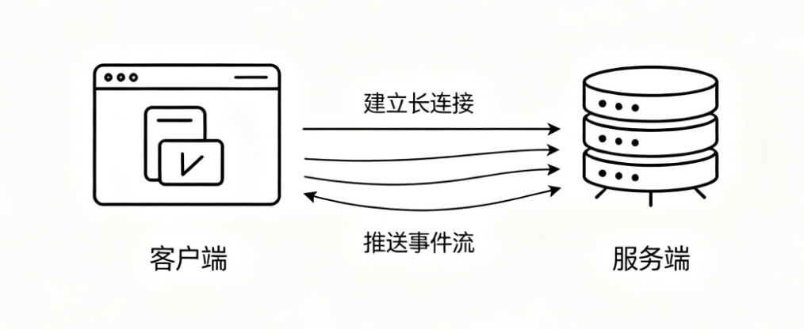
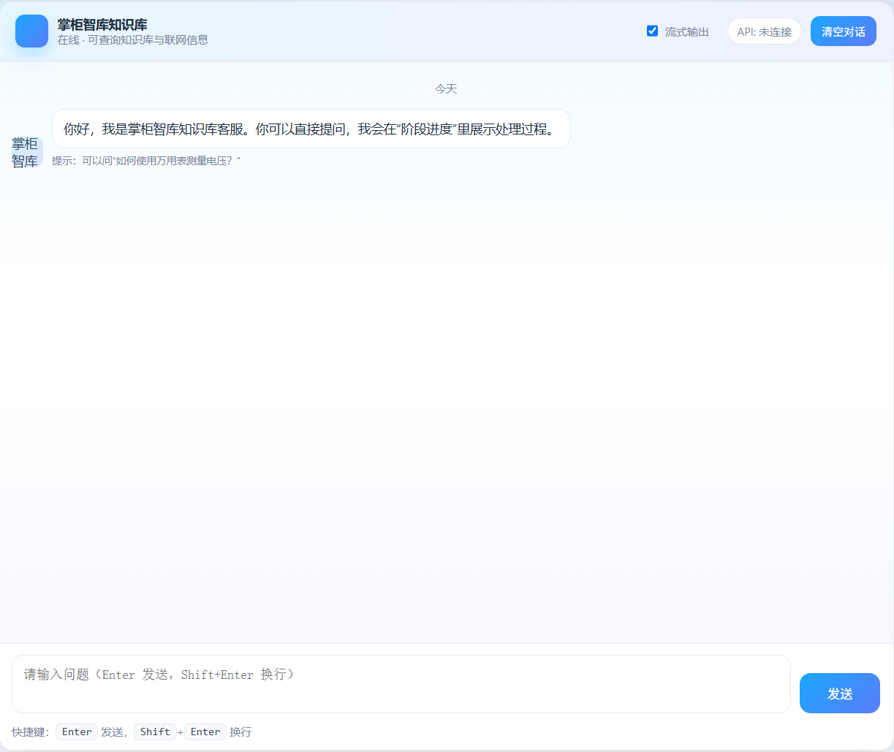

# 掌柜智库项目(RAG)实战

## 8. 检索web服务端搭建

### 8.1 SSE快速入门

SSE (**Server-Sent Events**) 是一种 **基于 HTTP 的服务端单向推送** 技术：浏览器先建立一个长连接，服务端持续往这个连接里按事件格式推数据，前端再根据不同事件类型做对应处理。

- **单向推送**：服务端 -> 客户端
- **事件化**：每条消息都可以带 `event` 类型和 `data` 数据
- **自动重连**：浏览器 `EventSource` 默认支持断线重连
- **轻量**：基于 HTTP，不需要像 WebSocket 一样维护双向协议栈



#### 8.1.1 应用场景

- **任务进度/阶段状态**：图执行流程、批处理进度条
- **LLM 流式输出**：边生成边展示
- **日志/监控流**：持续输出日志、状态变化
- **通知推送**：轻量通知、状态变化

#### 8.1.2 数据格式

SSE 协议规定了服务端向前端推送数据的固定格式，当前项目最常用的是下面这种写法：

```text
event: progress\n [内部数据分割]
data: {"status":"processing","done_list":["确认问题产品"],"running_list":["切片搜索"]}\n\n
```

要点只有两个：

1. `event` 表示事件类型
2. `data` 表示事件内容

最后必须以两个换行 `\n\n` 结尾，一条 SSE 消息才算结束。

#### 8.1.3 SSE基础入门

##### 场景一：最基础的 SSE

目标：后端每秒推 1 条固定消息，前端实时显示。

**步骤1：后端代码（sse_step1.py）**

```python
import asyncio
from fastapi import FastAPI
from fastapi.responses import StreamingResponse

app = FastAPI()
# 定义一个 GET 接口，路径：/simple_stream
# 这是一个 SSE 服务端推送接口
@app.get("/simple_stream")
async def simple_stream():
    # 定义一个 异步生成器函数，用来源源不断产生消息
    # 这是核心：yield 一条一条推送数据，不会一次性返回
    async def event_generator():
        # 循环 5 次，推送 5 条消息
        for i in range(5):
            # SSE 协议标准格式：
            # data: 消息内容\n\n
            # 必须以 data: 开头，必须用 \n\n 表示本条消息结束
            yield f"data: 这是第{i + 1}条测试消息\n\n"
            # 异步等待 1 秒，模拟每隔1秒推送一条消息
            await asyncio.sleep(1)

    # 返回 StreamingResponse，实现流式推送
    # media_type="text/event-stream" 告诉浏览器这是 SSE 服务端推送
    return StreamingResponse(
        event_generator(),  # 传入异步生成器，源源不断产出数据
        media_type="text/event-stream"  # 声明 SSE 格式
    )
```

**步骤2：前端代码（sse_step1.html）**

```html
<!DOCTYPE html>
<html>
<head>
    <meta charset="UTF-8">
    <title>步骤1：基础SSE</title>
</head>
<body>
    <h3>步骤1：接收后端固定消息</h3>
    <div id="result"></div>

    <script>
        const eventSource = new EventSource("http://127.0.0.1:8001/simple_stream");
        const resultDom = document.getElementById("result");

        eventSource.onmessage = function(event) {
            resultDom.innerHTML += event.data + "<br>";
        };
    </script>
</body>
</html>
```

这里需要记住的核心知识点：

1. FastAPI 用 `StreamingResponse` 做流式响应
2. `media_type` 必须是 `text/event-stream`
3. 服务端每条消息必须按 `data: xxx\n\n` 格式输出
4. 前端用 `EventSource` 建立连接并接收消息

##### 场景二：带事件类型的 SSE

目标：让前端能够区分“进度更新”和“任务完成”两类消息。

**步骤1：后端代码（sse_step2.py）**

```python
import asyncio
from fastapi import FastAPI
from fastapi.responses import StreamingResponse

app = FastAPI()


@app.get("/stream")
async def stream():
    async def event_generator():
        for i in range(3):
            yield "event: progress\n"
            yield f"data: 第{i + 1}步处理中\n\n"
            await asyncio.sleep(1)

        yield "event: complete\n"
        yield "data: 全部处理完成\n\n"

    return StreamingResponse(event_generator(), media_type="text/event-stream")
```

**步骤2：前端代码（sse_step2.html）**

```html
<script>
  const es = new EventSource("http://127.0.0.1:8001/stream");

  es.addEventListener("progress", (e) => {
    console.log("进度事件:", e.data);
  });

  es.addEventListener("complete", (e) => {
    console.log("完成事件:", e.data);
    es.close();
  });
</script>
```

这个场景和当前项目的查询服务最接近，因为项目里前端不是只接一种消息，而是会区分进度、增量答案、最终答案和错误事件。

##### 场景三：异步任务

目标：后端先接收查询请求，后台处理，SSE 推处理结果

**步骤1： 后端代码（sse_step3.py）**

```python
import asyncio
from fastapi import FastAPI, BackgroundTasks
from fastapi.responses import StreamingResponse
from fastapi.middleware.cors import CORSMiddleware

app = FastAPI()
app.add_middleware(CORSMiddleware, allow_origins=["*"], allow_methods=["*"], allow_headers=["*"])

# 核心优化：用异步队列存储每个会话的待推送数据（替代列表+轮询）
task_queues = {}
#queue = asyncio.Queue()

# 异步耗时任务：直接往队列丢数据，不用列表累加
async def long_task(session_id: str):
    # 为当前会话创建专属队列
    queue = asyncio.Queue()
    task_queues[session_id] = queue

    # 模拟5秒处理，每秒生成1条结果并丢进队列
    for i in range(5):
        msg = f"会话{session_id}处理结果{i + 1}"
        await queue.put(msg)  # 把数据丢进队列
        await asyncio.sleep(1)

    # 关键：丢一个"结束标记"，告诉SSE可以停止了
    await queue.put(None)


# 提交任务接口（逻辑不变）
@app.get("/submit/{session_id}")
async def submit_task(session_id: str, background_tasks: BackgroundTasks):
    background_tasks.add_task(long_task, session_id)
    return {"message": "任务已启动", "session_id": session_id}


# 简化后的SSE接口：直接从队列取数据，没有轮询！
@app.get("/stream/{session_id}")
async def stream_result(session_id: str):
    async def event_generator():
        # 获取当前会话的队列（没有则等待任务创建）
        while session_id not in task_queues:
            await asyncio.sleep(0.1)
        queue = task_queues[session_id]

        # 核心：循环从队列取数据，有数据就推，收到结束标记就停
        while True:
            msg = await queue.get()  # 阻塞等待队列数据（比轮询高效）
            if msg is None:  # 收到结束标记，退出循环
                break
            yield f"data: {msg}\n\n"  # 推送数据

    return StreamingResponse(event_generator(), media_type="text/event-stream")


if __name__ == "__main__":
    import uvicorn

    uvicorn.run(app, host="127.0.0.1", port=8001)
```

`asyncio.Queue` 是 Python 异步编程（`asyncio` 框架）里的**异步队列**，专门解决异步场景下 “生产者 - 消费者” 的通信问题，你可以把它理解成一个「异步版的消息中转站」—— 生产者（比如你的后台任务）往里面丢数据，消费者（比如你的 SSE 接口）从里面取数据，全程不阻塞、不轮询，比你之前用的 “列表 + 轮询” 高效得多。

**核心用法（通俗解释）：**

`asyncio.Queue` 的用法特别简单，核心就 3 个方法，且都需要用 `await` 调用（因为是异步操作）：

创建队列

```python
# 创建一个无界异步队列（能装无限多数据）
queue = asyncio.Queue()
# 也可以指定最大容量（比如最多装10条，满了之后put会等待）
queue = asyncio.Queue(maxsize=10)
```

生产者：往队列里放数据（`put`）

```python
await queue.put("要推送的消息")  # 把数据丢进队列
# 如果队列满了（指定了maxsize），这行代码会暂停，直到队列有空闲位置
```

 对应你代码里的后台任务：`await queue.put(msg)`，每秒往队列丢一条消息。

消费者：从队列里取数据（`get`）

```python
msg = await queue.get()  # 从队列取数据
# 如果队列为空，这行代码会「异步暂停」，直到队列里有新数据才唤醒
```

 对应你代码里的 SSE 接口：`msg = await queue.get()`，没有数据就等着，有数据就立刻取，不用你手动轮询。

### 8.2 项目里的 SSE 事件类型与工具类

当前项目已经把 SSE 事件类型统一定义在：

**文件**: `app/shared/utils/sse_utils.py`

```python
class SSEEvent:
    READY = "ready"         # 连接建立
    PROGRESS = "progress"   # 任务节点进度
    DELTA = "delta"         # LLM 流式输出增量
    FINAL = "final"         # 最终完整答案
    ERROR = "error"         # 错误信息
    CLOSE = "__close__"     # 关闭连接信号
```

项目里最重要的事件有 5 类：

1. `ready`：SSE 连接建立成功
2. `progress`：节点进度更新
3. `delta`：模型流式增量输出
4. `final`：最终完整答案
5. `error`：执行失败信息

#### 8.2.1 `sse_utils.py` 的作用

这一层负责真正的 SSE 队列和事件推送(生成器函数)。

核心职责有 4 件事：

1. 创建 `session_id` 对应的 SSE 队列
2. 把事件打包成标准 SSE 格式
3. 根据 `session_id` 往对应队列里推事件
4. 提供 `sse_generator()` 给 `StreamingResponse` 使用

关键代码如下：

```python
def create_sse_queue(session_id: str) -> queue.Queue:
    q = queue.Queue()
    _session_stream[session_id] = q
    return q


def push_to_session(session_id: str, event: str, data: dict):
    stream_queue = get_sse_queue(session_id)
    if stream_queue:
        stream_queue.put({"event": event, "data": data})


async def sse_generator(session_id: str, request: Request):
    yield _sse_pack("ready", {})
    ...
```

#### 8.2.2 `task_utils.py` 的作用

这一层负责维护查询图执行过程中的任务状态。

当前项目里，它主要维护：

1. 当前运行中节点
2. 当前已完成节点
3. 当前任务状态
4. 当前任务结果，例如 `answer` [废弃 state answer]

关键结构如下：

```python
_tasks_running_list: Dict[str, List[str]] = {}
_tasks_done_list: Dict[str, List[str]] = {}
_tasks_status: Dict[str, str] = {}
_tasks_result: Dict[str, Dict[str, str]] = {}
```

最关键的推送逻辑在这里：

```python
def task_push_queue(task_id: str):
    push_to_session(task_id, "progress", {
        "status": get_task_status(task_id),
        "done_list": get_done_task_list(task_id),
        "running_list": get_running_task_list(task_id),
    })
```

也就是说：

- `task_utils` 负责维护任务状态和节点进度
- `sse_utils` 负责把这些状态通过 SSE 推给前端

这一层就是当前项目查询页面“阶段进度”面板的基础。

### 8.3 基础 Web 服务端搭建

本节介绍如何基于 FastAPI 搭建后端服务，提供页面访问、查询接口、SSE 推送和历史聊天接口。

#### 8.3.1 前端交互设计

检索 Web 聊天界面（`chat.html`）的核心结构和数据流转逻辑，直接决定了后端接口的设计方式。

当前页面真实位置是：`app/process/query/page/chat.html`



页面已经具备这些核心能力：

1. 页面加载时生成或读取 `session_id`
2. 点击发送后 POST `/query`
3. 如果是流式模式，立即通过 `EventSource` 连接 `/stream/{session_id}`
4. 根据不同 SSE 事件类型更新进度和答案
5. 页面初始化时通过 `/history/{session_id}` 加载历史消息
6. 点击清空时调用 `DELETE /history/{session_id}`

#### 8.3.2 服务接口设计

本节只保留当前项目真实在用的接口。

**1）页面访问接口**

- **路径**: `/html` (GET)
- **功能**: 返回前端聊天界面
- **响应**: HTML 静态页面

**2）检索查询接口**

- **路径**: `/query` (POST)
- **功能**: 接收用户提问并启动后台查询图逻辑
- **参数**:

```json
{
  "query": "万用表怎么测量电压？",
  "session_id": "可选，未传则后台自动生成",
  "is_stream": true
}
```

- **响应（异步 - 流式）**:

```json
{
  "message": "结果正在处理中...",
  "session_id": "xxx-uuid"
}
```

- **响应（同步）**:

```json
{
  "message": "处理完成！",
  "session_id": "xxx-uuid",
  "answer": "回答内容...",
  "done_list": [],
  "image_urls": []
}
```

**3）流式获取接口（SSE）**

- **路径**: `/stream/{session_id}` (GET)
- **功能**: 建立 SSE 长连接，实时推送任务进度和答案事件
- **主要事件类型**:
  - `ready`
  - `progress`
  - `delta`
  - `final`
  - `error`

**4）会话历史查询**

- **路径**: `/history/{session_id}` (GET)

- **功能**: 查询当前会话的历史聊天记录

- **参数**: 

  - `session_id`（路径参数）：会话 ID
  - `limit`（查询参数，默认 10）：返回最大记录条数

- **响应格式**：

  ```json
  {
    "session_id": "string",
    "items": [
      {
        "id": "string",
        "session_id": "string",
        "role": "string",
        "text": "string",
        "rewritten_query": "string",
        "item_names": ["string"],
        "image_urls": ["string"],
        "ts": null
      }
    ]
  }
  ```

**5）清空会话历史**

- **路径**: `/history/{session_id}` (DELETE)

- **功能**: 删除当前会话在 MongoDB 中的全部记录

- **响应格式**：

  ```json
  {
    "message": "string",
    "deleted_count": 0
  }
  ```

**6）健康检查接口**

- **路径**: `/health` (GET)
- **功能**: 检查服务存活状态

### 8.4 接口代码实现

#### 8.4.1 页面文件位置

- 页面：`app/process/query/page/chat.html`
- 接口入口：`app/api/http/query_server.py`
- 数据模型：`app/api/schemas/query.py`

#### 8.4.2 定义和实现 API 接口服务

当前项目的查询服务入口文件是：

- `app/api/http/query_server.py`

首先引入 FastAPI、schemas，以及项目内部真正会用到的工具类。

```python
from mimetypes import guess_type
from pathlib import Path
import sys
import uuid

from fastapi import BackgroundTasks, FastAPI, Request
from fastapi.responses import FileResponse, StreamingResponse
from starlette.middleware.cors import CORSMiddleware

from app.shared.runtime.logger import PROJECT_ROOT, logger
from app.infra.config.providers import settings
from app.process.query.agent.main_graph import query_app as query_graph_app
from app.process.query.agent.state import create_query_default_state
from app.shared.utils.sse_utils import SSEEvent, create_sse_queue, push_to_session, sse_generator
from app.shared.utils.task_utils import (
    TASK_STATUS_COMPLETED,
    TASK_STATUS_FAILED,
    TASK_STATUS_PROCESSING,
    clear_task,
    get_done_task_list,
    get_task_result,
    update_task_status,
)

# 定义fastapi对象
app = FastAPI(
    title=settings.query_app_name,
    description="描述,进行rag查询的服务对象",
    version="0.2.0"
)

# 跨域处理
app.add_middleware(
    CORSMiddleware,
    allow_origins = ['*'],
    allow_methods = ['*'],
    allow_headers = ['*']
)
```

#### 8.4.3 schemas 实现

当前项目把接口请求和响应结构单独整理到了：

- `app/api/schemas/query.py`

这样做的目的很明确：

1. 查询接口入参更清晰
2. 返回结构更统一
3. 历史记录结构更容易复用

```python
from typing import Any
from pydantic import BaseModel,Field

class QueryRequest(BaseModel):
    """
    查询请求参数
    """
    session_id: str = Field(None, description="会话ID")
    query: str | None = Field(..., description="原始查询")
    is_stream: bool = Field(False, description="是否流式返回")


# 错误示范
# class A:
#     lst = []
#
# a1 = A()
# a2 = A()
# a1.lst.append(1)
#
# print(a2.lst)  # 输出 [1] ！！！ 被污染了

class AsyncQueryResponse(BaseModel):
    """
    查询响应参数
    """
    session_id: str = Field(..., description="会话ID")
    message: str = Field(..., description="响应信息")


class QueryResponse(BaseModel):
    """
    查询响应参数
    """
    session_id: str = Field(..., description="会话ID")
    message: str = Field(..., description="响应信息")
    answer: str = Field("", description="答案")
    image_urls: list[str] = Field(description="图片URL列表" ,default_factory=list)
    done_list: list[str]  = Field(description="已完成任务列表", default_factory=list)


class ClearHistoryResponse(BaseModel):
    """
    清空聊天记录接口响应体
    """
    message: str = Field(..., description="操作提示信息")
    deleted_count: int = Field(..., description="成功删除的消息条数")


class HistoryItem(BaseModel):
    id: str = Field(default="", description="消息ID")
    session_id: str = ""
    role: str = ""
    text: str = ""
    rewritten_query: str = ""
    item_names: list[str] = Field(default_factory=list)
    image_urls: list[str] = Field(default_factory=list)
    ts: Any = None


class HistoryResponse(BaseModel):
    session_id: str
    items: list[HistoryItem] = Field(default_factory=list)
```

#### 8.4.4 返回查询页面

```python
@app.get("/html")
def query_html():
    html_path = PROJECT_ROOT / "app" / "process" / "query" / "page" / "chat.html"
    return FileResponse(path=html_path, media_type=guess_type(html_path.name)[0])
```

这里和原来最大的区别只有两个：

1. 页面文件放在 `app/process/query/page/chat.html`
2. 页面访问接口使用 `/html`

#### 8.4.5 流式查询接口

```python
def run_query_graph(query: str, session_id: str, is_stream: bool):
    # 一会回调用 main_graph执行
    # 本次任务开启了！ is_stream = True 把结果加入到队列，sse可以取到
    # 清理上一次任务状态，避免缓存污染
    clear_task(session_id)
    update_task_status(session_id, "processing", is_stream)

    state = create_query_default_state(
        session_id=session_id,
        original_query=query,
        is_stream=is_stream
    )
    try:
        query_app.invoke(state)
        # 本次任务开启了！ is_stream = True 把结果加入到队列，sse可以取到
        update_task_status(session_id, "completed", is_stream)
    except Exception as e:
        logger.exception(f"---session_id = {session_id},查询流程出现异常！！{str(e)}")
        # 修改 event = process
        update_task_status(session_id, "failed", is_stream)
        # 推送指定类型的事件
        push_to_session(session_id, SSEEvent.ERROR, {"error": str(e)})

@app.post("/query")  # 客户端 -》 问题 -》 graph开启了 -》 查到rag的结果 -》 返回即可！！
async def query(request: QueryRequest,background_tasks: BackgroundTasks):
    """
    :param request: 请求参数
    :param background_tasks: 异步执行函数  is_stream = True
    :return:
    """
    query = request.query
    session_id = request.session_id or str(uuid.uuid4())
    is_stream = request.is_stream
    # 判断是不是流式处理 （异步 -》 先返回一个结果 开始处理 | 后台运行图，结果向前端推送）
    if is_stream:
        # 只要开启流式处理，我们业务中就是将数据，插入到队列中！ {session_id , queue [update_task_state , add_running_task,add_done_list]}
        # 创建当前session_id对应的队列 =》 _session_stream
        create_sse_queue(session_id)
        # 异步执行  立即返回结果前端 || 中间的过程 sse 一点一点推送给前端
        background_tasks.add_task(run_query_graph, query, session_id, is_stream)
        logger.info(f"query:{query}已经开启了异步和流式处理！！")
        return AsyncQueryResponse(
            session_id=session_id,
            message="本次查询处理中...."
        )
    else:
        # 同步执行
        run_query_graph(query, session_id, is_stream)
        # 获取最后一个节点插入的结果！ node_answer_output (answer)
        answer = get_task_result(session_id,"answer")  # task_utils 封装的一个存储会话结果函数
        # 返回对应的json数据即可
        logger.info(f"query:{query}开启同步处理！处理结果为：{answer}!")
        return QueryResponse(
            answer=answer,
            session_id=session_id,
            message="本次查询完毕!",
            done_list=get_done_task_list(session_id)
        )
```

#### 8.4.6 SSE 推送接口

```python
@app.get("/stream/{session_id}")
async def stream_query_result(session_id: str, request: Request):
    return StreamingResponse(
        sse_generator(session_id, request),
        media_type="text/event-stream",
        headers={
            "Cache-Control": "no-cache",
            "Connection": "keep-alive",
            "X-Accel-Buffering": "no",
        },
    )
```

#### 8.4.7 健康检查接口

```python
# 健康检查
@app.get("/health")
async def health():
    """服务健康检查"""
    logger.info("健康检查接口调用成功")
    return {"ok": True}
```

#### 8.4.8 启动查询服务

```python
if __name__ == "__main__":
    import uvicorn
    uvicorn.run(app, host=settings.app_host, port=settings.query_app_port)
```

### 8.5 历史对话记录管理

对话历史用于支撑多轮对话场景，主要作用：

1. 串联上下文，保证追问、多轮推理等交互正常进行；
2. 解析指代性用语，消除语义歧义，准确理解用户意图；
3. 结合前文内容，辅助业务节点判定用户咨询的产品对象；
4. 持久化问答数据，实现历史交互记录的加载与回放。


项目采用 MongoDB 管理对话历史，相比通用方案更贴合业务：存储结构灵活可定制，查询规则可自主管控，同时能够轻松拓展字段，统一存放改写查询、识别结果、图片链接等自定义业务数据。

### 8.6 MongoDB 快速准备

MongoDB 是一种文档数据库，特别适合这种结构简单、字段相对固定、但数据量会不断增长的对话记录场景。

#### 8.6.1 Linux 下使用 Docker 安装 MongoDB

**1. 拉取 MongoDB 镜像**

```bash
docker pull mongo:latest
```

**2. 运行 MongoDB 容器**

```bash
docker run -d --name mongo -p 27017:27017 mongo:latest
```

**3. 常用管理命令**

```bash
docker ps
docker stop mongo
docker start mongo
docker restart mongo
docker exec -it mongo mongosh
```

#### 8.6.2 MongoDB 客户端安装（Windows）

推荐使用 **MongoDB Compass**，这是 MongoDB 官方提供的图形化管理工具。

1. 下载并安装  [MongoDB Download Center](https://www.mongodb.com/try/download/compass)
2. 连接地址填写：`mongodb://(换成部署的服务器ip):27017`
3. 成功后即可查看数据库、集合和文档数据

#### 8.6.3 MongoDB 基本使用（CRUD）

在 MongoDB 中，数据存储在 **数据库 (Database)** -> **集合 (Collection)** -> **文档 (Document)** 中, 以下操作可以在 `mongosh` 命令行或 MongoDB Compass 的 `Mongosh` 终端中执行。

特殊符号: https://www.mongodb.com/zh-cn/docs/manual/reference/mql/expressions/

```javascript
use users
db.dropDatabase()
```

```javascript
db.users.insertOne({ name: "张三", age: 25, email: "zhangsan@example.com" })

db.users.insertMany([
  { name: "李四", age: 30, email: "lisi@example.com", city: "Beijing" },
  { name: "王五", age: 28, email: "wangwu@example.com", city: "Shanghai" },
  { name: "赵六", age: 35, email: "zhaoliu@example.com", city: "Beijing" }
])
```

```javascript
// 基础查询回顾
// 1. 查询集合所有文档
db.users.find()
// 2. 精准匹配：姓名为张三
db.users.find({ name: "张三" })
// 3. 比较查询 $gt 大于：年龄大于25
db.users.find({ age: { $gt: 25 } })
// 4. 多条件AND（默认并列条件就是并且）：北京 且 年龄小于30 ($lt 小于)
db.users.find({ city: "Beijing", age: { $lt: 30 } })
// 5. $in 包含匹配：年龄是25或30
db.users.find({ age: { $in: [25, 30] } })
// 6. $or 或条件：姓名是张三 或者 年龄大于25
db.users.find({
  $or: [
    { name: "张三" },
    { age: { $gt: 25 } }
  ]
})
// ========== 拓展常用语法 ==========
// $gte 大于等于：年龄 >= 25
db.users.find({ age: { $gte: 25 } })
// $lte 小于等于：年龄 <= 30
db.users.find({ age: { $lte: 30 } })
// $ne 不等于：姓名不是张三
db.users.find({ name: { $ne: "张三" } })
// $nin 不包含：年龄不是25、30
db.users.find({ age: { $nin: [25, 30] } })
// 二、AND + OR 混合查询（业务最常用）
// 城市是北京，并且(姓名是张三 或 年龄>25)
db.users.find({
  city: "Beijing",
  $or: [
    { name: "张三" },
    { age: { $gt: 25 } }
  ]
})

// 分页、排序、限制条数
// sort()排序：1升序，-1降序；limit()限制条数；skip()跳过条数（分页）
// 按年龄降序，只取前5条数据
db.users.find().sort({ age: -1 }).limit(5)
// 分页：第2页，每页5条（跳过前5条，取5条）
db.users.find().skip(5).limit(5)
```

```javascript
db.users.updateOne(
  { name: "张三" },
  { $set: { age: 26 } }
)
db.users.updateMany(
  { city: "Beijing" },
  { $set: { status: "active" } }
)
```

```javascript
db.users.deleteOne({ name: "王五" })
db.users.deleteMany({ age: { $gte: 35 } })
```

```javascript
# 单列索引  1索引的数据是正序排列   -1 索引的数据是倒序排列 
db.users.createIndex({ name: 1 })
# 复合索引
# 使用场景 有条件 + 条件的其他列排序
# 条件索引类型 1 或者 -1 随便
# 排序索引类型 必须等于后续业务中排序规则 
db.users.createIndex({ city: 1, age: -1 })
db.users.getIndexes()
```

https://www.mongodb.com/zh-cn/docs/manual/core/indexes/index-types/index-compound/

### 8.7 开发基于 MongoDB 的历史对话工具

#### 8.7.1 对话数据结构

```json
{
  "session_id": "",
  "role": "",
  "text": "",
  "rewritten_query": "",
  "item_names": [],
  "image_urls": [],
  "ts": 123
}
```

每条数据代表一条对话。

| 字段名 | 说明 |
| :-- | :-- |
| `session_id` | 会话 ID |
| `role` | 角色：`user` / `assistant` |
| `text` | 对话文本 |
| `rewritten_query` | 改写后的问题 |
| `item_names` | 产品名称，可多个 |
| `image_urls` | 关联图片地址 |
| `ts` | 时间戳 |

#### 8.7.2 添加配置文件

项目根目录下配置：

```env
MONGO_URL=mongodb://127.0.0.1:27017
MONGO_DB_NAME=enterprise_rag
```

#### 8.7.3 历史对话工具类

当前项目的底层 Mongo 工具类放在：`app/shared/clients/mongo_history_utils.py`

它负责：

1. 连接 MongoDB
2. 获取数据库和集合
3. 创建索引
4. 提供历史记录的读写删改函数

关键初始化代码如下：

```python
"""
工具模块，负责提供 mongo history 相关的辅助能力。
"""
import os
from typing import Any
from datetime import datetime
from pymongo import MongoClient
from bson import ObjectId
from dotenv import load_dotenv

from app.shared.runtime.logger import logger

# 加载.env文件中的环境变量，使os.getenv能读取到配置
load_dotenv()


class HistoryMongoTool:
    """
    MongoDB 历史对话记录读写工具类 (基于原生 PyMongo 实现)
    核心功能：封装MongoDB的连接、集合初始化、索引创建，为上层提供统一的数据库操作入口
    扩展功能：支持与LangChain消息对象的格式转换（原代码预留能力）
    """
    def __init__(self):
        """
        类初始化方法：完成MongoDB的连接、数据库/集合获取、索引创建
        初始化失败会抛出异常并记录错误日志，确保程序感知连接问题
        """
        try:
            # 从环境变量读取MongoDB连接地址（敏感配置，不硬编码）
            self.mongo_url = os.getenv("MONGO_URL")
            # 从环境变量读取要使用的数据库名称
            self.db_name = os.getenv("MONGO_DB_NAME")

            # 创建MongoDB客户端实例，建立与数据库的连接
            self.client = MongoClient(self.mongo_url)
            # 获取指定名称的数据库对象 user 库
            self.db = self.client[self.db_name]
            # 获取对话记录的集合（相当于关系型数据库的表），集合名：chat_message  db.chat_message
            self.chat_message = self.db["chat_message"]

            # 为chat_message集合创建复合索引，提升查询性能
            # 索引规则：session_id升序 + ts降序，适配"按会话查最新记录"的核心查询场景
            # create_index自带幂等性：索引已存在时不会重复创建，无需额外判断
            self.chat_message.create_index([("session_id", 1), ("ts", -1)])

            # 记录成功日志，确认数据库连接和初始化完成
            logger.info(f"Successfully connected to MongoDB: {self.db_name}")
        except Exception as e:
            # 捕获所有初始化异常，记录详细错误日志
            logger.error(f"Failed to connect to MongoDB: {e}")
            # 重新抛出异常，让调用方感知初始化失败，避免使用未初始化的实例
            raise


# 定义全局变量：存储HistoryMongoTool的单例实例
# 作用：避免多次创建HistoryMongoTool实例，从而避免重复建立MongoDB连接
_history_mongo_tool: HistoryMongoTool | None = None
# 模块加载时尝试初始化单例实例，实现预加载
# 目的：将数据库连接的初始化提前到模块加载阶段，避免第一次调用接口时才建立连接（提升首次响应速度）
try:
    _history_mongo_tool = HistoryMongoTool()
except Exception as e:
    # 初始化失败时仅记录警告日志，不抛出异常
    # 原因：模块加载阶段的异常可能导致整个程序启动失败，此处保留懒加载兜底（get_history_mongo_tool会再次尝试创建）
    logger.warning(f"Could not initialize HistoryMongoTool on module load: {e}")

def get_history_mongo_tool() -> HistoryMongoTool:
    """
    获取HistoryMongoTool的单例实例（懒加载模式）
    核心逻辑：全局实例为空时创建，不为空时直接返回，保证整个程序只有一个数据库连接实例
    :return: HistoryMongoTool的单例实例
    """
    # 声明使用全局变量，避免函数内视为局部变量
    global _history_mongo_tool
    # 懒加载：仅当全局实例为空时，才创建新的实例
    if _history_mongo_tool is None:
        _history_mongo_tool = HistoryMongoTool()
    # 返回单例实例
    return _history_mongo_tool


def clear_history(session_id: str) -> int:
    """
    清空指定会话的所有历史对话记录
    :param session_id: 会话唯一标识，用于筛选要删除的记录
    :return: 实际删除的文档数量，删除失败返回0
    """
    # 获取全局的HistoryMongoTool实例，使用单例模式避免重复创建数据库连接
    mongo_tool = get_history_mongo_tool()
    try:
        # 执行批量删除操作：删除所有session_id匹配的文档
        result = mongo_tool.chat_message.delete_many({"session_id": session_id})
        # 记录删除成功日志，包含删除数量和会话ID，便于问题排查
        logger.info(f"Deleted {result.deleted_count} messages for session {session_id}")
        # 返回实际删除的数量（delete_many的返回对象包含deleted_count属性）
        return result.deleted_count
    except Exception as e:
        # 捕获删除异常，记录错误日志，包含会话ID
        logger.error(f"Error clearing history for session {session_id}: {e}")
        # 异常时返回0，标识删除失败
        return 0


def save_chat_message(
        session_id: str,
        role: str,
        text: str,
        rewritten_query: str = "",
        item_names: list[str] | None = None,
        image_urls: list[str] | None = None,
        message_id: str | None = None
) -> str:
    """
    写入/更新单条会话记录到MongoDB
    支持两种模式：无message_id时新增记录，有message_id时更新已有记录
    :param session_id: 会话唯一标识，关联对话所属的会话
    :param role: 消息角色，固定值：user（用户）/assistant（助手）
    :param text: 对话核心内容，用户的提问或助手的回答
    :param rewritten_query: 重写后的查询语句（可选，用于检索增强等场景，默认空字符串）
    :param item_names: 关联的商品名称列表（可选，支持多商品，默认None）
    :param image_urls: 关联的图片URL列表（可选，默认None）
    :param message_id: 记录主键ID（可选，有值则更新，无值则新增）
    :return: 插入/更新的记录唯一标识（新增返回ObjectId字符串，更新返回传入的message_id）
    """
    # 生成当前时间的时间戳（秒级），用于记录消息的创建时间，后续用于排序和查询
    ts = datetime.now().timestamp()

    # 构造要插入/更新的文档数据（MongoDB的基本数据单元是文档，类似Python字典）
    document = {
        "session_id": session_id,  # 会话ID，关联维度
        "role": role,  # 消息角色
        "text": text,  # 消息内容
        "rewritten_query": rewritten_query or "",  # 重写查询，空值处理为空字符串
        "item_names": item_names,  # 关联商品名称列表
        "image_urls": image_urls,  # 关联图片URL列表
        "ts": ts  # 时间戳，排序和时间筛选维度
    }

    # 获取全局的HistoryMongoTool实例，使用单例模式
    mongo_tool = get_history_mongo_tool()
    # 判断是否传入主键ID，区分更新/新增逻辑
    if message_id:
        # 有message_id：执行更新操作（根据主键更新）
        result = mongo_tool.chat_message.update_one(
            {"_id": ObjectId(message_id)},  # 更新条件：主键匹配（需将字符串转为ObjectId类型）
            {"$set": document}  # 更新操作：$set表示只更新指定字段，保留其他字段
        )
        # 更新操作返回传入的message_id作为标识
        return message_id
    else:
        # 无message_id：执行新增操作
        result = mongo_tool.chat_message.insert_one(document)
        # 新增操作返回插入的ObjectId并转为字符串，便于上层使用（避免直接返回ObjectId对象）
        return str(result.inserted_id)


def update_message_item_names(ids: list[str], item_names: list[str]) -> int:
    """
    批量更新历史会话记录的关联商品名称
    :param ids: 要更新的记录主键ID列表（字符串类型）
    :param item_names: 要设置的新商品名称列表
    :return: 实际更新的文档数量，更新失败返回0
    """
    # 获取全局的HistoryMongoTool实例，使用单例模式
    mongo_tool = get_history_mongo_tool()
    try:
        # 将字符串类型的主键列表转为MongoDB的ObjectId类型（数据库中主键是ObjectId类型）
        object_ids = [ObjectId(i) for i in ids]
        # 执行批量更新操作
        result = mongo_tool.chat_message.update_many(
            # 更新条件：复合条件，同时满足
            {
                "_id": {"$in": object_ids}# 主键在指定的ID列表中（批量筛选）
            },
            {"$set": {"item_names": item_names}}  # 更新操作：设置新的商品名称列表
        )
        # 记录更新成功日志，包含更新数量和新的商品名称
        logger.info(f"Updated {result.modified_count} records to item_names: {item_names}")
        # 返回实际更新的数量（modified_count：真正被修改的文档数，区别于matched_count）
        return result.modified_count
    except Exception as e:
        # 捕获批量更新异常，记录错误日志
        logger.error(f"Error updating history item_names: {e}")
        # 异常时返回0，标识更新失败
        return 0


def get_recent_messages(session_id: str, limit: int = 10) -> list[dict[str, Any]]:
    """
    查询指定会话的最近N条对话记录，返回原始字典格式
    结果按时间正序排列，可直接喂给LLM作为上下文
    :param session_id: 会话唯一标识，用于筛选指定会话的记录
    :param limit: 条数限制，默认返回最近10条
    :return: 对话记录列表（字典格式），查询失败返回空列表
    """
    # 获取全局的HistoryMongoTool实例，使用单例模式
    mongo_tool = get_history_mongo_tool()
    try:
        # 构造查询条件：仅查询指定session_id的记录
        query = {"session_id": session_id}

        # 执行查询：按时间戳倒序取最近记录，限制返回条数
        # find(query)：获取符合条件的游标（惰性加载，不立即查询）
        # sort("ts", -1)：按ts字段倒序（从新到旧），用于快速获取最近消息
        # limit(limit)：限制返回的最大条数
        cursor = mongo_tool.chat_message.find(query).sort("ts", -1).limit(limit)
        # 将游标转为列表，触发实际数据库查询，获取所有符合条件的文档
        messages = list(cursor)
        # 返回查询结果列表
        return messages
    except Exception as e:
        # 捕获查询异常，记录错误日志
        logger.error(f"Error getting recent messages: {e}")
        # 异常时返回空列表，避免上层处理None报错
        return []


# 主程序入口：仅当直接运行该脚本时执行，用于简单的功能测试
if __name__ == "__main__":
    # 简单测试代码：验证数据库的写入和查询功能是否正常
    # 测试会话ID，用于标识测试的对话记录
    sid = "000015_hybrid"
    # 1. 写入用户消息（手动指定ts=1000，便于测试排序）
    save_chat_message(sid, "user", "你好 (Hybrid)")
    # 2. 写入助手回复（手动指定ts=1001，按时间顺序紧跟用户消息）
    save_chat_message(sid, "assistant", "你好！我是基于原生 Mongo + LangChain 对象的助手。")
    # 3. 写入带关联商品的用户消息（手动指定ts=1002，测试item_names字段）
    save_chat_message(sid, "user", "这个万用表怎么换电池？", item_names=["混合万用表"])

    # 4. 查询指定会话的最近5条记录，验证查询功能
    print("--- 查询 LangChain 对象记录 ---")
    messages = get_recent_messages(sid, limit=5)
    # 打印查询到的记录数量
    print(f"查询到的记录数: {len(messages)}")
    # 遍历打印每条记录的详细内容
    for m in messages:
        print(f" {m}  ")
```

#### 8.7.4 `infra` 出口

当前项目在 Mongo 工具类上面又保留了一层正式出口：`app/infra/persistence/history_repository.py`

```python
from app.shared.clients.mongo_history_utils import (
    clear_history,
    get_recent_messages,
    save_chat_message,
    update_message_item_names,
)


class HistoryRepository:
    def list_recent(self, session_id: str, limit: int = 10) -> list[dict]:
        return get_recent_messages(session_id, limit=limit)

    def save_message(
        self,
        *,
        session_id: str,
        role: str,
        text: str,
        rewritten_query: str = "",
        item_names: list[str] | None = None,
        image_urls: list[str] | None = None,
        message_id: str | None = None,
    ) -> str:
        return save_chat_message(
            session_id=session_id,
            role=role,
            text=text,
            rewritten_query=rewritten_query,
            item_names=item_names,
            image_urls=image_urls,
            message_id=message_id,
        )

    def clear_session(self, session_id: str) -> int:
        return clear_history(session_id)

    def update_item_names(self, ids: list[str], item_names: list[str]) -> int:
        return update_message_item_names(ids, item_names)


history_repository = HistoryRepository()
```

这里的意思不是再写一套 Mongo 逻辑，而是给上层查询链提供一个统一、干净的调用出口。

也就是说：

- `shared/clients/mongo_history_utils.py` 负责底层 Mongo 操作
- `app/infra/persistence/history_repository.py` 负责对上层提供统一出口

#### 8.7.5 调用历史对话

**1. 在 `query_server.py` 中加入历史接口**

```python
@app.get("/history/{session_id}", response_model=HistoryResponse)
def history(session_id: str, limit: int = 10):
    records = history_repository.list_recent(session_id, limit=limit)
    items = [
        HistoryItem(
            id=str(record.get("_id")) if record.get("_id") is not None else "",
            session_id=record.get("session_id", ""),
            role=record.get("role", ""),
            text=record.get("text", ""),
            rewritten_query=record.get("rewritten_query", ""),
            item_names=record.get("item_names", []),
            image_urls=record.get("image_urls", []),
            ts=record.get("ts"),
        )
        for record in records
    ]
    return HistoryResponse(session_id=session_id, items=items)

@app.delete("/history/{session_id}")
def clear_history(session_id: str):
    """
        清空指定会话的历史记录。

        Args:
            session_id: 目标会话 ID。

        Returns:
            dict: 删除结果说明。
        """
    delete_count = history_repository.clear_session(session_id)
    return ClearHistoryResponse(
        message=f"删除:{session_id}会话对应的聊天记录成功!!",
        deleted_count=delete_count
    )
```

**2. 在 `node_item_name_confirm.py` 中读取历史并保存用户问题**

```python
import json
import sys

from app.shared.runtime.logger import node_log
from app.rag.query.item_name_confirm_service import confirm_item_name
from app.shared.utils.task_utils import add_done_task, add_running_task
from app.infra.persistence.history_repository import history_repository

@node_log("node_item_name_confirm")
def node_item_name_confirm(state):
    """
    节点功能：确认用户问题中的核心商品名称。
    输入：state['original_query']
    输出：更新 state['item_names']
    """
    # 先登记节点开始，前端进度区可以立即感知"主体确认"已启动。
    add_running_task(state["session_id"], sys._getframe().f_code.co_name, state["is_stream"])
    # 调用 rag/query service 层
    state = confirm_item_name(state)

    # 保存聊天记录
    history_repository.save_message(
        session_id=state['session_id'],
        role="user",
        text=state['original_query'],
        rewritten_query="空 占位"
    )

    # 识别完成后写入完成列表，方便前端展示当前节点已结束。
    add_done_task(state["session_id"], sys._getframe().f_code.co_name, state["is_stream"])
    return state
```


