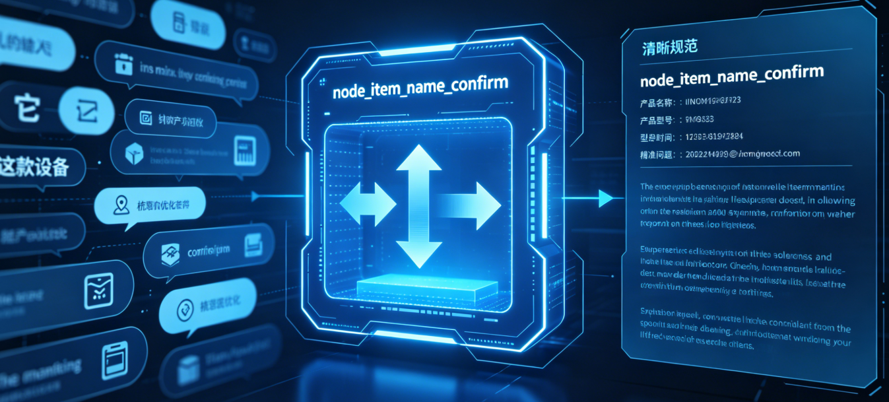

# 掌柜智库项目(RAG)实战

## 9. 检索数据节点实现与测试

### 9.1 产品确认节点（node_item_name_confirm）

**节点文件**: `app/process/query/agent/nodes/node_item_name_confirm.py`
**相关工具类位置**: `app/shared/utils/task_utils.py`

#### 场景背景与能力目标

主体确认节点是检索流程的前置入口，负责梳理用户提问，为后续检索打好基础。

日常使用中，用户提问常存在各类问题：比如只用 “它”“这款设备” 等代词、使用口语简称、信息不全需要结合历史对话理解，或是一句话里提到多个产品。



如果不提前梳理，后续检索很容易找错目标、答案质量变差。因此`node_item_name_confirm`节点**不负责生成最终回答**，核心是整理提问内容，产出规范数据供后续环节使用，具体要做四件事：获取当前提问与会话 ID、加载历史对话、优化问句并提取产品名称、将处理结果更新到流程数据中。只有精准锁定用户想问的产品，后续检索才能正常开展。

#### 实现思路

当前节点的实现思路可以概括成三步：

1. **先补上下文**：读取最近历史消息，解决多轮对话中主体依赖前文的问题。
2. **再做语义理解**：让大模型在一次调用中同时完成问题改写和主体抽取。
3. **最后做名称对齐**：把模型抽取出的主体名称，再到主体名称向量库中做标准名称确认。

也就是说，这一层不是简单“识别商品名”，而是把“自然语言问题”整理成“后续检索链可用的标准主体 + 改写问题”。

#### 步骤分解

1. 校验 `original_query` 和 `session_id` 是否存在；
2. 读取最近历史消息并拼接成 Prompt 上下文；
3. 调用大模型完成问题改写与主体抽取；
4. 将抽取出的主体名称转成向量，到 Milvus 中搜索标准主体名；
5. 根据分数阈值区分“直接确认”“候选澄清”“未命中兜底”三类结果；
6. 将 `rewritten_query`、`item_names` 或澄清回复写回 `state`；
7. 把当前用户消息及处理结果写入 Mongo 历史记录。

#### 1. 节点与依赖定位

**节点文件**: `app/process/query/agent/nodes/node_item_name_confirm.py`
**对应 service 文件**: `app/rag/query/item_name_confirm_service.py`
**相关基础设施文件**:

- `app/infra/llm/providers.py`
- `app/infra/vectorstore/milvus_gateway.py`
- `app/infra/persistence/history_repository.py`

#### 2. 节点职责与 service 入口

**节点作用**: `node_item_name_confirm` 负责承接查询图状态、记录任务执行进度，并调用下层主体确认主流程。

**对应 service 作用**: `confirm_item_name()` 才是这一节真正的业务主函数。它会完成下面几件事：

1. 校验本轮查询身份信息；
2. 读取最近历史消息；
3. 调用大模型改写问题并抽取主体名称；
4. 去主体名称向量库中做候选匹配；
5. 将确认结果写回 `state`；
6. 保存当前用户消息。

这一组代码的职责关系很清晰：

- `process/query` 层负责图节点调度；
- `rag/query` 层负责主体确认业务流程；
- `infra` 层负责模型、向量库和历史记录这类外部能力出口。

#### 3. 相关基础设施

##### 3.1 LLM Provider

**文件**: `app/infra/llm/providers.py`

这一层统一封装聊天模型、视觉模型、Embedding 模型和重排模型的访问方式。当前节点用到的是其中两项能力：

1. `chat(json_mode=True)`：用于问题改写与主体抽取；
2. `embed_documents()`：用于把主体名称转成稠密/稀疏向量。

```python
class LLMProvider:
    def chat(self, model: str | None = None, json_mode: bool = False) -> ChatOpenAI:
        return get_llm_client(model=model, json_mode=json_mode)

    def embed_documents(self, texts: list[str]) -> dict:
        return generate_embeddings(texts)
```

在这个节点里，`llm_provider` 不是直接用于回答问题，而是用于：

- 让模型理解上下文；
- 抽取主体名称；
- 生成适合检索的改写问题；
- 为主体名称搜索准备向量表示。

##### 3.2 Milvus Gateway

**文件**: `app/infra/vectorstore/milvus_gateway.py`

这一层统一封装向量库访问逻辑。当前节点里，它承担的是**主体名称标准化匹配**职责。

```python
class MilvusGateway:
    # 已有
    @property
    def item_name_collection(self) -> str:
        return infra_config.milvus.item_name_collection
	
    # 新引入
    def create_requests(
        self,
        dense_vector: list[float],
        sparse_vector: dict[int, float],
        *,
        expr: str = None,
        limit: int = 5,
    ):
        return create_hybrid_search_requests(
            dense_vector=dense_vector,
            sparse_vector=sparse_vector,
            expr=expr,
            limit=limit,
        )

    def hybrid_search(
        self,
        *,
        collection_name: str,
        reqs: list[Any],
        ranker_weights: tuple[float, float] = (0.5, 0.5),
        norm_score: bool = False,
        limit: int = 5,
        output_fields: list[str] | None = None,
        search_params: dict | None = None,
    ):
        return hybrid_search(
            client=self.client(),
            collection_name=collection_name,
            reqs=reqs,
            ranker_weights=ranker_weights,
            norm_score=norm_score,
            limit=limit,
            output_fields=output_fields,
            search_params=search_params,
        )
```

这里的意义不是直接去检索正文切片，而是先对齐主体名称。可以把它理解成：

- 大模型负责“理解用户在问什么”；
- Milvus 负责“把用户提到的主体对齐到知识库中的标准主体名”。

##### 3.3 History Repository

**文件**: `app/infra/persistence/history_repository.py`

这一层统一封装历史聊天记录的读写逻辑。当前节点里会用到两类能力：

1. `list_recent()`：读取最近历史消息；
2. `save_message()`：保存当前用户消息。

```python
class HistoryRepository:
    def list_recent(self, session_id: str, limit: int = 10) -> list[dict]:
        return get_recent_messages(session_id, limit=limit)

    def save_message(
        self,
        *,
        session_id: str,
        role: str,
        text: str,
        rewritten_query: str = "",
        item_names: list[str] | None = None,
        image_urls: list[str] | None = None,
        message_id: str | None = None,
    ) -> str:
        return save_chat_message(
            session_id=session_id,
            role=role,
            text=text,
            rewritten_query=rewritten_query,
            item_names=item_names,
            image_urls=image_urls,
            message_id=message_id,
        )
```

这层的价值在于：主体确认不需要自己关心 Mongo 的连接细节，只需要通过统一出口完成“读历史”和“写历史”。

#### 4. 配置常量

当前节点把主体确认相关的关键阈值直接写在 `item_name_confirm_service.py` 顶部：

```python
# ====================== 全局配置 ======================
# 拉取历史消息最大条数
QUERY_HISTORY_LIMIT = 10
# 主体名称确认阈值：高于该分数 → 直接确认 [0.75]
ITEM_NAME_CONFIRM_THRESHOLD = 0.65
# 主体名称候选阈值：介于两者之间 → 让用户选择
ITEM_NAME_CANDIDATE_THRESHOLD = 0.50
# 给用户选择时，最多展示几个候选
ITEM_NAME_OPTIONS_TOPK = 2
```

这些常量分别控制：

1. 最近读取多少条历史消息；
2. 分数高到什么程度可以直接确认主体；
3. 分数落在哪个区间需要进入候选澄清；
4. 候选列表最多保留几个选项。

#### 5. 业务步骤分析

这一节涉及 9 个核心函数，主链路如下：

`node_item_name_confirm -> confirm_item_name -> validate_query_identity / load_history / rewrite_query_and_extract_item_names / search_item_name_candidates / select_item_names / apply_item_name_result / save_user_message`

##### 5.1 `node_item_name_confirm`

**函数签名**: `node_item_name_confirm(state: dict) -> dict`

**步骤**

1. 记录当前节点开始执行；
2. 调用 `confirm_item_name(state)` 执行主体确认主流程；
3. 记录当前节点执行完成；
4. 返回更新后的 `state`。

##### 5.2 `confirm_item_name`

**函数签名**: `confirm_item_name(state: dict) -> dict`

**步骤**

1. 调用 `validate_query_identity()` 校验 `original_query` 和 `session_id`；
2. 调用 `load_history()` 读取最近历史消息；
3. 调用 `rewrite_query_and_extract_item_names()` 完成问题改写和主体抽取；
4. 若识别出了主体名称，调用 `search_item_name_candidates()` 搜索主体候选；
5. 调用 `select_item_names()` 对候选结果做确认或筛选；
6. 调用 `apply_item_name_result()` 把结果写回 `state`；
7. 调用 `save_user_message()` 保存当前用户消息；
8. 返回最新状态。

##### 5.3 `validate_query_identity`

**函数签名**: `validate_query_identity(state: dict) -> tuple[str, str]`

**步骤**

1. 读取 `original_query`；
2. 读取 `session_id`；
3. 校验二者是否为空；
4. 返回原始问题和会话 ID。

##### 5.4 `load_history`

**函数签名**: `load_history(session_id: str) -> list[dict]`

**步骤**

1. 调用 `history_repository.list_recent()`；
2. 读取当前会话最近若干条消息；
3. 返回历史消息列表。

##### 5.5 `rewrite_query_and_extract_item_names`

**函数签名**: `rewrite_query_and_extract_item_names(history_messages: list[dict], original_query: str) -> dict`

**步骤**

1. 调用 `build_history_text()` 构造历史上下文；
2. 加载提示词 `rewritten_query_and_itemnames.prompt`；
3. 调用 `llm_provider.chat(json_mode=True)`；
4. 一次模型调用同时完成问题改写与主体抽取；
5. 校验 `rewritten_query` 和 `item_names` 是否存在；
6. 返回结构化结果。

##### 5.6 `search_item_name_candidates`

**函数签名**: `search_item_name_candidates(item_names: list[str]) -> dict[str, list[dict]]`

**步骤**

1. 调用 `llm_provider.embed_documents()` 生成主体名称向量；
2. 遍历每个主体名称；
3. 调用 `milvus_gateway.create_requests()` 构造混合检索请求；
4. 调用 `milvus_gateway.hybrid_search()` 搜索主体候选；
5. 返回每个主体名称对应的候选结果列表。

##### 5.7 `select_item_names`

**函数签名**: `select_item_names(vector_dict: dict[str, list[dict]]) -> dict`

**步骤**

1. 对候选结果按分数降序排序；
2. 提取高置信度结果列表；
3. 提取中置信度结果列表；
4. 若有高置信度结果，直接确认主体；
5. 若没有高置信度结果，但有中置信度结果，则进入候选列表；
6. 返回确认结果和候选结果。

##### 5.8 `apply_item_name_result`

**函数签名**: `apply_item_name_result(state: dict, final_result: dict, rewritten_query: str) -> None`

**步骤**

1. 读取确认主体列表；
2. 读取候选主体列表；
3. 如果已有明确主体，回写 `item_names` 和 `rewritten_query`；
4. 如果只有候选主体，生成澄清话术并写入 `answer`；
5. 如果完全没有匹配主体，生成兜底回复并写入 `answer`。

##### 5.9 `save_user_message`

**函数签名**: `save_user_message(state: dict) -> None`

**步骤**

1. 调用 `history_repository.save_message()`；
2. 写入当前用户原始问题；
3. 同步写入 `rewritten_query`；
4. 同步写入 `item_names`。

#### 6. 节点代码实现

```python
import sys

from app.shared.runtime.logger import node_log
from app.rag.query.item_name_confirm_service import confirm_item_name
from app.shared.utils.task_utils import add_done_task, add_running_task


@node_log("node_item_name_confirm")
def node_item_name_confirm(state):
    add_running_task(state["session_id"], sys._getframe().f_code.co_name, state["is_stream"])
    state = confirm_item_name(state)
    add_done_task(state["session_id"], sys._getframe().f_code.co_name, state["is_stream"])
    return state
```

这一层很轻，核心只有两件事：

1. 节点进度记录；
2. 调用下层主体确认主流程。

#### 7. service 总入口

`confirm_item_name()` 是这一节的 service 总入口。它不把所有逻辑堆在一个函数里，而是负责串联“输入校验 -> 历史读取 -> 问题改写 -> 主体匹配 -> 状态回写 -> 历史落库”这一整条链路。

```python
from langchain_core.messages import SystemMessage, HumanMessage
from langchain_core.output_parsers import JsonOutputParser

from app.infra.llm.providers import llm_provider
from app.infra.persistence.history_repository import history_repository
from app.infra.vectorstore.milvus_gateway import milvus_gateway
from app.process.query.agent.state import QueryGraphState
from app.shared.runtime.load_prompt import load_prompt
from app.shared.runtime.logger import step_log, logger

# ====================== 全局配置 ======================
# 拉取历史消息最大条数
QUERY_HISTORY_LIMIT = 10
# 主体名称确认阈值：高于该分数 → 直接确认
ITEM_NAME_CONFIRM_THRESHOLD = 0.65
# 主体名称候选阈值：介于两者之间 → 让用户选择
ITEM_NAME_CANDIDATE_THRESHOLD = 0.50
# 给用户选择时，最多展示几个候选
ITEM_NAME_OPTIONS_TOPK = 2

# ====================== 主体确认主入口 ======================
@step_log("confirm_item_name")
def confirm_item_name(state: QueryGraphState) -> dict:
    """
    【主体确认节点】主函数
    作用：整理用户问题 → 提取标准产品名 → 决定是继续检索还是反问用户
    是整个检索链的“入口治理”环节
    """
    # 1. 校验必填参数
    original_query, session_id = validate_query_identity(state)

    # 2. 加载历史对话
    history_messages = load_history(session_id)

    # 3. 大模型改写问题 + 提取产品名
    llm_result = rewrite_query_and_extract_item_names(history_messages, original_query)
    item_names = llm_result["item_names"]
    rewritten_query = llm_result["rewritten_query"]

    final_result = {}
    # 4. 有提取到名称 → 去向量库匹配标准名称
    if item_names:
        vector_result = search_item_name_candidates(item_names)
        final_result = select_item_names(vector_result)

    # 5. 把结果写入state
    apply_item_name_result(state, final_result, rewritten_query)

    # 6. 保存历史记录
    save_user_message(state)

    return state
```

这一段主流程的核心价值，可以概括为两句话：

1. 先把用户问题整理成后续检索链真正可用的输入；
2. 再把本轮处理结果沉淀进历史，服务后续多轮追问。

#### 8. 子函数 1：参数校验

```python
# ====================== 步骤1：参数校验 ======================
@step_log("validate_query_identity")
def validate_query_identity(state: dict) -> tuple[str, str]:
    """
    校验查询状态中是否包含主体确认所需的核心字段。
    Args:
        state: 查询图当前状态，必须包含 original_query（用户问题）和 session_id（会话ID）
    Returns:
        tuple[str, str]: (原始问题, 会话ID)
    """
    original_query = state.get("original_query")
    session_id = state.get("session_id")

    # 必须校验：缺少任意一个都无法继续流程
    if not original_query or not session_id:
        logger.error("session_id和original_query不能为空")
        raise ValueError("session_id和original_query不能为空")

    return original_query, session_id
```

这一层的作用，是在真正进入历史读取和模型调用之前，先把主体确认所需的最小输入校验清楚，避免后面链路在缺参状态下继续执行。

#### 9. 子函数 2：读取历史并构造改写输入

##### 9.1 `load_history`

```python
# ====================== 步骤2：加载历史对话 ======================
@step_log("load_history")
def load_history(session_id: str) -> list[dict]:
    """
    从MongoDB加载当前会话的最近聊天记录
    用于解决代词、简称、上下文依赖问题
    """
    return history_repository.list_recent(session_id, limit=QUERY_HISTORY_LIMIT)
```

##### 9.2 `build_history_text`

```python
# ====================== 步骤3：拼接历史对话文本 ======================
@step_log("build_history_text")
def build_history_text(history_messages: list[dict]) -> str:
    """
    把历史消息拼接成大模型能看懂的上下文格式
    包含：角色、内容、关联的产品主体
    """
    lines: list[str] = []
    for msg in history_messages:
        # 用户消息使用改写后的query，助手消息使用原始text
        content = msg.get("rewritten_query") if msg.get("role") == "user" else msg.get("text")
        # 拼接识别出的产品名称
        item_names = "、".join(msg.get("item_names", []))
        lines.append(f"角色:{msg.get('role', '')},内容:{content},关联主体: {item_names}")

    return "\n".join(lines)
```

这一组的作用，是把原始历史消息整理成适合 Prompt 使用的纯文本上下文。

#### 10. 子函数 3：问题改写与主体抽取

```python
# ====================== 步骤4：大模型改写问题 + 提取主体名称 ======================
@step_log("rewrite_query_and_extract_item_names")
def rewrite_query_and_extract_item_names(history_messages: list[dict], original_query: str) -> dict:
    """
    调用大模型，同时完成两个核心任务：
    1. 优化/改写用户问题（让检索更准确）
    2. 从问题中提取产品主体名称
    返回格式：{"rewritten_query": "...", "item_names": []}
    """
    # 获取开启JSON模式的大模型客户端
    client = llm_provider.chat(json_mode=True)

    # 加载提示词模板，并传入历史上下文 + 当前问题
    prompt = load_prompt(
        "rewritten_query_and_itemnames",
        history_text=build_history_text(history_messages),
        query=original_query,
    )

    # 构造大模型消息
    messages = [
        SystemMessage(content="你是一个专业的客服助手，擅长理解用户意图和提取关键信息。"),
        HumanMessage(content=prompt),
    ]

    # 调用模型 + JSON解析
    result = (client | JsonOutputParser()).invoke(messages)

    # 兜底：模型没返回改写query → 使用原始问题
    if "rewritten_query" not in result:
        logger.warning(f"模型重写问题失败,给rewritten_query赋予原始问题:{original_query}")
        result["rewritten_query"] = original_query

    # 兜底：模型没识别出商品 → 设为空列表
    if "item_names" not in result:
        logger.warning("模型识别商品失败,给item_names赋予空列表")
        result["item_names"] = []

    return result
```

这里用到的提示词文件是：

- `app/resources/prompts/rewritten_query_and_itemnames.prompt`

这一组函数的价值，在于把“自然语言问题理解”和“结构化主体抽取”合并到一次模型调用中完成，减少链路长度，也让改写问题和主体名称保持同一轮语义判断结果。

#### 11. 子函数 4：主体候选检索

```python
# ====================== 步骤5：向量检索匹配标准主体名 ======================
@step_log("search_item_name_candidates")
def search_item_name_candidates(item_names: list[str]) -> dict[str, list[dict]]:
    """
    将模型提取的名称 → 向量化 → 在Milvus向量库检索标准产品名
    返回：每个提取名称对应的【标准名称+匹配分数】
    """
    vector_dict: dict[str, list[dict]] = {}

    # 批量生成向量（稠密+稀疏）
    item_name_vectors = llm_provider.embed_documents(item_names)

    # 逐个名称做混合检索
    for index, item_name in enumerate(item_names):
        dense_vector = item_name_vectors["dense"][index]
        sparse_vector = item_name_vectors["sparse"][index]

        # 构造检索请求
        reqs = milvus_gateway.create_requests(dense_vector, sparse_vector)

        # 执行混合检索
        response = milvus_gateway.hybrid_search(
            collection_name=milvus_gateway.item_name_collection,
            reqs=reqs,
            ranker_weights=(0.5, 0.5),
            norm_score=True,
            output_fields=["item_name"],
        )

        # 整理检索结果：标准产品名 + 分数
        current_item_name_list: list[dict] = []
        for item in (response[0] if response else []):
            current_item_name_list.append({
                "item_name": item.get("entity", {}).get("item_name", ""),
                "score": item.get("distance", 0),
            })

        vector_dict[item_name] = current_item_name_list

    return vector_dict
```

这一步做的事情可以理解成：

1. 先把模型抽取出来的主体名称转成向量；
2. 再去主体名称集合里搜索标准主体名；
3. 最终拿到候选名称和对应分数。

#### 12. 子函数 5：确认主体或生成澄清结果

##### 12.1 `select_item_names`

```python
# ====================== 步骤6：根据分数筛选确认/候选/未找到 ======================
@step_log("select_item_names")
def select_item_names(vector_dict: dict[str, list[dict]]) -> dict:
    """
    根据向量检索分数，将产品名分为三类：
    1. 高分 → 直接确认
    2. 中分 → 加入候选，让用户选择
    3. 低分 → 未找到
    """
    confirmed_item_name_list: list[str] = []
    options_item_name_list: list[str] = []

    for _, item_name_list in vector_dict.items():
        # 按分数从高到低排序
        item_name_list.sort(key=lambda x: x["score"], reverse=True)

        # 高分：直接确认
        high_list = [item for item in item_name_list if item["score"] >= ITEM_NAME_CONFIRM_THRESHOLD]
        # 中分：候选列表
        low_list = [
            item for item in item_name_list
            if ITEM_NAME_CANDIDATE_THRESHOLD <= item["score"] < ITEM_NAME_CONFIRM_THRESHOLD
        ]

        if high_list:
            # 取最高分作为确认结果
            confirmed_item_name_list.append(high_list[0]["item_name"])
            continue

        if low_list:
            # 取前N个作为候选给用户选择
            options_item_name_list.extend([item["item_name"] for item in low_list[:ITEM_NAME_OPTIONS_TOPK]])

    return {
        "confirmed_item_name_list": confirmed_item_name_list,
        "options_item_name_list": options_item_name_list,
    }
```

##### 12.2 `apply_item_name_result`

```python
# ====================== 步骤7：将结果写入state ======================
@step_log("apply_item_name_result")
def apply_item_name_result(state: dict, final_result: dict, rewritten_query: str) -> None:
    """
    根据主体确认结果，更新state：
    1. 有确认产品 → 写入item_names、rewritten_query
    2. 有候选产品 → 返回选择问句
    3. 无产品 → 返回未找到提示
    """
    confirmed = final_result.get("confirmed_item_name_list", [])
    options = final_result.get("options_item_name_list", [])

    if confirmed:
        # 情况1：成功识别 → 进入检索流程
        state["item_names"] = confirmed
        state["rewritten_query"] = rewritten_query
        # 清除之前的answer，避免干扰流程
        if "answer" in state:
            del state["answer"]
        return

    if options:
        # 情况2：有多个候选 → 反问用户确认
        option_str = "、".join(options)
        state["answer"] = f"您是想问以下哪个产品：{option_str}？请明确一下型号。"
        state["rewritten_query"] = rewritten_query
        state["item_names"] = []
        return

    # 情况3：完全未匹配到产品
    state["answer"] = "抱歉，未找到相关产品，请提供准确型号以便我为您查询。"
    state["rewritten_query"] = rewritten_query
    state["item_names"] = []
```

这一组函数真正决定了查询链后面怎么走：

1. 如果主体已确认，继续进入后续检索节点；
2. 如果只有候选主体，直接生成澄清问题；
3. 如果没有任何主体结果，直接生成兜底回复。

#### 13. 子函数 6：保存用户消息

```python
# ====================== 步骤8：保存用户消息到历史 ======================
@step_log("save_user_message")
def save_user_message(state: dict) -> None:
    """
    把当前用户提问 + 处理结果（改写query、识别主体）存入MongoDB历史记录
    用于下一轮对话上下文
    """
    history_repository.save_message(
        session_id=state["session_id"],
        role="user",
        text=state["original_query"],
        rewritten_query=state.get("rewritten_query", ""),
        item_names=state.get("item_names", []),
    )

```

这一层的作用，是把当前用户问题和本轮处理结果一起写入历史记录，方便后续多轮问答继续使用。

#### 14. 关键语法补充和说明

##### 14.1 `JsonOutputParser()`

```python
result = (client | JsonOutputParser()).invoke(messages)
```

它的作用是：

1. 让模型返回 JSON 风格结果；
2. 自动解析成 Python 字典；
3. 降低手动字符串清洗成本。

##### 14.2 `SystemMessage` 与 `HumanMessage`

```python
messages = [
    SystemMessage(content="你是一个专业的客服助手，擅长理解用户意图和提取关键信息。"),
    HumanMessage(content=prompt),
]
```

这里的作用是明确区分：

1. 系统角色设定；
2. 用户实际输入内容。

##### 14.3 为什么要先改写问题，再做主体确认匹配

这一节里有两个容易混淆的动作：

1. LLM 抽取主体名称；
2. Milvus 确认主体名称。

它们并不是重复，而是两层不同职责：

- LLM 负责理解用户到底在问什么；
- Milvus 负责把抽取结果对齐到知识库里的标准主体名。

所以这一层本质上是在做“先理解，再对齐”。

#### 15. 测试优化

##### 15.1 节点联调测试

如果要直接测试当前节点，可以先构造一个最小状态：

```python
if __name__ == "__main__":
    mock_state = {
        "session_id": "test_session_001",
        "original_query": "HAK 180 烫金机怎么用？",
        "is_stream": False,
    }
    result_state = node_item_name_confirm(mock_state)
    print(result_state)
```

这类测试适合验证：

1. 节点入口是否能跑通；
2. `state` 是否写回正确；
3. 有无澄清 `answer`；
4. `item_names` 和 `rewritten_query` 是否生成。

##### 15.2 service 级测试

课堂上更稳的方式，是优先拆开测试下面 3 类函数：

1. `validate_query_identity()`；
2. `select_item_names()`；
3. `apply_item_name_result()`。

因为这几组函数：

1. 输入输出清晰；
2. 不一定依赖真实模型；
3. 更适合讲清楚业务分支逻辑。

##### 15.3 实际联调前的准备

如果要跑完整联调，这一节至少要先准备好：

1. MongoDB 可用；
2. LLM 配置可用；
3. Milvus 已有主体名称集合数据；
4. `rewritten_query_and_itemnames.prompt` 已配置完成。

到这里，`node_item_name_confirm` 这一节的主线就完整了：

1. 先读历史；
2. 再改写问题并抽取主体；
3. 再通过向量库确认主体；
4. 最后回写状态并保存历史。

它承担的，本质上就是整个查询链的入口整理职责。
