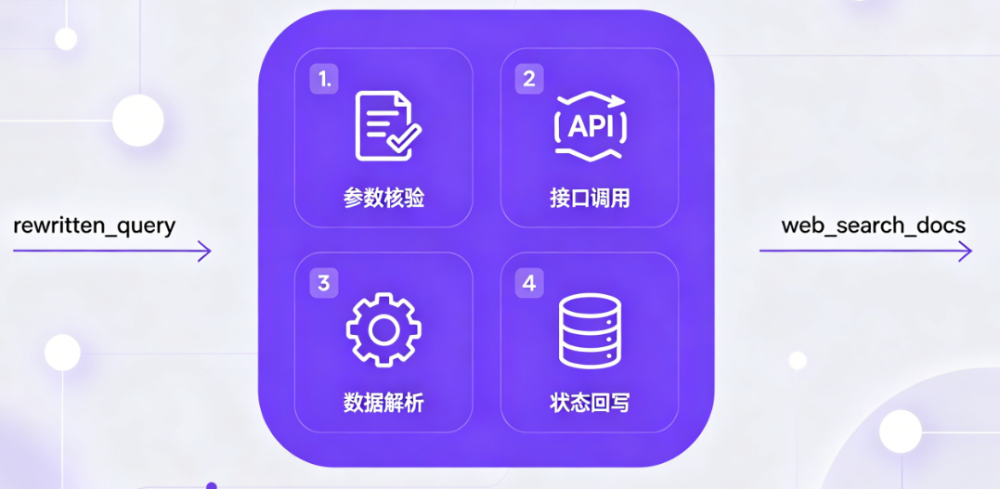

# 掌柜智库项目(RAG)实战

## 9. 检索数据节点实现与测试

### 9.4 联网检索节点（node_web_search_mcp）

**节点文件**: `app/process/query/agent/nodes/node_web_search_mcp.py`
**相关工具类位置**: `app/shared/utils/task_utils.py`

#### 场景背景与能力目标

本地向量检索、HyDE 增强检索仅能覆盖内部知识库内容，面对**知识库无相关资料、内容老旧、需最新外网信息**等场景存在局限。为此，查询链增设外部信息通道，由`node_web_search_mcp`提供联网检索能力。

该节点不替代本地检索，仅作为补充，将网页搜索结果规整为统一数据格式，供后续`rerank`环节与本地融合结果全局重排。

流程边界明确：本地两路检索结果先经 RRF 融合，**联网数据不参与 RRF 计算**，延后至重排阶段再合并。本节点核心职责为完成外部网页数据的采集与接入。



**实现思路**

1. **参数校验**：检查改写后问句`rewritten_query`是否有效；
2. **接口调用**：基于 DashScope WebSearch MCP 发起联网搜索；
3. **数据解析**：提取接口返回的网页列表数据；
4. **状态回写**：将标准化网页结果存入`web_search_docs`。

该链路区别于本地检索：不依赖 Milvus 向量库、不执行向量匹配，直接对接外部搜索服务，最终输出网页文档集合。

#### 步骤分解

1. 校验 `rewritten_query` 是否存在；
2. 读取 MCP 配置；
3. 创建 `MCPServerStreamableHttp` 客户端；
4. 建立 MCP 连接并调用 `bailian_web_search` 工具；
5. 解析原始响应中的 `pages`；
6. 将页面列表写入 `web_search_docs`；
7. 在后续 `rerank` 节点与本地召回结果一起做统一排序。

#### 1. 节点与依赖定位

**节点文件**: `app/process/query/agent/nodes/node_web_search_mcp.py`
**对应 service 文件**: `app/rag/query/web_search_service.py`
**相关配置文件**:

- `app/shared/config/bailian_mcp_config.py`

**相关依赖**:

- `openai-agents`

#### 2. 节点职责与 service 入口

**节点作用**: `node_web_search_mcp` 负责承接查询图状态、记录节点执行进度，并调用下层联网检索服务。

**对应 service 作用**: 这一节的联网检索逻辑拆成了 3 层：

1. `validate_web_search_inputs()`：校验联网检索所需的查询文本；
2. `search_web_documents_async()`：异步执行 DashScope MCP WebSearch 调用；
3. `search_web_documents()`：同步包装入口，负责桥接异步调用并解析结果。

这一组代码的职责边界非常清晰：

- `process/query` 层负责图节点调度；
- `rag/query` 层负责联网搜索业务流程；
- `shared/config` 负责读取 DashScope MCP 配置；
- MCP 服务本身负责返回网页搜索结果。

#### 3. 环境准备与配置

##### 3.1 开通 DashScope WebSearch MCP

联网检索要先在阿里云百炼平台开通 WebSearch MCP 服务。

准备步骤可以收敛成下面 4 步：

1. 登录阿里云百炼控制台；

2. 进入 [MCP 广场](https://bailian.console.aliyun.com/cn-beijing/?spm=a2c4g.11186623.0.0.5f885389KrrOsZ&tab=mcp#/mcp-market)，搜索 `联网搜索`；

   

3. 开通 `WebSearch` 服务；

4. 复制对应的 MCP 服务地址。

当前项目代码采用的是 **Streamable HTTP** 方式，因此环境变量里需要配置的是：

- `MCP_DASHSCOPE_BASE_URL`

MCP三种方式对比:

- stdio

  - 连接形态：本地进程间通信（你的客户端拉起 MCP Server 子进程，用 stdin/stdout 传 JSON-RPC）
  - 适用场景：本机工具、桌面插件、开发调试
  - 优点：实现简单、延迟低、不走网络、部署门槛低
  - 缺点：不适合跨机器/云原生；进程生命周期管理复杂；扩展性一般
- SSE

  - 连接形态：HTTP 下行流（Server → Client 推送事件）+ 通常再配一个上行请求通道
  - 适用场景：早期 Web 场景、需要流式返回但交互不复杂
  - 优点：浏览器友好、流式输出直观
  - 缺点：天然“偏单向”；上行/下行分离，协议拼装复杂；代理/网关兼容性、重连语义、会话一致性处理麻烦
- Streamable HTTP

  - 连接形态：基于 HTTP 的统一可流式传输模式（请求/响应语义更完整，可流式返回）
  - 适用场景：云上 MCP、跨网络调用、生产系统
  - 优点：更标准化、易被网关/CDN/鉴权体系接纳；与现代 API 基础设施更兼容；实现与运维一致性更好
  - 缺点：比 stdio 多网络链路与超时治理成本
    为什么很多场景从 SSE 转到 Streamable

- 本地工具/离线插件：选 stdio
- 浏览器演示/轻量流式：可用 SSE
- 云上生产、跨网络、要稳定：优先 Streamable HTTP

**注意事项**

1.  现在开通阿里百炼的bailian_web_search，如果是新申请的则默认是streamablehttp，不再支持sse。
2.  如果是之前开通的sse模式需要重新开通一下，会自动变为streamablehttp。
3.  百炼官方mcp 链接：https://bailian.console.aliyun.com/cn-beijing?spm=a2c4g.11186623.0.0.406e358bUXaXLy&tab=app#/mcp-market/detail/WebSearch

##### 3.2 安装依赖

当前项目使用的是 `openai-agents` 中提供的 MCP 客户端能力，因此需要安装：

```bash
uv add openai-agents
```

`pyproject.toml` 中当前依赖口径也是：

```toml
openai-agents>=0.4.2
```

##### 3.3 环境变量配置

项目 `.env.example` 中已经预留了 DashScope MCP 配置：

```ini
# DashScope MCP / WebSearch 配置
MCP_DASHSCOPE_BASE_URL=https://dashscope.aliyuncs.com/api/v1/mcps/WebSearch/mcp
```

这里实际还会继续复用：

- `OPENAI_API_KEY`

它在当前节点里被当作 DashScope MCP 的授权 Token 使用。

##### 3.4 配置读取出口

**文件**: `app/shared/config/bailian_mcp_config.py`

```python
from dataclasses import dataclass

from app.shared.config.common import env_str


@dataclass
class McpConfig:
    mcp_base_url: str
    api_key: str


mcp_config = McpConfig(
    mcp_base_url=env_str("MCP_DASHSCOPE_BASE_URL"),
    api_key=env_str("OPENAI_API_KEY"),
)
```

这一层的作用很明确：

1. 统一读取 MCP 基础配置；
2. 避免在业务代码里直接散落读取环境变量；
3. 为后续 MCP 能力扩展保留统一配置出口。

#### 4. 相关配置说明

**1) 获取查询词**

从 LangGraph 全局状态对象`state`中提取**重写后的精准查询语句**（`rewritten_query`），为标准化搜索关键词；若该字段为空 / 未提取到，直接终止后续流程，避免无效 MCP 调用。

**2) 初始化 MCP 连接**

基于`MCPServerSse`创建 MCP 客户端实例，配置百炼 MCP 核心连接参数后，通过`await search_mcp.connect()`建立 SSE 流式连接（连接成功返回`{"type": "connect", "success": true}`）。

核心配置参数（JSON 格式）：

```json
{
  "url": "百炼MCP SSE接口地址（.env中MCP_DASHSCOPE_BASE_URL）",
  "headers": {
    "Authorization": "百炼/阿里云API密钥（.env中OPENAI_API_KEY）"
  },
  "timeout": 300,  // 客户端整体超时时间（秒）
  "sse_read_timeout": 300  // SSE流式读取超时时间（秒）
}
```

**3) 调用搜索工具**

基于已建立的 MCP 连接，通过`call_tool()`调用百炼专属搜索工具`bailian_web_search`，**工具调用固定传参格式（JSON）**，参数不可随意修改：

```
{
  "tool_name": "bailian_web_search",  // 固定值，百炼搜索工具唯一标识
  "arguments": {
    "query": "步骤1提取的rewritten_query",  // 必选，搜索查询词
    "count": 5  // 可选，返回结果数量，默认5条（建议1-10）
  }
}
```

**4) 解析与格式化**

接收 MCP 流式响应，提取有效数据并清洗，最终封装为统一格式文档列表，为后续节点提供标准化数据。

① MCP 原始返回值（核心有效片段，SSE 流式 JSON）

```json
{
  "type": "tool_call",
  "content": [
    {
      "text": "{\"pages\": [{\"title\": \"结果标题\", \"url\": \"结果链接\", \"snippet\": \"核心摘要\", \"source\": \"数据源\"}]}"
    }
  ]
}
```

② 解析规则

1. 过滤出`type: "tool_call"`的响应，提取`content[0].text`并转为 JSON 对象；
2. 提取对象中`pages`数组，遍历后仅保留`title`/`url`/`snippet`三个核心字段；
3. 对所有字段做清洗（去首尾空格、过滤空值），剔除`snippet`为空的无效结果。

③ 最终格式化结果（列表嵌套字典，统一格式）

```json
[
  {
    "title": "清洗后的结果标题",
    "url": "清洗后的结果链接",
    "snippet": "清洗后的核心摘要（非空）"
  }
]
```

**5) 更新状态与资源清理**

① 资源清理

无论调用成功 / 失败 / 中断，均通过`await search_mcp.cleanup()`关闭 MCP 连接，释放客户端资源，避免资源泄漏。

② 状态更新返回

将步骤 4 格式化后的文档列表，以`web_search_docs`为字段名更新到 LangGraph 全局状态并返回，供后续节点（重排序、大模型生成）使用；无有效结果则返回空字典。

最终返回状态（JSON）

```json
{
  "web_search_docs": [
    {
      "title": "HAK 180 烫金机官方操作手册",
      "url": "https://xxx.com/hak180/manual",
      "snippet": "HAK 180 顶部50-170mm局部烫金设置：操作面板【转印参数】-【区域设置】，选择顶部局部，输入起始50mm、结束170mm，保存生效"
    }
  ]
}
```

#### 5. 业务步骤分析

这一节涉及 4 个核心函数，主链路如下：

`node_web_search_mcp -> search_web_documents -> validate_web_search_inputs / search_web_documents_async`

##### 5.1 `node_web_search_mcp`

**函数签名**: `node_web_search_mcp(state: dict) -> dict`

**步骤**

1. 记录当前节点开始执行；
2. 调用 `search_web_documents(state, count=10)`；
3. 记录当前节点执行完成；
4. 返回 `{"web_search_docs": pages}`。

##### 5.2 `validate_web_search_inputs`

**函数签名**: `validate_web_search_inputs(state: dict) -> str`

**步骤**

1. 读取 `rewritten_query`；
2. 校验查询文本是否为空；
3. 返回已校验通过的查询文本。

##### 5.3 `search_web_documents_async`

**函数签名**: `search_web_documents_async(rewritten_query: str, count: int = 5)`

**步骤**

1. 创建 `MCPServerStreamableHttp` 客户端；
2. 配置 MCP 地址、鉴权头和超时时间；
3. 调用 `connect()` 建立连接；
4. 调用 `list_tools()` 拉取工具列表；
5. 调用 `call_tool()` 执行 `bailian_web_search`；
6. 在 `finally` 中调用 `cleanup()` 释放连接。

##### 5.4 `search_web_documents`

**函数签名**: `search_web_documents(state: dict, count: int = 10) -> list[dict]`

**步骤**

1. 调用 `validate_web_search_inputs()` 校验查询文本；
2. 调用 `asyncio.run()` 执行异步联网搜索；
3. 读取 MCP 返回的 `content[0].text`；
4. 解析 JSON，提取 `pages` 列表；
5. 返回页面结果列表。

#### 6. 节点代码实现

```python
import sys

from app.shared.runtime.logger import node_log
from app.rag.query.web_search_service import search_by_web
from app.shared.utils.task_utils import add_done_task, add_running_task


@node_log("node_web_search_mcp")
def node_web_search_mcp(state):
    add_running_task(state["session_id"], sys._getframe().f_code.co_name, state["is_stream"])
    pages = search_by_web(state, count=10)
    add_done_task(state["session_id"], sys._getframe().f_code.co_name, state["is_stream"])
    return {"web_search_docs": pages}
```

这一层仍然很轻，核心作用只有三件事：

1. 节点进度记录；
2. 调用联网检索 service；
3. 把网页结果写回 `web_search_docs`。

#### 7. service 总入口

`search_web_documents()` 是这一节的 service 总入口。它把“输入校验 -> 异步 MCP 调用 -> 结果解析”这一整条链路串了起来。

```python
from agents.mcp import MCPServerStreamableHttp

from app.shared.config import mcp_config
from app.shared.runtime.logger import logger, step_log
import asyncio
import json

# 从全局配置读取MCP联网搜索服务地址、密钥
DASHSCOPE_BASE_URL_STREAM_ABLE_HTTP = mcp_config.mcp_base_url
DASHSCOPE_API_KEY = mcp_config.api_key


@step_log("search_web_documents")
def search_by_web(state: dict, count: int = 10) -> list[dict]:
    """
    【外网联网检索节点】同步入口
    适配流程图同步调用规范，封装异步联网搜索能力
    Args:
        state: 查询流程图全局状态
        count: 最大返回网页结果条数，默认10条
    Returns:
        list[dict]: 结构化网页检索结果列表
    """
    # 校验前置参数合法性，获取标准化检索问句
    rewritten_query = validate_web_search_inputs(state)
    # 执行异步联网搜索
    mcp_result = asyncio.run(search_web_documents_async(rewritten_query, count=count))
    # 解析工具返回的JSON文本数据
    text_dict = json.loads(mcp_result.content[0].text)
    # 提取网页详情列表返回，无结果则返回空列表
    return text_dict.get("pages", [])
```

这一段主流程的价值有两点：

1. 对外统一暴露同步调用入口；
2. 对内把 MCP 原始响应整理成查询链可直接使用的页面列表。

#### 8. 子函数 1：输入校验

```python
@step_log("validate_web_search_inputs")
def validate_web_search_inputs(state: dict) -> str:
    """
    校验联网检索前置参数
    联网搜索依赖改写后的标准问句，无有效问句则无法执行检索
    Args:
        state: 查询流程图全局状态
    Returns:
        str: 校验通过的标准化检索问句
    """
    rewritten_query = state.get("rewritten_query")
    # 联网搜索必须依赖语义完整的改写问句，原始口语化问句检索效果差
    if not rewritten_query:
        logger.error("rewritten_query不能为空!")
        raise ValueError("rewritten_query不能为空!")
    return rewritten_query
```

这一层的作用，是确保联网搜索一定建立在已经完成问题改写之后。

因为联网检索的查询文本如果太原始、太短或不完整，搜索结果质量会明显下降。

#### 9. 子函数 2：异步联网搜索执行

```python
async def search_web_documents_async(rewritten_query: str, count: int = 5):
    """
    异步调用MCP联网搜索工具，获取互联网检索结果
    Args:
        rewritten_query: 标准化检索问句
        count: 返回网页检索结果条数
    Returns:
        联网搜索工具原始返回数据对象
    """
    # 初始化MCP流式HTTP客户端，配置连接参数与超时时间
    mcp_server = MCPServerStreamableHttp(
        name="search_mcp",
        client_session_timeout_seconds=300,
        params={
            "url": DASHSCOPE_BASE_URL_STREAM_ABLE_HTTP,
            "headers": {"Authorization": DASHSCOPE_API_KEY},
            "timeout": 300,
            "sse_read_timeout": 300,
        },
    )
    try:
        # 建立MCP服务连接
        await mcp_server.connect()
        # 打印当前可用工具列表，用于调试观测
        tool_list = await mcp_server.list_tools()
        logger.info(f"工具列表:{tool_list}")
        # 调用百炼联网搜索工具，传入检索问句与结果数量
        return await mcp_server.call_tool(
            tool_name="bailian_web_search",
            arguments={
                "query": rewritten_query,
                "count": count,
            },
        )
    finally:
        # 无论成功失败，最终释放连接资源，避免连接堆积
        await mcp_server.cleanup()
```

这一层是真正访问 DashScope MCP 的地方。它负责：

1. 建立远端连接；
2. 调用联网搜索工具；
3. 在执行结束后及时释放资源。

#### 10. 关键语法补充和说明

##### 10.1 `asyncio.run()`

```python
mcp_result = asyncio.run(search_web_documents_async(rewritten_query, count=count))
```

当前节点是同步调用方式，而 MCP SDK 的联网调用是异步实现，因此这里使用 `asyncio.run()` 做同步与异步之间的桥接。

它的作用是：

1. 临时启动一个事件循环；
2. 执行异步搜索函数；
3. 执行完成后自动关闭事件循环。

##### 10.2 `MCPServerStreamableHttp`

这一节采用的是：

- `Streamable HTTP`

当前代码里的关键参数包括：

1. `url`：DashScope MCP 服务地址；
2. `headers`：鉴权头；
3. `timeout`：请求超时；
4. `sse_read_timeout`：流式读取超时；
5. `client_session_timeout_seconds`：客户端会话总超时。

参考地址: https://openai.github.io/openai-agents-python/mcp/#2-streamable-http-mcp-servers

##### 11.3 为什么联网搜索结果不直接进 RRF

`RRF` 的职责是融合本地向量检索结果，而联网搜索结果本质上属于另一类网页文档。

所以当前项目把它放到了后面的 `rerank` 阶段统一处理：

1. `RRF` 负责本地两路结果融合；
2. `rerank` 负责把本地结果和网页结果一起重排。

这样做的好处是职责清晰，也更符合不同数据来源的处理边界。

#### 12. 测试优化

##### 12.1 节点联调测试

如果要直接测试当前节点，可以构造一个最小状态：

```python
if __name__ == "__main__":
    test_state = {
        "session_id": "xxxx",
        "is_stream": False,
        "rewritten_query": "HAK 180 在出厂默认状态下，若想在纸张上只把烫金膜转印到顶部 50 mm–170 mm 的局部区域，应在操作面板上如何设置",
    }
    result_state = node_web_search_mcp(test_state)
    print(result_state)
```

这类测试适合验证：

1. MCP 配置是否正确；
2. 联网搜索是否能够返回页面列表；
3. `web_search_docs` 是否写回正常；
4. 网页结果结构是否满足后续重排阶段使用。

##### 12.2 service 级测试

课堂上更稳的方式，是优先拆开测试下面 2 类函数：

1. `validate_web_search_inputs()`；
2. `search_web_documents()`。

因为它们正好覆盖了这一节最核心的两件事：

1. 输入是否可用于联网搜索；
2. 联网搜索结果是否能被正常解析。

##### 12.3 实际联调前的准备

如果要跑完整联调，这一节至少要先准备好：

1. DashScope WebSearch MCP 已开通；
2. `MCP_DASHSCOPE_BASE_URL` 已配置；
3. `OPENAI_API_KEY` 已配置；
4. `openai-agents` 已安装；
5. `rewritten_query` 已由前置节点正确生成。

到这里，`node_web_search_mcp` 这一节的主线就完整了：

1. 先校验联网搜索输入；
2. 再通过 DashScope MCP 执行一次联网检索；
3. 最后把网页结果写入 `web_search_docs`；
4. 在后续 `rerank` 阶段与本地召回结果一起统一排序。

它承担的，本质上就是查询链中的外部信息补充职责。
