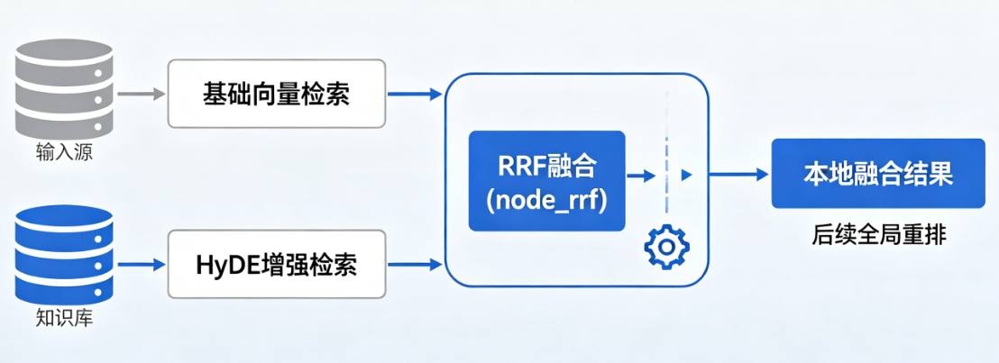

# 掌柜智库项目(RAG)实战

## 9. 检索数据节点实现与测试

### 9.5 RRF 融合节点（node_rrf）

**节点文件**: `app/process/query/agent/nodes/node_rrf.py`
**相关工具类位置**: `app/shared/utils/task_utils.py`

#### 场景背景与能力目标

经过前文检索链路，查询链已获取三类候选资源：基础向量检索结果、HyDE增强检索结果、外网联网搜索结果。为保证检索融合的稳定性与层次感，项目采用**分层融合策略**，不直接对三路结果全局混排。

整体处理逻辑分为两层：首先完成本地两路知识库结果融合，再在后续重排阶段，将本地融合结果与外网网页结果统一排序择优。

因此，**node_rrf** 仅负责**本地双路检索结果的前置融合**，不参与外网数据合并，也不承担最终全局重排能力。



该节点核心目标如下：

1. 针对两路检索重复命中的知识切片，完成分数累计融合，消除重复冗余；

2. 对在基础检索、HyDE增强检索中均表现优异的切片，提升整体排序优先级，强化高置信度知识的权重。

简言之，RRF节点无需再次检索、不做最终排序，核心作用是**聚合本地双路召回优势，输出更稳定、更精准的本地候选知识集合**，为后续全局重排环节提供高质量输入。

#### 步骤分解

1. 从 `state` 中读取 `embedding_chunks` 和 `hyde_embedding_chunks`；
2. 为两路结果配置融合权重；
3. 遍历每一路结果，读取每条文档的 `chunk_id`；
4. 按 `1 / (k + rank)` 公式累加融合得分；
5. 以 `chunk_id` 去重并保存文档内容；
6. 按融合得分降序排序；
7. 截取前 `top` 条结果写入 `rrf_chunks`。

#### 1. 节点与依赖定位

**节点文件**: `app/process/query/agent/nodes/node_rrf.py`
**对应 service 文件**: `app/rag/query/rrf_service.py`

#### 2. 节点职责与 service 入口

**节点作用**: `node_rrf` 负责承接查询图状态、记录节点执行进度，并调用下层 RRF 融合服务。

**对应 service 作用**: 这一节的融合逻辑拆成了两个核心函数：

1. `validate_rrf_inputs()`：读取 RRF 融合所需的两路输入；
2. `reciprocal_rank_fusion()`：执行真正的倒数排名融合。

在这两个函数之外，又封装了一个业务主入口：

- `fuse_retrieval_results()`

它的职责是：

1. 先读取本地两路结果；
2. 再配置权重；
3. 最后调用 `reciprocal_rank_fusion()` 返回融合结果。

因此，这一节的职责边界非常清楚：

- `process/query` 层负责节点调度；
- `rag/query` 层负责融合逻辑；
- 当前这一步只处理本地两路结果，不处理网页结果。

#### 3. 配置参数

当前 `rrf_service.py` 中，RRF 主要使用了两个参数：

```python
k: int = 60
top: int = 5
```

它们分别控制：

1. `k`：排名衰减的平滑强度；
2. `top`：最终保留的融合结果数量。

这里的 `k=60` 是一个很常见的默认值，它的作用不是改变排序逻辑，而是让前几名之间的差距不要过于极端。

#### 4. 业务步骤分析

这一节涉及 4 个核心函数，主链路如下：

`node_rrf -> fuse_retrieval_results -> validate_rrf_inputs / reciprocal_rank_fusion`

##### 4.1 `node_rrf`

**函数签名**: `node_rrf(state: dict) -> dict`

**步骤**

1. 记录当前节点开始执行；
2. 调用 `fuse_retrieval_results(state)` 执行融合；
3. 将融合结果写入 `state["rrf_chunks"]`；
4. 记录当前节点执行完成；
5. 返回更新后的 `state`。

##### 4.2 `validate_rrf_inputs`

**函数签名**: `validate_rrf_inputs(state: dict) -> tuple[list[dict], list[dict]]`

**步骤**

1. 读取 `embedding_chunks`；
2. 读取 `hyde_embedding_chunks`；
3. 返回两路本地召回结果。

##### 4.3 `fuse_retrieval_results`

**函数签名**: `fuse_retrieval_results(state: dict) -> list[dict]`

**步骤**

1. 调用 `validate_rrf_inputs()` 获取两路输入；
2. 组装 `param_list`，为每一路配置权重；
3. 调用 `reciprocal_rank_fusion()` 完成融合；
4. 返回最终融合结果列表。

##### 4.4 `reciprocal_rank_fusion`

**函数签名**: `reciprocal_rank_fusion(param_list: list[tuple[list[dict], float]], *, k: int = 60, top: int = 5) -> list[dict]`

**步骤**

1. 初始化融合得分表 `score_dict`；
2. 初始化文档内容表 `entity_dict`；
3. 遍历每一路结果；
4. 读取每条文档的 `chunk_id`；
5. 按 `weight * (1.0 / (k + rank))` 累加分数；
6. 以 `chunk_id` 去重并保留文档内容；
7. 把累计结果整理成文档列表；
8. 按 `score` 降序排序；
9. 截取前 `top` 条返回。

#### 5. 节点代码实现

```python
import sys
from app.shared.runtime.logger import logger, node_log
from app.rag.query.rrf_service import fuse_by_rrf
from app.shared.utils.task_utils import add_done_task, add_running_task


@node_log("node_rrf")
def node_rrf(state):
    add_running_task(state["session_id"], sys._getframe().f_code.co_name, state.get("is_stream"))
    state["rrf_chunks"] = fuse_by_rrf(state)
    add_done_task(state["session_id"], sys._getframe().f_code.co_name, state.get("is_stream"))
    return state
```

这一层很轻，核心作用只有三件事：

1. 节点进度记录；
2. 调用下层融合服务；
3. 把融合结果写回 `rrf_chunks`。

#### 6. service 总入口

`fuse_retrieval_results()` 是这一节的 service 总入口。它不直接写公式细节，而是先收集输入，再配置权重，最后调用 RRF 算法实现。

```python
from app.process.query.agent.state import QueryGraphState
from app.shared.runtime.logger import step_log, logger

# RRF 融合默认配置
# 最终返回的融合结果数量
top = 5
# RRF 公式平滑系数，避免排名过低导致分数趋近于 0
k = 60


@step_log("fuse_by_rrf")
def fuse_by_rrf(state: QueryGraphState) -> list[dict]:
    """
    RRF 融合节点入口
    负责将本地两路检索结果（普通向量 + HyDE）进行加权融合
    两路默认权重均为 1.0
    """
    # 1. 校验两路输入结果是否合法
    embedding_chunks, hyde_embedding_chunks = validate_rrf_inputs(state)

    # 2. 构造 RRF 入参：(结果列表, 权重)
    param_list = [
        (embedding_chunks, 1.0),  # 普通向量检索，权重1.0
        (hyde_embedding_chunks, 1.0),  # HyDE增强检索，权重1.0
    ]

    # 3. 执行 RRF 融合并返回最终结果
    return reciprocal_rank_fusion(param_list)
```

这段主流程的价值有两点：

1. 把“业务输入读取”和“RRF 算法实现”分开；
2. 保证当前项目里普通检索和 HyDE 检索都以统一方式进入融合。

#### 7. 子函数 1：输入读取

```python
@step_log("validate_rrf_inputs")
def validate_rrf_inputs(state: dict) -> tuple[list[dict], list[dict]]:
    """
    校验 RRF 融合所需的两路本地检索结果是否合法
    允许单路有结果、另一路为空，但不允许两路都为空
    """
    # 获取普通向量检索结果、HyDE 增强检索结果
    embedding_chunks = state.get("embedding_chunks", [])
    hyde_chunks = state.get("hyde_embedding_chunks", [])

    # 核心校验：两路都为空则无法融合，直接抛出异常
    if not embedding_chunks and not hyde_chunks:
        logger.error("embedding_chunks 和 hyde_embedding_chunks 均为空，RRF 融合无有效数据！")
        raise ValueError("RRF 融合失败：本地两路检索结果均为空")

    return embedding_chunks, hyde_chunks
```

这一层的作用，是把当前 RRF 节点真正依赖的输入边界明确下来。

也就是说，到了这一节，项目只关心两件事：

1. 普通向量检索拿回了什么；
2. HyDE 检索拿回了什么。

#### 8. 子函数 2：RRF 核心算法

```python
@step_log("reciprocal_rank_fusion")
def reciprocal_rank_fusion(
        param_list: list[tuple[list[dict], float]],
        *,
        k: int = 60,
        top: int = 5,
) -> list[dict]:
    """
    RRF（倒数排名融合）核心算法实现
    不依赖原始分数，只根据排名位置计算融合得分，支持多路加权融合

    Args:
        param_list: 列表，每一项是 (检索结果列表, 权重)
        k: 平滑系数，默认60
        top: 最终返回Top N条结果

    Returns:
        按RRF融合分数倒序排列后的统一结果列表
    """
    # 存储每个 chunk_id 的总融合分数
    score_dict: dict[str, float] = {}
    # 存储每个 chunk_id 对应的原始片段信息
    entity_dict: dict[str, dict] = {}

    # 遍历每一路检索结果及其权重
    for chunks_list, weight in param_list:
        # 遍历当前路的所有片段，rank 从 1 开始计数（第一名=1）
        for rank, chunk in enumerate(chunks_list, start=1):
            chunk_id = chunk.get("chunk_id")
            if not chunk_id:
                continue  # 无chunk_id则跳过，无法融合

            # RRF 核心公式：1/(k + 排名) * 权重，累加到总分
            score_dict[chunk_id] = score_dict.get(chunk_id, 0.0) + (1.0 / (k + rank)) * weight
            # 保留片段原文信息（只存一次，避免覆盖）
            entity_dict.setdefault(chunk_id, chunk)

    # 组装最终结果：把分数和原文信息合并
    document_list = []
    for chunk_id, score in score_dict.items():
        document = entity_dict.get(chunk_id, {}).copy()
        # 将计算好的 RRF 总分写入结果
        document["score"] = score
        document_list.append(document)

    # 按融合分数从高到低排序
    document_list.sort(key=lambda x: x.get("score", 0.0), reverse=True)

    # 返回 Top N 条最终融合结果
    return document_list[:top]
```

这一段是整节课最核心的逻辑。它真正完成了两件事：

1. 用 `chunk_id` 把多路结果中的同一文档对齐起来；
2. 用排名倒数而不是原始分数完成融合。

#### 9. 公式理解

当前项目里，RRF 核心公式就是：

```python
score += weight * (1.0 / (k + rank))
```

这几个变量分别表示：

1. `rank`：该文档在某一路结果中的排名；
2. `k`：平滑参数；
3. `weight`：该检索路的权重；
4. `score`：同一 `chunk_id` 在多路结果中的累计融合得分。

这条公式的直观含义可以概括成一句话：

- **越靠前的排名，贡献越高；越多路同时命中，累计得分越高。**

例如同一个 `chunk_id`：

1. 在普通向量检索中排第 1；
2. 在 HyDE 检索中排第 3；

那么它会同时吃到两次得分累加，所以最后的融合分数通常会高于只在一路里偶然出现一次的文档。

#### 10. 关键语法补充和说明

##### 10.1 为什么 RRF 不直接比较原始检索分数

不同检索路的分数分布往往不一致：

1. 普通向量检索的分数是一套尺度；
2. HyDE 检索的分数可能又是另一套分布。

如果直接把原始分数相加，很容易引入不可比问题。

所以 RRF 选择只利用“排名”这个稳定信号，而不依赖不同检索路之间的绝对分数对齐。

##### 10.2 `k=60` 的作用

`k` 是 RRF 中的平滑参数。

它的作用不是改变“排名越前越重要”这个原则，而是让高排名文档的优势不要过于极端。

简单理解：

- `k` 越小，前几名优势越明显；
- `k` 越大，排名差异会被拉平一些。

当前项目使用 `k=60`，属于比较常见、比较稳妥的默认值。

##### 10.3 为什么这一节不处理 `web_search_docs`

这一点一定要讲清楚。

当前项目中：

1. `RRF` 只处理本地知识库的两路召回；
2. 联网搜索结果属于网页结果，不属于本地切片召回；
3. 所以网页结果不会在这一节进入 `RRF`；
4. 它会在下一节 `rerank` 再与 `rrf_chunks` 合并。

这也是为什么当前节点只读取：

- `embedding_chunks`
- `hyde_embedding_chunks`

而不读取 `web_search_docs`。

#### 11. 测试优化

##### 11.1 节点联调测试

如果要直接测试当前节点，可以构造一个最小状态：

```python
if __name__ == "__main__":
    mock_state = {
        "session_id": "test_rrf_session",
        "is_stream": False,
        "original_query": "HAK 180 烫金机怎么操作？",
        "rewritten_query": "HAK 180 烫金机的具体操作步骤是什么？",
        "item_names": ["HAK 180 烫金机"],
    }

    from app.process.query.agent.nodes.node_search_embedding import node_search_embedding
    from app.process.query.agent.nodes.node_search_embedding_hyde import node_search_embedding_hyde

    emb_res = node_search_embedding(mock_state)
    hyde_res = node_search_embedding_hyde(mock_state)
    mock_state["embedding_chunks"] = emb_res.get("embedding_chunks") or []
    mock_state["hyde_embedding_chunks"] = hyde_res.get("hyde_embedding_chunks") or []

    result = node_rrf(mock_state)
    print(result)
```

这类测试适合验证：

1. 普通检索和 HyDE 检索结果是否能正常进入融合；
2. `rrf_chunks` 是否正常生成；
3. 相同 `chunk_id` 是否正确去重并累计分数。
