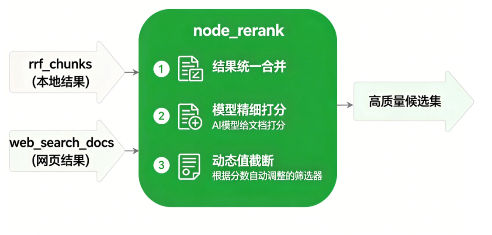
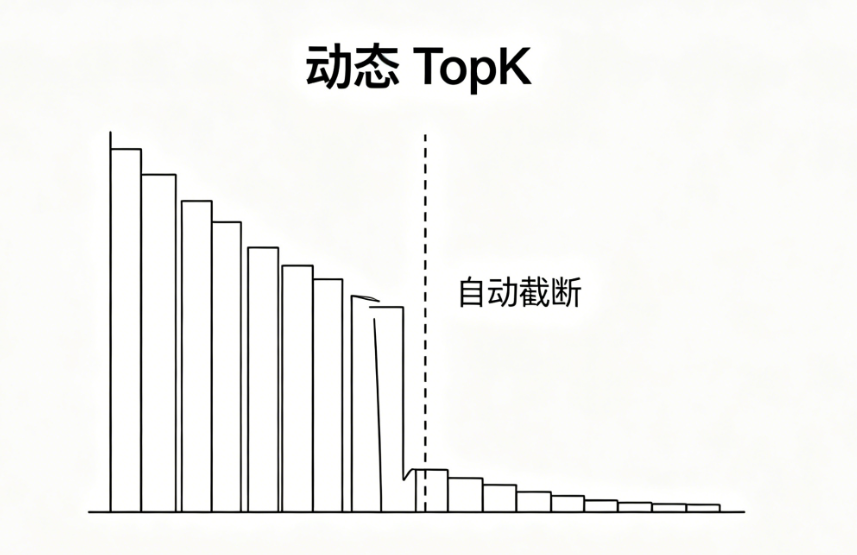

# 掌柜智库项目(RAG)实战

## 9. 检索数据节点实现与测试

### 9.6 重排节点（node_rerank）

**节点文件**: `app/process/query/agent/nodes/node_rerank.py`
**相关工具类位置**: `app/shared/utils/task_utils.py`

#### 场景背景与能力目标

经过前置流程，查询链已获得两类候选资源：**本地 RRF 融合后的高质量知识库切片**与**外网联网检索网页文档**。两类结果来源不同、打分体系不同，直接用于答案生成仍存在排序不一致、噪声残留、匹配精度不足等问题。

因此，在进入最终答案生成前，需要通过 `node_rerank` 完成**全局统一精排筛选**。



本节点不再做新的召回，而是对全链路已有候选结果做**精细化语义择优**，实现从 “找全内容” 到 “选准内容” 的能力升级。

系统分层设计边界清晰：

本地两路检索结果先通过 **RRF 粗融合**，解决多路检索排名互补合并问题；最终由 **Rerank 模型精排**，将本地知识库结果与外网网页结果纳入同一语义评分体系，完成全局统一择优。

**核心能力**

相较于 RRF 仅依靠排名位置做融合，Rerank 通过专属重排模型，**逐一对「用户问题 - 候选文档」做细粒度语义相关性打分**，能精准过滤噪声、修正排序偏差。

**实现思路**

1. **结果统一合并**：将 `rrf_chunks` 本地融合结果与 `web_search_docs` 外网结果规整为统一候选列表；
2. **模型精细打分**：依托重排模型，逐条计算文档与当前问题的真实语义相似度；
3. **动态阈值截断**：不固定取 TopN，根据分数断崖自动筛选高质量候选集合，保证最终输入内容精准、干净、无冗余。

#### 步骤分解

1. 从 `state` 中读取 `rrf_chunks` 和 `web_search_docs`；
2. 将两路结果整理成统一候选结构；
3. 读取当前问题 `rewritten_query`；
4. 使用重排模型自身的 tokenizer 计算“问题 + 文档”总 token 数；
5. 若候选文本超出 `512` 上下文限制，则先调用大模型做精炼；
6. 调用重排模型对“问题 - 文档”对计算相关性分数；
7. 按分数降序排序；
8. 根据动态 TopK 规则截断最终结果；
9. 将结果写入 `reranked_docs`。

#### 1. 节点与依赖定位

**节点文件**: `app/process/query/agent/nodes/node_rerank.py`
**对应 service 文件**: `app/rag/query/rerank_service.py`
**相关基础设施文件**:

- `app/infra/llm/providers.py`
- `app/shared/config/reranker_config.py`
- `app/shared/model/reranker_utils.py`

**相关提示词文件**:

- `app/resources/prompts/rerank_text_refine.prompt`

#### 2. 节点职责与 service 入口

**节点作用**: `node_rerank` 负责承接查询图状态、记录节点执行进度，并调用下层重排服务。

**对应 service 作用**: 这一节的重排逻辑拆成了 6 个核心函数：

1. `validate_rerank_inputs()`：读取重排阶段的两路输入；
2. `merge_rrf_and_web()`：统一整理本地结果和网页结果结构；
3. `build_question_pairs()`：使用重排模型 tokenizer 构造问答对，并检查上下文长度；
4. `summarize_long_rerank_text()`：当文本超长时，先调用大模型精炼后再参与重排；
5. `score_and_sort_chunks()`：调用重排模型打分并排序；
6. `dynamic_topk()`：根据分数断崖动态截断结果。

在这 4 个函数之外，又封装了一个业务主入口：

- `rerank_documents()`

它的职责是：

1. 先读取两路候选；
2. 再统一格式；
3. 再处理超长文本；
4. 再调用重排模型；
5. 最后做动态 TopK。

#### 3. 重排模型环境准备

##### 3.1 安装依赖

当前项目使用的是 `FlagEmbedding` 中提供的 `FlagReranker`：

```bash
# 基础安装（官方源，国内可替换为清华/阿里镜像）
uv add FlagEmbedding

# 国内镜像提速安装（推荐，解决下载慢问题）
uv add FlagEmbedding -i https://pypi.tuna.tsinghua.edu.cn/simple
```

##### 3.2 环境变量配置

项目 `.env.example` 中已经预留了重排模型配置：

```ini
BGE_RERANKER_LARGE=./models/bge-reranker-v2-m3
BGE_RERANKER_DEVICE=cpu
BGE_RERANKER_FP16=False
```

这三个配置分别控制：

1. 本地重排模型路径；
2. 模型运行设备；
3. 是否启用半精度推理。

下载reranker模型到本地:

```python
"""
工具脚本，用于处理 download reranker 相关的辅助任务。
"""
from modelscope.hub.snapshot_download import snapshot_download

local_dir = r"D:\ai_models\modelscope_cache\models\rerank"

snapshot_download(
    model_id="BAAI/bge-reranker-large",
    cache_dir=local_dir,
)

print("下载完成，模型目录：", local_dir)
```

##### 3.3 配置读取位置

**文件**: `app/shared/config/reranker_config.py`

```python
from dataclasses import dataclass

from app.shared.config.common import env_bool, env_str


@dataclass
class RerankerConfig:
    bge_reranker_large: str
    bge_reranker_device: str
    bge_reranker_fp16: bool


reranker_config = RerankerConfig(
    bge_reranker_large=env_str("BGE_RERANKER_LARGE"),
    bge_reranker_device=env_str("BGE_RERANKER_DEVICE"),
    bge_reranker_fp16=env_bool("BGE_RERANKER_FP16"),
)
```

这一层的作用，是统一读取重排模型相关配置，避免业务层到处直接读取环境变量。

##### 3.4 模型加载位置

**文件**: `app/shared/model/reranker_utils.py`

```python
from FlagEmbedding import FlagReranker

from app.shared.config.reranker_config import reranker_config
from app.shared.runtime.logger import logger

_reranker_model: FlagReranker | None = None


def get_reranker_model() -> FlagReranker:
    global _reranker_model
    if _reranker_model is None:
        logger.info("开始初始化重排模型")
        _reranker_model = FlagReranker(
            model_name_or_path=reranker_config.bge_reranker_large,
            device=reranker_config.bge_reranker_device,
            use_fp16=reranker_config.bge_reranker_fp16,
        )
        logger.success("重排模型初始化成功")
    return _reranker_model
```

这段代码的意义有两点：

1. 使用单例方式复用重排模型，避免每次请求重复初始化；
2. 把底层模型加载逻辑统一收口到公共模型模块。

##### 3.5 基础设施出口

**文件**: `app/infra/llm/providers.py`

当前查询链不是直接调用 `get_reranker_model()`，而是统一通过 `llm_provider.reranker_model()` 获取重排模型：

```python
class LLMProvider:
    def reranker_model(self):
        return get_reranker_model()
```

这样做的好处是：

1. 查询业务层只面向统一模型出口；
2. 聊天模型、Embedding 模型和 Reranker 模型都保持统一调用入口；
3. 上层业务逻辑不需要直接依赖底层模型实现细节。

##### 3.6 超长文本精炼提示词

**文件**: `app/resources/prompts/rerank_text_refine.prompt`

```text
你现在是文本精简提炼专家。请基于以下的问答，对回答文本进行精炼。
问题:{question}
回答:{answer}
1. 保留核心语义、关键信息、逻辑要点，删除废话、客套话、重复表述、修饰冗余语句；
2. 不改变原有事实、不新增编造信息、不曲解原意；
3. 输出精简后的合并文本，语言凝练、短句为主，适合向量化嵌入；
4. 不要分点、不要解释、不要多余话术，只输出精简结果。
5. 精炼后的回答不超过{limit}字
```

这一段提示词只在候选文本超长时触发，目的是先把候选文档压缩到适合 Reranker 上下文窗口的长度，再参与重排打分。

#### 4. 配置参数

当前 `rerank_service.py` 中，重排与动态截断一共使用了 7 个核心常量：

```python
RERANK_MAX_TOPK: int = 10
RERANK_MIN_TOPK: int = 1
RERANK_GAP_RATIO: float = 2
RERANK_GAP_ABS: float = 2
RERANK_MAX_INPUT_TOKENS: int = 512
RERANK_SUMMARY_CHAR_RATIO: float = 1.3
RERANK_MIN_SUMMARY_CHARS: int = 50
```

它们分别控制：

1. 最多保留多少条候选；
2. 最少保留多少条候选；
3. 相对分数落差阈值；
4. 绝对分数落差阈值；
5. 重排模型单次输入的最大 token 上限；
6. token 预算换算成中文精炼字数时使用的经验系数；
7. 文本精炼阶段允许的最小字数下限。

这些配置决定了这一节不是机械取固定 TopN，而是根据分数分布动态截断。

#### 5. 业务步骤分析

这一节涉及 7 个核心函数，主链路如下：

`node_rerank -> rerank_documents -> validate_rerank_inputs -> merge_rrf_and_web -> score_and_sort_chunks -> build_question_pairs -> summarize_long_rerank_text -> dynamic_topk`

##### 5.1 `node_rerank`

**函数签名**: `node_rerank(state: dict) -> dict`

**步骤**

1. 记录当前节点开始执行；
2. 调用 `rerank_documents(state)` 执行重排主流程；
3. 将结果写入 `state["reranked_docs"]`；
4. 记录当前节点执行完成；
5. 返回更新后的 `state`。

##### 5.2 `validate_rerank_inputs`

**函数签名**: `validate_rerank_inputs(state: dict) -> tuple[list[dict], list[dict]]`

**步骤**

1. 读取 `rrf_chunks`；
2. 读取 `web_search_docs`；
3. 返回两路候选结果。

##### 5.3 `merge_rrf_and_web`

**函数签名**: `merge_rrf_and_web(rrf_chunks: list[dict], web_search_docs: list[dict]) -> list[dict]`

**步骤**

1. 遍历本地融合结果；
2. 将本地结果统一整理成 `title / text / url / type / score` 结构；
3. 遍历网页搜索结果；
4. 将网页结果统一整理成同样结构；
5. 返回统一候选列表。

##### 5.4 `score_and_sort_chunks`

**函数签名**: `score_and_sort_chunks(state: dict, final_chunk_list: list[dict]) -> list[dict]`

**步骤**

1. 判断候选列表是否为空；
2. 读取当前问题 `rewritten_query`；
3. 调用 `llm_provider.reranker_model()` 获取重排模型；
4. 调用 `build_question_pairs()` 构造可用于打分的问答对；
5. 调用 `compute_score()` 计算相关性分数；
6. 将分数写回候选列表；
7. 按分数降序排序。

##### 5.5 `build_question_pairs`

**函数签名**: `build_question_pairs(question: str, final_chunk_list: list[dict], reranker) -> list[list[str]]`

**步骤**

1. 复用 `reranker.tokenizer` 作为分词器；
2. 对当前问题做分词；
3. 遍历每条候选文档；
4. 计算“问题 + 文档”总 token 数；
5. 如果超过 `RERANK_MAX_INPUT_TOKENS`，则调用 `summarize_long_rerank_text()` 先做精炼；
6. 生成最终用于重排打分的 `question_pairs`。

##### 5.6 `summarize_long_rerank_text`

**函数签名**: `summarize_long_rerank_text(question: str, answer: str, limit: int) -> str`

**步骤**

1. 加载 `rerank_text_refine.prompt`；
2. 把 `question`、`answer`、`limit` 填入提示词模板；
3. 调用 `llm_provider.chat()` 获取聊天模型；
4. 生成精炼后的回答文本；
5. 返回精炼结果，供重排模型继续打分。

##### 5.7 `dynamic_topk`

**函数签名**: `dynamic_topk(chunk_list_score_sorted: list[dict]) -> list[dict]`

**步骤**

1. 先读取最大、最小 TopK 和断崖阈值；
2. 从 `min_topk` 之后开始检查相邻文档分数差；
3. 如果出现明显分数断崖，则提前截断；
4. 如果没有断崖，则保留到最大候选数；
5. 返回最终候选列表。

#### 6. 节点代码实现

```python
import sys
from app.rag.query.rerank_service import rerank_documents
from app.shared.runtime.logger import node_log
from app.shared.utils.task_utils import add_done_task, add_running_task

@node_log("node_rerank")
def node_rerank(state):
    add_running_task(state["session_id"], sys._getframe().f_code.co_name, state.get("is_stream"))
    state["reranked_docs"] = rerank_documents(state)
    add_done_task(state["session_id"], sys._getframe().f_code.co_name, state.get("is_stream"))
    return state
```

这一层很轻，核心作用只有三件事：

1. 节点进度记录；
2. 调用下层重排服务；
3. 把结果写回 `reranked_docs`。

#### 7. service 总入口

`rerank_documents()` 是这一节的 service 总入口。它把“读取输入 -> 合并结构 -> 打分排序 -> 动态截断”这一整条链路串了起来。

```python
from langchain_core.messages import SystemMessage, HumanMessage
from langchain_core.output_parsers import StrOutputParser

from app.infra.llm.providers import llm_provider
from app.process.query.agent.state import QueryGraphState
from app.shared.runtime.load_prompt import load_prompt
from app.shared.runtime.logger import step_log, logger

# ====================== 重排全局配置 ======================
RERANK_MAX_TOPK: int = 10                # 动态截断最多保留10条结果
RERANK_MIN_TOPK: int = 1                 # 动态截断最少保留1条结果
RERANK_GAP_RATIO: float = 2              # 分数断崖比例阈值（用于动态截断）
RERANK_GAP_ABS: float = 2                # 分数断崖绝对值阈值
RERANK_MAX_INPUT_TOKENS: int = 512       # 重排模型最大输入token长度
RERANK_SUMMARY_CHAR_RATIO: float = 1.3   # 中文token与字符换算比例 1token≈1.3字符
RERANK_MIN_SUMMARY_CHARS: int = 50       # 文本精简后最小字符数


@step_log("rerank_documents")
def rerank_documents(state: QueryGraphState) -> list[dict]:
    """
    重排节点主入口
    流程：校验输入 → 合并本地+网页 → 模型打分排序 → 动态截断
    输出最终高质量候选文档列表
    """
    # 1. 校验输入
    rrf_chunks, web_search_docs = validate_rerank_inputs(state)
    # 2. 统一格式合并两路结果
    merged = merge_rrf_and_web(rrf_chunks, web_search_docs)
    # 3. 重排模型打分 + 排序
    sorted_docs = score_and_sort_chunks(state, merged)
    # 4. 动态截断，返回最优结果
    return dynamic_topk(sorted_docs)
```

这段主流程的价值有三点：

1. 把不同来源的候选统一放进一个重排流程里；
2. 在真正打分前，先把超出模型上下文限制的文本压缩到可用范围；
3. 让答案生成节点只面对已经精排过的高质量结果。

#### 8. 子函数 1：读取两路输入

```python
@step_log("validate_rerank_inputs")
def validate_rerank_inputs(state: dict) -> tuple[list[dict], list[dict]]:
    """
    校验重排节点输入是否合法
    允许本地结果为空 或 联网结果为空，但不允许两者都为空
    """
    rrf_chunks = state.get("rrf_chunks", [])
    web_search_docs = state.get("web_search_docs", [])

    # 必须至少一路有数据，否则 rerank 无内容可处理
    if not rrf_chunks and not web_search_docs:
        logger.error("rrf_chunks 和 web_search_docs 均为空，rerank 重排无有效数据！")
        raise ValueError("rerank 重排失败：本地融合结果与联网搜索结果均为空")

    return rrf_chunks, web_search_docs
```

这一层先把重排阶段要用到的两路数据拿出来，后续逻辑都基于这两组候选继续处理。

#### 9. 子函数 2：统一候选结构

```python
@step_log("merge_rrf_and_web")
def merge_rrf_and_web(rrf_chunks: list[dict], web_search_docs: list[dict]) -> list[dict]:
    """
    统一合并本地知识库结果 + 联网搜索结果
    统一字段格式，方便后续重排模型统一打分
    """
    final_chunk_list: list[dict] = []

    # 处理本地RRF融合结果
    for chunk in rrf_chunks or []:
        final_chunk_list.append({
            "title": chunk.get("title"),
            "text": chunk.get("content"),    # 本地知识库取content字段
            "url": None,                     # 本地数据无URL
            "type": chunk.get("type", "milvus"),
            "score": chunk.get("score", 0.0),
        })

    # 处理联网搜索网页结果
    for doc in web_search_docs or []:
        final_chunk_list.append({
            "title": doc.get("title"),
            "text": doc.get("snippet"),      # 网页结果取摘要snippet
            "url": doc.get("url"),           # 网页保留URL
            "type": "web",
            "score": 0.0,
        })

    return final_chunk_list
```

这一层的意义在于：本地结果和网页结果原始结构不同，必须先统一成同一套字段格式，后面的重排模型才能对它们做统一评分。

#### 10. 子函数 3：构造重排问答对

```python
@step_log("build_question_pairs")
def build_question_pairs(question: str, final_chunk_list: list[dict], reranker) -> list[list[str]]:
    """
    构建重排模型输入对：[问题, 文本]
    自动处理超长文本：超过模型最大输入则进行精简
    """
    tokenizer = reranker.tokenizer
    # 对问题进行token编码（不添加特殊符号）
    # [2123,321321,43545,6565,77675,8787878,98989,1]
    query_tokens = tokenizer.encode(question, add_special_tokens=False)
    question_pairs: list[list[str]] = []

    for item in final_chunk_list:
        answer = item.get("text") or ""
        answer_for_rerank = answer

        # 计算答案文本的token长度
        answer_tokens = tokenizer.encode(answer, add_special_tokens=False)
        logger.info(f"答案token长度:{len(answer_tokens)}")
		#num=tokenizer.num_special_tokens_to_add(pair=True)
        #logger.warning("=====" + num)
        # ['<s>', '问题...', '</s>', '</s>', '答案...', '</s>'] 4个字符
        total_tokens = len(query_tokens) + len(answer_tokens) + 4

        # 超过最大输入长度 → 调用LLM精简文本
        if total_tokens > RERANK_MAX_INPUT_TOKENS:
            # 计算允许保留的最大字符数（token → 字符换算）
            limit = max(
                RERANK_MIN_SUMMARY_CHARS, 50
                int((RERANK_MAX_INPUT_TOKENS - len(query_tokens) - 4) / RERANK_SUMMARY_CHAR_RATIO (1.3)),  20
            )
            # 精简超长文本
            answer_for_rerank = summarize_long_rerank_text(question=question, answer=answer, limit=limit)

        # 组装 [问题, 处理后答案] 对
        question_pairs.append([question, answer_for_rerank])

    return question_pairs
```

这一步是这次重排优化的关键点。它不再假设所有候选文本都能直接送进 Reranker，而是先用 Reranker 自己的 tokenizer 计算真实 token 长度，再决定是否需要压缩。

#### 11. 子函数 4：超长文本精炼

```python
@step_log("summarize_long_rerank_text")
def summarize_long_rerank_text(question: str, answer: str, limit: int) -> str:
    """
    超长文本精简：当文本超过重排模型最大输入长度时，调用LLM精简内容
    保证输入长度合规，同时保留与问题相关的核心信息
    """
    prompt = load_prompt(
        "rerank_text_refine",
        question=question,
        answer=answer,
        limit=limit,
    )
    messages = [
        SystemMessage(content="你现在是文本精简提炼专家。根据用户发送的文本完成文本精炼要求。"),
        HumanMessage(content=prompt),
    ]
    # 调用大模型精简文本并返回
    refined_answer = (llm_provider.chat() | StrOutputParser()).invoke(messages)
    return refined_answer
```

这一层的作用是：当候选文本太长，已经超过 Reranker 的上下文上限时，先让大模型做一次“只保留核心语义”的压缩，再参与后续重排打分。

#### 12. 子函数 5：重排打分与排序

```python
@step_log("score_and_sort_chunks")
def score_and_sort_chunks(state: dict, final_chunk_list: list[dict]) -> list[dict]:
    """
    调用重排模型对所有候选文档打分，并按分数从高到低排序
    """
    if not final_chunk_list:
        return []

    # 获取用户查询问题
    rewritten_query = state.get("rewritten_query") or state.get("original_query") or ""
    # 获取重排模型实例
    reranker = llm_provider.reranker_model()
    # 构建模型输入对
    question_pairs = build_question_pairs(rewritten_query, final_chunk_list, reranker)
    # 模型打分（归一化）
    score_list = reranker.compute_score(question_pairs, normalize=True)

    # 将分数写入文档
    for score, chunk in zip(score_list, final_chunk_list):
        chunk["score"] = round(score, 4)

    # 按分数降序排序
    final_chunk_list.sort(key=lambda x: x.get("score", 0.0), reverse=True)
    return final_chunk_list
```

这一层是真正执行重排模型评分的地方。它完成了两件事：

1. 让问题和每条候选文档组成二元对；
2. 让重排模型逐条计算相关性并重新排序。

和之前相比，这一版的关键变化是：打分前会先经过 `build_question_pairs()`，如果候选文本超长，会先做精炼再送入 `compute_score()`。

#### 13. 子函数 6：动态 TopK



```python
@step_log("dynamic_topk")
def dynamic_topk(chunk_list_score_sorted: list[dict]) -> list[dict]:
    """
    动态值截断：根据分数断崖自动决定保留多少条结果
    不是固定取前N条，而是找到分数突变的位置截断
    """
    min_topk = RERANK_MIN_TOPK
    max_topk = min(RERANK_MAX_TOPK, len(chunk_list_score_sorted))
    gap_ratio = RERANK_GAP_RATIO
    max_gap = RERANK_GAP_ABS
    topk = max_topk  # 默认取最大条数

    # 遍历寻找分数断崖
    if topk > min_topk:
        for index in range(min_topk - 1, max_topk - 1):
            score_1 = chunk_list_score_sorted[index].get("score", 0.0)
            score_2 = chunk_list_score_sorted[index + 1].get("score", 0.0)
            abs_score = score_1 - score_2  # 分数差
            ratio_score = abs_score / (score_1 + 1e-7)  # 比例差

            # 发现断崖 → 在此处截断
            if abs_score > max_gap or ratio_score > gap_ratio:
                topk = index + 1
                break

    # 返回截断后的结果
    return chunk_list_score_sorted[:topk]
```

这一层的作用，不是固定截取前几名，而是根据分数分布自动决定保留多少条结果。

这能避免把明显低质量的长尾候选一并带入答案生成阶段。

#### 14. 关键语法补充和说明

##### 14.1 `compute_score()` 的输入结构

当前重排模型不是一次只看一个问题，也不是只看一篇文档，而是接收一个“问题 - 文档”对列表：

```python
question_pairs = [[rewritten_query, item.get("text")] for item in final_chunk_list]
```

也就是说，每个元素都是：

1. 第一个位置是当前问题；
2. 第二个位置是候选文档正文。

模型会对每一对分别输出一个相关性分数。

##### 14.2 为什么这里要先做 token 检查

当前项目使用的 Reranker 模型上下文上限是 `512`。如果候选文本过长，直接送入 `compute_score()` 可能会触发截断，导致尾部关键信息丢失，评分结果不稳定。

因此这里先做两步：

1. 先通过 `reranker.tokenizer` 计算真实 token 长度；
2. 如果超限，再调用大模型把候选文本精炼到合适长度。

这样做的目标不是替换原文，而是为了给重排模型构造一个“在上下文限制内、同时尽量保留核心语义”的打分输入。

##### 14.3 为什么这里要 `normalize=True`

当前代码里：

```python
score_list = reranker.compute_score(question_pairs, normalize=True)
```

这里使用归一化分数，是为了让后续排序和动态 TopK 判断更稳定，分数尺度也更容易统一处理。

##### 14.4 为什么这一节要把网页结果也放进来

这一点必须讲清楚。

当前项目里：

1. `RRF` 只融合本地两路结果；
2. 网页结果不参与 `RRF`；
3. 真正把本地融合结果和网页结果放到同一个评分体系里比较，是从这一节开始。

所以 `node_rerank` 的核心定位，可以理解成：

- **查询链里第一次真正做跨来源统一精排。**

#### 15. 测试优化

##### 15.1 节点联调测试

如果要直接测试当前节点，可以构造一个最小状态：

```python
if __name__ == "__main__":
    mock_rrf_chunks = [
        {"chunk_id": "local_1", "content": "RRF是一种倒数排名融合算法", "title": "算法介绍"},
        {"chunk_id": "local_2", "content": "BGE是一个强大的重排序模型", "title": "模型介绍"},
    ]
    mock_web_docs = [
        {"title": "Rerank技术详解", "url": "http://web.com/1", "snippet": "Rerank即重排序，常用于RAG系统的第二阶段"},
    ]
    mock_state = {
        "session_id": "test_rerank_session",
        "rewritten_query": "什么是RRF和Rerank？",
        "rrf_chunks": mock_rrf_chunks,
        "web_search_docs": mock_web_docs,
        "is_stream": False,
    }
    result = node_rerank(mock_state)
    print(result)
```

这类测试适合验证：

1. 两路结果是否能正确合并；
2. 重排模型是否能正常返回分数；
3. `reranked_docs` 是否已经按分数排序；
4. 动态 TopK 是否能正确截断结果。

