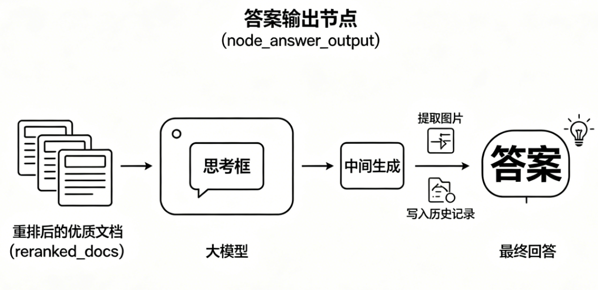

# 掌柜智库项目(RAG)实战

## 9. 检索数据节点实现与测试

### 9.7 答案输出节点（node_answer_output）

**节点文件**: `app/process/query/agent/nodes/node_answer_output.py`
**相关工具类位置**:

- `app/shared/utils/task_utils.py`
- `app/shared/utils/sse_utils.py`

#### 场景背景与能力目标

查询链前置链路已完成主体识别、多路召回、本地 RRF 融合、全局 Rerank 精排，已筛选出高质量、高相关的候选文档。



因此，`node_answer_output`**不再负责检索与筛选**，而是作为**全链路最终生成输出节点**，完成资料整合、答案生成、结果封装与状态落库，是用户可见回答的最终产出环节。

**本节点主要解决四类收尾问题：**

1. 兼容前置分支兜底逻辑，若上游已生成答复则直接复用，避免重复模型调用；
2. 基于重排后的优质文档、改写问句、对话历史、主体信息，统一组装生成 Prompt；
3. 调用大模型生成最终回答，同时支持**普通输出与流式增量输出**；
4. 自动提取配图资源，并将本轮问答结果持久化写入对话历史。

简言之：**前置链路负责 “找全、选准资料”，本节点负责 “组织内容、生成最终答案”。**

**整体流程分为五步：**

1. **复用校验**：优先判断状态中是否已存在前置答复，存在则直接复用；
2. **入参校验**：校验重排文档与用户问题的有效性，保证生成素材完备；
3. **Prompt 构建**：整合参考文档、对话上下文、业务主体信息，组装标准生成提示词；
4. **模型生成**：根据业务场景，执行普通 / 流式大模型推理，产出回答内容；
5. **结果封装落库**：提取图片链接，持久化本轮回答至对话历史。

**核心职责边界**

- **node_answer_output**：只负责**答案内容生成与业务层结果封装**；
- **流式 FINAL 结束事件**：由外层服务 `query_server.py` 在流程整体结束后统一推送，**不属于本节点职责**，实现模型生成与接口层解耦。

#### 步骤分解

1. 检查 `state` 中是否已经存在 `answer`；
2. 如果没有现成答案，则读取 `reranked_docs`、`item_names`、`rewritten_query` 和 `history`；
3. 构建答案生成 Prompt；
4. 调用大模型生成回答；
5. 从重排结果中提取图片链接；
6. 将 `answer` 和 `image_urls` 写回状态；
7. 将助手消息保存到 Mongo 历史记录。

#### 1. 节点与依赖定位

**节点文件**: `app/process/query/agent/nodes/node_answer_output.py`
**对应 service 文件**: `app/rag/query/answer_output_service.py`
**相关基础设施文件**:

- `app/infra/llm/providers.py`
- `app/infra/persistence/history_repository.py`
- `app/resources/prompts/answer_out.prompt`

#### 2. 节点职责与 service 入口

**节点作用**: `node_answer_output` 负责承接查询图状态、记录节点执行进度，并调用下层答案生成服务。

**对应 service 作用**: 当前答案输出逻辑拆成了 6 个核心函数：

1. `try_return_existing_answer()`：优先复用已经存在的答案；
2. `validate_generation_inputs()`：校验答案生成必需输入；
3. `build_history_text()`：整理历史对话文本；
4. `build_answer_prompt()`：构建答案生成 Prompt；
5. `generate_answer()`：调用大模型生成答案；
6. `extract_image_urls()` 与 `save_assistant_message()`：负责图片提取与历史落库。

在这些函数之外，又封装了一个业务主入口：

- `produce_answer()`

它的职责是：

1. 先检查是否已有现成答案；
2. 再构建 Prompt 并调用模型；
3. 最后提取图片并保存历史。

#### 3. 相关基础设施

##### 3.1 `llm_provider`

**文件**: `app/infra/llm/providers.py`

当前节点不会直接自己创建大模型客户端，而是统一通过：

```python
llm_provider.chat()
```

获取聊天模型实例。

它在这一节里承担的职责非常明确：

1. 提供最终答案生成用的大模型客户端；
2. 保持聊天模型调用方式和项目其他节点一致；
3. 让上层业务代码不直接依赖底层模型初始化细节。

##### 3.2 `history_repository`

**文件**: `app/infra/persistence/history_repository.py`

当前节点生成答案后，需要把助手消息写入历史记录，因此这里统一通过：

```python
history_repository.save_message(
    session_id=state["session_id"],
    role="assistant",
    text=state.get("answer"),
    rewritten_query=state.get("rewritten_query") or state.get("original_query"),
    item_names=state.get("item_names", []),
    image_urls=state.get("image_urls", []),
)
```

完成落库。

这一层的作用是：

1. 统一封装历史记录读写；
2. 屏蔽底层 Mongo 工具细节；
3. 保持查询链业务层只面向仓储接口编程。

##### 3.3 `load_prompt`

**文件**: `app/shared/runtime/load_prompt.py`

答案生成不是在代码里硬拼整段 Prompt，而是统一通过提示词模板加载：

```python
load_prompt(
    "answer_out",
    context=context_chunk_str,
    history=history_text,
    item_names=item_name_str,
    question=rewritten_query,
)
```

这样做的好处是：

1. 提示词独立管理；
2. 便于后续单独优化回答策略；
3. 教案里也更容易清楚展示 Prompt 模板和代码之间的关系。

#### 4. 提示词文件

**文件**: `app/resources/prompts/answer_out.prompt`

```text
你是一个智能助手，请根据参考内容回答用户的问题。
要求：
1 尽量基于【参考内容】和【用户问题】 作答，不要编造不存在的事实。
2 如果用户的问题需要通过图片来辅助说明（例如：外观、结构、接线、示意图等）,图片只能来自于本地切片文本中的图片，请在答案最后追加一个独立的图片区块，格式严格如下：
【图片】
<图片URL1>
<图片URL2>
（每行一个URL；如果没有合适图片则不要输出【图片】区块）

【参考内容】
{context}

【历史对话】
{history}

【相关商品/实体】
{item_names}

【用户问题】
{question}

请回答：
```

这一份 Prompt 的结构非常完整，它已经把答案输出阶段真正关心的 4 类输入全部定好了：

1. 参考内容；
2. 历史对话；
3. 关联主体；
4. 当前问题。

#### 5. 业务步骤分析

这一节涉及 7 个核心函数，主链路如下：

`node_answer_output -> produce_answer -> try_return_existing_answer / validate_generation_inputs / build_answer_prompt / generate_answer / extract_image_urls / save_assistant_message`

##### 5.1 `node_answer_output`

**函数签名**: `node_answer_output(state: dict) -> dict`

**步骤**

1. 记录当前节点开始执行；
2. 调用 `produce_answer(state)` 执行答案输出主流程；
3. 记录当前节点执行完成；
4. 返回更新后的 `state`。

##### 5.2 `try_return_existing_answer`

**函数签名**: `try_return_existing_answer(state: dict) -> bool`

**步骤**

1. 读取 `state["answer"]`；
2. 判断当前是否已经存在答案；
3. 如果存在答案，则直接复用；
4. 如果是流式模式，则按字符推送 `delta`；
5. 将最终答案写入任务结果；
6. 返回是否直接命中的布尔值。

##### 5.3 `validate_generation_inputs`

**函数签名**: `validate_generation_inputs(state: dict) -> tuple[list[dict], list[str], str, list[dict]]`

**步骤**

1. 读取 `history`；
2. 读取 `reranked_docs`；
3. 读取 `item_names`；
4. 读取 `rewritten_query` 或 `original_query`；
5. 校验关键字段是否为空；
6. 返回答案生成阶段所需的核心输入。

##### 5.4 `build_history_text`

**函数签名**: `build_history_text(history_messages: list[dict]) -> str`

**步骤**

1. 遍历历史消息列表；
2. 对用户消息优先取 `rewritten_query`；
3. 对助手消息取 `text`；
4. 同时拼接关联主体信息；
5. 返回可直接放入 Prompt 的历史上下文字符串。

##### 5.5 `build_answer_prompt`

**函数签名**: `build_answer_prompt(reranked_docs: list[dict], rewritten_query: str, item_names: list[str], history: list[dict]) -> str`

**步骤**

1. 遍历 `reranked_docs`，整理参考内容；
2. 标记标题、分数和来源类型；
3. 调用 `build_history_text()` 处理历史消息；
4. 整理主体名称字符串；
5. 调用 `load_prompt("answer_out", context=context_chunk_str, history=history_text, item_names=item_name_str, question=rewritten_query)` 构建最终 Prompt。

##### 5.6 `generate_answer`

**函数签名**: `generate_answer(state: dict, prompt: str) -> str`

**步骤**

1. 根据 `is_stream` 判断输出模式；
2. 调用 `llm_provider.chat()` 获取聊天模型；
3. 若是流式模式，则持续推送 `delta`；
4. 若是非流式模式，则直接调用 `invoke()`；
5. 将最终答案写入 `state["answer"]`；
6. 同时写入任务结果缓存。

##### 5.7 `extract_image_urls`

**函数签名**: `extract_image_urls(reranked_docs: list[dict]) -> list[str]`

**步骤**

1. 遍历所有重排结果；
2. 先检查 `url` 是否是直接图片链接；
3. 再用正则提取正文中的 Markdown 图片地址；
4. 去重后返回图片链接列表。

##### 5.8 `save_assistant_message`

**函数签名**: `save_assistant_message(state: dict) -> None`

**步骤**

1. 读取 `session_id`、`answer`、`rewritten_query`、`item_names` 和 `image_urls`；
2. 调用 `history_repository.save_message()` 保存助手回答；
3. 将本轮输出结果写入 Mongo 历史记录。

#### 6. 节点代码实现

```python
import sys
from app.shared.runtime.logger import node_log
from app.rag.query.answer_output_service import generate_answer
from app.shared.utils.task_utils import add_done_task, add_running_task


@node_log("node_answer_output")
def node_answer_output(state):
    add_running_task(state["session_id"], sys._getframe().f_code.co_name, state.get("is_stream"))
    state = generate_answer(state)
    add_done_task(state["session_id"], sys._getframe().f_code.co_name, state.get("is_stream"))
    return state
```

这一层依然很轻，核心作用只有三件事：

1. 节点进度记录；
2. 调用答案生成 service；
3. 返回写回完整结果后的最新状态。

#### 7. service 总入口

`generate_answer()` 是这一节的 service 总入口。它把“已有答案复用 -> Prompt 构建 -> 模型生成 -> 图片提取 -> 历史落库”这一整条链路串了起来。

```python
import re

from app.infra.llm.providers import llm_provider
from app.infra.persistence.history_repository import history_repository
from app.process.query.agent.state import QueryGraphState
from app.rag.query.item_name_confirm_service import build_history_text
from app.shared.runtime.load_prompt import load_prompt
from app.shared.utils.task_utils import add_done_task, add_running_task, push_to_session, set_task_result
from app.shared.utils.sse_utils import SSEEvent
from app.shared.runtime.logger import logger, step_log
import time

@step_log("generate_answer")
def generate_answer(state: dict) -> dict:
    """
    答案输出节点主入口（全流程编排）
    流程：
    1. 尝试复用已有答案
    2. 校验生成参数
    3. 构建 Prompt
    4. 调用模型生成答案
    5. 提取图片
    6. 保存历史记录
    """
    # 如果已有答案，直接返回
    if not try_return_existing_answer(state):
        # 校验输入
        reranked_docs, item_names, rewritten_query, history = validate_generation_inputs(state)
        # 构建提示词
        prompt = build_answer_prompt(reranked_docs, rewritten_query, item_names, history)
        # 生成答案
        final_answer(state, prompt)
        # 提取图片 URL
        state["image_urls"] = extract_image_urls(reranked_docs)

    # 保存助手消息到历史
    save_assistant_message(state)
    return state
```

这段主流程的价值有两点：

1. 优先复用已经存在的答案，避免重复调用模型；
2. 把答案生成、图片提取与历史落库统一收口到一个入口里。

#### 8. 子函数 1：已有答案优先返回

```python
@step_log("try_return_existing_answer")
def try_return_existing_answer(state: dict) -> bool:
    """
    复用已有答案：如果 state 中已存在 answer，直接返回，不再调用模型
    流式模式：逐字推送内容；非流式：直接设置结果
    """
    answer = state.get("answer")
    is_stream = state.get("is_stream", False)
    session_id = state.get("session_id")

    # 无现成答案，返回 False，继续生成
    if not answer:
        return False

    # 流式模式：逐字符推送增量消息
    if is_stream:
        for ch in answer:
            push_to_session(session_id, SSEEvent.DELTA, {"delta": ch})
            time.sleep(0.1)

    # 将最终答案写入任务结果
    set_task_result(session_id, "answer", answer)
    return True
```

这一层的意义非常重要。因为在前面的主体确认节点里，如果已经提前生成了澄清答复或兜底答复，这一节就不应该再重复去调一次模型。

#### 9. 子函数 2：答案生成入参校验

```python
@step_log("validate_generation_inputs")
def validate_generation_inputs(state: dict) -> tuple[list[dict], list[str], str, list[dict]]:
    """
    答案生成前的必填参数校验
    必须包含：reranked_docs（参考资料）、query（用户问题）
    """
    history = state.get("history", [])
    reranked_docs = state.get("reranked_docs")
    item_names = state.get("item_names", [])
    rewritten_query = state.get("rewritten_query") or state.get("original_query")

    # 关键校验：缺少资料或问题则无法生成
    if not reranked_docs or not rewritten_query:
        raise ValueError("生成答案需要 reranked_docs 和 rewritten_query/original_query")

    return reranked_docs, item_names, rewritten_query, history
```

这一层的作用，是确保答案生成真正开始之前，重排结果和当前问题已经准备完成。否则后面的 Prompt 组装和模型生成都没有可靠输入。

#### 10. 子函数 3：Prompt 组装

```python
@step_log("build_answer_prompt")
def build_answer_prompt(
    reranked_docs: list[dict],
    rewritten_query: str,
    item_names: list[str],
    history: list[dict],
) -> str:
    """
    构建最终答案生成的 Prompt
    整合：参考资料、得分、来源、对话历史、关联主体、用户问题
    """
    context_chunk_list = []
    # 遍历重排后的文档，按序号拼接参考内容
    for number, chunk in enumerate(reranked_docs, start=1):
        context_chunk_list.append(
            f"第{number}块: 标题:{chunk['title']} 匹配度得分:{chunk['score']} 来源:{'网络搜索' if chunk['type'] == 'web' else '向量查询'}\n内容:{chunk['text']}"
        )

    # 合并所有参考块
    context_chunk_str = "\n\n".join(context_chunk_list)
    # 格式化对话历史
    history_text = build_history_text(history)
    # 格式化关联主体
    item_name_str = "本次关联主体:" + ",".join(item_names) if item_names else "没有关联主体"

    # 加载 answer_out 模板，生成最终 Prompt
    return load_prompt(
        "answer_out",
        context=context_chunk_str,
        history=history_text,
        item_names=item_name_str,
        question=rewritten_query,
    )
```

这一层做的不是简单字符串拼接，而是把重排后的资料重新整理成“模型最容易消费”的输入格式。

其中最关键的部分有三个：

1. 参考内容按顺序编号；
2. 每一块内容都带上标题、得分和来源；
3. 历史对话与主体信息也一起拼进 Prompt。

#### 11. 子函数 4：答案生成

```python
@step_log("final_answer")
def final_answer(state: dict, prompt: str) -> str:
    """
    调用大模型生成最终答案
    支持：流式输出 / 普通输出
    结果存入 state 并同步到任务结果
    """
    is_stream = state.get("is_stream", False)
    session_id = state.get("session_id")
    lm_client = llm_provider.chat()
    final_result = ""

    # 流式生成：逐块接收并推送
    if is_stream:
        for chunk in lm_client.stream(prompt):
            delta_content = chunk.content
            final_result += delta_content
            push_to_session(session_id, SSEEvent.DELTA, {"delta": delta_content})
    # 普通生成：一次性调用
    else:
        response = lm_client.invoke(prompt)
        final_result = response.content

    # 保存答案到任务与状态
    set_task_result(session_id, "answer", final_result)
    state["answer"] = final_result
    return final_result
```

这一层是真正把 Prompt 送进大模型、拿回最终回答的地方。

它要同时兼容两种模式：

1. 非流式模式：直接拿完整答案；
2. 流式模式：边生成边推送 `delta`。

#### 12. 子函数 5：图片提取与历史落库

##### 12.1 图片提取

```python
@step_log("extract_image_urls")
def extract_image_urls(reranked_docs: list[dict]) -> list[str]:
    """
    从参考文档中提取所有图片 URL
    提取来源：
    1. doc.url 直接是图片链接
    2. text 内的 markdown 图片格式 
    """
    image_urls: list[str] = []
    # 匹配 markdown 图片正则
    reg = re.compile(r"\!\[.*?\]\((.*?)\)")

    for doc in reranked_docs:
        url = doc.get("url")
        text = doc.get("text")

        # 提取直接作为 URL 的图片
        if url and url.endswith((".png", ".jpg", ".gif", ".jpeg", ".svg")) and url not in image_urls:
            image_urls.append(url)

        # 提取文本中的 markdown 图片
        if text:
            for image_url in reg.findall(text):
                if image_url not in image_urls:
                    image_urls.append(image_url)

    return image_urls
```

这一层的关键意义在于：前端真正展示的图片，并不是完全依赖模型自由生成，而是从可信的参考文档里直接提取。

这样做有两个好处：

1. 图片来源可控；
2. 可以避免模型编造不存在的图片地址。

##### 12.2 历史落库

```python
@step_log("save_assistant_message")
def save_assistant_message(state: dict) -> None:
    """
    将助手回答保存到历史记录（Mongo）
    包含：答案、问题、主体、图片链接
    """
    history_repository.save_message(
        session_id=state["session_id"],
        role="assistant",
        text=state.get("answer"),
        rewritten_query=state.get("rewritten_query") or state.get("original_query"),
        item_names=state.get("item_names", []),
        image_urls=state.get("image_urls", []),
    )
```

这一层负责把本轮最终答案和图片链接一起写入 Mongo 历史记录，保证后续多轮问答还能拿到完整上下文。

#### 13. SSE 与任务结果的边界

这一节需要把两个工具职责讲清楚。

##### 13.1 `task_utils`

`task_utils` 负责：

1. 记录节点开始与完成；
2. 保存任务结果字段，例如 `answer`；
3. 给接口层提供统一的任务结果读取入口。

当前这一节里，最关键的调用是：

```python
set_task_result(session_id, "answer", final_result)
```

它的作用是把答案结果同步写进任务缓存，供非流式接口或流式收尾阶段读取。

##### 13.2 `sse_utils`

`sse_utils` 负责：

1. 维护会话级队列；
2. 推送 `ready / progress / delta / final / error` 等事件；
3. 供 `StreamingResponse` 逐步消费。

在当前答案输出阶段里，service 内部真正直接发送的是：

- `delta`

而最终完整结果：

- `final`

是在 `query_server.py` 的 `run_stream_query_background()` 中统一发送：

```python
push_to_session(
    session_id,
    SSEEvent.FINAL,
    {
        "answer": get_task_result(session_id, "answer") or state.get("answer", ""),
        "status": "completed",
        "image_urls": state.get("image_urls", []),
    },
)
```

所以当前项目里的职责划分应该这样理解：

1. `answer_output` 节点负责生成答案与图片结果；
2. `query_server` 负责在流式任务结束时统一推送最终完成事件。

#### 14. 关键语法补充和说明

##### 14.1 为什么用户历史优先取 `rewritten_query`

在 `build_history_text()` 中，用户消息优先读取的是：

```python
msg.get("rewritten_query")
```

原因是改写后的问题通常比原始口语问题更完整、更适合参与后续答案生成。

这能让多轮问答中的历史上下文更加稳定。

##### 14.2 正则提取 Markdown 图片

当前图片提取使用的是：

```python
re.compile(r"\!\[.*?\]\((.*?)\)")
```

它匹配的就是 Markdown 图片语法：

```markdown

```

这样就能把本地知识切片里的图片链接提取出来，给前端做展示。

##### 14.3 为什么答案输出阶段还要写历史记录

因为这一节生成的不是中间结果，而是最终用户可见回答。

如果这一轮助手消息不写入 Mongo，那么下一轮对话里，系统就拿不到完整的“上一轮助手怎么回答的”，多轮问答效果会明显变差。

#### 15. 测试优化

##### 15.1 节点联调测试

如果要直接测试当前节点，可以构造一个最小状态：

```python
if __name__ == "__main__":
    mock_reranked_docs = [
        {
            "chunk_id": "local_101",
            "type": "milvus",
            "title": "HAK 180 烫金机操作手册_v2.pdf",
            "score": 0.95,
            "text": """
            HAK 180 烫金机的操作面板位于机器正前方。
            具体的操作面板布局请参考下图：
            
            """,
        }
    ]
    mock_history = [
        {"role": "user", "text": "你好，这款机器怎么用？", "rewritten_query": "HAK 180 烫金机的具体操作步骤和面板设置方法"},
    ]
    mock_state = {
        "session_id": "test_answer_session_001",
        "original_query": "HAK 180 烫金机怎么操作？",
        "rewritten_query": "HAK 180 烫金机的具体操作步骤和面板设置方法",
        "item_names": ["HAK 180 烫金机"],
        "history": mock_history,
        "reranked_docs": mock_reranked_docs,
        "is_stream": False,
        "answer": None,
    }
    result = node_answer_output(mock_state)
    print(result)
```

这类测试适合验证：

1. Prompt 是否能正确构建；
2. 答案是否能正常生成；
3. 图片链接是否能被提取；
4. `answer` 与 `image_urls` 是否写回状态。
